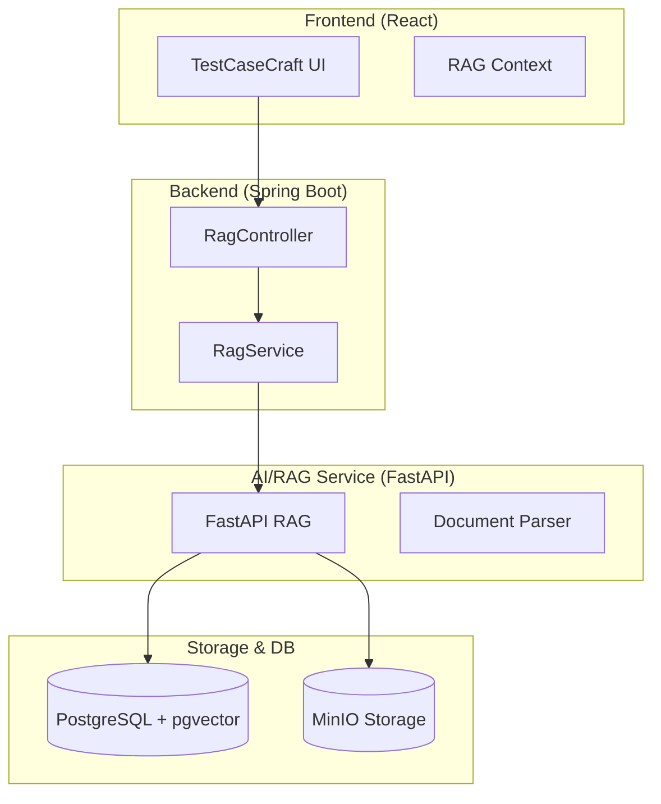

# 🧪 TestCaseCraft

실무 수준의 테스트 케이스 관리를 위한 통합 풀스택 솔루션입니다. 테스트 케이스의 계층적 관리, 실행 계획 수립, 결과 추적뿐만 아니라 AI 기반의 RAG 검색 및 JIRA 연동 기능을 제공합니다.

---

## 🌟 주요 기능

### 1. 테스트 케이스 관리 (Test Case Management)

- **계층 구조 트리**: 프로젝트 단위의 테스트 케이스를 트리 구조로 직관적 관리
- **버전 관리 및 이력**: 테스트 케이스의 변경 사항 추적
- **커스터마이징**: 프로젝트 특성에 맞는 필드 및 템플릿 설정

### 2. 🤖 RAG 기반 AI 도우미 (Retrieval-Augmented Generation)

- **유사 테스트 케이스 검색**: 벡터 유사도(pgvector)를 이용해 기존 케이스 중 가장 유사한 항목 추천
- **문서 분석 및 자동 생성**: 업로드된 문서(PDF, Docx 등)를 분석하여 테스트 케이스 초안 작성 지원
- **MinIO 통합**: 대규모 문서 파일의 안정적인 객체 스토리지 관리

### 3. 🔗 JIRA 통합 (Issue Tracking Integration)

- **양방향 연동**: JIRA 이슈와 테스트 케이스 간의 직접적인 링크 및 상태 동기화
- **자동 이슈 생성**: 테스트 실패 시 즉시 JIRA 결함 이슈 생성 지원
- **Python 기반 MCP 서버**: 확장성 있는 JIRA 연동 모듈 (`d_mcpsvr_jira`)

### 4. 🌍 다국어 지원 (i18n)

- **한국어/영어 완벽 지원**: UI 및 시스템 메시지의 다국어 처리
- **동적 번역 시스템**: 데이터베이스 기반의 유연한 번역 관리 플랫폼

---

## 🏗️ 기술 스택 (Tech Stack)

### Frontend

- **React 18**: SPA 기반의 모던 웹 UI
- **Material-UI (MUI)**: 일관된 디자인 시스템 및 컴포넌트 라이브러리
- **Context API + JWT**: 전역 상태 관리 및 보안 인증

### Backend

- **Spring Boot 3.4**: 고성능 Java 백엔드 프레임워크
- **Spring Data JPA**: 효율적인 데이터베이스 액세스
- **Java 21**: 최신 가상 스레드 및 언어 기능 활용

### RAG & Infra

- **FastAPI**: 파이썬 기반 고성능 RAG 서비스
- **PostgreSQL (pgvector)**: 관계형 데이터 및 벡터 검색 동시 지원
- **MinIO**: S3 호환 객체 스토리지
- **Docker Compose**: 통합 서비스 오케스트레이션

---

## 🚀 빠른 시작 (Getting Started)

### 1. 사전 요구 사항

- **Java 21** 이상
- **Node.js 20** 이상
- **Docker & Docker Compose**

### 2. 인프라 실행 (Docker)

모든 필수 인프라(DB, RAG, MinIO 등)를 한 번에 실행합니다.

```bash
cd docker-compose-dev-spring
docker-compose -f docker-compose-dev.yml up -d
```

### 3. 애플리케이션 실행

백엔드와 프론트엔드가 통합되어 실행됩니다.

```bash
# 프로젝트 루트에서
./gradlew bootRun
```

- **접속 주소**: `http://localhost:8080`
- **기본 계정**: `admin` / `admin123`

---

## 🧪 테스트 가이드 (Testing)

### 백엔드 테스트 (TestNG)

```bash
./gradlew test
# 리포트 확인
./gradlew allureReport
```

### E2E 테스트 (Playwright)

```bash
# E2E 테스트 실행
npx playwright test
```

---

## 📝 개발 가이드 및 상세 문서

- [JIRA 연동 가이드](docs/JIRA_INTEGRATION.md): JIRA 모듈 설정 및 사용법
- [E2E 테스트 상세](docs/E2E_TESTING_GUIDE.md): Playwright 테스트 작성 및 실행
- [RAG 시스템 아키텍처](rag-service/README.md): AI 검색 시스템 구성 상세
- [SBTM 도입 계획](sbtm/SBTM_IMPLEMENTATION_PLAN.md): 세션 기반 테스트 운영 및 기능화 단계 계획
- [SBTM 구현 현황](sbtm/SBTM_IMPLEMENTATION_STATUS.md): 현재 API 구현 범위 및 테스트 결과
- [SBTM 다음 진행 항목](sbtm/SBTM_NEXT_STEPS.md): 우선순위 기반 실행 백로그
- [SBTM 운영 노트](sbtm/SBTM_OPERATION_NOTES.md): 디브리프 규칙, 품질 게이트, 안티패턴
- [SBTM 세션 리포트 템플릿](sbtm/SBTM_SESSION_REPORT_TEMPLATE.md): 즉시 사용 가능한 리포트 양식

---

## 🏗️ 전체 아키텍처 (Arhitecture)



### 커밋 메시지 규칙 (Bilingual)

`[EN] Summary / [KO] 요약` 형식을 사용합니다.

- 예: `[EN] Add RAG search API / [KO] RAG 검색 API 추가`

---

© 2025-2026 TestCaseCraft Team.
