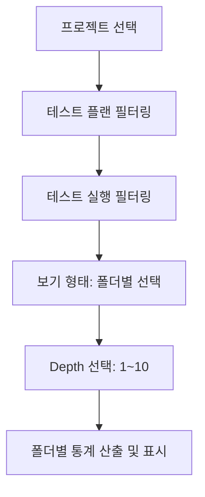

# 테스트케이스 폴더별 통계 기능 구현 계획

테스트 결과 대시보드에서 테스트케이스를 폴더 구조 및 Depth별로 그룹화하여 통계를 볼 수 있는 기능을 구현합니다.

## 1. 개요
현재 대시보드는 전체 개요, 플랜별, 실행자별 비교 기능만 제공합니다. 사용자가 특정 플랜과 실행을 필터링한 상태에서 '폴더별' 보기를 선택하고 Depth(1~10)를 조정하면, 해당 조건에 맞는 폴더별 하위 통계를 집계하여 제공합니다.

### 필터 연동 구조

## 2. 변경 계획

### 프론트엔드 (React)

#### [MODIFY] [StatisticsFilterPanel.jsx](file:///Users/dicky/kmdata/git/testcase/testcasecraft/src/main/frontend/src/components/StatisticsFilterPanel.jsx)
- `viewType`에 'by-folder' 옵션 추가
- `viewType`이 'by-folder'일 때만 활성화되는 'Depth' 선택 필터(1~10) 추가
- 기본 Depth 값은 1로 설정

#### [MODIFY] [TestResultStatisticsDashboard.jsx](file:///Users/dicky/kmdata/git/testcase/testcasecraft/src/main/frontend/src/components/TestResultStatisticsDashboard.jsx)
- `folderStatistics` 상태 추가
- `loadComparisonData` 함수 확장: `by-folder` 모드 지원
- `calculateFolderStatistics` 함수 구현:
    - `testResultService.getDetailedTestResultReport` (또는 필터링된 리포트 API)를 통해 전체 데이터를 가져옴
    - 각 케이스의 `folderPath` (예: "Userv2.0/로그인/로그아웃/응답신뢰성")를 파싱
    - **그룹화 로직**:
        - 선택된 `depth`가 2라면, 경로를 Depth 2까지 자름 (예: "Userv2.0 > 로그인/로그아웃")
        - 해당 경로를 키로 하여 통계를 집계
        - **하위 폴더 분리**: 같은 Depth 1 아래에 있더라도 Depth 2가 다르면 서로 다른 항목으로 분리하여 표시
    - 그룹별로 PASS/FAIL/BLOCKED/NOT_RUN 개수 집계 및 성공률 계산
- UI 렌더링: `by-folder` 모드일 때 집계된 폴더별 통계를 차트 또는 테이블로 표시

### 백엔드 (Spring Boot)
- 기존 [TestResultReportDto](file:///Users/dicky/kmdata/git/testcase/testcasecraft/src/main/java/com/testcase/testcasemanagement/dto/TestResultReportDto.java#16-69)에 `folderPath`가 이미 포함되어 있으므로, 추가적인 백엔드 수정 없이 프론트엔드 로직만으로 구현 가능함을 확인했습니다.

## 3. 검증 계획

### 수동 검증
1. 테스트 결과 페이지로 이동
2. '보기 형태'를 '폴더별'로 선택
3. 'Depth'를 1로 선택했을 때, 최상위 폴더별로 통계가 정확히 집계되는지 확인
4. 'Depth'를 2, 3으로 변경하며 하위 폴더별로 상세 통계가 표시되는지 확인
5. 각 통계 수치(PASS, FAIL 등)가 하위 케이스들의 합계와 일치하는지 검증
