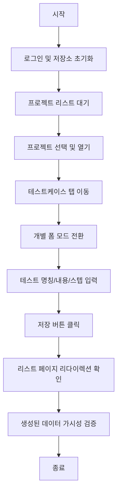
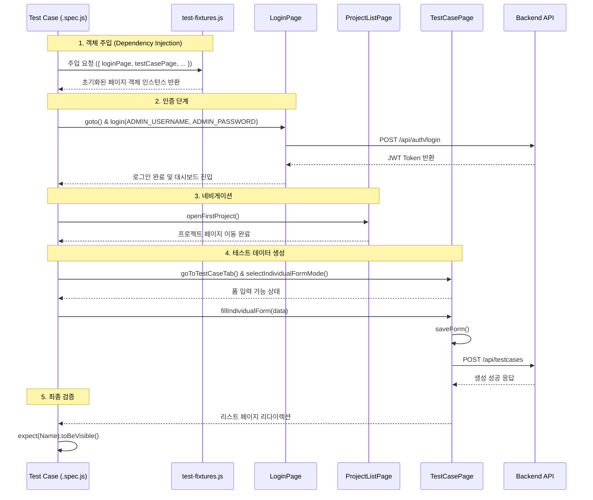

# E2E Testing Guide (최종 업데이트: 2026-02-06)

이 문서는 Playwright를 사용한 E2E (End-to-End) 테스트 작성 및 실행 가이드입니다.

## 📋 목차

1. [E2E 테스트 개요](#-e2e-테스트-개요)
2. [환경 설정](#-환경-설정)
3. [테스트 실행 방법](#-테스트-실행-방법)
4. [테스트 작성 가이드](#-테스트-작성-가이드)
5. [트러블슈팅](#-트러블슈팅)

## 🎯 E2E 테스트 개요

### 테스트 목적

- **인증 플로우 검증**: 로그인/로그아웃/세션 관리
- **UI 컴포넌트 검증**: Material-UI 렌더링 및 반응형 디자인
- **사용자 플로우 검증**: 실제 사용자 시나리오 테스트
- **성능 검증**: 페이지 로딩 시간 및 반응성 측정

### 테스트 구조

```
src/test/e2e/
├── fixtures/                # Playwright Fixtures (페이지 객체 자동 주입)
├── pages/                   # Page Object Model 클래스 (UI 요소 및 동작 정의)
│   ├── BasePage.js          # 모든 페이지의 부모 (공통 기능 정의)
│   ├── LoginPage.js
│   ├── ProjectListPage.js
│   └── ...
├── authentication/          # 인증 관련 테스트 스펙
├── dashboard/               # 대시보드 관련 테스트 스펙
├── project/                 # 프로젝트 관리 테스트 스펙
├── regression/              # 통합 회귀 테스트 스펙
├── config/                  # E2E 테스트 공통 설정 (인증 정보 등)
│   └── credentials.js       # 중앙화된 관리자 계정 저장
├── playwright.config.js     # Playwright 전체 설정
├── package.json             # E2E 전용 의존성 설정
└── test-results/            # 테스트 결과 및 스크린샷
```

## 🔧 환경 설정

### 전제 조건

1. **Node.js**: Playwright 실행을 위한 Node.js 환경
2. **Java 21**: 백엔드 실행을 위한 Java 환경
3. **인프라**: Docker Compose를 통한 PostgreSQL 및 MinIO 실행

### 초기 설정 (최초 1회)

E2E 테스트 디렉토리에서 필요한 패키지와 브라우저를 설치해야 합니다.

```bash
cd src/test/e2e
npm install
npx playwright install chromium
```

### Playwright 설정

`src/test/e2e/playwright.config.js` 파일에서 주요 설정을 관리합니다.

- **BaseURL**: `http://localhost:8080` (백엔드가 서빙하는 프론트엔드 주소)
- **Test Matches**: `**/*.js` 또는 `**/*.spec.js`
- **Timeout**: 기본 30,000ms

## 🚀 테스트 실행 방법

### ⚠️ 중요: 테스트 실행 전 확인 사항

테스트가 정상적으로 동작하려면 다음 서비스들이 실행 중이어야 합니다:

1.  **인프라 (Docker)**: `docker-compose-build` 디렉토리에서 PostgreSQL, MinIO 등이 구동 중이어야 합니다.
2.  **백엔드 서버**: 프로젝트 루트에서 `./gradlew bootRun`을 통해 애플리케이션이 구동 중이어야 합니다 (`http://localhost:8080`).

### 테스트 실행 방법

이 프로젝트에는 두 가지 방식의 E2E 테스트가 존재합니다.

#### 1. Playwright Test Runner (표준 방식)

설정 파일(`playwright.config.js`)을 기반으로 테스트를 실행합니다.

```bash
# E2E 디렉토리로 이동
cd src/test/e2e

# 모든 테스트 실행
npx playwright test

# 특정 파일 실행
npx playwright test regression/create-testcase-form.spec.js

# UI 모드로 실행 (브라우저 확인)
npx playwright test --workers=1 --headed

# 특정 파일만 실행 (UI 모드)
npx playwright test regression --workers=1 --reporter=line --headed
```

#### 2. 독립 실행형 Node 스크립트 (Standalone)

일반 Node.js 스크립트로 작성된 테스트입니다. (과거 버전 호환용)

```bash
# E2E 디렉토리로 이동
cd src/test/e2e

# node 명령어로 직접 실행
node attachment-complete-test.js
```

### 테스트 결과 확인

- **HTML 리포트**: `npx playwright show-report`
- **스크린샷**: `src/test/e2e/regression/screenshots/` 또는 `src/test/e2e/test-results/` 디렉토리 확인

## 📝 테스트 작성 가이드

### 1. Page Object Model (POM) 구조

코드의 재사용성과 유지보수성을 위해 모든 테스트는 POM 방식을 준수해야 합니다.

#### BasePage (`pages/BasePage.js`)

모든 페이지 객체는 `BasePage`를 상속받습니다. 스크린샷 캡처(`screen()`)나 공통 대기 로직이 포함되어 있습니다.

#### Page Objects (`pages/*.js`)

특정 화면의 셀렉터와 비즈니스 동작을 정의합니다.

```javascript
class LoginPage extends BasePage {
  constructor(page, testInfo) {
    super(page, testInfo);
    this.usernameInput = page.locator('input[name="username"]');
  }
  async login(id, pw) {
    /* 로직 정의 */
  }
}
```

### 2. Playwright Fixtures 활용

`fixtures/test-fixtures.js`를 통해 페이지 객체를 자동으로 주입받습니다. 테스트 시 수동으로 `new Page()`를 호출할 필요가 없습니다.

#### 기본 테스트 구조 예시

```javascript
const { test, expect } = require("../fixtures/test-fixtures.js");
const { ADMIN_USERNAME, ADMIN_PASSWORD } = require("../config/credentials.js");

test("테스트 시나리오 설명", async ({ loginPage, projectListPage, page }) => {
  // 1. 주입받은 loginPage 사용
  await loginPage.goto();
  await loginPage.login(ADMIN_USERNAME, ADMIN_PASSWORD);

  // 2. BasePage의 공통 기능 사용
  await loginPage.screen("after-login");

  // 3. 페이지 이동 후 검증
  await projectListPage.waitForLoad();
  await expect(page).toHaveURL(/.*projects/);
});
```

### 3. 테스트 작성 규칙

#### 네이밍 컨벤션

- **파일**: `{기능명}.spec.js` (소문자, 하이픈 사용)
- **스크린샷**: `01-step-name.png` 형식으로 순번 부여

#### 선택자(Selector) 가이드

- **우선순위**: `data-testid` > `Role` > `Text` > `CSS Selector`
- **data-testid**: 가급적 `getByTestId()`를 활용하여 안정성을 확보하세요.

#### 인증 정보 중앙화

- 테스트 코드 내에 계정 정보(`admin`/`admin123` 등)를 하드코딩하지 않습니다.
- `src/test/e2e/config/credentials.js`에서 `ADMIN_USERNAME`, `ADMIN_PASSWORD`를 임포트하여 사용합니다.
- CI/CD 환경 적용을 위해, 필요 시 `TEST_ADMIN_USERNAME`, `TEST_ADMIN_PASSWORD` 환경 변수로 주입합니다.

## � 트러블슈팅

### 1. 모듈을 찾을 수 없는 오류 (Cannot find module 'playwright')

- **원인**: `src/test/e2e` 디렉토리에서 `npm install`을 실행하지 않음
- **해결**: `cd src/test/e2e && npm install` 실행

### 2. 브라우저 실행 실패 (Executable doesn't exist)

- **원인**: Playwright 브라우저 바이너리가 설치되지 않음
- **해결**: `npx playwright install chromium` 실행

### 3. 연결 거부 (ECONNREFUSED)

- **원인**: 백엔드 서버(`localhost:8080`)가 실행 중이지 않음
- **해결**: 프로젝트 루트에서 `./gradlew bootRun` 실행 상태 확인

### 4. 타임아웃 오류

- **원인**: 네트워크 지연 또는 백엔드 초기화 중
- **해결**: `page.goto`나 `waitForSelector`의 `timeout` 값을 늘리거나, 백엔드 서버가 완전히 뜰 때까지 대기

## 🔍 UI 구조 및 네비게이션 가이드

**현재 애플리케이션 플로우**:

```
로그인 (/) → 프로젝트 페이지 (/projects) → 개별 프로젝트 (/projects/{id}) → 탭 메뉴
```

**주요 탭 메뉴 경로**:

- 대시보드: `/projects/{id}/dashboard`
- 테스트케이스: `/projects/{id}/testcases`
- 테스트실행: `/projects/{id}/executions`
- 자동화 테스트: `/projects/{id}/automation`

## 📊 테스트 실행 시나리오 예시

`regression/create-testcase-form.spec.js` 파일을 예시로 하여 전체적인 테스트 흐름과 컴포넌트 간 상호작용을 설명합니다.

### 1. 테스트 비즈니스 로직 (Flowchart)

테스트가 수행하는 기능적 단계를 나타냅니다.



### 2. 컴포넌트 간 상호작용 (Sequence Diagram)

테스트 코드, Fixture, Page Object 및 Backend API 간의 메시지 흐름을 나타냅니다.



---

## 📚 관련 문서

- **[README.md](../../README.md)** - 프로젝트 전체 개요
- **[DEVELOPMENT_GUIDE.md](./DEVELOPMENT_GUIDE.md)** - 개발 환경 설정
- **[API 가이드](./API_GUIDE.md)** - API 개발 가이드라인
- **[GitHub Actions 가이드](./GITHUB_ACTION_GUIDE.md)** - Docker 빌드 및 배포 자동화
