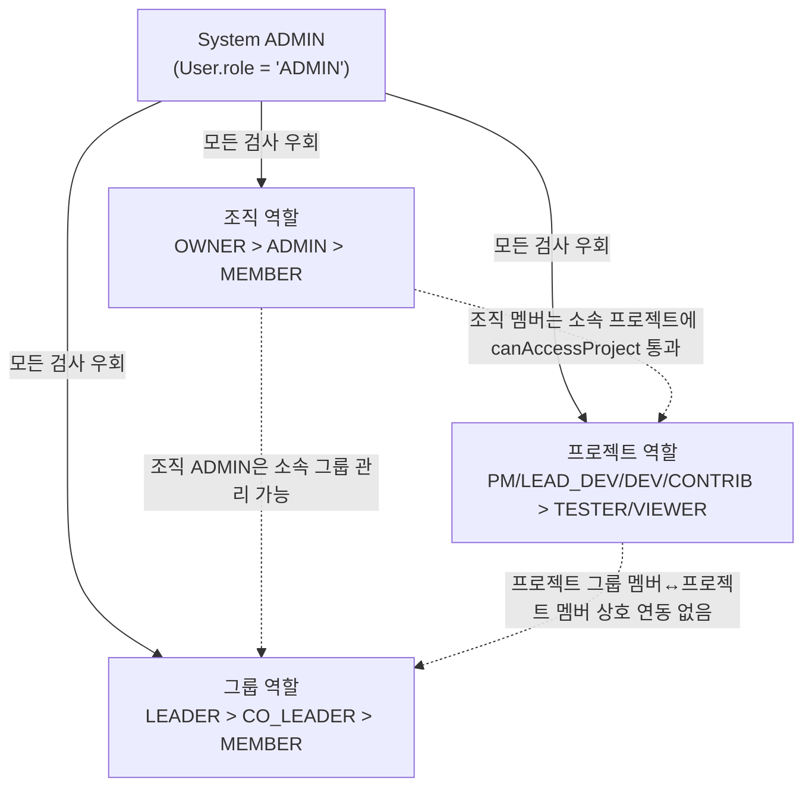
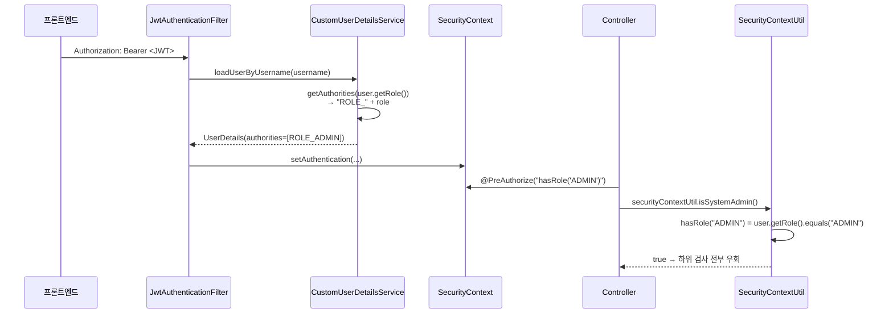
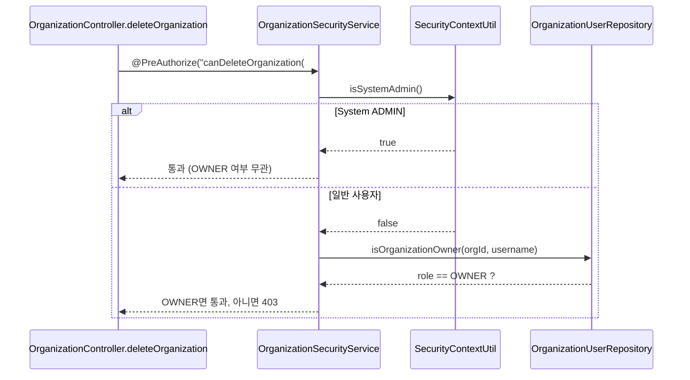
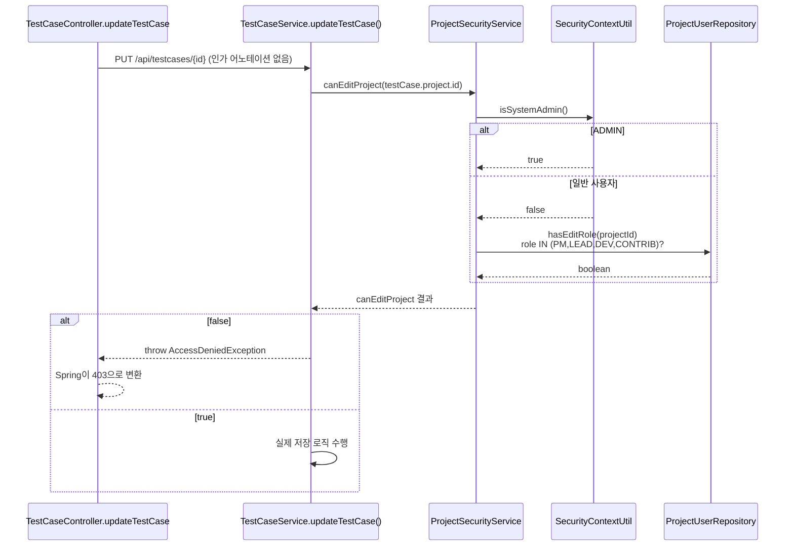
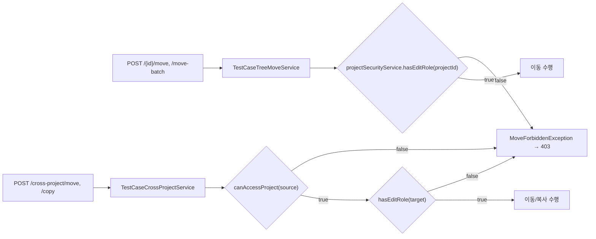
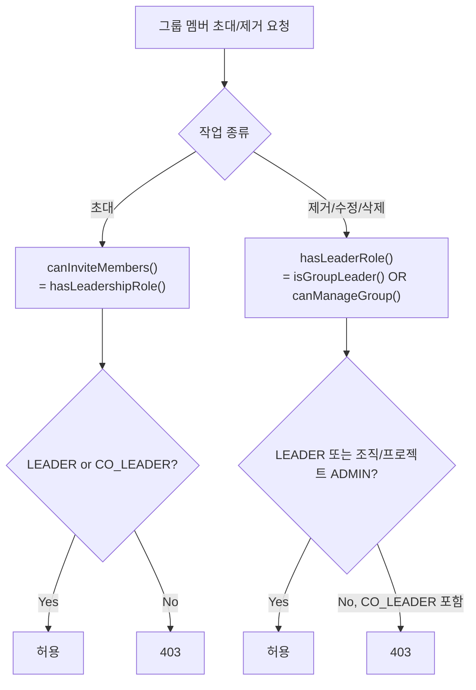

# 15. 역할 기반 인가(RBAC) 체계 정밀 분석

- 작성일: 2026-07-01
- 브랜치: `fix/authz-hardening` (HEAD: 5c1a3969)
- 방법론: 4개 서브에이전트(시스템/조직/그룹/프로젝트 역할) 병렬 분석 → 직접 코드 교차검증(grep/git show)으로 정정
- 검증 스탠스: 에이전트 원본 주장은 "TestCaseController 등 50+ 엔드포인트가 인가 전무(CRITICAL)"였으나, `@PreAuthorize` 어노테이션만 검색했기 때문에 **서비스 레이어의 수동 체크를 놓쳤다.** 아래 내용은 직접 grep/git show로 재검증한 결과다.
- **후속 조치(같은 날, 미커밋):** 6장 리스크 표 #0(CRITICAL 신규 발견)·#1(HIGH)·#2(HIGH)·#3(MEDIUM)을 코드로 조치. 상세는 각 절의 "조치 완료" 표기와 7장 참조.

---

## 1. 역할 계층 개관

testcasecraft에는 단일 RBAC 모델이 아니라 **스코프별로 독립된 4개의 역할 체계**가 존재한다. 상위 스코프의 "ADMIN"이 하위 스코프 검사를 우회하는 계층 구조다.



핵심: **System ADMIN 우회는 4계층 모두에 동일 패턴(`SecurityContextUtil.isSystemAdmin()` 또는 `user.getRole()=="ADMIN"`)으로 하드코딩되어 있다.** 그룹↔프로젝트 간에는 단방향 접근만 있고 권한이 자동 상속되지 않는다(3장 참조).

---

## 2. 시스템 전역 역할 (`User.role`)

### 2.1 정의

`model/User.java:40` — `private String role;` (**enum 아닌 문자열**, 주석상 `ADMIN, MANAGER, TESTER, null`). DB 제약도, DTO/서비스 레벨 값 검증도 없다.

### 2.2 요청 처리 플로우



`CustomUserDetailsService.java:48-50`에서 `"ROLE_" + role`로 GrantedAuthority를 만들기 때문에 `@PreAuthorize("hasRole('ADMIN')")`과 `SecurityContextUtil.isSystemAdmin()`(문자열 직접 비교) 두 경로가 **독립적으로 병존**한다. 값 검증이 없어 `role="admin"`(소문자)처럼 저장되면 두 경로 모두 조용히 실패한다(에러 없이 그냥 권한 없음으로 처리됨).

### 2.3 실사용 현황 (교차검증 결과)

| 역할 | 코드상 사용처 | 실질 권한 |
|---|---|---|
| `ADMIN` | `SecurityContextUtil.isSystemAdmin()` 32건 호출 — 4개 레이어 전체의 슈퍼유저 우회 | 사실상 유일하게 의미있는 값 |
| `MANAGER` | (수정 전) `SecurityConfig`의 `/api/manager/**` 규칙(매핑 컨트롤러 없음), `isManager()` 헬퍼(호출 0건) — **그러나** `TestExecutionService.java:778,902`에서 `"MANAGER".equals(currentUser.getRole())`로 **직접 문자열 비교하여 이전 결과 수정/삭제 권한을 실제로 검사함** | **조치 완료(6장 #6, 7장 5번)** — 죽은 라우트 규칙과 `isManager()` 헬퍼는 삭제, 실사용 중인 `TestExecutionService`의 문자열 비교 체크는 그대로 유지(관리자 UI로 부여 가능한 정상 기능이었음이 재확인됨) |
| `TESTER` | (수정 전) `AuthController.registerUser()`의 회원가입 기본값, `@PreAuthorize`에 일부 등장(JunitResultController 등) + `/api/tester/**` 규칙(매핑 컨트롤러 없음) | 회원가입 시 사실상 전원에게 부여되는 기본 역할(그대로 유지). **조치 완료** — `/api/tester/**` 죽은 라우트 규칙과 `isTester()` 헬퍼는 삭제 |
| 프론트 `VIEWER`/`USER` | (수정 전) `TestCaseForm.jsx:175,208`, `TestResultForm.jsx:62`, `ProjectManager.jsx:136`, `TestExecutionList.jsx:93`, `useTestCaseActions.jsx:184` 등에서 `user?.role === "VIEWER"`/`"USER"` 참조 | **조치 완료(4.6절 참조)** — 신설된 `useProjectRole()` 훅으로 프로젝트 role을 조회해 사용하도록 전면 교체. 수정 전에는 백엔드 `User.role` 값 집합(ADMIN/MANAGER/TESTER/null)에 존재하지 않는 값과 비교해 HIGH 등급 실질 버그였음(VIEWER 조건 항상 false → 자동저장/수정 UI 항상 활성화, USER 조건도 항상 false → 삭제 차단 등 권한 로직 무력화). 근본 원인은 `types/common.js`의 JSDoc 타입이 백엔드 enum 변경 전 버전(`ADMIN\|MANAGER\|USER`)을 따르던 것으로 추정(타입 정의 자체는 이번 조치 범위 밖) |

직접 검증(수정 전 `SecurityConfig.java:120-134`, 현재는 `/api/manager\|tester/**` 두 줄 삭제됨):
```java
.requestMatchers("/api/admin/**").hasRole("ADMIN")
.requestMatchers("/api/manager/**").hasRole("MANAGER")   // 매핑된 컨트롤러 없음 → 삭제됨
.requestMatchers("/api/tester/**").hasRole("TESTER")     // 매핑된 컨트롤러 없음 → 삭제됨
```

**결론(수정 후): 시스템 전역 역할은 여전히 사실상 `ADMIN` vs `그 외` 이분법이다.** `MANAGER`는 체크 로직이 살아있고 관리자 UI로 부여 가능한 정상 기능으로 재확인되어 유지했으며, 죽은 라우트/헬퍼만 정리했다. `TESTER`는 기본값일 뿐 시스템 레벨의 특별한 권한은 없다(단, 프로젝트 레벨에서는 4.1/4.6절 조치로 결과 기록 권한을 갖는다). 프론트의 `VIEWER`/`USER` 참조 버그는 `useProjectRole()` 도입으로 해소되었다.

### 2.4 CRITICAL(수정 완료): 회원가입 시 임의 `role` 자가부여 가능했음

`AuthController.java:69` — `POST /api/auth/register`는 `SecurityConfig`에서 `permitAll()`(비인증 접근 허용)인데, 수정 전 코드는 다음과 같았다:

```java
public ResponseEntity<?> registerUser(@RequestBody User user) { // DTO가 아닌 엔티티를 그대로 바인딩
  ...
  newUser.setRole(user.getRole() != null ? user.getRole() : "TESTER"); // 클라이언트 입력값을 그대로 신뢰
}
```

즉 누구나 `POST /api/auth/register` 바디에 `"role": "ADMIN"`을 포함해 보내면 **인증 없이 시스템 ADMIN 계정을 즉시 생성**할 수 있었다 — Mass Assignment(OWASP API3:2023 Broken Object Property Level Authorization)에 해당하는 **CRITICAL** 미인증 권한상승 취약점이다. 4개 에이전트 및 최초 분석 모두 놓친 항목.

**조치 완료:** `newUser.setRole("TESTER")`로 고정, 클라이언트가 보낸 `role` 값을 완전히 무시하도록 수정. 특권 role 부여는 `UserManagementController`(`@PreAuthorize("hasRole('ADMIN')")`)를 통해서만 가능하도록 유지.

---

## 3. 조직 역할 (`OrganizationUser.OrganizationRole`)

### 3.1 정의 및 메서드 매트릭스

`model/OrganizationUser.java:58` — `OWNER > ADMIN > MEMBER`. `OrganizationSecurityService`(16개 메서드) 중 8개가 System ADMIN 우회를 포함.

| 메서드 | 필요 역할 | System ADMIN 우회 |
|---|---|---|
| `canAccessOrganization()` | MEMBER | ✅ (라인 95) |
| `canManageOrganization()` | OWNER\|ADMIN | ✅ (라인 119) |
| `canInviteMembers()` | OWNER\|ADMIN | ✅ (canManageOrganization 위임) |
| `canRemoveMember()` | OWNER\|ADMIN (OWNER 제거는 OWNER만) | ✅ (라인 142) |
| `canDeleteOrganization()` | OWNER | ✅ (라인 197) |

### 3.2 코드 플로우 — 조직 삭제



### 3.3 확정된 허점

1. **조직당 OWNER 수 제약 없음(HIGH)** — `OrganizationService.inviteMember()`(316-371줄)에서 OWNER 역할을 검증 없이 여러 명에게 부여 가능. `transferOwnership()`(277-284줄)이 `findFirst()`로 첫 OWNER만 찾기 때문에 다중 OWNER 상태에서 동작이 불안정해진다.
2. **OrganizationController 자체는 완전 보호** — 12개 엔드포인트 모두 `@PreAuthorize` 적용 확인(교차검증 완료, `OrganizationController.java` 전체 재확인).
3. 원 에이전트가 "TestCase 계열 50+ 엔드포인트 인가 전무"라고 지목한 부분은 **오판** — 4장 참조.

---

## 4. 프로젝트 역할 (`ProjectUser.ProjectRole`) — 핵심 정정 구간

### 4.1 정의

`model/ProjectUser.java:58` — `PROJECT_MANAGER, LEAD_DEVELOPER, DEVELOPER, TESTER, CONTRIBUTOR, VIEWER`.

편의 메서드: `hasManagementPrivileges()`(PM\|LEAD), `canEdit()`(PM\|LEAD\|DEV\|CONTRIB — **DEVELOPER와 CONTRIBUTOR는 구분 없음**), `canOnlyView()`(VIEWER).

**설계 모순(신규 확인):** `TestExecutionService.updateTestResult()`(테스트 실행 결과 기록 — 테스터의 핵심 업무)는 `canEditProject()` → `hasEditRole()`을 호출하는데, 이 메서드는 `PROJECT_MANAGER/LEAD_DEVELOPER/DEVELOPER/CONTRIBUTOR`만 포함하고 **정작 이름이 "TESTER"인 역할은 제외**되어 있다(`ProjectUserRepository.java:100-102`). 즉 프로젝트에 TESTER로 초대된 사용자는 테스트 결과를 기록할 수 없다 — 역할명과 실제 권한이 정반대인 설계 결함. 의도된 설계인지 버그인지 제품 결정이 필요해 이번 조치 범위에서는 수정하지 않고 기록만 남긴다.

### 4.2 쓰기(CRUD) 플로우 — 실제로는 보호되어 있음

최근 커밋 `73ec66a8`(TestCase/Plan/Execution)과 `562e4e9b`(RAG)가 **서비스 레이어**에 인가를 추가했다. 컨트롤러에 `@PreAuthorize`가 없어서 두 에이전트가 "인가 전무"로 오판했지만, 실제 체크는 한 단계 아래에 있다.



이 패턴이 `TestCaseService`(4곳), `TestPlanService`(3곳), `TestExecutionService`(9곳) 총 16개 변경 메서드에 동일하게 적용됨(git show 73ec66a8로 검증). `VIEWER`/`TESTER`는 `hasEditRole()`이 false이므로 이 경로를 통과하지 못하고 403을 받는다 — **편집 차단은 실제로 작동한다.**

### 4.3 (수정 완료) 읽기(GET) 엔드포인트 무방비 — HIGH

4개 에이전트 중 누구도 짚지 않은 부분이다. 직접 grep으로 확인:

```
$ grep -rn "canAccessProject" TestCaseService.java TestPlanService.java TestExecutionService.java
(수정 전: 결과 없음 — 세 서비스 어디에도 읽기 접근 검사가 없었다)
```

- `TestCaseController`: `GET /`, `/tree`, `/{id}`, `/project/{projectId}`, `/projects/{projectId}/tags`, `/projects/{projectId}/by-display-id/{displayId}`, `/export/csv\|excel\|json` — 인가 검사 전무
- `TestPlanController`: `GET /{id}`, `/project/{projectId}` — 인가 검사 전무
- `TestExecutionController`: `GET /`, `/{id}`, `/by-project/{projectId}`, `/by-testcase/{testCaseId}` — 인가 검사 전무

**영향(OWASP API1:2023 Broken Object Level Authorization에 해당):** 인증만 되어 있으면 어떤 사용자든 자신이 속하지 않은 프로젝트의 테스트케이스/계획/실행 결과를 **ID만 알면(추측/열거 시)** 직접 GET으로 조회 가능했다. 프론트엔드가 "접근 가능한 프로젝트 목록"만 보여줘서 실무상 노출 경로가 가려져 있을 뿐, API 레벨에서는 열려 있었다. `73ec66a8` 커밋 메시지도 "변경 메서드 16개"라고 스코프를 명시하고 있어 읽기 경로는 처음부터 이번 하드닝 대상이 아니었다.

**추가 확인된 사실:** `TestCaseController`의 `GET /`(전체 조회)와 `GET /tree`는 `projectId` 파라미터 자체가 없이 **시스템 전체 테스트케이스를 프로젝트 구분 없이 반환**하고 있었다(단순 IDOR보다 심각 — ID 추측조차 불필요). `TestExecutionController`의 `GET /`도 `testPlanId`를 생략하면 동일하게 전체 반환.

**조치 완료:**
- `projectId`가 명확한 경로(`getTestCasesByProjectId`, `getTestCaseDtoById`, `getProjectTags`, `findByDisplayIdWithRedirect`, `getTestPlanById`, `getTestPlansByProject`, `getTestExecutionById`, `getTestExecutionsByProject`, `getTestResultsByTestCaseId`, `getTestExecutions(testPlanId)`)에는 `ProjectSecurityService.canAccessProject()` 체크 추가. CSV/Excel/JSON 내보내기는 내부적으로 `getTestCasesByProjectId()`를 재사용하므로 동일하게 보호됨.
- 프로젝트 스코프가 없는 전체 조회(`TestCase GET /`, `/tree`, `TestExecution GET /` — testPlanId 미지정 시)는 시스템 ADMIN만 허용하도록 제한(`ProjectSecurityService.isSystemAdmin()` 신규 공개 메서드 활용). `TestCaseGoogleSheetExporter`(내부 전용, 컨트롤러 미노출)와 그 통합테스트는 이 전체조회 메서드(`getAllTestCases()`) 자체가 아니라 상위 래퍼(`getAllTestCasesWithParentName`/`getAllTestCasesForTree`)에만 가드를 추가해 영향받지 않도록 함.
- 컨트롤러의 광범위한 `catch (Exception e)`가 `AccessDeniedException`을 403 대신 404/500으로 삼키던 지점(TestCase 4곳, TestPlan 1곳) 수정.

### 4.4 이동/복사 플로우 — 정상 보호 확인 (에이전트가 "불명확"으로 남긴 부분 해소)



다만 `TestCaseTreeMoveService`는 `canEditProject()`(ADMIN 자동 통과 포함) 대신 `hasEditRole()`을 **직접** 호출한다 — System ADMIN이라도 대상 프로젝트에 멤버로 등록되어 있지 않으면 이동이 막히는 **일관성 불일치**(단, 보안 방향이 아니라 오히려 더 엄격한 쪽이라 취약점은 아님).

### 4.5 역할 간 실질 차등

| 역할 | `hasEditRole()` | 편집 | 조회 |
|---|---|---|---|
| PROJECT_MANAGER / LEAD_DEVELOPER | ✓ | ✓ | ✓(`canAccessProject()` 체크 — 4.3 조치 완료) |
| DEVELOPER / CONTRIBUTOR | ✓ (**둘 다 동일, 구분 로직 없음**) | ✓ | ✓(동일) |
| TESTER / VIEWER | ✗ | ✗ (403, **TESTER도 결과 기록 불가 — 4.1 참조**) | ✓(동일 — 프로젝트 멤버이므로 `canAccessProject()` 통과) |

### 4.6 (수정 완료) 프론트엔드의 시스템/프로젝트 role 혼동 — HIGH

**근본 원인:** 프론트엔드가 편집 버튼 노출 여부를 판단할 때 시스템 role(`User.role`: `ADMIN/MANAGER/TESTER/null`)과 프로젝트 role(`ProjectUser.ProjectRole`: `PROJECT_MANAGER/LEAD_DEVELOPER/DEVELOPER/TESTER/CONTRIBUTOR/VIEWER`)을 혼동해, `user?.role === "VIEWER"`/`"USER"`처럼 **백엔드에 존재하지 않는 값과 시스템 role을 비교**하고 있었다. 이 조건은 항상 false이므로:
- `TestCaseForm`/`TestResultForm`: 편집 잠금(`isViewer`)이 사실상 작동하지 않음(항상 편집 가능하게 보임 — 실제 저장은 백엔드 403으로 막히지만 UI는 계속 편집 가능한 것처럼 보여줌).
- `TestCaseTree`/`useTestCaseActions`/`TreeHeader`: 추가/삭제/이름변경 버튼이 TESTER/VIEWER 프로젝트 멤버에게도 노출됨.
- `TestExecutionList`: 실행 생성/삭제 버튼도 동일 문제(`isAdminOrManager`가 시스템 role 기준).
- `ProjectManager.hasProjectCreationAccess`: 반대 방향 버그 — 허용목록에 "USER"만 있고 백엔드가 실제로 허용하는 `role=null` 계정이 빠져 있어, 정상 사용자가 독립 프로젝트 생성 버튼을 못 보는 경우가 있었다.

**프론트엔드도 실제 보안 경계는 아니다(서버가 최종 방어선)**는 점은 변함없지만, 잘못된 UI 상태는 "편집했는데 저장 시 403" 같은 나쁜 UX와 신뢰도 저하를 유발한다.

**조치 완료:**
1. `src/hooks/useProjectRole.js` 신설 — `GET /api/projects/{projectId}/members`를 조회해 현재 사용자의 프로젝트 role을 찾아 반환. 시스템 ADMIN은 백엔드와 동일하게 멤버 조회 없이 우회(`"ADMIN"` 센티널).
2. `AuthController.getMyInfo()`(`/api/auth/me`)에 `id` 필드 추가 — 기존엔 로그인 직후에만 `user.id`가 존재하고 토큰 갱신 후 재조회 시 사라지는 잠재 버그가 있었음(이번 기능의 사용자 매칭에 필요해 함께 수정).
3. `TestCaseTree/utils/permissionUtils.js`의 `isViewer`/`canAdd`/`canDelete`를 프로젝트 role 기준·fail-closed(모르는 값은 편집 불가)로 재정의하고 `canEditProjectContent` 공통 함수로 통합.
4. `TestCaseForm.jsx`, `TestResultForm.jsx`, `TestCaseTree.jsx`, `useTestCaseActions.jsx`, `TestExecutionList.jsx`에서 시스템 role 참조를 `useProjectRole()` 결과로 교체. `TreeHeader.jsx`의 죽은 조건(`userRole !== "USER"`) 제거.
5. `ProjectManager.hasProjectCreationAccess`를 백엔드 `canCreateProject(organizationId=null)`(=`isAuthenticated()`)와 동일하게 "인증된 사용자면 허용"으로 단순화.
6. 프론트 단위테스트(`permissionUtils.test.js`, `ProjectManager.test.jsx`)를 새 계약에 맞게 갱신 — 특히 `ProjectManager.test.jsx`가 백엔드에 존재하지 않는 시스템 role `"VIEWER"`로 검증하던 케이스를 실제 계약(`role=null`도 허용, `user` 자체가 없을 때만 차단)으로 정정.

**검증:** 프론트 전체 테스트 317/317 통과, `vite build` 성공, ADMIN 계정으로 ShopFlow 프로젝트 실제 로그인·트리 진입 확인(콘솔 에러 없음, ADMIN 우회 경로가 멤버 API 호출 없이 정상 동작). TESTER/VIEWER 프로젝트 role 계정으로의 실사용자 브라우저 검증은 이번 세션에서는 수행하지 못함(운영 중인 개발 DB의 계정 비밀번호를 알 수 없어 보류) — 필요 시 테스트 계정을 제공받아 추가 검증 가능.

---

## 5. 그룹 역할 (`GroupMember.GroupRole`)

### 5.1 정의 및 실제 권한 매트릭스

`model/GroupMember.java:56` — `LEADER, CO_LEADER, MEMBER`. 정의상 CO_LEADER는 "부 리더"(보조 관리)지만, `GroupSecurityService`의 실제 게이트는 `hasLeaderRole()`(= `isGroupLeader() | canManageGroup()`, **CO_LEADER 미포함**)을 쓴다.

| 작업 | LEADER | CO_LEADER | 근거 |
|---|---|---|---|
| 멤버 초대 | ✓ | ✓ | `canInviteMembers = hasLeadershipRole` (LEADER\|CO_LEADER) |
| 멤버 제거 | ✓(다른 LEADER 제외) | ✗ | `canRemoveMember`는 `isGroupLeader()`만 체크 |
| 그룹 수정/삭제 | ✓ | ✗ | `GroupController`가 `hasLeaderRole()` 사용 |
| 역할 변경 | ✓ | ✗ | 동일 |



**허점(HIGH):** CO_LEADER는 초대만 가능하고 제거/수정/삭제/역할변경이 전부 막혀 있어 "부 리더"라는 이름에 걸맞은 실질 권한이 거의 없다. 두 게이트 메서드(`hasLeadershipRole` vs `hasLeaderRole`)의 이름이 비슷해 헷갈리기 쉽고, 실제로 4개 에이전트 중 하나도 이 구분을 정확히 짚기 전까지는 혼동 소지가 있었다.

### 5.2 그룹 ↔ 프로젝트 연동 부재

```
프로젝트 그룹(Group.project ≠ null)의 멤버가 되어도
→ ProjectUser 레코드가 자동 생성되지 않음
→ 그룹 멤버라는 사실만으로는 프로젝트 CRUD 권한을 얻지 못함(별도로 ProjectUser 초대 필요)
```
역방향(`GroupSecurityService.java:100-105, 174-178`)은 존재한다: 프로젝트 멤버는 해당 프로젝트의 그룹을 조회할 수 있고(`canAccessGroup`), **프로젝트 관리자(PM/LEAD 이상, `canManageProject()`)는 해당 프로젝트의 그룹 멤버 관리(초대/제거/역할변경/그룹 생성)까지 위임받는다**(`canManageGroup`/`canInviteMembers`/`canRemoveMember`/`canCreateGroup` 모두 내부적으로 `projectSecurityService`를 호출, 재검증 완료). 즉 **단방향 종속**이며, 일반 프로젝트 멤버는 그룹 조회만 가능하고 그룹 관리는 프로젝트 관리자 이상만 가능하다. 그룹 기능이 프로젝트 권한을 그룹 쪽으로 자동 위임하는 수단으로는 아직 완성되어 있지 않다(재검증 결과, 기존 서술 정확함 — 위 괄호 설명만 보완).

---

## 6. 종합 리스크 표 (심각도순, 교차검증 완료분만)

| # | 항목 | 심각도 | 위치 | 상태 |
|---|---|---|---|---|
| 0 | 회원가입(`/api/auth/register`, permitAll)이 클라이언트가 보낸 `role`을 그대로 신뢰 → 인증 없이 ADMIN 자가부여 가능 | **CRITICAL** | `AuthController.java:69-108` | **조치 완료** — role을 서버에서 "TESTER"로 고정, 클라이언트 입력 무시 |
| 1 | TestCase/Plan/Execution **읽기** 엔드포인트에 프로젝트 멤버십 검사 없음(일부는 projectId조차 없이 전체 반환) | **HIGH** | `TestCase\|TestPlan\|TestExecutionService`(GET 경로) | **조치 완료** — `canAccessProject()` 체크 추가, 스코프 없는 전체조회는 ADMIN 전용화 |
| 2 | 조직당 OWNER 수 제약 없음 → `transferOwnership()` 불안정 | HIGH | `OrganizationService.java:316-371, 277-284` | **조치 완료** — `inviteMember()`/`updateMemberRole()` 양쪽에 OWNER 유일성 검증 추가 |
| 2b | 프로젝트 `TESTER` 역할이 테스트 결과 기록(`updateTestResult`) 불가 — 역할명과 실권한 불일치 | MEDIUM (설계) | `TestExecutionService.updateTestResult()`, `ProjectUserRepository.java:100-102` | **조치 완료** — `hasResultEntryRole()`/`canRecordTestResult()` 신설, TESTER에게 결과 기록 권한 부여(테스트케이스/플랜 편집 권한은 그대로 없음) |
| 3 | `User.role` 값 검증 부재(임의 문자열 저장 가능) | MEDIUM | `User.java:40`, `UserDto`, `UserManagementService` | **조치 완료** — `UpdateRequest`/`ChangeRoleRequest`/`CreateRequest`에 `@Pattern(ADMIN\|MANAGER\|TESTER)` 추가 |
| 4 | CO_LEADER 역할이 사실상 초대 전용으로 무력화 | MEDIUM | `GroupSecurityService.java:221-257` | **조치 완료** — `hasLeaderRole()`이 `hasLeadershipRole()`(LEADER+CO_LEADER)을 사용하도록 변경, `canRemoveMember()`도 CO_LEADER에게 개방(단, LEADER는 제거 불가 규칙 유지) |
| 5 | 프론트/백엔드 role 값 불일치 (`VIEWER`/`USER`가 백엔드에 없음) — 관련 권한 UI 로직이 항상 같은 분기로 빠지는 실질 버그 | **HIGH**(재평가, 기존 MEDIUM에서 상향) | `TestCaseForm.jsx:175,208`, `TestResultForm.jsx:62`, `ProjectManager.jsx:136`, `TestExecutionList.jsx:93`, `useTestCaseActions.jsx:184` | **조치 완료** — 신규 `useProjectRole()` 훅으로 프로젝트 role 연동 (아래 4.6 참조) |
| 6 | `MANAGER` 시스템 역할: 체크 로직(`TestExecutionService:778,902`)은 살아있으나 부여 수단이 없는 "도달 불가능한 권한". `TESTER`/`/api/manager\|tester/**` 라우트는 순수 죽은 코드 | LOW | `SecurityConfig.java:126-129`, `isManager/isTester()`, `TestExecutionService.java:778,902` | **조치 완료(죽은 코드만)** — `SecurityConfig`의 `/api/manager\|tester/**` 규칙과 `isManager()`/`isTester()` 헬퍼 삭제. `TestExecutionService`의 실사용 MANAGER 체크는 유지 |
| 7 | RAG 검색(`/api/rag/search/*`)이 projectId nullable이라 전역 검색 허용 | LOW | `RagController` | 의도된 설계, 문서화만 필요 |

**정정된 오탐(에이전트 원 보고 → 실제):**
- ~~"TestCaseController 50+ 엔드포인트 인가 전무(CRITICAL)"~~ → 쓰기는 서비스 레이어에서 `canEditProject()`로 보호됨. 읽기는 표 #1대로 실제 허점이었으나 조치 완료.
- ~~"cross-project move/copy 인가 불명확"~~ → `hasEditRole(target)` + `canAccessProject(source)` 이중 체크로 정상 보호 확인.
- **4개 에이전트 및 최초 분석 모두 놓친 항목**: 표 #0 (회원가입 role 자가부여) — 재분석 과정에서 신규 발견, 가장 심각한 항목이었음.

---

## 7. 권장 조치 우선순위 (진행 상태)

1. ~~**P0** — `TestCaseService`/`TestPlanService`/`TestExecutionService`의 조회 메서드에 `canAccessProject()` 체크 추가~~ **완료**. `ProjectSecurityService.isSystemAdmin()` 신규 메서드로 프로젝트 스코프 없는 전체조회도 방어. 컨트롤러의 `catch(Exception)`이 403을 삼키던 지점도 수정.
2. ~~**P1** — `OrganizationService.inviteMember()`에 OWNER 역할 부여 시 기존 OWNER 존재 여부 검증 추가~~ **완료**. 동일 취약점이 있던 `updateMemberRole()`에도 동일 검증 추가(문서 작성 시점엔 미확인이었던 2차 경로).
3. ~~**P1** — `User.role`에 DTO `@Pattern` 또는 enum 전환으로 값 검증 도입~~ **완료**(Pattern 방식 채택 — enum 전환은 blast radius가 커서 보류). 작업 중 **CRITICAL** 등급의 회원가입 자가부여 취약점(표 #0)을 발견해 함께 수정.
4. ~~**P2** — 프론트엔드의 `VIEWER`/`USER` 참조를 프로젝트 레벨 role과 시스템 레벨 role로 명확히 분리~~ **완료**. `useProjectRole()` 훅 신설 + 5개 파일 교체, 상세는 4.6 참조. 근본 원인은 `types/common.js`의 구버전 JSDoc 타입으로 추정(타입 정의 자체는 이번 조치 범위 밖 — 별도 정리 권장).
5. ~~**P2** — `MANAGER`/`TESTER` 시스템 역할과 `/api/manager/**`, `/api/tester/**` 라우트를 실제로 쓸지, 제거할지 결정~~ **완료(죽은 코드만 정리 방침 채택)**. `SecurityConfig`의 `/api/manager\|tester/**` 규칙과 `SecurityContextUtil.isManager()`/`isTester()`(호출부 0건 확인 후) 삭제. `TestExecutionService`의 실사용 `"MANAGER".equals(...)` 체크는 그대로 유지(관리자 UI로 부여 가능한 정상 기능이었음).
6. ~~**P3** — CO_LEADER 권한 범위 재정의~~ **완료(LEADER에 준하게 확대 방침 채택)**. `GroupSecurityService.hasLeaderRole()`이 `hasLeadershipRole()`(LEADER+CO_LEADER)을 쓰도록 변경해 그룹 수정/삭제/역할변경 권한을 CO_LEADER까지 확장. `canRemoveMember()`도 동일하게 CO_LEADER에게 개방하되, "LEADER는 리더십 역할 보유자가 제거할 수 없다"는 기존 보호 규칙은 그대로 유지(부 리더가 정 리더를 축출하는 것 방지).
7. ~~**신규** — 프로젝트 `TESTER` 역할이 테스트 결과를 기록할 수 없는 설계 모순(표 #2b)~~ **완료(TESTER에게 결과기록 권한 부여 방침 채택)**. `ProjectUserRepository.hasResultEntryRole()`(편집 롤 + TESTER) 신설 → `ProjectSecurityService.canRecordTestResult()` → `TestExecutionService.updateTestResult()`/`updateTestResultsBulk()`에 적용. 프론트 `permissionUtils.canRecordTestResult()`도 동일 규칙으로 동기화(`TestResultForm.jsx`). 테스트케이스/플랜 자체의 편집 권한(`hasEditRole()`)은 TESTER에게 여전히 없음 — 결과 기록만 예외적으로 허용.

**독립 서브에이전트 검수(security-reviewer) 결과:** 위 조치 전체에 대해 별도 에이전트로 교차검증 수행. `canAccessProject`/`isSystemAdmin` 체크의 null 안전성, `GlobalExceptionHandler`의 403 변환 경로, `OrganizationService` OWNER 유일성 체크와 `createOrganization()`/자기 자신 재승격 케이스 간 충돌 여부를 모두 확인했고 **문제 없음**으로 판정. 유일한 지적 사항은 `OrganizationDataInitializer.java:248`의 시드 데이터가 `user.setRole("USER")`로 문서화되지 않은 값을 쓰고 있었던 것(MEDIUM, 운영 미영향 — `testcase.init.enabled=true`일 때만 실행되는 개발용 초기화 코드) — `"TESTER"`로 정정 완료.

**최종 상태(2026-07-01 세션 종료 시점):** 표 #0~#6 전 항목 조치 완료. #7(RAG 전역검색)만 의도된 설계로 남김. 백엔드 테스트 261/261(전 항목 조치 반영 후 전체 재실행 기준), 프론트 테스트 318/318, `vite build` 성공. 상세 검증 방법은 4.6절 하단 참조.

---

## 8. 참고 — 에이전트 원본 리포트 위치

- 시스템 역할: `/private/tmp/.../scratchpad/system-role-analysis.md`
- 조직 역할: `/private/tmp/.../scratchpad/ORGANIZATION_ROLE_AUDIT.md`
- 그룹 역할: `/private/tmp/.../scratchpad/group_role_analysis.md`
- 프로젝트 역할: `.claude/project-role-authorization-analysis.md`

위 4개 파일은 세션 스크래치패드/임시 경로이므로 재현 필요 시 본 문서(15번)를 기준으로 삼을 것.
