# TestcaseCraft 사용자 매뉴얼

> **버전:** v1.0.80 기준
> **작성일:** 2026-05-27 (최종 갱신 2026-06-06)
> **대상:** TestcaseCraft를 처음 사용하는 QA 엔지니어 / 개발자 / 프로젝트 관리자
> **환경:** 본 매뉴얼은 도커로 띄운 로컬 환경(`http://localhost:8080`)에서 캡처되었습니다.
> **English edition:** [USER_MANUAL_EN.md](USER_MANUAL_EN.md)
> **작성 기준:** 본 매뉴얼은 사용 정보 국제 표준(IEC/IEEE 82079-1, ISO/IEC/IEEE 26514)의 원칙 — 정보 유형 분류 · 대상 독자별 구성 · 절차의 목록화 — 을 따릅니다.

### 이 매뉴얼을 읽는 방법

읽는 분의 상황에 따라 필요한 섹션만 골라 읽으셔도 됩니다.

| 누구신가요? | 먼저 읽을 섹션 |
|---|---|
| **처음 시작하는 분** | §1 회원가입 → §2 프로젝트 → §3 화면 구성 (순서대로) |
| **케이스를 작성하는 분** (테스터·개발자) | §4 케이스 작성 → §5 트리 정리 |
| **테스트를 실행·보고하는 분** | §8 플랜 → §9 실행 → §10 결과 → §11 자동화 |
| **그래프로 분석하는 분** | §6 대시보드 → §7 그래프 뷰 |
| **프로젝트를 관리하는 분** (PM) | §6 대시보드 → §18-9 프로젝트 설정 |
| **시스템을 운영하는 분** (관리자) | §18 시스템 관리자 설정 → §17-3 운영 문서 |
| **용어가 낯선 분** | §19 용어 정리 (언제든 펼쳐 두고 참고) |

본문에서 쓰는 안내 표기는 세 가지입니다.

| 표기 | 의미 |
|---|---|
| ⚠️ | **주의** — 데이터 손실·되돌릴 수 없는 동작 등 꼭 알아야 할 내용 |
| 💡 | **팁** — 더 편하게 쓰는 요령 |
| > **날짜 변경** | **변경 메모** — 최근 업데이트에서 바뀐 동작 |

---

## 목차
1. [회원가입과 로그인](#1-회원가입과-로그인)
2. [프로젝트 만들기](#2-프로젝트-만들기)
3. [화면 구성과 헤더](#3-화면-구성과-헤더)
4. [테스트 케이스 작성](#4-테스트-케이스-작성)
5. [테스트 케이스 트리 — 드래그앤드롭 재구성](#5-테스트-케이스-트리--드래그앤드롭-재구성)
6. [대시보드와 통계](#6-대시보드와-통계)
7. [그래프 뷰](#7-그래프-뷰)
8. [테스트 플랜](#8-테스트-플랜)
9. [테스트 실행](#9-테스트-실행)
10. [테스트 결과](#10-테스트-결과)
11. [자동화 테스트](#11-자동화-테스트)
12. [RAG 문서 & 챗](#12-rag-문서--챗)
13. [탐색 세션 (SBTM)](#13-탐색-세션-sbtm)
14. [사용자 프로필 & 설정](#14-사용자-프로필--설정)
15. [헤더 도구 — 다크모드 · 언어 · 프로젝트 선택](#15-헤더-도구--다크모드--언어--프로젝트-선택)
16. [로그아웃](#16-로그아웃)
17. [부록 — JIRA 연동 & 자주 묻는 질문](#17-부록--jira-연동--자주-묻는-질문)
18. [시스템 관리자 설정 (ADMIN 전용)](#18-시스템-관리자-설정-admin-전용)
19. [용어 정리](#19-용어-정리)

---

## 1. 회원가입과 로그인

### 1-1. 로그인 화면

`http://localhost:8080/` 또는 `/login` 으로 접속하면 로그인 화면이 표시됩니다.

기존 계정이 있다면 **아이디·비밀번호**를 입력하고 **[로그인]** 버튼을 클릭합니다. 처음 사용한다면 하단의 **[회원가입]** 버튼을 클릭해서 계정을 만듭니다.

> 💡 로그인 화면 하단의 **사용자 매뉴얼** 링크로 로그인 전에도 본 매뉴얼(한/영)을 열람할 수 있습니다 (`/manual`).

### 1-2. 회원가입 폼

회원가입 모드로 전환되면 다음 5개 필드가 표시됩니다.

| 필드 | 설명 |
|---|---|
| 아이디 | 로그인용 식별자 (영문/숫자 권장) |
| 비밀번호 | 8자 이상 권장 |
| 비밀번호 확인 | 위와 동일하게 다시 입력 |
| 이름 | 화면에 표시될 사용자 이름 |
| 이메일 | 인증·알림 발송용 이메일 주소 |

모든 필드를 채운 모습입니다.

**[회원가입]** 버튼을 누르면 계정이 등록되고, 자동으로 로그인 화면으로 돌아옵니다(성공 안내 표시).

> ⚠️ **에러 메시지가 보이면** — `Failed to fetch` 같은 네트워크 오류는 서비스 접속 주소 설정 문제일 수 있습니다. 운영 담당자에게 문의하세요 (상세는 [`DOCKER_SETUP.md`](../../deployment/DOCKER_SETUP.md) §9 참고).

### 1-3. 로그인

방금 만든 계정으로 로그인합니다.

성공하면 **프로젝트 관리** 화면(`/projects`)으로 이동합니다.

---

## 2. 프로젝트 만들기

신규 사용자는 참여 중인 프로젝트가 없으므로 빈 화면이 보입니다.

우상단의 **[+ 새 프로젝트 생성]** 또는 가운데의 **[+ 프로젝트 생성]** 버튼을 클릭하면 다이얼로그가 열립니다.

### 2-1. 프로젝트 생성 다이얼로그

다이얼로그에서 다음을 입력합니다.

| 항목 | 예시 | 비고 |
|---|---|---|
| 프로젝트 이름 | `샘플 프로젝트` | 화면에 표시되는 이름 |
| 프로젝트 코드 | `SMP` | 테스트케이스 식별 ID 접두어 (예: `SMP-001`) |
| 설명 | `쇼핑몰 결제 기능 QA` | 선택 입력 — 프로젝트 카드와 설정 화면에 표시됩니다 |

**[생성]** 버튼을 누르면 프로젝트가 만들어지고 카드 형태로 노출됩니다.

### 2-2. 생성된 프로젝트 카드

- 상단 **[독립 프로젝트] / [전체 프로젝트]** 탭으로 범위 전환
- 카드에는 **케이스 수 / 멤버 수 / 자동화 수** 가 작게 표시
- **[프로젝트 열기]** 버튼으로 진입

---

## 3. 화면 구성과 헤더

프로젝트에 진입하면(`/projects/{projectId}`) 상단 헤더 + 좌측 트리 + 우측 본문의 3분할 레이아웃이 표시됩니다. 첫 화면은 프로젝트 대시보드가 기본으로 열리며, 전사 대시보드는 `/dashboard` 로 별도 접근합니다.

> **2026-05-29 변경**: 폼의 **필드 표시 토글**·**입력 모드 선택** 등 화면별 사용자 설정은 서버에 사용자별로 저장됩니다. 다른 PC 에서 로그인해도 같은 설정이 그대로 유지됩니다.

### 3-1. 헤더 구성

헤더는 좌측 로고와 우측 도구 모음으로 구성됩니다 (왼쪽부터 순서대로):

| 영역 | 설명 |
|---|---|
| 좌측 로고 `TESTCASE CRAFT` (+ 버전) | 클릭 시 프로젝트 목록(`/projects`)으로 이동 |
| **[프로젝트 선택]** | 참여 중인 다른 프로젝트로 빠르게 전환 (드롭다운) |
| `JIRA` 배지 | 연동 상태 표시 — 연결됨이면 초록 `✓ JIRA`, 미설정이면 노란 `⚠ JIRA`. 클릭하면 연동 상태·설정으로 이동 |
| **☆** (별 모양 아이콘) | 현재 프로젝트의 **북마크**(즐겨찾기) 화면(`/projects/{projectId}/bookmarks`)으로 이동 (자세한 내용은 §4-7) |
| **?** (동그라미 물음표 아이콘) | **사용자 매뉴얼**(한/영)을 새 탭으로 엽니다 |
| ◐ (반달 모양 아이콘) | 다크/라이트 모드 전환 |
| 사용자 아바타 (이니셜) | 클릭 시 프로필 / 사용자 매뉴얼 / 로그아웃 메뉴 |

> 관리자(ADMIN) 계정에는 좌측에 **[대시보드] · [관리 메뉴 ▾]** 가 추가로 표시됩니다 (자세한 내용은 §17-1).

헤더 아래에는 현재 위치를 보여주는 **브레드크럼**(예: `프로젝트 / 샘플 프로젝트 / 대시보드`)이 나타납니다. 그 아래의 **탭바**에서 프로젝트 내 주요 영역으로 이동할 수 있습니다: 대시보드, 테스트케이스, 테스트 플랜, 테스트실행, 테스트결과, 자동화 테스트, RAG 문서, 탐색 세션. 테스트케이스, 테스트 플랜, 테스트실행 탭 옆에는 각각의 개수를 나타내는 배지가 있습니다.

> **2026-06-06 변경**: **테스트케이스 / 테스트 플랜 / 테스트실행** 탭 라벨 옆에 각각의 개수를 보여주는 배지가 표시됩니다.

### 3-2. JIRA 패널

헤더의 **JIRA** 배지를 클릭하면 연동 설정 화면으로 이동합니다.

---

## 4. 테스트 케이스 작성

상단 **[테스트케이스]** 탭(`/projects/{projectId}/testcases`)으로 진입합니다.

> **2026-05-29 변경**: 폼 상단의 모드 제목 글줄이 제거되었습니다. 어떤 케이스를 편집 중인지는 헤더 좌측의 **표시 ID 배지** (예: `SMP-001`) 로 확인합니다. 모든 메타 섹션은 **접고 펼 수 있는 영역**으로 통일되었습니다. 헤더의 동작 버튼(자동 저장 표시·버전·RAG 배지·저장·취소·버전 생성)은 한 줄로 묶입니다.

> **2026-06-05 변경 (v1.0.80)**: 폼 본문이 **위에서 아래로 한 단(풀폭) 레이아웃** 으로 바뀌었습니다. 메타데이터·기본 정보 섹션이 먼저 나오고, 그 아래에 테스트 단계(스텝)·기대 결과 섹션이 화면 전체 폭을 사용해 배치됩니다. 와이드 모니터(1920px 등)에서도 이름·설명·스텝 표가 좌측 절반에 갇히지 않고 넓게 펼쳐져, 긴 스텝과 기대 결과를 한결 편하게 작성할 수 있습니다.

> **2026-05-29 변경 (v1.0.79)**: **테스트 단계(스텝)와 기대 결과 입력칸의 높이가 내용에 맞춰 자동으로 조절**됩니다. 비어 있을 때는 한 줄 높이만 차지하고, 내용을 입력하면 줄 수만큼 늘어나다가 **최대 10줄에서 멈추고 칸 안에서 스크롤**됩니다. 긴 SQL·로그·시나리오를 붙여 넣어도 폼 전체가 끝없이 길어지지 않으며, 같은 행의 스텝 칸과 기대 결과 칸은 높이가 서로 맞춰져 나란히 비교하기 좋습니다.

### 4-1. 화면 구성

| 영역 | 설명 |
|---|---|
| 왼쪽 패널 | **테스트 케이스 트리** — 기본적으로 폴더만 표시. 트리 헤더의 트리 모양 아이콘 버튼으로 전체 혼합 모드로 전환하면 케이스도 함께 볼 수 있음 |
| 왼쪽 위 도구 줄 | ☑ 전체 선택 / 📁 폴더 수 / 📄 케이스 수 / 🔄 새로고침 / 🌳 트리 모드 전환 / ↕ 순서 편집 |
| 왼쪽 필터 창 | **폴더 필터** — 폴더 이름으로 트리를 검색하고 X 버튼으로 해제 |
| 오른쪽 본문 | **폴더 케이스 목록** 또는 **스프레드시트(표)** — 폴더 선택 시 하위 케이스 목록, 입력 모드 선택 시 스프레드시트 전환 |
| 본문 위 도구 줄 | `+ 행 추가`, `위에 추가`, `아래에 추가`, `폴더 추가`, `삭제`, `검증`, `가져오기/내보내기`, `톱니바퀴(옵션)`, `전체화면`, `일괄 저장` |

> **2026-06-06 변경**: 트리 기본 표시 모드가 "폴더만"으로 바뀌었습니다. 우측 패널에는 선택한 항목(폴더/케이스)에 따라 **폴더 케이스 목록 테이블**이 표시되고, 입력 모드 버튼으로 스프레드시트 모드로 전환할 수 있습니다. 트리 헤더의 트리 모양 아이콘 버튼으로 "트리에 케이스도 표시"하는 기존 혼합 모드로 복구 가능합니다. 트리 헤더 아래에 폴더 이름 필터 검색창이 추가되어 원하는 폴더를 빠르게 찾을 수 있습니다.

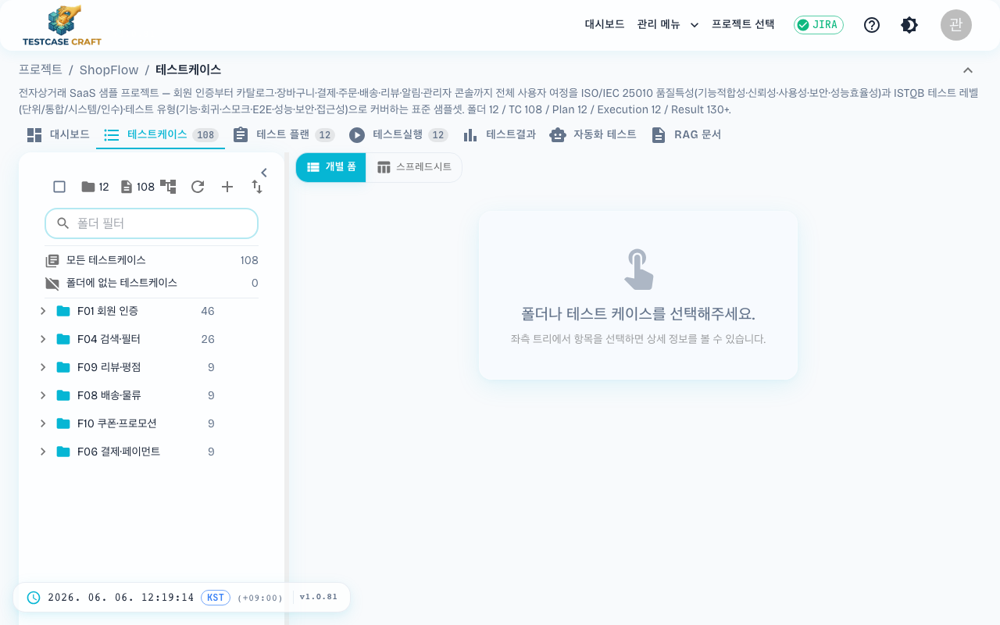

#### 폴더 케이스 목록

트리에서 폴더를 선택하면 오른쪽에 직속 하위 폴더와 **하위 폴더를 포함한 모든 테스트케이스**가 표 형태로 나타납니다.

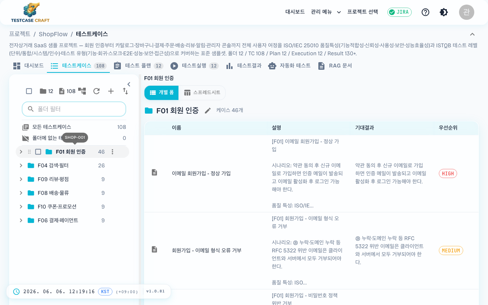

- **컬럼 구성** — 이름 → 설명 → 기대결과 → 우선순위 순서입니다.
- **하위 폴더 케이스 포함** — `폴더 > 폴더 > 케이스`처럼 중첩된 구조라도 상위 폴더만 선택하면 그 아래 모든 케이스가 함께 표시됩니다. 하위 폴더 소속 케이스에는 **폴더** 컬럼이 추가되어 선택한 폴더 기준의 상대 경로를 보여주고, 경로를 클릭하면 해당 폴더로 이동합니다.
- **긴 내용 처리** — 텍스트가 100자를 넘으면 말줄임(…)되고, 마우스를 올리면 전체 내용이 툴팁으로 표시됩니다.
- **기대결과** — 케이스의 통합 기대결과를 우선 표시하고, 없으면 스텝별 기대결과를 번호를 매겨 보여줍니다.
- **행 클릭** — 케이스를 클릭하면 상세 폼이 열리고, 하위 폴더를 클릭하면 그 폴더의 목록으로 이동합니다.
- **경로 표시** — 본문 맨 위에 `상위폴더 › 하위폴더 › 케이스명` 형태로 현재 위치가 표시되고, 상위 폴더를 클릭해 바로 이동할 수 있습니다.

#### 폴더 정보 편집

폴더 케이스 목록 상단의 폴더명 옆 **연필 아이콘**을 클릭하면 폴더 정보 편집 폼으로 전환됩니다.

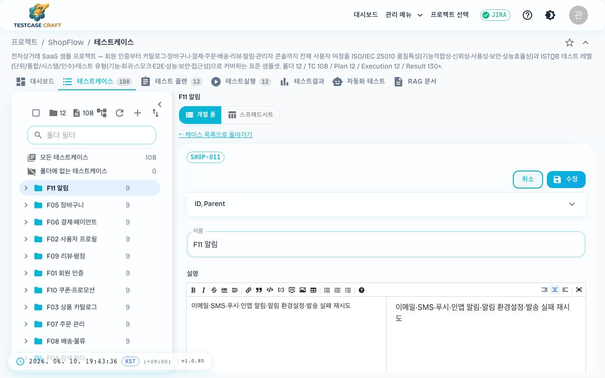

| 필드 | 설명 |
|---|---|
| **이름** | 폴더 이름을 변경합니다. 트리의 우클릭 → "이름 변경"과 같은 결과입니다. |
| **설명** | 폴더의 용도·범위를 마크다운 에디터로 작성합니다. 작성한 설명은 폴더 케이스 목록의 참고 정보가 됩니다. |
| **태그** | 폴더 분류용 태그를 추가합니다. |

- **[수정]** 버튼으로 저장하면 자동으로 케이스 목록으로 돌아갑니다.
- 저장하지 않고 돌아가려면 상단의 **"← 케이스 목록으로 돌아가기"** 링크를 클릭하세요.
- 다른 폴더나 케이스를 선택하면 편집 모드가 자동으로 해제됩니다.

### 4-2. 입력 모드 선택

본문 좌측 상단에 **[개별 폼] / [스프레드시트]** 토글 버튼이 항상 표시됩니다. 한 번의 클릭으로 입력 방식을 바꿀 수 있습니다.

- **스프레드시트 모드** — 표 형태로 여러 케이스를 한 번에 입력 (기본). 엑셀과 비슷한 사용감으로, 행 추가 → 셀 입력 → 일괄 저장 흐름으로 빠르게 작성합니다.
- **폼(개별 폼) 모드** — 한 건씩 항목별로 자세히 입력. 모든 필드를 지원하고 스텝 수 제한이 없어, 사전·사후 조건이나 첨부가 많은 케이스를 꼼꼼히 작성할 때 적합합니다.

> 선택한 입력 모드는 사용자별로 서버에 저장되어, 다른 PC 에서 로그인해도 마지막에 쓰던 모드가 그대로 복원됩니다.

> **참고**: 이전 버전에 있던 **고급 스프레드시트** 모드는 현재 임시로 숨겨져 있습니다. 추후 업데이트에서 다시 제공될 수 있으며, 그때까지는 기본 스프레드시트 모드를 사용하시면 됩니다.

> **2026-05-29 변경**: 스프레드시트 셀에 한글 30자(약 480px)를 넘는 긴 내용이 들어오면 **자동 워드랩** 됩니다. 컬럼이 가로로 늘어나지 않고 그 행의 높이만 늘어나므로 한 화면에서 여러 케이스를 비교하기 쉽습니다.

### 4-3. 행 추가 다이얼로그

스프레드시트 상단의 **[+ 행 추가]** 를 누르면 추가할 행 개수를 묻는 다이얼로그가 뜹니다.

기본 5개, 1~100개까지 한 번에 추가할 수 있습니다. **[추가]** 를 누르면 빈 행이 생기고 ID·이름·설명·사전조건·단계(스텝) 등을 채우면 됩니다. 작성이 끝나면 우상단 **[💾 일괄 저장]** 으로 한 번에 저장합니다.

### 4-4. 폴더와 케이스 트리 구조

TestcaseCraft는 폴더와 케이스를 **하나의 트리**로 관리합니다.

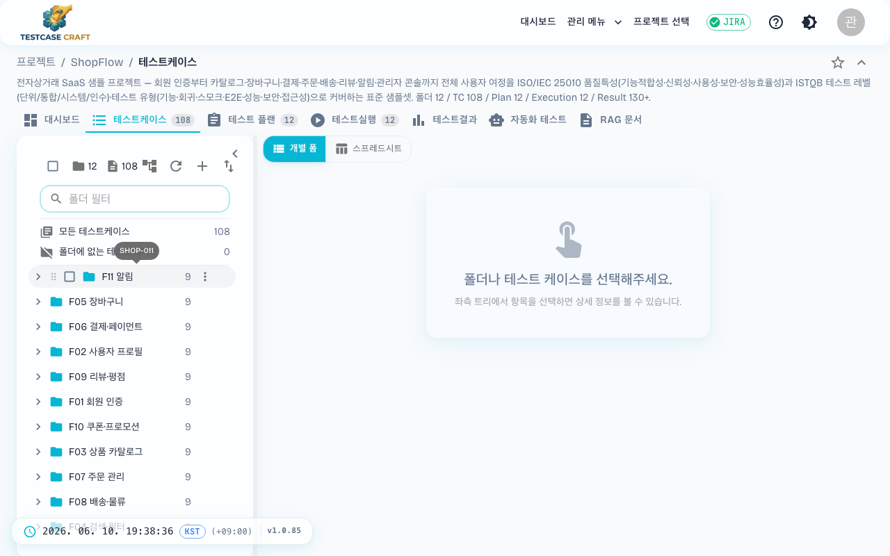

- **폴더** (`📁`) — 케이스를 묶어서 분류하는 단위
- **케이스** (`📄`) — 실제 테스트 시나리오
- **시스템 기본 폴더** — 프로젝트가 만들어질 때 자동으로 생기는 보호 폴더입니다. 실수 방지를 위해 이동·삭제할 수 없습니다.

트리 헤더에는 현재 **폴더 수(📁)와 케이스 수(📄)** 가 함께 표시되어 프로젝트 규모를 바로 가늠할 수 있습니다.

#### 트리 뷰 모드

트리는 기본적으로 **폴더만 표시**합니다. 트리 헤더의 **트리 모양 아이콘 버튼**(🌳)을 클릭하면 "폴더만 표시" ↔ "트리에 케이스도 표시"(전체 혼합 모드)로 전환됩니다. 설정은 브라우저에 저장되어 다음 방문 시 유지됩니다.

> **2026-06-06 변경**: 테스트플랜에서 케이스를 선택하는 화면(선택 모드)에서는 항상 케이스가 포함된 전체 트리가 표시됩니다.

#### 가상 노드 (모든 케이스 / 폴더에 없는 케이스)

트리 상단에는 고정 행 2개가 있습니다:
- **모든 테스트케이스** — 전체 케이스 수
- **폴더에 없는 테스트케이스** — 폴더 미지정 케이스 수

이 행을 클릭하면 우측에 해당 케이스 목록이 표시됩니다. 이 목록에는 맨 앞에 **폴더**(경로) 컬럼이 추가되어 각 케이스의 소속 폴더를 확인할 수 있고, 경로를 클릭하면 해당 폴더로 바로 이동합니다.

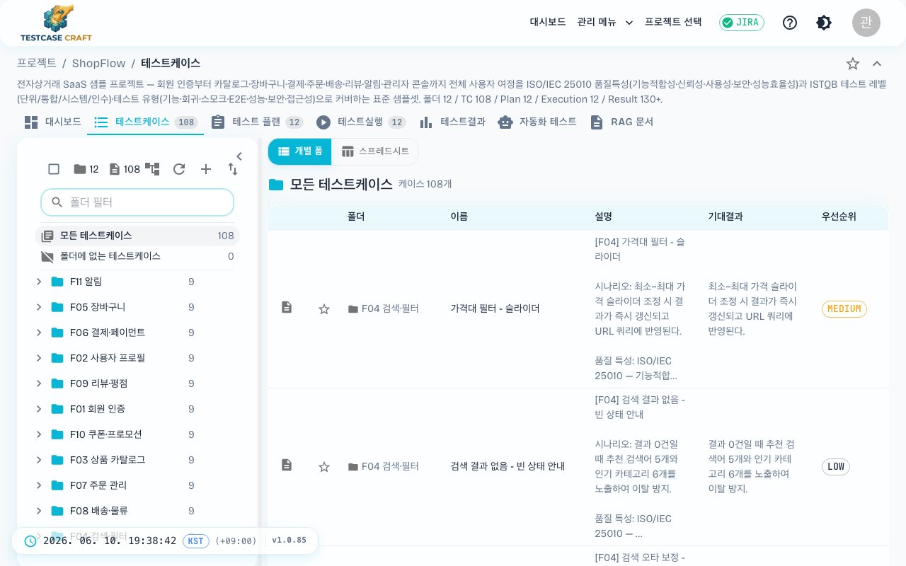

#### 트리 필터

트리 헤더 아래의 **폴더 필터** 검색창을 사용해 폴더 이름을 검색합니다. 부분 일치로 트리를 추려서 보여주고, 일치 항목의 상위 경로는 유지되며 자동으로 펼쳐집니다. X 버튼으로 필터를 해제합니다.

#### 폴더/케이스 추가

폴더/케이스를 추가하는 방법은 두 가지입니다.

1. 좌측 트리 헤더의 **➕** 아이콘 클릭 (편집 권한이 있을 때만 표시)
2. 트리의 폴더 위에서 **마우스 우클릭** → 컨텍스트 메뉴 선택

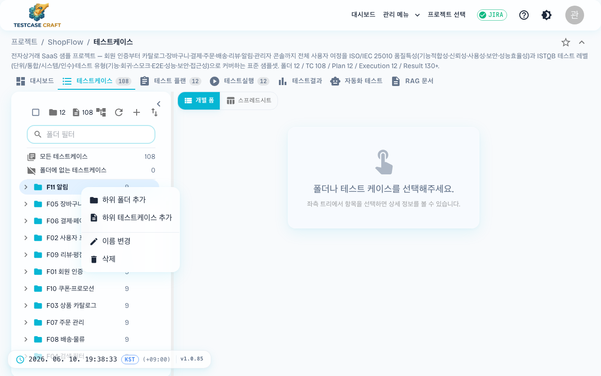

우클릭 메뉴에서 할 수 있는 일:

| 메뉴 | 동작 |
|---|---|
| **하위 폴더 추가** | 선택한 폴더 안에 새 폴더를 만듭니다 |
| **하위 테스트케이스 추가** | 선택한 폴더 안에 새 케이스를 만듭니다 |
| **이름 변경** | 폴더/케이스 이름을 바로 수정합니다 |
| **삭제** | 폴더/케이스를 삭제합니다 (폴더는 안의 내용과 함께 삭제되므로 주의) |

### 4-5. 필드 표시 토글

폼 모드 우상단의 **🔲 (표시할 필드 선택)** 아이콘을 클릭하면 폼에서 보이는 메타 필드를 켜고 끌 수 있습니다.

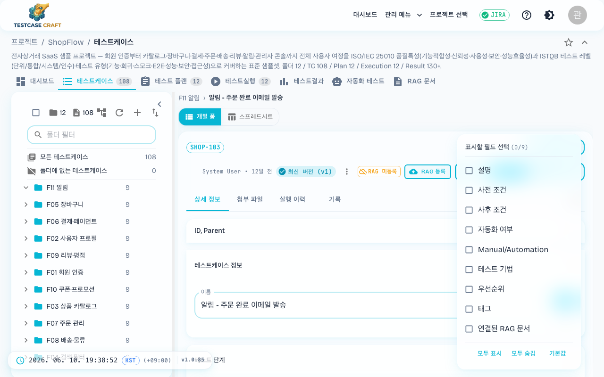

토글 대상 9개 필드:

- 설명
- 사전 조건
- 사후 조건
- 자동화 여부
- Manual / Automation
- 테스트 기법
- 우선순위
- 태그
- 연결된 RAG 문서

> 핵심 필드(이름·스텝·기대 결과)는 항상 표시되며 토글 대상에서 제외됩니다.

팝오버 하단의 **[모두 표시] / [모두 숨김] / [기본값]** 버튼으로 한 번에 정리할 수 있습니다. 선택한 값은 사용자별로 서버에 저장되어 다른 PC 에 로그인해도 동일하게 유지됩니다.

### 4-6. 폼 모드 화면 구성과 메타데이터

폼 모드로 케이스를 열면 다음과 같은 화면이 표시됩니다.

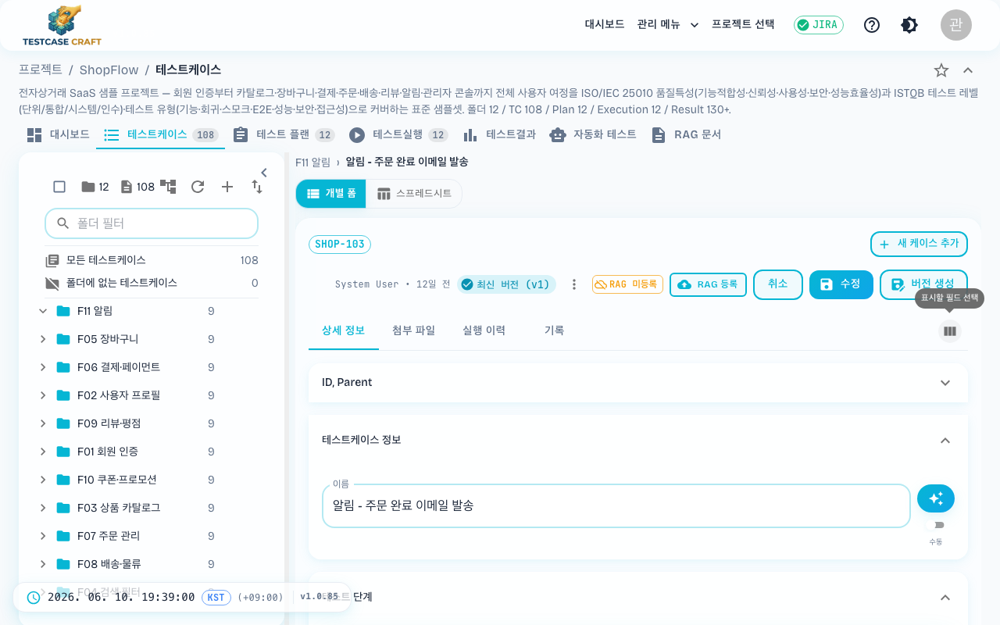

**헤더 영역** (위에서부터):

- **표시 ID 배지** (예: `SHOP-112`) — 지금 편집 중인 케이스
- **버전 표시** (예: `최신 버전 (v2)`) — 클릭하면 버전 이력 확인
- **RAG 등록됨** 배지 — 이 케이스가 RAG 지식 베이스에 등록되어 있다는 표시
- 우측 액션 버튼 — **[취소] / [수정(저장)] / [버전 생성] / [삭제]**

> **2026-07-02 변경 (v1.0.93)**: 저장된 케이스를 편집할 때 헤더 우측에 **[삭제]** 버튼(빨간색)이 표시됩니다. 이제 트리의 삭제와 **똑같은 확인 창**이 뜹니다 — 삭제할 케이스의 **ID·이름을 표로 보여주고**, **[삭제] / [취소]** 로 확정합니다. 권한이 없으면(뷰어 등) 버튼이 보이지 않으며, 삭제 권한이 없는 경우 서버가 돌려준 안내 메시지가 화면 하단에 그대로 표시됩니다.

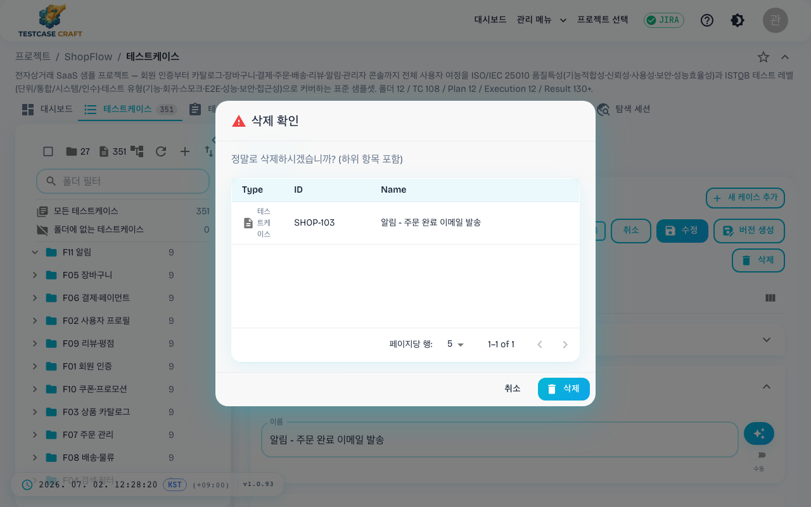

**본문 탭** 4개:

| 탭 | 내용 |
|---|---|
| **상세 정보** | 이름·설명·테스트 단계·기대 결과 등 케이스 본문 (기본 탭) |
| **첨부 파일** | 케이스에 붙인 파일 목록과 업로드 |
| **실행 이력** | 이 케이스의 과거 실행 결과 이력 |
| **기록** | 변경 이력 (누가 언제 무엇을 바꿨는지) |

**메타데이터 영역** (상세 정보 탭 상단의 `ID, Parent` — 접고 펼 수 있음):

- **수정 가능 필드** — 이름, 표시 ID, 설명, 우선순위, 태그 등 (위 §4-5 토글에 따라 노출)
- **읽기 전용 필드** — 생성일·수정일·작성자·UUID 등 시스템이 채우는 정보. UUID 는 자르지 않고 풀 문자열로 노출되어 외부 시스템 연동·디버깅에 그대로 복사할 수 있습니다.

### 4-7. 북마크 & 즐겨찾기

> **2026-06-09 변경**: 자주 보는 테스트 케이스를 개인 **북마크**로 모아 두는 기능이 추가되었습니다. 북마크는 **나에게만 보이는 개인 정보**이며, 다른 사용자의 화면에는 영향을 주지 않습니다.

**즐겨찾기 추가/제거**

케이스 목록의 각 행 왼쪽에는 별 모양 아이콘이 있습니다.

- **☆ (빈 별)** 클릭 → 즐겨찾기에 추가됩니다.
- **★ (채운 별)** 클릭 → 즐겨찾기에서 제거됩니다.

즐겨찾기에 추가한 케이스는 기본 모음인 **즐겨찾기** 에 담깁니다.

**북마크 화면**

헤더의 **☆** 아이콘을 클릭하면 북마크 화면(`/projects/{projectId}/bookmarks`)이 열립니다. 화면은 두 영역으로 나뉩니다.

- **좌측 — 모음 목록**: 케이스를 주제별로 묶는 **모음(컬렉션)**. 기본 **즐겨찾기** 모음은 항상 존재하며 삭제할 수 없습니다. **[모음 만들기]** 로 새 모음을 추가하고, 각 모음은 **이름 변경 · 삭제** 가 가능합니다.
- **우측 — 케이스 목록**: 선택한 모음에 담긴 케이스가 **케이스명 · 우선순위 · 메모 · 동작** 컬럼의 표로 표시됩니다.

각 케이스에는 **개인 메모**를 남길 수 있어, "회귀 때 꼭 확인" 같은 나만의 표시를 붙여 둘 수 있습니다.

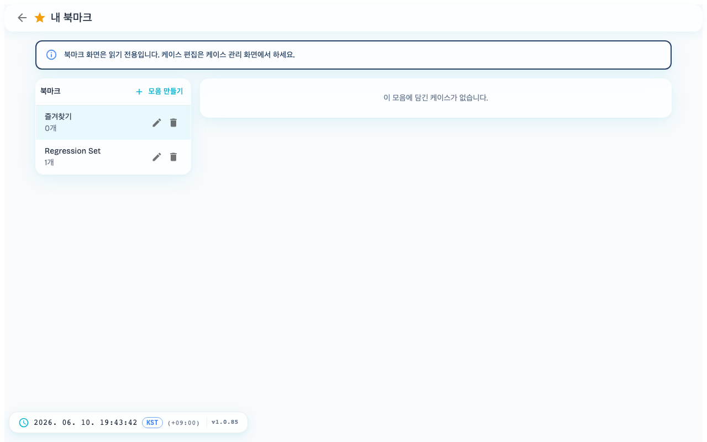

좌측 모음 목록과 우측 케이스 목록으로 나뉜 읽기 전용 북마크 화면입니다.

> ⚠️ 북마크 화면은 **읽기 전용**입니다. 케이스 본문(이름·단계·기대 결과 등)을 고치려면 **테스트케이스** 화면에서 편집하세요. 북마크에서는 모음 정리와 개인 메모만 다룹니다.

---

## 5. 테스트 케이스 트리 — 드래그앤드롭 재구성

> 본 기능은 v1.0.77 부터 제공됩니다. 더 자세한 안내는 [`docs/guide/TREE_DND_USER_GUIDE.md`](../../guide/TREE_DND_USER_GUIDE.md) 를 참고하세요.

> **2026-05-29 변경**: 트리의 각 행 좌측에 붙는 **표시 ID 배지** 는 전체 ID 대신 **마지막 번호만**(예: `SMP-001` → `001`) 짧게 표시됩니다. 배지에 마우스를 올리면 전체 ID 가 풍선 도움말로 보입니다. 행 이름도 폭이 좁아 잘릴 때만 마우스를 올리면 전체 이름이 표시되어, 평소엔 화면이 더 깔끔합니다.

### 5-1. 동작 요약

기존의 **우클릭 메뉴**(추가/이름변경/삭제)와 **순서 편집 모드**(↑/↓ 버튼)는 그대로 사용 가능하며, 추가로 다음과 같이 **마우스 드래그**로 위치를 바꿀 수 있습니다.

| 하고 싶은 것 | 동작 |
|---|---|
| 케이스를 다른 폴더로 옮기기 | 케이스 행 좌측 **`⋮⋮`(드래그 핸들)** 을 잡고 끌어 폴더 위에 놓기 |
| 폴더 통째로 옮기기 | 폴더 행의 드래그 핸들을 잡고 다른 폴더 위에 놓기 |
| 같은 폴더 안에서 순서 바꾸기 | 항목과 항목 사이의 **가는 간격** 에 놓기 |
| 루트로 이동 | 트리 최상단 빈 영역에 놓기 |

각 행 좌측의 **점 6개 모양 아이콘(⋮⋮)** 이 드래그 핸들입니다. 평소에는 숨겨져 있다가 **행에 마우스를 올리면** 나타납니다. 이 핸들을 잡아야 드래그가 시작됩니다. 드롭 직전 어디에 들어갈지 **연한 가이드 라인** 으로 미리 보입니다.

> **2026-06-06 변경**: 드래그 핸들은 평소 숨겨져 있다가 행에 마우스를 올렸을 때만 나타납니다. 체크박스·버전 히스토리·더보기(⋮) 버튼도 호버 시에만 노출됩니다.

### 5-2. 다중 선택 이동

여러 항목을 한 번에 옮길 수 있습니다.

1. **체크박스** 또는 `Cmd-click`(Mac) / `Ctrl-click`(Win)로 여러 노드 선택
2. 선택된 묶음 중 **하나의 드래그 핸들** 을 잡고 끌기 → 묶음 전체가 함께 이동
3. 서버에는 한 번의 요청으로 전송되며, 하나라도 실패하면 **전체가 원래 상태로 되돌아갑니다** (부분 적용 없음)

### 5-3. 자동 차단되는 이동

다음은 드래그 중 가이드가 **빨간색** 으로 바뀌며 자동 차단됩니다.

- 자기 자신 또는 자기 안에 있는 폴더로 옮기기 (예: A 폴더를 A 안의 B 폴더로 이동)
- 다른 프로젝트의 폴더로 옮기기 (드래그로는 불가 — 대신 아래 §5-5 의 **[프로젝트 이동/복사]** 기능을 사용하세요)
- 테스트 케이스 **안에** 다른 항목 넣기 (케이스는 자식을 가질 수 없음)
- 시스템 기본 폴더 옮기기

거부되면 화면 하단의 알림으로 이유를 알려주고, 트리는 즉시 원래대로 돌아갑니다.

### 5-4. 이동 기록 (감사 로그)

모든 성공한 이동은 시스템에 자동으로 기록됩니다 — **누가, 언제, 어디서 어디로 옮겼는지** 관리자가 추적할 수 있습니다. 실수로 옮긴 경우 관리자에게 문의하면 원위치를 찾을 수 있습니다.

### 5-5. 다른 프로젝트로 이동·복사

> **2026-07-02 추가 (v1.0.93)**: 선택한 테스트 케이스(폴더면 하위 전체)를 **다른 프로젝트로 이동하거나 복사**할 수 있습니다. 같은 프로젝트 안에서 위치만 바꾸는 드래그앤드롭(§5-1~5-4)과 달리, 프로젝트를 넘나드는 작업은 전용 버튼으로 수행합니다.

**여는 방법**

1. 트리에서 옮길 케이스·폴더의 **체크박스**로 하나 이상 선택합니다.
2. 트리 헤더에 나타나는 **[프로젝트 이동/복사]** 버튼을 클릭합니다. (선택한 항목이 있을 때만 보입니다.)
3. **테스트케이스 일괄 작업** 다이얼로그가 열립니다. 상단에 선택한 항목 수와 이름이 표시됩니다.

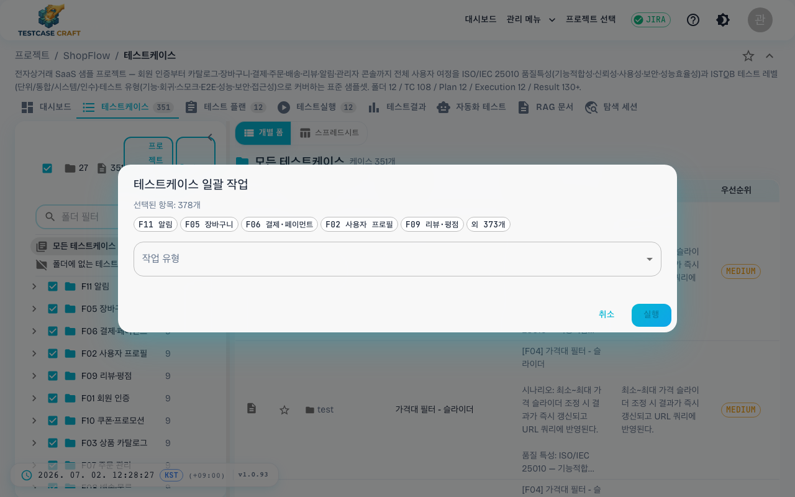

**이동 / 복사 실행**

1. **작업 유형** 에서 **이동** 또는 **복사** 를 선택합니다.
2. **대상 프로젝트** 를 선택합니다 (필수). 선택하면 그 프로젝트의 폴더 목록이 자동으로 불러와집니다.
3. **대상 폴더** 를 선택합니다 (선택 사항). 지정하지 않으면 대상 프로젝트의 **루트 폴더** 로 들어갑니다.
4. **[실행]** 을 누르면 작업이 처리되고, 완료 후 트리가 갱신됩니다. **이동**한 경우 옮겨진 항목은 현재 프로젝트 트리에서 사라집니다.

**이동과 복사의 차이 — 테스트 결과 처리**

| 작업 | 케이스 | 테스트 결과 | 필요한 권한 |
|------|--------|------------|------------|
| **이동** | 대상 프로젝트로 옮겨짐 (출발에서 사라짐) | 연결된 결과도 **함께 이동** — 대상 프로젝트에 대응 실행을 새로 만들어 결과를 옮겨 담습니다 (JIRA 버그·첨부·태그·실행자·실행 시각 보존) | 출발·대상 프로젝트 **모두 편집 권한** |
| **복사** | 대상 프로젝트에 **복제** (출발은 그대로) | **가져오지 않음** — 케이스만 복제됩니다 | 출발 **조회 권한** + 대상 **편집 권한** |

> ⚠️ 시스템 기본 폴더는 이동·복사 대상으로 선택할 수 없습니다. 대상 프로젝트에서의 편집 권한이 없으면 실행이 거부되고 화면 하단에 안내 메시지가 표시됩니다.

---

## 6. 대시보드와 통계

프로젝트 상단 **[대시보드]** 탭(`/projects/{projectId}` 진입 시 기본 화면)은 그 프로젝트의 핵심 지표를 한 화면에 정리해 줍니다. 전사 단위로 보려면 헤더의 **대시보드** 메뉴로 `/dashboard` 에 접근합니다.

| 카드 | 설명 |
|---|---|
| 프로젝트 요약 | 케이스 수 · 참여 인원 |
| 최근 테스트 결과 | 성공 / 실패 / 미실행 / 건너뜀 / 차단됨 비율 |
| 테스트 결과 추이 | 최근 며칠간의 진행 흐름 차트 |
| 열린 테스트 실행 결과 | 진행 중인 실행 요약 |
| 담당자별 결과 | 멤버별 케이스 진행 상황 |
| 테스트 플랜별 결과 | 플랜 단위 통계 |

화면 위 **[새로고침]** 을 누르면 최신 데이터로 갱신됩니다. **[최근 15일 ▾]** 으로 표시 기간을 바꿀 수 있습니다.

---

## 7. 그래프 뷰

프로젝트의 테스트 케이스, 실행, 결과 사이의 관계를 시각적으로 탐색합니다.

> **활성화 필수**: 그래프 기능은 기본적으로 꺼져 있습니다. 관리자가 `FEATURES_GRAPH_ENABLED=true` 환경 변수를 설정한 후 프로젝트 관리 권한으로 그래프 동기화를 실행해야 합니다. 자세한 설정 방법은 릴리즈 노트([RELEASE_NOTE_1.1.1_KO](../../release_note/RELEASE_NOTE_1.1.1_KO.md))를 참고하세요.

### 7-1. 그래프 뷰 화면 진입

프로젝트 안에서 상단 탭바의 **[그래프]** 탭을 누르면 그래프 뷰(`/projects/{프로젝트ID}/graph`)가 열립니다. 화면 안에 **구조 그래프 / 오류 클러스터 / 케이스 이웃** 세 가지 탭이 있습니다. 데이터가 아직 없으면 안내 배너의 **[지금 동기화]** 버튼으로 바로 생성할 수 있습니다(프로젝트 관리 권한 필요).

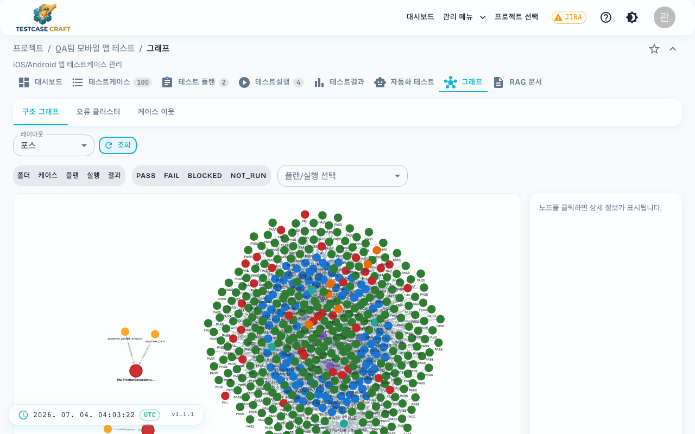

### 7-2. 구조 그래프

프로젝트 → 폴더 → 케이스 → 테스트 플랜 → 테스트 실행 → 테스트 결과의 관계망을 네트워크 그래프로 표시합니다. 결과 노드는 상태별 색으로 구분됩니다(PASS 초록, FAIL 빨강, BLOCKED 주황, NOT_RUN 회색).

| 기능 | 설명 |
|---|---|
| **레이아웃** | 좌상단 **레이아웃** 셀렉트에서 포스·계층·동심원(허브 중심)·원형·격자 중 선택합니다 |
| **필터** | 노드 유형(폴더·케이스·플랜·실행·결과)과 결과 상태(PASS/FAIL/BLOCKED/NOT_RUN)를 토글로 켜고 끕니다. 노드가 많을 때 원하는 것만 남겨 봅니다 |
| **플랜/실행 스코프** | **[플랜/실행 선택]** 에서 특정 플랜이나 실행을 고르면 그와 연결된 서브그래프만 표시합니다 |
| **노드 클릭** | 노드를 클릭하면 우측 패널에 속성이 나타납니다. 케이스 노드에서는 관계 편집을 시작할 수 있습니다(7-5) |
| **줌·이동** | 마우스 휠로 확대/축소, 노드를 끌어 위치를 조정합니다 |

### 7-3. 오류 클러스터

JUnit(자동화 테스트) 업로드의 실패들을 같은 원인으로 묶어 시각화합니다.

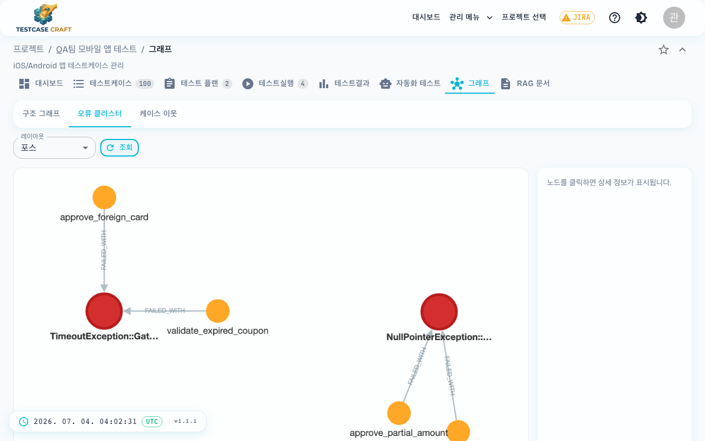

- **실패 원인** — 각 실패의 `failureType` + 메시지 첫 번째 줄을 하나의 원인(허브)으로 묶습니다
- **허브 형태** — 같은 원인의 실패가 어떤 케이스·실행까지 퍼져 있는지 중심 노드(원인)와 주변 노드로 표시합니다
- **패턴 파악** — 하나의 결함이 여러 케이스·실행에 반복되는 양상을 한눈에 파악합니다

### 7-4. 케이스 이웃

특정 테스트 케이스와 연결된 다른 항목들을 1~3단계 거리로 탐색합니다.

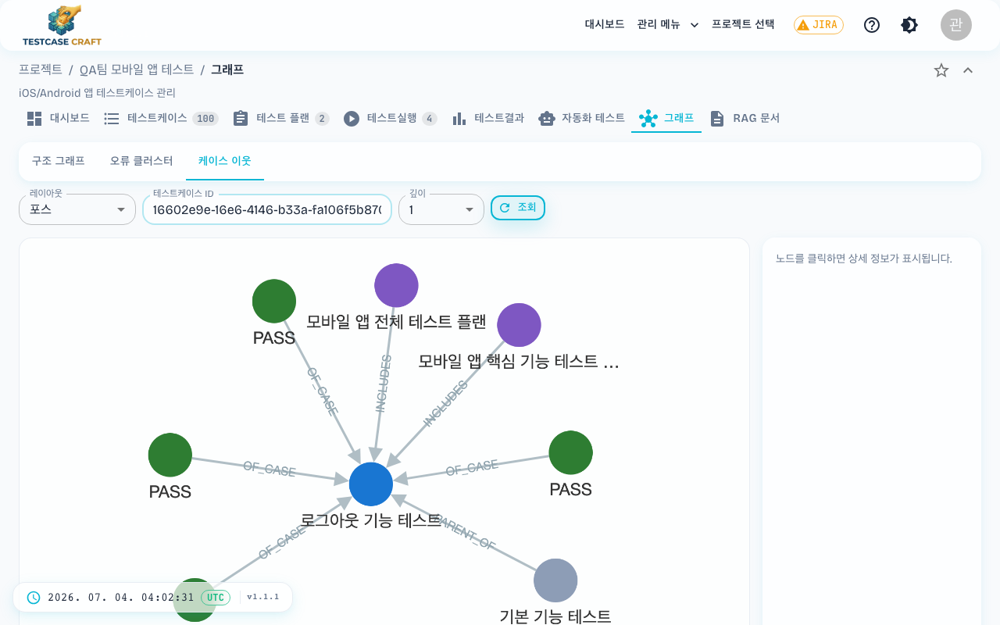

- **케이스 지정** — 상단 입력란에 테스트케이스 ID를 넣고 깊이(1~3)를 고른 뒤 **[조회]** 를 누릅니다
- **연결 항목** — 그 케이스가 속한 플랜·폴더, 연결된 실행과 결과가 지정한 깊이까지 펼쳐집니다
- **노드 상세** — 노드를 클릭하면 우측 패널에서 해당 항목의 속성을 확인합니다

### 7-5. 케이스 간 관계 직접 지정

동기화로 자동 생성되는 관계(폴더 포함, 플랜 포함, 결과 연결 등) 외에, 사용자가 케이스 사이의 논리적 관계를 직접 그릴 수 있습니다.

- **관계 시작** — 구조 그래프에서 케이스 노드를 클릭한 뒤 우측 패널의 **[이 케이스에서 관계 시작]** 을 누릅니다
- **대상 지정** — 이어서 다른 케이스 노드를 클릭하면 관계 유형 선택 창이 열립니다: `DEPENDS_ON`(선행 필요) / `RELATES_TO`(연관) / `BLOCKS`(차단)
- **표시·삭제** — 수동 관계는 **보라색 점선**으로 자동 관계와 구분됩니다. 점선을 클릭하면 삭제할 수 있습니다
- **보존** — 수동 관계는 그래프 고유 데이터라, 다시 동기화해도 지워지지 않습니다

### 7-6. 그래프 테스트 케이스

케이스를 **세 가지 방식**으로 작성하고 관리할 수 있습니다.

| 모드 | 설명 | 사용 시기 |
|---|---|---|
| **기본** | 지금까지의 선형 스텝 방식. 단계별로 순서대로 동작을 나열 | 일반적인 시나리오 테스트 |
| **그래프** | 스텝을 노드 체인으로 저작. 복잡한 분기나 반복 흐름을 표현 가능 (`/graph-tc/{id}/edit` 전용 편집기) | 복잡한 테스트 흐름, 의사결정이 많은 시나리오 |
| **기본 ↔ 그래프** | 기존 선형 케이스를 그래프로 변환하거나 되돌릴 수 있음. 폴더/프로젝트 단위 일괄 전환 지원. 비파괴적 전환으로 언제든 원래 방식으로 복구 가능 | 기존 케이스를 새로운 방식으로 마이그레이션할 때 |

**관계형 미러 보장**: 그래프 모드로 작성한 케이스도 기존 스프레드시트 보기나 개별 폼에서 항상 선형 스텝으로 조회됩니다. 그래프 모드에서는 그래프가 원본이고, 스텝 표는 자동으로 갱신되는 읽기 전용 미러입니다. 역전환하면 미러가 다시 원본이 됩니다.

**분기 저작(편집기)**: 그래프 TC 편집기(`/graph-tc/{id}/edit`)에서는 스텝을 순서대로 나열하는 것뿐 아니라 특정 스텝에 **분기(Decision)** 를 달 수 있습니다. 각 스텝의 분기 버튼으로 조건 라벨(예: 유효/무효)과 이동할 스텝을 지정하면, 상단 미리보기에 분기점이 다이아몬드로 표시됩니다. 분기가 있는 케이스는 `HYBRID` 모드가 되며, 관계형 미러에는 대표 경로(첫 번째 갈래)가 선형으로 기록됩니다.

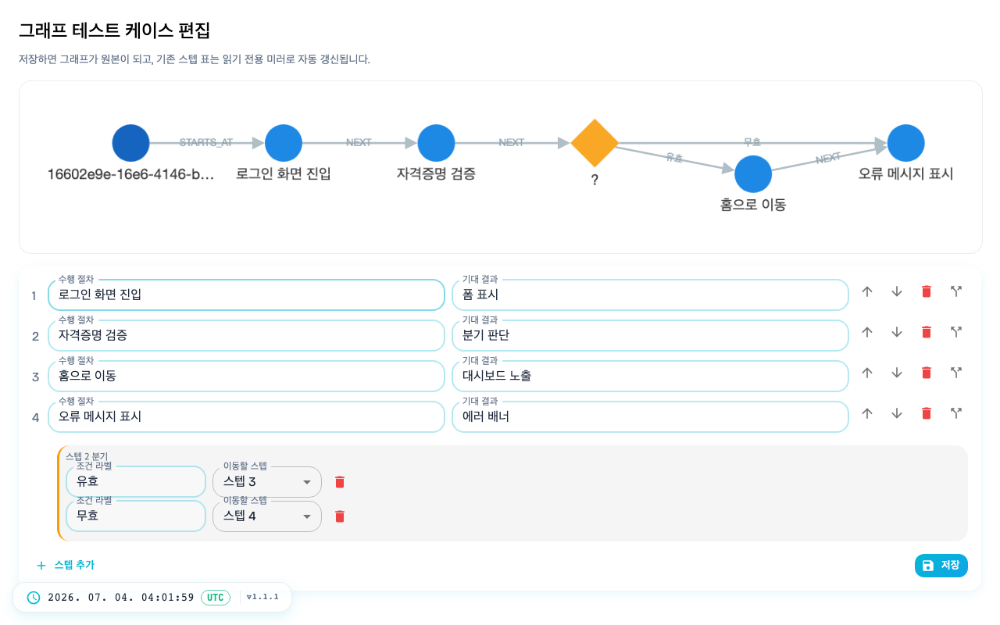

### 7-7. 데이터 동기화

그래프 데이터는 프로젝트의 현재 상태에서 자동으로 생성되지 않습니다. **프로젝트 관리 권한**을 가진 사용자가 수동으로 동기화를 실행해야 합니다.

- **동기화 API** — `POST /api/graph/sync?projectId={프로젝트ID}` 엔드포인트를 호출하면 그래프 데이터가 생성됩니다
- **멱등성** — 동기화는 항상 안전하며, 언제든지 다시 실행해도 기존 데이터를 덮어쓰므로 부분 중복이 없습니다
- **타이밍** — 새 케이스를 추가했거나 기존 케이스를 많이 수정한 후 동기화를 실행하면 최신 상태가 그래프에 반영됩니다

### 7-8. 버전 호환성

| 방향 | 상태 |
|---|---|
| **1.0.x 데이터 → 1.1.1 (이상)** | ✅ 완전 호환. 기존 케이스는 전부 "기본" 모드로 인식되고, 스키마 변경은 컬럼 추가뿐입니다 |
| **1.1.1 → 1.0.x 다운그레이드** | ⚠️ 미지원. 1.1.1에서 그래프 모드로 만든/전환한 케이스는 1.0.x로 되돌리면 그래프 구조를 볼 수 없습니다 (관계형 미러인 선형 스텝만 조회 가능, 크래시는 없음). 다운그레이드 전에 해당 케이스들을 역전환해 두는 것을 권장합니다 |

---

## 8. 테스트 플랜

상단 **[테스트 플랜]** 탭(`/projects/{projectId}/testplans`)에서 한 묶음의 테스트케이스를 실행 단위로 묶은 **테스트 플랜**을 관리합니다.

- 우상단 **[+ 새 플랜]** 버튼으로 신규 플랜 생성 (이름, 설명, 포함할 케이스 선택)
- 플랜 목록에서 카드/행 클릭 → 상세 진입
- 플랜에 묶인 케이스는 "테스트 실행"에서 한 번에 실행 가능

> 신규 프로젝트라 플랜이 비어 있는 상태입니다. 플랜을 만들면 카드로 보입니다.

---

## 9. 테스트 실행

상단 **[테스트실행]** 탭(`/projects/{projectId}/executions`)은 테스트 플랜에 묶인 케이스들의 실행 인스턴스를 관리합니다.

- 검색창으로 제목 필터링 (검색어는 프로젝트별로 기억됩니다)
- 행 클릭 → 그 실행 내부로 진입, 각 케이스의 결과(통과/실패/건너뜀/차단)를 기록
- "테스트 결과" 탭은 종료된 실행의 통계를 종합 조회

> **2026-06-09 변경**: 테스트 실행 목록이 **약 20초마다 자동으로 새로고침**되어, 다른 팀원이 기록한 진행 상황이 새로고침 없이 반영됩니다. 다른 탭을 보고 있는 동안에는 자동 갱신이 멈춰 불필요한 요청이 발생하지 않으며, 화면으로 돌아오면 다시 갱신됩니다. 목록 상단의 **[새로고침]** 버튼으로 언제든 즉시 갱신할 수도 있습니다.

수동 실행은 다음 흐름입니다.

1. 테스트 플랜에서 **[실행 시작]** 클릭
2. 케이스 하나씩 진행 — 단계별 기대 결과(expected)/실제 결과(actual) 입력 + 결과 마킹
3. 첨부 파일(스크린샷, 로그 등) 업로드 가능 — TXT·CSV·JSON·MD·PDF·LOG·PNG·JPG·GIF 형식, 파일당 최대 10MB
4. 완료 시 결과는 자동으로 **테스트 결과** 와 **대시보드 통계**에 반영

> **2026-06-09 변경**: 실행 내부의 케이스 목록 위에 **필터 패널**이 추가되어, **결과**(PASS·FAIL·BLOCKED·NOT RUN)·**우선순위**·**실행자**·**실행일자**·**JIRA 아이디**·**노트** 조건으로 케이스를 추려 볼 수 있습니다. 필터가 적용 중이면 **적용 중** 표시가 함께 나타나며, **[초기화]** 로 모든 조건을 한 번에 해제할 수 있습니다.

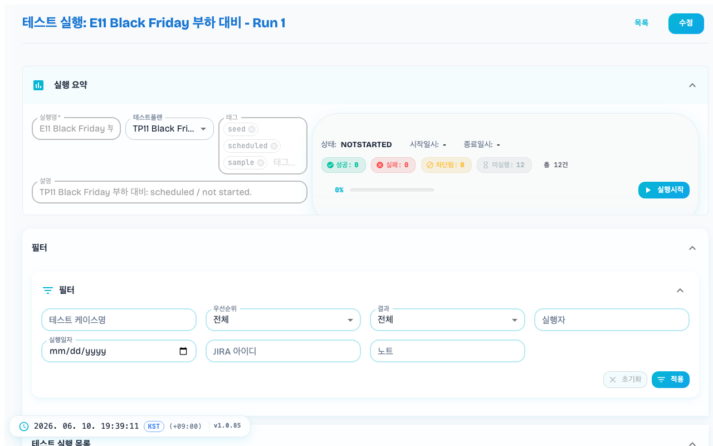

### 9-1. 결과 입력 화면

실행 안에서 케이스를 클릭하면 결과 입력 화면(`/projects/{projectId}/executions/{executionId}/testcases/{testCaseId}/result`)이 열립니다. 화면의 플로팅 결과 버튼으로 다음 4가지 상태를 기록합니다.

| 버튼 | 상태 | 의미 |
|---|---|---|
| **P** | 통과 (Pass) | 기대한 대로 동작 |
| **F** | 실패 (Fail) | 기대와 다르게 동작 — 결함 가능성 |
| **B** | 차단됨 (Blocked) | 환경 문제 등으로 실행 자체가 불가 |
| **N** | 미실행 (Not Run) | 아직 실행하지 않음 (기본값) |

결과 외에도 **노트**(자유 메모), **태그**, **JIRA 이슈 키** 를 함께 기록할 수 있고, 하단의 **이전 결과 목록** 에서 이 케이스의 과거 실행 이력을 한눈에 볼 수 있습니다. 이전 결과 목록에서 **이번 실행에 속한 행은 시각적으로 구분 표시** 되어, 어떤 결과가 이번 실행분인지 헷갈리지 않습니다.

**이전 실행 결과 다이얼로그 — 노트 보기 형식 토글**

> **2026-06-10 추가**: 테스트 실행 목록에서 케이스의 **[이전 결과]** 버튼을 누르면 **이전 실행 결과** 다이얼로그가 열립니다. 이 다이얼로그 우측 상단에 **마크다운 / 텍스트** 보기 형식 토글이 있습니다.

- **마크다운** (기본): 노트를 마크다운 서식으로 렌더링해 표·목록·코드 블록 등을 보기 좋게 표시합니다.
- **텍스트**: 노트를 서식 변환 없이 **원문 그대로** 표시합니다. 마크다운 형식이 아닌 노트가 깨져 보이는 경우 이 모드로 원문을 확인하세요.

선택한 보기 형식은 브라우저에 저장되어, 다음에 다이얼로그를 다시 열 때도 그대로 유지됩니다.

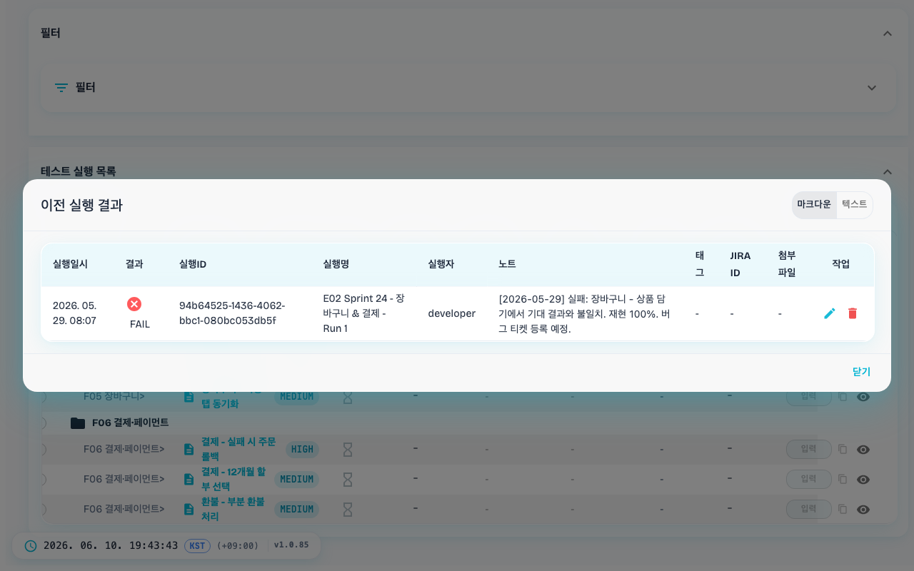

### 9-2. 자동 저장 — 보기만 하면 절대 저장되지 않습니다

> **2026-06-05 변경 (v1.0.80)**: 결과 입력의 자동 저장 동작이 안전하게 재설계되었습니다.

- **확인만 하면 저장되지 않습니다** — 결과 입력 화면을 열어 내용을 둘러보거나, 다음/이전 버튼으로 케이스를 넘기기만 하는 경우에는 어떤 저장도 일어나지 않습니다. 기존에 입력해 둔 결과가 바뀔 걱정 없이 자유롭게 열람하세요.
- **수정하면 자동 저장됩니다** — 결과 버튼(P/F/B/N)·노트·태그·JIRA 키 중 하나라도 실제로 수정하면, 약 1.5초 후 자동으로 저장됩니다. 저장 여부는 화면 상단의 자동 저장 상태 표시로 확인할 수 있습니다.
- **빈 결과는 만들어지지 않습니다** — 아무것도 입력하지 않은 상태(미실행 + 빈 노트)에서 저장이나 다음 버튼을 눌러도 빈 레코드가 생성되지 않으며, 이전 결과가 그대로 유지됩니다.

> 💡 v1.0.80 부터는 보기만 해서는 빈 기록이 새로 생기지 않습니다. 이전 버전에서 이미 쌓여 있던 빈 미실행 기록은, 해당 케이스에 실제 결과를 입력하면 그 기록이 갱신되어 자연스럽게 정리됩니다.

---

## 10. 테스트 결과

상단 **[테스트결과]** 탭(`/projects/{projectId}/results`)은 종료된 실행의 결과를 종합 조회합니다.

- 필터: 기간, 플랜, 담당자, 결과 상태
- 케이스 단위 통과율, 최근 N회 추이 차트
- 결과 보고서를 파일로 내보내기 가능 — 형식은 3가지입니다.

| 형식 | 이런 분께 추천 |
|---|---|
| **Excel (.xlsx)** | 통계 차트가 포함된 보고서를 그대로 공유·필터링하고 싶을 때 |
| **PDF (.pdf)** | 인쇄하거나 레이아웃이 고정된 문서로 보관하고 싶을 때 — 가로/세로 방향 선택 가능 |
| **CSV (.csv)** | 가볍게 데이터만 뽑아 다른 도구에서 분석하고 싶을 때 |

> **2026-06-05 변경 (v1.0.80)**: PDF 내보내기에서 긴 테스트 단계(스텝/기대 결과) 정보가 페이지 경계에서 잘리던 문제가 해결되어, 여러 페이지에 걸쳐 온전히 출력됩니다.

### 10-1. QA 총평

테스트결과 화면의 **상세 테이블 보기** 탭에서 **테스트 실행 필터를 하나 선택하면**, 결과 테이블 위에 **"QA 총평"** 패널이 표시됩니다. 해당 실행을 마치고 난 뒤의 평가·소견·후속 조치 등을 자유롭게 기록해 두는 공간입니다.

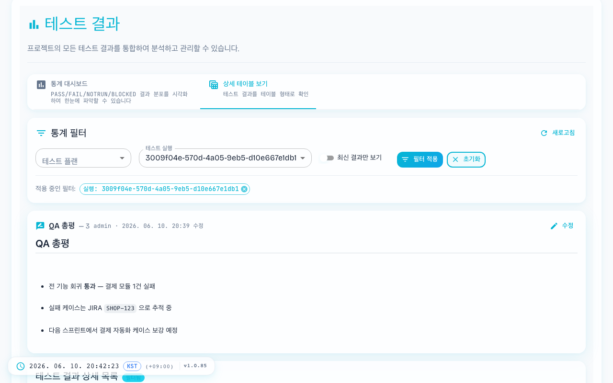

- 패널의 **[총평 작성]**(이미 작성된 총평이 있으면 **[수정]**) 버튼을 누르면 **마크다운 에디터**가 열립니다. 입력하는 동안 우측에 **라이브 프리뷰**가 함께 표시되어 결과를 바로 확인하며 작성할 수 있습니다. 최대 10,000자까지 입력할 수 있습니다.
- 작성한 총평은 **테스트 실행(execution) 단위**로 저장됩니다. 실행 필터를 바꾸면 각 실행에 작성된 총평이 따로 표시되며, 패널 헤더에는 **작성자와 마지막 수정 시각**이 함께 나타납니다.
- **고급 내보내기 PDF**에는 통계 요약 다음, **"상세 테스트 결과 리스트"** 제목 바로 위에 **"💬 QA 총평"**(작성자 포함)이 함께 출력됩니다. 마크다운 서식은 일반 텍스트로 변환되어 들어갑니다. 단, **Excel·CSV 내보내기에는 포함되지 않습니다.**

---

## 11. 자동화 테스트

상단 **[자동화 테스트]** 탭(`/projects/{projectId}/automation`)은 자동화 테스트 도구(JUnit·Playwright·Pytest 등)가 만든 결과 파일을 올려서 TestcaseCraft에서 모아 보는 기능입니다.

- **결과 파일 업로드** — JUnit XML 파일(최대 100MB)
- 올리면 자동으로 케이스와 매칭하고 통계에 반영됩니다
- 목록에서 결과 행을 클릭하면 상세 화면(`/projects/{projectId}/automation-results/{testResultId}`)으로 진입해 개별 테스트의 성공/실패/건너뜀 내역과 에러 메시지를 확인할 수 있습니다
- 어떤 도구로 어떻게 파일을 만드는지는 운영 담당자에게 문의

> 단순히 결과 파일만 따로 보고 싶다면 **[JUnit 결과]** 화면(`/projects/{projectId}/junit`)에서 확인할 수 있습니다.

---

## 12. RAG 문서 & 챗

상단 **[RAG 문서]** 탭(`/projects/{projectId}/rag`)은 프로젝트 지식 베이스를 관리합니다.

- 문서 업로드 (PDF/MD/HTML/이미지 등) → 자동으로 임베딩 생성
- 케이스 작성 시 "관련 RAG 문서" 자동 추천
- RAG 챗으로 자연어 질의 → 출처 인용 답변

> RAG는 별도의 보조 서비스로 운영됩니다. 일부 운영 환경에서는 비활성화되어 이 탭이 숨겨질 수 있습니다.

---

## 13. 탐색 세션 (SBTM)

상단 **[탐색 세션]** 탭(`/projects/{projectId}/exploratory`)은 **Session-Based Test Management** 기반의 탐색 테스트 세션을 관리합니다.

- **차터(Charter)** — 탐색 목표 1줄 정의
- 세션 시작 → 타이머 가동 (보통 60–120분)
- 진행 중 발견 노트/버그/스크린샷 기록
- 종료 시 세션 보고서 자동 작성, 승인 워크플로우

> 환경 변수 `SHOW_EXPLORATORY_SESSION_TAB=true`일 때만 노출됩니다. 설정 방법은 운영자용 문서를 참고하세요 ([§16-3](#16-3-설치운영-관련-문서)).

---

## 14. 사용자 프로필 & 설정

헤더 우상단 **사용자 아바타** → **[프로필]** 을 클릭하면 사용자 프로필 다이얼로그가 열립니다.
다이얼로그는 7개의 탭으로 나뉩니다.

### 14-1. 기본 정보

사용자 정보와 인증 상태를 확인하고 관리합니다.

- **사용자명 / 이름 / 이메일** — 사용자명은 변경할 수 없습니다
- **역할** 배지 — 테스터, PM, 관리자 등이 표시됩니다
- **이메일 인증** — 미인증 상태면 **[인증 이메일 발송]** 버튼을 클릭하여 인증 메일을 받습니다. 메일의 링크를 열어 인증을 완료한 후 **[상태 새로고침]** 버튼으로 배지를 갱신합니다
- **서비스 버전** — 서버 버전과 화면(프론트엔드) 버전이 하단에 표시됩니다

### 14-2. 비밀번호 변경

기존 비밀번호 확인 후 새 비밀번호 + 확인 입력 → **[저장]**.

### 14-3. 언어 & 시간대 설정

- **인터페이스 언어** — 한국어/English 등 (변경 시 즉시 반영, 자동 저장)
- **시간대 설정** — 모든 시간 표시(생성일·이동 로그·테스트 결과 등)에 적용
  - 기본값 `UTC`, 사용자 로컬 시간대로 변경 시 **[저장]** 클릭

### 14-4. JIRA 설정

내 계정에서 사용할 JIRA 주소·이메일·연결 키를 등록합니다. 등록 후 헤더의 **⚠ JIRA** 경고가 사라집니다.

### 14-5. Google Sheets 설정

Google Sheets로 테스트 케이스를 가져오거나 내보내려면 Google 계정 연결이 필요합니다. 화면 안내에 따라 한 번만 연결하면 됩니다.

> 💡 자세한 연결 절차는 앱 안의 가이드 문서(`/guides/GOOGLE_SHEETS_SETUP_GUIDE`)에서 단계별 그림과 함께 확인할 수 있습니다. 설정 화면의 안내 링크를 클릭해도 같은 문서가 열립니다.

### 14-6. API 토큰

다른 시스템(예: JIRA 부가 앱, 자동화 스크립트)에서 TestcaseCraft에 연결할 때 쓰는 **연결 키(토큰)** 를 발급합니다.

- 한 사람당 **최대 10개** 발급 가능
- **발급한 직후 한 번만 전체 키가 표시되므로 반드시 안전한 곳에 복사** 해 두세요. 다시 볼 수 없습니다.
- 잃어버린 키는 폐기하고 새로 발급해야 합니다

### 14-7. 테마 설정

- **화면 모드** — 라이트/다크 모드 선택 (헤더의 ◐ 아이콘과 연동)
- **디자인 시스템** — Glass(유리 질감) / Material 3 두 가지 디자인 스타일 중 선택. 변경 즉시 화면 전체에 반영됩니다.

---

## 15. 헤더 도구 — 다크모드 · 언어 · 프로젝트 선택

### 15-1. 다크모드 토글

헤더 우상단의 **◐** (반달 모양) 아이콘을 클릭하면 라이트 ⇄ 다크 모드가 즉시 전환됩니다.

### 15-2. 언어 선택

화면 언어는 **프로필 → 언어 설정** 탭에서 변경합니다 ([§14-3](#14-3-언어--시간대-설정) 참고). 변경 즉시 화면 전체에 반영되며 별도 저장 버튼 없이 자동 저장됩니다.

### 15-3. 프로젝트 선택 (빠른 전환)

헤더의 **[프로젝트 선택]** 을 클릭하면 현재 사용자가 속한 프로젝트 목록이 드롭다운으로 펼쳐집니다.

다른 프로젝트로 즉시 전환 가능 — 현재 탭(대시보드/테스트케이스 등) 위치는 유지된 채 프로젝트만 변경됩니다.

---

## 16. 로그아웃

헤더 우상단 **사용자 아바타** → **[로그아웃]** 을 클릭하면 로그인이 해제되고 로그인 화면으로 이동합니다.

> 일정 기간 사용하지 않으면 보안을 위해 자동으로 로그아웃됩니다. 유지 기간은 운영 환경 설정에 따라 다르므로(개발 환경 약 30일, 운영 환경 기본 90일) 정확한 값은 운영 담당자에게 확인하세요. 로그아웃된 후에는 다시 로그인하면 됩니다.

---

## 17. 부록 — JIRA 연동 & 자주 묻는 질문

### 17-1. JIRA 연동

헤더의 **`⚠ JIRA`** 배지는 JIRA 설정이 비어 있다는 경고입니다. 클릭하면 JIRA 연동 설정 화면이 열립니다.

- 서버 URL, 사용자 이메일, API 토큰 입력
- 매핑 필드(우선순위, 담당자 등) 설정
- 저장 후 경고 배지가 사라집니다

### 17-2. 자주 만나는 화면 이슈

| 증상 | 점검 |
|---|---|
| `⚠ JIRA` 배지가 늘 보임 | 정상 — JIRA 설정 안 했으면 항상 노출. 사용하지 않으면 무시 |
| 헤더에 + 추가 버튼이 안 보임 | 프로젝트 권한이 VIEWER인지 확인 (PM/편집자만 추가 가능) |
| 드래그가 동작 안 함 | 읽기 전용(VIEWER) 권한이거나, 케이스를 **선택하는 화면**(예: 테스트 플랜에 넣을 케이스 고르기)에서는 끌어 놓기가 꺼져 있습니다. 우클릭 메뉴/순서 편집 모드로 대체 가능 |
| 결과 입력 화면을 열어 봤는데 결과가 바뀌어 있음 | v1.0.80 이상에서는 발생하지 않습니다 — 보기만 하면 저장되지 않도록 개선됨 ([§9-2](#9-2-자동-저장--보기만-하면-절대-저장되지-않습니다) 참고). 과거 버전에서 생긴 빈 미실행 기록은 실제 결과를 입력하면 정리됩니다 |
| 입력 모드에 '고급 스프레드시트'가 안 보임 | 정상 — 현재 임시로 숨겨진 기능입니다. 기본 스프레드시트 모드를 사용하세요 |
| 화면이 계속 로딩 중 | 일시적 네트워크 오류 가능 — 새로고침 후에도 계속되면 운영 담당자에게 문의 |
| 회원가입에서 `Failed to fetch` | 서버 측 환경 변수 문제일 가능성 — 운영 담당자에게 문의. 상세는 [`../../deployment/DOCKER_SETUP.md`](../../deployment/DOCKER_SETUP.md) §9 |

### 17-3. 설치·운영 관련 문서

자체 호스팅·도커 설정·환경 변수·백업·업그레이드·트러블슈팅 등 **운영자용 가이드**는 별도 문서로 분리되어 있습니다.

👉 **[`docs/deployment/DOCKER_SETUP.md`](../../deployment/DOCKER_SETUP.md)**

---

## 18. 시스템 관리자 설정 (ADMIN 전용)

> ⚠️ 본 섹션은 `role=ADMIN` 사용자에게만 노출되는 메뉴입니다. 시스템 기본 admin 계정의 초기 비밀번호는 코드에서 `admin / admin123`으로 정의되어 있으며, 운영 환경 배포 직후 반드시 변경하세요.

### 18-1. 관리자 메뉴 진입

관리자 계정으로 로그인하면 헤더에 **[대시보드] / [관리 메뉴 ▾] / [프로젝트 선택]** 이 추가로 노출됩니다.

드롭다운 항목:
- **조직 관리** (`/organizations`)
- **사용자 관리** (`/users`)
- **메일 설정** (`/mail-settings`)
- **LLM 설정** (`/llm-config`)
- **스케줄러 관리** (`/scheduler`)

### 18-2. 전체 대시보드

헤더 좌측 **[대시보드]** 는 전 조직/전 프로젝트를 가로지르는 운영 통계 화면입니다.

### 18-3. 조직 관리

`/organizations` — 조직(Organization) 단위로 프로젝트를 그룹핑합니다.

- 조직 신규 생성 / 수정 / 멤버 초대
- 조직 내 그룹(Group) 단위로 권한 매트릭스 관리
- 클릭 시 조직 상세(`/organizations/{id}`)로 진입

### 18-4. 사용자 관리

`/users` — 시스템의 모든 사용자를 조회·관리합니다.

- 통계 카드: 전체 / 활성 / 비활성 / 최근 가입
- 검색: 이름·사용자명·이메일
- 필터: 역할(ADMIN/PM/테스터/일반 사용자) · 상태(활성/비활성)
- 행 우측 액션: **👁 상세 보기 · ⋮ 비밀번호 재설정 / 역할 변경 / 활성·비활성 토글**
- 이메일 인증 상태 배지 (미인증/완료)
- 우상단 **🔄 새로고침 / ⬇ 다운로드 / 초기화** 버튼

### 18-5. 메일 설정

`/mail-settings` — SMTP / 발신자 / 템플릿 설정.

- SMTP 호스트·포트·계정
- 발신자 이메일 / 표시 이름
- 이메일 인증·비밀번호 재설정·실행 결과 알림 등 시스템 메일 템플릿
- **테스트 메일 발송** 으로 설정 검증

### 18-6. LLM 설정

`/llm-config` — RAG 챗·AI 메타 자동 생성 등에 사용할 LLM 프로바이더 설정.

- 프로바이더: OpenAI / Anthropic / Azure OpenAI / 로컬 모델 등
- 모델 명, API Key, 베이스 URL
- 프롬프트 템플릿(시스템 프롬프트 · 예시) 관리
- 사용량 한도와 비용 추적 옵션

### 18-7. 스케줄러 관리

`/scheduler` — 주기적 백그라운드 작업의 켜고/끄기·주기 변경.

- 등록된 잡 목록 (예: JIRA 동기화, RAG 인덱스 재구축, 만료 토큰 정리)
- 각 잡의 **Cron 표현식**, 마지막 실행 시각/결과
- **수동 실행** 버튼, 일시정지/재개

### 18-8. 번역 관리 (i18n)

`/translation-management` — UI 다국어 키와 번역을 동적으로 편집합니다 (헤더 메뉴에는 기본 비노출 — URL 직접 접근).

- 언어별 번역 키/값 편집
- 누락된 키 통계
- 카테고리별 그룹화
- 추가 언어 등록 가능

> 본 화면은 i18n 키가 많아 일반 사용자에게는 보이지 않습니다. 한국어/영어 외 추가 언어를 도입하거나 라벨을 수정할 때만 사용합니다.

### 18-9. 프로젝트 단위 설정 (PM)

프로젝트 카드의 우상단 **⋮ (점 3개)** 메뉴 또는 프로젝트 진입 후 헤더의 메뉴로 접근합니다. (`PROJECT_MANAGER` 권한)

- 프로젝트 이름 / 코드 / 설명 변경
- 멤버 초대 / 역할 부여 (PM / LEAD_DEVELOPER / DEVELOPER / TESTER / CONTRIBUTOR / VIEWER — 6단계, [§19-4](#19-4-권한과-역할) 참고)
- 시스템 기본 폴더 / 우선순위 / 태그 컨벤션
- 프로젝트 삭제 (모든 케이스·결과 함께 삭제 — 되돌릴 수 없음)

> 신규 프로젝트는 생성한 사용자가 자동으로 **PROJECT_MANAGER** 가 됩니다. VIEWER 또는 TESTER 권한 사용자는 이 메뉴가 보이지 않거나 일부만 활성화됩니다.

---

## 19. 용어 정리

매뉴얼에 나오는 주요 용어들을 정리했습니다.

### 19-1. 핵심 도메인 용어

| 용어 | 풀이 |
|---|---|
| **테스트 케이스 (Test Case)** | 하나의 시나리오를 검증하기 위한 단계·조건·기대 결과의 묶음. 예: "정상 로그인", "비밀번호 5회 실패 시 잠금". |
| **폴더** | 케이스를 분류하기 위한 통. 폴더 안에 케이스 또는 다른 폴더를 둘 수 있습니다. |
| **테스트 케이스 트리** | 폴더와 케이스를 위→아래로 펼쳐 보여주는 화면의 좌측 영역. |
| **테스트 플랜 (Test Plan)** | 한 번의 테스트 활동에 묶어서 실행할 케이스들의 묶음 + 일정·담당자 정보. |
| **테스트 실행 (Test Execution / Run)** | 플랜을 실제로 진행하는 작업 인스턴스. 케이스마다 결과를 기록합니다. |
| **테스트 결과 (Test Result)** | 종료된 실행의 결과 모음. 통계와 추이로 시각화됩니다. |
| **자동화 테스트** | JUnit·Playwright·Pytest 같은 자동화 도구가 만든 결과 파일을 TestcaseCraft에 올려 같이 추적하는 기능. |
| **탐색 세션 (SBTM)** | Session-Based Test Management. 60~120분 단위로 탐색 테스트를 진행하고 발견·노트·증빙을 기록하는 방식. |
| **RAG (검색 보조)** | 문서를 색인해서 자연어로 질의하면 출처와 함께 답해 주는 보조 기능. |

### 19-2. 케이스 작성 화면 용어

| 용어 | 풀이 |
|---|---|
| **스프레드시트 모드** | 표 형태로 여러 케이스를 한 번에 입력하는 화면. 엑셀과 비슷한 사용감. |
| **폼(개별 폼) 모드** | 한 건씩 항목별로 자세히 입력하는 화면. |
| **고급 스프레드시트** | 외부 엑셀에서 셀 복사·붙여넣기에 익숙한 사용자를 위한 강화된 표 입력 화면. 현재는 임시로 숨겨져 있습니다. |
| **사전 조건** | 케이스를 실행하기 전에 갖춰져 있어야 할 상태(예: "사용자 A가 가입되어 있어야 함"). |
| **스텝(단계)** | 케이스 안의 한 행동 단위. 각 스텝마다 동작과 기대 결과를 적습니다. |
| **기대 결과 / 실제 결과** | 스텝 또는 케이스 전체에서 "이렇게 동작해야 한다"는 예상과, 실제로 "이렇게 동작했다"는 기록. |
| **표시 ID (Display ID)** | `프로젝트코드-번호` 형식의 식별자. 예: `SMP-001`. URL과 알림에서 사용됩니다. |
| **태그** | 케이스에 자유롭게 붙이는 라벨(예: `smoke`, `regression`). 검색·필터·자동화에서 활용. |
| **가져오기 / 내보내기** | 케이스 묶음을 파일로 한 번에 옮기는 기능. 가져오기는 CSV·Excel·Google Sheets, 내보내기는 CSV·Excel·JSON·Google Sheets 를 지원합니다. (테스트 **결과 보고서** 내보내기는 Excel·PDF·CSV — [§9](#9-테스트-결과) 참고) |

### 19-3. 실행 결과 상태

| 상태 | 의미 |
|---|---|
| **성공 (Pass)** | 기대 결과와 실제 결과가 같음 |
| **실패 (Fail)** | 기대와 다르게 동작 — 결함 가능성 |
| **미실행 (Not Run)** | 아직 실행하지 않음 |
| **건너뜀 (Skipped)** | 의도적으로 진행하지 않음 (예: 환경이 안 맞음). 주로 자동화(JUnit) 결과에서 들어오는 상태로, 수동 결과 입력 버튼은 P/F/B/N 4가지입니다 ([§8-1](#8-1-결과-입력-화면) 참고) |
| **차단됨 (Blocked)** | 사전 조건이 충족되지 않거나 환경 문제로 실행 자체가 불가 |

### 19-4. 권한과 역할

| 역할 | 무엇을 할 수 있는가 |
|---|---|
| **VIEWER** (뷰어) | 조회만 가능. 추가·수정·드래그 모두 비활성 |
| **TESTER** (테스터) | 조회 + 케이스 실행 결과 기록, 탐색 세션 진행 |
| **CONTRIBUTOR** (기여자) | 케이스·폴더 추가/수정, 드래그앤드롭 이동 |
| **DEVELOPER** (개발자) | 케이스·폴더 추가/수정, 드래그앤드롭 이동 (CONTRIBUTOR 와 동일한 편집 권한) |
| **LEAD_DEVELOPER** (리드 개발자) | 위 모두 + 멤버 초대·역할 부여 |
| **PROJECT_MANAGER (PM)** | 위 모두 + 프로젝트 설정 변경 |
| **ADMIN** | 시스템 전역 — 조직/사용자/메일/LLM/스케줄러 설정 (§18 참고) |

테스트 플랜 작성·관리는 프로젝트에 참여한 멤버라면 공통으로 사용할 수 있습니다.

같은 사람이 프로젝트 A에서는 PM, 프로젝트 B에서는 VIEWER일 수도 있습니다 — 권한은 **프로젝트 단위**.

### 19-5. 화면 동작·도구 용어

| 용어 | 풀이 |
|---|---|
| **드래그앤드롭 (DnD, 끌어 놓기)** | 마우스로 항목을 잡아 다른 위치에 놓아 옮기는 동작. 트리에서 폴더/케이스 위치를 바꿀 때 씁니다. |
| **드래그 핸들** | 행 좌측의 점 6개 모양 아이콘(⋮⋮). 이걸 잡고 끌어야 드래그가 시작됩니다. |
| **다중 선택** | `Cmd-click`(Mac) / `Ctrl-click`(Win) 또는 체크박스로 여러 항목을 동시에 고르는 것. 다중 선택 상태에서 드래그하면 모두 함께 이동. |
| **컨텍스트 메뉴** | 항목 위에서 **마우스 우클릭** 하면 뜨는 메뉴(추가/이름변경/삭제/버전 히스토리 등). |
| **순서 편집 모드** | 트리 헤더의 ↕ 아이콘. 모드 진입 후 각 행의 ↑/↓ 버튼으로 한 칸씩 순서 변경 → 저장. |
| **이동 기록 (감사 로그)** | DnD로 옮긴 모든 이력이 시스템에 자동 보관되어, 관리자가 누가·언제·어디로 옮겼는지 확인 가능. |
| **폴더 케이스 목록** | 트리에서 폴더를 선택하면 오른쪽에 표시되는 표 형식 목록. 하위 폴더·케이스를 이름·설명·기대결과·우선순위 컬럼으로 보여줍니다. |
| **가상 노드** | 트리 상단의 고정 행 2개 — "모든 테스트케이스", "폴더에 없는 테스트케이스". 클릭하면 해당 케이스 목록이 나타나는, 시스템이 자동 관리하는 특수 항목. |
| **폴더 필터** | 트리 헤더 아래의 검색창. 폴더 이름으로 트리를 검색해 추려 보여주고, X 버튼으로 해제합니다. |
| **경로 표시 (브레드크럼)** | 현재 위치를 계층 구조로 보여주는 안내선. 예: `상위폴더 › 하위폴더 › 케이스명`. 상위 항목을 클릭해 바로 이동할 수 있습니다. |
| **다크모드 / 라이트모드** | 화면 전체 색조. 헤더의 ◐ (반달 모양) 아이콘으로 즉시 전환. |
| **다국어 (i18n)** | 한국어/English 등 화면 언어 선택. 프로필 → 언어 설정에서 변경. |

### 19-6. 외부 연동·도구

| 용어 | 풀이 |
|---|---|
| **JIRA** | 이슈 추적 도구. TestcaseCraft가 케이스↔JIRA 이슈를 연결해 양쪽 상태를 동기화합니다. |
| **JIRA API 토큰** | JIRA가 발급해 주는 연결 키. 비밀번호 대신 이걸로 안전하게 인증합니다. |
| **Google Sheets** | 구글 스프레드시트. 케이스를 가져오고 내보내는 데 활용. |
| **JUnit** | 자바 자동화 테스트 결과를 담는 표준 XML 형식. 다른 도구(Playwright·Pytest 등)도 호환 가능. |
| **API 토큰 (연결 키)** | 외부 시스템(자동화 스크립트, JIRA 부가 앱 등)이 TestcaseCraft에 자기 자신을 증명하기 위한 비밀 문자열. 발급 직후 한 번만 보이며 분실 시 폐기·재발급해야 합니다. |
| **LLM** | Large Language Model — 자연어 생성·요약 AI. 케이스 이름/설명 자동 생성, RAG 챗 답변에 사용. |
| **MCP** | Model Context Protocol — Claude/Cline 같은 AI 클라이언트가 TestcaseCraft를 자연어로 조작할 수 있게 하는 표준 통신 규약. |

### 19-7. 시간·식별자

| 용어 | 풀이 |
|---|---|
| **UTC** | 협정 세계시. 시간대 설정 기본값. |
| **KST** | 한국 표준시(UTC+9). 프로필 → 언어/시간대 설정에서 선택 가능. |
| **시간대 (Time Zone)** | 모든 시간 표시(생성·수정·실행·이동 기록)에 적용되는 사용자 설정. |
| **순차 ID (Sequential ID)** | 케이스에 자동으로 매겨지는 일련번호(예: 1, 2, 3 …). 프로젝트 내에서만 의미가 있습니다. |
| **표시 ID (Display ID)** | `프로젝트코드-순차ID` 형식의 사람이 읽기 쉬운 식별자(예: `SMP-001`). |

### 19-8. 자주 보는 화면 안내

| 표현 | 뜻 |
|---|---|
| **⚠ JIRA** (노란 배지) | JIRA 설정이 비어 있다는 안내. 클릭해서 §14-4 또는 §17-1 절차로 설정하거나, 사용하지 않으면 무시. |
| **이메일 인증 미인증** | 회원가입 후 인증 메일을 확인하지 않은 상태. 알림·비밀번호 재설정 기능에 제한이 있을 수 있음. |
| **"Failed to fetch"** | 화면이 서버와 통신하지 못한 상태. 새로고침 후에도 계속되면 운영 담당자에게 문의. |
| **시스템 기본 폴더** | 프로젝트 생성 시 자동으로 만들어지는 보호 폴더. 이동·삭제 불가. |

---

## 변경 이력

| 날짜 | 내용 |
|---|---|
| 2026-05-27 | 초판 작성. v1.0.77 기준. 트리 드래그앤드롭 기능 포함. |
| 2026-05-27 | 테스트 플랜/실행/결과/자동화/RAG/탐색 세션 + 사용자 프로필 7개 탭 + 헤더 도구(다크모드/언어/프로젝트 선택) 섹션 추가. |
| 2026-05-27 | §17 시스템 관리자 설정 추가 (관리 메뉴 / 전체 대시보드 / 조직 / 사용자 / 메일 / LLM / 스케줄러 / 번역 / 프로젝트 단위 설정). |
| 2026-05-27 | 도커 설치·운영 가이드를 `docs/deployment/DOCKER_SETUP.md`로 분리. 사용자 매뉴얼의 기술 용어(백엔드/엔드포인트/토큰 등)를 친숙한 표현으로 다듬음. |
| 2026-05-27 | §18 용어 정리 추가 (8개 카테고리: 도메인 / 케이스 화면 / 실행 결과 상태 / 권한 / 화면 동작 / 외부 연동 / 시간·식별자 / 자주 보는 화면 안내). |
| 2026-05-29 | §3·§6~§12 의 라우트 URL 백틱 보강(`/dashboard`, `/projects/{projectId}/...`). §4 폼 헤더 H6 제거·2단 그리드·단일 액션 행, §4-2 입력 모드 ToggleButtonGroup + 스프레드시트 셀 한글 30자 자동 워드랩, §4-5 필드 표시 토글(9개 메타, 사용자별 영구 저장) 및 §4-6 메타데이터(UUID 풀 표시) 추가, §5 displayId chip + 잘림 시에만 이름 툴팁 반영. |
| 2026-06-06 | 영문판(USER_MANUAL_EN.md) 신설 — 본문 전체 번역 + 영어 UI 캡처 48장(`images_en/`). |
| 2026-06-06 | v1.0.80 기준 전수 검사·보강. 머리말에 "읽는 방법"(독자별 안내·표기 규칙, IEC/IEEE 82079-1 기준) 추가. §2-1 설명 필드, §4 폼 1단 풀폭 레이아웃(v1.0.80)·에디터 자동 높이(v1.0.79), §4-2 고급 스프레드시트 임시 숨김 반영, §4-4 우클릭 메뉴 표 + 트리 캡처 2장, §4-5 필드 표시 캡처, §4-6 폼 모드 4탭·헤더 구성 + 캡처, §5-1 드래그 핸들 캡처, §8-1 결과 입력 화면(P/F/B/N)·§8-2 자동 저장 가드(v1.0.80) 신설, §9 내보내기 형식 교정(Excel/PDF/CSV), §10 상세 화면 경로, §13-5 가이드 문서 링크, §13-7 디자인 시스템, §14-2 언어 변경 경로 교정, §16-2 트러블슈팅 2행, §17-9·§18-4 역할 6종 교정(CONTRIBUTOR), §18 용어집 정비. 신규 캡처 4장(23·24·44b·44c). |
| 2026-06-06 | feat/style-folder-tree 브랜치 반영: §3-1 탭 배지 추가, §4-1 화면 구성 표 업데이트(트리 폴더만 표시·폴더 필터 추가) + "폴더 케이스 목록"·"폴더 정보 편집" 소제목 신설, §4-4 트리 뷰 모드·가상 노드·폴더 필터 3개 소제목 추가, §5-1 드래그 핸들 호버 표시 추가. 신규 캡처 4장(87~90, ShopFlow). 영문판 동일 섹션 동시 수정(캡처는 ShopFlow EN). |
| 2026-07-04 | v1.1.1 그래프 §7 스크린샷 4종(구조·오류·이웃·편집기) 삽입 + 본문 최신 UX 반영(프로젝트 탭 진입·필터·플랜스코프·관계 직접지정 7-5·분기 편집기). 소제목 7-1~7-8 재구성. 영문판 동일 반영(그래프 캡처는 KO UI 임시). | |
| 2026-07-04 | v1.1.1 반영: 1단계 문체 다듬기 — AI 티 제거(5개 대표 사례: 패턴 문장 분해, "노출" → "표시", "다이얼로그는 7개 탭으로 구성" → "7개 탭으로 나뉨", 브레드크럼 문장 서술형 자연화, 용어 정리 머리말 간결화). 2단계 그래프 기능 신규 섹션(§7) 추가 — 그래프 뷰 진입·구조 그래프·오류 클러스터·케이스 이웃·그래프 테스트 케이스·데이터 동기화·버전 호환성 7개 소제목. 목차 재정렬(§7~19), 맨 읽기 가이드 그래프 독자 추가, 섹션 번호 전수 갱신. 스크린샷은 `<!-- TODO: capture graph-view -->` 주석만 등록(캡처 예정). 영문판 동일 구조 및 톤으로 대응 섹션 신설. | |
| 2026-06-09 | 즐겨찾기/북마크 기능 반영: §3-1 헤더에 ☆ 북마크 버튼 행 추가, §4-7 "북마크 & 즐겨찾기" 소제목 신설(케이스 별표 토글·모음 관리·개인 메모·읽기 전용). §8 테스트 실행 목록 20초 자동 새로고침·탭 비활성 시 일시정지·[새로고침] 버튼·필터 패널 안내 추가. §8 캡처 갱신: `52_executions`(실데이터 12건) + 신규 `52b_execution_filter_panel`(필터 패널 펼침). 영문판 동일 섹션·캡처(images_en, ShopFlow EN/영어 UI) 동시 갱신. |
| 2026-06-10 | §4-7 북마크 화면 캡처 추가(`90_bookmarks`). §8-1 "이전 실행 결과 다이얼로그 — 노트 보기 형식 토글" 신규 기능 설명 추가(마크다운/텍스트 토글, 텍스트는 원문 그대로 표시, 선택은 브라우저에 유지) + 캡처 `91_prev_results_dialog`. 영문판 동일 섹션·캡처(images_en) 동시 갱신. |
| 2026-06-10 | §9-1 "QA 총평" 소제목 신설 — 상세 테이블 보기에서 실행 필터 선택 시 표시되는 패널, 마크다운 에디터 라이브 프리뷰 작성·실행 단위 저장·작성자/수정 시각 표시, 고급 내보내기 PDF의 "상세 테스트 결과 리스트" 위 출력(Excel·CSV 미포함, 최대 10,000자) + 캡처 `92_qa_summary_panel`. 영문판 동일 섹션·캡처(images_en) 동시 갱신. |
| 2026-07-02 | v1.0.93 반영: §4-6 폼 헤더 액션 버튼에 **[삭제]** 추가 + 변경 메모 신설 — 개별 편집 폼의 삭제가 트리 삭제와 동일한 확인 다이얼로그(삭제 대상 ID·이름 표 표시, 권한 없으면 버튼 숨김·서버 안내 메시지 노출)로 통일. 영문판 동일 섹션 동시 갱신. |
| 2026-07-02 | v1.0.93 반영: §5-5 "다른 프로젝트로 이동·복사" 소제목 신설 — 트리 체크박스 선택 → **[프로젝트 이동/복사]** 버튼 → 일괄 작업 다이얼로그(대상 프로젝트·폴더 선택). 이동은 결과 미러링으로 결과 동반+양쪽 편집권한, 복사는 케이스만+출발 조회·대상 편집권한. §5-3 자동 차단 항목에 전용 버튼 안내 추가. `test_case_manual.md` §3.7에도 반영. 영문판 동일 섹션 동시 갱신. |
