# testcasecraft 사용자 매뉴얼

> **버전:** v1.0.77 기준
> **작성일:** 2026-05-27
> **대상:** testcasecraft를 처음 사용하는 QA 엔지니어 / 개발자 / 프로젝트 관리자
> **환경:** 본 매뉴얼은 도커로 띄운 로컬 환경(`http://localhost:8080`)에서 캡처되었습니다.

---

## 목차
1. [회원가입과 로그인](#1-회원가입과-로그인)
2. [프로젝트 만들기](#2-프로젝트-만들기)
3. [화면 구성과 헤더](#3-화면-구성과-헤더)
4. [테스트 케이스 작성](#4-테스트-케이스-작성)
5. [테스트 케이스 트리 — 드래그앤드롭 재구성](#5-테스트-케이스-트리--드래그앤드롭-재구성)
6. [대시보드와 통계](#6-대시보드와-통계)
7. [테스트 플랜](#7-테스트-플랜)
8. [테스트 실행](#8-테스트-실행)
9. [테스트 결과](#9-테스트-결과)
10. [자동화 테스트](#10-자동화-테스트)
11. [RAG 문서 & 챗](#11-rag-문서--챗)
12. [탐색 세션 (SBTM)](#12-탐색-세션-sbtm)
13. [사용자 프로필 & 설정](#13-사용자-프로필--설정)
14. [헤더 도구 — 다크모드 · 언어 · 프로젝트 선택](#14-헤더-도구--다크모드--언어--프로젝트-선택)
15. [로그아웃](#15-로그아웃)
16. [부록 — JIRA 연동 & 자주 묻는 질문](#16-부록--jira-연동--자주-묻는-질문)
17. [시스템 관리자 설정 (ADMIN 전용)](#17-시스템-관리자-설정-admin-전용)
18. [용어 정리](#18-용어-정리)

---

## 1. 회원가입과 로그인

### 1-1. 로그인 화면

`http://localhost:8080/` 또는 `/login` 으로 접속하면 로그인 화면이 표시됩니다.

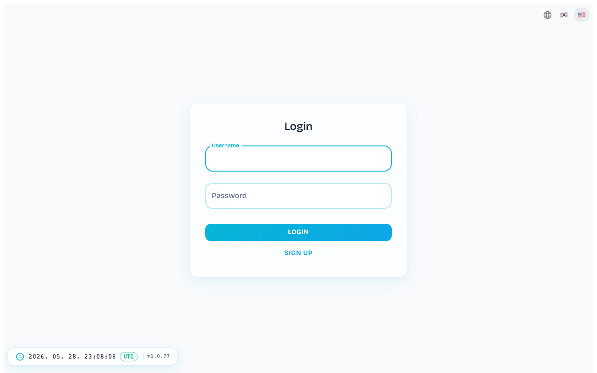

기존 계정이 있다면 **아이디·비밀번호**를 입력하고 **[로그인]** 버튼을 클릭합니다. 처음 사용한다면 하단의 **[회원가입]** 버튼을 클릭해서 계정을 만듭니다.

### 1-2. 회원가입 폼

회원가입 모드로 전환되면 다음 5개 필드가 표시됩니다.

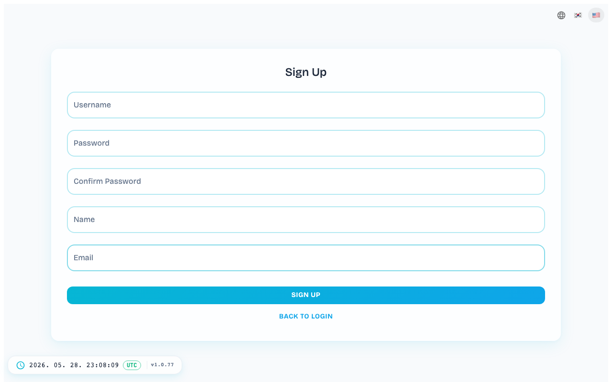

| 필드 | 설명 |
|---|---|
| 아이디 | 로그인용 식별자 (영문/숫자 권장) |
| 비밀번호 | 8자 이상 권장 |
| 비밀번호 확인 | 위와 동일하게 다시 입력 |
| 이름 | 화면에 표시될 사용자 이름 |
| 이메일 | 인증·알림 발송용 이메일 주소 |

모든 필드를 채운 모습입니다.

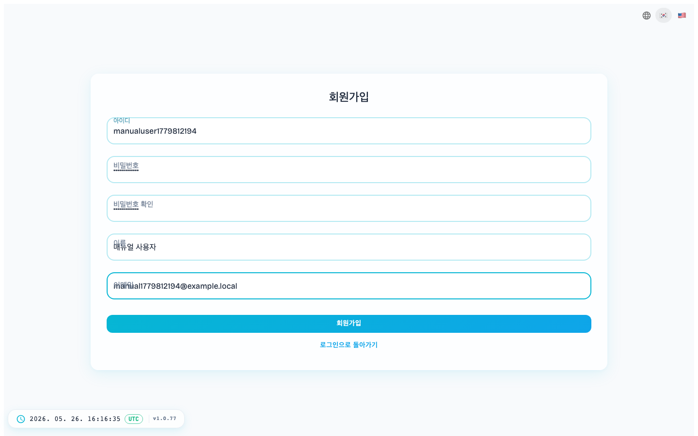

**[회원가입]** 버튼을 누르면 계정이 등록되고, 자동으로 로그인 화면으로 돌아옵니다(성공 안내 표시).

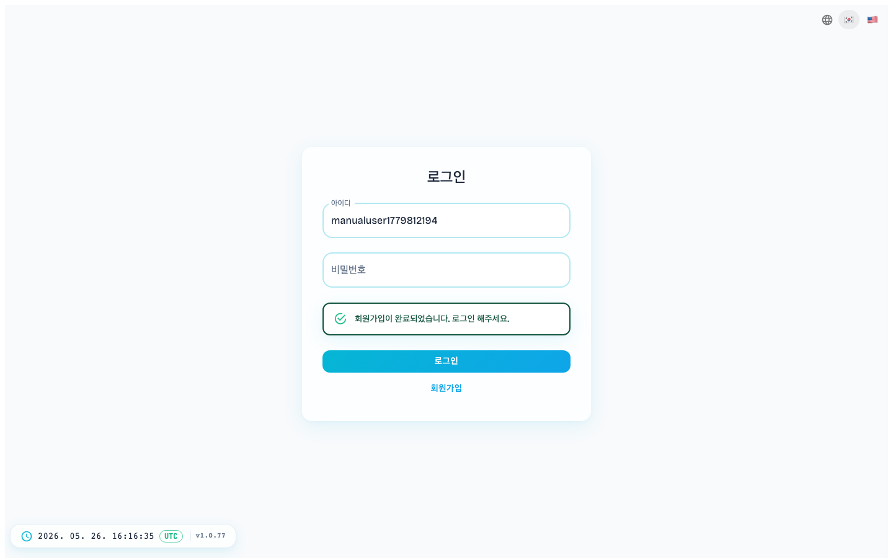

> ⚠️ **에러 메시지가 보이면** — `Failed to fetch` 같은 네트워크 오류는 서비스 접속 주소 설정 문제일 수 있습니다. 운영 담당자에게 문의하세요 (상세는 [`DOCKER_SETUP.md`](../../deployment/DOCKER_SETUP.md) §9 참고).

### 1-3. 로그인

방금 만든 계정으로 로그인합니다.

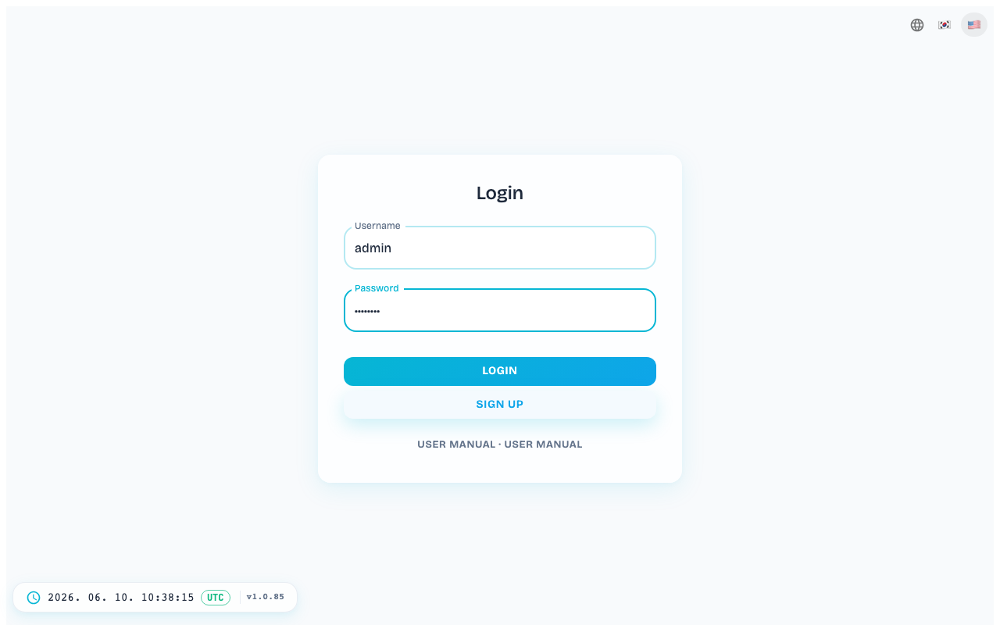

성공하면 **프로젝트 관리** 화면(`/projects`)으로 이동합니다.

---

## 2. 프로젝트 만들기

신규 사용자는 참여 중인 프로젝트가 없으므로 빈 화면이 보입니다.

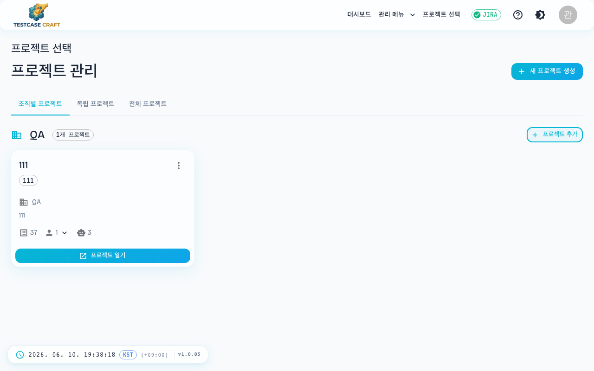

우상단의 **[+ 새 프로젝트 생성]** 또는 가운데의 **[+ 프로젝트 생성]** 버튼을 클릭하면 다이얼로그가 열립니다.

### 2-1. 프로젝트 생성 다이얼로그

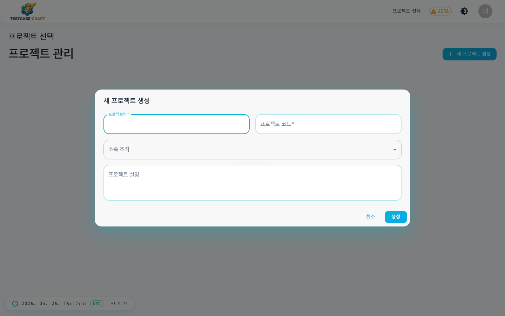

다이얼로그에서 다음을 입력합니다.

| 항목 | 예시 | 비고 |
|---|---|---|
| 프로젝트 이름 | `샘플 프로젝트` | 화면에 표시되는 이름 |
| 프로젝트 코드 | `SMP` | 테스트케이스 식별 ID 접두어 (예: `SMP-001`) |

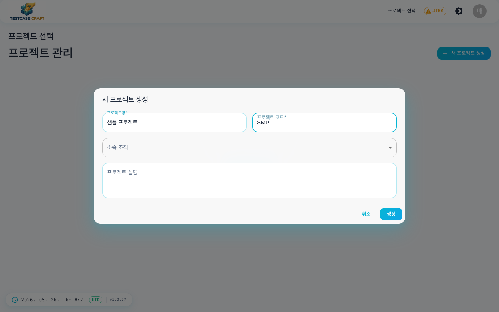

**[생성]** 버튼을 누르면 프로젝트가 만들어지고 카드 형태로 노출됩니다.

### 2-2. 생성된 프로젝트 카드

- 상단 **[독립 프로젝트] / [전체 프로젝트]** 탭으로 범위 전환
- 카드에는 **케이스 수 / 멤버 수 / 자동화 수** 가 작게 표시
- **[프로젝트 열기]** 버튼으로 진입

---

## 3. 화면 구성과 헤더

프로젝트에 진입하면(`/projects/{projectId}`) 상단 헤더 + 좌측 트리 + 우측 본문의 3분할 레이아웃이 표시됩니다. 첫 화면은 프로젝트 대시보드가 기본으로 열리며, 전사 대시보드는 `/dashboard` 로 별도 접근합니다.

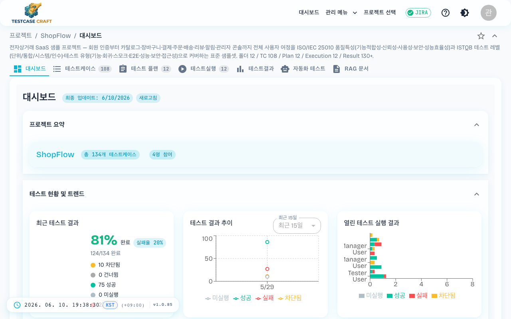

> **2026-05-29 변경**: 폼의 **필드 표시 토글**·**입력 모드 선택** 등 화면별 사용자 설정은 서버에 사용자별로 저장됩니다. 다른 PC 에서 로그인해도 같은 설정이 그대로 유지됩니다.

### 3-1. 헤더 구성

| 영역 | 설명 |
|---|---|
| 좌측 로고 `TESTCASE CRAFT` | 클릭 시 프로젝트 목록(`/projects`)으로 |
| 브레드크럼 `프로젝트 / 샘플 프로젝트 / 대시보드` | 현재 위치 표시 |
| 탭바 `대시보드 / 테스트케이스 / 테스트 플랜 / 테스트실행 / 테스트결과 / 자동화 테스트 / RAG 문서 / 탐색 세션` | 프로젝트 내 영역 전환 |
| 우상단 `프로젝트 선택` | 다른 프로젝트로 빠르게 이동 |
| `⚠ JIRA` 배지 | JIRA 미설정 시 노란 경고 — 클릭하면 설정 안내 |
| 🌓 (테마 아이콘) | 다크/라이트 모드 토글 |
| 사용자 아바타 (이니셜) | 클릭 시 프로필/로그아웃 메뉴 |

### 3-2. JIRA 패널

헤더의 **JIRA** 배지를 클릭하면 연동 설정 화면으로 이동합니다.

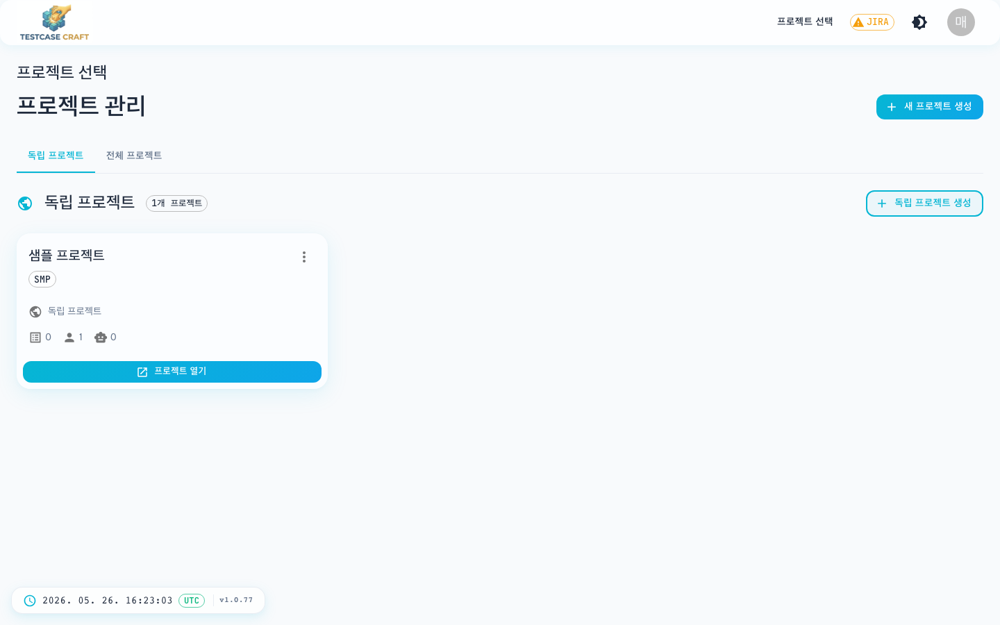

---

## 4. 테스트 케이스 작성

상단 **[테스트케이스]** 탭(`/projects/{projectId}/testcases`)으로 진입합니다.

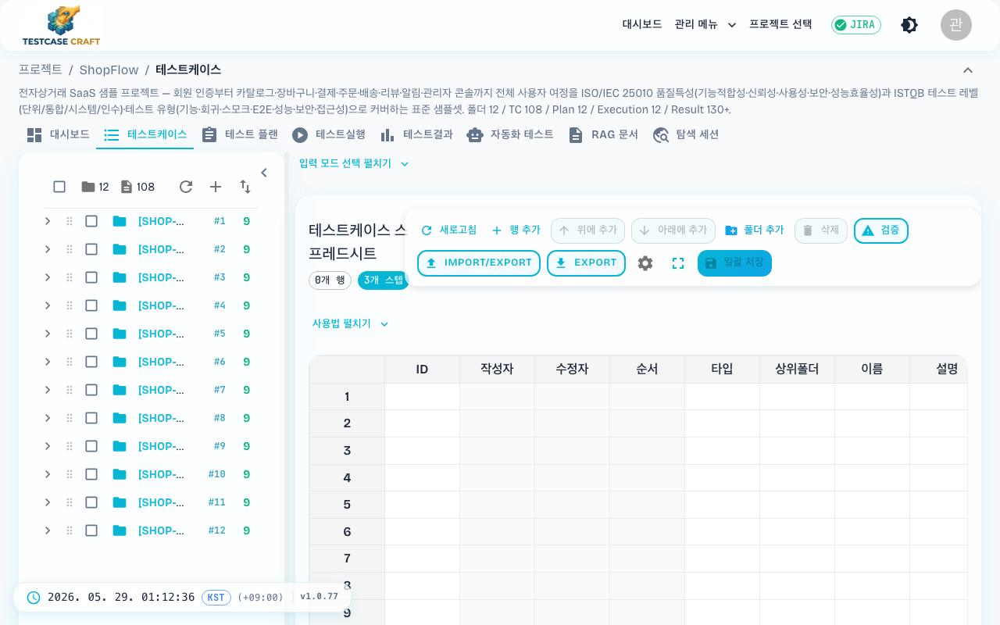

> **2026-05-29 변경**: 폼 모드 헤더의 모드 타이틀(H6)이 제거되었습니다. 어떤 케이스를 편집 중인지는 헤더 좌측의 **표시 ID Chip** (예: `SMP-001`) 으로 확인합니다. 폼 본문은 **2단 그리드**(좌: 메타 + 사전/사후 조건, 우: 스텝 + 기대 결과)로 정리되며 모든 메타 섹션이 Accordion 으로 통일되어 접고 펼 수 있습니다. 헤더의 액션(자동 저장 표시·버전·RAG 뱃지·저장·취소·버전 생성)은 한 줄로 묶입니다.

### 4-1. 화면 구성

| 영역 | 설명 |
|---|---|
| 왼쪽 패널 | **테스트 케이스 트리** — 폴더와 케이스를 폴더 모양으로 정리해서 보여줍니다 |
| 왼쪽 위 도구 줄 | ☑ 전체 선택 / 📁 폴더 수 / 📄 케이스 수 / 🔄 새로고침 / ↕ 정렬 / `<` 패널 접기 |
| 오른쪽 본문 | **스프레드시트(표)** — 한 번에 여러 케이스를 표로 작성합니다 |
| 본문 위 도구 줄 | `+ 행 추가`, `위에 추가`, `아래에 추가`, `폴더 추가`, `삭제`, `검증`, `가져오기/내보내기`, `톱니바퀴(옵션)`, `전체화면`, `일괄 저장` |

### 4-2. 입력 모드 선택

본문 상단의 **[입력 모드 선택 펼치기]** 를 클릭하면 입력 방식을 전환할 수 있습니다. 패널 우측에는 **개별 폼 / 스프레드시트** 토글 버튼이 한 그룹으로 나란히 표시되어 한 번의 클릭으로 모드를 바꿉니다.

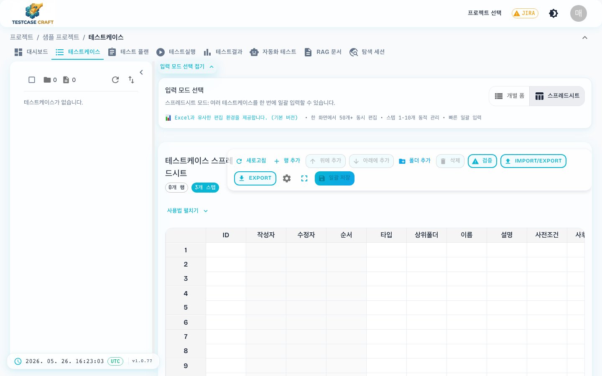

- **스프레드시트 모드** — 표 형태로 여러 케이스를 한 번에 입력 (기본)
- **폼 모드** — 한 건씩 항목별로 자세히 입력
- **고급 스프레드시트** — 외부 스프레드시트(엑셀 등)에서 복사·붙여넣기 작업이 익숙한 사용자용

> **2026-05-29 변경**: 스프레드시트 셀에 한글 30자(약 480px)를 넘는 긴 내용이 들어오면 **자동 워드랩** 됩니다. 컬럼이 가로로 늘어나지 않고 그 행의 높이만 늘어나므로 한 화면에서 여러 케이스를 비교하기 쉽습니다 (스프레드시트 / 고급 스프레드시트 모두 동일).

### 4-3. 행 추가 다이얼로그

스프레드시트 상단의 **[+ 행 추가]** 를 누르면 추가할 행 개수를 묻는 다이얼로그가 뜹니다.

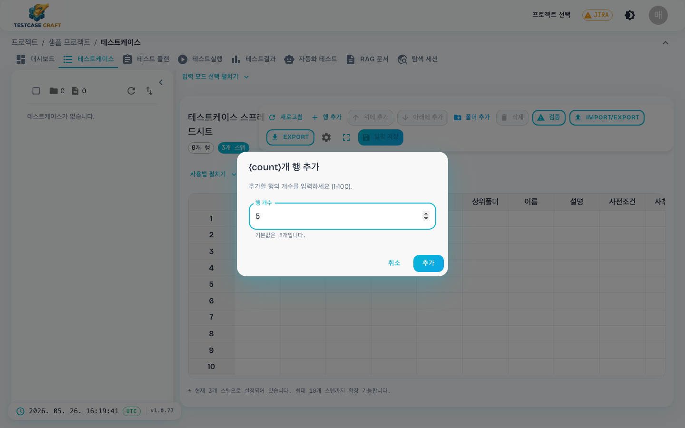

기본 5개, 1~100개까지 한 번에 추가할 수 있습니다. **[추가]** 를 누르면 빈 행이 생기고 ID·이름·설명·사전조건·단계(스텝) 등을 채우면 됩니다. 작성이 끝나면 우상단 **[💾 일괄 저장]** 으로 한 번에 저장합니다.

### 4-4. 폴더와 케이스 트리 구조

testcasecraft는 폴더와 케이스를 **하나의 트리**로 관리합니다.

- **폴더** (`📁`) — 케이스를 묶어서 분류하는 단위
- **케이스** (`📄`) — 실제 테스트 시나리오
- **시스템 기본 폴더** — 프로젝트가 만들어질 때 자동으로 생기는 보호 폴더입니다. 실수 방지를 위해 이동·삭제할 수 없습니다.

좌측 트리 헤더의 **➕** 아이콘(권한이 있을 때 노출) 또는 트리에서 **우클릭** → 메뉴로 폴더/케이스를 추가할 수 있습니다.

### 4-5. 필드 표시 토글

폼 모드 우상단의 **🔲 (필드 표시)** 아이콘을 클릭하면 폼에서 보이는 메타 필드를 켜고 끌 수 있습니다.

토글 대상 9개 필드:

- 설명
- 사전 조건
- 사후 조건
- 자동화 여부
- Manual / Automation
- 테스트 기법
- 우선순위
- 태그
- 연결된 RAG 문서

> 핵심 필드(이름·스텝·기대 결과)는 항상 표시되며 토글 대상에서 제외됩니다.

팝오버 하단의 **[모두 표시] / [모두 숨김] / [기본값]** 버튼으로 한 번에 정리할 수 있습니다. 선택한 값은 사용자별로 서버에 저장되어 다른 PC 에 로그인해도 동일하게 유지됩니다.

### 4-6. 메타데이터 영역

폼 좌측 상단의 **메타데이터** Accordion 에는 다음이 표시됩니다.

- **수정 가능 필드** — 이름, 표시 ID, 설명, 우선순위, 태그 등 (위 §4-5 토글에 따라 노출)
- **읽기 전용 필드** — 생성일·수정일·작성자·UUID 등 시스템이 채우는 정보. UUID 는 자르지 않고 풀 문자열로 노출되어 외부 시스템 연동·디버깅에 그대로 복사할 수 있습니다.

---

## 5. 테스트 케이스 트리 — 드래그앤드롭 재구성

> 본 기능은 v1.0.77 부터 제공됩니다. 더 자세한 안내는 [`docs/guide/TREE_DND_USER_GUIDE.md`](../../guide/TREE_DND_USER_GUIDE.md) 를 참고하세요.

> **2026-05-29 변경**: 트리 노드 좌측의 **표시 ID 칩** 은 `SMP-001` 처럼 마지막 번호만 monospace 로 짧게 표시되고, 칩에 마우스를 올리면 전체 ID 가 툴팁으로 보입니다. 노드 이름도 폭이 좁아 잘릴 때만 호버 시 전체 이름이 툴팁으로 표시되어 평소엔 화면이 더 깔끔합니다.

### 5-1. 동작 요약

기존의 **우클릭 메뉴**(추가/이름변경/삭제)와 **순서 편집 모드**(↑/↓ 버튼)는 그대로 사용 가능하며, 추가로 다음과 같이 **마우스 드래그**로 위치를 바꿀 수 있습니다.

| 하고 싶은 것 | 동작 |
|---|---|
| 케이스를 다른 폴더로 옮기기 | 케이스 행 좌측 **`⋮⋮`(드래그 핸들)** 을 잡고 끌어 폴더 위에 놓기 |
| 폴더 통째로 옮기기 | 폴더 행의 드래그 핸들을 잡고 다른 폴더 위에 놓기 |
| 같은 폴더 안에서 순서 바꾸기 | 항목과 항목 사이의 **가는 간격** 에 놓기 |
| 루트로 이동 | 트리 최상단 빈 영역에 놓기 |

드롭 직전 어디에 들어갈지 **연한 가이드 라인** 으로 미리 보입니다.

### 5-2. 다중 선택 이동

여러 항목을 한 번에 옮길 수 있습니다.

1. **체크박스** 또는 `Cmd-click`(Mac) / `Ctrl-click`(Win)로 여러 노드 선택
2. 선택된 묶음 중 **하나의 드래그 핸들** 을 잡고 끌기 → 묶음 전체가 함께 이동
3. 서버에는 한 번의 요청으로 전송되며, 하나라도 실패하면 **전체가 원래 상태로 되돌아갑니다** (부분 적용 없음)

### 5-3. 자동 차단되는 이동

다음은 드래그 중 가이드가 **빨간색** 으로 바뀌며 자동 차단됩니다.

- 자기 자신 또는 자기 안에 있는 폴더로 옮기기 (예: A 폴더를 A 안의 B 폴더로 이동)
- 다른 프로젝트의 폴더로 옮기기
- 테스트 케이스 **안에** 다른 항목 넣기 (케이스는 자식을 가질 수 없음)
- 시스템 기본 폴더 옮기기

거부되면 화면 하단의 알림으로 이유를 알려주고, 트리는 즉시 원래대로 돌아갑니다.

### 5-4. 이동 기록 (감사 로그)

모든 성공한 이동은 시스템에 자동으로 기록됩니다 — **누가, 언제, 어디서 어디로 옮겼는지** 관리자가 추적할 수 있습니다. 실수로 옮긴 경우 관리자에게 문의하면 원위치를 찾을 수 있습니다.

---

## 6. 대시보드와 통계

프로젝트 상단 **[대시보드]** 탭(`/projects/{projectId}` 진입 시 기본 화면)은 그 프로젝트의 핵심 지표를 한 화면에 정리해 줍니다. 전사 단위로 보려면 헤더의 **대시보드** 메뉴로 `/dashboard` 에 접근합니다.

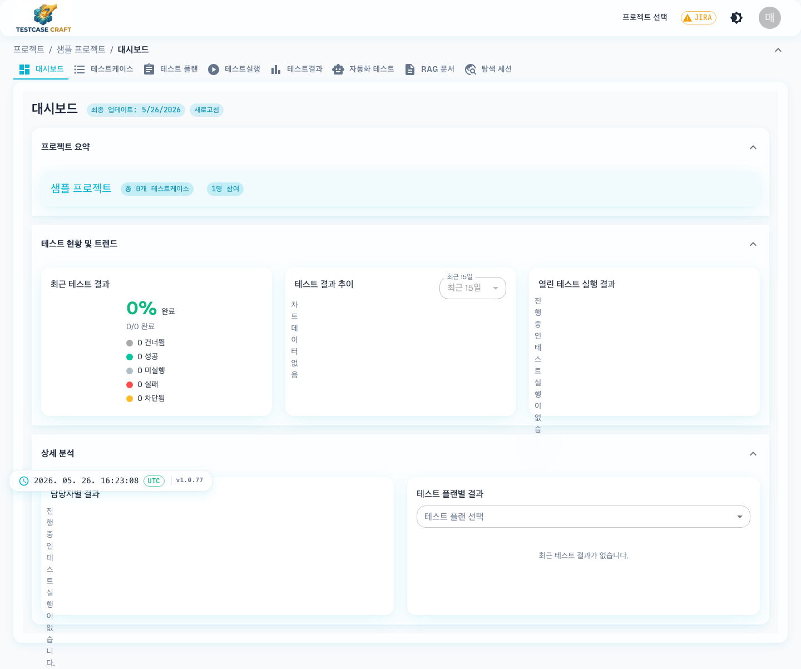

| 카드 | 설명 |
|---|---|
| 프로젝트 요약 | 케이스 수 · 참여 인원 |
| 최근 테스트 결과 | 성공 / 실패 / 미실행 / 건너뜀 / 차단됨 비율 |
| 테스트 결과 추이 | 최근 며칠간의 진행 흐름 차트 |
| 열린 테스트 실행 결과 | 진행 중인 실행 요약 |
| 담당자별 결과 | 멤버별 케이스 진행 상황 |
| 테스트 플랜별 결과 | 플랜 단위 통계 |

화면 위 **[새로고침]** 을 누르면 최신 데이터로 갱신됩니다. **[최근 15일 ▾]** 으로 표시 기간을 바꿀 수 있습니다.

---

## 7. 테스트 플랜

상단 **[테스트 플랜]** 탭(`/projects/{projectId}/testplans`)에서 한 묶음의 테스트케이스를 실행 단위로 묶은 **테스트 플랜**을 관리합니다.

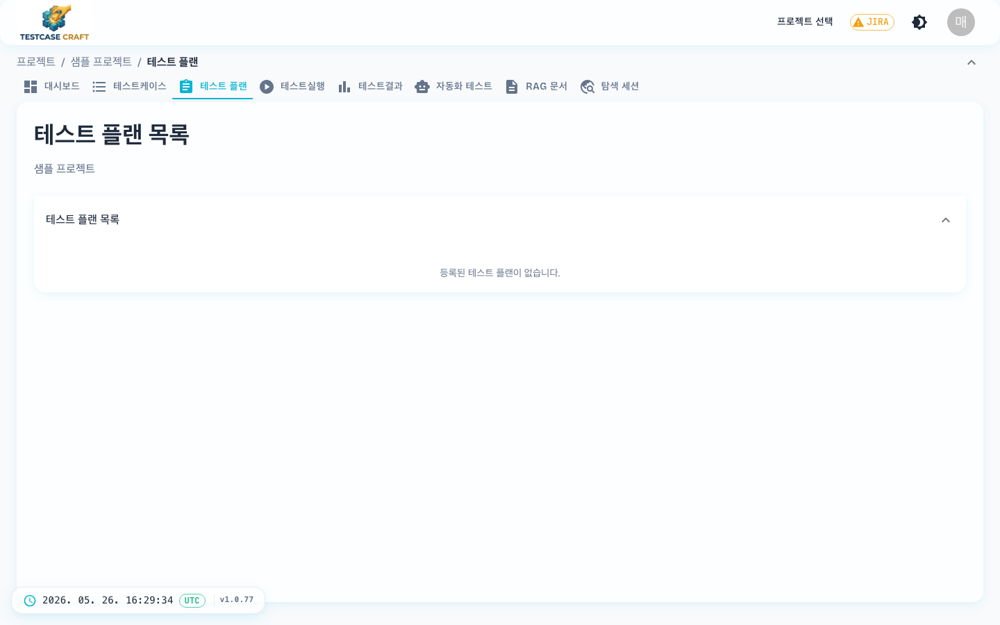

- 우상단 **[+ 새 플랜]** 버튼으로 신규 플랜 생성 (이름, 설명, 포함할 케이스 선택)
- 플랜 목록에서 카드/행 클릭 → 상세 진입
- 플랜에 묶인 케이스는 "테스트 실행"에서 한 번에 실행 가능

> 신규 프로젝트라 플랜이 비어 있는 상태입니다. 플랜을 만들면 카드로 보입니다.

---

## 8. 테스트 실행

상단 **[테스트실행]** 탭(`/projects/{projectId}/executions`)은 테스트 플랜에 묶인 케이스들의 실행 인스턴스를 관리합니다.

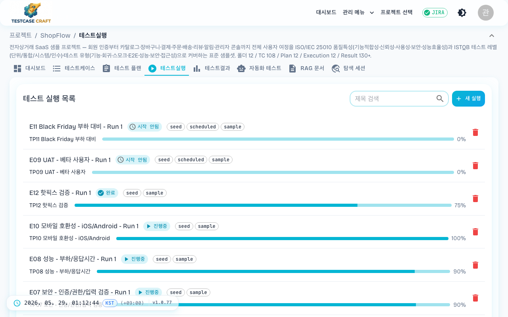

- 검색창으로 제목 필터링
- 행 클릭 → 그 실행 내부로 진입, 각 케이스의 결과(통과/실패/건너뜀/차단)를 기록
- "테스트 결과" 탭은 종료된 실행의 통계를 종합 조회

수동 실행은 다음 흐름입니다.

1. 테스트 플랜에서 **[실행 시작]** 클릭
2. 케이스 하나씩 진행 — 단계별 expected/actual 입력 + Pass/Fail 마킹
3. 첨부 파일(스크린샷, 로그 등) 업로드 가능
4. 완료 시 결과는 자동으로 **테스트 결과** 와 **대시보드 통계**에 반영

---

## 9. 테스트 결과

상단 **[테스트결과]** 탭(`/projects/{projectId}/results`)은 종료된 실행의 결과를 종합 조회합니다.

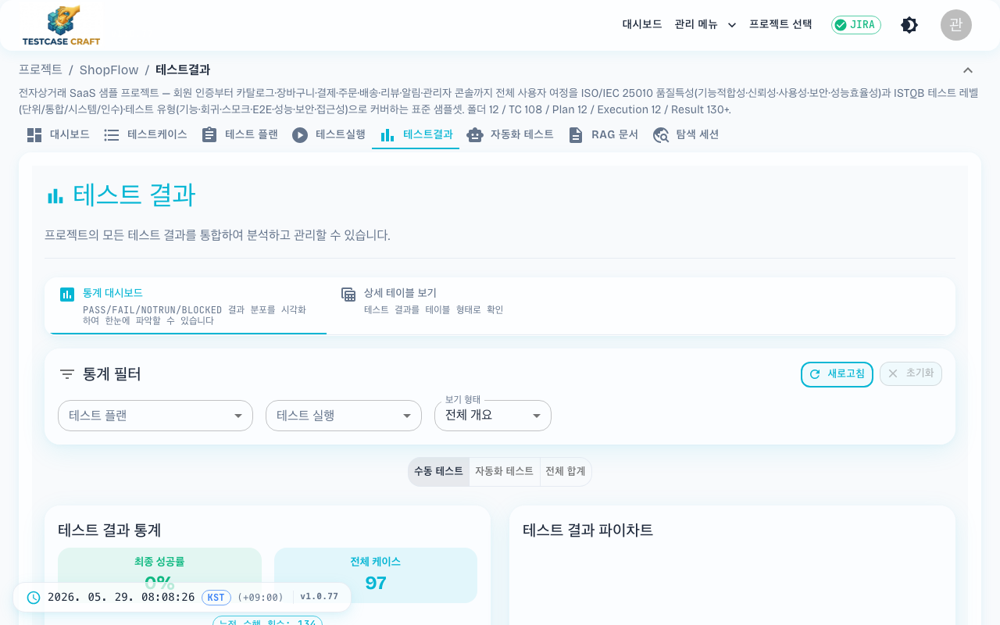

- 필터: 기간, 플랜, 담당자, 결과 상태
- 케이스 단위 통과율, 최근 N회 추이 차트
- CSV / Excel / JSON 파일로 내보내기 가능

---

## 10. 자동화 테스트

상단 **[자동화 테스트]** 탭(`/projects/{projectId}/automation`)은 자동화 테스트 도구(JUnit·Playwright·Pytest 등)가 만든 결과 파일을 올려서 testcasecraft에서 모아 보는 기능입니다.

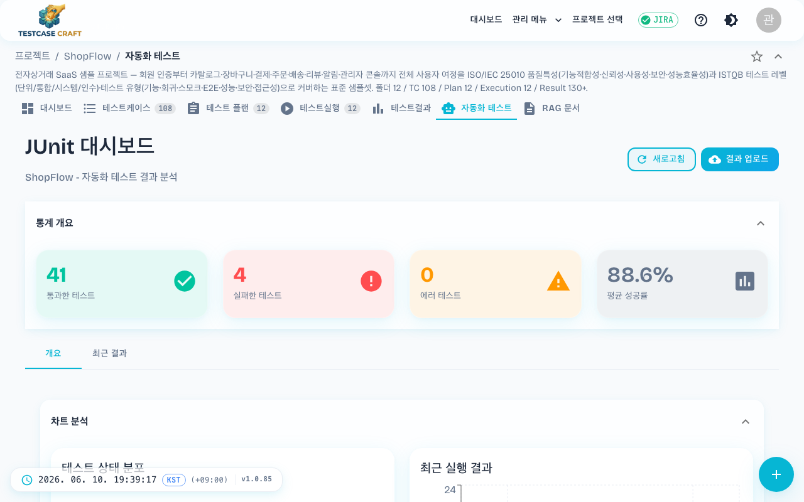

- **결과 파일 업로드** — JUnit XML 파일(최대 100MB)
- 올리면 자동으로 케이스와 매칭하고 통계에 반영됩니다
- 어떤 도구로 어떻게 파일을 만드는지는 운영 담당자에게 문의

> 단순히 결과 파일만 따로 보고 싶다면 **[JUnit 결과]** 화면(`/projects/{projectId}/junit`)에서 확인할 수 있습니다.

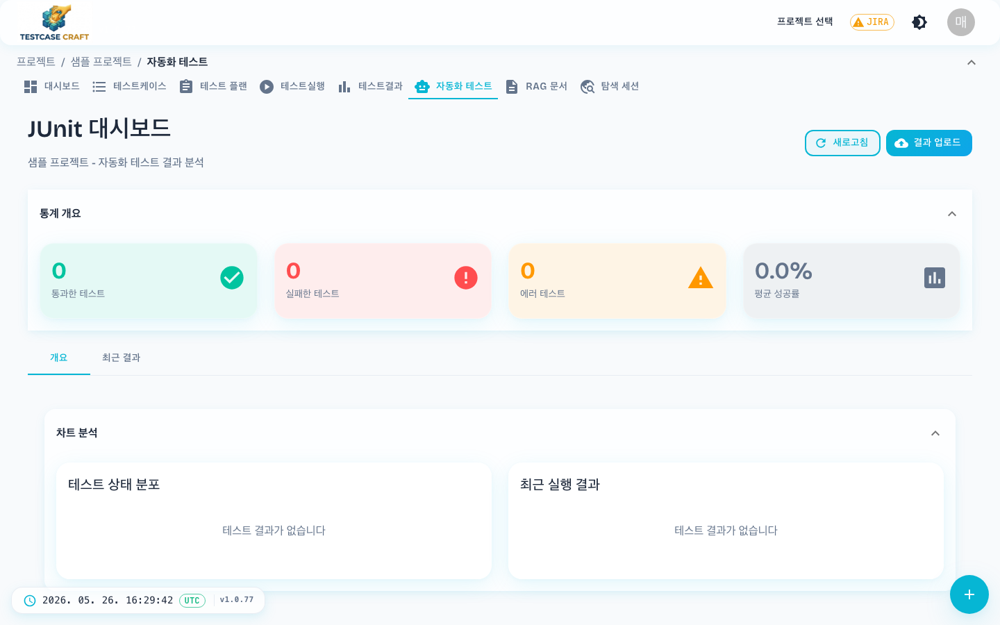

---

## 11. RAG 문서 & 챗

상단 **[RAG 문서]** 탭(`/projects/{projectId}/rag`)은 프로젝트 지식 베이스를 관리합니다.

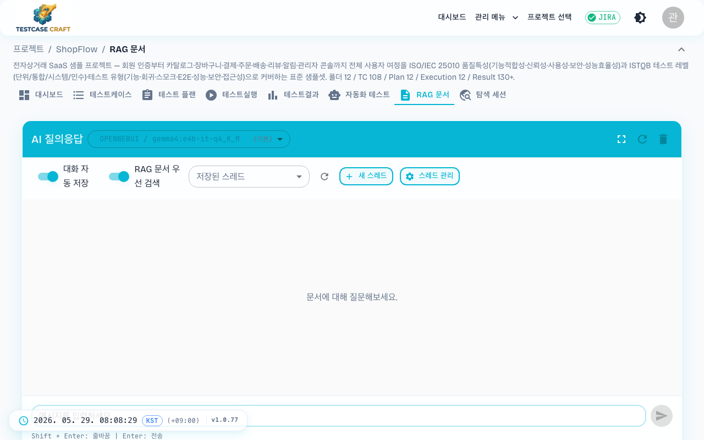

- 문서 업로드 (PDF/MD/HTML/이미지 등) → 자동으로 임베딩 생성
- 케이스 작성 시 "관련 RAG 문서" 자동 추천
- RAG 챗으로 자연어 질의 → 출처 인용 답변

> RAG는 별도의 보조 서비스로 운영됩니다. 일부 운영 환경에서는 비활성화되어 이 탭이 숨겨질 수 있습니다.

---

## 12. 탐색 세션 (SBTM)

상단 **[탐색 세션]** 탭(`/projects/{projectId}/exploratory`)은 **Session-Based Test Management** 기반의 탐색 테스트 세션을 관리합니다.

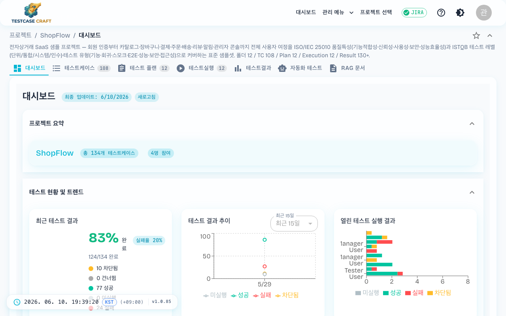

- **차터(Charter)** — 탐색 목표 1줄 정의
- 세션 시작 → 타이머 가동 (보통 60–120분)
- 진행 중 발견 노트/버그/스크린샷 기록
- 종료 시 세션 보고서 자동 작성, 승인 워크플로우

> 환경 변수 `SHOW_EXPLORATORY_SESSION_TAB=true`일 때만 노출됩니다 ([§16](#16-부록--jira-연동-환경-변수) 참고).

---

## 13. 사용자 프로필 & 설정

헤더 우상단 **사용자 아바타** → **[프로필]** 을 클릭하면 사용자 프로필 다이얼로그가 열립니다.
다이얼로그는 7개의 탭으로 구성되어 있습니다.

### 13-1. 기본 정보

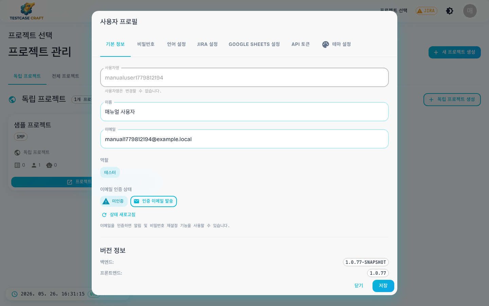

- 사용자명 / 이름 / 이메일 표시 (사용자명은 변경 불가)
- 역할 (테스터/PM/관리자 등) 배지
- 이메일 인증 상태 — **[미인증]** 이면 **[인증 이메일 발송]** 버튼으로 메일 인증
- 하단에 서비스 버전(서버/화면) 표시

### 13-2. 비밀번호 변경

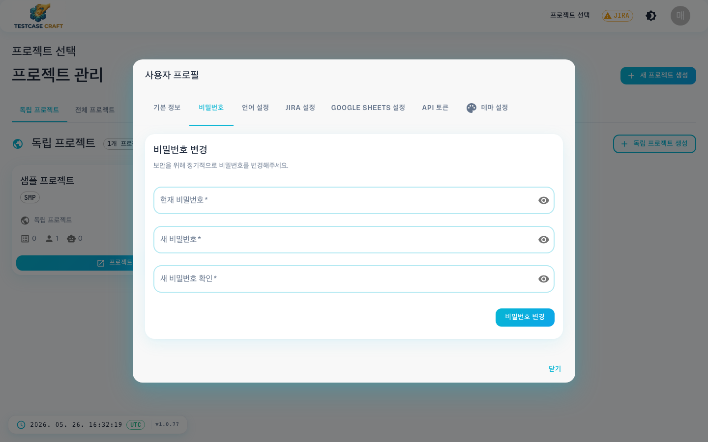

기존 비밀번호 확인 후 새 비밀번호 + 확인 입력 → **[저장]**.

### 13-3. 언어 & 시간대 설정

- **인터페이스 언어** — 한국어/English 등 (변경 시 즉시 반영, 자동 저장)
- **시간대 설정** — 모든 시간 표시(생성일·이동 로그·테스트 결과 등)에 적용
  - 기본값 `UTC`, 사용자 로컬 시간대로 변경 시 **[저장]** 클릭

### 13-4. JIRA 설정

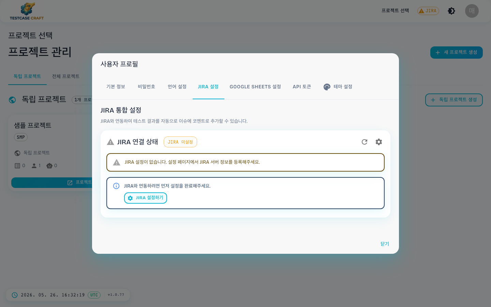

내 계정에서 사용할 JIRA 주소·이메일·연결 키를 등록합니다. 등록 후 헤더의 **⚠ JIRA** 경고가 사라집니다.

### 13-5. Google Sheets 설정

Google Sheets로 테스트 케이스를 가져오거나 내보내려면 Google 계정 연결이 필요합니다. 화면 안내에 따라 한 번만 연결하면 됩니다.

### 13-6. API 토큰

다른 시스템(예: JIRA 부가 앱, 자동화 스크립트)에서 testcasecraft에 연결할 때 쓰는 **연결 키(토큰)** 를 발급합니다.

- 한 사람당 **최대 10개** 발급 가능
- **발급한 직후 한 번만 전체 키가 표시되므로 반드시 안전한 곳에 복사** 해 두세요. 다시 볼 수 없습니다.
- 잃어버린 키는 폐기하고 새로 발급해야 합니다

### 13-7. 테마 설정

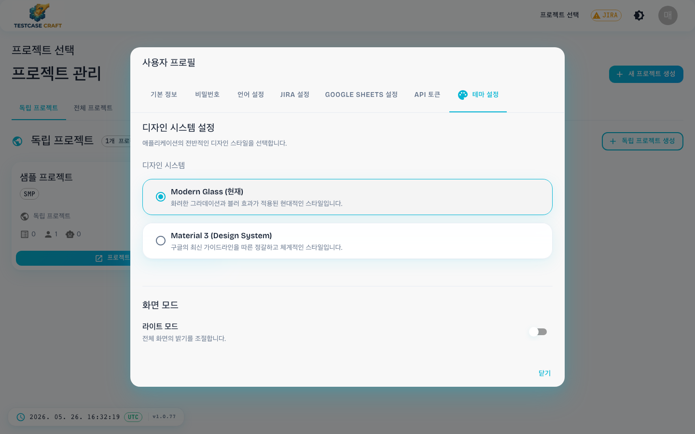

- 라이트/다크 모드 강제 선택 또는 OS 설정 따름
- 색상 팔레트(선택 사항)

---

## 14. 헤더 도구 — 다크모드 · 언어 · 프로젝트 선택

### 14-1. 다크모드 토글

헤더 우상단의 **🌓** 아이콘을 클릭하면 라이트 ⇄ 다크 모드가 즉시 전환됩니다.

### 14-2. 언어 선택

헤더의 국기 아이콘(`🇰🇷 KR ▾`)을 클릭하면 언어 메뉴가 열립니다. 더 정식 경로는 **프로필 → 언어 설정** 탭입니다 ([§13-3](#13-3-언어--시간대-설정) 참고).

### 14-3. 프로젝트 선택 (빠른 전환)

헤더의 **[프로젝트 선택]** 을 클릭하면 현재 사용자가 속한 프로젝트 목록이 드롭다운으로 펼쳐집니다.

다른 프로젝트로 즉시 전환 가능 — 현재 탭(대시보드/테스트케이스 등) 위치는 유지된 채 프로젝트만 변경됩니다.

---

## 15. 로그아웃

헤더 우상단 **사용자 아바타** → **[로그아웃]** 을 클릭하면 로그인이 해제되고 로그인 화면으로 이동합니다.

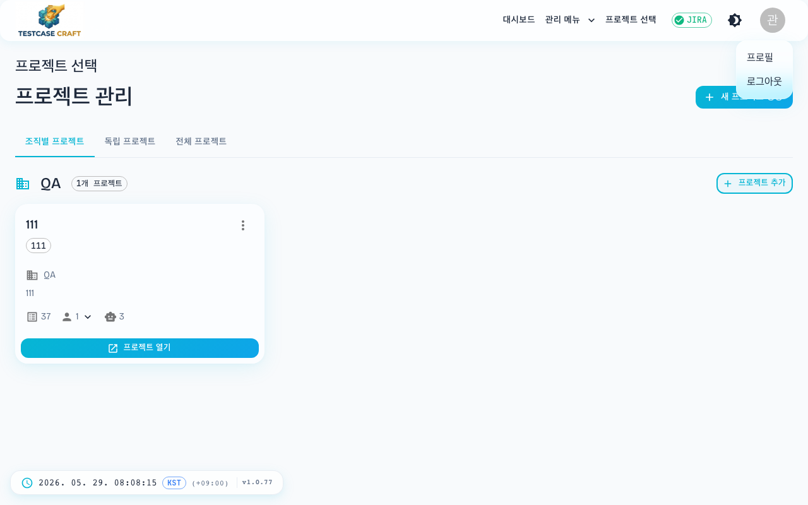

> 일정 기간 사용하지 않으면 보안을 위해 자동으로 로그아웃됩니다(기본 7일). 그 후엔 다시 로그인하면 됩니다.

---

## 16. 부록 — JIRA 연동 & 자주 묻는 질문

### 16-1. JIRA 연동

헤더의 **`⚠ JIRA`** 배지는 JIRA 설정이 비어 있다는 경고입니다. 클릭하면 JIRA 연동 설정 화면이 열립니다.

- 서버 URL, 사용자 이메일, API 토큰 입력
- 매핑 필드(우선순위, 담당자 등) 설정
- 저장 후 경고 배지가 사라집니다

### 16-2. 자주 만나는 화면 이슈

| 증상 | 점검 |
|---|---|
| `⚠ JIRA` 배지가 늘 보임 | 정상 — JIRA 설정 안 했으면 항상 노출. 사용하지 않으면 무시 |
| 헤더에 + 추가 버튼이 안 보임 | 프로젝트 권한이 VIEWER인지 확인 (PM/편집자만 추가 가능) |
| 드래그가 동작 안 함 | 읽기 전용(VIEWER) 권한이거나, 케이스 선택 모드 화면에서는 끌어 놓기가 꺼져 있습니다. 우클릭 메뉴/순서 편집 모드로 대체 가능 |
| 화면이 계속 로딩 중 | 일시적 네트워크 오류 가능 — 새로고침 후에도 계속되면 운영 담당자에게 문의 |
| 회원가입에서 `Failed to fetch` | 서버 측 환경 변수 문제일 가능성 — 운영 담당자에게 문의. 상세는 [`../../deployment/DOCKER_SETUP.md`](../../deployment/DOCKER_SETUP.md) §9 |

### 16-3. 설치·운영 관련 문서

자체 호스팅·도커 설정·환경 변수·백업·업그레이드·트러블슈팅 등 **운영자용 가이드**는 별도 문서로 분리되어 있습니다.

👉 **[`docs/deployment/DOCKER_SETUP.md`](../../deployment/DOCKER_SETUP.md)**

---

## 17. 시스템 관리자 설정 (ADMIN 전용)

> ⚠️ 본 섹션은 `role=ADMIN` 사용자에게만 노출되는 메뉴입니다. 시스템 기본 admin 계정의 초기 비밀번호는 코드에서 `admin / admin123`으로 정의되어 있으며, 운영 환경 배포 직후 반드시 변경하세요.

### 17-1. 관리자 메뉴 진입

관리자 계정으로 로그인하면 헤더에 **[대시보드] / [관리 메뉴 ▾] / [프로젝트 선택]** 이 추가로 노출됩니다.

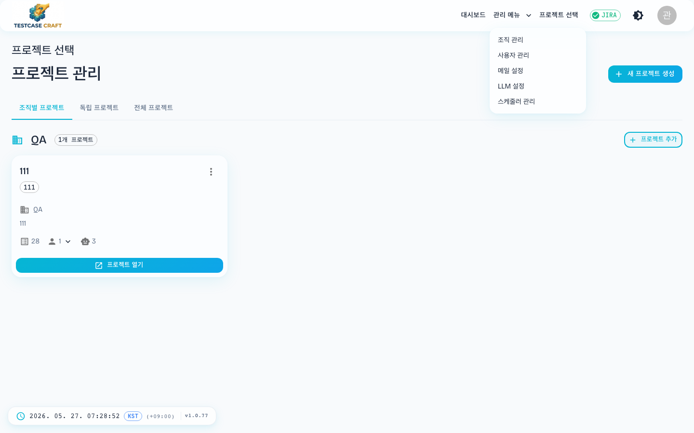

드롭다운 항목:
- **조직 관리** (`/organizations`)
- **사용자 관리** (`/users`)
- **메일 설정** (`/mail-settings`)
- **LLM 설정** (`/llm-config`)
- **스케줄러 관리** (`/scheduler`)

### 17-2. 전체 대시보드

헤더 좌측 **[대시보드]** 는 전 조직/전 프로젝트를 가로지르는 운영 통계 화면입니다.

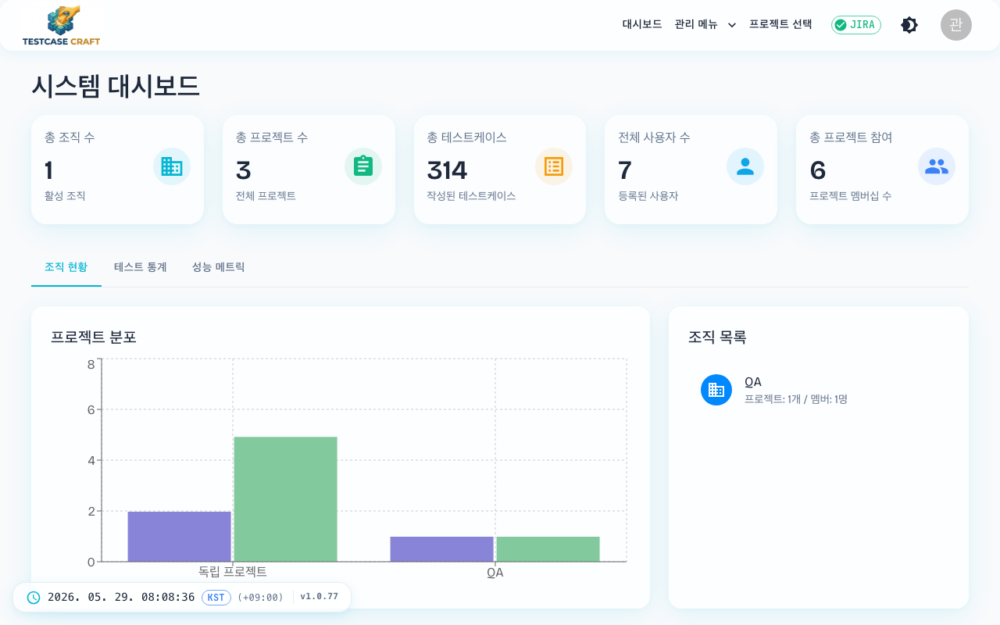

### 17-3. 조직 관리

`/organizations` — 조직(Organization) 단위로 프로젝트를 그룹핑합니다.

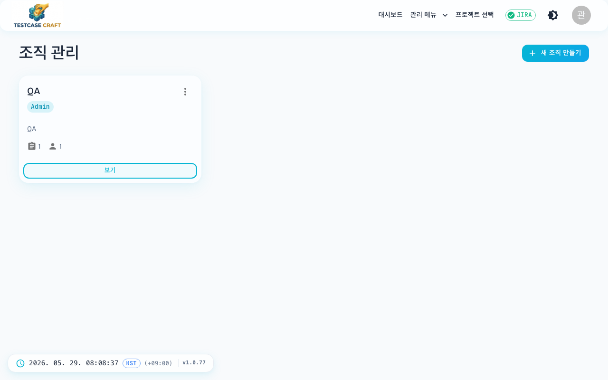

- 조직 신규 생성 / 수정 / 멤버 초대
- 조직 내 그룹(Group) 단위로 권한 매트릭스 관리
- 클릭 시 조직 상세(`/organizations/{id}`)로 진입

### 17-4. 사용자 관리

`/users` — 시스템의 모든 사용자를 조회·관리합니다.

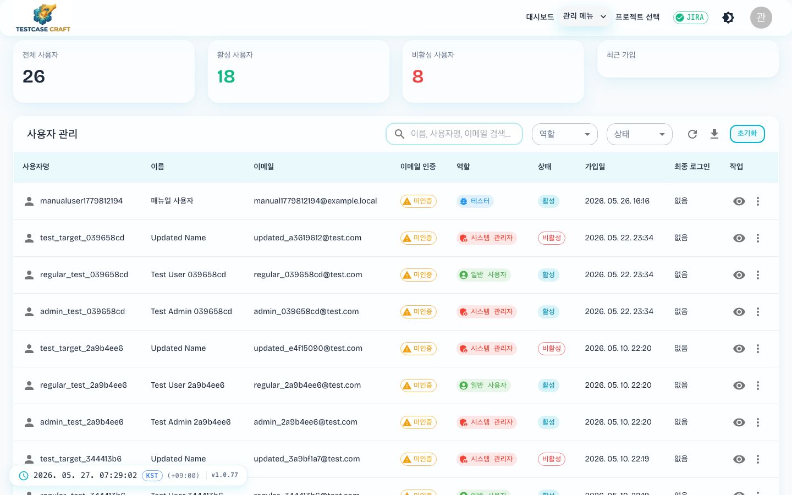

- 통계 카드: 전체 / 활성 / 비활성 / 최근 가입
- 검색: 이름·사용자명·이메일
- 필터: 역할(ADMIN/PM/테스터/일반 사용자) · 상태(활성/비활성)
- 행 우측 액션: **👁 상세 보기 · ⋮ 비밀번호 재설정 / 역할 변경 / 활성·비활성 토글**
- 이메일 인증 상태 배지 (미인증/완료)
- 우상단 **🔄 새로고침 / ⬇ 다운로드 / 초기화** 버튼

### 17-5. 메일 설정

`/mail-settings` — SMTP / 발신자 / 템플릿 설정.

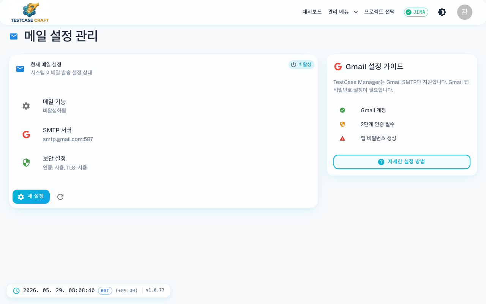

- SMTP 호스트·포트·계정
- 발신자 이메일 / 표시 이름
- 이메일 인증·비밀번호 재설정·실행 결과 알림 등 시스템 메일 템플릿
- **테스트 메일 발송** 으로 설정 검증

### 17-6. LLM 설정

`/llm-config` — RAG 챗·AI 메타 자동 생성 등에 사용할 LLM 프로바이더 설정.

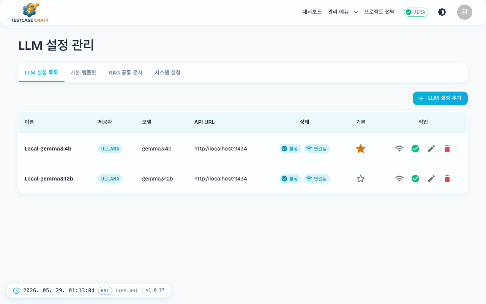

- 프로바이더: OpenAI / Anthropic / Azure OpenAI / 로컬 모델 등
- 모델 명, API Key, 베이스 URL
- 프롬프트 템플릿(시스템 프롬프트 · 예시) 관리
- 사용량 한도와 비용 추적 옵션

### 17-7. 스케줄러 관리

`/scheduler` — 주기적 백그라운드 작업의 켜고/끄기·주기 변경.

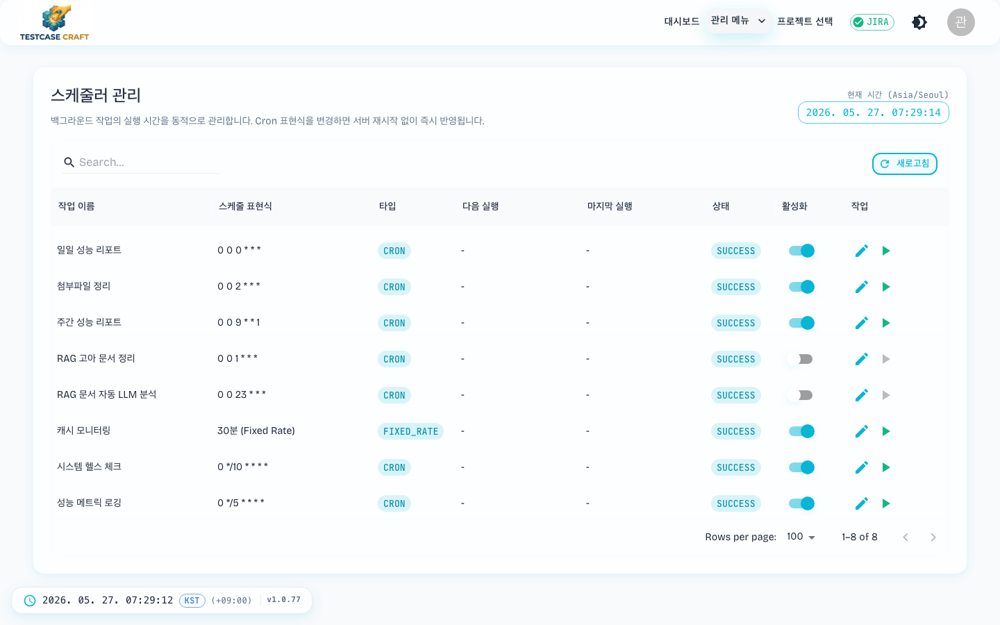

- 등록된 잡 목록 (예: JIRA 동기화, RAG 인덱스 재구축, 만료 토큰 정리)
- 각 잡의 **Cron 표현식**, 마지막 실행 시각/결과
- **수동 실행** 버튼, 일시정지/재개

### 17-8. 번역 관리 (i18n)

`/translation-management` — UI 다국어 키와 번역을 동적으로 편집합니다 (헤더 메뉴에는 기본 비노출 — URL 직접 접근).

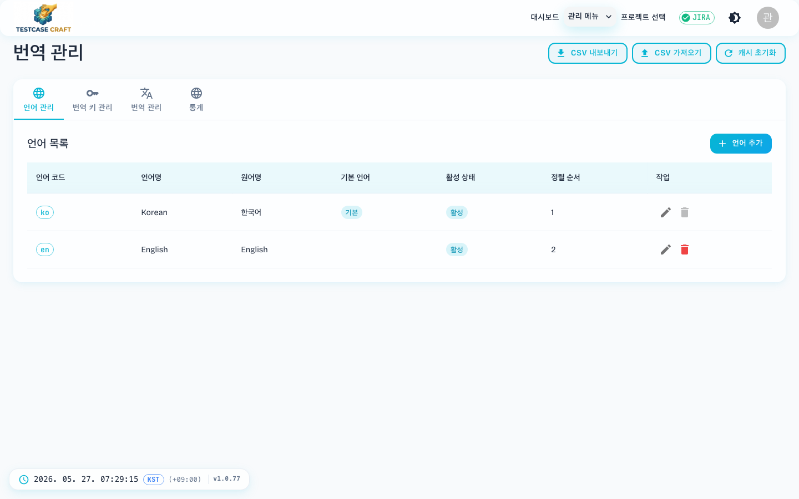

- 언어별 번역 키/값 편집
- 누락된 키 통계
- 카테고리별 그룹화
- 추가 언어 등록 가능

> 본 화면은 i18n 키가 많아 일반 사용자에게는 보이지 않습니다. 한국어/영어 외 추가 언어를 도입하거나 라벨을 수정할 때만 사용합니다.

### 17-9. 프로젝트 단위 설정 (PM)

프로젝트 카드의 우상단 **⋮ (점 3개)** 메뉴 또는 프로젝트 진입 후 헤더의 메뉴로 접근합니다. (`PROJECT_MANAGER` 권한)

- 프로젝트 이름 / 코드 / 설명 변경
- 멤버 초대 / 역할 부여 (PM / LEAD_DEVELOPER / TESTER / VIEWER)
- 시스템 기본 폴더 / 우선순위 / 태그 컨벤션
- 프로젝트 삭제 (모든 케이스·결과 함께 삭제 — 되돌릴 수 없음)

> 신규 프로젝트는 생성한 사용자가 자동으로 **PROJECT_MANAGER** 가 됩니다. VIEWER 또는 TESTER 권한 사용자는 이 메뉴가 보이지 않거나 일부만 활성화됩니다.

---

## 18. 용어 정리

매뉴얼에 자주 등장하는 표현을 한자리에 모았습니다. 처음 사용하는 분이 본문을 읽을 때 참고하세요.

### 18-1. 핵심 도메인 용어

| 용어 | 풀이 |
|---|---|
| **테스트 케이스 (Test Case)** | 하나의 시나리오를 검증하기 위한 단계·조건·기대 결과의 묶음. 예: "정상 로그인", "비밀번호 5회 실패 시 잠금". |
| **폴더** | 케이스를 분류하기 위한 통. 폴더 안에 케이스 또는 다른 폴더를 둘 수 있습니다. |
| **테스트 케이스 트리** | 폴더와 케이스를 위→아래로 펼쳐 보여주는 화면의 좌측 영역. |
| **테스트 플랜 (Test Plan)** | 한 번의 테스트 활동에 묶어서 실행할 케이스들의 묶음 + 일정·담당자 정보. |
| **테스트 실행 (Test Execution / Run)** | 플랜을 실제로 진행하는 작업 인스턴스. 케이스마다 결과를 기록합니다. |
| **테스트 결과 (Test Result)** | 종료된 실행의 결과 모음. 통계와 추이로 시각화됩니다. |
| **자동화 테스트** | JUnit·Playwright·Pytest 같은 자동화 도구가 만든 결과 파일을 testcasecraft에 올려 같이 추적하는 기능. |
| **탐색 세션 (SBTM)** | Session-Based Test Management. 60~120분 단위로 탐색 테스트를 진행하고 발견·노트·증빙을 기록하는 방식. |
| **RAG (검색 보조)** | 문서를 색인해서 자연어로 질의하면 출처와 함께 답해 주는 보조 기능. |

### 18-2. 케이스 작성 화면 용어

| 용어 | 풀이 |
|---|---|
| **스프레드시트 모드** | 표 형태로 여러 케이스를 한 번에 입력하는 화면. 엑셀과 비슷한 사용감. |
| **폼 모드** | 한 건씩 항목별로 자세히 입력하는 화면. |
| **고급 스프레드시트** | 외부 엑셀에서 셀 복사·붙여넣기에 익숙한 사용자를 위한 강화된 표 입력 화면. |
| **사전 조건** | 케이스를 실행하기 전에 갖춰져 있어야 할 상태(예: "사용자 A가 가입되어 있어야 함"). |
| **스텝(단계)** | 케이스 안의 한 행동 단위. 각 스텝마다 동작과 기대 결과를 적습니다. |
| **기대 결과 / 실제 결과** | 스텝 또는 케이스 전체에서 "이렇게 동작해야 한다"는 예상과, 실제로 "이렇게 동작했다"는 기록. |
| **표시 ID (Display ID)** | `프로젝트코드-번호` 형식의 식별자. 예: `SMP-001`. URL과 알림에서 사용됩니다. |
| **태그** | 케이스에 자유롭게 붙이는 라벨(예: `smoke`, `regression`). 검색·필터·자동화에서 활용. |
| **가져오기 / 내보내기** | CSV·Excel·JSON 또는 Google Sheets로 케이스 묶음을 한 번에 옮기는 기능. |

### 18-3. 실행 결과 상태

| 상태 | 의미 |
|---|---|
| **성공 (Pass)** | 기대 결과와 실제 결과가 같음 |
| **실패 (Fail)** | 기대와 다르게 동작 — 결함 가능성 |
| **미실행 (Not Run)** | 아직 실행하지 않음 |
| **건너뜀 (Skip)** | 의도적으로 진행하지 않음 (예: 환경이 안 맞음) |
| **차단됨 (Blocked)** | 사전 조건이 충족되지 않거나 환경 문제로 실행 자체가 불가 |

### 18-4. 권한과 역할

| 역할 | 무엇을 할 수 있는가 |
|---|---|
| **VIEWER** (뷰어) | 조회만 가능. 추가·수정·삭제·드래그 모두 비활성 |
| **TESTER** (테스터) | 케이스 실행 결과 기록, 탐색 세션 진행 |
| **TESTCASE_EDITOR / DEVELOPER** | 케이스·폴더 추가/수정/삭제, 드래그앤드롭 이동 |
| **LEAD_DEVELOPER** | 위 모두 + 플랜 관리 |
| **PROJECT_MANAGER (PM)** | 위 모두 + 프로젝트 설정, 멤버 초대, 권한 부여 |
| **ADMIN** | 시스템 전역 — 조직/사용자/메일/LLM/스케줄러 설정 (§17 참고) |

같은 사람이 프로젝트 A에서는 PM, 프로젝트 B에서는 VIEWER일 수도 있습니다 — 권한은 **프로젝트 단위**.

### 18-5. 화면 동작·도구 용어

| 용어 | 풀이 |
|---|---|
| **드래그앤드롭 (DnD, 끌어 놓기)** | 마우스로 항목을 잡아 다른 위치에 놓아 옮기는 동작. 트리에서 폴더/케이스 위치를 바꿀 때 씁니다. |
| **드래그 핸들** | 행 좌측의 점 6개 모양 아이콘(⋮⋮). 이걸 잡고 끌어야 드래그가 시작됩니다. |
| **다중 선택** | `Cmd-click`(Mac) / `Ctrl-click`(Win) 또는 체크박스로 여러 항목을 동시에 고르는 것. 다중 선택 상태에서 드래그하면 모두 함께 이동. |
| **컨텍스트 메뉴** | 항목 위에서 **마우스 우클릭** 하면 뜨는 메뉴(추가/이름변경/삭제/버전 히스토리 등). |
| **순서 편집 모드** | 트리 헤더의 ↕ 아이콘. 모드 진입 후 각 행의 ↑/↓ 버튼으로 한 칸씩 순서 변경 → 저장. |
| **이동 기록 (감사 로그)** | DnD로 옮긴 모든 이력이 시스템에 자동 보관되어, 관리자가 누가·언제·어디로 옮겼는지 확인 가능. |
| **다크모드 / 라이트모드** | 화면 전체 색조. 헤더의 🌓 아이콘으로 즉시 전환. |
| **다국어 (i18n)** | 한국어/English 등 화면 언어 선택. 프로필 → 언어 설정에서 변경. |

### 18-6. 외부 연동·도구

| 용어 | 풀이 |
|---|---|
| **JIRA** | 이슈 추적 도구. testcasecraft가 케이스↔JIRA 이슈를 연결해 양쪽 상태를 동기화합니다. |
| **JIRA API 토큰** | JIRA가 발급해 주는 연결 키. 비밀번호 대신 이걸로 안전하게 인증합니다. |
| **Google Sheets** | 구글 스프레드시트. 케이스를 가져오고 내보내는 데 활용. |
| **JUnit** | 자바 자동화 테스트 결과를 담는 표준 XML 형식. 다른 도구(Playwright·Pytest 등)도 호환 가능. |
| **API 토큰 (연결 키)** | 외부 시스템(자동화 스크립트, JIRA 부가 앱 등)이 testcasecraft에 자기 자신을 증명하기 위한 비밀 문자열. 발급 직후 한 번만 보이며 분실 시 폐기·재발급해야 합니다. |
| **LLM** | Large Language Model — 자연어 생성·요약 AI. 케이스 이름/설명 자동 생성, RAG 챗 답변에 사용. |
| **MCP** | Model Context Protocol — Claude/Cline 같은 AI 클라이언트가 testcasecraft를 자연어로 조작할 수 있게 하는 표준 통신 규약. |

### 18-7. 시간·식별자

| 용어 | 풀이 |
|---|---|
| **UTC** | 협정 세계시. 시간대 설정 기본값. |
| **KST** | 한국 표준시(UTC+9). 프로필 → 언어/시간대 설정에서 선택 가능. |
| **시간대 (Time Zone)** | 모든 시간 표시(생성·수정·실행·이동 기록)에 적용되는 사용자 설정. |
| **순차 ID (Sequential ID)** | 케이스에 자동으로 매겨지는 일련번호(예: 1, 2, 3 …). 프로젝트 내에서만 의미가 있습니다. |
| **표시 ID (Display ID)** | `프로젝트코드-순차ID` 형식의 사람이 읽기 쉬운 식별자(예: `SMP-001`). |

### 18-8. 자주 보는 화면 안내

| 표현 | 뜻 |
|---|---|
| **⚠ JIRA** (노란 배지) | JIRA 설정이 비어 있다는 안내. 클릭해서 §13-4 또는 §16-1 절차로 설정하거나, 사용하지 않으면 무시. |
| **이메일 인증 미인증** | 회원가입 후 인증 메일을 확인하지 않은 상태. 알림·비밀번호 재설정 기능에 제한이 있을 수 있음. |
| **"Failed to fetch"** | 화면이 서버와 통신하지 못한 상태. 새로고침 후에도 계속되면 운영 담당자에게 문의. |
| **시스템 기본 폴더** | 프로젝트 생성 시 자동으로 만들어지는 보호 폴더. 이동·삭제 불가. |

---

## 변경 이력

| 날짜 | 내용 |
|---|---|
| 2026-05-27 | 초판 작성. v1.0.77 기준. 트리 드래그앤드롭 기능 포함. |
| 2026-05-27 | 테스트 플랜/실행/결과/자동화/RAG/탐색 세션 + 사용자 프로필 7개 탭 + 헤더 도구(다크모드/언어/프로젝트 선택) 섹션 추가. |
| 2026-05-27 | §17 시스템 관리자 설정 추가 (관리 메뉴 / 전체 대시보드 / 조직 / 사용자 / 메일 / LLM / 스케줄러 / 번역 / 프로젝트 단위 설정). |
| 2026-05-27 | 도커 설치·운영 가이드를 `docs/deployment/DOCKER_SETUP.md`로 분리. 사용자 매뉴얼의 기술 용어(백엔드/엔드포인트/토큰 등)를 친숙한 표현으로 다듬음. |
| 2026-05-27 | §18 용어 정리 추가 (8개 카테고리: 도메인 / 케이스 화면 / 실행 결과 상태 / 권한 / 화면 동작 / 외부 연동 / 시간·식별자 / 자주 보는 화면 안내). |
| 2026-05-29 | §3·§6~§12 의 라우트 URL 백틱 보강(`/dashboard`, `/projects/{projectId}/...`). §4 폼 헤더 H6 제거·2단 그리드·단일 액션 행, §4-2 입력 모드 ToggleButtonGroup + 스프레드시트 셀 한글 30자 자동 워드랩, §4-5 필드 표시 토글(9개 메타, 사용자별 영구 저장) 및 §4-6 메타데이터(UUID 풀 표시) 추가, §5 displayId chip + 잘림 시에만 이름 툴팁 반영. |
