# testcasecraft User Manual

> **Version:** v1.0.80 reference
> **Created:** 2026-05-27 (Last updated 2026-06-06)
> **Audience:** QA engineers, developers, and project managers using testcasecraft for the first time
> **Environment:** This manual was captured in a local Docker environment (`http://localhost:8080`)
> **Standards Basis:** This manual follows the principles of international standards on information design (IEC/IEEE 82079-1, ISO/IEC/IEEE 26514) — information type classification, audience-based structure, and procedure documentation.
> **Note:** All screenshots were captured with the UI language set to English. Sample data (project and test case names) may appear in Korean.
> **한국어판:** [USER_MANUAL.md](USER_MANUAL.md)

### How to Read This Manual

Depending on your situation, you can read only the sections you need.

| Who are you? | Start with sections |
|---|---|
| **Getting started** | §1 Sign-Up and Login → §2 Creating a Project → §3 Screen Layout (in order) |
| **Writing test cases** (testers, developers) | §4 Writing Test Cases → §5 Test Case Tree Reorganization |
| **Running and reporting tests** | §7 Test Plans → §8 Test Execution → §9 Test Results → §10 Automated Tests |
| **Managing projects** (Project Managers) | §6 Dashboard and Statistics → §17-9 Project Settings |
| **Operating the system** (Administrators) | §17 System Administrator Settings → §16-3 Installation and Operations Documentation |
| **Unfamiliar terminology** | §18 Glossary (keep open for reference at any time) |

This manual uses three types of guidance indicators.

| Indicator | Meaning |
|---|---|
| ⚠️ | **Warning** — Essential information about data loss or irreversible operations |
| 💡 | **Tip** — Shortcuts and best practices for easier use |
| > **Date Changed** | **Change Note** — Behavior changes in recent updates |

---

## Table of Contents
1. [Sign-Up and Login](#1-sign-up-and-login)
2. [Creating a Project](#2-creating-a-project)
3. [Screen Layout and Header](#3-screen-layout-and-header)
4. [Writing Test Cases](#4-writing-test-cases)
5. [Test Case Tree — Drag-and-Drop Reorganization](#5-test-case-tree--drag-and-drop-reorganization)
6. [Dashboard and Statistics](#6-dashboard-and-statistics)
7. [Test Plans](#7-test-plans)
8. [Test Execution](#8-test-execution)
9. [Test Results](#9-test-results)
10. [Automated Tests](#10-automated-tests)
11. [RAG Documents & Chat](#11-rag-documents--chat)
12. [Exploratory Sessions (SBTM)](#12-exploratory-sessions-sbtm)
13. [User Profile & Settings](#13-user-profile--settings)
14. [Header Tools — Dark Mode · Language · Project Selector](#14-header-tools--dark-mode--language--project-selector)
15. [Logging Out](#15-logging-out)
16. [Appendix — JIRA Integration & FAQ](#16-appendix--jira-integration--faq)
17. [System Administrator Settings (ADMIN Only)](#17-system-administrator-settings-admin-only)
18. [Glossary](#18-glossary)

---

## 1. Sign-Up and Login

### 1-1. Login Screen

Navigate to `http://localhost:8080/` or `/login` to display the login screen.

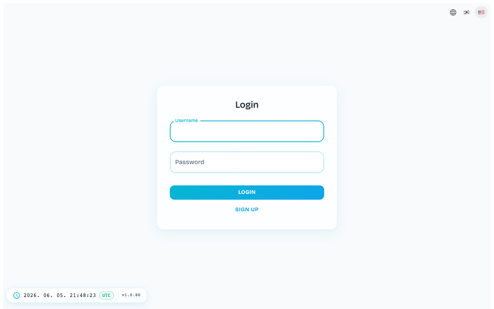

If you already have an account, enter your **username and password** and click the **[Log In]** button. For first-time users, click the **[Sign Up]** button at the bottom to create an account.

### 1-2. Sign-Up Form

Switching to sign-up mode displays the following five fields.

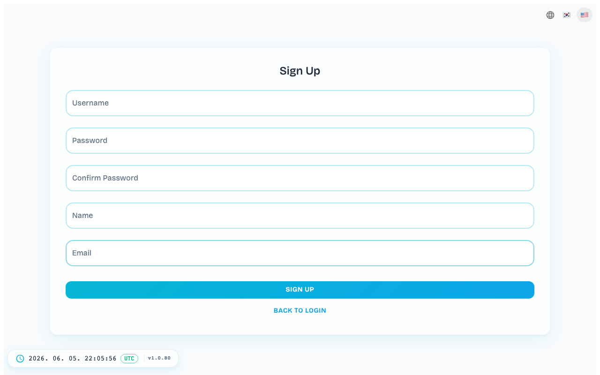

| Field | Description |
|---|---|
| Username | Login identifier (alphanumeric recommended) |
| Password | 8 characters or longer recommended |
| Confirm Password | Enter the same password again |
| Name | Username displayed on screen |
| Email | Email address for verification and notifications |

This is what the form looks like with all fields filled.

Click the **[Sign Up]** button to register your account. The system automatically returns you to the login screen with a success message.

> ⚠️ **If you see an error message** — Network errors like `Failed to fetch` may indicate a service connection configuration issue. Contact your operations team (see [`DOCKER_SETUP.md`](../../deployment/DOCKER_SETUP.md) §9 for details).

### 1-3. Login

Log in with the account you just created.

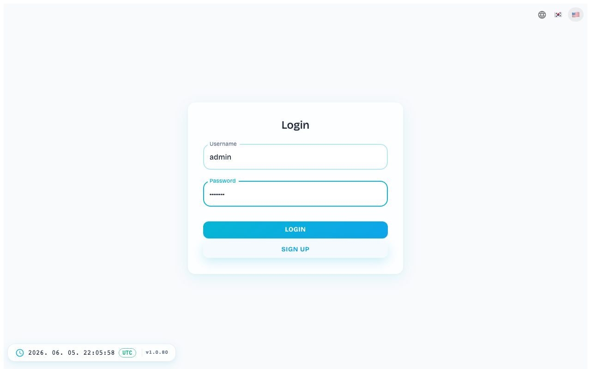

On success, the system navigates to the **Project Management** screen (`/projects`).

---

## 2. Creating a Project

New users have no projects, so an empty screen displays.

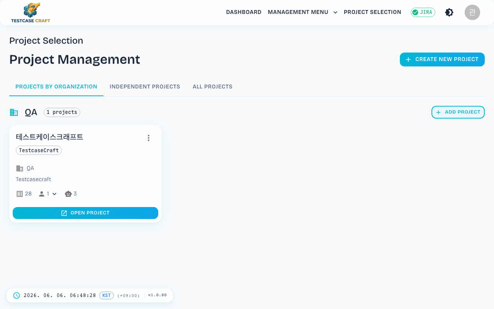

Click the **[+ Create New Project]** button in the upper right or **[+ Create Project]** button in the center to open a dialog.

### 2-1. Project Creation Dialog

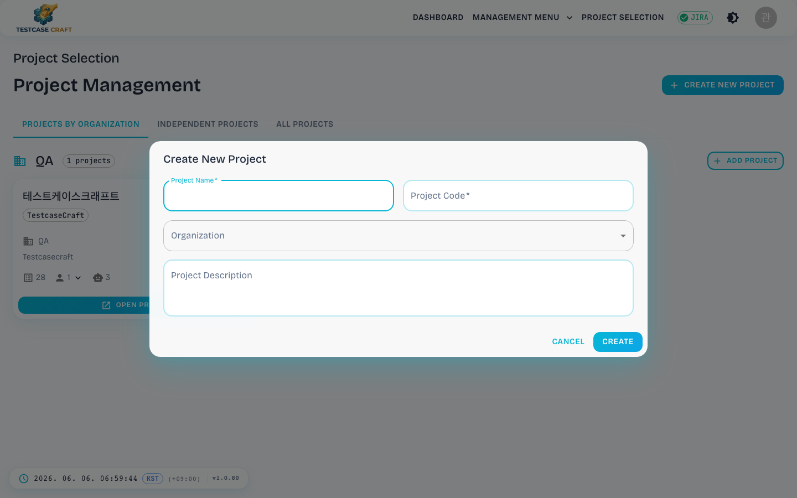

Enter the following in the dialog.

| Field | Example | Notes |
|---|---|---|
| Project Name | `Sample Project` | Name displayed on screen |
| Project Code | `SMP` | Prefix for test case identification IDs (example: `SMP-001`) |
| Description | `E-commerce Payment Feature QA` | Optional — displayed on project card and settings screen |

Click the **[Create]** button to create the project and display it as a card.

### 2-2. Created Project Card

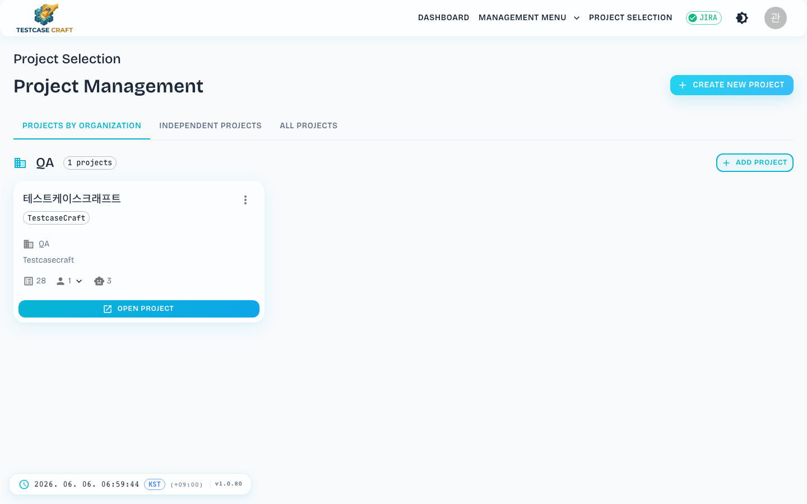

- Switch scope with top tabs **[My Projects] / [All Projects]**
- Cards display **case count / member count / automation count** in small text
- Click **[Open Project]** to enter

---

## 3. Screen Layout and Header

Upon entering a project (`/projects/{projectId}`), the screen displays a three-section layout: header at top, test case tree on the left, and main content on the right. The project dashboard opens by default on first entry; to access the global dashboard, navigate to `/dashboard` separately.

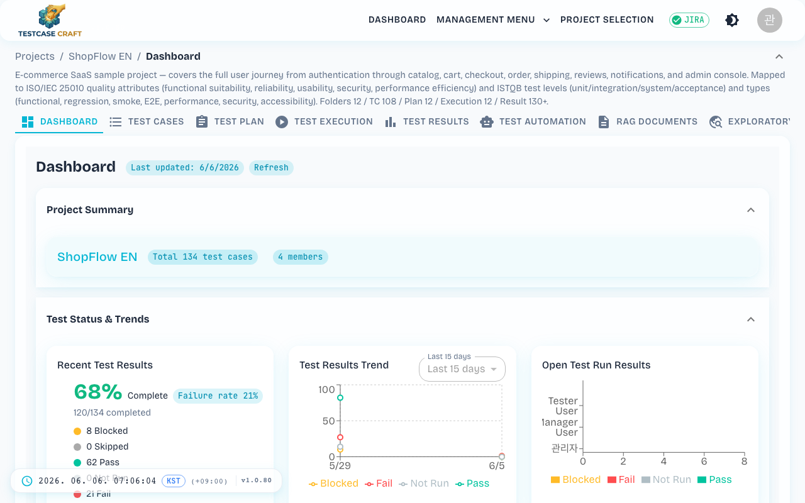

> **Changed on 2026-05-29**: Form field visibility toggles, input mode selection, and other screen-specific user preferences are now saved per user on the server. The same settings persist even when logging in from a different computer.

### 3-1. Header Composition

| Area | Description |
|---|---|
| Left logo `TESTCASE CRAFT` | Click to navigate to project list (`/projects`) |
| Breadcrumb `Project / Sample Project / Dashboard` | Shows current location |
| Tab bar `Dashboard / Test Cases / Test Plans / Test Execution / Test Results / Automated Tests / RAG Documents / Exploratory Sessions` | Navigate between project sections |
| Upper right `Project Selector` | Switch to other projects quickly |
| `⚠ JIRA` badge | Yellow warning when JIRA is not configured — click for setup instructions |
| 🌓 (Theme icon) | Toggle dark/light mode |
| User avatar (initials) | Click for profile/logout menu |

### 3-2. JIRA Panel

Click the **JIRA** badge in the header to navigate to the integration settings screen.

---

## 4. Writing Test Cases

Navigate to the **[Test Cases]** tab at the top (`/projects/{projectId}/testcases`).

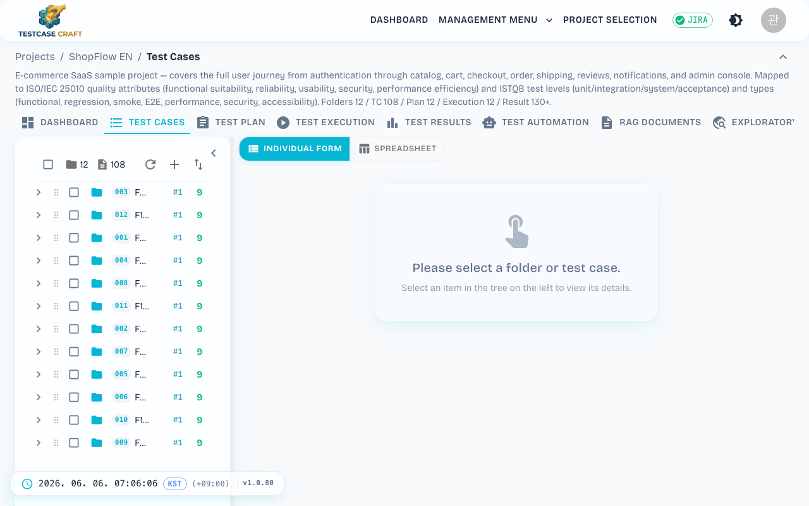

> **Changed on 2026-05-29**: The form title line above the form has been removed. Identify which case you are editing by the **Display ID badge** (example: `SMP-001`) in the header on the left. All metadata sections are now unified as **collapsible areas**. Header action buttons (autosave indicator, version, RAG badge, save, cancel, create version) are now grouped in a single row.

> **Changed on 2026-06-05 (v1.0.80)**: The form body now uses a **single full-width column layout**. Metadata and basic information sections appear first, followed by test steps and expected results sections that span the full form width. On wide monitors (1920px and larger), long step descriptions and expected results no longer squeeze into the left half but expand across the full width, making composition much easier.

> **Changed on 2026-05-29 (v1.0.79)**: **Test step and expected result input field heights now adjust automatically to content**. Empty fields occupy just one line of height, and as you enter content, they expand to fit the text — up to a maximum of 10 lines, after which scrolling is enabled within the field. Long SQL statements, logs, or scenarios can be pasted without causing the form to stretch endlessly. Step and expected result fields in the same row sync their heights, making side-by-side comparison easy.

### 4-1. Screen Layout

| Area | Description |
|---|---|
| Left panel | **Test Case Tree** — displays folders and cases in a folder structure |
| Tool bar above left panel | ☑ Select All / 📁 Folder Count / 📄 Case Count / 🔄 Refresh / ↕ Sort / `<` Collapse Panel |
| Right main content | **Spreadsheet (Table)** — write multiple cases in table format at once |
| Tool bar above main content | `+ Add Row`, `Add Above`, `Add Below`, `Add Folder`, `Delete`, `Validate`, `Import/Export`, `Settings`, `Full Screen`, `Bulk Save` |

### 4-2. Input Mode Selection

The **[Individual Form] / [Spreadsheet]** toggle button always displays at the upper left of the main content. A single click switches between input modes.

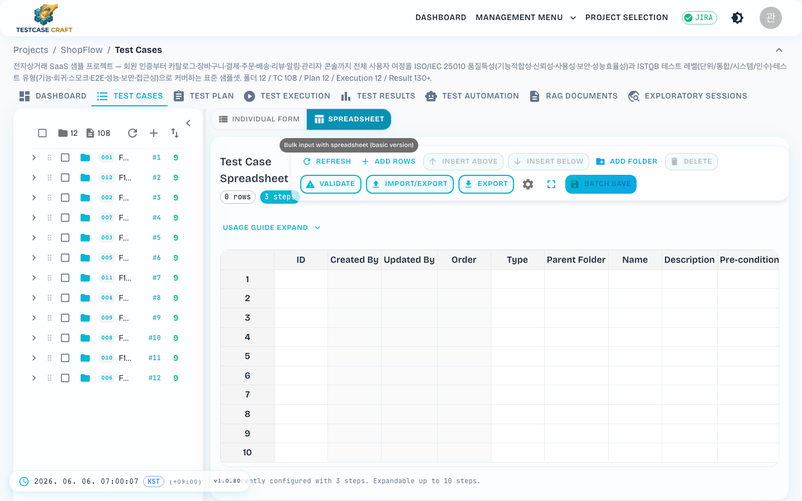

- **Spreadsheet mode** — Enter multiple cases in table format at once (default). Similar to Excel workflow: add rows → enter cell data → bulk save for fast creation.
- **Form (Individual Form) mode** — Enter one case at a time with detailed field-by-field input. Supports all fields with unlimited steps, ideal for meticulous case composition with many preconditions, postconditions, or attachments.

> The selected input mode is saved per user on the server and restored automatically even when logging in from a different computer.

> **Note**: The **Advanced Spreadsheet** mode from previous versions is currently hidden temporarily. It may be offered again in future updates; for now, use the standard spreadsheet mode.

> **Changed on 2026-05-29**: When spreadsheet cells contain long content exceeding approximately 30 Korean characters (480px), **automatic word wrapping** activates. The column width does not expand horizontally; instead, only the row height increases, making it easier to compare multiple cases on one screen.

### 4-3. Add Row Dialog

Click **[+ Add Row]** at the top of the spreadsheet to open a dialog asking how many rows to add.

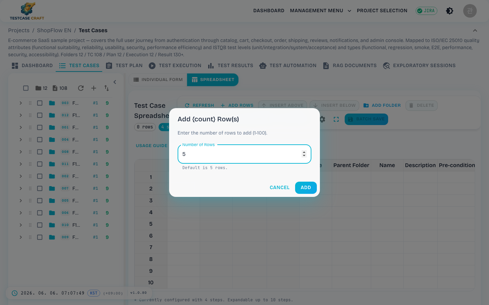

The default is 5 rows, with a range of 1–100 rows addable at once. Click **[Add]** to create empty rows. Fill in ID, name, description, precondition, steps, and other fields as needed. When finished, save all changes at once using **[💾 Bulk Save]** in the upper right.

### 4-4. Folder and Case Tree Structure

testcasecraft manages folders and cases as **a single tree**.

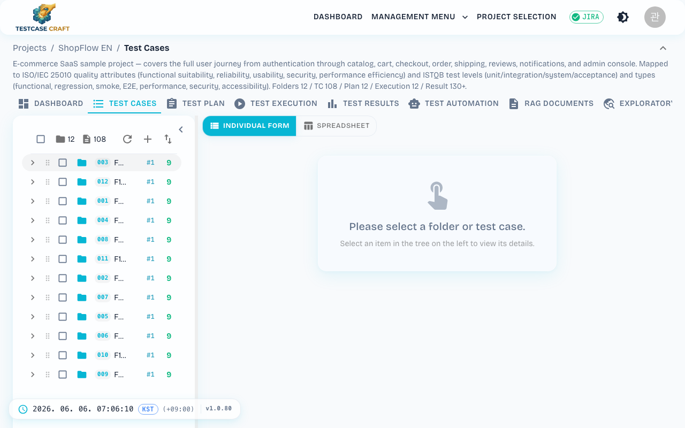

- **Folders** (`📁`) — Units for grouping and categorizing cases
- **Cases** (`📄`) — Actual test scenarios
- **System Default Folders** — Protected folders automatically created when a project is created. They cannot be moved or deleted to prevent accidents.

The tree header displays the current **folder count (📁) and case count (📄)**, allowing you to gauge project size at a glance.

There are two ways to add folders or cases.

1. Click the **➕** icon in the left tree header (visible when you have edit permissions)
2. Right-click on a folder in the tree → select from context menu

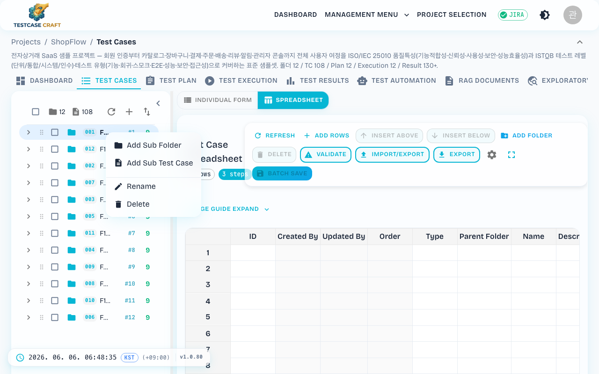

What you can do from the right-click menu:

| Menu | Action |
|---|---|
| **Add Sub Folder** | Create a new folder inside the selected folder |
| **Add Sub Test Case** | Create a new case inside the selected folder |
| **Rename** | Edit folder/case name inline |
| **Delete** | Delete folder/case (folders delete with all contents inside — use caution) |

### 4-5. Field Visibility Toggle

Click the **🔲 (Select Fields to Display)** icon in the upper right of form mode to toggle metadata field visibility in the form.

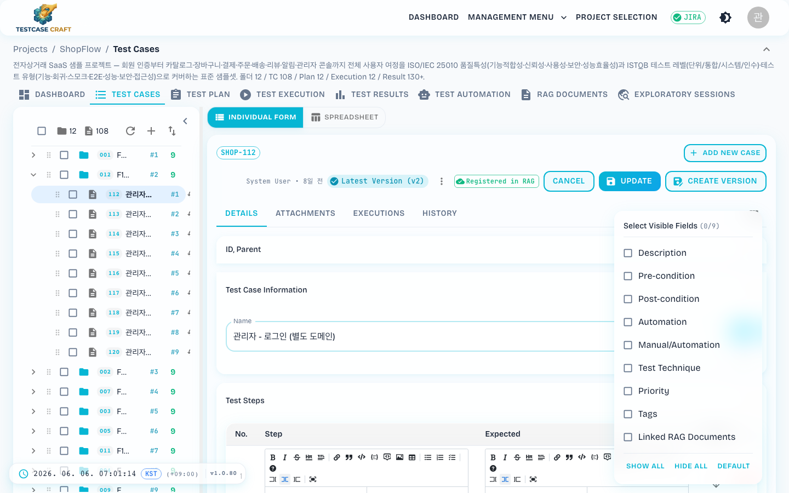

Nine toggleable fields:

- Description
- Precondition
- Postcondition
- Automation Status
- Manual / Automation
- Testing Technique
- Priority
- Tags
- Connected RAG Documents

> Core fields (name, steps, expected results) always display and are excluded from toggling.

Use the **[Show All] / [Hide All] / [Default]** buttons at the bottom of the popover to configure all at once. Your selection is saved per user on the server and persists across logins from different computers.

### 4-6. Form Mode Screen Layout and Metadata

Opening a case in form mode displays the following screen.

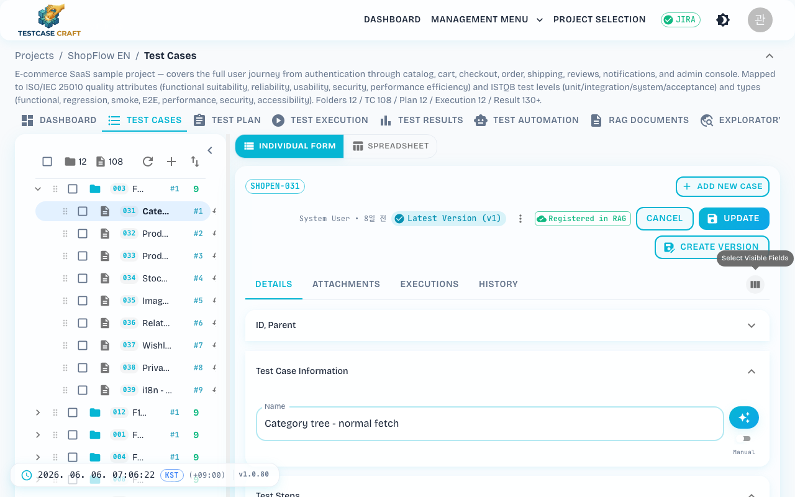

**Header area** (top to bottom):

- **Display ID badge** (example: `SHOP-112`) — the case you are currently editing
- **Version indicator** (example: `Latest Version (v2)`) — click to view version history
- **RAG Registered** badge — indicates this case is registered in the RAG knowledge base
- Right-side action buttons — **[Cancel] / [Save] / [Create Version]**

**Main content tabs** (4 tabs):

| Tab | Content |
|---|---|
| **Details** | Case body: name, description, test steps, expected results, etc. (default tab) |
| **Attachments** | File list and upload interface |
| **Execution History** | Past execution results for this case |
| **History** | Change log (who changed what, when) |

**Metadata area** (ID, Parent at the top of Details tab — collapsible):

- **Editable fields** — Name, Display ID, description, priority, tags, etc. (exposed per §4-5 toggles)
- **Read-only fields** — Created date, modified date, author, UUID, etc. (system-populated). UUID displays as the full string without truncation, allowing easy copy-paste for external system integration and debugging.

---

## 5. Test Case Tree — Drag-and-Drop Reorganization

> This feature is available from v1.0.77 onwards. For detailed guidance, see [`docs/guide/TREE_DND_USER_GUIDE.md`](../../guide/TREE_DND_USER_GUIDE.md).

> **Changed on 2026-05-29**: Each row's **Display ID badge** in the tree now shows only the **last number** (example: `SMP-001` → `001`) instead of the full ID. Hover over the badge to see the full ID in a tooltip. Row names also show a tooltip with the full name only when the text is truncated, keeping the screen cleaner most of the time.

### 5-1. Action Summary

The existing **right-click menu** (add/rename/delete) and **sort edit mode** (↑/↓ buttons) remain available. Additionally, you can now **drag with the mouse** to change positions.

| What you want to do | Action |
|---|---|
| Move a case to a different folder | Grab the **`⋮⋮` (drag handle)** on the left side of the case row and drag it onto the folder |
| Move an entire folder | Grab the drag handle on the folder row and drag it onto another folder |
| Change order within the same folder | Drop between items at the **thin gap** |
| Move to root | Drop in the empty area at the top of the tree |

The **six-dot icon (⋮⋮)** on the left of each row is the drag handle. Dragging must start from this handle, not from other parts of the row. Before dropping, a **faint guide line** shows where the item will land.

### 5-2. Multi-Select Move

Move multiple items at once.

1. Select multiple nodes using the **checkbox** or `Cmd-click` (Mac) / `Ctrl-click` (Windows)
2. Grab the drag handle of **one selected item** and drag → the entire group moves together
3. The server receives a single request; if any item fails, **the entire operation reverts to the original state** (no partial changes)

### 5-3. Auto-Blocked Moves

The following moves are automatically blocked — the guide line turns **red**:

- Moving a folder into itself or a subfolder it contains (example: moving folder A into subfolder B inside A)
- Moving to a folder in a different project
- Placing other items **inside** a test case (cases cannot have children)
- Moving system default folders

When blocked, a notification at the bottom of the screen explains the reason, and the tree immediately reverts to its original state.

### 5-4. Move Log (Audit Trail)

All successful moves are automatically recorded in the system — **who, when, and where items were moved** can be tracked by administrators. If you accidentally move something, contact your administrator to find its original location.

---

## 6. Dashboard and Statistics

The **[Dashboard]** tab at the top of the project (`/projects/{projectId}` default on entry) displays key metrics for that project in a single view. For organization-wide metrics, access `/dashboard` via the header Dashboard menu.

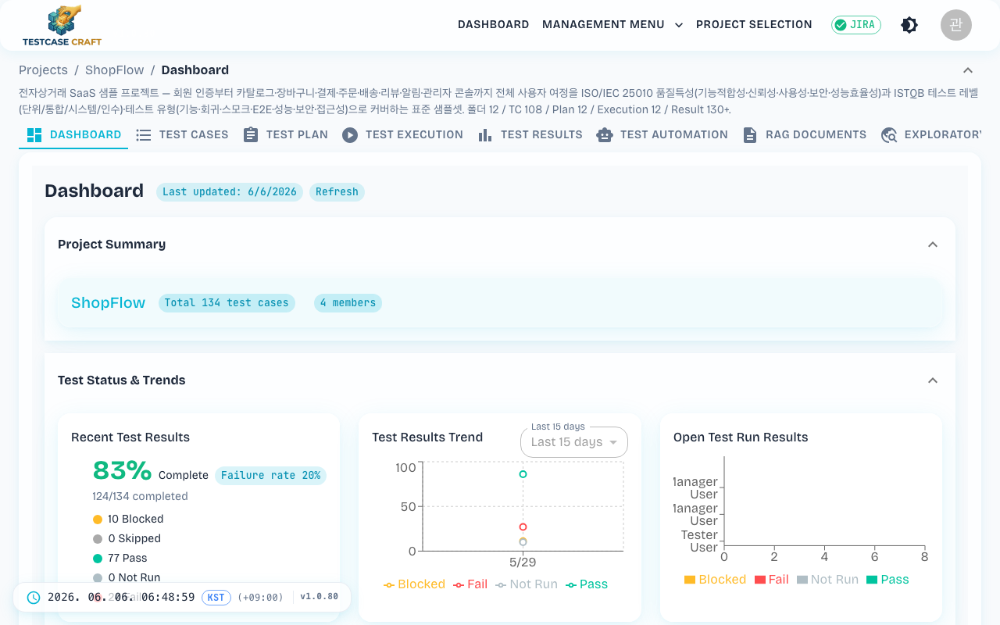

| Card | Description |
|---|---|
| Project Summary | Number of cases and team members |
| Latest Test Results | Pass / Fail / Not Run / Skipped / Blocked ratio |
| Test Result Trend | Progress flow chart over recent days |
| Active Test Executions | Summary of ongoing executions |
| Results by Assignee | Each member's case progress |
| Results by Test Plan | Statistics per plan |

Click **[Refresh]** at the top to update to the latest data. Use **[Last 15 Days ▾]** to change the display period.

## 7. Test Plans

Click the **[Test Plans]** tab at the top (`/projects/{projectId}/testplans`) to manage **test plans** — groups of test cases bundled together as a single execution unit.

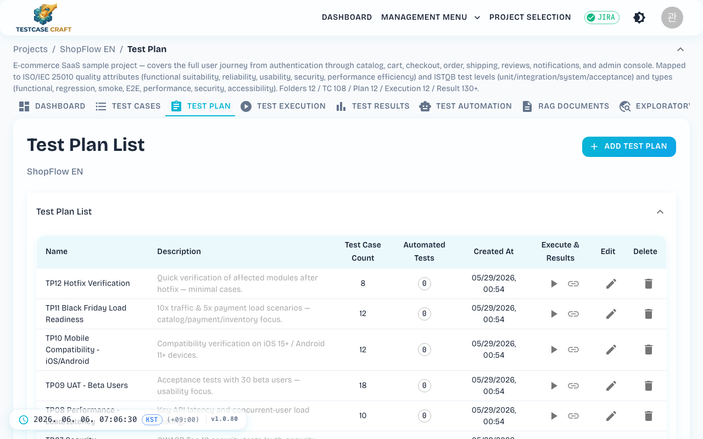

- Click **[+ New Plan]** in the upper right to create a new plan (select name, description, and cases to include)
- Click a plan card or row to enter detailed view
- Cases bundled in a plan can be executed together in "Test Execution"

> This new project has no plans yet. Once you create a plan, it displays as a card.

---

## 8. Test Execution

Click the **[Test Execution]** tab at the top (`/projects/{projectId}/executions`) to manage execution instances of cases bundled in test plans.

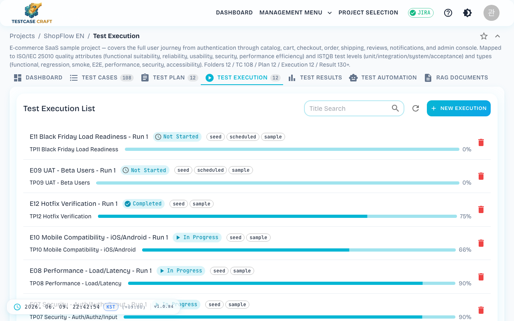

- Search by title using the filter box
- Click a row to enter that execution and record each case's result (Pass/Fail/Skipped/Blocked)
- The "Test Results" tab shows consolidated statistics from completed executions

The manual execution flow is as follows:

1. Click **[Start Execution]** from a test plan
2. Step through cases one by one — enter expected result (expected) and actual result (actual) per step, then mark the result
3. Upload attachment files (screenshots, logs, etc.) — supports TXT, CSV, JSON, MD, PDF, LOG, PNG, JPG, GIF formats; up to 10 MB per file
4. On completion, results automatically reflect in **Test Results** and **dashboard statistics**

### 8-1. Result Entry Screen

Click a case within an execution to open the result entry screen (`/projects/{projectId}/executions/{executionId}/testcases/{testCaseId}/result`). Use the floating result button on the screen to record one of the following four states:

| Button | State | Meaning |
|--------|-------|---------|
| **P** | Pass | Behaves as expected |
| **F** | Fail | Behaves differently from expected — possible defect |
| **B** | Blocked | Execution itself is impossible due to environment issues, etc. |
| **N** | Not Run | Not yet executed (default) |

In addition to the result, you can record **notes** (free-form comments), **tags**, and **JIRA issue key**. At the bottom, the **previous result list** shows execution history for this case at a glance. Rows from this execution in the previous result list are visually distinguished, so you always know which results belong to the current run.

### 8-2. Auto-Save — Viewing Never Saves

> **Changed on 2026-06-05 (v1.0.80)**: Result entry auto-save behavior has been safely redesigned.

- **Viewing alone does not save** — Opening the result entry screen to review content or navigating between cases using the next/previous buttons triggers no save. Feel free to browse existing results without worrying that data will change. 
- **Editing auto-saves** — If you actually modify the result button (P/F/B/N), notes, tags, or JIRA key, the changes auto-save after approximately 1.5 seconds. Check the auto-save status indicator at the top of the screen to confirm.
- **Empty results are not created** — Clicking save or the next button when nothing has been entered (Not Run + empty notes) does not create a blank record; previous results remain unchanged.

> 💡 As of v1.0.80, simply viewing does not create blank records. Any blank Not Run records accumulated in earlier versions are automatically cleaned up when you enter an actual result for that case.

---

## 9. Test Results

Click the **[Test Results]** tab at the top (`/projects/{projectId}/results`) to view consolidated results from completed executions.

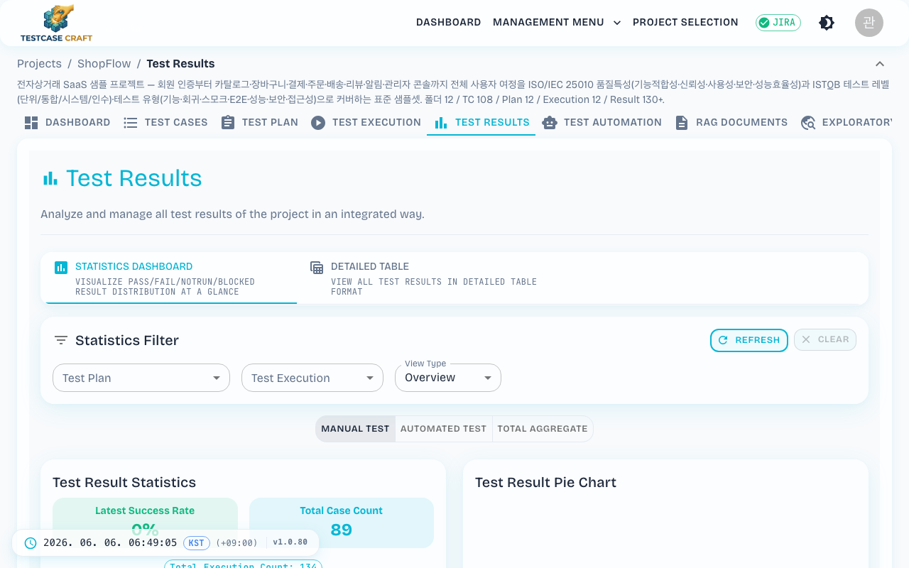

- Filters: date range, plan, assignee, result status
- Pass rate per case, recent N-run trend chart
- Export result reports as files — three formats available:

| Format | Recommended For |
|--------|-----------------|
| **Excel (.xlsx)** | Sharing report with charts, filtering statistics, and making modifications |
| **PDF (.pdf)** | Printing or storing with fixed layout — choose portrait or landscape orientation |
| **CSV (.csv)** | Extracting data only for analysis in other tools |

> **Changed on 2026-06-05 (v1.0.80)**: PDF export no longer cuts off long test steps (step/expected result) at page boundaries; they now print in full across multiple pages.

---

## 10. Automated Tests

Click the **[Automated Tests]** tab at the top (`/projects/{projectId}/automation`) to upload result files from automated test tools (JUnit, Playwright, Pytest, etc.) and view them consolidated in testcasecraft.

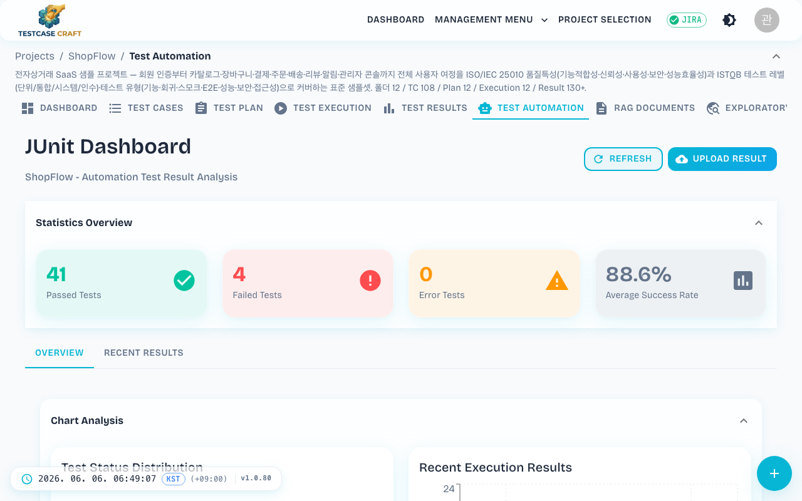

- **Upload result file** — JUnit XML file (up to 100 MB)
- Cases are automatically matched and statistics updated
- Click a result row in the list to enter the detail screen (`/projects/{projectId}/automation-results/{testResultId}`), where you can see pass/fail/skip status and error messages for individual tests
- Contact your operations team for details on which tool to use and how to generate result files

> To view result files separately in simple form, check the **[JUnit Results]** screen (`/projects/{projectId}/junit`).

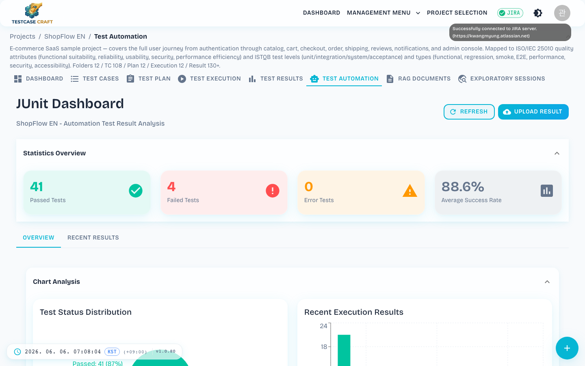

---

## 11. RAG Documents & Chat

Click the **[RAG Documents]** tab at the top (`/projects/{projectId}/rag`) to manage your project knowledge base.

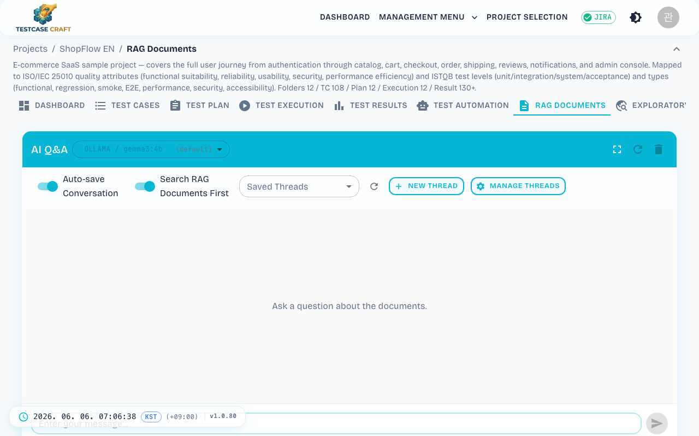

- Upload documents (PDF, MD, HTML, images, etc.) → embeddings are generated automatically
- During case authoring, related RAG documents are recommended automatically
- Use RAG chat for natural language queries → receive answers with source citations

> RAG is operated as an auxiliary service. Some operational environments may have it disabled, hiding this tab.

---

## 12. Exploratory Sessions (SBTM)

Click the **[Exploratory Sessions]** tab at the top (`/projects/{projectId}/exploratory`) to manage exploratory test sessions based on **Session-Based Test Management**.

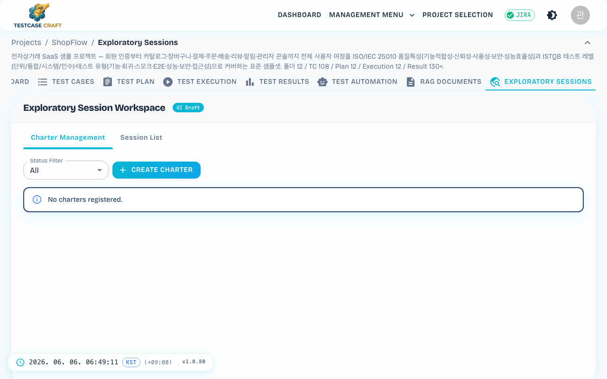

- **Charter** — define the exploration objective in one line
- Start session → timer runs (typically 60–120 minutes)
- Record findings, notes, bugs, and screenshots during the session
- On completion, session report is generated automatically with an approval workflow

> This tab appears only when the environment variable `SHOW_EXPLORATORY_SESSION_TAB=true`. See the operations documentation for setup instructions ([see Section 16-3](#16-3-installation--operations-documentation)).

---

## 13. User Profile & Settings

Click the **user avatar** in the upper right of the header, then click **[Profile]** to open the user profile dialog.
The dialog comprises seven tabs:

### 13-1. Basic Information

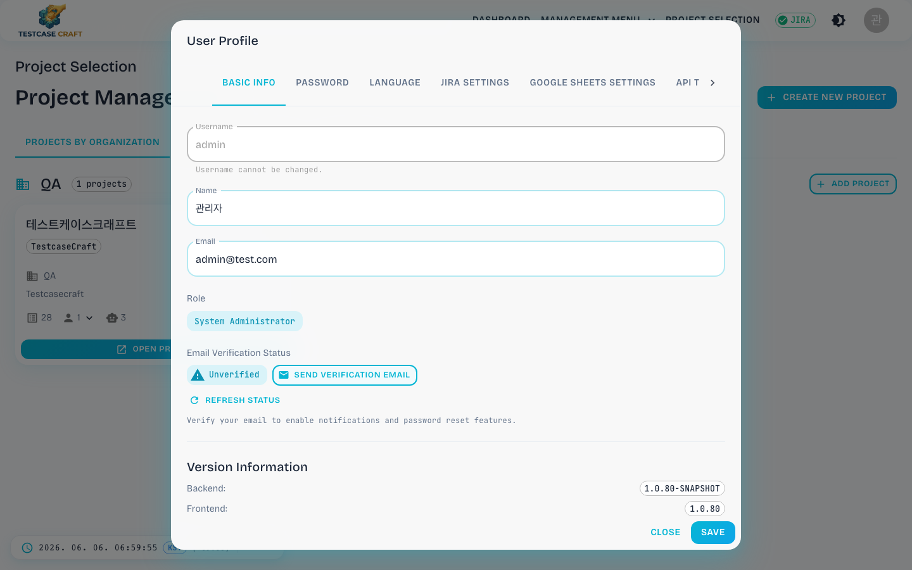

- Username / Full name / Email display (username cannot be changed)
- Role badge (Tester/PM/Admin, etc.)
- Email verification status — If **[Not Verified]**, click **[Send Verification Email]** to send verification mail. Click the link in the received email to see the verification complete screen (`/verify-email`). After verification, click **[Refresh Status]** to update the badge.
- Service version (server/client) displayed at the bottom

### 13-2. Password Change

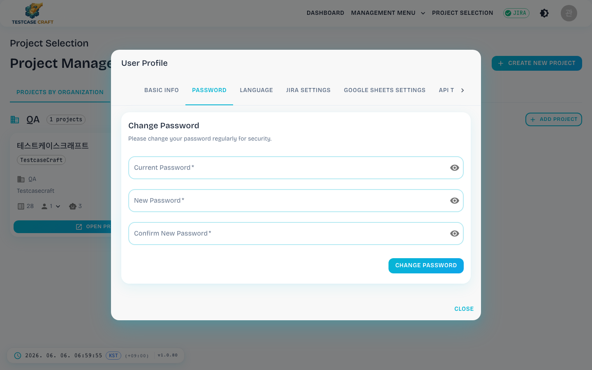

Confirm existing password, then enter and confirm new password → click **[Save]**.

### 13-3. Language & Time Zone Settings

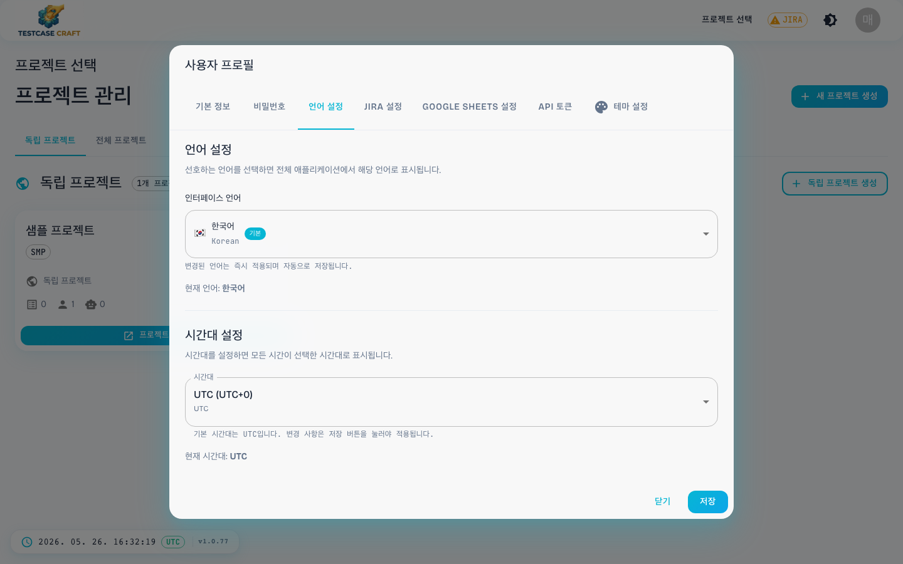

- **Interface Language** — Korean / English, etc. (takes effect immediately; auto-saved)
- **Time Zone** — Applied to all time displays (creation date, move log, test results, etc.)
  - Default is `UTC`; to change to your local time zone, click **[Save]**

### 13-4. JIRA Settings

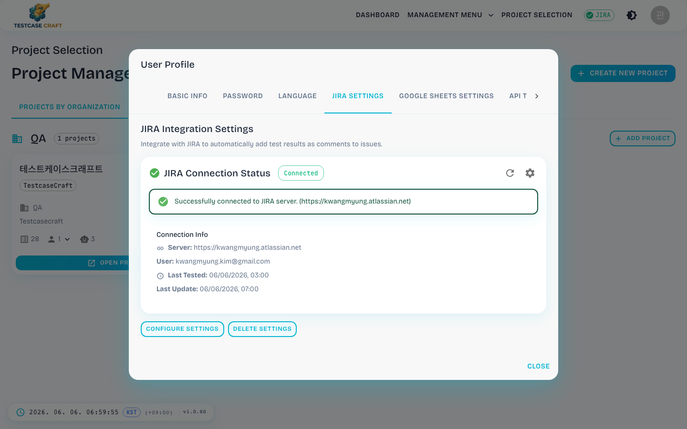

Register your JIRA server URL, email, and connection key for use with your account. Once saved, the warning badge **⚠ JIRA** in the header disappears.

### 13-5. Google Sheets Settings

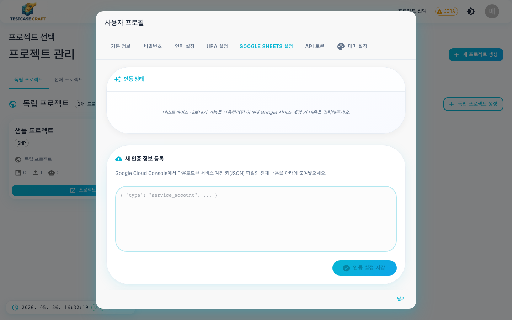

To import or export test cases to Google Sheets, you need to connect your Google account. Connect once following the on-screen instructions.

> 💡 For detailed connection steps with illustrations, see the in-app guide (`/guides/GOOGLE_SHEETS_SETUP_GUIDE`). Click the help link on the settings screen to open the same document.

### 13-6. API Token

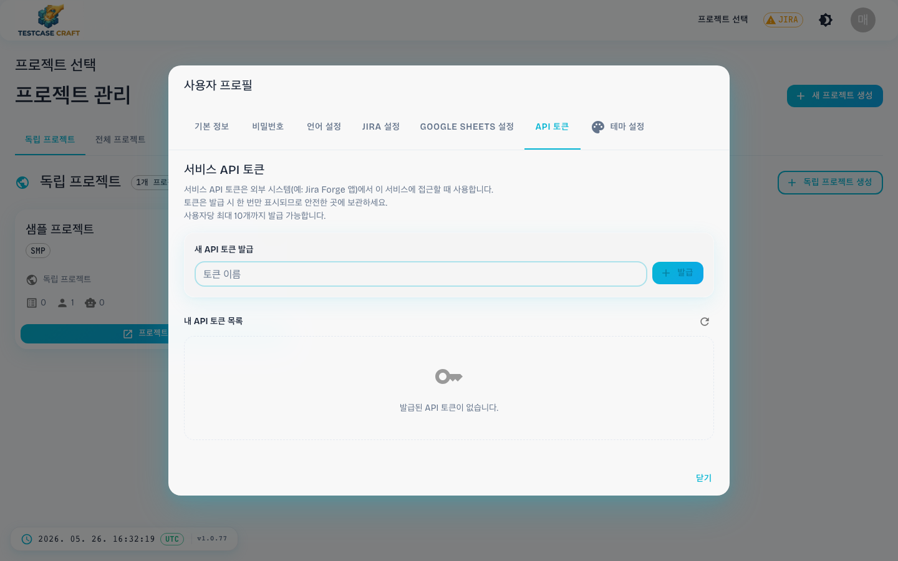

Generate a **connection key (token)** for use when connecting from other systems (e.g., JIRA plugins, automation scripts) to testcasecraft.

- Up to **10 tokens** can be issued per person
- **The full key displays only once immediately after issuance; copy it to a safe place.** You cannot view it again.
- Lost keys must be revoked and reissued

### 13-7. Theme Settings

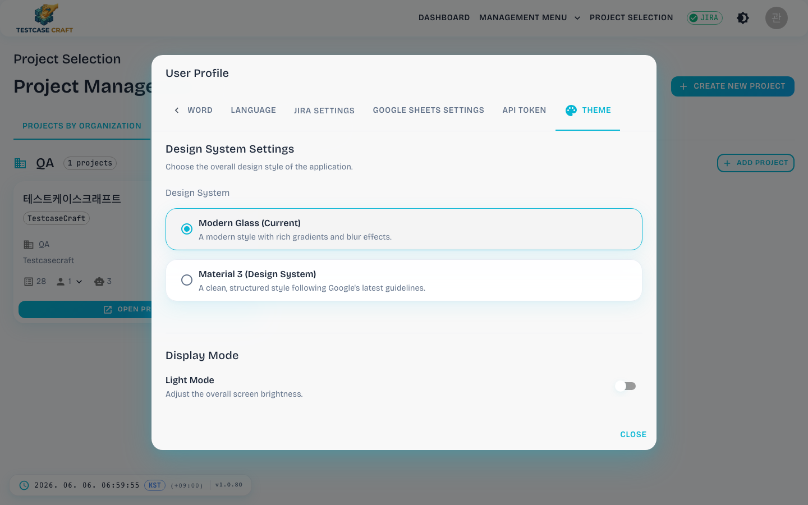

- **Screen Mode** — Choose Light or Dark mode (synchronized with the 🌓 icon in the header)
- **Design System** — Choose from two design styles: Glass (glass texture) or Material 3. Changes apply to the entire screen immediately.

---

## 14. Header Tools — Dark Mode · Language · Project Selector

### 14-1. Dark Mode Toggle

Click the **🌓** icon in the top-right corner of the header to instantly switch between light and dark mode.

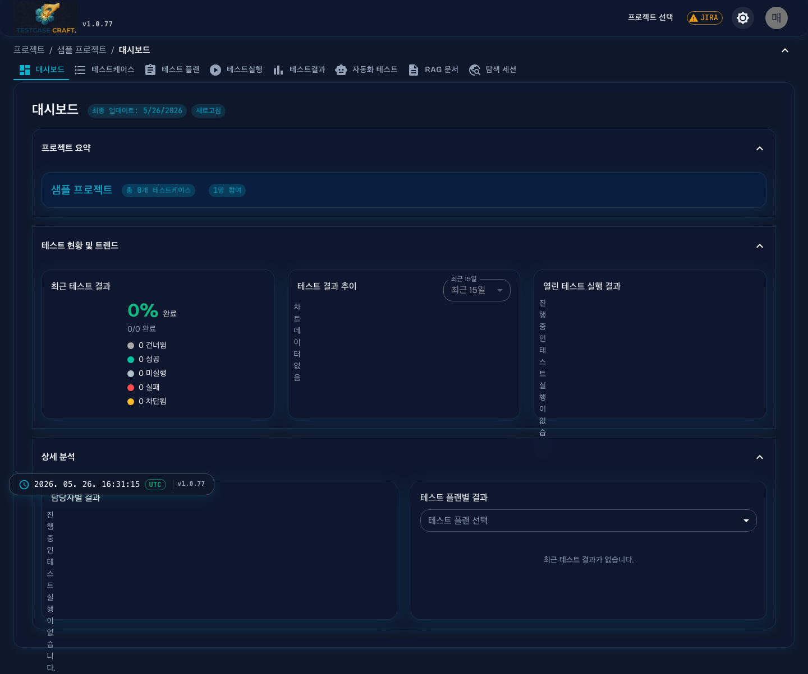

### 14-2. Language Selection

Screen language is changed in **Profile → Language Settings** (see Section 13-3). Changes take effect immediately across all screens and are saved automatically without requiring a save button.

### 14-3. Project Selector (Quick Switch)

Click **[Project Selector]** in the header to display a dropdown list of projects to which the current user belongs.

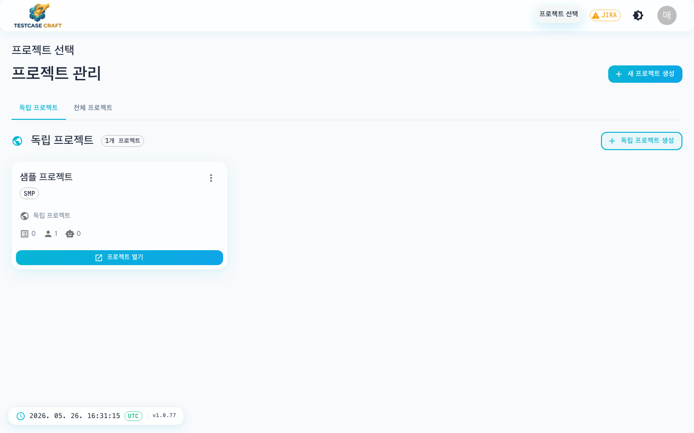

Switch to another project instantly — the current tab location (Dashboard / Test Cases, etc.) is maintained while only the project changes.

---

## 15. Logging Out

Click **[Logout]** from the user avatar menu in the top-right corner of the header to sign out and return to the login screen.

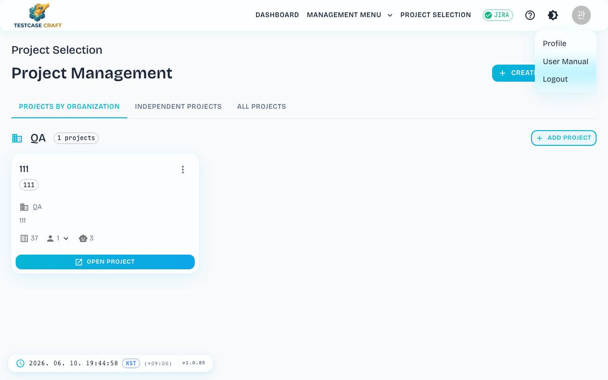

> If the system is not used for an extended period, you will be automatically logged out for security. The session duration depends on the operating environment settings (approximately 30 days for development environments, 90 days by default for production environments). Verify the exact value with your system administrator. After logout, simply log in again.

---

## 16. Appendix — JIRA Integration & FAQ

### 16-1. JIRA Integration

The **`⚠ JIRA`** badge in the header indicates that JIRA settings are not configured. Click it to open the JIRA integration settings screen.

- Enter JIRA server URL, user email, and API token
- Configure field mappings (priority, assignee, etc.)
- After saving, the warning badge disappears

### 16-2. Common Screen Issues

| Symptom | Solution |
|---------|----------|
| `⚠ JIRA` badge always appears | Normal behavior — always displayed if JIRA is not configured. Ignore if not in use |
| Plus button not visible in header | Check if your project permission is VIEWER (only PM/editors can add items) |
| Drag-and-drop not working | You may have read-only (VIEWER) permission, or drag-and-drop may be disabled on item selection screens (e.g., when choosing test cases to include in a test plan). Use the right-click context menu or order editing mode as alternatives |
| Test result changed after viewing the result input screen | This does not occur in v1.0.80 or later — improved to prevent saving when viewing only (see Section 8-2). Empty Not Run records created in earlier versions are automatically cleaned up when actual results are entered |
| "Advanced Spreadsheet" mode not visible in input mode selection | Normal behavior — this feature is currently hidden. Use the standard spreadsheet mode |
| Screen continuously loading | Likely a temporary network error — try refreshing. If it persists, contact your system administrator |
| `Failed to fetch` during signup | Possible server-side environment variable issue — contact your system administrator. See details in [`docs/deployment/DOCKER_SETUP.md`](../../deployment/DOCKER_SETUP.md) Section 9 |

### 16-3. Installation & Operations Documentation

Setup, Docker configuration, environment variables, backup, upgrade, troubleshooting, and other **administrator guides** are maintained in a separate document.

👉 **[`docs/deployment/DOCKER_SETUP.md`](../../deployment/DOCKER_SETUP.md)**

---

## 17. System Administrator Settings (ADMIN Only)

> ⚠️ This section and its menus are only visible to users with `role=ADMIN`. The default admin account uses the initial credentials `admin / admin123`. **Change these credentials immediately after deployment to production.**

### 17-1. Accessing the Admin Menu

When logged in with an admin account, **[Dashboard] / [Admin Menu ▾] / [Project Selector]** are displayed in the header.

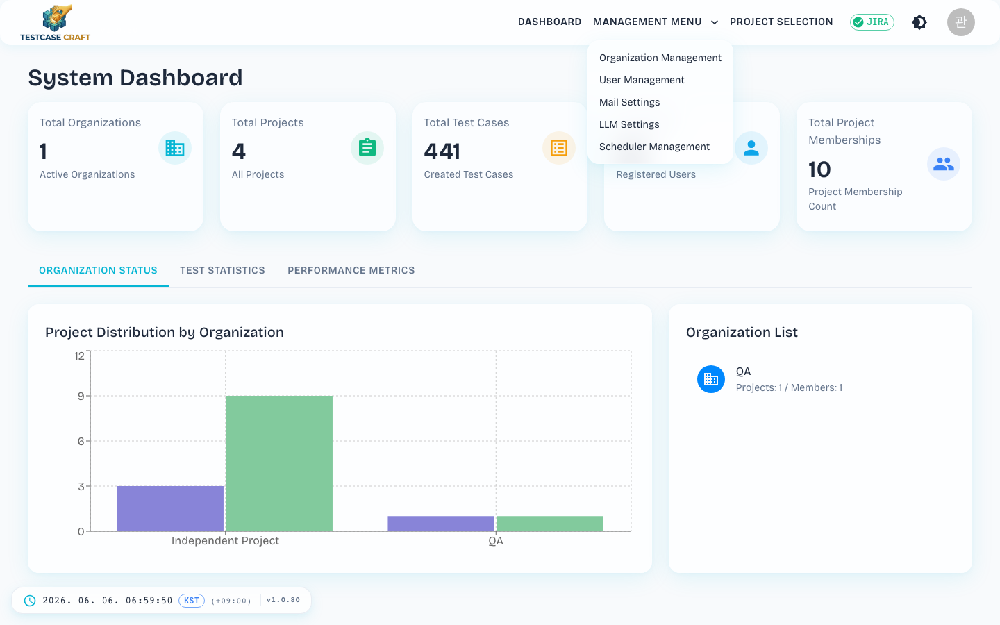

Dropdown items:
- **Organization Management** (`/organizations`)
- **User Management** (`/users`)
- **Mail Settings** (`/mail-settings`)
- **LLM Settings** (`/llm-config`)
- **Scheduler Management** (`/scheduler`)

### 17-2. Global Dashboard

**[Dashboard]** in the header provides an operations statistics view spanning all organizations and projects.

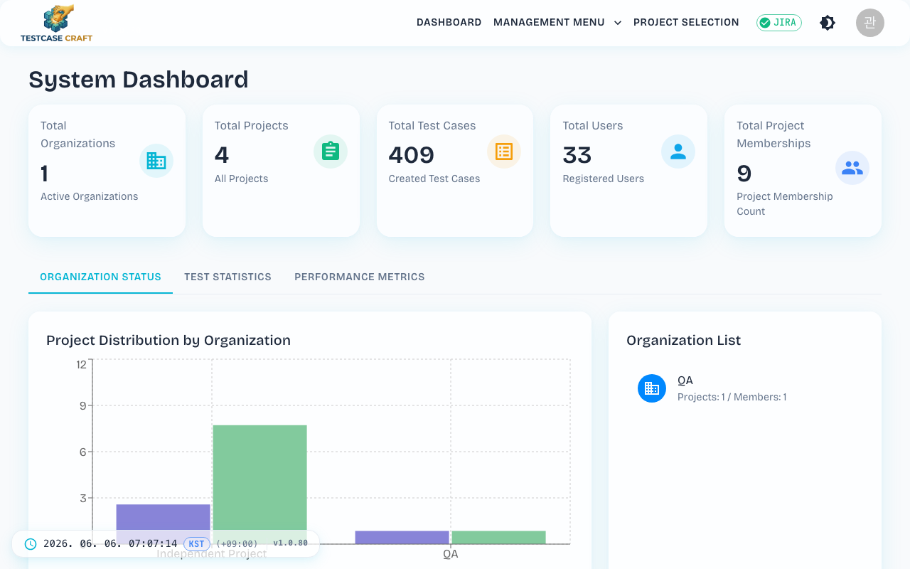

### 17-3. Organization Management

`/organizations` — Groups projects by Organization.

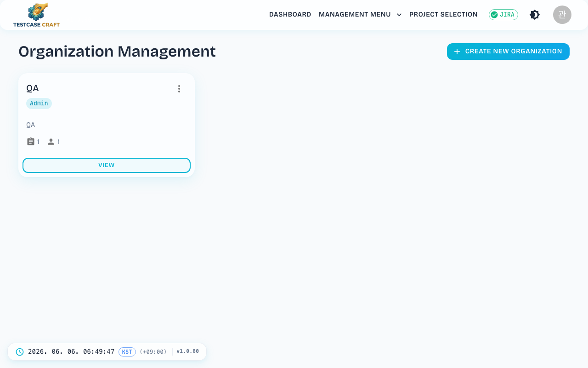

- Create / edit organizations or invite members
- Manage permissions matrix for groups within organizations
- Click to enter organization details (`/organizations/{id}`)

### 17-4. User Management

`/users` — View and manage all system users.

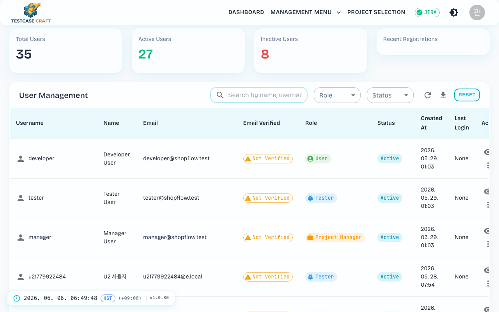

- Statistics cards: total / active / inactive / recently joined
- Search by name, username, or email
- Filter by role (ADMIN / PM / Tester / General User) or status (active / inactive)
- Row actions: **👁 View Details · ⋮ Reset Password / Change Role / Toggle Active Status**
- Email verification status badge (unverified / verified)
- Top-right buttons: **🔄 Refresh / ⬇ Download / Reset**

### 17-5. Mail Settings

`/mail-settings` — Configure SMTP, sender, and email templates.

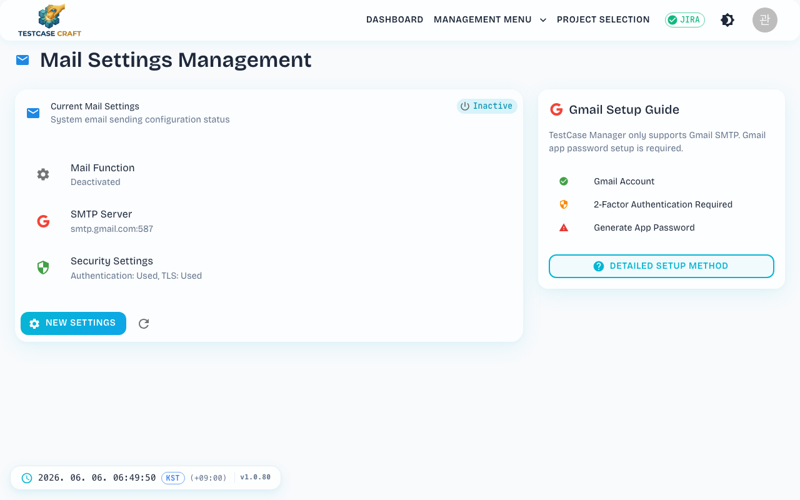

- SMTP host, port, and credentials
- Sender email address and display name
- System email templates for authentication, password reset, and execution result notifications
- **Send Test Email** to validate settings

### 17-6. LLM Settings

`/llm-config` — Configure the LLM provider for RAG chat, AI-generated case metadata, and other features.

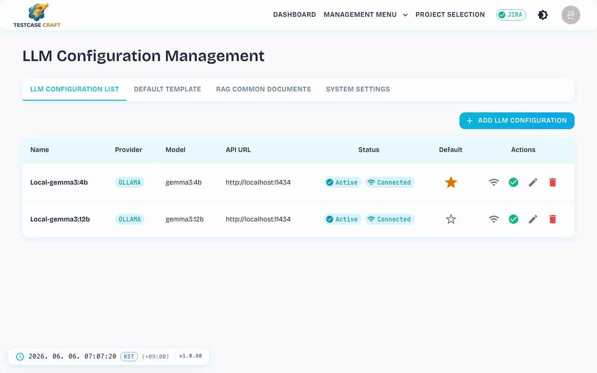

- Provider: OpenAI / Anthropic / Azure OpenAI / local models, etc.
- Model name, API key, base URL
- Manage prompt templates (system prompt, examples)
- Usage limits and cost tracking options

### 17-7. Scheduler Management

`/scheduler` — Enable / disable periodic background jobs and modify their schedules.

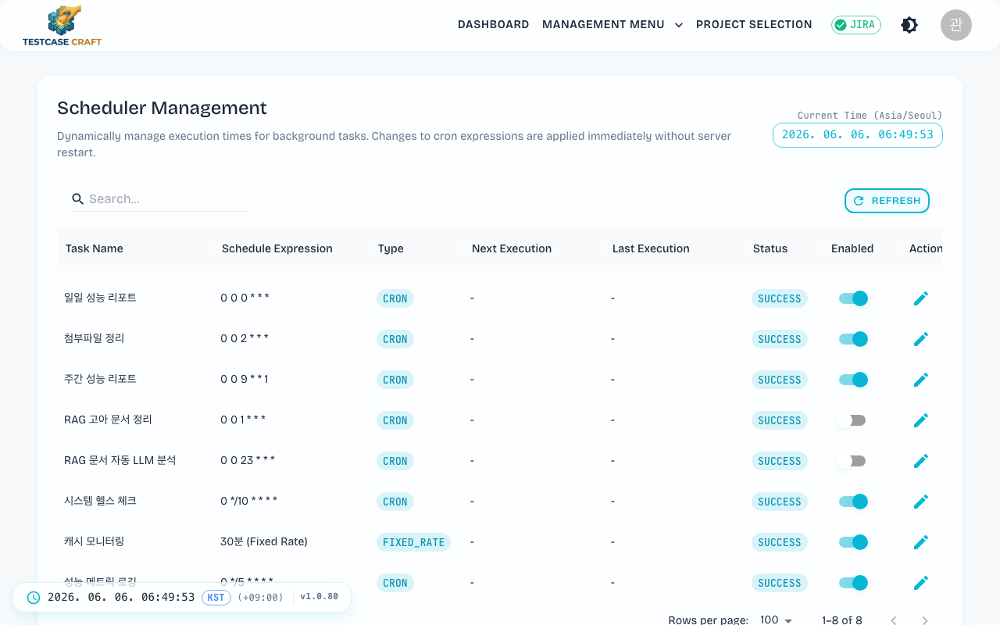

- List of registered jobs (e.g., JIRA sync, RAG index rebuild, expired token cleanup)
- Each job displays its Cron expression, last execution time, and result
- **Manual Run** button, pause / resume

### 17-8. Translation Management (i18n)

`/translation-management` — Dynamically edit UI multi-language keys and translations (not exposed in the header menu by default — access via direct URL).

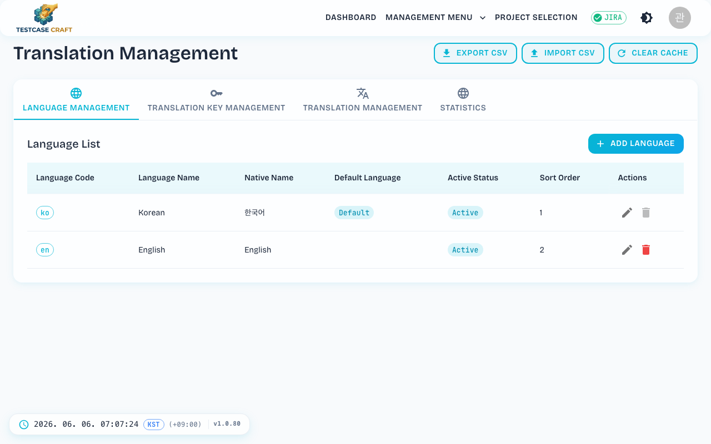

- Edit translation keys and values by language
- Statistics on missing keys
- Group by category
- Add additional languages

> This screen is hidden from general users due to the large number of i18n keys. Use it only when introducing additional languages beyond Korean and English or modifying labels.

### 17-9. Project-Level Settings (PM)

Access via the **⋮ (three-dot)** menu in the project card top-right or through the header menu after entering the project. (Requires `PROJECT_MANAGER` permission)

- Change project name / code / description
- Invite members / assign roles (PM / LEAD_DEVELOPER / DEVELOPER / TESTER / CONTRIBUTOR / VIEWER — 6 levels; see Section 18-4)
- Configure system default folders / priority conventions / tag conventions
- Delete project (all test cases and results are permanently deleted — this cannot be undone)

> When a new project is created, the creator automatically becomes **PROJECT_MANAGER**. Users with VIEWER or TESTER permissions will not see this menu or only certain options are enabled.

---

## 18. Glossary

Frequently used terms in the manual are compiled here for reference when first using the system.

### 18-1. Core Domain Terms

| Term | Definition |
|------|-----------|
| **Test Case** | A bundle of steps, conditions, and expected results to verify a scenario. Example: "Normal login", "Account locked after 5 password failures" |
| **Folder** | A container for organizing test cases. Folders can contain test cases or other folders |
| **Test Case Tree** | The left panel of the screen that displays folders and test cases in a hierarchical view |
| **Test Plan** | A bundle of test cases grouped for execution in a single testing activity, including schedule and assignee information |
| **Test Execution / Run** | An operational instance of running a test plan. Results are recorded for each test case |
| **Test Result** | A collection of completed test execution results, visualized as statistics and trends |
| **Automated Test** | A feature that uploads result files from automation tools (JUnit, Playwright, Pytest, etc.) to testcasecraft for unified tracking |
| **Exploratory Session (SBTM)** | Session-Based Test Management. A method where exploratory testing is conducted in 60–120 minute sessions with findings, notes, and evidence documented |
| **RAG (Search Assistance)** | A supplementary feature that indexes documents and answers natural language queries with source citations |

### 18-2. Test Case Editing Screen Terms

| Term | Definition |
|------|-----------|
| **Spreadsheet Mode** | A screen for entering multiple test cases in table format at once, with user experience similar to Excel |
| **Form (Individual Form) Mode** | A screen for detailed item-by-item entry of a single test case |
| **Advanced Spreadsheet** | An enhanced table input screen for users accustomed to copying and pasting cells from external Excel. Currently hidden |
| **Precondition** | The state that must exist before executing a test case (example: "User A must be registered") |
| **Step** | A unit of action within a test case. Each step documents an action and its expected result |
| **Expected Result / Actual Result** | The anticipated outcome ("how this should behave") for a step or entire test case, and the actual outcome ("how it actually behaved") that was recorded |
| **Display ID** | An identifier in the format `ProjectCode-Number`. Example: `SMP-001`. Used in URLs and notifications |
| **Tag** | A freely assigned label to a test case (example: `smoke`, `regression`). Used in search, filtering, and automation |
| **Import / Export** | A feature to move bundles of test cases as files. Import supports CSV, Excel, and Google Sheets; export supports CSV, Excel, JSON, and Google Sheets. (Test **result report** export supports Excel, PDF, CSV — see Section 9) |

### 18-3. Test Execution Result Status

| Status | Meaning |
|--------|---------|
| **Pass** | Expected result matches actual result |
| **Fail** | Actual behavior differs from expected — possible defect |
| **Not Run** | Test has not yet been executed |
| **Skipped** | Intentionally not executed (example: environment mismatch). Primarily appears in automated (JUnit) results; manual result input buttons are limited to 4 options: P/F/B/N (see Section 8-1) |
| **Blocked** | Execution is not possible due to unmet preconditions or environment issues |

### 18-4. Permissions and Roles

| Role | Capabilities |
|------|--------------|
| **VIEWER** | View only. No add, edit, or drag-and-drop capabilities |
| **TESTER** | View + record test case execution results, conduct exploratory sessions |
| **CONTRIBUTOR** | Add / edit test cases and folders, drag-and-drop reordering |
| **DEVELOPER** | Add / edit test cases and folders, drag-and-drop reordering (same edit permissions as CONTRIBUTOR) |
| **LEAD_DEVELOPER** | All of the above + invite members and assign roles |
| **PROJECT_MANAGER (PM)** | All of the above + change project settings |
| **ADMIN** | System-wide — organization / user / mail / LLM / scheduler settings (see Section 17) |

Test plan creation and management are available to all project members.

A single user can be PM on Project A and VIEWER on Project B — permissions are **per-project**.

### 18-5. Screen Operation and Tool Terms

| Term | Definition |
|------|-----------|
| **Drag-and-Drop (DnD)** | The action of clicking and dragging an item to another location with the mouse. Used in the tree to reorder folders and test cases |
| **Drag Handle** | The six-dot icon (⋮⋮) on the left side of each row. This must be clicked to initiate a drag operation |
| **Multi-Select** | Selecting multiple items simultaneously using `Cmd-click` (Mac) / `Ctrl-click` (Windows) or checkboxes. When dragging in multi-select state, all items move together |
| **Context Menu** | A menu that appears when **right-clicking** an item (add / rename / delete / version history, etc.) |
| **Order Edit Mode** | The ↕ icon in the tree header. After entering this mode, use the ↑/↓ buttons on each row to change order one position at a time, then save |
| **Move History (Audit Log)** | All successful drag-and-drop moves are automatically recorded in the system, allowing administrators to track who moved what, when, and where |
| **Dark Mode / Light Mode** | Overall screen color tone. Switch instantly using the 🌓 icon in the header |
| **Multi-Language (i18n)** | Screen language selection (Korean, English, etc.). Change in Profile → Language Settings |

### 18-6. External Integrations and Tools

| Term | Definition |
|------|-----------|
| **JIRA** | An issue tracking tool. testcasecraft connects test cases with JIRA issues and synchronizes their status bidirectionally |
| **JIRA API Token** | A connection key issued by JIRA. Used for secure authentication instead of a password |
| **Google Sheets** | Google Spreadsheets. Used to import and export test cases |
| **JUnit** | A standard XML format for Java automated test results. Compatible with other tools (Playwright, Pytest, etc.) |
| **API Token (Connection Key)** | A secret string used by external systems (automation scripts, JIRA plugins, etc.) to authenticate themselves to testcasecraft. Visible only once immediately after issuance; if lost, it must be revoked and reissued |
| **LLM** | Large Language Model — AI for natural language generation and summarization. Used for auto-generating test case names/descriptions and providing RAG chat answers |
| **MCP** | Model Context Protocol — a standard communication protocol that enables AI clients (such as Claude and Cline) to interact with testcasecraft through natural language commands |

### 18-7. Time and Identifiers

| Term | Definition |
|------|-----------|
| **UTC** | Coordinated Universal Time. The default time zone setting |
| **KST** | Korea Standard Time (UTC+9). Selectable in Profile → Language / Time Zone Settings |
| **Time Zone** | A user setting applied to all time displays (creation, modification, execution, move records, etc.) |
| **Sequential ID** | An auto-generated sequential number on a test case (example: 1, 2, 3, …). Meaningful only within a project |
| **Display ID** | An identifier in the format `ProjectCode-SequentialID`, human-readable (example: `SMP-001`) |

### 18-8. Frequently Seen Screen Guidance

| Expression | Meaning |
|-----------|---------|
| **⚠ JIRA** (yellow badge) | Notification that JIRA settings are not configured. Click to configure using the procedure in Section 13-4 or Section 16-1, or ignore if not in use |
| **Email Unverified** | Email verification has not been completed after signup. Some notifications and password reset features may have restrictions |
| **"Failed to fetch"** | The screen cannot communicate with the server. If it persists after refreshing, contact your system administrator |
| **System Default Folder** | A protected folder automatically created when a project is created. Cannot be moved or deleted |

---

## Revision History

| Date | Description |
|------|-------------|
| 2026-05-27 | Initial version created. Based on v1.0.77. Includes tree drag-and-drop functionality |
| 2026-05-27 | Added test plans / executions / results / automation / RAG / exploratory sessions sections, plus 7 user profile tabs, and header tools (dark mode / language / project selector) sections |
| 2026-05-27 | Added Section 17 System Administrator Settings (admin menu / global dashboard / organizations / users / mail / LLM / scheduler / translation / project-level settings) |
| 2026-05-27 | Separated Docker installation and operations guide to `docs/deployment/DOCKER_SETUP.md`. Refined technical terminology in the user manual (backend / endpoint / token, etc.) to more familiar expressions |
| 2026-05-27 | Added Section 18 Glossary (8 categories: domain / case editing screen / execution result status / permissions / screen operation / external integration / time and identifiers / frequently seen screen guidance) |
| 2026-05-29 | Enhanced route URLs with backticks in Sections 3 and 6–12 (`/dashboard`, `/projects/{projectId}/...`). Updated Section 4 form header (removed H6 title, 2-column grid, single action row); added Section 4-2 input mode toggle button group + spreadsheet cell auto word-wrap for 30+ Korean characters; added Section 4-5 field visibility toggle (9 metadata fields, permanent per-user storage) and Section 4-6 metadata area (full UUID display). Reflected display ID chip and name tooltip on truncation in Section 5 |
| 2026-06-06 | Comprehensive review and enhancement based on v1.0.80. Added "How to Read This Manual" to preamble (reader-specific guidance, notation rules per IEC/IEEE 82079-1). Updated Section 2-1 description field; Section 4 single-column full-width form layout (v1.0.80) and editor auto-height (v1.0.79); reflected hidden Advanced Spreadsheet in Section 4-2; added right-click context menu table and 2 tree screenshots in Section 4-4; added field visibility screenshot in Section 4-5; added 4-tab form mode with header composition and screenshot in Section 4-6; added drag handle screenshot in Section 5-1; introduced new result input screen (P/F/B/N) in Section 8-1 and auto-save safeguards (v1.0.80) in Section 8-2; corrected export formats in Section 9 (Excel / PDF / CSV); clarified detail screen path in Section 10; added guide document link in Section 13-5; added design system option in Section 13-7; corrected language change path in Section 14-2; updated troubleshooting rows in Section 16-2; corrected 6-role structure (CONTRIBUTOR) in Sections 17-9 and 18-4; refined glossary entries in Section 18. Added 4 new screenshots (23, 24, 44b, 44c) |
| 2026-06-06 | English edition created from the Korean v1.0.80 manual |
