# TestcaseCraft User Manual

> **Version:** v1.0.102 reference
> **Created:** 2026-05-27 (Last updated 2026-07-31)
> **Audience:** QA engineers, developers, and project managers using TestcaseCraft for the first time
> **Environment:** This manual was captured in a local Docker environment (`http://localhost:8080`)
> **Standards Basis:** This manual follows the principles of international standards on information design (IEC/IEEE 82079-1, ISO/IEC/IEEE 26514) — information type classification, audience-based structure, and procedure documentation.
> **Note:** All screenshots were captured with the UI language set to English. Sample data (project and test case names) may appear in Korean.
> **한국어판:** [USER_MANUAL.md](USER_MANUAL.md)

### How to Read This Manual

Depending on your situation, you can read only the sections you need.

| Who are you? | Start with sections |
|---|---|
| **Getting started** | §1 Sign-Up and Login → §2 Creating a Project → §3 Screen Layout (in order) |
| **Writing test cases** (testers, developers) | §4 Writing Test Cases → §5 Test Case Tree Reorganization |
| **Running and reporting tests** | §7 Test Plans → §8 Test Execution → §9 Test Results → §10 Automated Tests |
| **Managing projects** (Project Managers) | §6 Dashboard and Statistics → §17-9 Project Settings |
| **Operating the system** (Administrators) | §17 System Administrator Settings → §16-3 Installation and Operations Documentation |
| **Unfamiliar terminology** | §18 Glossary (keep open for reference at any time) |

This manual uses three types of guidance indicators.

| Indicator | Meaning |
|---|---|
| ⚠️ | **Warning** — Essential information about data loss or irreversible operations |
| 💡 | **Tip** — Shortcuts and best practices for easier use |
| > **Date Changed** | **Change Note** — Behavior changes in recent updates |

---

## Table of Contents
1. [Sign-Up and Login](#1-sign-up-and-login)
2. [Creating a Project](#2-creating-a-project)
3. [Screen Layout and Header](#3-screen-layout-and-header)
4. [Writing Test Cases](#4-writing-test-cases)
5. [Test Case Tree — Drag-and-Drop Reorganization](#5-test-case-tree--drag-and-drop-reorganization)
6. [Dashboard and Statistics](#6-dashboard-and-statistics)
7. [Test Plans](#7-test-plans)
8. [Test Execution](#8-test-execution)
9. [Test Results](#9-test-results)
10. [Automated Tests](#10-automated-tests)
11. [RAG Documents & Chat](#11-rag-documents--chat)
12. [Exploratory Sessions (SBTM)](#12-exploratory-sessions-sbtm)
13. [User Profile & Settings](#13-user-profile--settings)
14. [Header Tools — Dark Mode · Language · Project Selector](#14-header-tools--dark-mode--language--project-selector)
15. [Logging Out](#15-logging-out)
16. [Appendix — JIRA Integration & FAQ](#16-appendix--jira-integration--faq)
17. [System Administrator Settings (ADMIN Only)](#17-system-administrator-settings-admin-only)
18. [Glossary](#18-glossary)

---

## 1. Sign-Up and Login

### 1-1. Login Screen

Navigate to `http://localhost:8080/` or `/login` to display the login screen.

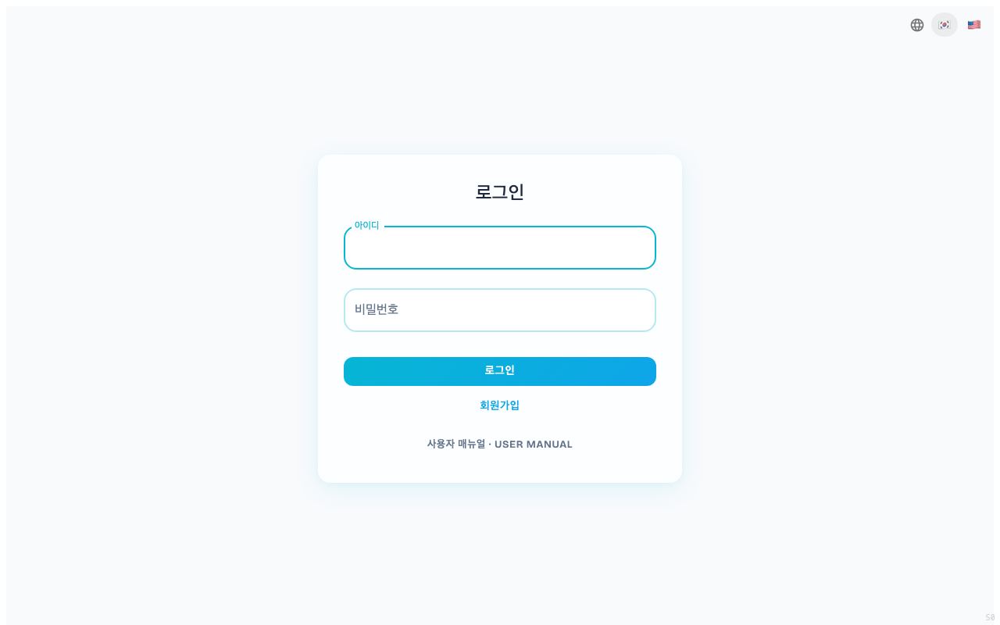

If you already have an account, enter your **username and password** and click the **[Log In]** button. For first-time users, click the **[Sign Up]** button at the bottom to create an account.

> 💡 The **User Manual** link at the bottom of the login screen opens this manual (Korean/English) even before you log in (`/manual`).

### 1-2. Sign-Up Form

Switching to sign-up mode displays the following five fields.

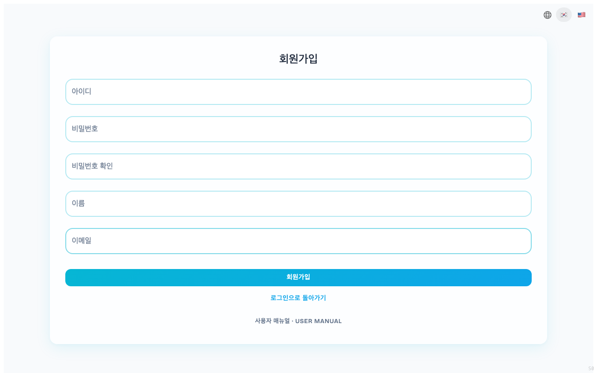

| Field | Description |
|---|---|
| Username | Login identifier (alphanumeric recommended) |
| Password | 8 characters or longer recommended |
| Confirm Password | Enter the same password again |
| Name | Username displayed on screen |
| Email | Email address for verification and notifications |

This is what the form looks like with all fields filled.

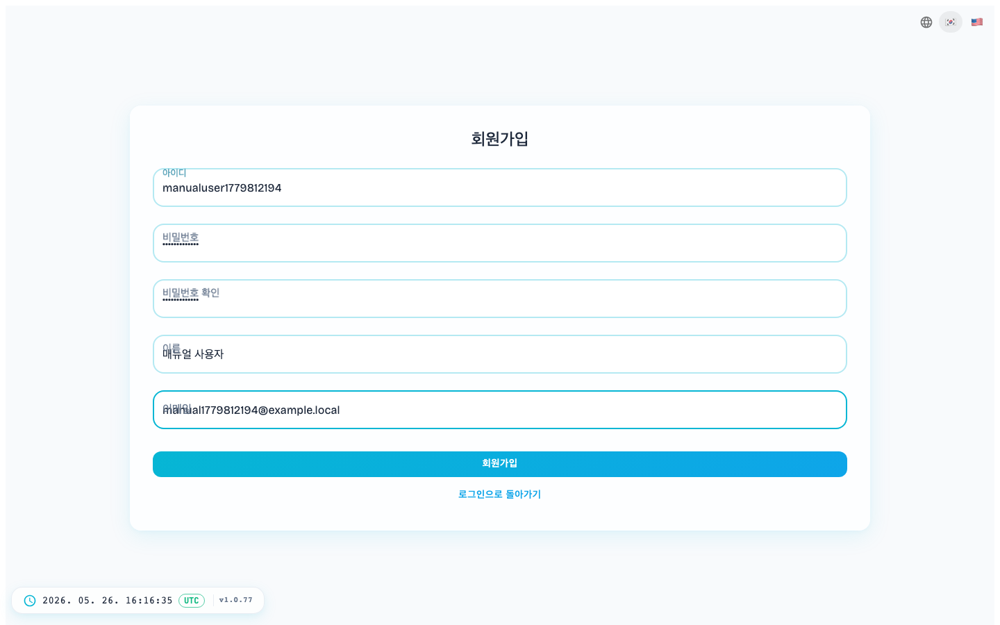

Click the **[Sign Up]** button to register your account. The system automatically returns you to the login screen with a success message.

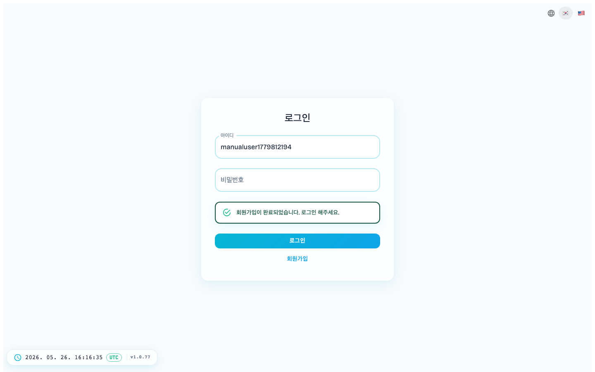

> ⚠️ **If you see an error message** — Network errors like `Failed to fetch` may indicate a service connection configuration issue. Contact your operations team (see [`DOCKER_SETUP.md`](../../deployment/DOCKER_SETUP.md) section 10-2 for details).

### 1-3. Login

Log in with the account you just created.

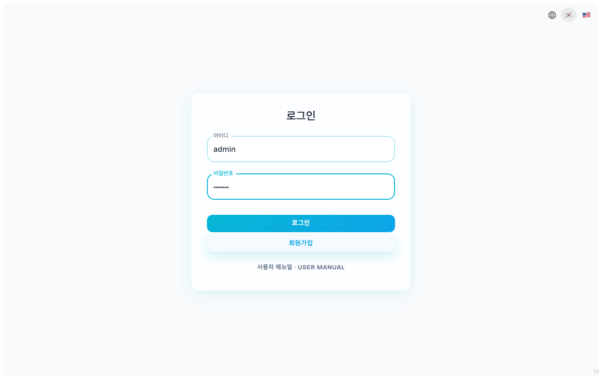

On success, the system navigates to the **Project Management** screen (`/projects`).

---

## 2. Creating a Project

New users have no projects, so an empty screen displays.

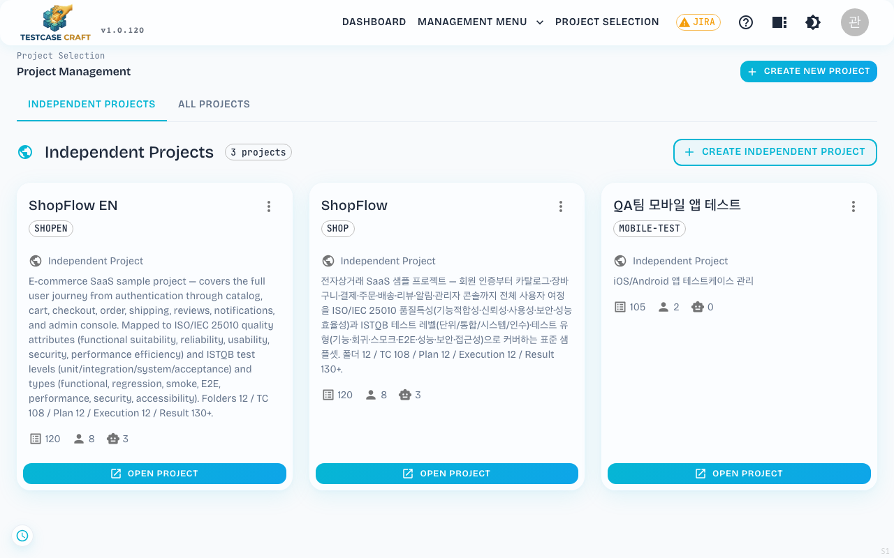

Click the **[+ Create New Project]** button in the upper right or **[+ Create Project]** button in the center to open a dialog.

### 2-1. Project Creation Dialog

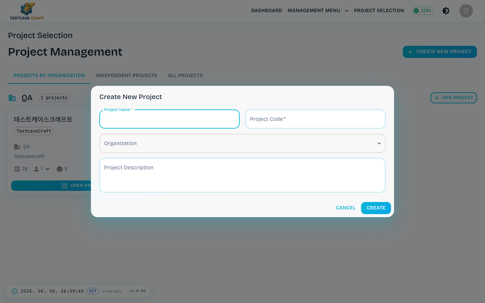

Enter the following in the dialog.

| Field | Example | Notes |
|---|---|---|
| Project Name | `Sample Project` | Name displayed on screen |
| Project Code | `SMP` | Prefix for test case identification IDs (example: `SMP-001`) |
| Description | `E-commerce Payment Feature QA` | Optional — displayed on project card and settings screen |

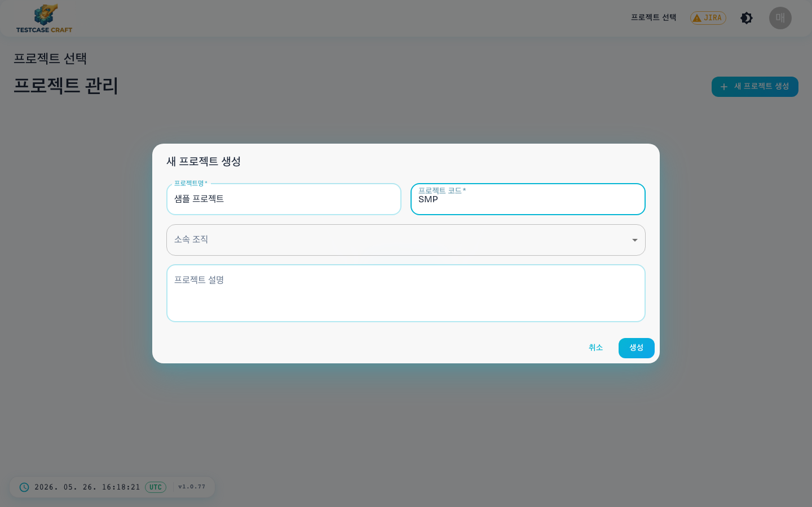

Click the **[Create]** button to create the project and display it as a card.

### 2-2. Created Project Card

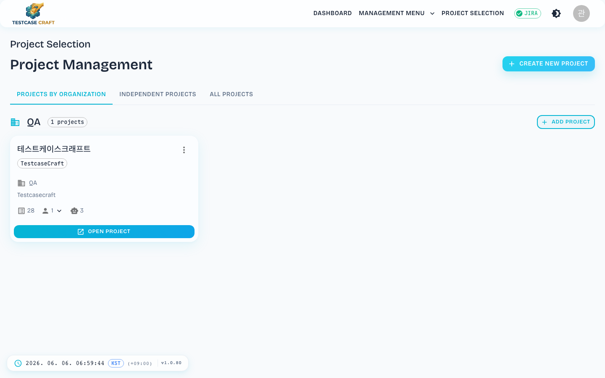

- Switch scope with top tabs **[My Projects] / [All Projects]**
- Cards display **case count / member count / automation count** in small text
- Click **[Open Project]** to enter

---

## 3. Screen Layout and Header

Upon entering a project (`/projects/{projectId}`), the screen displays a three-section layout: header at top, test case tree on the left, and main content on the right. The project dashboard opens by default on first entry; to access the global dashboard, navigate to `/dashboard` separately.

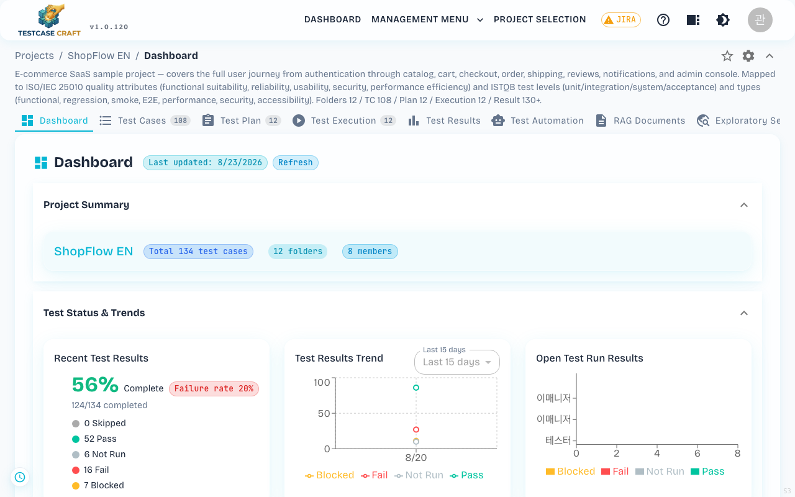

> **Changed on 2026-05-29**: Form field visibility toggles, input mode selection, and other screen-specific user preferences are now saved per user on the server. The same settings persist even when logging in from a different computer.

### 3-1. Header Composition

| Area | Description |
|---|---|
| Left logo `TESTCASE CRAFT` | Click to navigate to project list (`/projects`) |
| Breadcrumb `Project / Sample Project / Dashboard` | Shows current location |
| Tab bar `Dashboard / Test Cases / Test Plans / Test Execution / Test Results / Automated Tests / RAG Documents / Exploratory Sessions` | Navigate between project sections. **Test Cases / Test Plans / Test Execution tabs display item count badges** beside the label |
| Upper right `Project Selector` | Switch to other projects quickly |
| `⚠ JIRA` badge | Yellow warning when JIRA is not configured — click for setup instructions |
| **☆** (star icon) | Navigates to this project's **Bookmarks** (favorites) screen (`/projects/{projectId}/bookmarks`) — see Section 4-7 |
| **?** (circled question-mark icon) | Opens the **User Manual** (Korean/English) in a new tab |
| ◐ (half-moon icon) | Toggle dark/light mode |
| User avatar (initials) | Click for profile/logout menu |

### 3-2. JIRA Panel

> **Changed 2026-07-31**: You can choose how project sections are laid out — **horizontal tabs** or a **left-side menu**. Pick one in Profile → Theme Settings → `Menu structure` (Section 13-7); the default remains the horizontal tabs used so far. The toggle icon in the top bar switches it right away.

With the left-side menu, sections sit vertically on the left. The items and count badges match the horizontal tabs.

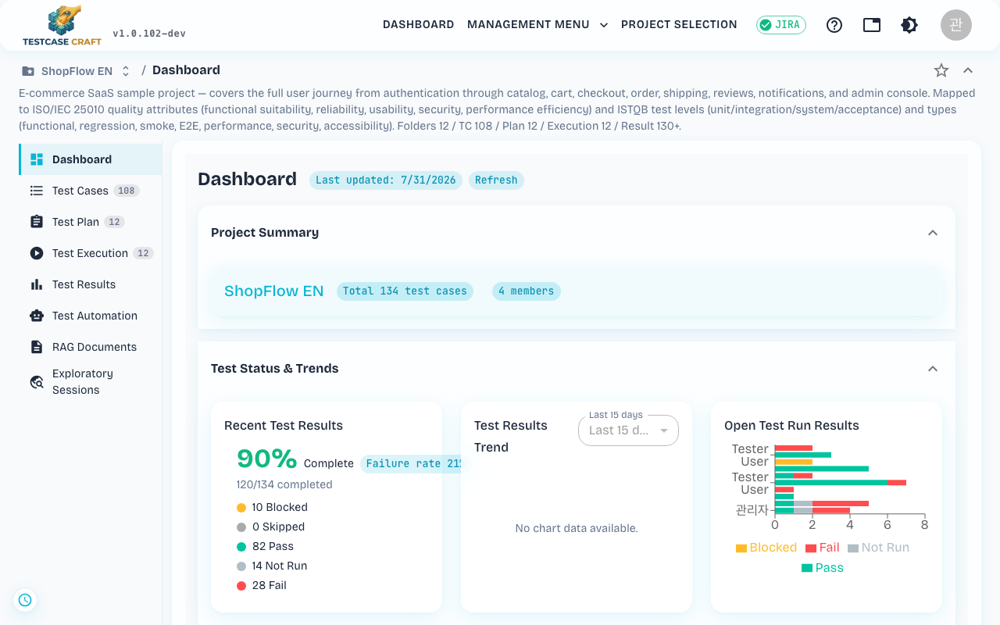

Collapse it with the arrow at the bottom of the menu and only the icons remain, widening the content area.

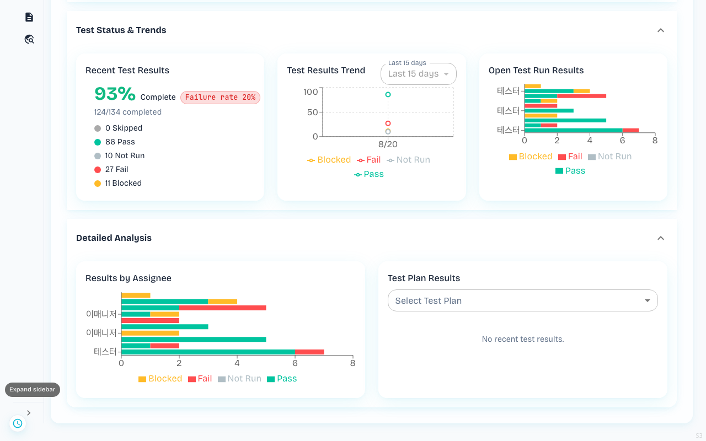

In this layout the first breadcrumb item is the **project selector** (`ShopFlow EN / Dashboard`). Click the project name to open the list and move to another project without leaving the section you were viewing. The former `Project /` crumb is folded away so the project name does not appear twice.

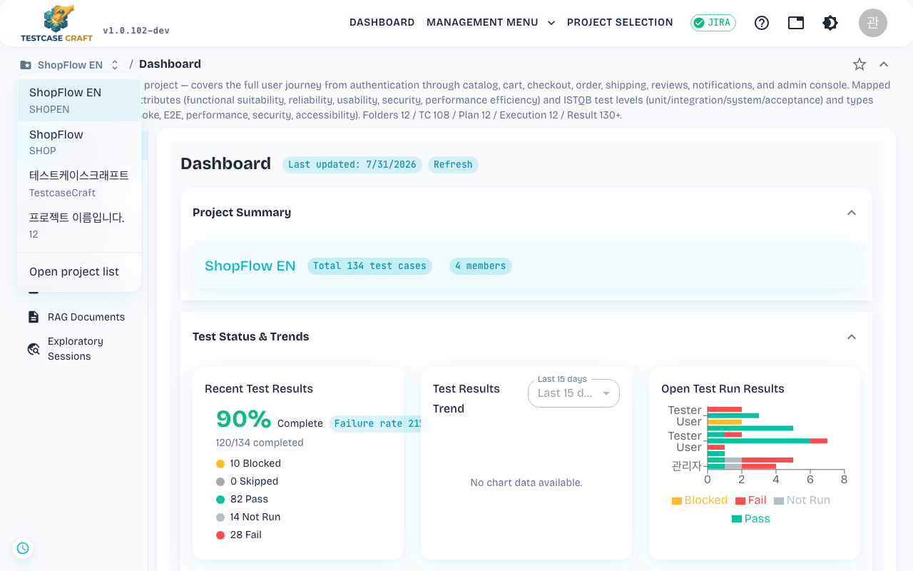

Click the **JIRA** badge in the header to navigate to the integration settings screen.

---

## 4. Writing Test Cases

Navigate to the **[Test Cases]** tab at the top (`/projects/{projectId}/testcases`).

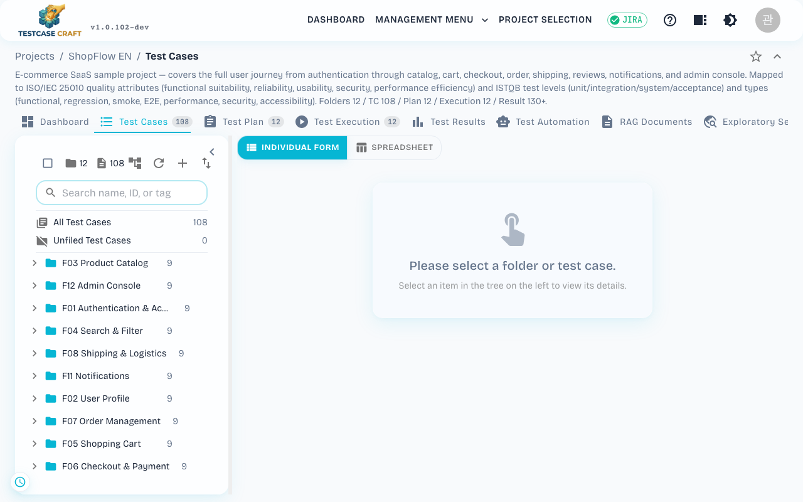

> **Changed on 2026-05-29**: The form title line above the form has been removed. Identify which case you are editing by the **Display ID badge** (example: `SMP-001`) in the header on the left. All metadata sections are now unified as **collapsible areas**. Header action buttons (autosave indicator, version, RAG badge, save, cancel, create version) are now grouped in a single row.

> **Changed on 2026-06-05 (v1.0.80)**: The form body now uses a **single full-width column layout**. Metadata and basic information sections appear first, followed by test steps and expected results sections that span the full form width. On wide monitors (1920px and larger), long step descriptions and expected results no longer squeeze into the left half but expand across the full width, making composition much easier.

> **Changed on 2026-05-29 (v1.0.79)**: **Test step and expected result input field heights now adjust automatically to content**. Empty fields occupy just one line of height, and as you enter content, they expand to fit the text — up to a maximum of 10 lines, after which scrolling is enabled within the field. Long SQL statements, logs, or scenarios can be pasted without causing the form to stretch endlessly. Step and expected result fields in the same row sync their heights, making side-by-side comparison easy.

### 4-1. Screen Layout

| Area | Description |
|---|---|
| Left panel | **Test Case Tree** — displays folders only by default, with an icon button to toggle to full tree mode (cases included) |
| Tool bar above left panel | ☑ Select All / 📁 Folder Count / 📄 Case Count / 🔄 Refresh / 🌳 Tree Mode Toggle / ↕ Order Edit |
| Left filter box | **Folder Filter** — search folders by name and clear with X button |
| Right main content | **Folder Case List** or **Spreadsheet (Table)** — case list when folder selected, spreadsheet when input mode selected |
| Tool bar above main content | `+ Add Row`, `Add Above`, `Add Below`, `Add Folder`, `Delete`, `Validate`, `Import/Export`, `Settings`, `Full Screen`, `Bulk Save` |

> **Changed on 2026-06-06**: The tree default display mode changed to "Folders only". The right panel displays a **folder case list table** based on the selected item (folder/case), and you can switch to spreadsheet mode using the input mode button. Click the tree icon button (🌳) in the tree header to switch back to the previous mixed mode (cases included in tree). A folder filter search box is added below the tree header to filter the tree.

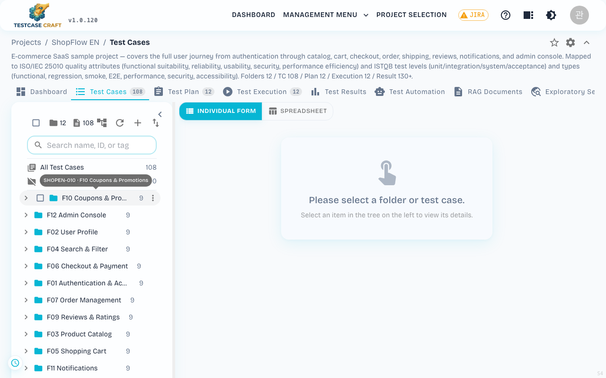

#### Folder Case List

Select a folder in the tree to display its direct subfolders and **all test cases including those in nested subfolders** as a table on the right.

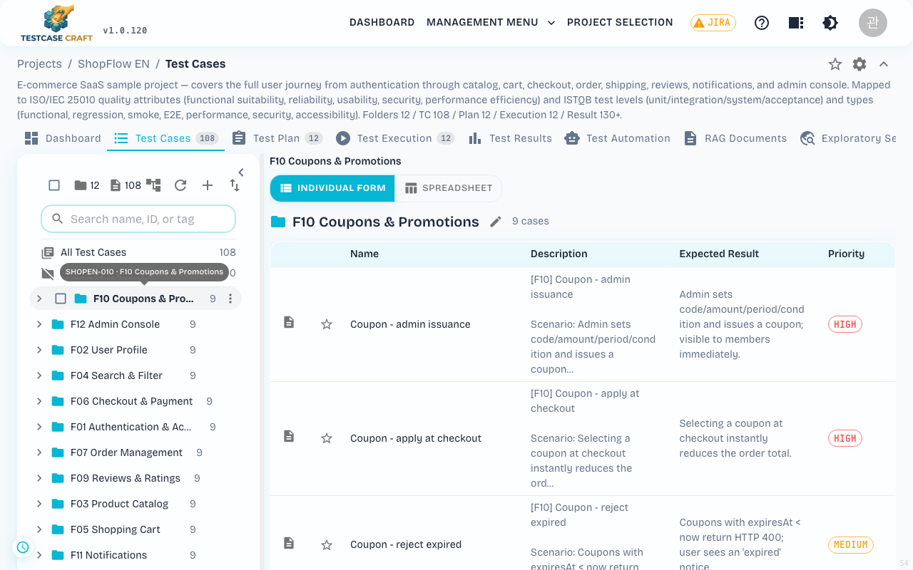

- **Columns** — Name → Description → Expected Result → Priority.
- **Nested cases included** — Even in `Folder > Folder > Case` structures, selecting the parent folder shows every case underneath. Cases in subfolders get a **Folder** column showing the path relative to the selected folder; click the path to jump to that folder.
- **Long text** — Text longer than 100 characters is truncated with an ellipsis (…); hover to see the full content in a tooltip.
- **Expected Result** — Shows the case's consolidated expected result first; if absent, shows numbered per-step expected results.
- **Row click** — Click a case to open its detail form; click a subfolder to navigate into that folder's list.
- **Path display** — The current location appears at the top as `Parent Folder › Subfolder › Case Name`. Click an ancestor folder to jump to it.

#### Edit Folder Info

Click the **pencil icon** next to the folder name at the top of the folder case list to switch to the folder info edit form.

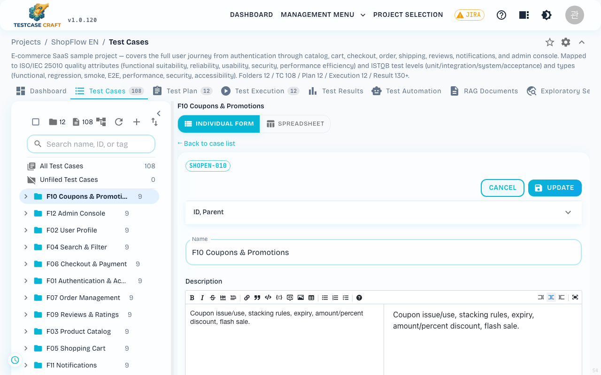

| Field | Description |
|---|---|
| **Name** | Rename the folder. Same result as right-click → "Rename" in the tree. |
| **Description** | Describe the folder's purpose and scope with the markdown editor. |
| **Tags** | Add tags for folder categorization. |

- Click **[Update]** to save and return to the case list automatically.
- To return without saving, click the **"← Back to case list"** link at the top.
- Selecting another folder or case exits edit mode automatically.

### 4-2. Input Mode Selection

The **[Individual Form] / [Spreadsheet]** toggle button always displays at the upper left of the main content. A single click switches between input modes.

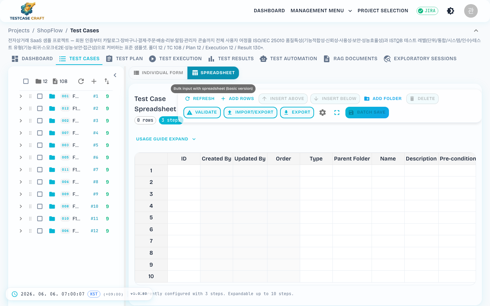

- **Spreadsheet mode** — Enter multiple cases in table format at once (default). Similar to Excel workflow: add rows → enter cell data → bulk save for fast creation.
- **Form (Individual Form) mode** — Enter one case at a time with detailed field-by-field input. Supports all fields with unlimited steps, ideal for meticulous case composition with many preconditions, postconditions, or attachments.

> The selected input mode is saved per user on the server and restored automatically even when logging in from a different computer.

> **Note**: The **Advanced Spreadsheet** mode from previous versions is currently hidden temporarily. It may be offered again in future updates; for now, use the standard spreadsheet mode.

> **Changed on 2026-05-29**: When spreadsheet cells contain long content exceeding approximately 30 Korean characters (480px), **automatic word wrapping** activates. The column width does not expand horizontally; instead, only the row height increases, making it easier to compare multiple cases on one screen.

### 4-3. Add Row Dialog

Click **[+ Add Row]** at the top of the spreadsheet to open a dialog asking how many rows to add.

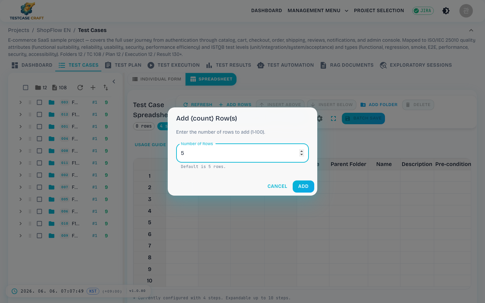

The default is 5 rows, with a range of 1–100 rows addable at once. Click **[Add]** to create empty rows. Fill in ID, name, description, precondition, steps, and other fields as needed. When finished, save all changes at once using **[💾 Bulk Save]** in the upper right.

### 4-4. Folder and Case Tree Structure

TestcaseCraft manages folders and cases as **a single tree**.

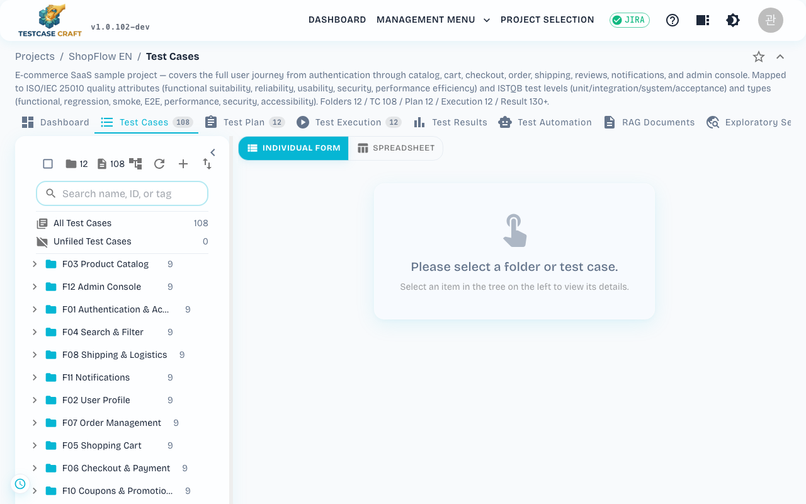

- **Folders** (`📁`) — Units for grouping and categorizing cases
- **Cases** (`📄`) — Actual test scenarios
- **System Default Folders** — Protected folders automatically created when a project is created. They cannot be moved or deleted to prevent accidents.

The tree header displays the current **folder count (📁) and case count (📄)**, allowing you to gauge project size at a glance.

#### Tree View Modes

By default, the tree displays **folders only**. Click the **tree icon** (🌳) in the tree header to toggle between "Folders only" and "Show cases in tree". The setting is saved in your browser and persists on your next visit.

> **Changed on 2026-06-06**: On the case selection screen in test plans (selection mode), the full tree with cases always displays.

#### Virtual Nodes (All Test Cases / Unfiled Test Cases)

Two fixed rows appear at the top of the tree:
- **All Test Cases** — total count of all cases
- **Unfiled Test Cases** — count of cases with no folder assigned

Click these rows to display the corresponding case list on the right. These lists include a **Folder** (path) column at the front so you can see each case's parent folder; click the path to jump to that folder.

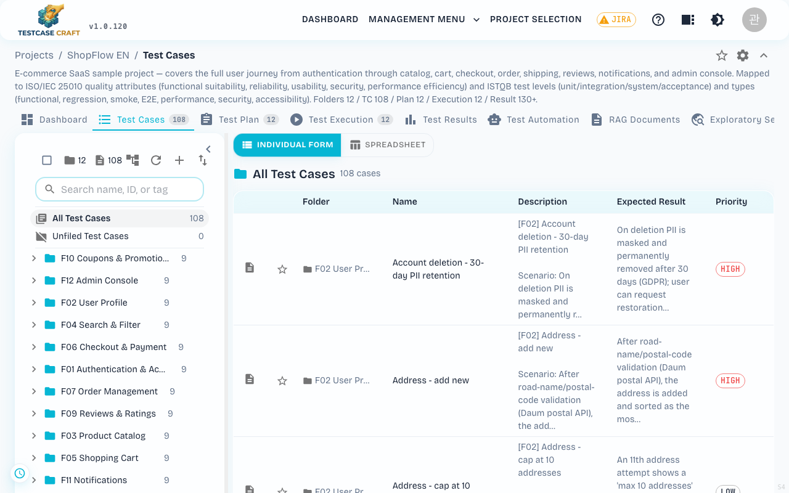

#### Folder Filter

Use the **search box** below the tree header to find cases and folders. The search hint reads **"Search by name, ID, or tag"**.

- **Folder Filter** (previous name) — Search folders by name. Works on partial match; parent paths of matched items are preserved and auto-expanded.
- **Display ID Search** — Search cases by their Display ID (example: `TC-12`). Supports partial matching.
- **Tag Search** — Search cases by their attached tags.
- **Complex Search** — Separate multiple search terms with commas (`,`); the results show items matching all conditions.
- **Select All with Filter** — When search narrows the tree, clicking the **☑ Select All** button in the tree header selects only the visible results (hidden items are excluded).

Clear the filter with the X button.

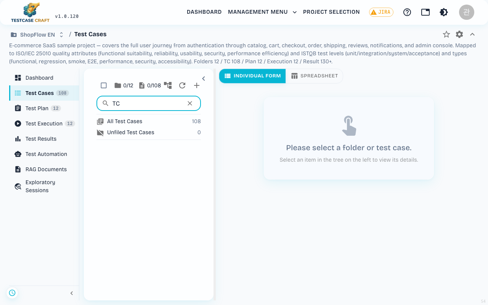

#### Add Folders or Cases

There are two ways to add folders or cases.

1. Click the **➕** icon in the left tree header (visible when you have edit permissions)
2. Right-click on a folder in the tree → select from context menu

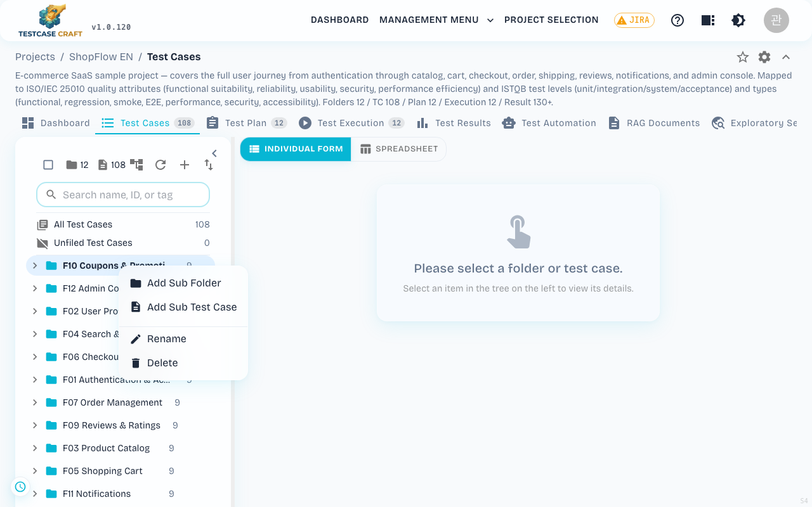

What you can do from the right-click menu:

| Menu | Action |
|---|---|
| **Add Sub Folder** | Create a new folder inside the selected folder |
| **Add Sub Test Case** | Create a new case inside the selected folder |
| **Rename** | Edit folder/case name inline |
| **Delete** | Delete folder/case (folders delete with all contents inside — use caution) |

### 4-5. Field Visibility Toggle

Click the **🔲 (Select Fields to Display)** icon in the upper right of form mode to toggle metadata field visibility in the form.

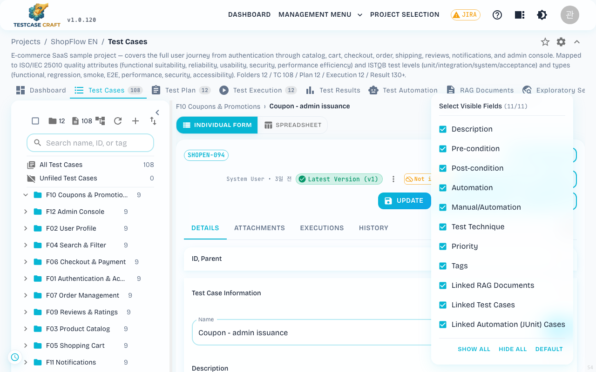

Nine toggleable fields:

- Description
- Precondition
- Postcondition
- Automation Status
- Manual / Automation
- Testing Technique
- Priority
- Tags
- Connected RAG Documents

> Core fields (name, steps, expected results) always display and are excluded from toggling.

Use the **[Show All] / [Hide All] / [Default]** buttons at the bottom of the popover to configure all at once. Your selection is saved per user on the server and persists across logins from different computers.

### 4-6. Form Mode Screen Layout and Metadata

Opening a case in form mode displays the following screen.

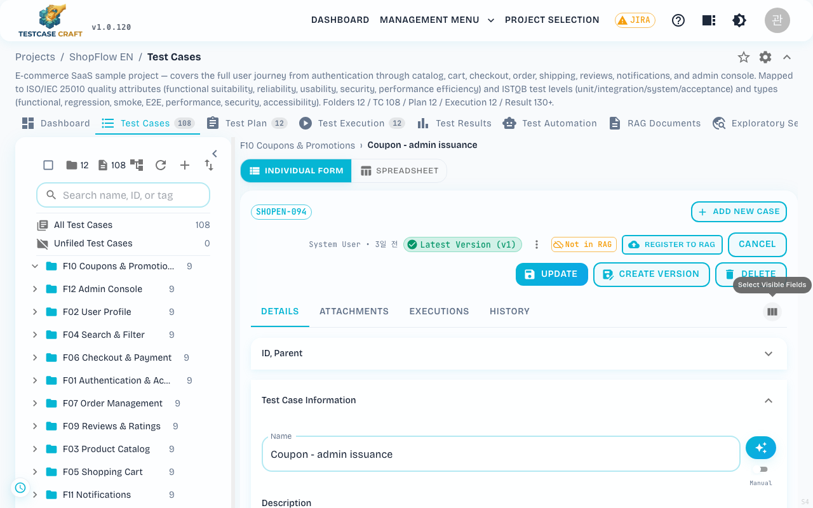

**Header area** (top to bottom):

- **Display ID badge** (example: `SHOP-112`) — the case you are currently editing
- **Version indicator** (example: `Latest Version (v2)`) — click to view version history
- **RAG Registered** badge — indicates this case is registered in the RAG knowledge base
- Right-side action buttons — **[Cancel] / [Save] / [Create Version] / [Delete]**

> **Changed 2026-07-02 (v1.0.93)**: When editing a saved case, a red **[Delete]** button appears on the right side of the header. It now opens the **same confirmation dialog as the tree delete** — it **shows the target case's ID and name in a table** and you confirm with **[Delete] / [Cancel]**. The button is hidden when you lack permission (e.g. viewers), and if you are not allowed to delete, the message returned by the server is shown at the bottom of the screen as-is.

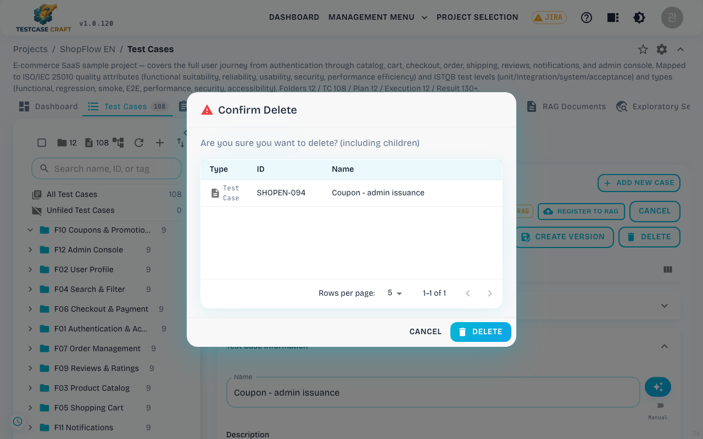

**Main content tabs** (4 tabs):

| Tab | Content |
|---|---|
| **Details** | Case body: name, description, test steps, expected results, etc. (default tab) |
| **Attachments** | File list and upload interface |
| **Execution History** | Past execution results for this case |
| **History** | Change log (who changed what, when) |

**Metadata area** (ID, Parent at the top of Details tab — collapsible):

- **Editable fields** — Name, Display ID, description, priority, tags, etc. (exposed per §4-5 toggles)
- **Read-only fields** — Created date, modified date, author, UUID, etc. (system-populated). UUID displays as the full string without truncation, allowing easy copy-paste for external system integration and debugging.

### 4-7. Bookmarks & Favorites

> **Changed on 2026-06-09**: You can now collect frequently viewed test cases into personal **bookmarks**. Bookmarks are **private to you** and do not affect other users' screens.

**Add/Remove a favorite**

Each row in the case list has a star icon on the left.

- Click **☆ (empty star)** → adds the case to your favorites.
- Click **★ (filled star)** → removes the case from your favorites.

Favorited cases go into the default **Favorites** collection.

**Bookmarks screen**

Click the **☆** icon in the header to open the Bookmarks screen (`/projects/{projectId}/bookmarks`). The screen is split into two areas:

- **Left — Collection list**: **collections** that group cases by topic. The default **Favorites** collection always exists and cannot be deleted. Use **[Create Collection]** to add a new one; each collection can be **renamed** and **deleted**.
- **Right — Case list**: cases in the selected collection are shown in a table with **Case Name · Priority · Note · Actions** columns.

You can attach a **personal note** to each case — for example, "always check during regression."

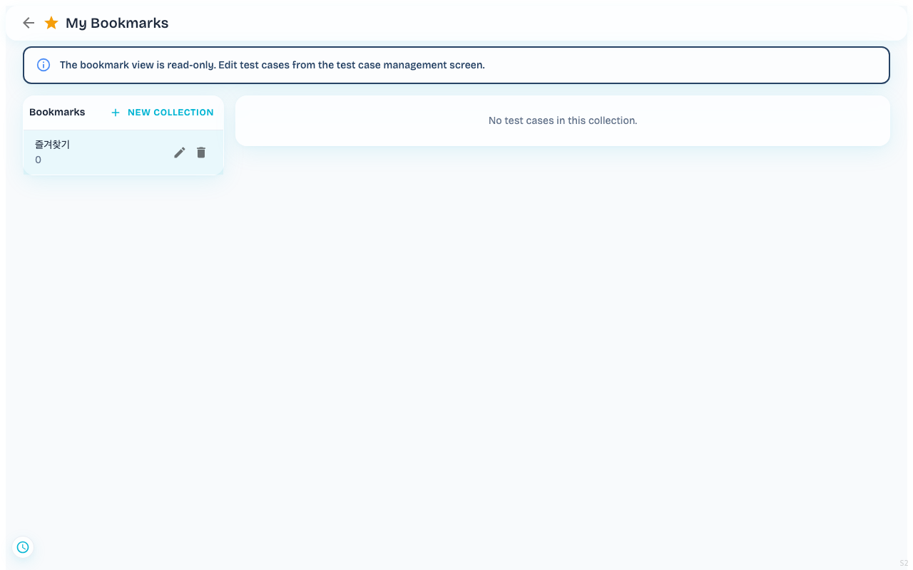

The read-only Bookmarks screen, split into the collection list on the left and the case list on the right.

> ⚠️ The Bookmarks screen is **read-only**. To edit case content (name, steps, expected results, etc.), go to the **Test Cases** screen. Bookmarks only handle collection organization and personal notes.

---

## 5. Test Case Tree — Drag-and-Drop Reorganization

> This feature is available from v1.0.77 onwards. For detailed guidance, see [`docs/guide/TREE_DND_USER_GUIDE.md`](../../guide/TREE_DND_USER_GUIDE.md).

> **Changed on 2026-05-29**: Each row's **Display ID badge** in the tree now shows only the **last number** (example: `SMP-001` → `001`) instead of the full ID. Hover over the badge to see the full ID in a tooltip. Row names also show a tooltip with the full name only when the text is truncated, keeping the screen cleaner most of the time.

### 5-1. Action Summary

The existing **right-click menu** (add/rename/delete) and **sort edit mode** (↑/↓ buttons) remain available. Additionally, you can now **drag with the mouse** to change positions.

| What you want to do | Action |
|---|---|
| Move a case to a different folder | Grab the **`⋮⋮` (drag handle)** on the left side of the case row and drag it onto the folder |
| Move an entire folder | Grab the drag handle on the folder row and drag it onto another folder |
| Change order within the same folder | Drop between items at the **thin gap** |
| Move to root | Drop in the empty area at the top of the tree |

The **six-dot icon (⋮⋮)** on the left of each row is the drag handle. The handle is **hidden by default and appears when you hover over the row**. Dragging must start from this handle, not from other parts of the row. Before dropping, a **faint guide line** shows where the item will land.

> **Changed on 2026-06-06**: The drag handle is hidden by default and only appears on hover. Checkboxes, version history, and more (⋮) buttons also appear on hover only.

### 5-2. Multi-Select Move

Move multiple items at once.

1. Select multiple nodes using the **checkbox** or `Cmd-click` (Mac) / `Ctrl-click` (Windows)
2. Grab the drag handle of **one selected item** and drag → the entire group moves together
3. The server receives a single request; if any item fails, **the entire operation reverts to the original state** (no partial changes)

### 5-3. Auto-Blocked Moves

The following moves are automatically blocked — the guide line turns **red**:

- Moving a folder into itself or a subfolder it contains (example: moving folder A into subfolder B inside A)
- Moving to a folder in a different project (not possible by drag — use the **[Move/Copy to Project]** feature in Section 5-5 instead)
- Placing other items **inside** a test case (cases cannot have children)
- Moving system default folders

When blocked, a notification at the bottom of the screen explains the reason, and the tree immediately reverts to its original state.

### 5-4. Move Log (Audit Trail)

All successful moves are automatically recorded in the system — **who, when, and where items were moved** can be tracked by administrators. If you accidentally move something, contact your administrator to find its original location.

### 5-5. Move / Copy to Another Project

> **Added 2026-07-02 (v1.0.93)**: You can **move or copy** selected test cases (and all children if a folder is selected) **to another project**. Unlike drag-and-drop (Sections 5-1 to 5-4), which only changes position within the same project, cross-project operations use a dedicated button.

**How to open**

1. Select one or more cases/folders in the tree using their **checkboxes**.
2. Click the **[Move/Copy to Project]** button that appears in the tree header. (It is visible only when items are selected.)
3. The **Bulk Test Case Operations** dialog opens, showing the count and names of the selected items at the top.

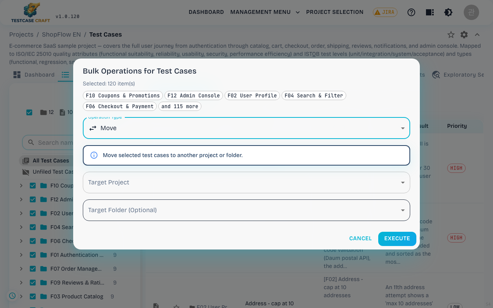

**Running move / copy**

1. Under **Operation**, choose **Move** or **Copy**.
2. Select a **Target Project** (required). The folder list for that project is loaded automatically.
3. Select a **Target Folder** (optional). If left unset, items go into the **root folder** of the target project.
4. Click **[Execute]**. The operation runs and the tree refreshes afterward. For a **move**, the transferred items disappear from the current project tree.

**Move vs. Copy — how test results are handled**

| Operation | Cases | Test results | Required permission |
|-----------|-------|--------------|---------------------|
| **Move** | Transferred to the target project (removed from the source) | Linked results **move too** — corresponding executions are created in the target project and the results are re-homed there (JIRA bug field, attachments, tags, executor, and execution time preserved) | **Edit permission on both** source and target projects |
| **Copy** | **Duplicated** into the target project (source unchanged) | **Not brought over** — only the cases are duplicated | **View** on source + **Edit** on target |

> ⚠️ System default folders cannot be selected as move/copy targets. If you lack edit permission on the target project, the operation is rejected and a message appears at the bottom of the screen.

---

## 6. Dashboard and Statistics

The **[Dashboard]** tab at the top of the project (`/projects/{projectId}` default on entry) displays key metrics for that project in a single view. For organization-wide metrics, access `/dashboard` via the header Dashboard menu.

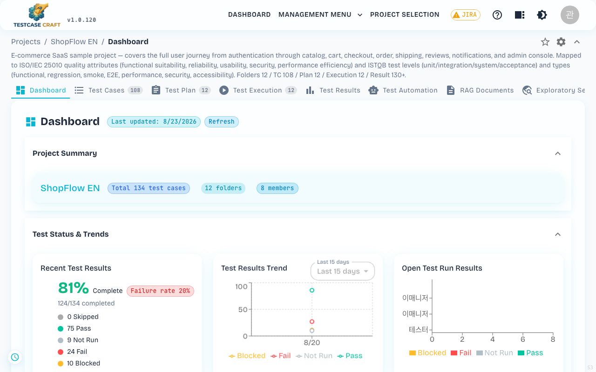

| Card | Description |
|---|---|
| Project Summary | Number of cases and team members |
| Latest Test Results | Pass / Fail / Not Run / Skipped / Blocked ratio |
| Test Result Trend | Progress flow chart over recent days |
| Active Test Executions | Summary of ongoing executions |
| Results by Assignee | Each member's case progress |
| Results by Test Plan | Statistics per plan |

Click **[Refresh]** at the top to update to the latest data. Use **[Last 15 Days ▾]** to change the display period.

## 7. Test Plans

Click the **[Test Plans]** tab at the top (`/projects/{projectId}/testplans`) to manage **test plans** — groups of test cases bundled together as a single execution unit.

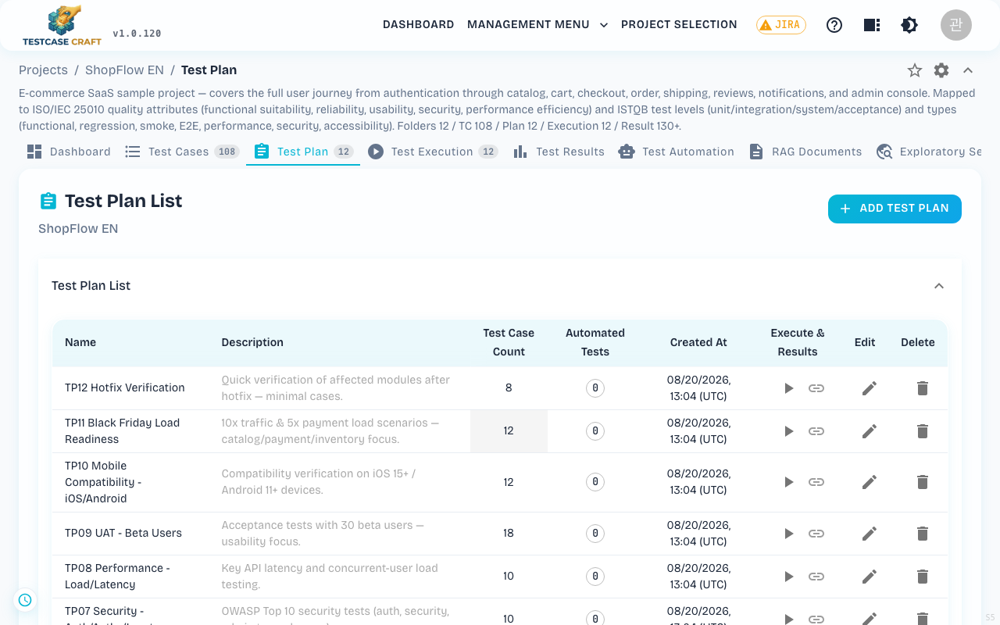

- Click **[+ New Plan]** in the upper right to create a new plan (select name, description, and cases to include)
- Click a plan card or row to enter detailed view
- Cases bundled in a plan can be executed together in "Test Execution"

> This new project has no plans yet. Once you create a plan, it displays as a card.

#### Creating a plan (`/projects/{projectId}/testplans/new`)

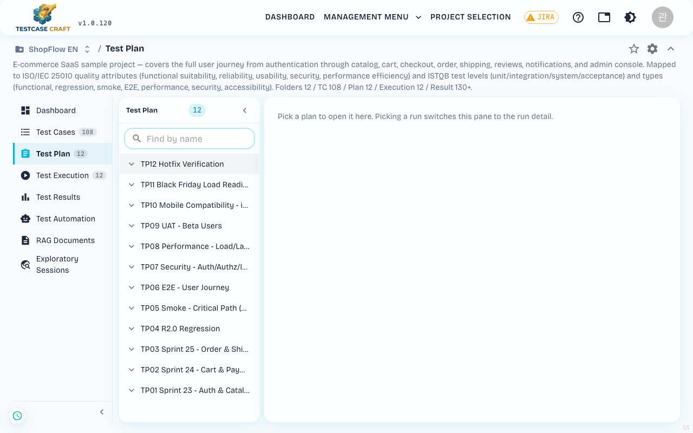

Enter the name and description on the left, then pick the cases to include from the tree on the right. Checking a folder selects the cases inside it, even while the folder stays collapsed. The search box matches name, display ID, and tags together. The name is required; a plan with no cases selected can still be saved.

#### Opening and editing a plan (`/projects/{projectId}/testplans/{testPlanId}`)

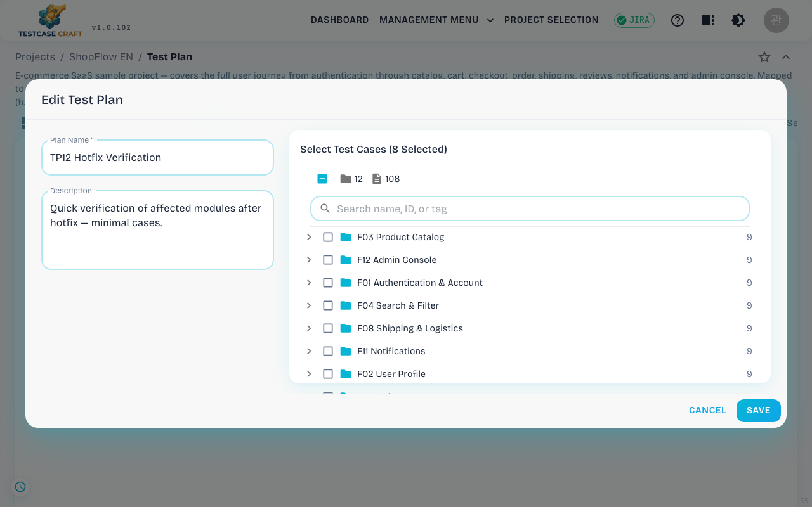

The same form opens with the stored values. The header shows how many cases the plan holds, and clearing a checkbox removes that case from the plan. Removing a case from a plan that already has executions leaves the earlier results untouched.

#### Linking automated tests

The **🔗 Link automated tests** icon on each plan row opens a dialog for attaching automated tests to that plan. The number chip on the row is the current link count, and clicking the chip opens the same dialog.

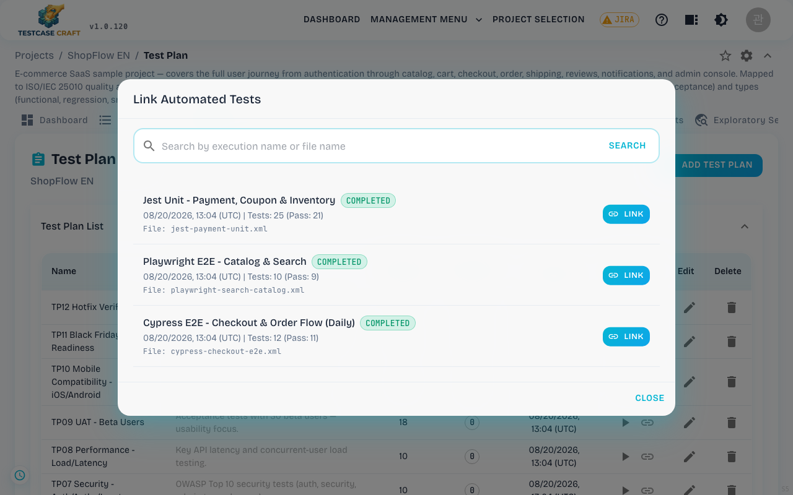

- Each uploaded automation run is listed with its **name, status, upload time, test count (passes), and file name**.
- The search box matches the **execution name or the file name**. Press **[Link]** on the entry you want; already-attached entries show **[Unlink]** instead.
- **The icon appears only for roles that can manage the plan** (PM, LEAD). Signed in as VIEWER, TESTER, or DEVELOPER, the icon is absent.
- Once linked, those runs count toward the plan in the **Automated tests** totals on the Test Results screen.

> **Changed 2026-07-31 (new layout)**: With the left-side menu layout active, test plans display in a **2-section (list + detail)** format. The left panel shows the plan tree (with execution entries visible under each plan), and the right panel displays the selected plan's content. There is no popup or full-screen mode — everything stays within the layout. In the tab-based layout, the existing popup/full-screen behavior is preserved.

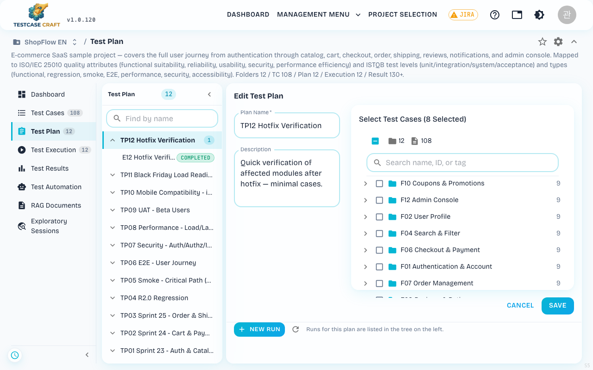

Expand a branch on the left and that plan's executions appear under it. Select an execution and the right panel switches to the execution detail; `Back to plan` returns to the plan content. The `New run` button under the plan content inherits the plan you selected.

---

## 8. Test Execution

Click the **[Test Execution]** tab at the top (`/projects/{projectId}/executions`) to manage execution instances of cases bundled in test plans.

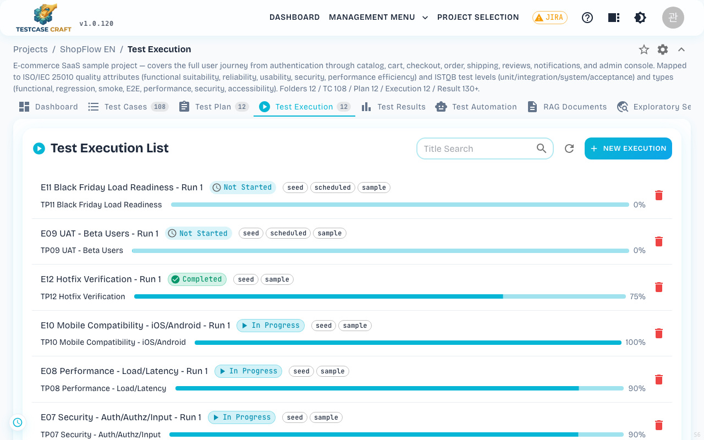

- Search by title using the filter box (the search term is remembered per project)
- Click a row to enter that execution and record each case's result (Pass/Fail/Skipped/Blocked)
- The "Test Results" tab shows consolidated statistics from completed executions

> **Changed on 2026-06-09**: The test execution list **auto-refreshes about every 20 seconds**, so progress recorded by other team members appears without a manual reload. Auto-refresh pauses while you are on another tab to avoid unnecessary requests, and resumes when you return to the screen. You can also refresh instantly at any time using the **[Refresh]** button at the top of the list.

> **Changed 2026-07-31 (new layout)**: With the left-side menu layout active, test execution displays in a **2-section (list + detail)** format. The left panel lists all executions in the project (newest first), and the right panel shows the selected execution's detail (result entry, etc.). The result entry screen does not break out into full-screen — it stays within the right panel while keeping the header and left menu intact. In the tab-based layout, the existing behavior is preserved.

Each execution row carries a status chip and the name of the plan it belongs to. The search box queries execution names on the server, and `Load more` at the bottom pulls the next batch when the list is long.

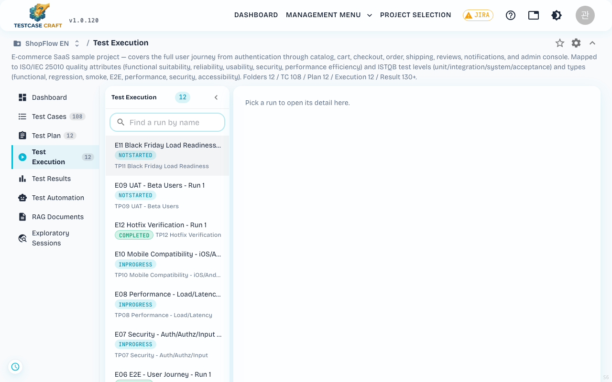

#### Creating an execution (`/projects/{projectId}/executions/new`)

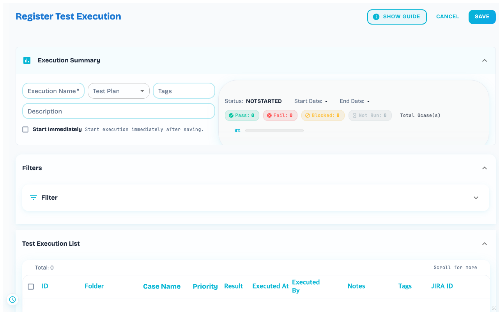

The execution name is required. Selecting a test plan pulls in the cases that plan holds. Turning on **[Start immediately]** starts the execution as soon as you save; leaving it off keeps the execution at `NOTSTARTED` so you can start it later. The summary header shows zeros because no results exist yet.

The manual execution flow is as follows:

1. Click **[Start Execution]** from a test plan
2. Step through cases one by one — enter expected result (expected) and actual result (actual) per step, then mark the result
3. Upload attachment files (screenshots, logs, etc.) — supports TXT, CSV, JSON, MD, PDF, LOG, PNG, JPG, GIF formats; up to 10 MB per file
4. On completion, results automatically reflect in **Test Results** and **dashboard statistics**

> **Changed on 2026-06-09**: A **filter panel** was added above the case list inside an execution, letting you narrow cases by **result** (PASS/FAIL/BLOCKED/NOT RUN), **priority**, **executor**, **execution date**, **JIRA issue key**, and **notes**. When a filter is active, an **Active** indicator appears, and **[Clear]** removes all conditions at once.

> **Changed 2026-07-31**: A **tag** filter item has been added to the filter panel. You can now filter results by the tags attached to them; both multi-select and direct input are supported. When saving results, if you do not enter tags, the previous tags are inherited (tags do not disappear).

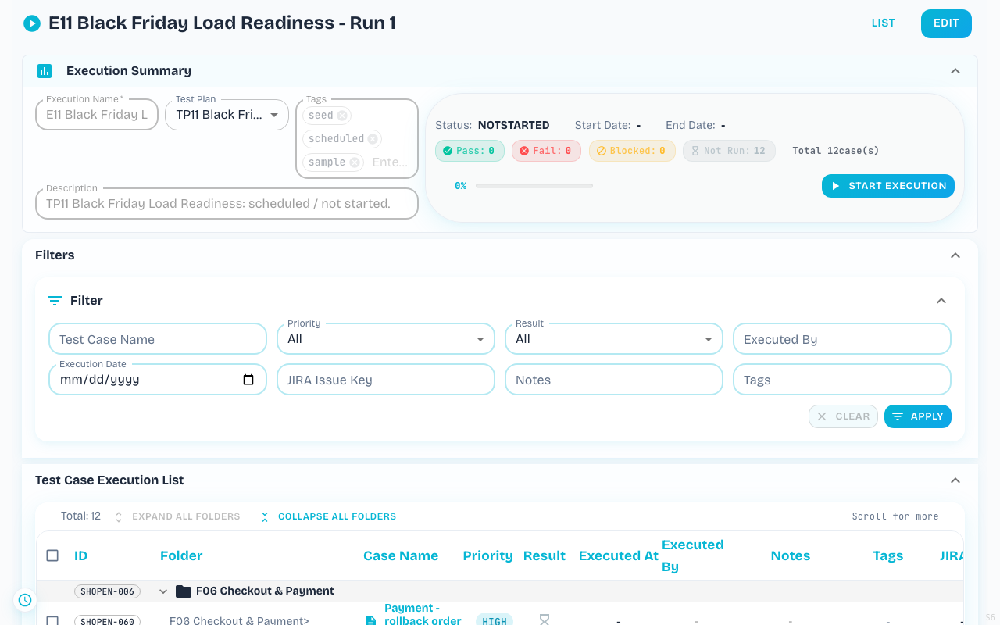

### 8-1. Result Entry Screen

Click a case within an execution to open the result entry screen (`/projects/{projectId}/executions/{executionId}/testcases/{testCaseId}/result`). Use the floating result button on the screen to record one of the following four states:

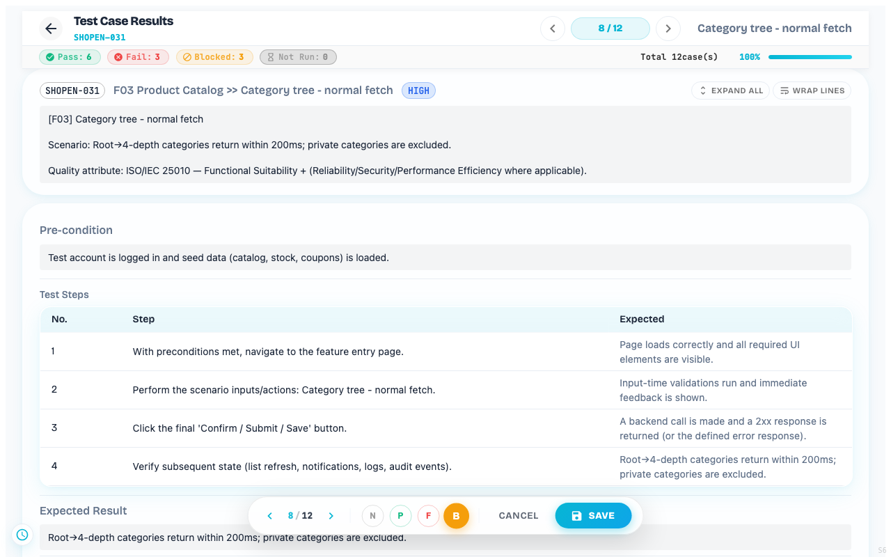

The header carries per-state counts and overall progress, and the `1 / 12` arrows move to the next case in the same execution. Below, the case's pre-condition, steps, and expected results follow along, so you can judge without opening a separate document.

| Button | State | Meaning |
|--------|-------|---------|
| **P** | Pass | Behaves as expected |
| **F** | Fail | Behaves differently from expected — possible defect |
| **B** | Blocked | Execution itself is impossible due to environment issues, etc. |
| **N** | Not Run | Not yet executed (default) |

In addition to the result, you can record **notes** (free-form comments), **tags**, and **JIRA issue key**. At the bottom, the **previous result list** shows execution history for this case at a glance. Rows from this execution in the previous result list are visually distinguished, so you always know which results belong to the current run.

> **Added 2026-07-31**: Near the top of the result entry screen, a **Test Case Attachments** section now displays. You can view attachments (screenshots, scripts, supporting documents, etc.) that are attached to this test case here. If opening a download link shows an error, refreshing the page will automatically update the list.

**Previous Execution Results dialog — note view format toggle**

> **Added on 2026-06-10**: In the test case execution list, clicking a case's **[Previous Results]** button opens the **Previous Execution Results** dialog. A **MARKDOWN / TEXT** view format toggle sits at the top right of this dialog.

- **MARKDOWN** (default): renders notes with Markdown formatting, so tables, lists, code blocks, and the like are displayed nicely.
- **TEXT**: shows notes **as-is** without any formatting conversion. Use this mode to read the raw text when a note that is not in Markdown format appears broken.

The selected view format is saved in your browser, so it is preserved the next time you reopen the dialog.

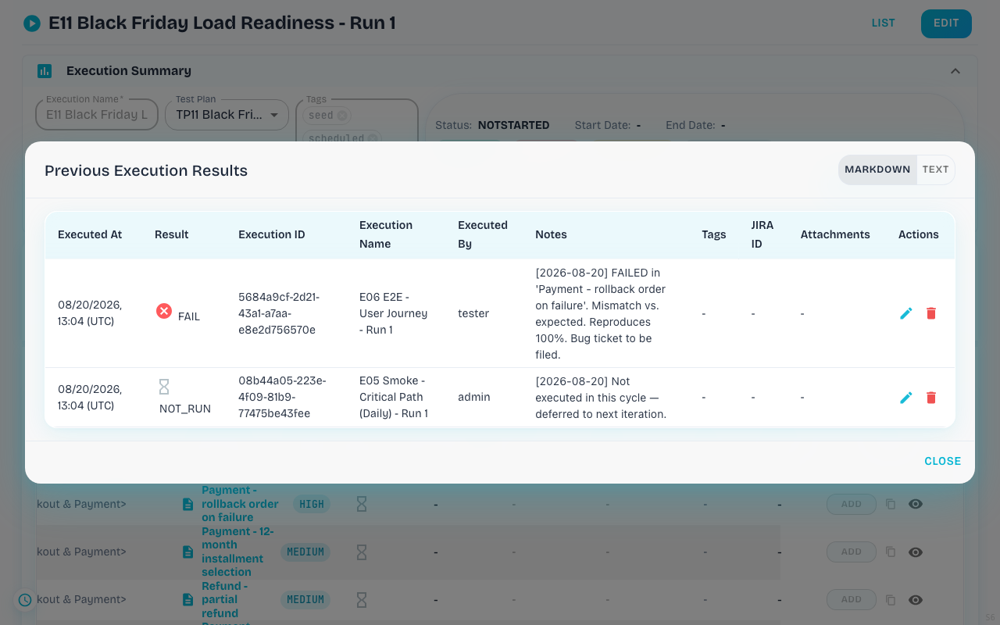

### 8-2. Auto-Save — Viewing Never Saves

> **Changed on 2026-06-05 (v1.0.80)**: Result entry auto-save behavior has been safely redesigned.

- **Viewing alone does not save** — Opening the result entry screen to review content or navigating between cases using the next/previous buttons triggers no save. Feel free to browse existing results without worrying that data will change. 
- **Editing auto-saves** — If you actually modify the result button (P/F/B/N), notes, tags, or JIRA key, the changes auto-save after approximately 1.5 seconds. Check the auto-save status indicator at the top of the screen to confirm.
- **Empty results are not created** — Clicking save or the next button when nothing has been entered (Not Run + empty notes) does not create a blank record; previous results remain unchanged.

> 💡 As of v1.0.80, simply viewing does not create blank records. Any blank Not Run records accumulated in earlier versions are automatically cleaned up when you enter an actual result for that case.

---

## 9. Test Results

Click the **[Test Results]** tab at the top (`/projects/{projectId}/results`) to view consolidated results from completed executions.

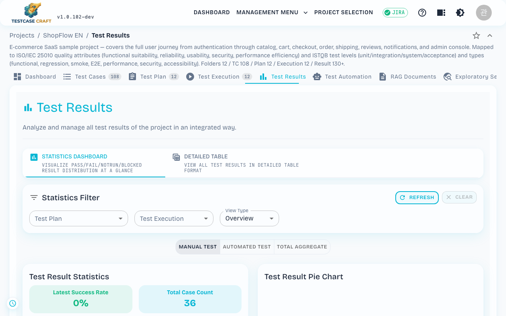

- Filters: date range, plan, assignee, result status
- Pass rate per case, recent N-run trend chart
- Export result reports as files — three formats available:

**Changing the view mode** — Changing **View mode** in the statistics filter regroups the same results by a different key. The chosen mode stays in the address (`?viewType=by-folder`), so the link shares as-is.

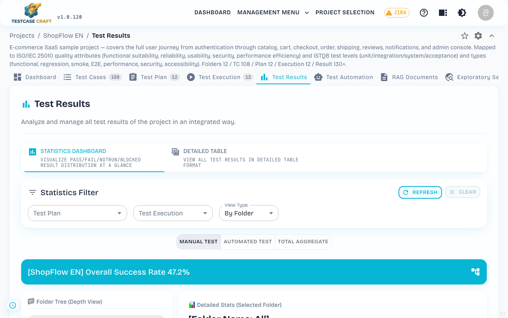

| View mode | Value in the address | Grouped by |
|---|---|---|
| Overview | `overview` | Whole project on one page |
| By folder | `by-folder` | Tree folders — which feature area is weak |
| By plan | `by-plan` | Plans — which release bundle is weak |
| By execution | `by-execution` | Execution runs — trend across runs |
| By executor | `by-executor` | People — workload distribution |

The **Manual tests / Automated tests / Combined** toggle below decides which results are counted.

| Format | Recommended For |
|--------|-----------------|
| **Excel (.xlsx)** | Sharing report with charts, filtering statistics, and making modifications |
| **PDF (.pdf)** | Printing or storing with fixed layout — choose portrait or landscape orientation |
| **CSV (.csv)** | Extracting data only for analysis in other tools |

> **Changed on 2026-06-05 (v1.0.80)**: PDF export no longer cuts off long test steps (step/expected result) at page boundaries; they now print in full across multiple pages.

### 9-1. Opening the Not Run / Failed case list

In the statistics card, the **Not Run** and **Failed** entries carry a `▼` marker. Click one and the matching cases open as a list, so you do not have to hunt through the tree to find out which cases the number refers to.

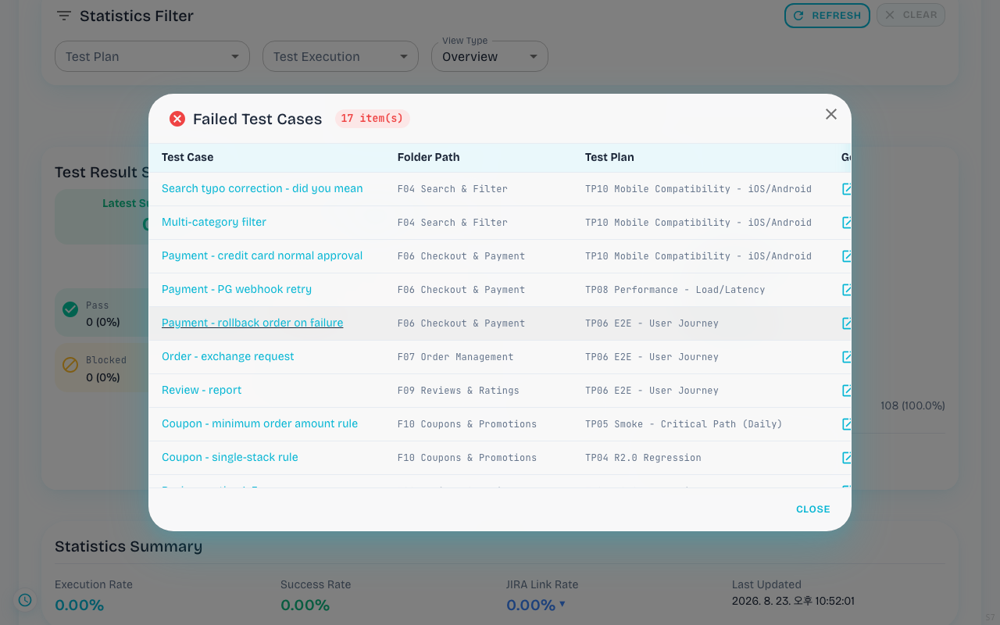

- The list has four columns: **Test Case · Folder Path · Test Plan · Go to**.
- **[Go to]** jumps straight to that case.
- Passed and Blocked entries have no `▼`. Clicking them does nothing, which is expected.

### 9-2. QA Summary

On the **Detail Table** tab of the Test Results screen, **selecting a single test execution filter** displays a **"QA Summary"** panel above the results table. This is a free-form space for recording your evaluation, observations, and follow-up actions after completing that execution.

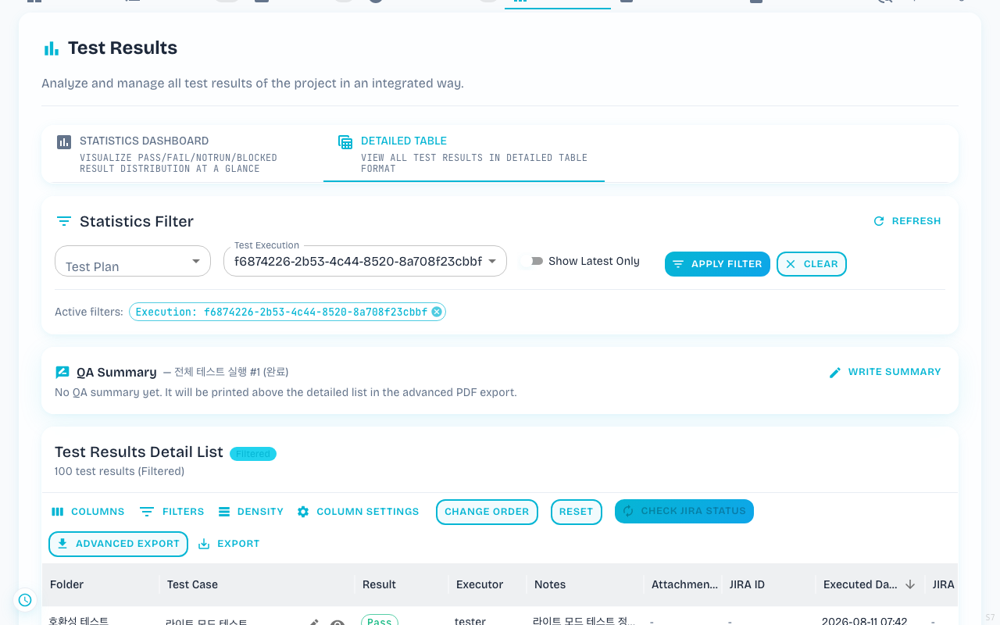

- Click the panel's **[WRITE SUMMARY]** button (or **[EDIT]** if a summary already exists) to open a **Markdown editor**. A **live preview** appears alongside as you type, so you can see the rendered result while writing. Up to 10,000 characters are allowed.
- The summary is saved **per test execution**. Switching the execution filter shows the summary written for each execution separately, and the panel header displays the **author and last-modified time**.
- In the **Advanced Export PDF**, the **"💬 QA Summary"** (including the author) is printed right after the statistics summary, just above the **"Detailed Test Result List"** heading. Markdown formatting is converted to plain text. Note that it is **not included in Excel or CSV exports.**

---

## 10. Automated Tests

Click the **[Automated Tests]** tab at the top (`/projects/{projectId}/automation`) to upload result files from automated test tools (JUnit, Playwright, Pytest, etc.) and view them consolidated in TestcaseCraft.

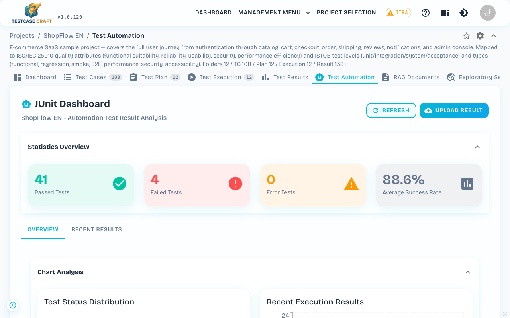

- **Upload result file** — JUnit XML file (up to 100 MB)
- Cases are automatically matched and statistics updated
- Click a result row in the list to enter the detail screen (`/projects/{projectId}/automation-results/{testResultId}`), where you can see pass/fail/skip status and error messages for individual tests
- Contact your operations team for details on which tool to use and how to generate result files

> To view result files separately in simple form, check the **[JUnit Results]** screen (`/projects/{projectId}/junit`).

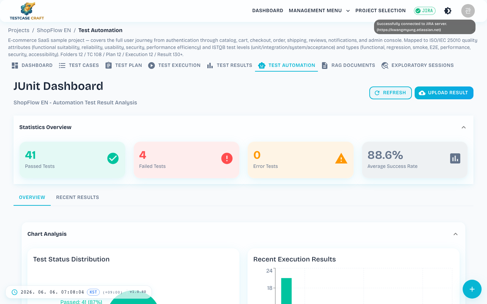

### 10-1. Result Detail Screen

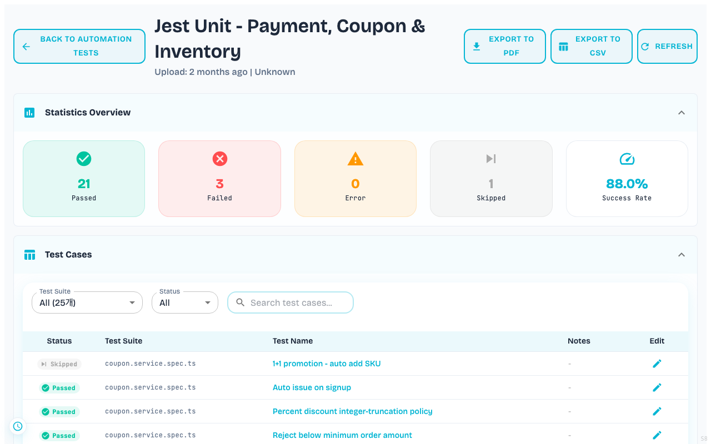

The header carries passed, failed, error, and skipped counts alongside the success rate, and the list below shows individual tests. Narrow the list by test suite and status or search by name; failed entries expand with their error messages. The pencil icon on each row records a note that stays with the result. Use **PDF / CSV export** and **Refresh** in the upper right.

Four addresses reach this same screen.

| Address | When it is used |
|---|---|
| `/projects/{projectId}/automation-results/{testResultId}` | Clicking a row in the Automated Tests list |
| `/projects/{projectId}/junit-results/{testResultId}` | Clicking a row on the JUnit Results screen |
| `/automation-tests/{testResultId}` | Short alias that omits the project |
| `/junit-results/{testResultId}` | The same alias |

#### Case Attachments (Screenshots)

Selecting an individual test opens three tabs on the right: **Tracelog**, **Test Body**, and **Attachments**. The Attachments tab lays out the files attached to that case in a grid, with images previewed inline. Click one to enlarge it or download it.

Agent-driven runs leave the screen state of failed cases here. When a verdict alone does not explain what happened, you can look at what the screen showed at that moment. If nothing is attached, the tab shows only "No attachments for this case."

| Item | Rule |
|---|---|
| Who can attach | Same permission as uploading automation results |
| Who can view | Anyone who can view the project can download |
| File types | Images (png, jpg, gif, webp), text (txt, log, json, html), pdf |
| Size per file | Up to 20MB |
| Count per case | Up to 30 |

Re-uploading the same filename reuses the existing attachment instead of stacking a new one. To replace the content, delete it and upload again.

---

## 11. RAG Documents & Chat

Click the **[RAG Documents]** tab at the top (`/projects/{projectId}/rag`) to manage your project knowledge base.

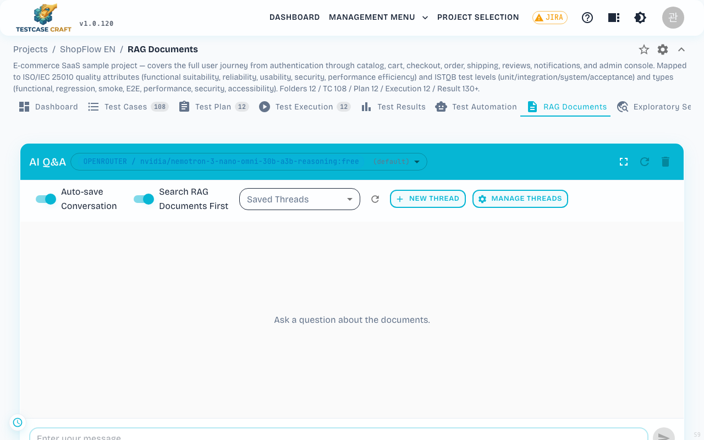

- Upload documents (PDF, MD, HTML, images, etc.) → embeddings are generated automatically
- During case authoring, related RAG documents are recommended automatically
- Use RAG chat for natural language queries → receive answers with source citations

> RAG is operated as an auxiliary service. Some operational environments may have it disabled, hiding this tab.

**If a notice appears at the top of the screen**, an administrator has paused the feature. This is not an outage. The notice lists which features still work and which are blocked.

| Notice | Meaning |
|---|---|
| Adding new material is stopped | Questions, search, and document browsing keep working. Only uploading and analyzing new documents is blocked |
| AI features are stopped | Everything is blocked, including questions |

In both cases, an administrator can restore everything from [System Settings](#17-6-2-system-settings--turning-ai-features-and-indexing-on-or-off).

---

## 12. Exploratory Sessions (SBTM)

Click the **[Exploratory Sessions]** tab at the top (`/projects/{projectId}/exploratory`) to manage exploratory test sessions based on **Session-Based Test Management**.

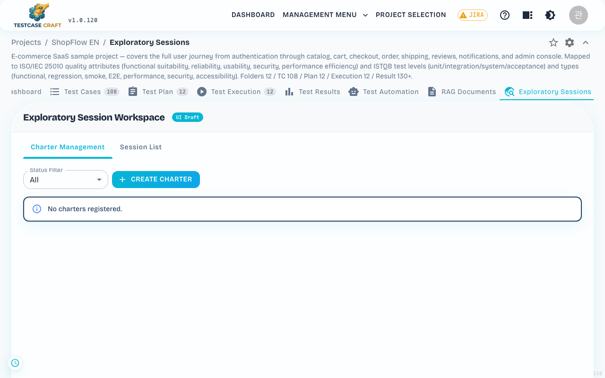

- **Charter** — define the exploration objective in one line
- Start session → timer runs (typically 60–120 minutes)
- Record findings, notes, bugs, and screenshots during the session
- On completion, session report is generated automatically with an approval workflow

> This tab appears only when the environment variable `SHOW_EXPLORATORY_SESSION_TAB=true`. See the operations documentation for setup instructions ([see Section 16-3](#16-3-installation--operations-documentation)).

---

## 13. User Profile & Settings

Click the **user avatar** in the upper right of the header, then click **[Profile]** to open the user profile dialog.
The dialog comprises seven tabs:

### 13-1. Basic Information

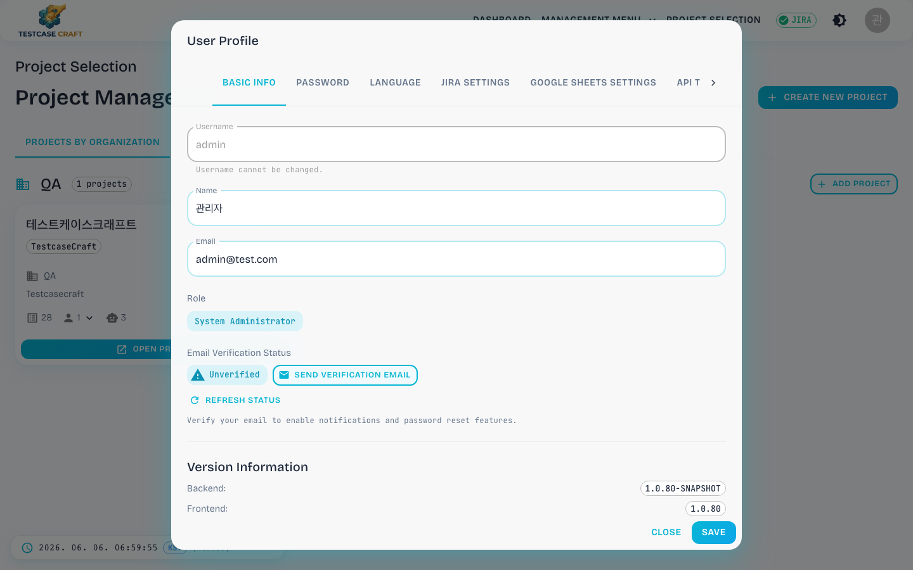

- Username / Full name / Email display (username cannot be changed)
- Role badge (Tester/PM/Admin, etc.)
- Email verification status — If **[Not Verified]**, click **[Send Verification Email]** to send verification mail. Click the link in the received email to see the verification result screen (`/verify-email`). After verification, click **[Refresh Status]** to update the badge.

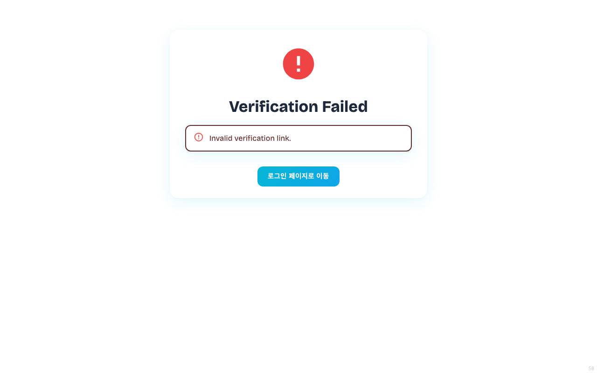

If the link carries no verification value or the value was already used, the screen reports failure as shown above. Return to your profile and click **[Send Verification Email]** again to receive a fresh message. On success, the same area shows a completion notice and a login button.
- Service version (server/client) displayed at the bottom

### 13-2. Password Change

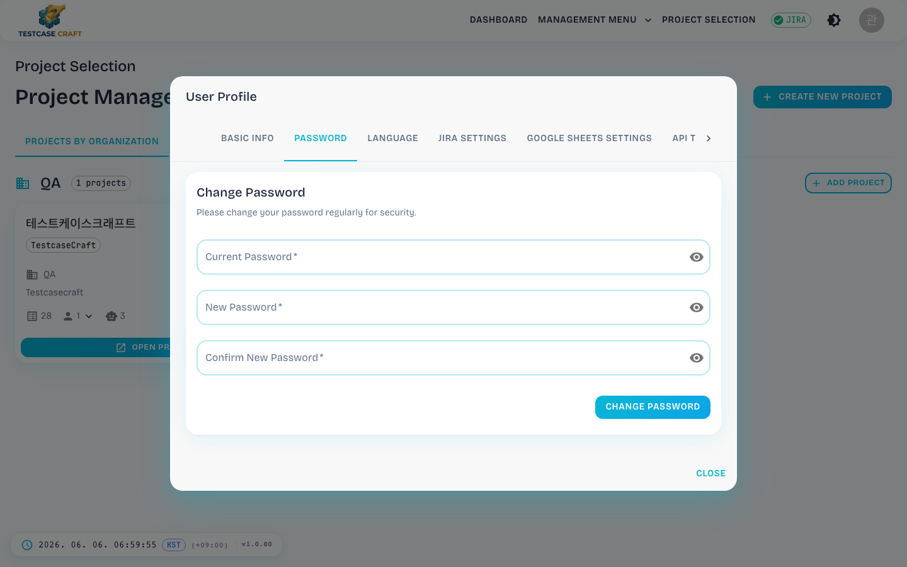

Confirm existing password, then enter and confirm new password → click **[Save]**.

### 13-3. Language & Time Zone Settings

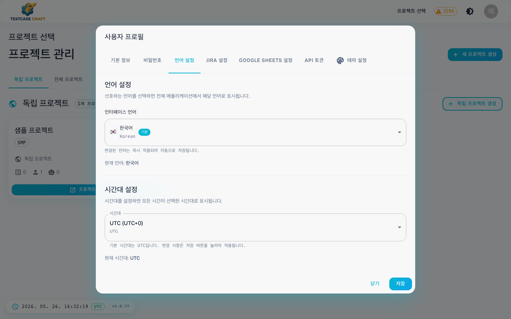

- **Interface Language** — Korean / English, etc. (takes effect immediately; auto-saved)
- **Time Zone** — Applied to all time displays (creation date, move log, test results, etc.)
  - Default is `UTC`; to change to your local time zone, click **[Save]**

### 13-4. JIRA Settings

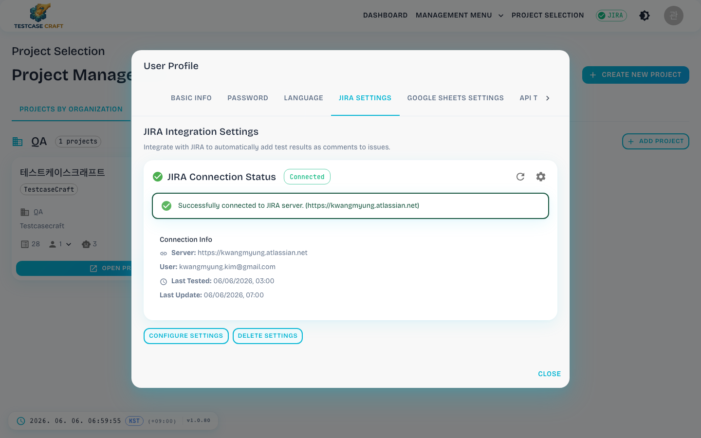

Register your JIRA server URL, email, and connection key for use with your account. Once saved, the warning badge **⚠ JIRA** in the header disappears.

### 13-5. Google Sheets Settings

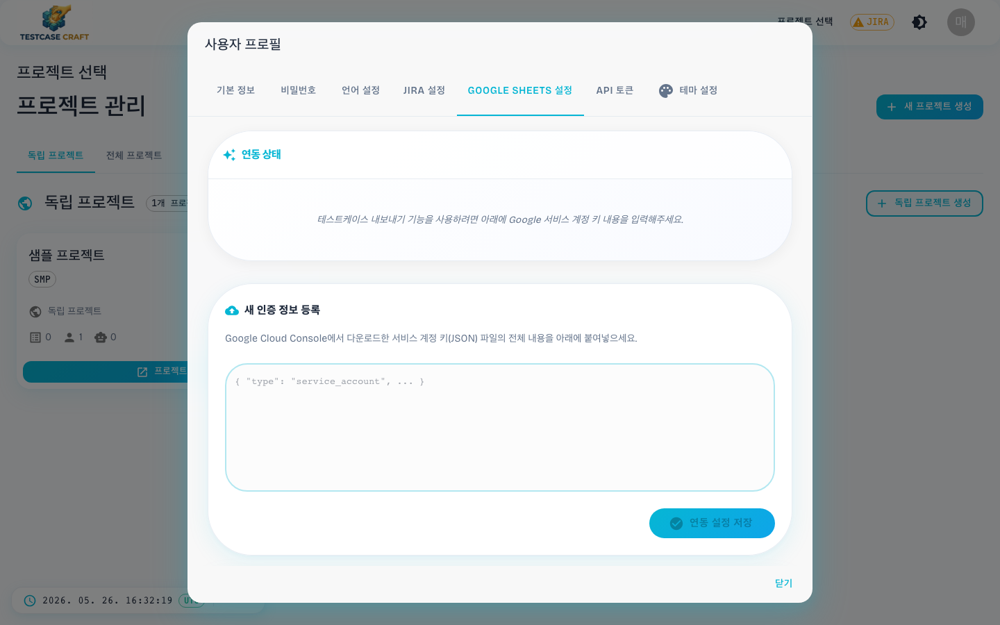

To import or export test cases to Google Sheets, you need to connect your Google account. Connect once following the on-screen instructions.

> 💡 For detailed connection steps with illustrations, see the in-app guide (`/guides/GOOGLE_SHEETS_SETUP_GUIDE.md`). Click the help link on the settings screen to open the same document. When typing the address directly, **include the `.md` extension** — the server rejects the request without it.

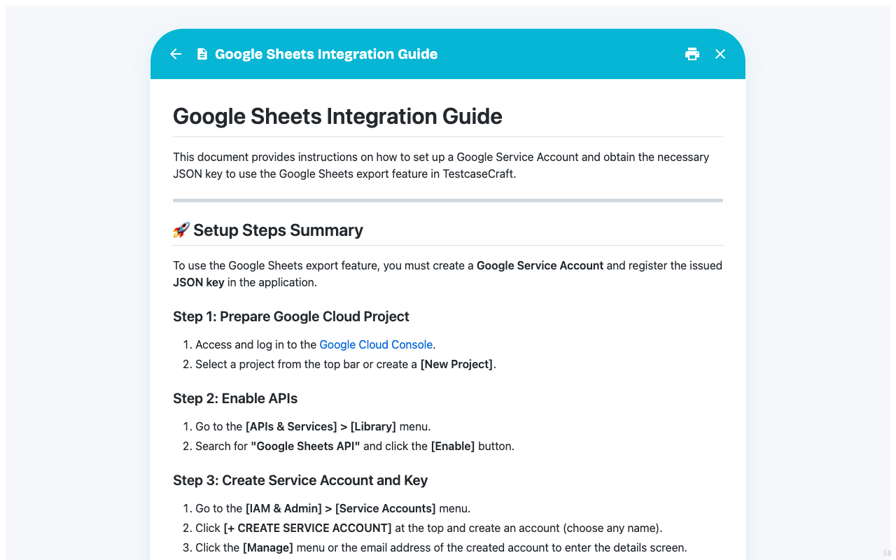

### 13-6. API Token

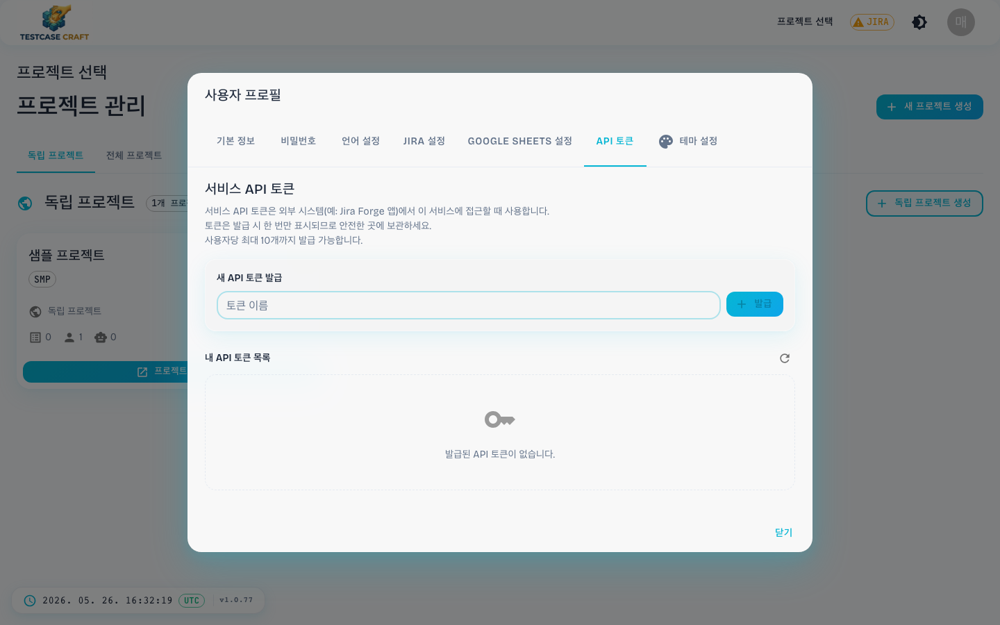

Generate a **connection key (token)** for use when connecting from other systems (e.g., JIRA plugins, automation scripts) to TestcaseCraft.

- Up to **10 tokens** can be issued per person
- **The full key displays only once immediately after issuance; copy it to a safe place.** You cannot view it again.
- Lost keys must be revoked and reissued

### 13-7. Theme Settings

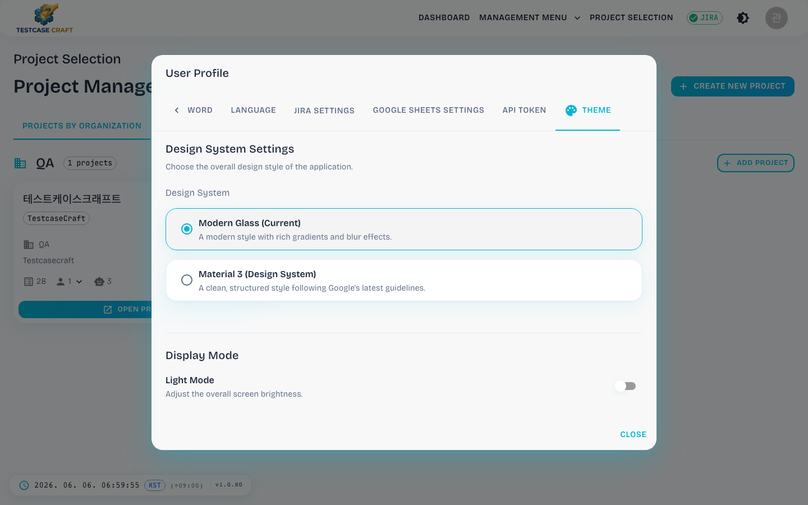

- **Screen Mode** — Choose Light or Dark mode (synchronized with the ◐ icon in the header)
- **Design System** — Choose from two design styles: Glass (glass texture) or Material 3. Changes apply to the entire screen immediately.
- **Menu Structure** (new) — Choose between two layout styles:
  - `Current Layout — Horizontal Tabs`: Top tab-based navigation structure (default)
  - `New Layout — Left-Side Menu`: Vertical menu on the left side, with a collapse icon to show only icons
  - Layout changes take effect immediately and are saved per user on the server, persisting across logins from different computers
  - In the new layout, test plans and test executions display in a 2-section format (list on left, details on right), and the breadcrumb's first item becomes the project selector

---

## 14. Header Tools — Dark Mode · Language · Project Selector

### 14-1. Dark Mode Toggle

Click the **◐** (half-moon) icon in the top-right corner of the header to instantly switch between light and dark mode.

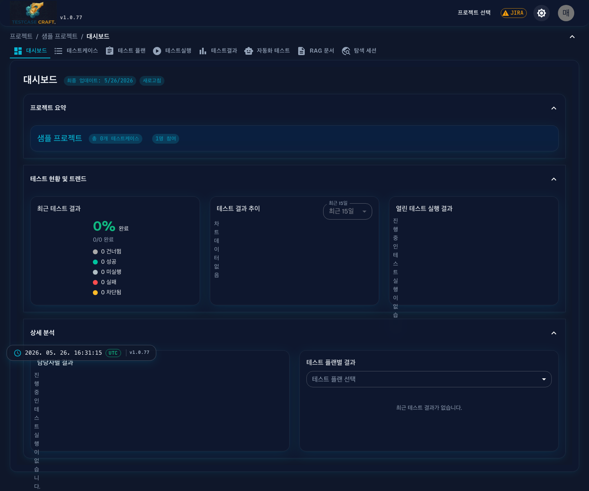

### 14-2. Language Selection

Screen language is changed in **Profile → Language Settings** (see Section 13-3). Changes take effect immediately across all screens and are saved automatically without requiring a save button.

### 14-3. Project Selector (Quick Switch)

Click **[Project Selector]** in the header to display a dropdown list of projects to which the current user belongs.

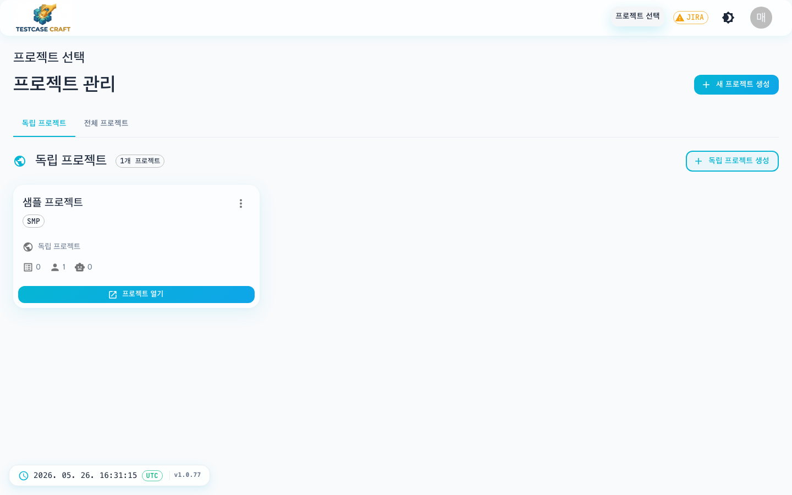

Switch to another project instantly — the current tab location (Dashboard / Test Cases, etc.) is maintained while only the project changes.

---

## 15. Logging Out

Click **[Logout]** from the user avatar menu in the top-right corner of the header to sign out and return to the login screen.

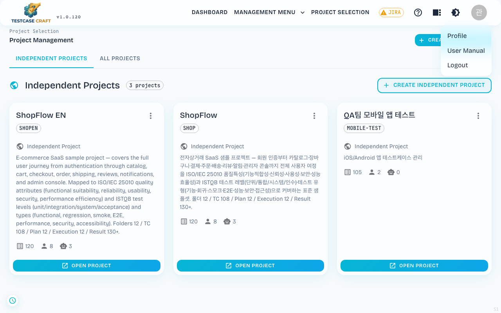

> If the system is not used for an extended period, you will be automatically logged out for security. The session duration depends on the operating environment settings (approximately 30 days for development environments, 90 days by default for production environments). Verify the exact value with your system administrator. After logout, simply log in again.

---

## 16. Appendix — JIRA Integration & FAQ

### 16-1. JIRA Integration

The **`⚠ JIRA`** badge in the header indicates that JIRA settings are not configured. Click it to open the JIRA integration settings screen.

- Enter JIRA server URL, user email, and API token
- Configure field mappings (priority, assignee, etc.)
- After saving, the warning badge disappears

### 16-2. Common Screen Issues

| Symptom | Solution |
|---------|----------|
| `⚠ JIRA` badge always appears | Normal behavior — always displayed if JIRA is not configured. Ignore if not in use |
| Plus button not visible in header | Check if your project permission is VIEWER (only PM/editors can add items) |
| Drag-and-drop not working | You may have read-only (VIEWER) permission, or drag-and-drop may be disabled on item selection screens (e.g., when choosing test cases to include in a test plan). Use the right-click context menu or order editing mode as alternatives |
| Test result changed after viewing the result input screen | This does not occur in v1.0.80 or later — improved to prevent saving when viewing only (see Section 8-2). Empty Not Run records created in earlier versions are automatically cleaned up when actual results are entered |
| "Advanced Spreadsheet" mode not visible in input mode selection | Normal behavior — this feature is currently hidden. Use the standard spreadsheet mode |
| Screen continuously loading | Likely a temporary network error — try refreshing. If it persists, contact your system administrator |
| A `🚨 Request Limit Exceeded` dialog appears | The same IP sent more than **60 requests per second**. The dialog clears when its countdown reaches zero, and **[Retry now]** retries immediately. It typically appears from rapid repeated refreshes or several tabs polling the same screen. On a shared corporate network the count is aggregated across users, so report it to your system administrator if it recurs |
| `Failed to fetch` during signup | Possible server-side environment variable issue — contact your system administrator. See details in [`docs/deployment/DOCKER_SETUP.md`](../../deployment/DOCKER_SETUP.md) section 10-2 |

### 16-3. Installation & Operations Documentation

Setup, Docker configuration, environment variables, backup, upgrade, troubleshooting, and other **administrator guides** are maintained in a separate document.

👉 **[`docs/deployment/DOCKER_SETUP.md`](../../deployment/DOCKER_SETUP.md)**

**Reading this manual inside the app** — Open it from the **?** icon in the header or at the address `/manual`. No login required.

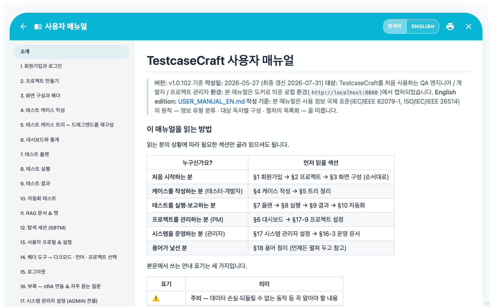

Pick a section from the table of contents on the left, and switch languages with **한국어 / ENGLISH** in the upper right. The printer icon prints or saves as PDF. You can also append the language to the address (`/manual?l=en`) and share that link.

### 16-4. Screen Address Reference

Every screen has its own address. Sharing the address opens the exact same screen for someone else, which helps when reporting defects or reviewing an acceptance build. Parts such as `{projectId}` are replaced with real values.

> 💡 A small **screen number** (`S0`–`S11`) appears at the bottom right of every screen. Hover it to see the screen name. The number matches the screen breakdown in the design documents, so saying "this happens on S6" points everyone at the same screen.

**Addresses that open without signing in**

| Address | Screen | No. |
|---|---|---|
| `/login` | Sign in & sign up | S0 |
| `/verify-email?token=...` | Email verification result | S0 |
| `/manual` | User manual (KO/EN) | S0 |
| `/guides/{documentName}` | In-app guide document, e.g. `/guides/GOOGLE_SHEETS_SETUP_GUIDE` | S0 |

**Addresses after signing in**

| Address | Screen | No. |
|---|---|---|
| `/projects` | Project list | S1 |
| `/projects/{projectId}` | Project dashboard | S3 |
| `/dashboard` | Organization-wide dashboard (admin only) | S3 |
| `/projects/{projectId}/testcases` | Test cases | S4 |
| `/projects/{projectId}/testcases/{testCaseId}` | Test case detail | S4 |
| `/projects/{projectId}/testplans` | Test plan list | S5 |
| `/projects/{projectId}/testplans/new` | Create a plan | S5 |
| `/projects/{projectId}/testplans/{testPlanId}` | Plan detail & edit | S5 |
| `/projects/{projectId}/executions` | Test execution list | S6 |
| `/projects/{projectId}/executions/new` | Create an execution | S6 |
| `/projects/{projectId}/executions/{executionId}` | Execution detail | S6 |
| `/projects/{projectId}/executions/{executionId}/testcases/{testCaseId}/result` | Result entry | S6 |
| `/projects/{projectId}/results` | Test results & statistics | S7 |
| `/projects/{projectId}/automation` | Automation tests | S8 |
| `/projects/{projectId}/junit` | JUnit result list | S8 |
| `/projects/{projectId}/automation-results/{testResultId}` | Automation result detail | S8 |
| `/projects/{projectId}/junit-results/{testResultId}` | JUnit result detail | S8 |
| `/projects/{projectId}/rag` | RAG documents | S9 |
| `/projects/{projectId}/exploratory` | Exploratory sessions | S10 |
| `/projects/{projectId}/bookmarks` | My bookmarks | S2 |
| `/projects/{projectId}/settings` | Project settings (General / Members / Agent) | S1 |

**Short addresses and pass-through**

Shorter forms that omit the project also open. Use them when sharing a result screen.

| Address | Screen | No. |
|---|---|---|
| `/executions/{executionId}` | Execution detail | S6 |
| `/junit-results/{testResultId}` | JUnit result detail | S8 |
| `/automation-tests/{testResultId}` | Automation result detail | S8 |
| `/jira-redirect/{issueKey}` | Jumps to the test case linked to a JIRA issue. A pass-through address, not a screen | — |

**Administrator addresses** (ADMIN only, see [§17](#17-system-administrator-settings-admin-only))

| Address | Screen | No. |
|---|---|---|
| `/organizations` · `/organizations/{id}` | Organization management & detail | S11 |
| `/users` | User management | S11 |
| `/mail-settings` | Mail settings | S11 |
| `/llm-config` | LLM settings | S11 |
| `/scheduler` | Scheduler management | S11 |
| `/translation-management` | Translation management (not in the menu — open by address) | S11 |

---

## 17. System Administrator Settings (ADMIN Only)

> ⚠️ This section and its menus are only visible to users with `role=ADMIN`. The default admin account uses the initial credentials `admin / admin123`. **Change these credentials immediately after deployment to production.**

### 17-1. Accessing the Admin Menu

When logged in with an admin account, **[Dashboard] / [Admin Menu ▾] / [Project Selector]** are displayed in the header.

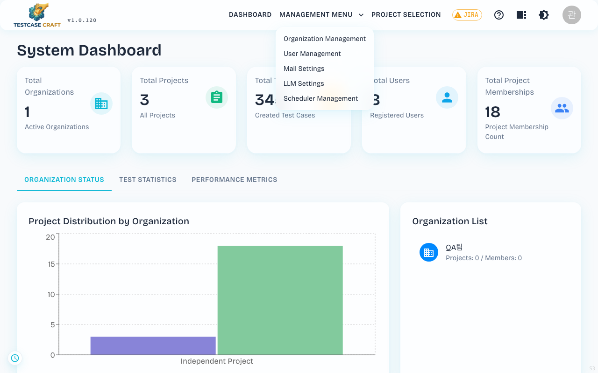

Dropdown items:
- **Organization Management** (`/organizations`)
- **User Management** (`/users`)
- **Mail Settings** (`/mail-settings`)
- **LLM Settings** (`/llm-config`)
- **Scheduler Management** (`/scheduler`)

### 17-2. Global Dashboard

**[Dashboard]** in the header provides an operations statistics view spanning all organizations and projects.

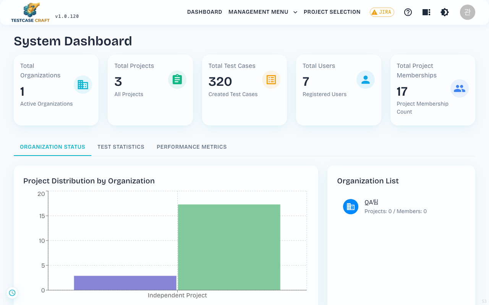

The screen is titled **System Dashboard**, with cards across the top for total organizations, total projects, total test cases, total users, and total project memberships. Three tabs sit below them.

| Tab | Contents |
|---|---|
| Organization Status | Composition and headcount per organization and project |
| Test Statistics | Result distribution across all projects |
| Performance Metrics | Server resources and cache state |

The **Performance Metrics** tab reports operational state as numbers.

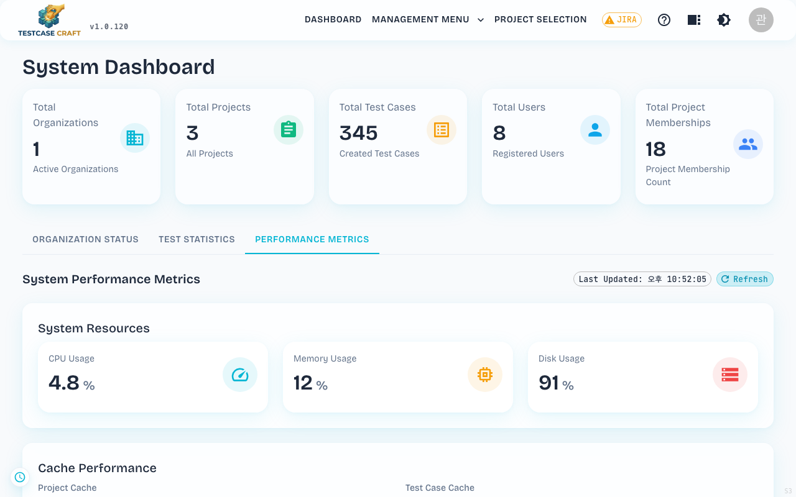

- **System resources**: CPU, memory, and disk utilization
- **Cache performance**: hit rate for the project cache and the test case cache, with hit and miss counts. A low hit rate means the same lookups are going all the way to the database each time
- **[Refresh]** re-reads the values for that moment. Nothing updates automatically, and the **Last updated** timestamp beside it tells you when the shown values were read

### 17-2-1. Checking server time and version

Signed in as ADMIN, a **clock icon** is pinned to the **bottom-left** of the screen. It starts collapsed; click it and the server time and app version expand on one line.

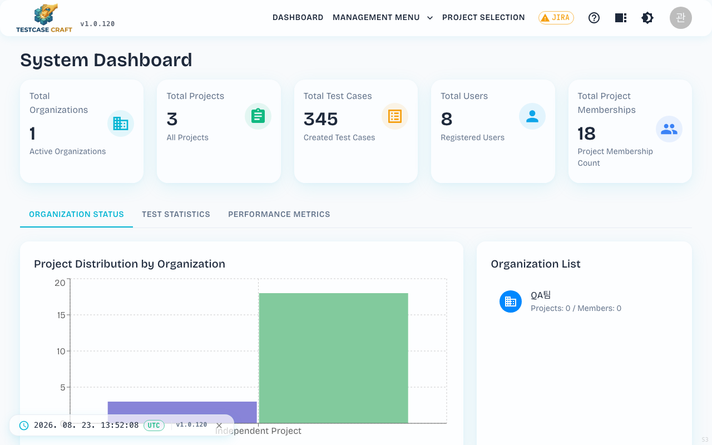

- The time is **converted to your profile time zone**, and the badge next to it names that zone (`UTC`, `KST`, and so on). With no time zone set, it displays UTC. When a recorded result timestamp looks wrong, check this badge first. Change the setting in [§13-3](#13-3-language--time-zone-settings).
- The app version appears alongside, so quote that value when you file a question.
- While expanded it re-reads **every 30 seconds**. Closing it with ✕ stops the polling.
- **Non-ADMIN accounts do not see the icon.**

### 17-3. Organization Management

`/organizations` — Groups projects by Organization.

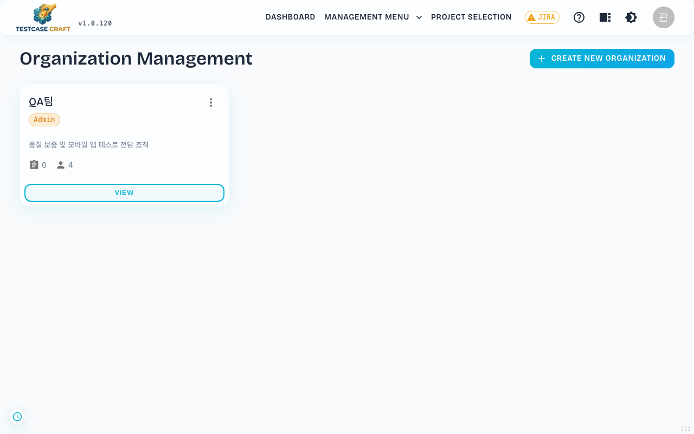

- Create / edit organizations or invite members
- Manage permissions matrix for groups within organizations
- Click to enter organization details (`/organizations/{id}`)

### 17-4. User Management

`/users` — View and manage all system users.

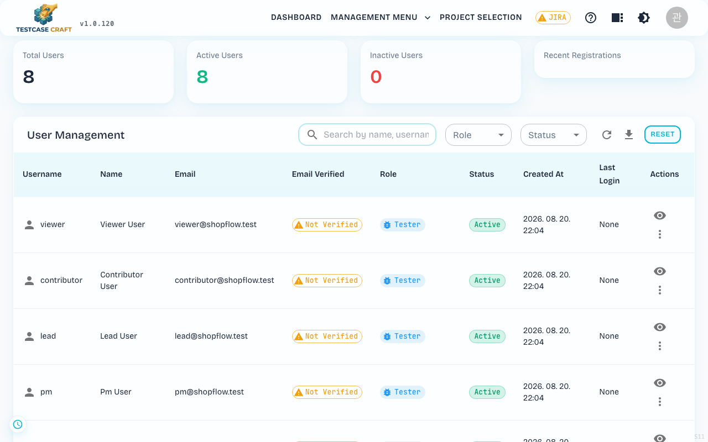

- Statistics cards: total / active / inactive / recently joined
- Search by name, username, or email
- Filter by role (ADMIN / PM / Tester / General User) or status (active / inactive)
- Row actions: **👁 View Details · ⋮ Reset Password / Change Role / Toggle Active Status**
- Email verification status badge (unverified / verified)
- Top-right buttons: **🔄 Refresh / ⬇ Download / Reset**

### 17-5. Mail Settings

`/mail-settings` — Configure SMTP, sender, and email templates.

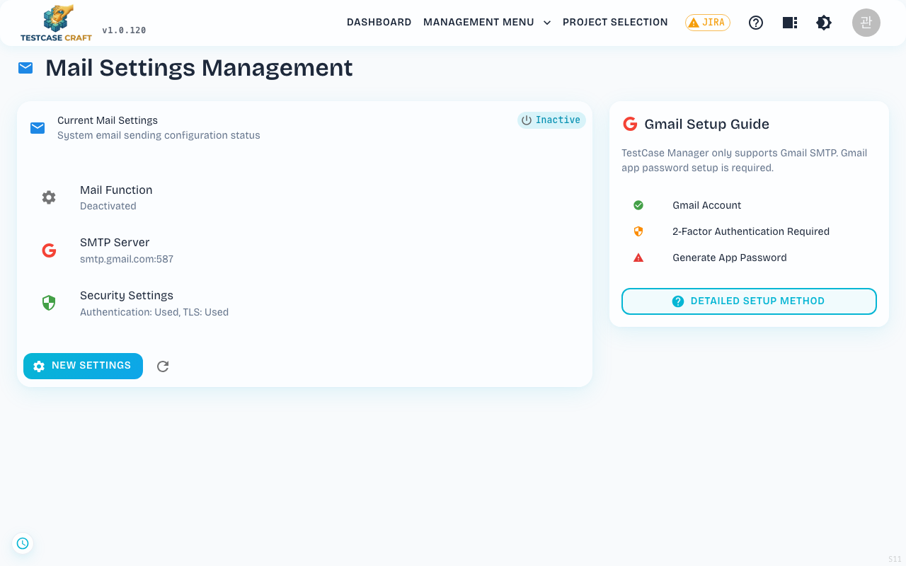

- SMTP host, port, and credentials
- Sender email address and display name
- System email templates for authentication, password reset, and execution result notifications
- **Send Test Email** to validate settings

### 17-6. LLM Settings

`/llm-config` gathers the settings used by the AI features. Its tabs are LLM Configurations, Default Template, RAG Shared Documents, and System Settings.

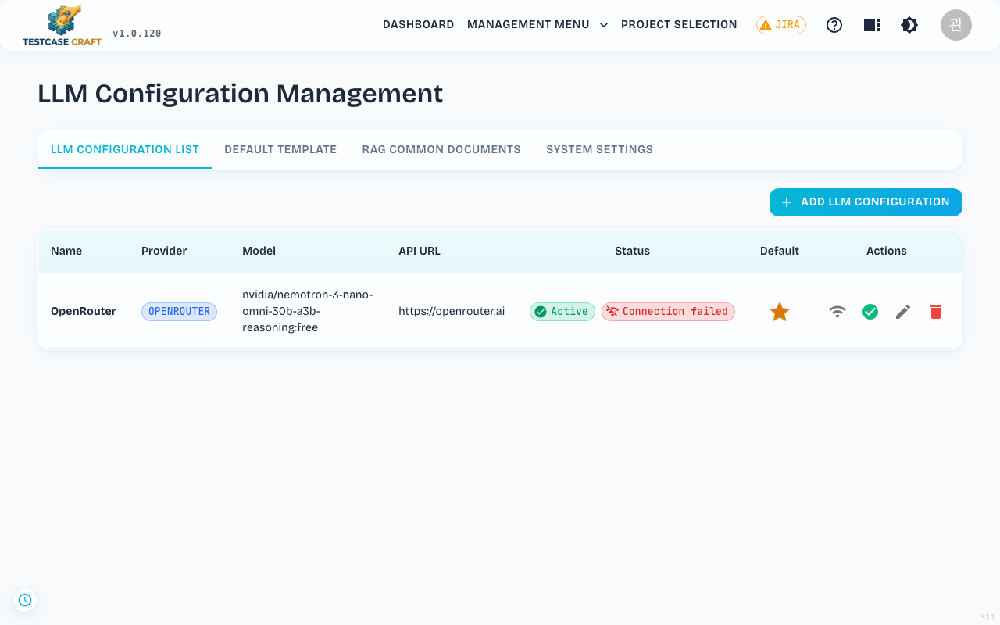

| Tab | Purpose |
|---|---|
| LLM Configurations | Register which AI service to use and verify the connection |
| Default Template | Set the default format given to the AI when authoring cases |
| RAG Shared Documents | Manage documents visible to every project (17-6-1) |
| System Settings | Turn AI features and indexing on or off (17-6-2) |

Items registered on the **LLM Configurations** tab:

- Provider: OpenAI / OpenRouter / NVIDIA / Perplexity / Ollama / OpenWebUI (Ollama and OpenWebUI run models on your own server)
- Model name, API key, base URL
- Analysis model (optional): leave blank to use the model above
- After registering, use **[Test Connection]** to confirm the values

> **Why a separate analysis model** — Before writing an answer, the AI reads the question intent and organises the query results. That work answers in a fixed format, so a cheap and fast model handles it well. Assigning a good model for answers and a cheap one for this preparation makes responses faster. Leave it blank to use the answer model.

> **If the connection test reports "No encryption key is configured"** — API keys are encrypted before being stored, and the server has no such key. Expanding the guidance on screen reveals the command and the setting name, both copyable. A server administrator has to set the value and restart.

#### 17-6-1. RAG Shared Documents

Documents that do not need to be uploaded per project go on this tab. They are searched alongside every project's questions.

- Upload and delete shared documents
- Promote a document uploaded to a project into the shared set
- Approve or reject shared-registration requests submitted by users

#### 17-6-2. System Settings — Turning AI features and indexing on or off

There are two toggles, "RAG Feature Status" and "Vector Indexing", and they stop different things.

| Toggle | When turned off |
|---|---|
| **RAG Feature Status** | Questions, search, and document browsing **all** stop |
| **Vector Indexing** | Only new registration stops; **questions over material already registered keep working** |

What remains available in each state:

| State | Questions | Document search | List and download | Upload and analysis | Case indexing |
|---|---|---|---|---|---|
| Both on | Yes | Yes | Yes | Yes | Yes |
| Indexing off | Yes | Yes | Yes | No | No |
| AI features off | No | No | No | No | No |

Turning off indexing alone is for **capping cost or pausing material updates while still answering questions**.

Opening the RAG screen while either is off lists the features that still work and the ones that are blocked, so a failed request can be told apart from an outage.

**Two things to note.**

- **Cases added or changed while indexing is off will not appear in search results.** Turning it back on does not catch up on those changes, so documents have to be analyzed again if needed.
- **Turning off the AI features also stops the related scheduled jobs.** After turning it back on, enable them on the [Scheduler Management](#17-7-scheduler-management) screen.

### 17-7. Scheduler Management

`/scheduler` — Enable / disable periodic background jobs and modify their schedules.

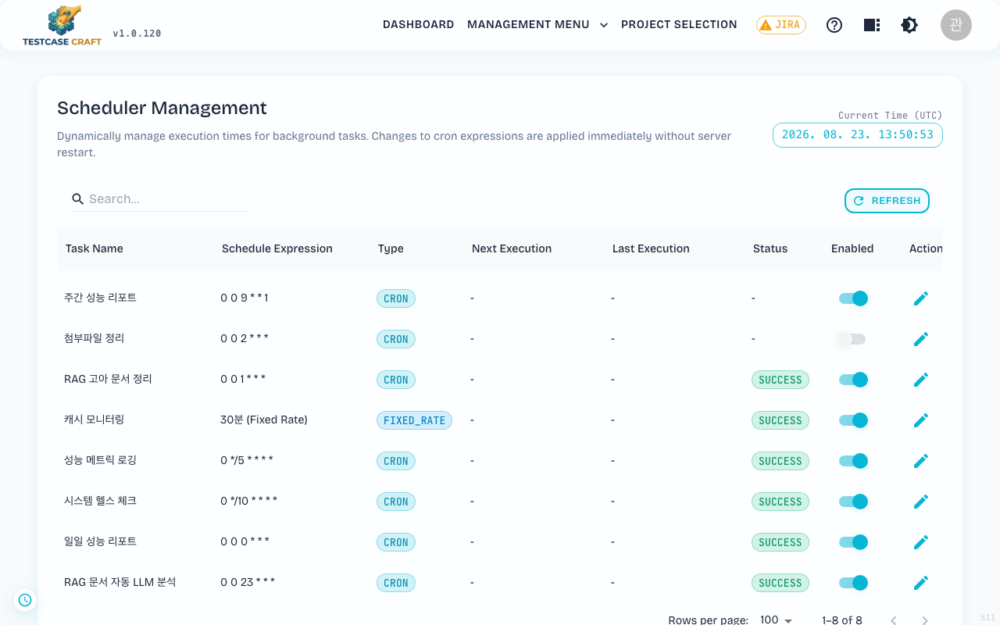

- List of registered jobs (e.g., JIRA sync, RAG index rebuild, expired token cleanup)
- Each job displays its Cron expression, last execution time, and result
- **Manual Run** button, pause / resume

### 17-8. Translation Management (i18n)

`/translation-management` — Dynamically edit UI multi-language keys and translations (not exposed in the header menu by default — access via direct URL).

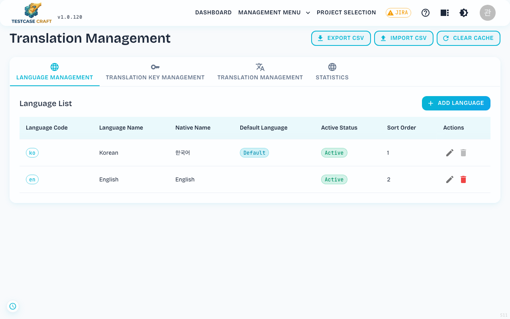

- Edit translation keys and values by language
- Statistics on missing keys
- Group by category
- Add additional languages

> This screen is hidden from general users due to the large number of i18n keys. Use it only when introducing additional languages beyond Korean and English or modifying labels.

### 17-9. Project-Level Settings (PM)

Access via the **⋮ (three-dot)** menu in the project card top-right or through the header menu after entering the project. (Requires `PROJECT_MANAGER` permission)

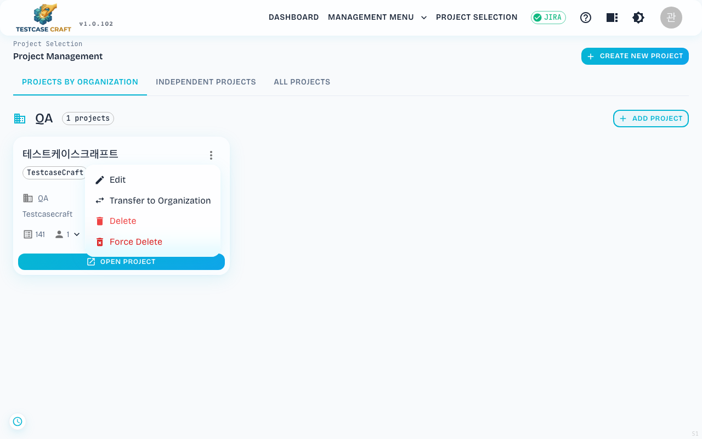

The menu offers **Edit · Transfer organization · Delete**. Clicking **[Edit]** opens the project information form.

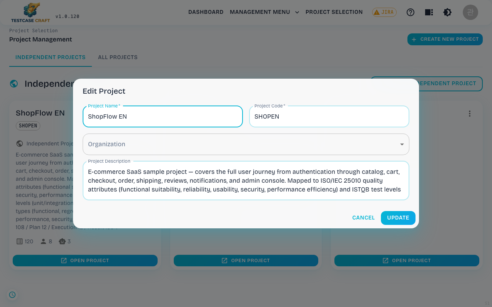

Change the name, code, owning organization, and description. The code is the value used in case display IDs (the `SHOP` in `SHOP-031`), so changing it changes how cases are labeled from then on.

- Change project name / code / description
- Invite members / assign roles (PM / LEAD_DEVELOPER / DEVELOPER / TESTER / CONTRIBUTOR / VIEWER — 6 levels; see Section 18-4)
- Configure system default folders / priority conventions / tag conventions
- Delete project (all test cases and results are permanently deleted — this cannot be undone)

> When a new project is created, the creator automatically becomes **PROJECT_MANAGER**. Users with VIEWER or TESTER permissions will not see this menu or only certain options are enabled.

### 17-10. Agent Connection (PM)

The **Agent** tab in `/projects/{projectId}/settings` connects an external QA agent. The agent reads test cases written in plain language and drives a real browser to run them. It is a separate app that lives outside this product; only its verdicts and evidence come back as a test execution.

The tab stays hidden in two cases: `AGENT_INTEGRATION_ENABLED` is off on the server, or you are not a project manager.

| Field | What it is for |
|---|---|
| Agent name | This name appears on the button in the Automation Tests screen. |
| Agent URL | The address of the agent app. It must start with `http` or `https`. This is what the server uses to verify the connection. |
| Browser URL (optional) | Leave it blank to reuse the address above. Fill it only when the server and the browser reach the agent at different addresses. The run button opens this one. |
| Auth token | The token the agent app expects. Leave it blank to keep the current one; a saved token is never shown again. |
| Default profile | The profile identifier registered in the agent app. Allowed domains, forbidden actions, and test accounts live there. |
| Use in this project | While this is off, nothing agent-related appears in the Automation Tests screen. It ships off. |

**[Test connection]** calls only the agent's health address and reads two values from the response, its status and version. Save first to enable the button.

Once the connection is on and verified, a `Run with {name}` button appears in the **Automation Tests** header. The button only opens the agent app in a new tab; it has nothing to do with how results travel back into the product. So even when the button does not work, you can still start a run from the agent app itself.

**Worth knowing.** Each case takes 30 to 60 seconds and costs money. Re-running the same case gives slightly different behavior, so pair it with JUnit automation whenever a regression needs to be reproducible. Verdicts are drafts; a person confirms them. Executions created by the agent carry an `[AI]` prefix in their name and an `ai-agent` tag, which separates them from runs a person performed. File upload and captcha scenarios are not supported.

---

## 18. Glossary

Frequently used terms in the manual are compiled here for reference when first using the system.

### 18-1. Core Domain Terms

| Term | Definition |
|------|-----------|
| **Test Case** | A bundle of steps, conditions, and expected results to verify a scenario. Example: "Normal login", "Account locked after 5 password failures" |
| **Folder** | A container for organizing test cases. Folders can contain test cases or other folders |
| **Test Case Tree** | The left panel of the screen that displays folders and test cases in a hierarchical view |
| **Test Plan** | A bundle of test cases grouped for execution in a single testing activity, including schedule and assignee information |
| **Test Execution / Run** | An operational instance of running a test plan. Results are recorded for each test case |
| **Test Result** | A collection of completed test execution results, visualized as statistics and trends |
| **Automated Test** | A feature that uploads result files from automation tools (JUnit, Playwright, Pytest, etc.) to TestcaseCraft for unified tracking |
| **Exploratory Session (SBTM)** | Session-Based Test Management. A method where exploratory testing is conducted in 60–120 minute sessions with findings, notes, and evidence documented |
| **RAG (Search Assistance)** | A supplementary feature that indexes documents and answers natural language queries with source citations |

### 18-2. Test Case Editing Screen Terms

| Term | Definition |
|------|-----------|
| **Spreadsheet Mode** | A screen for entering multiple test cases in table format at once, with user experience similar to Excel |
| **Form (Individual Form) Mode** | A screen for detailed item-by-item entry of a single test case |
| **Advanced Spreadsheet** | An enhanced table input screen for users accustomed to copying and pasting cells from external Excel. Currently hidden |
| **Precondition** | The state that must exist before executing a test case (example: "User A must be registered") |
| **Step** | A unit of action within a test case. Each step documents an action and its expected result |
| **Expected Result / Actual Result** | The anticipated outcome ("how this should behave") for a step or entire test case, and the actual outcome ("how it actually behaved") that was recorded |
| **Display ID** | An identifier in the format `ProjectCode-Number`. Example: `SMP-001`. Used in URLs and notifications |
| **Tag** | A freely assigned label to a test case (example: `smoke`, `regression`). Used in search, filtering, and automation |
| **Import / Export** | A feature to move bundles of test cases as files. Import supports CSV, Excel, and Google Sheets; export supports CSV, Excel, JSON, and Google Sheets. (Test **result report** export supports Excel, PDF, CSV — see Section 9) |

### 18-3. Test Execution Result Status

| Status | Meaning |
|--------|---------|
| **Pass** | Expected result matches actual result |
| **Fail** | Actual behavior differs from expected — possible defect |
| **Not Run** | Test has not yet been executed |
| **Skipped** | Intentionally not executed (example: environment mismatch). Primarily appears in automated (JUnit) results; manual result input buttons are limited to 4 options: P/F/B/N (see Section 8-1) |
| **Blocked** | Execution is not possible due to unmet preconditions or environment issues |

### 18-4. Permissions and Roles

| Role | Capabilities |
|------|--------------|
| **VIEWER** | View only. No add, edit, or drag-and-drop capabilities |
| **TESTER** | View + record test case execution results, conduct exploratory sessions |
| **CONTRIBUTOR** | Add / edit test cases and folders, drag-and-drop reordering |
| **DEVELOPER** | Add / edit test cases and folders, drag-and-drop reordering (same edit permissions as CONTRIBUTOR) |
| **LEAD_DEVELOPER** | All of the above + add members, assign roles, remove members |
| **PROJECT_MANAGER (PM)** | All of the above + change project settings (name, description, display order) |
| **ADMIN** | System-wide — organization / user / mail / LLM / scheduler settings (see Section 17). Can also change member roles and settings on every project |

**Where roles are assigned**

The gear icon at the top right of a project screen opens **Project Settings** (`/projects/{projectId}/settings`), which has three tabs.

| Tab | What it does | Who can use it |
|---|---|---|
| General | Change project name, description, and display order (the code cannot be changed after creation) | PROJECT_MANAGER, ADMIN |
| Members | Add a member by searching for the user, change a role from the dropdown, remove a member | PROJECT_MANAGER, LEAD_DEVELOPER, ADMIN |
| Agent | Connect an external QA agent (see Section 17-10). Hidden while the server-side switch is off | PROJECT_MANAGER, ADMIN |

Type two or more characters in the user search box to find people whose username, name, or email matches. Users who already belong to the project and inactive accounts never appear, so a pick never fails as a duplicate. The organization member invite dialog uses the same search.

The gear icon appears only for those three. Role changes from the dropdown apply immediately — there is no save button. Demoting or removing the last remaining PROJECT_MANAGER is blocked. Granting or revoking PROJECT_MANAGER is limited to a current PM and system ADMIN.

Test plan creation and management are available to all project members.

A single user can be PM on Project A and VIEWER on Project B — permissions are **per-project**.

### 18-5. Screen Operation and Tool Terms

| Term | Definition |
|------|-----------|
| **Drag-and-Drop (DnD)** | The action of clicking and dragging an item to another location with the mouse. Used in the tree to reorder folders and test cases |
| **Drag Handle** | The six-dot icon (⋮⋮) on the left side of each row. This must be clicked to initiate a drag operation |
| **Multi-Select** | Selecting multiple items simultaneously using `Cmd-click` (Mac) / `Ctrl-click` (Windows) or checkboxes. When dragging in multi-select state, all items move together |
| **Context Menu** | A menu that appears when **right-clicking** an item (add / rename / delete / version history, etc.) |
| **Order Edit Mode** | The ↕ icon in the tree header. After entering this mode, use the ↑/↓ buttons on each row to change order one position at a time, then save |
| **Move History (Audit Log)** | All successful drag-and-drop moves are automatically recorded in the system, allowing administrators to track who moved what, when, and where |
| **Folder Case List** | A table-format list displayed on the right when a folder is selected in the tree. Shows subfolders and cases with Name, Description, Expected Result, and Priority columns |
| **Virtual Nodes** | Two fixed rows at the top of the tree — "All Test Cases" and "Unfiled Test Cases". Click to display the corresponding case list; managed automatically by the system |
| **Folder Filter** | A search box below the tree header. Filters the tree by folder name; clear with the X button |
| **Path Display (Breadcrumb)** | A navigation element showing the current location as a hierarchy, e.g. `Parent Folder › Subfolder › Case Name`. Click an ancestor item to jump to it |
| **Dark Mode / Light Mode** | Overall screen color tone. Switch instantly using the ◐ (half-moon) icon in the header |
| **Multi-Language (i18n)** | Screen language selection (Korean, English, etc.). Change in Profile → Language Settings |

### 18-6. External Integrations and Tools

| Term | Definition |
|------|-----------|
| **JIRA** | An issue tracking tool. TestcaseCraft connects test cases with JIRA issues and synchronizes their status bidirectionally |
| **JIRA API Token** | A connection key issued by JIRA. Used for secure authentication instead of a password |
| **Google Sheets** | Google Spreadsheets. Used to import and export test cases |
| **JUnit** | A standard XML format for Java automated test results. Compatible with other tools (Playwright, Pytest, etc.) |
| **API Token (Connection Key)** | A secret string used by external systems (automation scripts, JIRA plugins, etc.) to authenticate themselves to TestcaseCraft. Visible only once immediately after issuance; if lost, it must be revoked and reissued |
| **LLM** | Large Language Model — AI for natural language generation and summarization. Used for auto-generating test case names/descriptions and providing RAG chat answers |
| **MCP** | Model Context Protocol — a standard communication protocol that enables AI clients (such as Claude and Cline) to interact with TestcaseCraft through natural language commands |

### 18-7. Time and Identifiers

| Term | Definition |
|------|-----------|
| **UTC** | Coordinated Universal Time. The default time zone setting |
| **KST** | Korea Standard Time (UTC+9). Selectable in Profile → Language / Time Zone Settings |
| **Time Zone** | A user setting applied to all time displays (creation, modification, execution, move records, etc.) |
| **Sequential ID** | An auto-generated sequential number on a test case (example: 1, 2, 3, …). Meaningful only within a project |
| **Display ID** | An identifier in the format `ProjectCode-SequentialID`, human-readable (example: `SMP-001`) |

### 18-8. Frequently Seen Screen Guidance

| Expression | Meaning |
|-----------|---------|
| **⚠ JIRA** (yellow badge) | Notification that JIRA settings are not configured. Click to configure using the procedure in Section 13-4 or Section 16-1, or ignore if not in use |
| **Email Unverified** | Email verification has not been completed after signup. Some notifications and password reset features may have restrictions |
| **"Failed to fetch"** | The screen cannot communicate with the server. If it persists after refreshing, contact your system administrator |
| **System Default Folder** | A protected folder automatically created when a project is created. Cannot be moved or deleted |

---

## Revision History

| Date | Description |
|------|-------------|
| 2026-05-27 | Initial version created. Based on v1.0.77. Includes tree drag-and-drop functionality |
| 2026-05-27 | Added test plans / executions / results / automation / RAG / exploratory sessions sections, plus 7 user profile tabs, and header tools (dark mode / language / project selector) sections |
| 2026-05-27 | Added Section 17 System Administrator Settings (admin menu / global dashboard / organizations / users / mail / LLM / scheduler / translation / project-level settings) |
| 2026-05-27 | Separated Docker installation and operations guide to `docs/deployment/DOCKER_SETUP.md`. Refined technical terminology in the user manual (backend / endpoint / token, etc.) to more familiar expressions |
| 2026-05-27 | Added Section 18 Glossary (8 categories: domain / case editing screen / execution result status / permissions / screen operation / external integration / time and identifiers / frequently seen screen guidance) |
| 2026-05-29 | Enhanced route URLs with backticks in Sections 3 and 6–12 (`/dashboard`, `/projects/{projectId}/...`). Updated Section 4 form header (removed H6 title, 2-column grid, single action row); added Section 4-2 input mode toggle button group + spreadsheet cell auto word-wrap for 30+ Korean characters; added Section 4-5 field visibility toggle (9 metadata fields, permanent per-user storage) and Section 4-6 metadata area (full UUID display). Reflected display ID chip and name tooltip on truncation in Section 5 |
| 2026-06-06 | Comprehensive review and enhancement based on v1.0.80. Added "How to Read This Manual" to preamble (reader-specific guidance, notation rules per IEC/IEEE 82079-1). Updated Section 2-1 description field; Section 4 single-column full-width form layout (v1.0.80) and editor auto-height (v1.0.79); reflected hidden Advanced Spreadsheet in Section 4-2; added right-click context menu table and 2 tree screenshots in Section 4-4; added field visibility screenshot in Section 4-5; added 4-tab form mode with header composition and screenshot in Section 4-6; added drag handle screenshot in Section 5-1; introduced new result input screen (P/F/B/N) in Section 8-1 and auto-save safeguards (v1.0.80) in Section 8-2; corrected export formats in Section 9 (Excel / PDF / CSV); clarified detail screen path in Section 10; added guide document link in Section 13-5; added design system option in Section 13-7; corrected language change path in Section 14-2; updated troubleshooting rows in Section 16-2; corrected 6-role structure (CONTRIBUTOR) in Sections 17-9 and 18-4; refined glossary entries in Section 18. Added 4 new screenshots (23, 24, 44b, 44c) |
| 2026-08-22 | Expanded 17-6 LLM Settings into its four tabs and added 17-6-1 RAG Shared Documents and 17-6-2 System Settings (turning AI features and indexing on or off). Added guidance in Section 11 on what works while the feature is paused. Covered the encryption key notice in the connection test. Based on v1.0.117 |
| 2026-06-06 | English edition created from the Korean v1.0.80 manual |
| 2026-06-06 | Reflected feat/style-folder-tree branch: Section 3-1 tab badges added, Section 4-1 screen layout table updated (folders-only tree display, folder filter added) plus new "Folder Case List" and "Edit Folder Info" subsections, Section 4-4 added three subsections (Tree View Modes, Virtual Nodes, Folder Filter), Section 5-1 drag handle hover visibility added. 4 new screenshots (87–90, ShopFlow EN). Synchronized same sections in Korean edition. |
| 2026-06-09 | Reflected favorites/bookmarks feature: added ☆ Bookmarks button row in Section 3-1 header, new "Bookmarks & Favorites" subsection in Section 4-7 (case star toggle, collection management, personal notes, read-only). Section 8 test execution list: added 20-second auto-refresh, pause while tab inactive, [Refresh] button, and filter panel note. Section 8 screenshots refreshed: `52_executions` (real data, 12 executions) and new `52b_execution_filter_panel` (filter panel expanded), captured from ShopFlow EN with English UI. Synchronized same sections in Korean edition. |
| 2026-06-10 | Added Bookmarks screen screenshot in Section 4-7 (`90_bookmarks`). Added "Previous Execution Results dialog — note view format toggle" feature in Section 8-1 (MARKDOWN/TEXT toggle, TEXT shows raw note as-is, selection persisted in browser) with screenshot `91_prev_results_dialog`. Synchronized same sections and screenshots (images_en) in Korean edition. |
| 2026-06-10 | Added new "QA Summary" subsection (Section 9-1) — panel shown above the Detail Table when an execution filter is selected, Markdown editor with live preview, saved per execution with author/last-modified time, printed above the "Detailed Test Result List" in Advanced Export PDF (not in Excel/CSV, up to 10,000 characters) with screenshot `92_qa_summary_panel`. Synchronized same section and screenshot (images_en) in Korean edition. |
| 2026-07-02 | Reflected v1.0.93: added **[Delete]** to the Section 4-6 form header action buttons + new change note — the individual form delete is now unified with the tree delete (same confirmation dialog showing the target ID/name in a table, button hidden without permission, server message surfaced). Synchronized same section in Korean edition. |
| 2026-07-02 | Reflected v1.0.93: new "Move / Copy to Another Project" subsection (Section 5-5) — select via tree checkboxes → **[Move/Copy to Project]** button → bulk operations dialog (target project/folder). Move carries results via mirroring and needs edit on both sides; copy duplicates cases only and needs view on source + edit on target. Added dedicated-button note to the Section 5-3 auto-blocked list. Also reflected in `test_case_manual.md` Section 3.7. Synchronized same sections in Korean edition. |
| 2026-07-31 | Reflected UI changes since 2026-07-02 based on v1.0.102. A(Layout selector): Section 3-1 header breadcrumb change + Section 13-7 theme settings add menu structure selection. B(Plans/Executions 2-section): Sections 7 and 8 add new layout descriptions (new layout only). C(Tree search): Section 4-4 filter refreshed — search by name/ID/tag, comma-separated complex search, select-all captures visible items only; new image 100_tree_filter_search. D(Result tags): Section 8 filter panel adds tag item — multi-select, direct input, tag inheritance. E(Attachments): Section 8-1 result entry screen adds test case attachments section. F(Linked items): existing Section 4 handles it (image updates only post-2026-07-02). Synchronized same sections/images (images_en) in Korean edition. |
| 2026-08-19 | Reflected the new Project Settings screen: added `/projects/{projectId}/settings` to the Section 16-4 address table and a new "Where roles are assigned" block in Section 18-4 — gear icon entry, General tab (name, description, display order; PROJECT_MANAGER and ADMIN) and Members tab (add, change role, remove; PROJECT_MANAGER, LEAD_DEVELOPER, ADMIN). The backend was tightened as well so that project settings changes are limited to PM and ADMIN (previously LEAD_DEVELOPER and organization admins also passed). Screenshots are not captured yet. Synchronized same sections in Korean edition. |
| 2026-08-23 | Added five undocumented screens found in a feature-level audit: Section 7 "Linking automated tests" (🔗 icon and link-count chip on the plan row, manage roles only) · Section 9-1 "Opening the Not Run / Failed case list" (click a `▼` entry on the statistics card → four columns for case, folder path, plan, and go-to; the former QA Summary moves to Section 9-2) · Section 17-2 the three global dashboard tabs and "Performance Metrics" (CPU, memory, disk; project and test case cache hit rates; manual refresh) · Section 17-2-1 "Checking server time and version" (ADMIN only, bottom-left clock icon, converted to the profile time zone with a zone badge, 30-second polling) · Section 16-2 the request-limit dialog (countdown and [Retry now] after more than 60 requests per second from one IP). Four new captures (112–115) plus four capture STEPS and prepare callbacks. Korean images were recaptured against **ShopFlow (SHOP)** — they had been shot against ShopFlow EN data — and the `DOCKER_SETUP.md` section 9 references were corrected to section 10-2. Synchronized same sections/images (images_en) in Korean edition. |
| 2026-09-03 | Added Section 17-10 "Agent Connection (PM)". Project Settings gains a third tab where you register an external QA agent's name, URL, token, and default profile, then verify the connection. The tab stays hidden while the server environment variable `AGENT_INTEGRATION_ENABLED` is off. Updated the Section 16-4 address table and the Section 18-4 tab table to three tabs. Documented that the agent is a separate app outside the product and only verdicts and evidence come back as a test execution, that its executions carry an `[AI]` prefix and an `ai-agent` tag, and the duration, cost, non-determinism, and unsupported scenarios. Screenshots are not captured yet. Synchronized same sections in Korean edition. |
