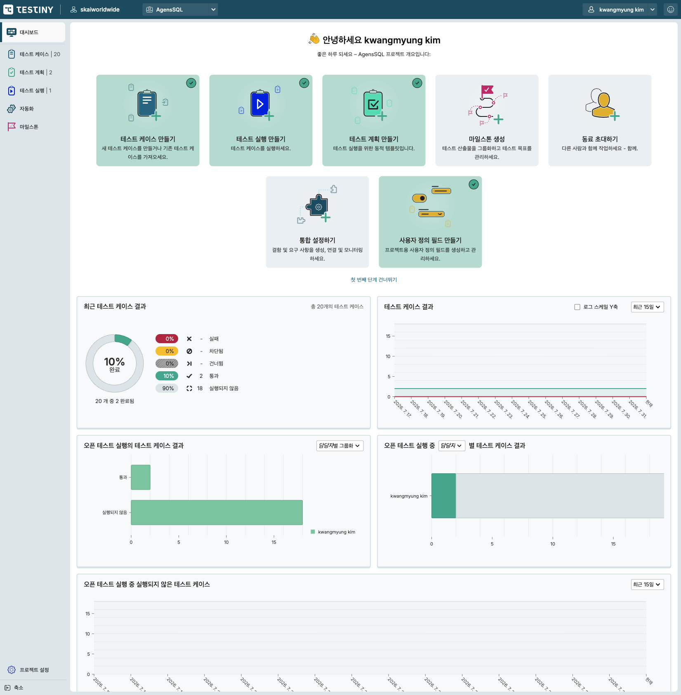
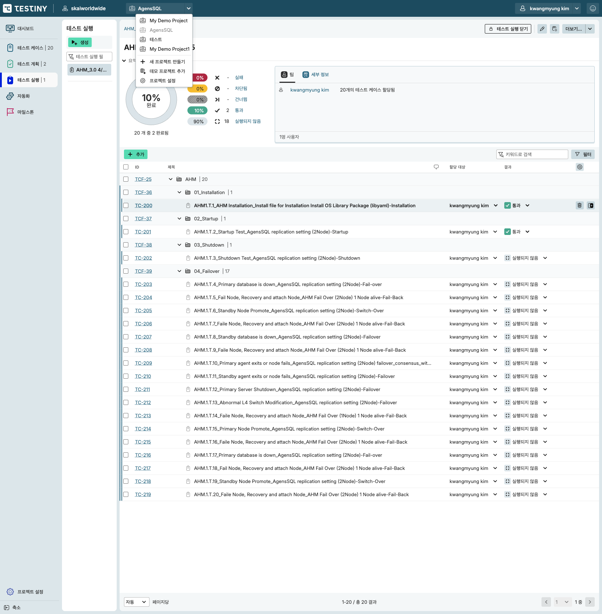
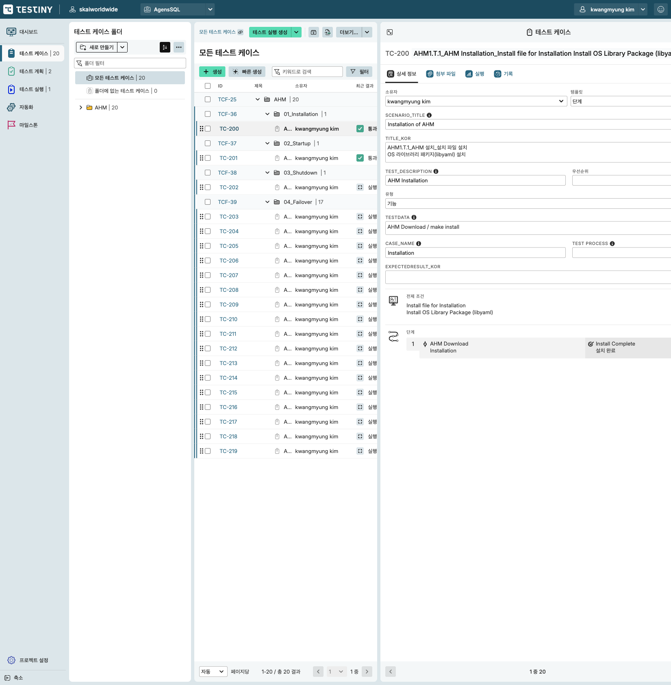
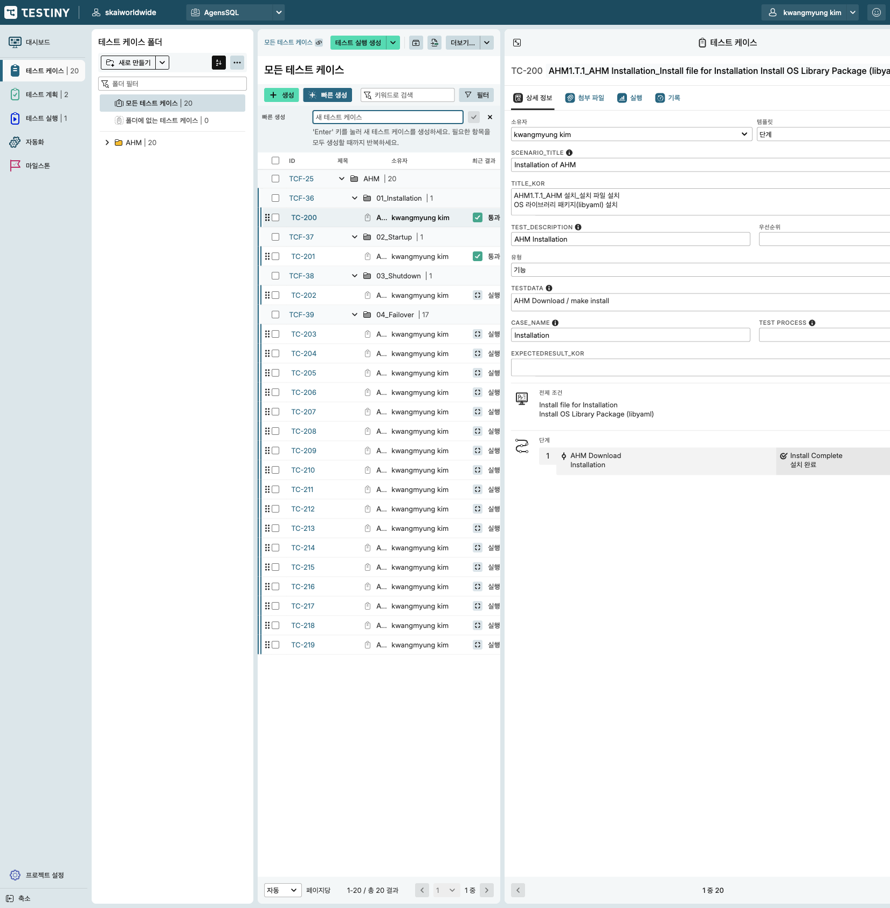
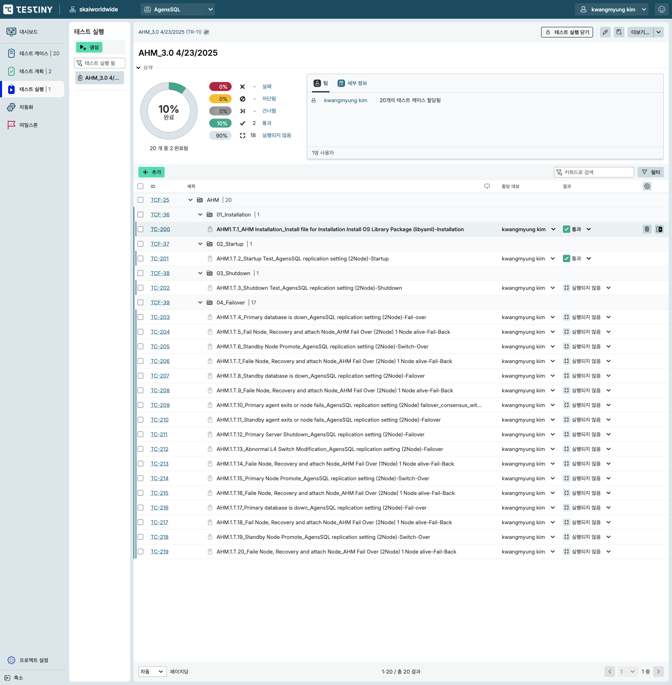
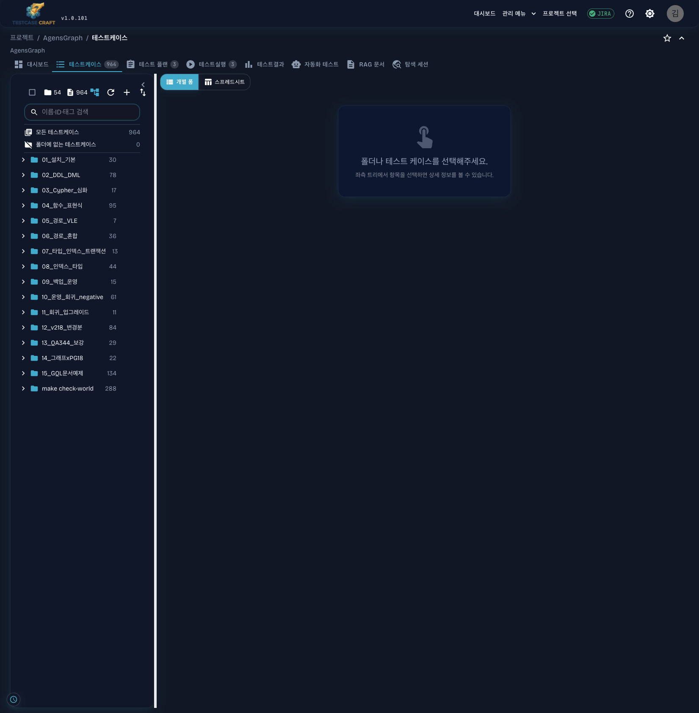
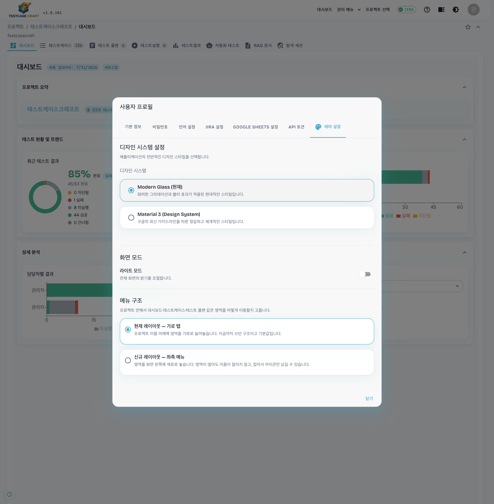
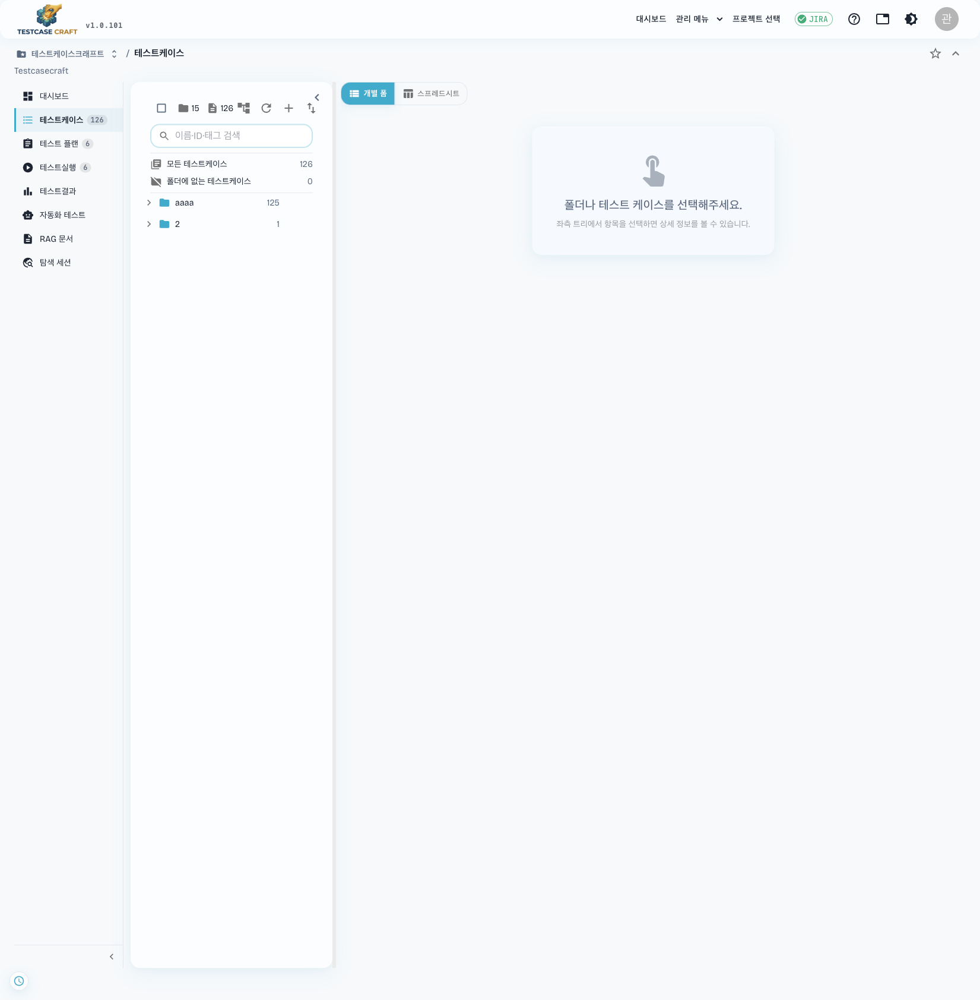

# 좌측 사이드바 네비게이션 전환 계획 — 외부 도구 벤치마크

작성: 2026-07-31 00:45 KST
최종 갱신: 2026-07-31 01:20 KST (Phase 0.5 구현 완료 — §11)
대상: testcasecraft v1.0.101
벤치마크: 외부 테스트 관리 도구 (SaaS · skaiworldwide 워크스페이스 / AgensSQL 프로젝트)

> **진행 상황** — 레이아웃을 한 번에 갈아엎지 않고, **사용자가 프로필에서 골라 쓰는 스위치**를 먼저 넣었다(§11, 구현·실측 완료). 아래 Phase 1~7 은 그 스위치 위에서 진행할 후속 단계다.

---

## 1. 무엇을 하려는가

지금 testcasecraft 는 프로젝트 안의 영역(대시보드·테스트케이스·테스트 플랜·테스트실행·테스트결과·자동화·RAG·탐색 세션)을 **가로 탭 8개**로 나눈다. 이걸 참고 도구처럼 **좌측 사이드바**로 옮기고, 프로젝트 전환도 상단에서 **리스트로 골라 즉시 이동**하는 구조로 바꾼다.

같이 벤치마크할 것은 네비게이션만이 아니다. 테스트케이스를 어떻게 늘어놓고(리스트), 어떻게 만들고(생성·빠른 생성), 어떻게 실행 결과를 넣는지(실행 화면)까지 참고 도구의 구조를 뜯어 우리 구조와 대조한다.

## 2. 어떻게 조사했는가

Playwright MCP 의 extension 모드로 **실제 로그인된 브라우저 탭에 붙어** 두 제품을 같은 계정 상태에서 캡처했다. 새 프로필로 띄우면 로그인 세션이 없어 로그인 화면만 찍히고, CDP 직접 연결은 Chrome 136 부터 기본 프로필에서 막혀 있다.

- 참고 도구: 워크스페이스 프로젝트 화면 (AgensSQL — 케이스 20, 계획 2, 실행 1)
- testcasecraft: `tc.qaspecialist.uk/projects/dca4a2a4…` (AgensGraph — 케이스 964, 폴더 54, 계획 3, 실행 3)

캡처 원본은 `images/left-nav-restructure/` 에 있고 파일 목록은 §9 에 정리했다.

---

## 3. 참고 도구 구조 분석

### 3-1. 화면 골격

세 영역으로 고정돼 있다.

| 영역 | 내용 |
|---|---|
| 상단 바 (고정, 얇음) | 로고 · 워크스페이스(`skaiworldwide`) · **프로젝트 드롭다운** · 우측에 사용자 · 피드백 |
| 좌측 사이드바 (고정 폭 ~160px) | 영역 이동 링크 6개 + 하단에 `프로젝트 설정` · `축소` |
| 본문 | 영역별 화면. 케이스 화면만 본문이 다시 3열로 쪼개진다 |

사이드바 항목은 **아이콘 + 이름 + 건수 배지**다. `테스트 케이스 | 20`, `테스트 계획 | 2`, `테스트 실행 | 1` 처럼 숫자가 붙고, 자동화·마일스톤에는 숫자가 없다. 현재 위치는 배경색과 좌측 굵은 선으로 표시한다.



### 3-2. 프로젝트 선택 — 상단 드롭다운 리스트

상단 프로젝트 버튼을 누르면 프로젝트 이름이 **리스트로 펼쳐지고**, 현재 프로젝트는 흐리게 처리해 구분한다. 리스트 아래에 액션 세 개가 붙는다 — `새 프로젝트 만들기`, `데모 프로젝트 추가`, `프로젝트 설정`.

핵심은 **페이지를 떠나지 않고 프로젝트를 바꾼다**는 점이다. 목록 페이지로 왕복하지 않는다.



### 3-3. 테스트케이스 — 트리 + 리스트 + 상세 3열

| 열 | 내용 |
|---|---|
| 폴더 트리 | `새로 만들기` 드롭다운 · 정렬 · 더보기 · **폴더 필터 입력** · `모든 테스트 케이스 \| 20` · `폴더에 없는 테스트 케이스 \| 0` · 폴더 트리(건수 배지) |
| 케이스 리스트 | 제목(`모든 테스트 케이스`) · `생성` · `빠른 생성` · 키워드 검색 · `필터` · 테이블 · 하단 페이지네이션 |
| 상세 | 케이스 ID + 제목 · 탭 4개(상세 정보 · 첨부 파일 · 실행 · 기록) · 필드 · 전제 조건 · 단계 |

리스트 테이블의 규약이 특히 참고할 만하다.

- 컬럼: 체크박스 · ID · 제목 · 소유자 · 최근 결과, 우측 끝에 **컬럼 설정 기어**
- **폴더 행과 케이스 행이 같은 테이블에 섞인다.** 폴더 행은 `TCF-25 · 📁 AHM | 20` 형태로 접기·펴기가 되고, 그 아래 케이스 행이 들여쓰기 없이 이어진다. 트리에서 폴더를 고르지 않아도 전체 계층을 리스트에서 훑을 수 있다
- 행 왼쪽에 드래그 핸들, 행 hover 시 우측에 `…` 액션과 아이콘 버튼
- 하단: `자동 ▾ 페이지당` · `1-20 / 총 20 결과` · 페이지 이동



### 3-4. 생성 흐름 두 갈래

`생성` 은 전체 폼으로 들어가고, **`빠른 생성` 은 리스트 상단에 한 줄 입력을 펼친다.** 안내 문구가 그 성격을 그대로 말한다 — "'Enter' 키를 눌러 새 테스트 케이스를 생성하세요. 필요한 항목을 모두 생성할 때까지 반복하세요."

제목만 연속으로 때려 넣어 골격을 만들고, 내용은 나중에 채우는 흐름이다. 케이스를 수십 개 쏟아 넣을 때 폼을 열고 닫는 왕복이 사라진다.



### 3-5. 테스트 실행 — 요약 + 인라인 결과 지정

실행 상세는 위아래로 나뉜다.

- 위: 완료율 도넛(`10% 완료`) · 결과별 건수(실패/차단됨/건너뜀/통과/실행되지 않음) · `팀` 탭(담당자별 할당 건수) · `세부 정보` 탭
- 아래: 케이스 테이블. **`할당 대상`과 `결과`가 행 안의 드롭다운**이라 리스트에서 바로 통과/실패를 찍는다. 상세로 들어가지 않는다
- 좌측에는 실행 목록 패널(`생성` · 실행 필터 · 실행 항목)이 따로 있다



### 3-6. 그 외

- 테스트 계획 리스트: `ID · 제목 · 열린 테스트 실행 · 마지막 테스트 실행` + 행 우측 `→`(실행 만들기)
- 대시보드: 온보딩 카드 8개(생성 완료 시 체크 표시) + 위젯 5개(최근 결과 도넛 · 결과 추이 · 오픈 실행 결과 · 담당자별 결과 · 미실행 케이스). 위젯마다 `최근 15일` 같은 기간 드롭다운
- 자동화 · 마일스톤은 독립 영역으로 사이드바에 나란히 있다

---

## 4. 현재 testcasecraft 구조



| 층 | 현재 상태 | 코드 |
|---|---|---|
| 상단 헤더 | 로고+버전 · `대시보드` · `관리 메뉴` · `프로젝트 선택` · JIRA · 도움말 · 설정 · 아바타 | `App.jsx` |
| 브레드크럼 | `프로젝트 / AgensGraph / 테스트케이스` + 즐겨찾기 · 접기 | `ProjectHeader.jsx:126-176` |
| 영역 이동 | **가로 탭 8개** (대시보드 · 테스트케이스 964 · 테스트 플랜 3 · 테스트실행 3 · 테스트결과 · 자동화 테스트 · RAG 문서 · 탐색 세션) | `ProjectHeader.jsx:199-287` |
| 본문 | 좌측 폴더 트리 + 우측 상세 **2열**. 케이스 리스트 없음. `개별 폼 / 스프레드시트` 토글 | `App.jsx:1073-1250` |

구조상 걸리는 지점 셋:

**첫째, 탭 상태가 숫자다.** `const [tabIndex, setTabIndex] = useState(uiState.tabIndex ?? 0)` (`App.jsx:214`) 이고, 본문은 `tabIndex === 0 … === 6` 스위치로 갈린다(`App.jsx:1073~1242`). URL 과의 연결은 `useEffect` 안에서 경로를 판별해 `setTabIndex(n)` 을 부르는 방식으로 손으로 맞춘다(`App.jsx:430-517`, 분기 20개). 영역을 하나 넣거나 순서를 바꾸면 숫자가 밀려 이 분기와 `uiState` 저장값(`App.jsx:531-538`)이 모두 흔들린다. RAG 비활성 시 인덱스를 되돌리는 보정 코드까지 있다(`App.jsx:541-547`).

**둘째, 프로젝트 전환이 페이지 왕복이다.** 상단 `프로젝트 선택` → `/projects` 목록 페이지 → 카드의 `프로젝트 열기`. 보고 있던 영역은 잃는다. 참고 도구는 드롭다운 한 번이다.

**셋째, 케이스를 목록으로 훑을 수 없다.** 트리에서 폴더나 케이스를 고르기 전에는 본문이 "폴더나 테스트 케이스를 선택해주세요" 안내뿐이다. 964건을 조건으로 걸러 표로 보고 정렬하는 화면이 없다.

---

## 5. 갭 정리

| 항목 | 참고 도구 | testcasecraft | 이번 계획에서 |
|---|---|---|---|
| 영역 이동 | 좌측 사이드바 + 건수 배지 | 가로 탭 8개 | **사이드바로 전환** |
| 라우팅 | 영역별 URL | `tabIndex` 숫자 + 경로 판별 effect | **영역별 중첩 라우트** |
| 프로젝트 전환 | 상단 드롭다운 리스트 | 목록 페이지 왕복 | **드롭다운 리스트 + 현 영역 유지** |
| 케이스 나열 | 트리 + 리스트(정렬·필터·페이지) + 상세 3열 | 트리 + 상세 2열 | **리스트 열 신설** |
| 폴더·케이스 혼합 | 한 테이블에서 접기·펴기 | 트리에만 존재 | 리스트에 계층 행 도입 |
| 생성 | 전체 폼 + 빠른 생성(인라인 반복) | 폼 / 스프레드시트 | **빠른 생성 추가** |
| 결과 입력 | 실행 리스트 행에서 드롭다운 | 케이스별 결과 화면 이동 | 인라인 결과 지정 |
| 사이드바 접기 | 있음(하단 `축소`) | 트리 접기만 있음 | 있음 |

---

## 6. 목표 구조

### 6-1. 라우팅

`tabIndex` 를 버리고 URL 이 곧 상태가 되게 한다.

```
/projects                                  프로젝트 목록(기존)
/projects/:projectId                       → /dashboard 리다이렉트
/projects/:projectId/dashboard
/projects/:projectId/testcases             리스트
/projects/:projectId/testcases/:caseId     리스트 + 상세
/projects/:projectId/testplans
/projects/:projectId/testplans/:planId
/projects/:projectId/executions
/projects/:projectId/executions/:execId
/projects/:projectId/results
/projects/:projectId/automation
/projects/:projectId/rag                   (RAG 비활성 시 대시보드로)
/projects/:projectId/exploratory           (권한 없으면 대시보드로)
/projects/:projectId/settings
```

기존 경로(`/projects/:id/executions/:execId/testcases/:tcId/result` 등)는 그대로 살린다.

### 6-2. 컴포넌트 트리

```
<AppShell>                     상단 바: 로고 · 조직 · ProjectSwitcher · 우측 액션
  <ProjectLayout>              사이드바 + <Outlet/>
    <ProjectSidebar>           영역 링크 + 건수 배지 + 접기 + 하단 프로젝트 설정
    <Outlet>                   영역별 페이지
      <DashboardPage>
      <TestCasesPage>          트리 | 리스트 | 상세 3열
      <TestPlansPage> ...
```

신설: `AppShell`, `ProjectLayout`, `ProjectSidebar`, `ProjectSwitcher`, `TestCaseListPane`, `QuickCreateRow`
정리: `ProjectHeader` 는 브레드크럼·즐겨찾기만 남기고 `Tabs` 삭제

### 6-3. 사이드바 항목 (표시 순서)

| 순서 | 항목 | 경로 | 배지 | 조건 |
|---|---|---|---|---|
| 1 | 대시보드 | `dashboard` | — | 항상 |
| 2 | 테스트케이스 | `testcases` | 케이스 수 | 항상 |
| 3 | 테스트 플랜 | `testplans` | 플랜 수 | 항상 |
| 4 | 테스트실행 | `executions` | 실행 수 | 항상 |
| 5 | 테스트결과 | `results` | — | 항상 |
| 6 | 자동화 테스트 | `automation` | — | 항상 |
| 7 | RAG 문서 | `rag` | — | RAG 활성 |
| 8 | 탐색 세션 | `exploratory` | — | 권한 |
| — | 프로젝트 설정 | `settings` | — | 하단 고정, 권한 |

조건부 항목이 사라져도 나머지 항목의 경로는 그대로다 — 지금처럼 인덱스가 밀리는 문제가 없어진다.

---

## 7. 단계별 계획

작게 끊어 각 단계가 스스로 동작하게 만든다. 한 단계씩 머지 가능한 크기로 잡았다.

### Phase 0 — 라우트 인벤토리 고정 (0.5일)
현재 URL ↔ 탭 매핑 20분기를 표로 뽑고, 각 경로가 어떤 컴포넌트를 그리는지 대조표를 만든다. 이 표가 이후 모든 단계의 회귀 기준이 된다. 산출: `docs/plan/ROUTE_INVENTORY.md`.

### Phase 1 — 라우팅 전환 (2일, 화면 변화 없음)
`tabIndex` 스위치를 중첩 라우트로 바꾼다. 사이드바는 아직 넣지 않고 **가로 탭을 `NavLink` 로 바꿔** 라우팅만 검증한다.
- `App.jsx` 의 경로 판별 effect(430-517) 제거, `<Route>` 정의로 이관
- `uiState.tabIndex` 는 `lastVisitedSection` 문자열로 마이그레이션(구 값은 무시하고 대시보드로)
- 검증: Phase 0 표의 모든 경로를 직접 입력해 같은 화면이 나오는지, 새로고침·뒤로가기가 유지되는지

### Phase 2 — 사이드바 도입 (2일)
`ProjectLayout` + `ProjectSidebar` 신설, 가로 탭 삭제. 접힘 상태는 `localStorage` 에 저장(트리 접기와 같은 방식). 배지 숫자는 기존 카운트 소스를 그대로 재사용.
- 반응형: 좁은 화면에서는 아이콘만, 더 좁으면 상단 햄버거 드로어
- 검증: 8개 항목 이동, 조건부 항목(RAG off / 탐색 권한 없음) 숨김, 현재 위치 표시

### Phase 3 — 프로젝트 전환 드롭다운 (1일)
상단 `ProjectSwitcher`. 프로젝트 리스트 + 하단 액션(`새 프로젝트`, `프로젝트 설정`). 전환 시 **현재 영역을 유지**하고 프로젝트만 갈아탄다(`/projects/A/testcases` → `/projects/B/testcases`). 대상 프로젝트에 그 영역이 없으면 대시보드로.
- 프로젝트가 많을 때를 대비해 드롭다운 안 검색 입력
- `/projects` 목록 페이지는 그대로 유지(조직별·독립·전체 보기가 이미 있다)

### Phase 4 — 케이스 리스트 열 신설 (3일)
가장 무거운 단계다. 트리와 상세 사이에 리스트를 넣는다.
- 컬럼: 체크박스 · 표시 ID · 제목 · 태그 · 소유자 · 우선순위 · 최근 결과, 컬럼 설정 저장
- 폴더 행 + 케이스 행 혼합, 폴더 접기·펴기
- 정렬·키워드 검색·필터·페이지네이션(기존 트리 검색 규칙 `treeFilter.js` 재사용)
- 선택 상태를 트리·리스트가 공유(ICT-431 에서 정한 "검색 결과와 선택 대상이 같은 집합" 원칙을 리스트에도 적용)
- 검증: 964건 프로젝트에서 첫 렌더·스크롤 성능, 트리 ↔ 리스트 ↔ 상세 선택 동기화

### Phase 5 — 빠른 생성 (1일)
리스트 상단에 한 줄 입력. Enter 로 생성하고 입력을 비워 연속 입력. 생성 위치는 트리에서 고른 폴더. 실패 시 입력 내용 보존.

### Phase 6 — 실행 화면 인라인 결과 (2일)
실행 상세의 케이스 테이블에 `담당자`·`결과` 드롭다운을 넣어 리스트에서 결과를 찍게 한다. 상단에 완료율 도넛과 결과별 건수 요약.
- 태그는 ICT-427 규칙(보내지 않으면 이전 태그 계승)을 그대로 따른다
- 검증: 결과 저장 후 목록·대시보드 집계 반영, 권한 없는 사용자 비활성

### Phase 7 — 매뉴얼·i18n·릴리즈 (1일)
한/영 매뉴얼의 화면 설명과 캡처를 새 구조로 교체(`manual-capture-orchestrator`), 신규 문구 i18n 시드 추가, 릴리즈 노트 작성.

합계 대략 12~13일. Phase 1~3 까지만 해도 "좌측 네비 + 프로젝트 리스트 전환"이라는 이번 요청의 핵심은 충족된다. Phase 4~6 은 그 위에 얹는 벤치마크 항목이다.

---

## 8. 위험과 대응

| 위험 | 왜 위험한가 | 대응 |
|---|---|---|
| `tabIndex` 제거 범위 | 20개 분기와 `uiState`·`saveUIState` 가 얽혀 있어 누락 시 특정 URL 이 빈 화면이 된다 | Phase 0 인벤토리를 기준으로 경로별 스모크. Phase 1 은 화면을 바꾸지 않아 회귀 판별이 쉽다 |
| 저장된 구 `uiState.tabIndex` | 업데이트 후 첫 진입에서 엉뚱한 영역이 열릴 수 있다 | 숫자 값은 무시하고 대시보드로. 문자열 키로 새로 저장 |
| 964건 리스트 성능 | 트리·리스트·상세를 한 화면에 두면 렌더 비용이 겹친다 | 리스트 가상화(트리에서 쓰는 `@tanstack/react-virtual` 재사용), 페이지네이션 기본 100건 |
| 세로 공간 손실 | 사이드바가 폭을 먹어 3열이 좁아진다 | 사이드바 접기 + 트리 접기(이미 있음)로 최대 2단까지 축소 가능하게 |
| E2E·매뉴얼 깨짐 | 탭 `data-testid`(`tab-testcases` 등)를 쓰는 테스트와 캡처 73장+ 이 있다 | 사이드바 항목에 같은 `data-testid` 를 물려주고, 매뉴얼 캡처는 Phase 7 에서 일괄 재촬영 |
| 즐겨찾기·북마크 | 저장된 URL 이 구 경로일 수 있다 | 구 경로 → 신 경로 리다이렉트 유지 |

---

## 9. 확인 필요 사항

착수 전에 정해야 하는 것 넷.

1. **테스트결과·자동화·RAG·탐색 세션을 사이드바 1급으로 둘지**, 아니면 참고 도구처럼 6개로 줄이고 나머지는 하위 묶음으로 넣을지
2. **사이드바 기본 폭과 기본 접힘 상태** — 케이스 3열을 살리려면 접힘이 기본일 수도 있다
3. **Phase 4 리스트를 기존 스프레드시트 뷰와 어떻게 나눌지** — 리스트가 스프레드시트를 대체하는지, 나란히 두는지
4. **Jira 티켓 발행 여부** — Phase 별로 쪼갤지 하나로 묶을지

---

## 10. 캡처 목록

`images/left-nav-restructure/`

| 파일 | 내용 |
|---|---|
| `01-dashboard.png` | 참고 도구 대시보드 전체 (온보딩 카드 + 위젯 5개) |
| `02-testcases-list.png` | 케이스 3열 (트리·리스트·상세 미선택) |
| `03-testplans-list.png` | 테스트 계획 리스트 |
| `04-testruns-list.png`, `12-testruns-list.png` | 테스트 실행 목록 |
| `05-automation.png` | 자동화 개요 |
| `06-milestones.png` | 마일스톤 |
| `07-testcase-detail.png` | 케이스 상세 (탭 4개 · 필드 · 전제조건 · 단계) |
| `08-testcase-create.png` | 생성 폼 |
| `09-testcase-quick-create.png` | 빠른 생성 인라인 입력 |
| `10-testcase-filter.png` | 필터 |
| `11-testplan-detail.png` | 계획 상세 |
| `13-testrun-execute.png` | 실행 상세 (요약 + 인라인 결과 지정) |
| `14-project-switcher.png` | 프로젝트 선택 드롭다운 리스트 |
| `20-current-projects.png` | 현재 testcasecraft 프로젝트 선택 페이지 |
| `21-current-dashboard.png` | 현재 대시보드 |
| `22-current-testcases.png` | 현재 테스트케이스 (가로 탭 + 2열) |
| `23-current-testplans.png` | 현재 테스트 플랜 |
| `24-current-executions.png` | 현재 테스트실행 |

---

## 11. Phase 0.5 — 사용자가 고르는 레이아웃 스위치 (구현 완료)

구현: 2026-07-31 01:20 KST · 브랜치 `feat/left-nav-restructure`

레이아웃을 한 번에 바꾸면 되돌릴 방법이 없다. 그래서 먼저 **두 레이아웃을 나란히 두고 사용자가 프로필에서 고르게** 했다. 기본값은 기존 가로 탭이라 업데이트만으로는 아무도 화면이 바뀌지 않는다.

### 11-1. 사용자가 보는 것

프로필 → 테마 설정 탭 맨 아래 `메뉴 구조` 에서 둘 중 하나를 고른다.

| 선택 | 내용 |
|---|---|
| **현재 레이아웃 — 가로 탭** | 프로젝트 이름 아래 영역을 가로로. 지금까지 쓰던 구조이고 기본값 |
| **신규 레이아웃 — 좌측 메뉴** | 영역을 화면 왼쪽에 세로로. 접어서 아이콘만 남길 수 있다 |



고른 값은 서버에 사용자별로 저장된다(`useUiPreference` → `PATCH /api/auth/me/preferences`). 다른 PC 에서 로그인해도 그대로 유지되고, 새로고침에도 남는다. 상단 바에도 빠른 전환 아이콘(`nav-mode-toggle`)을 뒀다.

신규 레이아웃에서는 브레드크럼이 `테스트케이스크래프트 / 테스트케이스` 형태가 된다 — 첫 자리가 **고른 프로젝트 이름이고 그게 곧 프로젝트 선택기**다. 눌러서 프로젝트 목록에서 다른 프로젝트로 바로 넘어간다. 프로젝트 이름을 두 군데 적지 않으려고 기존의 `프로젝트 /` 크럼은 신규 레이아웃에서 접었다.




### 11-2. 구조

| 파일 | 역할 |
|---|---|
| `components/navigation/projectNavItems.js` | 영역 항목 정의 **한 곳**. 가로 탭과 좌측 메뉴가 같은 목록·같은 `data-testid`·같은 배지 소스를 쓴다 |
| `context/NavModeContext.jsx` | `navMode`(tabs/sidebar)·`sidebarCollapsed` 저장. 값이 깨졌거나 모르는 값이면 가로 탭으로 되돌린다 |
| `components/ProjectSidebar.jsx` | 좌측 메뉴. 항목·배지·접기 |
| `components/ProjectHeader.jsx` | 가로 탭을 공유 정의 기반으로 재작성. 신규 레이아웃에서는 탭을 그리지 않고, 브레드크럼 첫 크럼을 프로젝트 선택기로 바꾼다 |
| `App.jsx` | 사이드바 + 본문 flex 래퍼, 상단 빠른 전환 버튼 |
| `UserProfileDialog.jsx` | 레이아웃 선택 라디오 2개 |

핵심 제약을 하나 지켰다. **`tabIndex` 는 "보이는 항목 중 몇 번째"라는 위치 값**이다. RAG 가 꺼지면 탐색 세션이 7에서 6으로 당겨지는 기존 규칙(`App.jsx` 의 `EXPLORATORY_TAB`)이 그대로 살아 있고, 본문 스위치(`tabIndex === N`)와 `handleTabChange` 는 손대지 않았다. 두 레이아웃이 같은 위치 규칙을 공유하므로 "고른 메뉴와 그려지는 화면"이 어긋나지 않는다. 라우팅을 URL 기반으로 바꾸는 Phase 1 은 이 위에서 따로 한다.

### 11-3. 검증

단위 테스트 — 전체 **428건 통과**(신규 20건). 신규분은 `projectNavItems.test.js` 6, `ProjectSidebar.test.jsx` 9, `ProjectHeader.projectSwitcher.test.jsx` 5. RAG on/off × 탐색 세션 on/off 네 조합에서 선택 값이 어긋나지 않는지, 배지·접힘·프로바이더 밖 렌더까지 고정했다.

실측 — 로컬 백엔드(`local` 프로파일 + 로컬 Postgres 5434)와 로컬 프런트로 실제 브라우저에서 확인했다.

| 확인 항목 | 결과 |
|---|---|
| 프로젝트 진입 시 기본이 가로 탭 | 가로 탭 1 / 사이드바 0 |
| 프로필에서 신규 레이아웃 선택 → 즉시 반영 | 가로 탭 0 / 사이드바 1 (리로드 없음) |
| 브레드크럼 형태 | `테스트케이스크래프트 / 대시보드` |
| 사이드바 항목 이동 6종 | 각 항목의 URL·브레드크럼 일치 |
| 사이드바 접기 | 폭 184 → 56 |
| 프로젝트 전환 | 리스트에서 고르면 `ShopFlow EN / 대시보드` 로 전환 |
| 새로고침 후 유지 | 사이드바 유지(서버 저장 확인) |
| 현재 레이아웃으로 되돌리기 | 가로 탭 1 / 사이드바 0 |

실측 중 하나 걸러냈다 — `테스트결과` 를 눌러도 URL 이 `/results` 로 바뀌지 않는다. **두 레이아웃에서 똑같이 일어나므로 이번 변경과 무관한 기존 동작**이고, Phase 1 라우팅 정리에서 함께 잡는다.

코드 리뷰(별도 에이전트) — CRITICAL·HIGH 0. 지적된 영문 i18n 시드는 키·한국어·영어 각각 13건으로 맞춰 넣었다.
