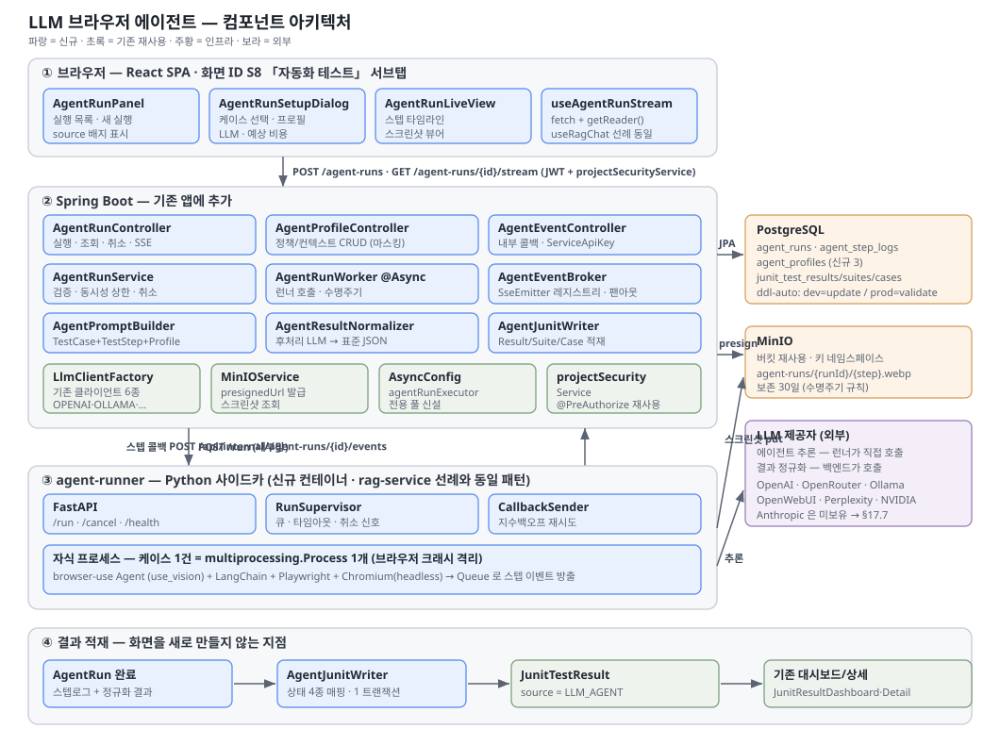
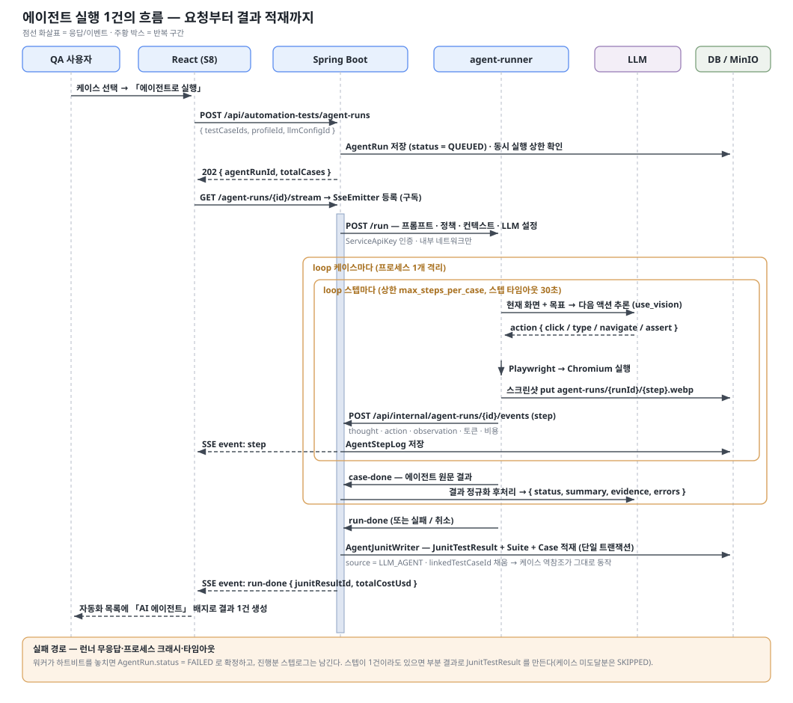
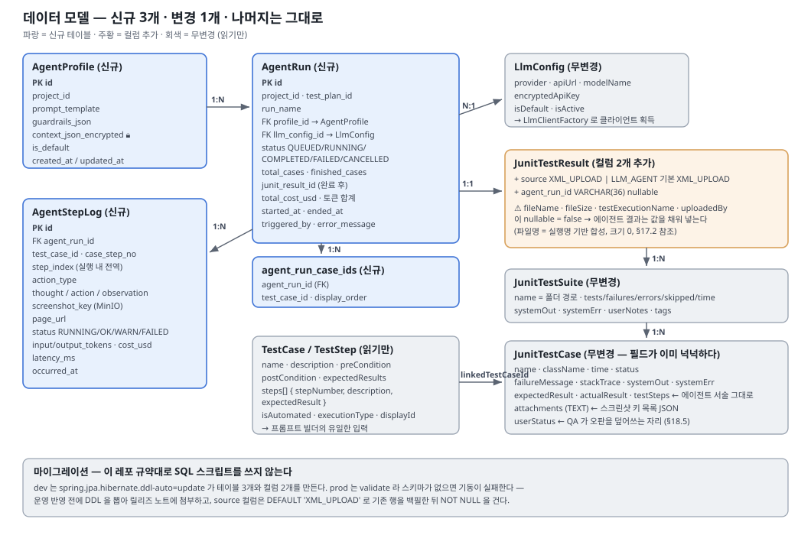
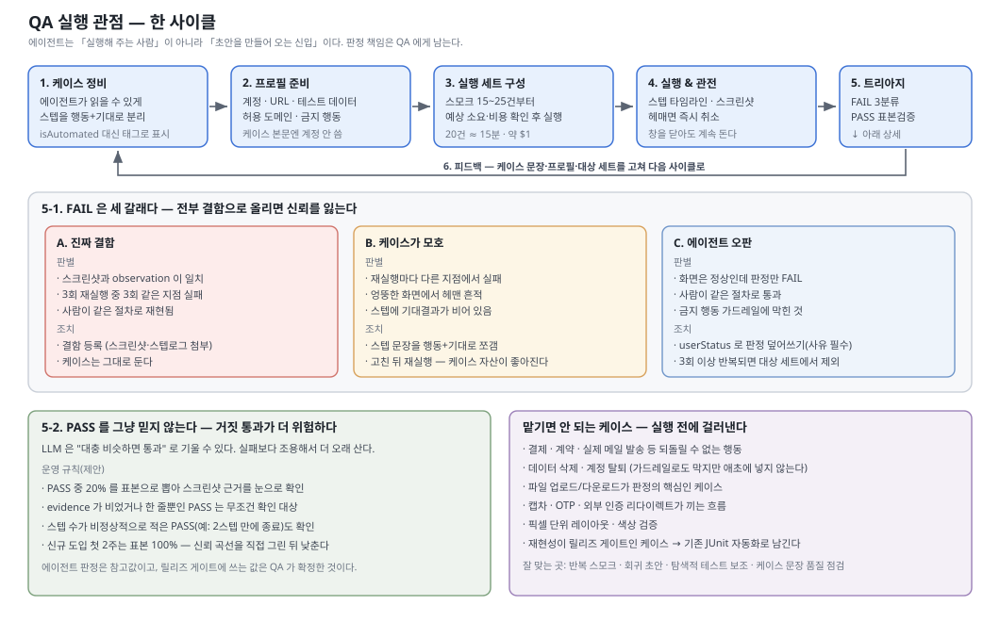
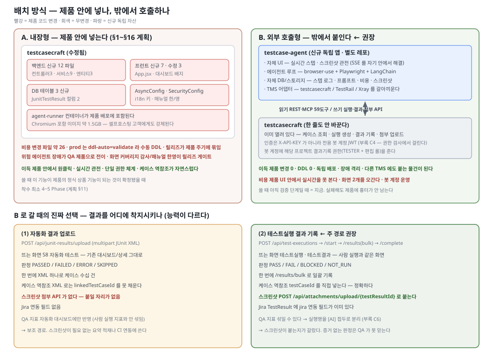
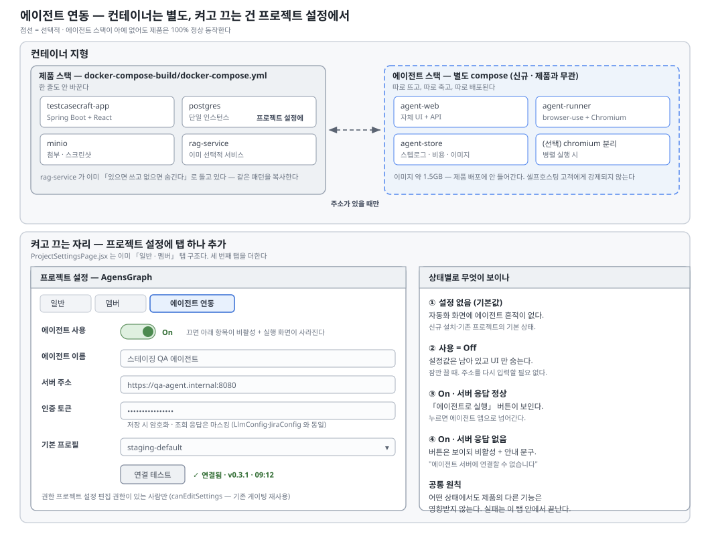

# LLM 브라우저 에이전트 자동화 계획 — 자연어 테스트케이스를 그대로 실행한다

작성: 2026-09-03 09:00 KST
브랜치: `feat/llm-browser-agent-automation`
대상: testcasecraft v1.0.125
화면: **S8 자동화 테스트** (`/projects/{projectId}/automation`) 안에 넣는다
참고: 잡코리아(Worxphere) QA팀 「LLM 기반 TestRail 테스트 자동화 에이전트 구축」 (techblog.jobkorea.co.kr, 2026-07-21, Taeshkim)

> **한 줄 요약** — testcasecraft 에 이미 쌓여 있는 **자연어 테스트케이스**(`TestCase` + `TestStep`)를 LLM 에이전트가 읽고 **실제 브라우저를 직접 조작**해 실행한 뒤, 결과를 **기존 자동화 테스트 대시보드(JUnit 구조)** 에 그대로 꽂는다. 스크립트를 새로 쓰지 않는다.

---

## 0. 왜 지금 이걸 보는가 — 참고 글의 요지

Worxphere QA팀이 PoC로 만든 구조는 다음과 같다.

| 레이어 | 그들이 쓴 것 | testcasecraft 에서의 대응 |
|---|---|---|
| 케이스 저장소 | TestRail REST API 로 프로젝트·스위트·케이스 조회 | **DB 직접 조회** — 우리가 케이스 저장소 본체다 (API 왕복 불필요) |
| 프롬프트 빌더 | 케이스 → 프롬프트 변환. 정책 JSON + 컨텍스트 JSON 2종 | `LlmTemplate` 테이블 + 신설 `AgentProfile` (정책·컨텍스트) |
| 실행 엔진 | browser-use + Playwright, `use_vision=True` | 신설 **agent-runner** (Python 사이드카) |
| 실시간 모니터링 | Django Channels WebSocket 으로 스텝 로그·스크린샷 push | **SSE** — `RagChatController` 의 `SseEmitter` 패턴 재사용 |
| 결과 정규화 | 후처리 LLM 이 `{status, summary, evidence, errors}` JSON 으로 표준화 | 동일 채택 |
| 프로세스 격리 | `multiprocessing.Process` + Queue — 브라우저 크래시 격리 | 별도 컨테이너/프로세스로 격리 (Java 프로세스에 브라우저를 넣지 않는다) |

그들이 **직접 밝힌 한계**도 그대로 우리 제약이다 — 케이스당 30초~1분, $0.03~$0.10, 비결정적(같은 케이스 재실행 시 행동이 달라짐), 복잡한 시나리오·파일 업로드·캡차 불안정. 그래서 이 계획은 **기존 JUnit 업로드 자동화를 대체하지 않는다.** 스모크·회귀 초안·탐색적 테스트 보완재로 자리를 잡는다.

**우리가 그들보다 유리한 지점 3가지** — 이게 이 기능을 만드는 이유다.

1. 그들은 TestRail 을 API 로 긁어야 하지만 **우리는 케이스 저장소 그 자체**다. 케이스·스텝·기대결과·전제조건이 `TestCase`/`TestStep` 으로 이미 구조화돼 있다.
2. **멀티 LLM 이 이미 있다.** `service/llm/` 에 OpenAI·OpenRouter·Ollama·OpenWebUI·Perplexity·NVIDIA·OpenAI-호환 클라이언트 7종과 `LlmConfigService`·`LlmClientFactory` 가 붙어 있다. 새로 만들 게 없다.
3. **결과를 담을 그릇이 이미 있다.** `JunitTestResult` → `JunitTestSuite` → `JunitTestCase` 3계층과 대시보드(`JunitResultDashboard.jsx`)·상세(`JunitResultDetail.jsx`)가 돌아간다. 에이전트 실행 결과를 이 구조로 정규화하면 **UI 를 거의 새로 안 만들어도 된다.**

---

## 1. 목표

1. 프로젝트의 테스트케이스를 골라 **"에이전트로 실행"** 버튼 하나로 브라우저 자동 실행.
2. 실행 중 **스텝별 로그와 스크린샷을 실시간으로** 화면에 흘린다.
3. 실행이 끝나면 결과가 **기존 자동화 테스트 목록에 한 건의 결과로** 남는다 (JUnit 결과와 같은 자리, 같은 상세 화면).
4. 케이스 본문에 **계정·URL·테스트 데이터를 적지 않는다.** 프로젝트별 컨텍스트에서 주입한다 (참고 글의 핵심 아이디어).
5. **가드레일** — 허용 도메인 밖 이동 금지, 결제/삭제류 행동 금지를 프로필로 강제.
6. 케이스별·실행별 **LLM 비용을 추적**한다.

## 2. 비목표 (이번 범위 밖)

- 기존 JUnit XML 업로드 자동화의 대체 — 병존한다.
- 다중 브라우저 병렬 실행 — Phase 4 이후. MVP 는 실행당 브라우저 1개, 케이스 순차.
- 자가치유(self-healing) selector 리페어를 정식 기능으로 파는 것 — LLM 이 알아서 찾는 건 부수효과로 얻고, 별도 기능화는 안 한다.
- 모바일 앱·네이티브 UI 자동화.
- CI 파이프라인 연동(Jenkins/GitHub Actions 훅) — Phase 5.
- 파일 업로드/다운로드·캡차 시나리오 — 참고 글이 불안정하다고 명시. 명시적 미지원으로 문서화.

## 3. 호환성 원칙

- **기존 화면·라우트를 깨지 않는다.** S8 자동화 테스트 화면에 **탭 하나를 추가**하는 방식(참고 글 대응 Option A). 기본 진입 시 보이는 건 지금과 같은 JUnit 대시보드다.
- **결과 저장은 기존 3계층 엔티티를 재사용**한다. `JunitTestResult` 에 `source` 컬럼(`XML_UPLOAD` | `LLM_AGENT`)을 더해 구분한다. 기존 행은 `XML_UPLOAD` 로 백필.
- 에이전트 전용 데이터(스텝 로그·스크린샷·프롬프트·비용)만 **신규 테이블 2개**에 담는다.
- 화면 ID 는 **S8 을 그대로 쓴다.** 새 화면 ID 를 만들면 CLAUDE.md 가 경고한 "화면 ID 정의가 흩어진 7곳"을 전부 고쳐야 한다. 서브탭으로 처리해 회피한다.
- agent-runner 사이드카가 **없어도 앱은 정상 기동**한다. 미기동 시 에이전트 탭은 "런너 미연결" 안내만 띄운다.

---

## 4. 아키텍처

```
[React S8 자동화 화면]
   │  ① POST /api/automation-tests/agent-runs        (실행 요청)
   │  ② GET  /api/automation-tests/agent-runs/{id}/stream   (SSE 구독)
   ▼
[Spring Boot  AgentRunController / AgentRunService]
   │  · 케이스·스텝 DB 조회
   │  · AgentProfile(정책 JSON + 컨텍스트 JSON) 병합 → 프롬프트 빌드
   │  · LlmConfig 조회 (기존 LlmConfigService)
   │  · AgentRun 생성 → QUEUED
   │  · @Async 워커가 런너 호출 + 콜백 수신
   ▼  HTTP (내부망)
[agent-runner  (Python 사이드카, FastAPI)]
   │  · browser-use Agent + Playwright, use_vision
   │  · 케이스 1건 = 자식 프로세스 1개 (크래시 격리)
   │  · 스텝마다 콜백 POST → Spring
   │  · 스크린샷은 MinIO 에 직접 put (기존 MinIOService 버킷 규약)
   ▼
[결과 정규화]  후처리 LLM → {status, summary, evidence, errors}
   ▼
[JunitTestResult(source=LLM_AGENT) / JunitTestSuite / JunitTestCase]
   ▼
[기존 JunitResultDashboard · JunitResultDetail 이 그대로 렌더]
```

### 4-1. 왜 Python 사이드카인가

browser-use 는 Python 라이브러리다. Java 에서 Playwright-Java 로 다시 짜면 browser-use 가 해결해 둔 DOM 요약·비전 결합·액션 스키마를 처음부터 만들어야 한다. 그리고 참고 글이 지적한 **브라우저 크래시 격리**도 JVM 안에서는 위험하다. `rag-service/` 라는 Python 사이드카 선례가 이미 있으므로 같은 패턴을 쓴다.

- 배치 위치: `agent-runner/` (레포 루트, `rag-service/` 와 형제)
- `docker-compose-build/` 에 서비스 추가, 프로파일로 on/off
- Spring ↔ 런너 인증: 기존 `ServiceApiKey` / `ApiKeyAuthenticationFilter` 재사용

### 4-2. 실시간 전송은 SSE 로 간다

참고 글은 Django Channels WebSocket 을 썼지만, 우리는 **이미 SSE 가 붙어 있다** — `RagChatController.chatStream()` 이 `@PostMapping(value="/stream", produces=MediaType.TEXT_EVENT_STREAM_VALUE)` 로 `SseEmitter` 를 반환한다(`controller/RagChatController.java:83,113`). 단방향 push 만 필요하므로 WebSocket 인프라를 새로 들일 이유가 없다. 프런트에는 아직 `EventSource` 사용처가 없어 훅 하나(`useAgentRunStream`)를 신설한다.

---

## 5. 데이터 모델

DB 마이그레이션은 이 레포 규약대로 **JPA `ddl-auto`** 에 맡긴다 (dev=`update`, prod=`validate`). 별도 SQL 스크립트를 두지 않되, prod 반영 전 스키마 검토는 릴리즈 절차에 포함한다.

### 5-1. 기존 엔티티 변경 — 1건뿐

`model/JunitTestResult.java` 에 컬럼 2개 추가.

| 컬럼 | 타입 | 설명 |
|---|---|---|
| `source` | `VARCHAR(20)`, default `XML_UPLOAD` | `XML_UPLOAD` \| `LLM_AGENT` |
| `agent_run_id` | `VARCHAR(36)` nullable | `LLM_AGENT` 일 때 `AgentRun` 역참조 |

기존 행은 default 로 자동 백필된다. `fileName`·`fileSize`·`fileChecksum` 은 에이전트 결과일 때 null 을 허용해야 하므로 `nullable` 확인이 필요하다 (현재 nullable 이면 무변경).

### 5-2. 신규 엔티티

```java
@Entity @Table(name = "agent_runs", indexes = {
  @Index(name="idx_agent_run_project", columnList="project_id"),
  @Index(name="idx_agent_run_status",  columnList="status"),
  @Index(name="idx_agent_run_started", columnList="started_at")
})
public class AgentRun {
  @Id @Column(columnDefinition="VARCHAR(36)") private String id;
  @Column(name="project_id", length=36, nullable=false) private String projectId;
  @Column(name="run_name", columnDefinition="TEXT")      private String runName;
  @Column(name="profile_id", length=36)                  private String profileId;   // AgentProfile
  @Column(name="llm_config_id", length=36)               private String llmConfigId; // 기존 LlmConfig
  @Column(name="test_plan_id", length=36)                private String testPlanId;  // 선택

  @ElementCollection @CollectionTable(name="agent_run_case_ids")
  @Column(name="test_case_id", length=36)                private List<String> testCaseIds;

  @Enumerated(EnumType.STRING) @Column(length=20)        private AgentRunStatus status;
  @Column(name="total_cases")    private Integer totalCases;
  @Column(name="finished_cases") private Integer finishedCases;

  @Column(name="junit_result_id", length=36) private String junitResultId; // 완료 후 채워짐
  @Column(name="total_cost_usd", precision=10, scale=4) private BigDecimal totalCostUsd;
  @Column(name="total_input_tokens")  private Long totalInputTokens;
  @Column(name="total_output_tokens") private Long totalOutputTokens;

  @Column(name="started_at") private LocalDateTime startedAt;
  @Column(name="ended_at")   private LocalDateTime endedAt;
  @Column(name="triggered_by", length=100) private String triggeredBy;
  @Column(name="error_message", columnDefinition="TEXT") private String errorMessage;
}

public enum AgentRunStatus { QUEUED, RUNNING, COMPLETED, FAILED, CANCELLED }
```

```java
@Entity @Table(name = "agent_step_logs", indexes = {
  @Index(name="idx_agent_step_run", columnList="agent_run_id,step_index")
})
public class AgentStepLog {
  @Id @Column(columnDefinition="VARCHAR(36)") private String id;
  @Column(name="agent_run_id", length=36, nullable=false) private String agentRunId;
  @Column(name="test_case_id", length=36) private String testCaseId;
  @Column(name="step_index")  private Integer stepIndex;     // 실행 내 전역 순번
  @Column(name="case_step_no") private Integer caseStepNo;   // TestStep.stepNumber 대응 (null 가능)

  @Column(name="action_type", length=40) private String actionType; // navigate/click/type/assert/screenshot...
  @Column(columnDefinition="TEXT") private String thought;    // LLM 판단 근거
  @Column(columnDefinition="TEXT") private String action;     // 실행한 액션 원문
  @Column(columnDefinition="TEXT") private String observation;// 결과·오류

  @Column(name="screenshot_key", columnDefinition="TEXT") private String screenshotKey; // MinIO object key
  @Column(name="page_url", columnDefinition="TEXT")       private String pageUrl;

  @Enumerated(EnumType.STRING) @Column(length=20) private AgentStepStatus status;
  @Column(name="input_tokens") private Integer inputTokens;
  @Column(name="output_tokens") private Integer outputTokens;
  @Column(name="cost_usd", precision=10, scale=6) private BigDecimal costUsd;
  @Column(name="latency_ms") private Integer latencyMs;
  @Column(name="occurred_at") private LocalDateTime occurredAt;
}

public enum AgentStepStatus { RUNNING, OK, WARN, FAILED }
```

```java
@Entity @Table(name = "agent_profiles")
public class AgentProfile {
  @Id @Column(columnDefinition="VARCHAR(36)") private String id;
  @Column(name="project_id", length=36, nullable=false) private String projectId;
  @Column(columnDefinition="TEXT", nullable=false) private String name;
  @Column(name="prompt_template", columnDefinition="TEXT") private String promptTemplate;
  @Column(name="guardrails_json", columnDefinition="TEXT") private String guardrailsJson;
  @Column(name="context_json_encrypted", columnDefinition="TEXT") private String contextJsonEncrypted;
  @Column(name="is_default") private Boolean isDefault = false;
  @Column(name="created_at") private LocalDateTime createdAt;
  @Column(name="updated_at") private LocalDateTime updatedAt;
}
```

**중요 — 컨텍스트 JSON 은 암호화 저장한다.** 참고 글의 컨텍스트 JSON 에는 테스트 계정 ID/PW 가 들어간다. 평문 컬럼으로 두면 안 된다. `LlmConfig` 의 API 키 저장 방식과 동일한 암호화 경로를 따르고, 조회 API 응답에서는 **값을 마스킹**해 키 이름만 노출한다.

### 5-3. 정책 JSON / 컨텍스트 JSON 형태

```jsonc
// guardrails_json
{
  "allowed_domains": ["stg.example.com", "example.com"],
  "forbidden_actions": ["payment", "delete", "signup"],
  "max_steps_per_case": 40,
  "step_timeout_sec": 30,
  "case_timeout_sec": 300,
  "stop_on_first_failure": false
}
```

```jsonc
// context_json (암호화 저장, UI 는 값 마스킹)
{
  "accounts": {
    "admin":  { "id": "admin@example.com", "pw": "***" },
    "member": { "id": "user@example.com",  "pw": "***" }
  },
  "urls": { "login": "https://stg.example.com/login", "home": "https://stg.example.com" },
  "test_data": { "sample_product": "테스트 상품 A", "coupon_code": "TEST2024" }
}
```

케이스 스텝에는 `"관리자 계정으로 로그인"` 만 쓴다. 실제 ID/PW 는 프롬프트 빌더가 주입한다. 환경이 바뀌면 프로필만 고치고, 민감정보는 케이스 본문에 남지 않는다.

---

## 6. 프롬프트 빌더 — 케이스를 프롬프트로

입력은 `TestCase` (`name`, `description`, `preCondition`, `postCondition`, `expectedResults`, `steps: List<TestStep>{stepNumber, description, expectedResult}`) 이다.

```
당신은 웹 QA 자동화 에이전트다. 아래 테스트 케이스를 브라우저에서 실행하라.

[환경]
{{context_urls}}
{{context_accounts_hint}}   ← 실제 자격증명은 액션 인자로만 주입, 로그에는 마스킹
{{context_test_data}}

[케이스] {{displayId}} {{name}}
[전제조건] {{preCondition}}
[스텝]
 1. {{step[0].description}}  (기대: {{step[0].expectedResult}})
 2. ...
[전체 기대결과] {{expectedResults}}
[사후조건] {{postCondition}}

[규칙]
- 허용 도메인 밖으로 나가지 마라: {{allowed_domains}}
- 금지 행동: {{forbidden_actions}}
- 스텝마다 무엇을 왜 했는지 한 줄로 남겨라
- 판단이 불가하면 추측하지 말고 실패로 보고하라
```

템플릿은 `LlmTemplate` 테이블에 시드로 등록한다 (`LlmTemplateInitializer` 패턴). 프로필의 `promptTemplate` 이 있으면 그걸 우선한다.

### 6-1. 결과 정규화

에이전트 원문 출력은 자유 텍스트다. 후처리 LLM 을 한 번 더 태워 고정 스키마로 만든다.

```json
{
  "status": "passed | failed | skipped | error",
  "summary": "한 줄 요약",
  "evidence": ["근거1", "근거2"],
  "errors": ["오류 메시지"]
}
```

이 `status` 를 `JunitTestStatus` 로 매핑한다 — `passed→PASSED`, `failed→FAILED`, `error→ERROR`, `skipped→SKIPPED`. `summary` 는 `JunitTestCase.systemOut`, `errors` 는 `failureMessage`, `evidence` 는 `systemOut` 하단에 덧붙인다. **파싱 실패 시 `ERROR` 로 떨어뜨리고 원문을 `systemErr` 에 통째로 남긴다** — 조용히 통과시키지 않는다.

---

## 7. API 스펙

기존 프런트 서비스가 `/api/automation-tests` 를 베이스로 쓰므로(`services/automationTestService.js`) 같은 네임스페이스 아래 둔다.

### `POST /api/automation-tests/agent-runs`
```jsonc
// 요청
{
  "projectId": "uuid",
  "runName": "스모크 — 로그인/검색",
  "testCaseIds": ["uuid1", "uuid2"],
  "profileId": "uuid",         // 생략 시 프로젝트 기본 프로필
  "llmConfigId": "uuid",       // 생략 시 LlmConfigService.getDefaultConfig()
  "testPlanId": null
}
// 응답 202
{ "agentRunId": "uuid", "status": "QUEUED", "totalCases": 2 }
```

### `GET /api/automation-tests/agent-runs/{id}`
실행 메타 + 케이스별 진행 상태 + 누적 비용.

### `GET /api/automation-tests/agent-runs/{id}/stream`  *(text/event-stream)*
```
event: step
data: {"stepIndex":7,"testCaseId":"...","actionType":"click","thought":"로그인 버튼을 찾았다",
       "observation":"이동 완료","screenshotUrl":"/api/.../screenshot/abc.png","status":"OK"}

event: case-done
data: {"testCaseId":"...","status":"PASSED","summary":"...","costUsd":0.041}

event: run-done
data: {"agentRunId":"...","status":"COMPLETED","junitResultId":"uuid","totalCostUsd":0.083}
```

### `POST /api/automation-tests/agent-runs/{id}/cancel`
실행 중단. 런너에 취소 신호, 진행분까지 결과로 확정.

### `GET /api/automation-tests/agent-runs/{id}/steps?testCaseId=`
스텝 로그 페이징 조회 (SSE 놓친 경우·사후 조회용).

### 프로필 CRUD
`GET|POST /api/automation-tests/agent-profiles` , `GET|PUT|DELETE /api/automation-tests/agent-profiles/{id}` — 응답에서 `context_json` 값은 마스킹.

### 런너 → 백엔드 콜백 (내부, ServiceApiKey 인증)
`POST /api/internal/agent-runs/{id}/events` — 런너가 스텝마다 호출. 백엔드가 DB 저장 + SSE 팬아웃.

### agent-runner 자체 API
`POST /run` (실행 시작) · `POST /cancel/{runId}` · `GET /health`

---

## 8. 프런트엔드

### 8-1. S8 화면 구조 변경

`App.jsx` 의 automation 탭 본문을 **서브탭 2개**로 감싼다. 라우트·화면 ID·`projectNavItems.js` 는 손대지 않는다.

| 서브탭 | 내용 | 컴포넌트 |
|---|---|---|
| 결과 (기본) | 지금 그대로 | `JunitResultDashboard` (무변경) |
| **에이전트 실행** | 신규 | `AgentRunPanel` |

목록 행에는 `source` 배지를 붙인다 — `XML` / `AI 에이전트`. 이건 `JunitResultDashboard` 의 컬럼 1개 추가로 끝난다.

### 8-2. 신규 컴포넌트

```
src/main/frontend/src/components/AgentRun/
  AgentRunPanel.jsx        서브탭 루트 — 실행 목록 + 새 실행 버튼
  AgentRunSetupDialog.jsx  케이스 선택(트리 재사용) · 프로필 · LLM · 예상비용 안내
  AgentRunLiveView.jsx     좌: 스텝 타임라인 / 우: 최신 스크린샷 크게
  AgentStepTimeline.jsx    thought·action·observation·상태 배지
  AgentProfileDialog.jsx   정책/컨텍스트 JSON 편집 (값 마스킹)
src/main/frontend/src/services/agentRunService.js
src/main/frontend/src/hooks/useAgentRunStream.js   EventSource 래퍼 (신규 패턴)
```

`agentRunService.js` 는 `automationTestService.js` 의 싱글턴 + `getDynamicApiUrl()` + Bearer 토큰 패턴을 그대로 따른다.

### 8-3. 실시간 화면

참고 글의 핵심 가치는 "에이전트가 지금 뭘 하는지 보이는 것"이다. `AgentRunLiveView` 는:
- 스텝이 도착할 때마다 타임라인에 append, 자동 스크롤
- 최신 스크린샷을 우측에 크게. 클릭하면 라이트박스
- 상단에 진행률(`finishedCases/totalCases`) + 누적 비용($) + 경과 시간
- 연결이 끊기면 폴링(`/steps`)으로 폴백 — SSE 는 프록시 환경에서 끊길 수 있다

### 8-4. i18n

CLAUDE.md 규약대로 새 문구는 **작성 시점에** `t("키", "한국어")` + 시드를 함께 넣는다.
- `config/i18n/keys/AgentRunKeysInitializer.java` 신설 → `TranslationKeyDataInitializer` 에 등록
- `translations/KoreanAgentRunTranslations.java` / `EnglishAgentRunTranslations.java` 신설
- 키 프리픽스: `agentRun.*`

---

## 9. 백엔드 구현

```
controller/AgentRunController.java          공개 API (5개)
controller/AgentProfileController.java      프로필 CRUD
controller/internal/AgentEventController.java  런너 콜백 수신 (ServiceApiKey 인증)

service/agent/AgentRunService.java          검증·생성·조회·취소
service/agent/AgentRunWorker.java           @Async, 런너 호출 + 수명주기
service/agent/AgentPromptBuilder.java       TestCase+TestStep+Profile → 프롬프트
service/agent/AgentResultNormalizer.java    후처리 LLM → 표준 JSON
service/agent/AgentJunitWriter.java         AgentRun → JunitTestResult/Suite/Case
service/agent/AgentEventBroker.java         SseEmitter 레지스트리 + 팬아웃
service/agent/AgentRunnerClient.java        agent-runner HTTP 클라이언트

repository/AgentRunRepository.java
repository/AgentStepLogRepository.java
repository/AgentProfileRepository.java
```

- 비동기는 기존 `config/AsyncConfig.java` 의 ThreadPoolTaskExecutor 를 쓰되, 에이전트 전용 풀을 분리한다(런이 길어 기존 풀을 굶긴다).
- 동시 실행 상한을 시스템 설정으로 둔다 (`SystemSetting`, 기본 2). 초과 요청은 `QUEUED` 로 대기.
- 스크린샷은 `MinIOService` 로 `agent-runs/{runId}/{stepIndex}.png` 에 저장. 조회는 프리사인 URL 또는 프록시 엔드포인트.
- 감사 로그: 실행 시작·취소를 `AuditLog` 에 남긴다 (누가·언제·어떤 프로필·어떤 케이스).

### 9-1. JUnit 매핑 규칙

| 에이전트 개념 | JUnit 엔티티 |
|---|---|
| AgentRun 1건 | `JunitTestResult` 1건 (`source=LLM_AGENT`, `testExecutionName=runName`, `fileName=null`) |
| 케이스 묶음 (폴더 기준 or 단일) | `JunitTestSuite` |
| TestCase 1건 | `JunitTestCase` (`name=displayId + name`, `classname=폴더경로`, `time=실행초`, `linkedTestCaseId=TestCase.id`) |
| 정규화 결과 | `status`, `failureMessage`, `systemOut`(summary+evidence), `systemErr`(원문) |

`linkedTestCaseId` 를 채우면 **기존 `GET /{testResultId}/linked-testcases` 역참조가 그대로 동작**한다. 케이스 상세에서 "이 케이스의 자동화 이력"을 보는 흐름이 공짜로 붙는다.

---

## 10. agent-runner (Python 사이드카)

```
agent-runner/
  app/main.py            FastAPI — /run /cancel/{id} /health
  app/runner.py          케이스 1건 = 자식 프로세스 1개, Queue 로 이벤트 수집
  app/agent.py           browser-use Agent 래핑, use_vision
  app/llm_factory.py     provider 별 LangChain LLM 생성 (백엔드가 넘긴 설정으로)
  app/callback.py        스텝 이벤트 → 백엔드 콜백 POST (재시도 포함)
  app/storage.py         스크린샷 MinIO 업로드
  requirements.txt
  Dockerfile
```

- 참고 글의 프로세스 격리를 그대로 따른다 — `multiprocessing.Process` + `Queue`. 브라우저가 죽어도 런너 본체는 산다.
- 헤드리스 기본, 프로필 옵션으로 headed 전환(디버깅용).
- `docker-compose-build/` 에 `agent-runner` 서비스 추가. 프로파일로 끌 수 있게 한다.
- 백엔드는 `agent.runner.base-url` 설정이 비어 있으면 기능 자체를 비활성으로 표시한다.

---

## 11. 단계별 진행

| Phase | 범위 | 완료 기준 |
|---|---|---|
| **0. 골격** | 엔티티 3종 + 리포지터리 + 컨트롤러 스켈레톤 + `JunitTestResult.source` 추가 | 앱 기동, 기존 자동화 화면 회귀 없음 |
| **1. 런너 최소 루프** | agent-runner 컨테이너 + browser-use 1케이스 실행 + 콜백 | 케이스 1건이 실제 브라우저에서 끝까지 돌고 스텝 로그가 DB 에 남는다 |
| **2. 프롬프트·프로필** | `AgentPromptBuilder` + `AgentProfile` CRUD + 컨텍스트 주입/암호화 + 가드레일 | 케이스 본문에 계정 없이 로그인 스텝이 통과한다 |
| **3. 결과 정규화·적재** | `AgentResultNormalizer` + `AgentJunitWriter` | 실행 결과가 기존 자동화 목록에 `AI 에이전트` 배지로 뜨고 상세가 열린다 |
| **4. 실시간 UI** | SSE + `AgentRunPanel`·`AgentRunLiveView` + i18n | 실행 중 스텝/스크린샷이 흐르고, 새로고침해도 사후 조회로 복구된다 |
| **5. 운영** | 비용 집계·동시성 상한·취소·감사 로그·E2E | 20케이스 스모크가 재실행 가능하고 비용이 보인다 |

각 Phase 끝에서 `.claude/SESSION_LOG.md` 를 갱신한다 (CLAUDE.md §0).

---

## 12. 테스트

**단위** — `AgentPromptBuilder`(컨텍스트 주입·마스킹), `AgentResultNormalizer`(정상/깨진 JSON/빈 응답), `AgentJunitWriter`(상태 매핑 4종), 가드레일 검증(허용 도메인 밖 URL 거부).

**통합** — 런너를 목으로 세우고 콜백 → DB → SSE 까지의 경로. 취소 요청 시 진행분 확정.

**E2E** (`src/test/e2e/`) — `AgentRunPage.js` 페이지 오브젝트 신설. 시나리오: 케이스 2건 선택 → 실행 → 스텝 도착 확인 → 결과가 자동화 목록에 생성됨.

**수동** — 참고 글이 지목한 취약 지점을 일부러 친다. ① 같은 케이스 3회 실행해 결과 편차 기록 ② 허용 도메인 밖 링크가 있는 케이스 ③ 스텝 40개 초과 케이스(상한 동작) ④ 런너 강제 종료 시 실행이 `FAILED` 로 정리되는지.

**i18n** — `scripts/i18n_scan.py` 로 하드코딩 한국어 0건 확인, 영어 모드 왕복 확인.

---

## 13. 알려진 한계 — 화면에도 적는다

참고 글이 실측으로 밝힌 내용이라 그대로 인용해 사용자에게 고지한다.

| 한계 | 실측치/내용 | 우리 대응 |
|---|---|---|
| 느리다 | 간단한 케이스도 30초~1분 | 예상 소요를 실행 전 안내, 스모크 위주 권장 |
| 비싸다 | 케이스당 $0.03~$0.10 | 실행 전 예상 비용 표시, 실행별 실비 집계, 경량 모델 선택 허용 |
| 비결정적 | 같은 케이스도 매번 조금씩 다르게 행동 | temperature 낮춤, 재현성 필요 케이스는 JUnit 자동화 병행 권장 문구 |
| 오판 | 복잡·모호한 UI 에서 틀린 판단 | 가드레일 + 실패 시 원문 보존, FAIL 은 사람이 확인 |
| 복잡 시나리오 취약 | 다중 페이지·파일 업로드·캡차 불안정 | MVP 미지원으로 명시, 스텝 상한으로 폭주 차단 |

**포지셔닝** — 스크립트 자동화의 대체가 아니라 **탐색적 테스트·회귀 초안·반복 스모크의 보완재**다. 이 문장을 화면 안내문에도 넣는다.

---

## 14. 의존성

**Python (agent-runner)** — `browser-use`, `playwright`, `fastapi`, `uvicorn`, `langchain-openai` / `langchain-anthropic` / `langchain-google-genai`, `minio`, `httpx`

**Java** — 신규 라이브러리 없음. `SseEmitter`(Spring Web), `MinIOService`, `LlmConfigService`, `AsyncConfig` 모두 기존 것.

**프런트** — 신규 패키지 없음. `EventSource` 는 브라우저 내장.

**인프라** — agent-runner 컨테이너(브라우저 포함, 이미지 크다), MinIO 버킷 용량(스크린샷 누적 → 보존기간 정책 필요, 기본 30일 제안).

---

## 15. 열린 질문 — 착수 전에 정해야 한다

1. **에이전트 결과를 `TestResult`(수동 실행)에도 반영할 것인가?** 지금 계획은 JUnit 3계층에만 적재한다. 테스트실행(`TestExecution`)에 자동 반영하면 QA 지표가 섞인다. 별도 결정 필요.
2. **컨텍스트 JSON 암호화 키 관리** — `LlmConfig` API 키와 같은 경로를 쓸지, 프로젝트별 키를 둘지.
3. **케이스 선택 단위** — 개별 케이스 다중 선택만 할지, 폴더/테스트플랜 단위 실행까지 허용할지. (플랜 단위가 실사용에 가깝다)
4. **모델 기본값** — 참고 글은 Claude Sonnet 4 를 메인으로 썼다. 우리는 Anthropic 클라이언트가 `service/llm/` 에 없다. Anthropic 클라이언트를 추가할지, OpenAI-호환 경로로 우회할지 결정 필요.
5. **셀프호스팅 고객 대응** — 브라우저 포함 컨테이너를 강제할 수 없는 환경에서는 이 기능을 어떻게 끌 것인가. (설정 플래그로 숨김이 기본안)

---

## 16. 참고

- 원문: 「LLM 기반 TestRail 테스트 자동화 에이전트 구축」, Taeshkim (Worxphere/잡코리아 QA), 2026-07-21, techblog.jobkorea.co.kr
- 원문 기술 스택: Django + Django Channels(WebSocket), Celery, Redis, browser-use + Playwright, LangChain, Claude Sonnet 4 / GPT-4o / Gemini 2.0 Flash, TestRail API
- 레포 내 관련 파일:
  - `src/main/java/.../controller/JunitResultController.java`
  - `src/main/java/.../model/JunitTestResult.java` · `JunitTestSuite.java` · `JunitTestCase.java`
  - `src/main/java/.../model/TestCase.java` · `TestStep.java`
  - `src/main/java/.../service/llm/` (LLM 클라이언트 7종 + `LlmClientFactory`)
  - `src/main/java/.../controller/RagChatController.java` (SSE 선례, L83·L113)
  - `src/main/java/.../service/MinIOService.java`
  - `src/main/frontend/src/components/JunitResult/JunitResultDashboard.jsx`
  - `src/main/frontend/src/services/automationTestService.js`
  - `src/main/frontend/src/components/navigation/projectNavItems.js`
  - `src/main/frontend/src/constants/screenIds.js` (S8)

---
---

# 부록 — 추가 정리

> 아래는 §1~§16 계획을 **대체하지 않는 추가분**이다. 계획서를 쓴 뒤 실제 코드를 더 파고들면서 나온 것으로,
> **부록 A** 는 개발 관점(코드 레벨 사실·정정·설계 결정), **부록 B** 는 QA 실행 관점(현업이 실제로 이걸 어떻게 쓰는가)이다.
> 추가일: 2026-09-03

## A0. 아키텍처 — 도식과 설명

### A0-1. 컴포넌트 구조



네 덩어리로 읽으면 된다.

**① 브라우저** — 화면 ID `S8` 「자동화 테스트」 안에 **서브탭**으로 들어간다. 새 라우트도, 새 화면 ID 도 만들지 않는다. `AgentRunSetupDialog` 가 실행을 만들고, `AgentRunLiveView` 가 진행을 보여주고, `useAgentRunStream` 이 서버 스트림을 읽는다.

**② Spring Boot** — 기존 앱 안에 컨트롤러 3 · 서비스 6 이 붙는다. 주목할 건 **재사용 줄(초록)** 이다. LLM 설정·키 관리, 스크린샷 저장소, 프로젝트 권한 검사는 이미 있는 걸 그대로 쓴다. 새로 만드는 인프라는 없다.

**③ agent-runner** — 브라우저를 실제로 모는 Python 컨테이너. `rag-service` 가 이미 같은 방식(별도 이미지 · 내부망 전용 · 루프백 바인딩)으로 돌고 있어서 배포·운영 패턴을 그대로 복사한다. 케이스 1건마다 자식 프로세스를 띄우는 이유는 하나다 — **Chromium 이 죽어도 런너 본체는 살아야 한다.**

**④ 결과 적재** — 이 기능이 값싼 이유다. 에이전트 결과를 `JunitTestResult(source=LLM_AGENT)` 로 정규화해 넣으면, 목록·상세·통계·역참조 화면이 **한 줄도 새로 안 만들어도** 동작한다. 새로 만드는 화면은 "실행을 시작하고 지켜보는" 부분뿐이다.

### A0-2. 실행 1건의 흐름



핵심은 **요청과 실행이 분리된다**는 점이다. `POST /agent-runs` 는 즉시 `202` 로 끝나고, 실제 실행은 백그라운드에서 수 분~수십 분 돈다. 화면은 스트림을 따로 구독해서 본다. 그래서 **사용자가 창을 닫아도 실행은 계속되고, 다시 들어오면 저장된 스텝 로그로 복원**된다.

LLM 호출이 두 군데에서 일어나는 것도 눈여겨볼 지점이다.
- **런너 → LLM** : 에이전트 루프. 스텝마다 한 번씩. 비용의 95% 가 여기서 난다.
- **백엔드 → LLM** : 결과 정규화 후처리. 케이스당 딱 한 번.

### A0-3. 데이터 모델



신규 테이블 3개(+컬렉션 테이블 1), 기존 테이블 변경은 `JunitTestResult` 컬럼 2개가 전부다. `JunitTestCase` 는 손대지 않는다 — 아래 A2 에서 보듯 필요한 필드가 이미 다 있다.

---

## A1. 코드를 더 판 결과 — 본문의 가정 3건을 정정한다

계획 §1~§16 은 서브에이전트 조사 결과를 바탕으로 썼다. 실제 파일을 열어보니 **틀린 전제가 3개** 있었다. 착수 전에 바로잡는다.

| # | 본문의 서술 | 실제 코드 | 영향 |
|---|---|---|---|
| 1 | §5.1 "에이전트 결과일 때 `fileName=null`" | `JunitTestResult.fileName` 은 `@Column(nullable=false, length=255)`. `fileSize`·`testExecutionName`·`uploadedBy`·`totalTests`·`failures`·`errors`·`skipped`·`totalTime` 도 전부 `nullable=false` | **적재 설계 변경 필요** → A2 |
| 2 | §8.2 "`useAgentRunStream` = EventSource 래퍼", §4-2 "프런트에 EventSource 사용처가 없다" | 없는 게 맞지만 **이유가 다르다.** `hooks/rag/useRagChat.js:399-420` 이 `fetch` + `response.body.getReader()` + `TextDecoder` 로 SSE 를 직접 파싱한다. RAG 스트림이 `POST` 라 `EventSource`(GET 전용, 헤더 첨부 불가)를 쓸 수 없었던 것 | **EventSource 를 쓰면 안 된다** → A4 |
| 3 | §5.2 "에러 필드 `parsingErrorMessage`" | 실제 필드명은 `errorMessage`. 추가로 `isEditable`·`lastModifiedAt`·`lastModifiedBy` 가 있고 `@PrePersist` 가 `uploadedAt` 을 채운다 | 필드명만 정정 |

이 외에 **본문이 과소평가한 사실**이 하나 있다. `LlmConfig.LlmProvider` enum 은 `OPENWEBUI · OPENAI · OLLAMA · PERPLEXITY · OPENROUTER · NVIDIA` 6종이다(§16 에서 7종으로 셌던 건 `OpenAiCompatibleLlmClient` 라는 *구현 클래스*를 provider 로 잘못 센 것). Anthropic 이 없다는 결론은 그대로다.

---

## A2. `JunitTestResult` 적재 — NOT NULL 4개를 어떻게 넘기나

`AgentJunitWriter` 가 부딪히는 첫 벽이다. XML 업로드를 전제로 만든 엔티티라 파일 관련 컬럼이 필수다.

```java
@Column(nullable = false, length = 255) private String fileName;
@Column(nullable = false)               private Long   fileSize;
@Column(nullable = false, length = 200) private String testExecutionName;
@ManyToOne @JoinColumn(name="uploaded_by", nullable=false) private User uploadedBy;
```

**선택지 2개.**

| 안 | 내용 | 장점 | 단점 |
|---|---|---|---|
| (a) 컬럼 완화 | `fileName`·`fileSize` 를 nullable 로 바꾼다 | 의미상 정직하다 | 이 두 필드를 읽는 **모든 기존 코드가 NPE 후보**가 된다. 대시보드·상세·버전 관리·다운로드까지 전수 확인 필요. prod 는 `ddl-auto=validate` 라 컬럼 제약 변경에 수동 DDL 이 필요하다 |
| **(b) 합성값 주입 (권장)** | `fileName = "agent-run-" + shortId + ".json"`, `fileSize = 0L`, `originalFilePath = null`, `uploadedBy = 실행자` | **기존 코드를 한 줄도 안 건드린다.** 목록·상세·통계가 그대로 뜬다 | "파일"이 아닌데 파일명이 있는 게 어색하다. 원본 다운로드 UI 를 막아야 한다 |

**(b) 를 택한다.** 다만 두 가지를 반드시 함께 한다.

1. `originalFilePath == null` 이면 **원본 다운로드 버튼을 숨긴다.** `JunitVersionController` 의 `/versions/{n}/download` 도 `source == LLM_AGENT` 면 `400` 을 준다. 안 하면 사용자가 눌러 500 을 본다.
2. `isEditable` 은 `true` 로 둔다. QA 가 에이전트 오판을 손으로 고칠 수 있어야 하기 때문이다(부록 B5 의 C 갈래).

### A2-1. 그런데 `JunitTestCase` 는 손댈 필요가 없다

엔티티를 열어보니 **에이전트 결과를 담기에 필드가 이미 충분하다.** 새 컬럼을 만들려던 계획을 접는다.

| 에이전트가 내놓는 것 | 담을 기존 필드 |
|---|---|
| 정규화 status | `status` (`JunitTestStatus`: PASSED/FAILED/ERROR/SKIPPED) |
| summary | `systemOut` |
| errors[] | `failureMessage` |
| 원문 결과 (파싱 실패 시 포함) | `systemErr` |
| 케이스의 기대결과 | `expectedResult` ← 이미 있다 |
| 에이전트가 관측한 실제 | `actualResult` ← 이미 있다 |
| 에이전트가 밟은 스텝 서술 | `testSteps` (TEXT) ← 이미 있다 |
| 스크린샷 키 목록 | `attachments` (TEXT, JSON 문자열) ← 이미 있다 |
| **QA 의 판정 덮어쓰기** | `userStatus` (`JunitTestStatus`) ← **이미 있다** |
| 덮어쓴 사유 | `userNotes` ← 이미 있다 |
| 원본 케이스 역참조 | `TestCase.linkedJunitTestCaseIds` 와 짝 |

`userStatus` 가 이미 있다는 게 특히 중요하다. LLM 이 비결정적이라 오판이 반드시 나오는데, **"에이전트 판정"과 "사람 확정 판정"을 분리해 담을 자리가 이미 설계돼 있다.** 부록 B 의 트리아지 절차가 이 필드 위에 그대로 얹힌다.

---

## A3. 트랜잭션과 상태 전이 경계

긴 작업이라 트랜잭션을 어디서 끊느냐가 곧 정합성이다.

```
[요청 트랜잭션]  짧게 끝낸다
  AgentRun(QUEUED) INSERT + agent_run_case_ids INSERT  →  커밋  →  202 반환
  ※ 여기서 런너를 호출하지 않는다. 호출하면 요청 스레드가 붙잡힌다.

[스텝 콜백 트랜잭션]  스텝 1건 = 트랜잭션 1건
  AgentStepLog INSERT + AgentRun.finishedCases/누적비용 UPDATE  →  커밋  →  SSE 팬아웃
  ※ SSE 전송은 반드시 커밋 이후. 커밋 전에 보내면 화면이 DB 보다 앞선다.
  ※ 팬아웃 실패(구독자 끊김)가 트랜잭션을 롤백시키면 안 된다 — try/catch 로 삼킨다.

[완료 트랜잭션]  단일 트랜잭션
  JunitTestResult + Suite[] + Case[] INSERT
  + AgentRun.status=COMPLETED, junitResultId 세팅
  ※ 부분 적재를 허용하지 않는다. 실패하면 AgentRun=FAILED 로 남기고 JUnit 결과는 만들지 않는다.
```

**상태 전이는 이것만 허용한다.**

```
QUEUED ──▶ RUNNING ──▶ COMPLETED
   │           │
   │           ├──▶ FAILED      (런너 오류 · 하트비트 소실 · 완료 트랜잭션 실패)
   └──────────┴──▶ CANCELLED   (사용자 취소 · 앱 재기동 정리)
```

`AgentRun.status` 갱신은 **낙관적 잠금**을 건다(`@Version`). 런너 콜백과 사용자 취소가 동시에 들어올 수 있다.

### A3-1. 앱 재기동 시 고아 런 정리

`ddl-auto` 로 테이블만 만들면 끝이 아니다. 앱이 죽으면 `RUNNING` 인 행이 DB 에 영원히 남는다. **기동 시 정리기(reconciler)** 가 필요하다.

```java
@Component
class AgentRunStartupReconciler implements ApplicationRunner {
  // 기동 시 status IN (QUEUED, RUNNING) 인 런을 훑는다.
  //  - 런너 /health 로 해당 runId 가 살아 있는지 조회
  //  - 살아 있으면 그대로 둔다 (앱만 재기동된 경우)
  //  - 없으면 CANCELLED + errorMessage="앱 재기동으로 중단" 으로 확정
}
```

이걸 빼면 "영원히 도는 실행"이 목록에 쌓이고, 동시 실행 상한을 갉아먹어 결국 아무도 실행을 못 하게 된다.

---

## A4. 스트리밍 — 기존 SSE 선례와 무엇이 다른가

`RagChatServiceImpl` 이 SSE 선례이지만 **그대로 베끼면 안 된다.** 성격이 다르다.

| 항목 | RAG 채팅 (`RagChatServiceImpl:156-230`) | 에이전트 실행 | 대응 |
|---|---|---|---|
| 지속 시간 | 수 초 ~ 수십 초 | **수 분 ~ 수십 분** | `new SseEmitter(180000L)` 은 3분 컷이다. 우리는 `0L`(무제한) 또는 실행 상한 + 여유. 대신 **15초 keepalive 이벤트**를 보내 프록시가 유휴 연결을 끊지 못하게 한다 |
| 스레드 모델 | `ragChatStreamExecutor` 스레드 1개가 스트림이 끝날 때까지 점유 (core 4 / max 16 / queue 0 / Abort) | 스레드를 붙잡으면 **동시 실행 16개에서 앱이 막힌다** | emitter 를 **`AgentEventBroker` 레지스트리에 보관**만 하고 스레드는 즉시 반납. 실제 `send` 는 콜백 수신 스레드에서 한다 |
| 구독자 수 | 요청 1 : 스트림 1 | 한 실행을 **여러 사람이 동시에** 볼 수 있다 | 레지스트리를 `Map<runId, Set<SseEmitter>>` 로. `onCompletion`·`onTimeout`·`onError` 에서 반드시 제거(누수) |
| 생산자 | 같은 JVM 안 LLM 스트림 | **다른 컨테이너의 콜백** | 이벤트는 콜백 → DB 커밋 → 팬아웃 순서. DB 가 정본이고 SSE 는 편의 |
| 재연결 | 안 함 | 창을 다시 열면 이어봐야 함 | 구독 시 `?sinceStepIndex=N` 을 받아 **DB 에서 밀린 스텝을 먼저 flush** 한 뒤 실시간으로 전환 |

### A4-1. 프런트는 `EventSource` 를 쓸 수 없다

본문 §8.2 를 정정한다. 이 앱의 SSE 소비 방식은 이미 정해져 있다.

```js
// hooks/rag/useRagChat.js:399-420  (기존)
const response = await fetch(`${API_CONFIG.BASE_URL}/api/rag/chat/stream`, { ... });
const reader  = response.body.getReader();
const decoder = new TextDecoder();
```

`EventSource` 는 **GET 전용이고 커스텀 헤더를 붙일 수 없다.** 이 앱은 `Authorization: Bearer` 로 인증하므로 토큰을 쿼리스트링에 실어야 하는데, 그러면 **액세스 토큰이 접근 로그·리퍼러에 남는다.** 쓰면 안 된다.

→ `useAgentRunStream` 은 `useRagChat` 과 같이 **`fetch` + `getReader()` + `TextDecoder` + 수동 SSE 프레임 파서**로 만든다. 파서 로직은 `useRagChat` 에서 **공용 유틸(`utils/sseParser.js`)로 추출**해 두 훅이 나눠 쓰는 게 낫다. 지금 그 파싱이 훅 안에 인라인으로 박혀 있어 두 번째 사용처가 생기는 지금이 뽑아낼 때다.

### A4-2. 프록시 버퍼링

Nginx 뒤에 있으면 SSE 가 버퍼에 갇혀 실시간이 아니게 된다. 응답에 `X-Accel-Buffering: no` 를 붙인다. RAG 채팅은 짧아서 티가 안 났을 뿐, 우리는 바로 드러난다.

---

## A5. 비동기 실행 — 스레드 풀이 아니라 DB 큐로 간다

본문 §9 는 "`AsyncConfig` 에 전용 풀을 추가"라고만 적었다. 실제로 짜보면 **`@Async` 풀만으로는 부족하다.**

기존 풀 4개(`junitProcessingExecutor`·`generalAsyncExecutor`·`ragChatStreamExecutor`·`ragVectorizationExecutor`)는 전부 **초~분 단위 작업**을 전제로 한다. 에이전트 런은 수십 분이라 성격이 다르다.

**문제** — `@Async` 큐에 넣은 작업은 **JVM 메모리에만 있다.** 앱이 재기동되면 대기 중이던 실행이 흔적 없이 사라진다. 사용자는 "실행했는데 아무 일도 안 일어남"을 본다.

**설계** — 대기열을 DB 에 둔다.

```java
// AsyncConfig 에 추가 — 실제로 도는 런만 담는다
@Bean("agentRunExecutor")
public ThreadPoolTaskExecutor agentRunExecutor() {
  var ex = new ThreadPoolTaskExecutor();
  ex.setCorePoolSize(2);
  ex.setMaxPoolSize(2);        // = 동시 실행 상한. SystemSetting 으로 조정
  ex.setQueueCapacity(0);      // 대기는 DB 가 한다. 메모리 큐를 쓰지 않는다
  ex.setThreadNamePrefix("AgentRun-");
  ex.setWaitForTasksToCompleteOnShutdown(false); // 런은 취소하고 DB 에 남긴다
  ex.setRejectedExecutionHandler(new ThreadPoolExecutor.AbortPolicy());
  ex.initialize();
  return ex;
}
```

```java
// 기존 SchedulingConfig / TaskSchedulerConfig 위에 얹는다
@Scheduled(fixedDelay = 5000)
void pollQueuedRuns() {
  // 여유 슬롯만큼 status=QUEUED 를 오래된 순으로 집는다.
  // SELECT ... FOR UPDATE SKIP LOCKED 로 다중 인스턴스 중복 집행을 막는다.
}
```

**얻는 것** — 재기동해도 대기열이 살아남고, 다중 인스턴스로 확장해도 같은 런을 두 번 안 돌리고, "지금 몇 번째로 대기 중"을 화면에 보여줄 수 있다.

---

## A6. 백엔드 ↔ 런너 계약

### A6-1. 인증과 노출 범위

- 콜백 엔드포인트는 `/api/internal/**` 로 **네임스페이스를 분리**한다. `SecurityConfig` 에서 이 경로는 JWT 가 아니라 **`ApiKeyAuthenticationFilter`(기존 `ServiceApiKey`)** 만 통과시킨다. `permitAll` 을 절대 붙이지 않는다 — 지금 `SecurityConfig` 에 `permitAll` 이 열 몇 줄 있어서 관성으로 하나 더 붙이기 쉬운 자리다.
- `docker-compose.yml` 의 `rag-service` 가 `INTERNAL_BIND_ADDR`(기본 `127.0.0.1`)로 루프백에만 바인딩하는 패턴을 그대로 따른다. agent-runner 포트를 외부로 열지 않는다.

### A6-2. 멱등성

네트워크가 끊기면 런너가 같은 스텝 콜백을 재전송한다. **콜백은 반드시 멱등이어야 한다.**

```
POST /api/internal/agent-runs/{runId}/events
Idempotency-Key: {runId}:{stepIndex}
```

`agent_step_logs` 에 `UNIQUE(agent_run_id, step_index)` 를 건다. 중복이 오면 `200` 을 주고 무시한다. 이걸 안 하면 타임라인에 같은 스텝이 두 번 뜨고 비용이 이중 집계된다.

### A6-3. 하트비트

런너가 조용해지는 경우는 두 가지다 — 아직 생각 중이거나, 죽었거나. 구분할 방법이 없으면 영원히 기다린다.

- 런너는 스텝이 없어도 **20초마다 `heartbeat` 콜백**을 보낸다.
- 백엔드는 `AgentRun` 에 `last_heartbeat_at` 을 갱신하고, **90초 넘게 갱신이 없으면 `FAILED`** 로 확정한다.
- 이 판정은 A5 의 폴러가 겸한다.

### A6-4. 취소는 협조적으로

`POST /agent-runs/{id}/cancel` → 백엔드가 런너 `/cancel/{runId}` 호출 → 런너가 자식 프로세스에 `SIGTERM` → 5초 안에 안 죽으면 `SIGKILL`. 백엔드는 런너 응답을 기다리지 않고 **DB 를 먼저 `CANCELLED` 로 확정**한다. 런너가 응답 불능이어도 사용자는 취소된 걸 봐야 한다.

---

## A7. LLM 계층 — "재사용한다"의 정확한 범위

본문 §14 는 "Java 신규 라이브러리 없음, `LlmConfigService` 재사용"이라고 적었다. 코드를 보면 **재사용하는 건 설정이지 클라이언트가 아니다.** 이 구분을 흐리면 구현 단계에서 막힌다.

`LlmClient` 인터페이스는 이렇게 생겼다.

```java
LlmResponse chat(LlmConfig config, List<RagChatMessage> messages, Double temperature, Integer maxTokens);
void chatStream(..., StreamCallback callback);
class LlmResponse { String content; Integer tokensUsed; String model; }
```

**에이전트 루프에 못 쓰는 이유 3가지.**

1. **툴/함수 호출이 없다.** 에이전트는 `{action: "click", index: 12}` 같은 구조화 출력을 받아야 하는데 이 인터페이스는 텍스트만 오간다.
2. **비전 입력이 없다.** `RagChatMessage` 에 이미지 첨부 자리가 없다. browser-use 의 `use_vision` 이 성립하지 않는다.
3. **비용을 계산할 수 없다.** `LlmResponse.tokensUsed` 는 **합계 하나**다. input/output 단가가 다른데 분리가 안 되니 §4.5 "비용 추적"을 이 값으로는 못 만든다.

**그래서 이렇게 나눈다.**

| 용도 | 누가 호출 | 어떻게 |
|---|---|---|
| 에이전트 루프 (스텝마다) | **런너 (Python)** | LangChain + provider SDK. 툴 호출·비전·토큰 분리 전부 지원 |
| 결과 정규화 (케이스당 1회) | 백엔드 | **기존 `LlmClientFactory` + `LlmClient.chat()` 로 충분.** 텍스트 in / JSON out 이라 인터페이스가 맞는다 |
| 설정·API 키 관리 | 백엔드 | `LlmConfig` 조회 + 복호화. **런너는 키를 저장하지 않는다** |

### A7-1. API 키를 런너에 넘기는 문제

런너가 provider SDK 를 직접 쓰려면 평문 키가 필요하다. 위험을 인정하고 범위를 좁힌다.

- 키는 **실행 시작 요청 바디에 1회 전달**하고 런너는 **메모리에만** 둔다. 파일·로그·환경변수에 쓰지 않는다.
- 런너 로그는 키 패턴(`sk-`, `Bearer `)을 **정규식 마스킹**한 뒤 출력한다.
- 전송 구간은 내부 네트워크 + `ServiceApiKey`. 런너 포트는 외부 미노출.
- **대안(더 안전, 더 비쌈)** — 런너가 백엔드의 LLM 프록시로 추론을 보낸다. 그러면 키가 런너에 안 간다. 다만 A7 의 1·2·3 을 백엔드 인터페이스에 전부 구현해야 해서 사실상 `LlmClient` 를 새로 만드는 일이 된다. **MVP 는 1안, 보안 요구가 강한 배포에서는 2안**으로 문서에 남긴다.

### A7-2. Anthropic 이 없다 (§15-4 의 답)

`LlmConfig.LlmProvider` = `OPENWEBUI · OPENAI · OLLAMA · PERPLEXITY · OPENROUTER · NVIDIA`. 참고 글이 메인으로 쓴 Claude 를 우리 설정 화면에서 고를 수 없다.

**MVP 권장 — OpenRouter 경유.** provider enum 을 안 건드리고, `modelName` 에 `anthropic/claude-sonnet-4` 를 넣으면 끝난다. 런너의 LangChain 도 OpenAI 호환 엔드포인트로 붙는다. **코드 변경 0.**
정식 지원이 필요해지면 그때 `ANTHROPIC` enum + `AnthropicClient` 를 추가한다. 다만 enum 에 값을 더하면 `LlmProviderConstraintRunner`(DB 제약 관리 클래스로 보인다)를 함께 봐야 한다.

---

## A8. 프롬프트 빌더 — 비밀값을 어떻게 안 흘리나

`AgentPromptBuilder` 의 위험은 **컨텍스트 JSON 의 비밀번호가 프롬프트에 들어가고, 그 프롬프트가 `agent_step_logs` 에 저장된다**는 것이다. 그러면 DB 에 평문 비밀번호가 쌓인다. 암호화 컬럼을 만든 의미가 사라진다.

**분리한다.**

```
프롬프트에 들어가는 것   →  "{{account:admin}} 계정으로 로그인"   (플레이스홀더)
런너에만 전달하는 것     →  { "account:admin": {"id":"...", "pw":"..."} }  (시크릿 맵)
런너가 하는 일           →  type 액션의 값에만 실제 값을 치환
로그에 남는 것           →  치환 전 플레이스홀더 + 값은 "***"
```

`AgentStepLog.action` 을 저장하기 전에 **시크릿 맵의 값들을 `***` 로 치환**하는 필터를 `AgentEventController` 입구에 둔다. 런너 쪽에서도 마스킹하지만, **양쪽에서 막는다.** 한쪽만 막으면 언젠가 새는 쪽이 생긴다.

`LlmTemplate` 테이블에 시드로 넣을 때는 `LlmTemplateInitializer` 패턴을 그대로 따르고, 프로필의 `promptTemplate` 이 있으면 그것을 우선한다.

---

## A9. 스크린샷 — 저장은 런너가, 조회는 백엔드가

`MinIOService.uploadFile(MultipartFile file, String objectKey)` 시그니처가 `MultipartFile` 이라 **런너가 이 서비스를 쓸 수 없다**(HTTP 멀티파트로 백엔드를 거치면 왕복이 늘고 백엔드 메모리를 먹는다).

`rag-service` 가 이미 `MINIO_ENDPOINT`·`MINIO_ACCESS_KEY`·`MINIO_SECRET_KEY`·`MINIO_BUCKET` 을 환경변수로 받아 **직접 MinIO 를 쓴다.** 같은 방식으로 간다.

- **쓰기** — 런너가 MinIO SDK 로 직접 `put`. 키는 `agent-runs/{runId}/{stepIndex}.webp`
- **읽기** — 프런트는 백엔드에 `GET /agent-runs/{id}/steps/{n}/screenshot` 을 물어보고, 백엔드가 `MinIOService.generatePresignedUrl(key, 15)` 로 만든 URL 로 `302` 리다이렉트. **MinIO 를 외부에 직접 노출하지 않는다.**
- **포맷** — PNG 대신 **WebP quality 70**. 스텝당 PNG 는 300KB~1MB, WebP 는 40~80KB 다. 아래 A13 의 용량 계산이 이 선택에 달렸다.
- **보존** — 버킷 수명주기 규칙으로 `agent-runs/` 프리픽스 30일. 삭제된 스크린샷은 상세 화면에서 "보존 기간 만료" 자리표시자로 처리한다.

---

## A10. 실패 모드와 대응

| # | 실패 | 증상 | 대응 | 사용자에게 보이는 것 |
|---|---|---|---|---|
| 1 | 런너 컨테이너 미기동 | `/health` 실패 | 실행 버튼 비활성 | "에이전트 런너가 연결되지 않았습니다" |
| 2 | Chromium 크래시 | 자식 프로세스 사망 | 런너가 감지 → 해당 케이스만 `ERROR`, 다음 케이스 계속 | 케이스 1건만 ERROR |
| 3 | 런너 프로세스 사망 | 하트비트 90초 소실 | 폴러가 `FAILED` 확정, 진행분 보존 | "실행이 중단됐습니다 (n/m 케이스 완료)" |
| 4 | LLM API 오류·레이트리밋 | 스텝 실패 | 지수백오프 3회 → 그래도 실패면 케이스 `ERROR` | 스텝 로그에 오류 원문 |
| 5 | 스텝 무한루프 | 같은 액션 반복 | `max_steps_per_case` 상한 도달 → 케이스 `ERROR` | "스텝 상한 도달" |
| 6 | 가드레일 위반 | 허용 밖 도메인 이동 | 액션 거부 → 케이스 `FAILED` + 사유 | "허용되지 않은 도메인" |
| 7 | 후처리 파싱 실패 | 정규화 JSON 깨짐 | 1회 재시도 → 실패면 `ERROR` + 원문을 `systemErr` 에 통째 저장 | ERROR + 원문 열람 가능 |
| 8 | 완료 트랜잭션 실패 | JUnit 적재 롤백 | `AgentRun=FAILED`, JUnit 결과 미생성. 스텝 로그로 재적재 API 제공 | "결과 저장 실패 — 재시도" |
| 9 | SSE 끊김 | 화면 정지 | 프런트가 `?sinceStepIndex` 로 재구독 | 자동 복구, 표시 없음 |
| 10 | 앱 재기동 | 고아 런 | A3-1 정리기 | "앱 재기동으로 중단됨" |

**원칙 하나** — 어떤 실패든 **`agent_step_logs` 는 남는다.** 스텝이 1건이라도 있으면 부분 결과로 `JunitTestResult` 를 만들고, 도달 못 한 케이스는 `SKIPPED` 로 채운다. 실패한 실행이 아무 흔적도 안 남기는 게 최악이다.

---

## A11. 보안 점검표

| 항목 | 위험 | 대응 |
|---|---|---|
| SSRF | 프로필의 `urls` 에 `169.254.169.254`·`localhost`·내부 IP 를 넣으면 에이전트가 내부망을 긁는다 | `allowed_domains` 를 **화이트리스트로 강제**(비어 있으면 실행 거부). 사설 IP 대역·메타데이터 엔드포인트는 프로필 저장 시점에 거부 |
| 자격증명 유출 | 컨텍스트 JSON 이 API 응답·스텝 로그·LLM 프롬프트로 샌다 | 저장 암호화 + 응답 마스킹 + A8 의 플레이스홀더 분리 + 양방향 로그 마스킹 |
| 스크린샷에 찍힌 개인정보 | 실 데이터가 화면에 뜨면 이미지에 남는다 | 스테이징 전용 권장을 UI 에 명시. 30일 보존. 프로젝트 권한 없는 사용자는 presigned URL 발급 불가 |
| 내부 콜백 위조 | 누구나 스텝 로그를 조작 | `/api/internal/**` 은 `ServiceApiKey` 전용. 절대 `permitAll` 금지 |
| 권한 우회 | 남의 프로젝트 케이스를 실행 | 모든 엔드포인트에 `@PreAuthorize("@projectSecurityService.canAccessProject(#projectId)")`. **케이스 ID 목록이 그 프로젝트 소속인지도 서버에서 검증**(프런트가 보낸 목록을 믿지 않는다) |
| 비용 폭주 | 실수로 1000건 실행 | 실행당 케이스 수 상한(기본 50) + 실행당 비용 상한(초과 시 자동 중단) + 동시 실행 상한 |
| 감사 부재 | 누가 어떤 계정으로 뭘 했는지 모름 | 실행 시작·취소를 기존 `AuditLog` 에 기록 |

---

## A12. 테스트 — 무엇을 어디서 막는가

| 층 | 대상 | 핵심 케이스 |
|---|---|---|
| 단위 | `AgentPromptBuilderTest` | 플레이스홀더 치환, **비밀값이 프롬프트 문자열에 없음**, 스텝 0개 케이스, 기대결과 null |
| 단위 | `AgentResultNormalizerTest` | 정상 JSON / 코드펜스 감싼 JSON / 닫는 펜스 없음 / 완전 비정형 / 빈 응답 → 전부 `ERROR` 로 안전 착지 (※ 커밋 `4b3f1614` 에서 RAG 가 **똑같은 버그**로 죽은 적 있다 — "의도 분석 JSON 추출이 닫는 코드펜스 없을 때 죽던 버그". 그 회귀 케이스를 그대로 가져온다) |
| 단위 | `AgentJunitWriterTest` | 상태 4종 매핑, **NOT NULL 4개 채움 검증**, 부분 결과 SKIPPED 채움 |
| 단위 | `AgentGuardrailTest` | 사설 IP·메타데이터 엔드포인트 거부, 화이트리스트 빈 값 거부 |
| 통합 | `AgentRunFlowIT` | 런너를 WireMock 으로 대체. 요청→콜백→DB→SSE 전 경로. **중복 콜백 멱등성**. 하트비트 소실 → FAILED |
| 통합 | `AgentRunSecurityIT` | 타 프로젝트 케이스 ID 섞어 보내면 403. `/api/internal/**` 이 JWT 로는 안 뚫림 |
| 프런트 | `useAgentRunStream.test.js` | SSE 프레임 분할 수신, 재연결 후 `sinceStepIndex` 중복 제거 |
| E2E | `src/test/e2e/pages/AgentRunPage.js` (기존 `AutomationPage.js` 와 형제) | 케이스 2건 실행 → 스텝 도착 → 자동화 목록에 `AI 에이전트` 배지 결과 생성 |
| i18n | `scripts/i18n_scan.py` | 하드코딩 한국어 0건, 영어 모드 왕복 |
| 수동 | — | 부록 B10 의 QA 수용 기준 |

---

## A13. 용량·성능 산정

참고 글의 실측치(케이스당 30초~1분, $0.03~$0.10)를 기준으로 잡는다.

**케이스 1건**
- 소요 40초 (스텝 12개 × 3.3초)
- 스크린샷 12장 × 60KB(WebP) = **720KB**
- 스텝 로그 12행 × 약 2KB(thought+action+observation) = **24KB**
- 비용 $0.05

**스모크 20건 실행 1회**
- 소요 **약 13분** (순차)
- 스토리지 **약 14MB**
- 비용 **약 $1.0**

**매일 1회 × 20건 × 30일**
- 스토리지 **약 430MB/월** → 30일 보존이면 정상 상태 430MB 근처에서 평형
- 비용 **약 $30/월**
- `agent_step_logs` **약 7,200행/월** — 인덱스 `(agent_run_id, step_index)` 면 충분. 별도 파티셔닝 불필요

**병목은 LLM 왕복이다.** CPU 도 DB 도 아니다. 그래서 §2 에서 병렬 실행을 비목표로 뺐지만, 실제로 체감을 바꾸는 유일한 레버도 병렬화다. Phase 4 에서 **케이스 단위 병렬 2~4** 를 우선 검토 대상으로 올린다(브라우저 인스턴스당 메모리 약 400MB 를 감안해 상한을 정한다).

---

## A14. 작업 분해 — 파일 단위

체크박스는 PR 단위 추적용이다.

**백엔드 (신규 14 · 수정 5)**
- [ ] `model/AgentRun.java` `AgentStepLog.java` `AgentProfile.java` + enum 2
- [ ] `repository/` 3종
- [ ] `controller/AgentRunController.java` `AgentProfileController.java`
- [ ] `controller/internal/AgentEventController.java`
- [ ] `service/agent/` — `AgentRunService` `AgentRunWorker` `AgentPromptBuilder` `AgentResultNormalizer` `AgentJunitWriter` `AgentEventBroker` `AgentRunnerClient` `AgentRunStartupReconciler` `AgentRunQueuePoller`
- [ ] 수정 `model/JunitTestResult.java` — `source` `agentRunId` 추가
- [ ] 수정 `config/AsyncConfig.java` — `agentRunExecutor`
- [ ] 수정 `config/SecurityConfig.java` — `/api/internal/**` 규칙
- [ ] 신규 `config/i18n/keys/AgentRunKeysInitializer.java` + 수정 `TranslationKeyDataInitializer`
- [ ] 신규 `config/i18n/translations/{Korean,English}AgentRunTranslations.java`

**프런트 (신규 7 · 수정 3)**
- [ ] `components/AgentRun/` — `AgentRunPanel` `AgentRunSetupDialog` `AgentRunLiveView` `AgentStepTimeline` `AgentProfileDialog`
- [ ] `services/agentRunService.js`
- [ ] `hooks/useAgentRunStream.js`
- [ ] 신규 `utils/sseParser.js` (A4-1 — `useRagChat` 에서 추출)
- [ ] 수정 `hooks/rag/useRagChat.js` — 추출한 파서 사용
- [ ] 수정 `App.jsx` L1426 블록 — 서브탭 분기 (**tabIndex 규칙·라우트·screenIds 무변경**)
- [ ] 수정 `components/JunitResult/JunitResultDashboard.jsx` — `source` 배지 + 다운로드 버튼 조건부

**agent-runner (신규)**
- [ ] `agent-runner/` 전체 + `Dockerfile` + `requirements.txt`
- [ ] `docker-compose-build/docker-compose.yml` 서비스 추가

**문서**
- [ ] `docs/screen_spec/8.자동화테스트/` 서브탭 반영
- [ ] `docs/manual/new/USER_MANUAL.md` + `USER_MANUAL_EN.md` (한/영 동시 — CLAUDE.md 규약)
- [ ] `.claude/SESSION_LOG.md` Phase 마다 갱신

> **주의** — 화면 ID 를 새로 만들지 않으므로 CLAUDE.md 가 경고한 "7곳 동시 수정"은 발생하지 않는다. 이 설계를 바꿔 새 화면 ID 를 만들기로 하면 그 7곳이 전부 작업 범위에 들어온다.

---

## A15. 롤백

기능 플래그 하나로 되돌린다.

- `agent.runner.base-url` 이 비면 **API 는 503, UI 는 서브탭 자체를 숨긴다.** 코드 배포를 되돌리지 않고 기능만 끌 수 있다.
- 신규 테이블 3개는 **기존 조회 경로가 참조하지 않는다.** 남겨둬도 무해하다.
- 되돌리기 어려운 유일한 변경은 `JunitTestResult.source` / `agent_run_id` 컬럼이다. **nullable + default 라 기존 코드에 영향이 없으므로 남긴다.**
- 이미 만들어진 `source=LLM_AGENT` 결과는 그대로 조회된다. 데이터 정리는 별도 판단.

---
---

# 부록 B. QA 실행 관점

## B0. 한 사이클



## B1. 이 기능의 자리 — 무엇을 대신하지 않는가

한 문장으로 못박는다. **에이전트는 "실행해 주는 사람"이 아니라 "초안을 만들어 오는 신입"이다.**

신입에게 시키는 일과 같다. 반복적이고 판단이 단순한 것은 맡긴다. 결과는 반드시 본다. 틀리면 지시문(케이스)을 고친다. 못 맡길 일은 처음부터 안 준다.

| QA 활동 | 지금 방식 | 에이전트 도입 후 |
|---|---|---|
| 릴리즈 회귀 (수백 건) | 수동 or JUnit 자동화 | **안 바뀐다.** 재현성이 게이트라 기존 방식 유지 |
| 데일리 스모크 (20건 내외) | 수동 반복 | **에이전트가 초안.** QA 는 FAIL + PASS 표본만 본다 |
| 신규 기능 탐색 | 수동 | 에이전트가 먼저 훑고 QA 가 이상한 지점부터 판다 |
| 케이스 품질 점검 | 리뷰 회의 | **에이전트가 못 읽는 케이스 = 사람도 애매한 케이스.** 자동 검출기 역할 |
| 결함 재현 | 수동 | 재현 절차를 케이스로 써서 에이전트에게 반복 시킴 |

마지막 줄 **"케이스 품질 점검"** 이 예상 밖의 이득이다. 에이전트가 반복적으로 헤매는 케이스는 대개 사람 신입도 못 따라 하는 케이스다. 지금까지는 티가 안 났을 뿐이다.

## B2. 에이전트가 읽을 수 있는 케이스 쓰는 법

핵심 규칙 하나. **한 스텝 = 하나의 행동 + 하나의 확인.**

**Before — 에이전트가 헤맨다**

| 스텝 | 설명 | 기대결과 |
|---|---|---|
| 1 | 로그인해서 상품 검색하고 장바구니에 담기 | 정상 동작 |

무엇이 문제인가. 행동이 3개 묶여 있어 어디서 실패했는지 알 수 없다. "정상 동작"은 판정 기준이 아니다. 어떤 계정인지, 무엇을 검색하는지 없다.

**After — 에이전트가 실행할 수 있다**

전제조건: `{{account:member}} 계정으로 로그인된 상태`

| 스텝 | 설명 | 기대결과 |
|---|---|---|
| 1 | 상단 검색창에 `{{test_data:sample_product}}` 를 입력하고 검색 버튼을 누른다 | 검색 결과 목록에 해당 상품명이 포함된 항목이 1건 이상 표시된다 |
| 2 | 첫 번째 검색 결과를 클릭한다 | 상품 상세 페이지로 이동하고 상품명이 검색어와 일치한다 |
| 3 | `장바구니 담기` 버튼을 누른다 | 장바구니 담기 완료 안내가 표시되고 헤더의 장바구니 개수가 1 증가한다 |

**체크리스트**
- [ ] 계정·URL·데이터를 **본문에 직접 쓰지 않는다.** `{{account:...}}` `{{urls:...}}` `{{test_data:...}}` 플레이스홀더를 쓴다 (프로필에서 주입)
- [ ] 기대결과가 **화면에서 눈으로 확인 가능한 것**인가. "정상 동작"·"오류 없음"은 판정 불가
- [ ] 버튼·링크를 **화면에 보이는 이름**으로 부른다. selector·클래스명·내부 ID 를 쓰지 않는다 (에이전트에게 무의미하고, 원래 유지보수 비용의 근원이다)
- [ ] 전제조건에 **어떤 계정·어떤 데이터 상태**인지 있는가
- [ ] 스텝이 **15개를 넘지 않는가.** 넘으면 케이스를 쪼갠다 (길수록 중간에 궤도를 이탈한다)

## B3. 프로필 운영 — QA 리드의 일

프로필은 **케이스보다 자주 안 바뀌지만, 바뀔 때 전부에 영향을 준다.** 관리 책임을 명확히 둔다.

| 항목 | 내용 | 갱신 주기 |
|---|---|---|
| `accounts` | 에이전트 전용 테스트 계정. **실사용자 계정을 절대 넣지 않는다** | 비밀번호 정책에 따라 |
| `urls` | 스테이징 진입점 | 환경 변경 시 |
| `test_data` | 상품명·쿠폰코드 등 | 데이터 리프레시 때 |
| `allowed_domains` | **화이트리스트. 비워두면 실행 자체가 거부된다** | 도메인 추가 시 |
| `forbidden_actions` | 결제·삭제·회원가입 등 | 사고 발생 시 즉시 |
| `max_steps_per_case` | 기본 40 | 튜닝 |

**운영 원칙 3가지**
1. **스테이징 전용.** 운영 환경 URL 을 프로필에 넣지 않는다. 에이전트는 비결정적이라 무엇을 누를지 완전히 예측할 수 없다.
2. **전용 계정.** 에이전트가 만든 데이터가 사람 테스트와 섞이면 원인 추적이 불가능해진다.
3. **프로필 변경은 기록을 남긴다.** "어제는 통과했는데 오늘 다 실패"의 원인 1순위가 프로필 변경이다.

## B4. 실행 세트를 어떻게 고르나

첫 세트는 **15~25건**. 기준은 셋이다.

1. **매일 도는 것** — 반복 비용이 큰 것부터 회수한다
2. **UI 가 자주 바뀌는 영역** — 스크립트 자동화가 가장 자주 깨지는 곳. LLM 의 selector 적응력이 가장 값어치 있는 자리
3. **결과가 명확한 것** — PASS/FAIL 이 눈으로 갈리는 케이스. 애매한 것부터 넣으면 신뢰를 못 쌓는다

**첫 세트에 넣지 말 것** — 결제·삭제·파일 업로드·OTP·캡차·픽셀 검증. 부록 B7 참조.

## B5. 결과 트리아지 — FAIL 을 세 갈래로 나눈다

**전부 결함으로 올리면 개발팀이 QA 를 믿지 않게 된다.** 이 절차가 이 기능의 성패를 가른다.

**A. 진짜 결함**
- 판별: 스크린샷과 서술이 일치 · 3회 재실행 중 3회 같은 지점 실패 · 사람이 같은 절차로 재현
- 조치: 결함 등록(스텝 로그 + 스크린샷 첨부). 케이스는 그대로 둔다

**B. 케이스가 모호**
- 판별: 재실행마다 **다른 지점**에서 실패 · 엉뚱한 화면에서 헤맨 흔적 · 스텝에 기대결과가 비어 있음
- 조치: B2 체크리스트로 스텝을 고친다. 재실행. **케이스 자산이 좋아지는 순간이다** — 이건 손해가 아니라 이득이다

**C. 에이전트 오판**
- 판별: 화면은 정상인데 판정만 FAIL · 사람이 같은 절차로 통과 · 가드레일에 막힌 것
- 조치: **`userStatus` 로 판정을 덮어쓰고 `userNotes` 에 사유를 남긴다**(A2-1 — 이 필드가 이미 있다). 같은 케이스에서 3회 이상 반복되면 대상 세트에서 뺀다

**갈래를 못 정하겠으면 → 재실행 3회.** 실패 지점이 같으면 A, 다르면 B, 안 재현되면 C 다. 이 규칙 하나로 대부분 갈린다.

## B6. PASS 를 그냥 믿지 않는다

**거짓 통과가 거짓 실패보다 위험하다.** 실패는 시끄러워서 금방 잡히지만, LLM 이 "대충 비슷하니 통과"로 넘긴 건 조용히 오래 산다.

**표본 검증 규칙 (제안)**
- 도입 **첫 2주는 PASS 100% 확인.** 신뢰 곡선을 직접 그린 뒤에 낮춘다
- 안정기 이후 **20% 표본**
- 표본과 무관하게 **무조건 확인**할 것:
  - `evidence` 가 비었거나 한 줄뿐인 PASS
  - 스텝 수가 비정상적으로 적은 PASS (예: 12스텝 케이스가 2스텝 만에 통과)
  - 소요 시간이 평소의 절반 이하인 PASS

**한 문장으로** — 에이전트 판정은 참고값이고, **릴리즈 게이트에 쓰는 값은 QA 가 확정한 것**이다.

## B7. 맡기면 안 되는 케이스

실행 전에 걸러낸다. 가드레일이 막아주지만 **애초에 넣지 않는 게 맞다.**

- 결제 · 계약 체결 · 실제 메일/알림 발송 등 **되돌릴 수 없는 행동**
- 데이터 삭제 · 계정 탈퇴
- 파일 업로드/다운로드가 판정의 핵심인 케이스
- 캡차 · OTP · 외부 인증 리다이렉트가 끼는 흐름
- 픽셀 단위 레이아웃 · 색상 검증 (LLM 이 판정할 수 없다)
- **재현성이 릴리즈 게이트인 케이스** → 기존 JUnit 자동화로 남긴다

## B8. 도입이 성공인지 실패인지 판단하는 지표

숫자를 미리 정해두지 않으면 "그럭저럭 쓰는 것 같은데" 상태로 6개월이 흐른다.

| 지표 | 정의 | 도입 4주차 목표 | 실패 신호 |
|---|---|---|---|
| **케이스 완주율** | 스텝 상한/오류 없이 판정까지 간 비율 | ≥ 85% | < 70% → 케이스 품질(B2) 문제 |
| **오판율** | FAIL 중 C 갈래(에이전트 오판) 비율 | ≤ 20% | > 40% → 프롬프트·모델 재검토 |
| **거짓 통과율** | PASS 표본 검증에서 뒤집힌 비율 | ≤ 5% | > 10% → **즉시 중단.** 신뢰의 근간 |
| **재현 안정성** | 같은 케이스 3회 실행 시 동일 판정 비율 | ≥ 90% | < 75% → 케이스가 모호하거나 temperature 문제 |
| **회수 시간** | (수동 실행 시간 − 트리아지 시간) | > 0 | ≤ 0 → **쓸 이유가 없다.** 세트를 줄이거나 접는다 |
| **케이스 1건당 비용** | 실행 비용 / 케이스 수 | ≤ $0.10 | > $0.20 → 경량 모델 검토 |

**가장 중요한 건 마지막에서 두 번째다.** 트리아지에 드는 시간이 수동 실행 시간보다 길면 이 기능은 손해다. 4주차에 이 숫자를 실제로 재고 판단한다.

## B9. 도입 4주 운영 시나리오

| 주차 | 무엇을 하나 | 판단 |
|---|---|---|
| 1주 | 케이스 5건으로 시작. 프로필 세팅. **PASS/FAIL 전수 확인** | 완주율 감. B2 로 케이스 고치기 |
| 2주 | 15건으로 확대. 매일 1회 실행. 전수 확인 유지 | 오판 패턴 파악. 가드레일 조정 |
| 3주 | 20~25건. PASS 표본 50% 로 낮춤 | 트리아지 시간 측정 시작 |
| 4주 | 세트 고정. 표본 20% | **B8 지표 6개 실측 → 계속/축소/중단 결정** |

**중단도 정상적인 결론이다.** 회수 시간이 마이너스면 접는 게 맞다. 그 경우에도 B2 로 정비한 케이스와 B5 로 발견한 모호 케이스는 자산으로 남는다.

## B10. QA 수용 기준 (개발 완료 판정)

개발이 "다 됐다"고 할 때 QA 가 확인하는 목록이다.

- [ ] 케이스 20건을 선택해 실행하면 **한 번에** 끝까지 돈다
- [ ] 실행 중 브라우저 창을 닫았다 다시 열면 **진행 상황이 이어서 보인다**
- [ ] 취소를 누르면 10초 안에 멈추고, **진행분이 결과로 남는다**
- [ ] 결과가 자동화 목록에 **`AI 에이전트` 배지**로 뜨고, 기존 JUnit 결과와 섞여도 구분된다
- [ ] 케이스 상세에서 **해당 케이스의 에이전트 실행 이력**을 볼 수 있다
- [ ] 실패한 스텝의 **스크린샷이 열린다**
- [ ] `userStatus` 로 판정을 **덮어쓸 수 있고 사유가 남는다**
- [ ] 프로필의 비밀번호가 **어디에도 평문으로 안 보인다** — API 응답 · 스텝 로그 · 화면
- [ ] 허용 도메인 밖 링크가 있는 케이스가 **가드레일에 막힌다**
- [ ] 런너를 꺼도 앱은 정상 동작하고 **안내 문구만 뜬다**
- [ ] 실행별 **누적 비용이 표시**된다
- [ ] 영어 모드로 전환해도 **한국어가 남아 있지 않다**
- [ ] 같은 케이스 3회 실행 결과의 **판정 편차를 기록할 수 있다** (B8 재현 안정성 측정용)

## B11. 문서 반영 (릴리즈 전 필수)

CLAUDE.md 규약 때문에 코드만 끝내면 릴리즈가 안 된다.

- [ ] `docs/screen_spec/8.자동화테스트/` — 서브탭 추가 반영
- [ ] `docs/manual/new/USER_MANUAL.md` **및 `USER_MANUAL_EN.md` 동시 갱신** (한국어판만 고치면 규약 위반)
- [ ] 캡처는 `manual-capture` 스킬로 (Playwright MCP 캡처 금지 — 규약)
- [ ] 화면 커버리지 감사(`screen-coverage-audit`) 통과
- [ ] 릴리즈 노트 한/영
- [ ] **B7 「맡기면 안 되는 케이스」를 매뉴얼과 화면 안내문 양쪽에 넣는다** — 이게 없으면 누군가 결제 케이스를 돌린다

---
---

# 부록 C. 배치 방식 재검토 — 내장이 아니라 외부에서 호출한다면

> 추가일: 2026-09-03
> 계기: "독립적으로 붙여서 할 수 있는 방법은 없나. 내부에 들어가는 것보다 호출해서 하는 방식이 확장성 면에서 더 나을 것 같다"

## C1. 결론 먼저

**맞다. 그리고 생각보다 훨씬 쉽다 — testcasecraft 코드를 한 줄도 안 바꾸고 된다.**

§1~§16 은 이 기능을 제품 안에 넣는 것을 전제로 썼다. 그런데 착지 지점을 다시 보니, **에이전트가 필요로 하는 것(케이스 읽기 · 실행 만들기 · 결과 쓰기 · 스크린샷 붙이기)이 이미 전부 공개 API 로 열려 있다.** 참고 글의 잡코리아 팀이 TestRail 을 API 로 다룬 것과 정확히 같은 위치에 우리가 설 수 있다.

바꿔 말하면 — **우리는 TestRail 자리에 서고, 에이전트는 밖에 둔다.**



## C2. 밖에서 붙을 수 있나 — 열려 있는 표면 확인

| 필요한 것 | 이미 있는가 | 근거 |
|---|---|---|
| 케이스 목록·상세(스텝 포함) 읽기 | **있다** | `mcp-server/src/tools/testcase.ts` — `testcase_list` `testcase_get` `testcase_search`. 스키마에 `steps(description, expectedResult)` `preCondition` `postCondition` `expectedResults` 포함 |
| 테스트 실행 만들기 | **있다** | `TestExecutionController` `POST /api/test-executions` · `/{id}/start` · `/{id}/complete` |
| 결과 기록 | **있다** | `POST /api/test-executions/{id}/results` · **`/results/bulk`** (일괄). MCP `testexecution_record_result` |
| **스크린샷 첨부** | **있다** | `TestResultAttachmentController` `POST /api/attachments/upload/{testResultId}` (multipart) |
| 자동화 결과로 올리기 | **있다** | `POST /api/junit-results/upload` (multipart JUnit XML) |
| QA 요약 남기기 | **있다** | `PUT /api/test-executions/{id}/qa-summary` (마크다운) |
| 서비스 인증 | **있다 (단 함정 있음)** | `ApiKeyAuthenticationFilter` (`X-API-KEY`) + JWT. → C4 |
| 도구화된 접근 | **있다** | MCP 서버 **59 도구**. 이미 "외부에서 이 제품을 조작한다"는 설계가 존재한다 |

**중요한 함의** — `mcp-server/` 가 존재한다는 것 자체가 이 제품이 **이미 "밖에서 호출당하는 것"을 정식 설계로 갖고 있다**는 뜻이다. 에이전트는 그 60번째 소비자가 되면 된다. 새로운 통합 방식을 발명하는 게 아니다.

## C3. 결과를 어디에 착지시키나 — 이게 진짜 선택이다

경로가 두 개인데 **능력이 다르다.** 위 도식 하단 참조.

| | (1) 자동화 결과 업로드 | (2) 테스트실행 결과 기록 |
|---|---|---|
| API | `POST /api/junit-results/upload` (JUnit XML) | `POST /api/test-executions` → `/start` → `/results/bulk` → `/complete` |
| 뜨는 화면 | S8 자동화 테스트 | 테스트실행 · 테스트결과 (사람 실행과 같은 곳) |
| 판정 값 | `PASSED/FAILED/ERROR/SKIPPED` | `PASS/FAIL/BLOCKED/NOT_RUN` |
| 케이스 역참조 | XML 로는 `linkedTestCaseId` 를 못 채운다 | `testCaseId` 를 직접 넣는다 — **정확하다** |
| **스크린샷** | **불가.** 첨부 API 가 없다 | **가능.** `POST /api/attachments/upload/{testResultId}` |
| Jira | 없음 | `TestResult` 에 `jiraIssueKey` 등 필드가 이미 있다 |
| QA 지표 | 자동화 대시보드에만 | 사람 실행 지표와 **섞인다** → C6 에서 처리 |

**(2) 를 주 경로로 택한다.** 스크린샷이 갈랐다. 부록 B6 이 요구하는 **"PASS 표본 검증"은 증거 이미지 없이는 불가능**하다. 증거를 못 붙이는 결과는 QA 가 믿을 수 없고, 못 믿는 결과는 안 쓰인다.

(1) 은 **보조**로 남긴다 — 스크린샷이 필요 없는 CI 요약 적재나, 자동화 대시보드 통계에도 남기고 싶을 때 같은 실행을 XML 로 한 번 더 올린다.

## C4. 인증의 함정 — `X-API-KEY` 로는 결과를 못 쓴다

**이게 외부 방식의 유일한 진짜 걸림돌이고, 안 짚으면 구현 이틀째에 403 을 보고 헤맨다.**

`ApiKeyAuthenticationFilter` 는 API 키가 맞으면 이렇게 인증한다.

```java
new UsernamePasswordAuthenticationToken(
    "service-account", null,
    Collections.singletonList(new SimpleGrantedAuthority("ROLE_TESTER")));
```

principal 이 문자열 `"service-account"` 다. 그런데 권한 검사는 이렇게 생겼다.

```java
// security/ProjectSecurityService.java:558
public boolean canUploadToProject(String projectId, String username) {
  if (userRepository.findByUsername(username)... ) return true;      // ADMIN 인가?
  return userRepository.findByUsername(username)                     // 실제 User 조회
      .map(user -> projectUserRepository.hasResultEntryRole(projectId, user.getId()))
      .orElse(false);                                                // ← 없으면 false
}
```

`"service-account"` 라는 **User 행은 DB 에 없다.** `findByUsername` 이 비어서 `orElse(false)` → **403**. 코드베이스 전체에 `service-account` 특례 처리는 없다(`ServiceApiKeyController` 의 토큰 발급 로직 외에는 등장하지 않는다).

**해법 — 전용 봇 사용자 계정 + JWT.**

MCP 서버가 `auth_login` / `auth_refresh` / `auth_status` 도구를 갖고 있는 이유가 이거다. **MCP 도 API 키가 아니라 실제 사용자 JWT 로 붙는다.** 같은 길을 간다.

```
1. 봇 계정 생성        예: qa-agent@<사내도메인>   role = TESTER
2. 대상 프로젝트에 멤버로 추가 — 결과기록 권한(hasResultEntryRole 을 만족하는 편집 롤)
3. 외부 앱이 POST /api/auth/login → JWT 획득 → 만료 전 /api/auth/refresh
4. 모든 호출에 Authorization: Bearer
```

**ADMIN 을 주지 않는다.** `canUploadToProject` 첫 줄이 ADMIN 을 무조건 통과시키므로 편하긴 하지만, 에이전트가 모든 프로젝트에 쓸 수 있게 된다. **프로젝트별로 필요한 곳에만 TESTER 로 넣는다.** 이러면 "에이전트가 어느 프로젝트를 건드릴 수 있나"가 제품의 기존 권한 화면에서 그대로 보인다 — 별도 권한 체계를 안 만들어도 된다.

## C5. 세 가지 안

| | **A. 내장형** | **B. 외부 호출형** | **C. 하이브리드** |
|---|---|---|---|
| 제품 코드 변경 | 약 26 파일 | **0** | 링크 버튼 1~2 곳 |
| DB 스키마 | 테이블 3 + 컬럼 2 | **0** | 0 |
| prod 배포 영향 | `ddl-auto=validate` → 수동 DDL 필요 | **없음** | 없음 |
| 릴리즈 게이트 | 매뉴얼 한/영 · 화면 커버리지 감사 · i18n 감사 · E2E · 릴리즈 노트 | **없음** (외부 앱 자체 기준) | 최소 |
| 배포 주기 | 제품 릴리즈에 종속 | **독립. 하루 열 번도 가능** | 독립 |
| 장애 격리 | 에이전트 문제가 제품으로 전이 | **완전 격리** | 격리 |
| 제품 UI 안 실시간 | **있음** | 없음 (외부 앱 UI 로 대체) | 없음 |
| 원클릭 진입 | 자동화 화면에서 바로 | 다른 앱을 연다 | **버튼으로 연결** |
| 다른 TMS 재사용 | 불가 | **가능. 어댑터만 갈아끼움** | 가능 |
| 브라우저 이미지(1.5GB) | 제품 배포에 포함 | 외부에만 | 외부에만 |
| 셀프호스팅 영향 | §15-5 문제 발생 | **문제 자체가 없어짐** | 없음 |
| 검증 실패 시 | 제품에 흉터가 남음 | **레포를 지우면 끝** | 거의 없음 |

**사용자 판단이 맞다.** 특히 이 제품의 릴리즈 게이트가 무겁다는 게 결정적이다 — CLAUDE.md 에 하네스가 5개(MCP · 매뉴얼 한영 · i18n 감사 · 온톨로지 · 화면 커버리지 감사) 걸려 있고, 화면을 하나 더하면 "화면 ID 정의 7곳"을 함께 고쳐야 한다. **아직 될지 안 될지 모르는 기능을 그 게이트 안으로 끌고 들어갈 이유가 없다.**

## C6. 권장 — B 로 간다. 구체 설계

### C6-1. 한 번의 실행이 API 로 어떻게 보이나

```
① POST /api/auth/login                        봇 계정 → JWT
② GET  /api/testcases/projects/{projectId}     또는 MCP testcase_list / testcase_get
                                                → 스텝·전제조건·기대결과 확보
③ POST /api/test-executions                   { name: "[AI] 스모크 2026-09-03 09:00",
                                                 projectId, testPlanId?, tags: ["ai-agent"] }
④ POST /api/test-executions/{id}/start

   ── 케이스마다 (외부 앱 안에서) ──
   · 프롬프트 빌드 → browser-use 로 실행 → 스텝 로그·스크린샷을 자체 저장소에
   · 결과 정규화 후처리 → { status, summary, evidence, errors }
   · 외부 앱 자체 UI 로 실시간 표시  ← 제품에 SSE 를 안 넣어도 되는 지점

⑤ POST /api/test-executions/{id}/results/bulk  케이스별 판정 일괄 기록
                                                { testCaseId, result, notes }
   notes 에 담을 것: 요약 + 근거 + 외부 앱 실행 상세 링크 + 소요·비용
⑥ POST /api/attachments/upload/{testResultId}  실패 스텝 스크린샷 (건별 multipart)
⑦ PUT  /api/test-executions/{id}/qa-summary    마크다운 요약
                                                (완주율 · 오판 후보 · 비용 · 상세 링크)
⑧ POST /api/test-executions/{id}/complete

   ── 선택 (보조 경로) ──
⑨ POST /api/junit-results/upload               같은 결과를 JUnit XML 로도 적재
                                                → 자동화 대시보드 통계에 반영
```

### C6-2. QA 지표가 섞이는 문제 (§15-1 의 답)

경로 (2) 를 쓰면 에이전트 결과가 사람 실행 지표와 같은 테이블에 들어간다. 본문 §15-1 에서 "별도 결정 필요"로 남겨둔 항목이다. **외부 방식에서는 이렇게 푼다.**

- 실행명에 **`[AI]` 접두**를 강제한다 — 목록에서 눈으로 갈린다
- `TestExecution.tags` 에 **`ai-agent`** 를 넣는다 (엔티티에 `Set<String> tags` 가 이미 있다)
- `qaSummary` 첫 줄에 **"에이전트 초안 — QA 확정 전"** 을 박는다
- **사람 실행과 절대 같은 `TestExecution` 에 쓰지 않는다.** 실행 단위를 분리하면 나중에 지표에서 걷어내기 쉽다

이건 규칙이지 코드가 아니다. 제품 변경 없이 운영으로 강제할 수 있다.

### C6-3. 외부 앱 구조

```
testcase-agent/                      (별도 레포)
  core/
    prompt_builder.py                케이스 → 프롬프트  (부록 A8 그대로)
    agent_loop.py                    browser-use + Playwright + LangChain
    normalizer.py                    후처리 LLM → 표준 JSON  (부록 A2-1 매핑)
    guardrails.py                    허용 도메인 · 금지 행동 · SSRF 차단 (A11)
  adapters/
    base.py                          ★ TmsAdapter 인터페이스
    testcasecraft.py                 우리 제품용 구현
    testrail.py                      (나중)
  profiles/                          정책 JSON + 컨텍스트 JSON (암호화)
  web/                               자체 UI — 실행 · 실시간 관전 · 트리아지 보조
  store/                             스텝로그 · 프롬프트 · 비용 · 스크린샷
```

**어댑터 인터페이스를 처음부터 뺀다.** 이게 "확장성"의 실체다.

```python
class TmsAdapter(Protocol):
    def list_cases(self, project_id: str, flt: CaseFilter) -> list[Case]: ...
    def start_run(self, project_id: str, name: str, tags: list[str]) -> RunHandle: ...
    def record(self, run: RunHandle, case_id: str, verdict: Verdict,
               summary: str, evidence: list[str]) -> ResultId: ...
    def attach(self, result_id: ResultId, image: bytes, caption: str) -> None: ...
    def finish(self, run: RunHandle, summary_md: str) -> None: ...
```

testcasecraft 구현은 C6-1 의 8단계를 이 5개 메서드에 매핑한 것이 전부다. TestRail 로 갈아끼우는 일이 **파일 하나**가 된다.

### C6-4. 실시간 관전은 어디서 하나

제품 안에 SSE 를 넣지 않는다. **외부 앱이 자기 UI 에서 보여준다.** 부록 A4 의 어려운 부분(emitter 레지스트리 · 하트비트 · 프록시 버퍼링 · `fetch` 스트림 파서 추출)이 **통째로 사라진다.** 외부 앱은 자기 프로세스 안이라 WebSocket 이든 SSE 든 편한 걸 쓰면 된다.

제품 쪽 사용자는 실행이 끝난 뒤 **테스트결과 화면에서 판정과 스크린샷을 본다.** `notes` 에 넣은 외부 앱 링크를 누르면 스텝 단위 상세로 간다.

## C7. B 가 포기하는 것과 우회

| 잃는 것 | 얼마나 아픈가 | 우회 |
|---|---|---|
| 제품 UI 안 실시간 관전 | **가장 큰 손실.** 참고 글이 꼽은 핵심 가치 | 외부 앱 UI 로 대체. 실무상 QA 가 20분을 계속 보고 있지도 않다 |
| 원클릭 진입 | 중간 | 자동화 화면에 외부 앱 링크 버튼 1개 (하이브리드 C). 코드 몇 줄 |
| 스텝 로그·비용이 제품 DB 에 없음 | 낮음 | 외부 앱이 보관. `notes` 에 링크. 제품은 판정과 증거만 갖는다 |
| 단일 권한 체계 | 낮음 | C4 의 봇 계정이 **제품 권한 체계를 그대로 쓴다.** 사실상 안 잃는다 |
| 스크린샷 이중 보관 | 낮음 | 외부 앱(전체) + 제품(실패 건만). 오히려 제품 스토리지를 아낀다 |
| API 계약 드리프트 | **새로 생기는 위험** | 어댑터 계약 테스트를 외부 앱 CI 에 둔다. `mcp-server/` 가 이미 같은 위험을 안고 운영 중이라 선례가 있다 |

## C8. 배치 방식이 바뀌어도 살아남는 것

앞서 쓴 부록 A·B 가 낭비되지 않는다. 어느 쪽으로 가든 그대로 쓰인다.

| 항목 | A(내장) | **B(외부)** | 비고 |
|---|---|---|---|
| A2-1 `JunitTestCase` 필드 매핑 | ✅ | 부분 | 경로 (1) 쓸 때만 |
| A2 NOT NULL 4개 처리 | ✅ | ❌ | 제품이 자기 API 로 채운다 — **문제 자체가 사라진다** |
| A3 트랜잭션 경계 | ✅ | 변형 | 외부 앱 자체 트랜잭션으로 |
| A4 SSE 설계 | ✅ | ❌ | **통째로 불필요** |
| A5 DB 큐·재기동 복구 | ✅ | ✅ | 외부 앱에도 그대로 필요 |
| A6 멱등성·하트비트·취소 | ✅ | ✅ | 그대로 |
| A7 LLM 계층 분석 | ✅ | ✅ | 외부는 처음부터 LangChain — 더 깔끔 |
| A8 프롬프트 빌더·비밀값 분리 | ✅ | ✅ | **핵심 자산. 그대로** |
| A9 스크린샷 저장 | ✅ | 변형 | MinIO → 외부 앱 저장소 |
| A10 실패 모드 10종 | ✅ | ✅ | 그대로 |
| A11 보안(SSRF·자격증명·가드레일) | ✅ | ✅ | **그대로. 오히려 더 중요** |
| A13 용량·비용 산정 | ✅ | ✅ | 그대로 |
| **부록 B 전체 (QA 관점)** | ✅ | ✅ | **배치 방식과 무관하게 100% 유효** |

**부록 B 는 한 글자도 안 바뀐다.** 케이스 쓰는 법 · FAIL 3분류 · PASS 표본 검증 · 지표 6개 · 4주 시나리오는 에이전트가 안에 있든 밖에 있든 똑같다. QA 가 실제로 겪는 일은 배치 방식과 무관하기 때문이다.

## C9. 나중에 A 로 옮기고 싶어지면

B 는 A 의 습작이 아니다. **B 의 `core/` 가 곧 A 의 `agent-runner/` 다.**

전환 시 새로 하는 일은 이것뿐이다.
1. `adapters/testcasecraft.py` 의 HTTP 호출을 **DB 직접 접근으로** 바꾼다
2. 제품에 `AgentRun`·`AgentStepLog` 테이블과 SSE 를 추가한다 (부록 A3~A5)
3. 외부 앱의 `web/` 을 제품 React 컴포넌트로 옮긴다

`core/` 의 프롬프트 빌더 · 정규화 · 가드레일 · 에이전트 루프는 **그대로 간다.** 즉 B 로 시작하는 데 드는 매몰 비용이 거의 없다.

**반대는 성립하지 않는다.** A 로 먼저 만들면 제품 엔티티·트랜잭션·SSE 에 얽혀서 밖으로 떼어내기 어렵다. **순서가 중요하다 — B 를 먼저 하고, 정말 상품 기능이 되면 그때 A 로 흡수한다.**

## C10. 결정할 것

1. **결과 착지 주 경로** — (2) 테스트실행 결과 기록으로 확정? (스크린샷 때문에 (2) 를 권장. (1) 은 보조)
2. **레포 위치** — 완전 별도 레포 vs `testcasecraft/agent/` 하위 디렉터리 (별도 레포를 권장 — 릴리즈 독립성이 이 방식의 핵심 이득인데 같은 레포에 두면 절반이 사라진다)
3. **봇 계정** — 계정명과 권한 범위. 어느 프로젝트에 넣을지
4. **TMS 어댑터** — 처음부터 인터페이스를 뺄지, testcasecraft 전용으로 빠르게 갈지 (인터페이스를 빼두는 비용은 반나절, 나중에 뽑아내는 비용은 며칠)
5. **하이브리드 링크** — 자동화 화면에 외부 앱 링크 버튼을 넣을지 (넣는다면 제품 변경이 0 은 아니게 되지만 몇 줄이다)

### 다음 단계 제안

이 방향으로 가면 §11 의 Phase 0~5 를 다시 쓴다. 대략 이렇게 줄어든다.

| Phase | 내용 | 완료 기준 |
|---|---|---|
| **0. 계약 확인** | 봇 계정 생성 → 로그인 → 케이스 조회 → 실행 생성 → 결과 1건 기록 → 스크린샷 첨부 → 완료. **에이전트 없이 스크립트로만** | API 8단계가 실제로 통한다. 403 이 없다 |
| **1. 에이전트 루프** | browser-use 로 케이스 1건 실행 → 어댑터로 결과 적재 | 제품 화면에 판정과 스크린샷이 뜬다 |
| **2. 프로필·가드레일** | 컨텍스트 주입 · 허용 도메인 · 금지 행동 | 케이스 본문에 계정 없이 로그인 통과 |
| **3. 자체 UI** | 실행 · 실시간 관전 · 트리아지 보조 | 20건 스모크를 화면에서 돌리고 지켜본다 |
| **4. 운영** | 비용 집계 · 취소 · 재시도 · 부록 B8 지표 | 4주 실측 후 계속/축소/중단 판단 |

**Phase 0 이 핵심이다.** 반나절이면 된다. 여기서 API 가 실제로 다 통하는지 확인되면 나머지는 순수하게 외부 앱 개발이라 제품 리스크가 0 이다. 먼저 이것부터 해보는 걸 권한다.

---
---

# 부록 D. 컨테이너 구성과 프로젝트별 연동 설정

> 추가일: 2026-09-03
> 계기: "agent-runner 자체가 신규로 컨테이너로 뜨는 거지? 없어도 동작하게" / "프로젝트 설정에서 On/Off, 에이전트 이름을 지정하거나 해서 On 인 경우 주소 같은 것들을 설정할 수 있는 구조로"



## D1. 컨테이너 — 맞다. 신규다. 그리고 제품 compose 밖이다

**예, agent-runner 는 새로 뜨는 컨테이너다.** 다만 부록 C 의 외부 호출형으로 가면 **제품 스택의 사이드카가 아니다.** 위치가 다르다.

| | 내장형(A) 였다면 | **외부형(B) 이면** |
|---|---|---|
| compose 파일 | `docker-compose-build/docker-compose.yml` 에 서비스 추가 | **별도 compose 스택** |
| 함께 뜨는가 | `docker compose up` 에 딸려 온다 | **따로 뜬다** |
| 제품이 없으면 | 의미 없음 | 에이전트 앱은 그대로 뜬다 (다른 TMS 를 볼 수도 있다) |
| 에이전트가 없으면 | 제품에 기능 하나가 죽는다 | **제품은 에이전트의 존재를 아예 모른다** |
| 이미지 1.5GB | 제품 배포에 포함 | **제품 배포에 안 들어간다** |

에이전트 스택은 이렇게 생긴다.

```yaml
# testcase-agent/docker-compose.yml  (제품 레포와 무관한 별도 스택)
services:
  agent-web:                    # 자체 UI + API. 사람이 여기서 실행하고 관전한다
  agent-runner:                 # browser-use + Playwright + Chromium
  agent-store:                  # 스텝로그 · 프롬프트 · 비용 · 스크린샷 (postgres 또는 sqlite+파일)
```

제품 스택(`app` · `postgres` · `minio` · `rag-service`)은 **한 줄도 안 바뀐다.**

## D2. "없어도 동작"의 세 층위

층위를 나눠서 봐야 한다. 세 개 다 성립해야 한다.

**① 에이전트 스택이 아예 없어도 제품이 정상**
→ 외부형에서는 **설계상 공짜다.** 제품은 에이전트를 호출하지 않는다. 반대로 에이전트가 제품을 호출한다. 의존 방향이 한쪽이라 제품 쪽에 죽을 코드가 없다.
단 D4 의 연동 설정 UI 를 넣으면 그 한 곳만 예외가 되므로, 거기만 방어하면 끝난다.

**② 에이전트 앱이 브라우저/LLM 없이도 기동**
→ agent-web 은 뜨고, 실행 버튼만 비활성 + 사유 표시. Chromium 이나 LLM 키가 없으면 기동 자체가 실패하게 만들면 안 된다. 설정 화면에 들어가서 고칠 수도 없게 된다.

**③ 제품 API 가 바뀌어도 에이전트가 조용히 틀리지 않는다**
→ 어댑터 계약 테스트(부록 C7)가 CI 에서 깨져야 한다. 가장 위험한 실패는 "결과를 올렸다고 표시되는데 실제로는 안 올라간 것"이다. 기록 후 **읽어서 확인**하는 단계를 넣는다.

## D3. 선례 — 이 제품에 이미 있다

새로 발명할 게 없다. **`rag-service` 가 정확히 "있으면 쓰고 없으면 숨긴다"로 돌고 있다.**

| 층 | RAG 가 하는 방식 | 파일 |
|---|---|---|
| 상태 엔드포인트 | `GET /api/system-settings/rag/status` → `{enabled, vectorWriteEnabled}`. `SecurityConfig` 에서 `permitAll` | `SystemSettingController.java:50` |
| 빌드 타임 킬스위치 | `VITE_ENABLE_RAG === "false"` 면 프런트가 아예 비활성으로 시작 | `context/RAGContext.jsx:24` |
| 런타임 상태 | `isRagEnabled` 를 컨텍스트가 들고 화면들이 참조 | `RAGContext.jsx:84,227,377` |
| **메뉴 자체를 숨김** | `requires: "rag"` 항목을 `getVisibleNavItems({isRagEnabled})` 가 걸러낸다 | `navigation/projectNavItems.js` |
| 부재 시 기본값 | `@Value("${rag.api.url:http://localhost:8001}")` — 없으면 기본값, 기동 실패 아님 | `config/RagClientConfig.java:26` |
| 개별 화면 가드 | `if (!isRagEnabled) return;` 로 조회 스킵 | `TestCaseForm.jsx:418`, `RagStatusBadge.jsx:100` |

**이 6층을 그대로 복사한다.** 다른 점은 하나 — RAG 는 전역 설정이고, 사용자가 요청한 것은 **프로젝트별** 설정이다.

## D4. 프로젝트별 에이전트 연동 설정

### D4-1. 어디에 붙이나

`ProjectSettingsPage.jsx`(577줄)가 이미 `Tabs` 구조다.

```jsx
// 현재 — components/Project/ProjectSettingsPage.jsx:317-335
<Tabs value={tab} onChange={...} data-testid="project-settings-tabs">
  <Tab value={TAB_GENERAL} label={t("projectSettings.tab.general", "일반")} />
  <Tab value={TAB_MEMBERS} label={t("projectSettings.tab.members", "멤버")} />
</Tabs>
```

**세 번째 탭을 더한다.** 라우트(`/projects/{id}/settings`)도, 화면 ID 도 안 늘어난다.

```jsx
<Tab value={TAB_AGENT} label={t("projectSettings.tab.agent", "에이전트 연동")}
     data-testid="project-settings-tab-agent" />
```

권한은 **기존 `canEditSettings` 게이팅을 그대로 쓴다** — 이 페이지가 이미 `canEditSettings` 가 false 면 일반 탭을 못 보게 하고 멤버 탭으로 튕긴다. 에이전트 탭도 같은 기준을 적용한다.

### D4-2. 엔티티

필드 모양은 **`JiraConfig` 를 그대로 베낀다.** 외부 서비스 연동 설정의 검증된 형태다(주소 + 암호화 토큰 + 활성 플래그 + 연결 검증 상태 3종).

```java
@Entity
@Table(name = "agent_connections",
       uniqueConstraints = @UniqueConstraint(name="uk_agent_conn_project", columnNames="project_id"))
public class AgentConnection {
  @Id @GeneratedValue(strategy = GenerationType.UUID)
  @Column(columnDefinition = "VARCHAR(36)", updatable = false)
  private String id;

  @Column(name = "project_id", nullable = false, length = 36)
  private String projectId;

  /** 화면에 노출되는 이름. "스테이징 QA 에이전트" 처럼 사람이 알아볼 이름 */
  @Column(nullable = false, length = 100)
  private String name;

  /** 에이전트 앱 주소. 예: https://qa-agent.internal:8080 */
  @Column(name = "server_url", nullable = false, length = 500)
  private String serverUrl;

  /** 인증 토큰 — LlmConfig.encryptedApiKey · JiraConfig.encryptedApiToken 과 같은 암호화 경로 */
  @Column(name = "encrypted_token", columnDefinition = "TEXT")
  private String encryptedToken;

  /** 에이전트 앱에 있는 기본 프로필 식별자 (정책·컨텍스트 묶음) */
  @Column(name = "default_profile", length = 100)
  private String defaultProfile;

  /** On/Off. 기본은 꺼짐 */
  @Column(name = "is_active", nullable = false)
  private Boolean isActive = false;

  // 연결 검증 상태 — JiraConfig·LlmConfig 와 동일한 3종 세트
  @Column(name = "connection_verified")           private Boolean connectionVerified = false;
  @Column(name = "last_connection_test")          private LocalDateTime lastConnectionTest;
  @Column(name = "last_connection_error", columnDefinition="TEXT") private String lastConnectionError;
  @Column(name = "agent_version", length = 50)    private String agentVersion;

  @Column(name = "created_at", nullable = false, updatable = false) private LocalDateTime createdAt;
  @Column(name = "updated_at") private LocalDateTime updatedAt;
  @Column(name = "updated_by", length = 100) private String updatedBy;
}
```

**설계 결정 3가지**

1. **`isActive` 기본값은 `false`.** 기존 프로젝트가 업그레이드로 갑자기 새 UI 를 보면 안 된다. 명시적으로 켜야 나타난다.
2. **`UNIQUE(project_id)` — 지금은 프로젝트당 하나.** 나중에 여러 에이전트를 등록하고 싶어지면 이 제약을 풀고 `is_default` 를 더한다. `LlmConfig` 가 이미 그 구조(`isDefault` + 여러 행)라 확장 경로가 검증돼 있다.
3. **`name` 을 왜 두나.** 화면 문구가 `"에이전트로 실행"` 이 아니라 **`"스테이징 QA 에이전트로 실행"`** 이 된다. 프로젝트마다 다른 에이전트(스테이징용/개발용)를 가리킬 수 있고, 여러 개로 늘릴 때 그대로 쓰인다.

### D4-3. API

```
GET    /api/projects/{projectId}/agent-connection
       → { id, name, serverUrl, defaultProfile, isActive,
           connectionVerified, lastConnectionTest, agentVersion,
           hasToken: true }              ← 토큰 값은 절대 반환하지 않는다
       404 면 「미설정」 상태

PUT    /api/projects/{projectId}/agent-connection
       { name, serverUrl, token?, defaultProfile, isActive }
       · token 을 생략하면 기존 값 유지 (빈 문자열이면 삭제)
       · @PreAuthorize("@projectSecurityService.canManageProject(#projectId)")

POST   /api/projects/{projectId}/agent-connection/test
       → { ok: true, version: "0.3.1", latencyMs: 120 }
       또는 { ok: false, error: "연결할 수 없습니다 (timeout)" }

DELETE /api/projects/{projectId}/agent-connection
```

### D4-4. 연결 테스트의 SSRF 문제 — 여기가 위험하다

**사용자가 주소를 직접 입력하고, 백엔드가 그 주소를 호출한다.** 전형적인 SSRF 구조다. 그런데 **에이전트는 내부망에 있으므로 "사설 IP 차단"이라는 흔한 방어를 쓸 수 없다.**

그래서 방어를 다르게 짠다.

| 방어 | 내용 |
|---|---|
| **권한** | 프로젝트 관리 권한자만 설정·테스트 가능. 아무나 못 부른다 |
| **경로 고정** | 사용자가 준 `serverUrl` 에 **`/health` 만 붙여 호출**한다. 임의 경로를 못 찍는다 |
| **응답 비노출** | 응답 본문을 그대로 돌려주지 않는다. `{status, version}` **두 필드만 파싱**해서 반환. 나머지는 버린다 → 내부 서비스를 스캔해도 얻을 게 없다 |
| **메서드 고정** | `GET` 만. POST·PUT 불가 |
| **리다이렉트 금지** | 3xx 를 따라가지 않는다 |
| **타임아웃** | 연결 3초 · 읽기 3초. 포트 스캔용 타이밍 채널을 줄인다 |
| **스킴 제한** | `http`/`https` 만. `file:`·`gopher:` 등 거부 |
| **감사** | 설정 변경과 연결 테스트를 기존 `AuditLog` 에 남긴다 |

**프런트에서 직접 호출하지 않는 이유** — 내부망 주소를 브라우저가 못 찾거나 CORS 에 막힌다. 백엔드 프록시가 맞고, 대신 위 7가지로 좁힌다.

### D4-5. 전역 킬스위치

프로젝트 설정보다 위에 하나 더 둔다. 셀프호스팅에서 **이 기능을 아예 못 켜게** 하려면 필요하다.

```yaml
# application.yml
agent:
  integration:
    enabled: ${AGENT_INTEGRATION_ENABLED:false}   # 기본 꺼짐
```

`false` 면 API 가 `404`, 프로젝트 설정에 **탭 자체가 안 뜬다.** RAG 의 `VITE_ENABLE_RAG` 대응이다.

## D5. On/Off 가 실제로 무엇을 바꾸나

| 상태 | 프로젝트 설정 | 자동화 화면 | 케이스 화면 |
|---|---|---|---|
| **① 전역 Off** | 탭 없음 | 변화 없음 | 변화 없음 |
| **② 미설정 (기본)** | 탭 있음, 빈 폼 | 변화 없음 | 변화 없음 |
| **③ 설정됨 · Off** | 값 유지, 토글만 Off | 변화 없음 | 변화 없음 |
| **④ On · 응답 정상** | ✓ 연결됨 + 버전 | **「{이름}으로 실행」 버튼** | 「에이전트 실행 이력」 링크 |
| **⑤ On · 응답 없음** | ✗ 오류 + 마지막 성공 시각 | 버튼 비활성 + 사유 | 링크 숨김 |

**게이팅을 넣는 지점은 딱 두 곳이다.**

```jsx
// 1) 자동화 화면 — App.jsx:1426 블록 안 또는 JunitResultDashboard 헤더
const { connection } = useAgentConnection(projectId);   // 신규 훅
const canRun = connection?.isActive && connection?.connectionVerified;
{connection?.isActive && (
  <Button disabled={!canRun} onClick={openAgentApp}>
    {canRun ? `${connection.name}으로 실행` : "에이전트 서버에 연결할 수 없습니다"}
  </Button>
)}

// 2) 프로젝트 설정 — 탭 노출
{agentIntegrationEnabled && <Tab value={TAB_AGENT} label="에이전트 연동" />}
```

`connection` 조회가 실패하면 `undefined` → 버튼이 안 뜬다. **실패의 기본값이 "숨김"이 되게** 짠다. 반대로 짜면 에이전트가 죽었을 때 버튼이 남아 사용자가 누른다.

### D5-1. 버튼이 하는 일 — 딥링크

버튼은 API 를 호출하지 않는다. **에이전트 앱을 열 뿐이다.**

```
{serverUrl}/runs/new?tms=testcasecraft
                    &base={제품 주소}
                    &projectId={projectId}
                    &cases={선택한 케이스 ID 목록}
```

에이전트 앱이 케이스를 미리 골라놓은 상태로 뜬다. **결과가 제품으로 돌아오는 건 부록 C6-1 의 API 경로이고 이 버튼과 무관하다.** 버튼이 없어도, 심지어 제품 UI 를 안 거쳐도 에이전트 앱에서 직접 실행할 수 있다. 버튼은 편의일 뿐이다.

이 분리가 중요하다 — **버튼이 깨져도 기능이 안 죽는다.**

## D6. 그래서 제품 변경이 0 은 아니다 — 정확한 비용

부록 C 는 "제품 변경 0"이라고 했다. 연동 설정 UI 를 넣기로 하면 그게 아니게 된다. 정직하게 센다.

| | 내장형(A) | **연동 설정만 있는 외부형(B+)** |
|---|---|---|
| 백엔드 신규 | 12 파일 | **4** (엔티티 · 리포지터리 · 컨트롤러 · 서비스) |
| 백엔드 수정 | 4 (`AsyncConfig`·`SecurityConfig`·`JunitTestResult`·i18n) | **1** (i18n 키) |
| 프런트 신규 | 7 | **3** (`AgentConnectionSettings.jsx` · `agentConnectionService.js` · `useAgentConnection.js`) |
| 프런트 수정 | 3 | **2** (`ProjectSettingsPage.jsx` 탭 · 자동화 화면 버튼) |
| DB | 테이블 3 + 컬럼 2 | **테이블 1** |
| SSE · 비동기 · 큐 | 필요 | **불필요** |
| 스크린샷 파이프라인 | 필요 | 불필요 (기존 첨부 API 사용) |
| prod DDL | 테이블 3 + 컬럼 변경 | **테이블 1** |
| 매뉴얼 한/영 · 화면 감사 | 새 화면 → 전체 | **설정 탭 1개 분량** |

**약 10 파일 + 테이블 1개.** A안의 26 파일 + 테이블 3 + 컬럼 2 대비 3분의 1 이하고, 무엇보다 **제품의 중요 경로(트랜잭션·비동기·실시간)를 안 건드린다.** 설정 테이블 하나가 늘어나는 것뿐이다.

## D7. "없어도 동작"을 어떻게 검증하나

문서에 적어놓고 안 재보면 의미가 없다. **회귀 테스트에 넣는다.**

- [ ] `AGENT_INTEGRATION_ENABLED=false` 로 기동 → 프로젝트 설정에 에이전트 탭이 없다. API 는 404
- [ ] 전역 On · 프로젝트 미설정 → 자동화 화면이 지금과 **픽셀 단위로 같다**
- [ ] 프로젝트 On 설정 후 **에이전트 스택 전체를 내린다** → 설정 화면에 오류 표시, 자동화 화면 버튼 비활성, **제품의 다른 기능 전부 정상**
- [ ] 에이전트 주소를 존재하지 않는 호스트로 바꾼다 → 3초 안에 실패하고 화면이 멈추지 않는다
- [ ] 연결 테스트로 `http://localhost:5432`(내부 postgres)를 찍는다 → **응답 본문이 노출되지 않는다** (D4-4 검증)
- [ ] 에이전트가 결과를 올린 뒤 에이전트 스택을 내린다 → **이미 올라간 결과는 그대로 조회된다** (제품 데이터로 살아 있다)

마지막 항목이 이 설계의 핵심이다. **에이전트는 결과를 만들어 제품에 넘기고 빠지는 도구**다. 넘긴 뒤에는 없어도 된다.

## D8. 정리 — 최종 그림

```
[제품 스택]  변경: 설정 테이블 1 + 파일 약 10        ← 항상 뜬다. 에이전트 없어도 완전 동작
     │
     │ 프로젝트 설정 > 에이전트 연동
     │   On/Off · 이름 · 주소 · 토큰 · 기본 프로필 · 연결 테스트
     │
     ├── (Off/미설정) → 에이전트 관련 UI 가 전부 사라진다
     │
     └── (On) → 자동화 화면에 「{이름}으로 실행」 버튼 (딥링크)
                     ↓
[에이전트 스택]  별도 compose · 별도 배포 · 따로 죽어도 무해
     agent-web · agent-runner · agent-store
                     ↓
     제품 공개 API 로 결과 반납 (봇 계정 JWT)
     실행 생성 → 결과 기록 → 스크린샷 첨부 → 완료
                     ↓
[제품]  테스트실행·테스트결과 화면에 판정과 증거가 남는다  ← 에이전트가 사라져도 영구 보존
```

### 결정할 것

1. **연동 설정을 이번에 넣나, 나중에 넣나** — 없어도 에이전트 앱은 완전히 동작한다(주소를 사람이 알고 있으면 된다). 넣으면 제품 변경이 0 → 약 10 파일이 된다. **부록 C 의 Phase 0 을 먼저 하고, 되는 걸 확인한 뒤 이 설정을 넣는 순서를 권한다.**
2. **프로젝트당 에이전트 1개로 시작?** (`UNIQUE(project_id)`) 나중에 다중으로 확장 경로는 열려 있다
3. **전역 킬스위치 기본값** — `false` 권장 (기존 배포에 영향 0)
4. **연결 테스트 응답을 어디까지 보여줄지** — 버전만? 아니면 지원 프로필 목록까지? (프로필 목록을 받아오면 설정 화면에서 드롭다운으로 고를 수 있어 편하지만, SSRF 노출면이 넓어진다)

---
---

# 부록 E. 구현 기록

작성: 2026-09-03 18:20 KST

**부록 C·D 의 권고대로 외부 호출형(B+)으로 구현했다.** 본문 1~16절의 내장형(A) 설계는 채택하지 않았다. 제품 안에 `AgentRun`·`AgentStepLog` 테이블과 SSE 를 넣는 대신, 에이전트를 별도 스택에 두고 제품에는 연동 설정만 더했다.

## E1. 무엇이 어디에 생겼나

### 에이전트 스택 (제품 밖)

`~/kmdata/git/xmlangel/testcase/testcase-agent/` 에 별도 git 저장소로 뒀다. 제품 릴리즈에 묶이지 않는다.

```
core/models.py · prompt_builder.py · guardrails.py · normalizer.py
     engines.py · agent_loop.py · llm.py · masking.py · png.py
adapters/base.py · testcasecraft.py
profiles/loader.py · example.profile.json
store/db.py
web/main.py · service.py · broker.py · templates/{base,index,new,run}.html
scripts/contract_check.py · make_profile.py · prune.py · run_dev.sh · test_all.sh
tests/fake_tms.py · test_core.py · test_adapter_contract.py
      test_run_loop.py · test_web.py
Dockerfile · Dockerfile.runner · docker-compose.yml
requirements.txt · requirements-agent.txt · .env.example · README.md
```

### 제품 안 (연동 설정만)

| 구분 | 파일 |
|---|---|
| 신규 백엔드 | `model/AgentConnection.java` · `dto/AgentConnectionDto.java` · `repository/AgentConnectionRepository.java` · `service/AgentConnectionService.java` · `controller/AgentConnectionController.java` |
| 신규 i18n | `config/i18n/keys/AgentConnectionKeysInitializer.java` · `translations/{Korean,English}AgentConnectionTranslations.java` (키 35개) |
| 수정 백엔드 | `config/i18n/TranslationKeyDataInitializer.java` · `TranslationDataInitializer.java` · `resources/application.yml` |
| 신규 프런트 | `components/Project/AgentConnectionSettings.jsx` · `services/agentConnectionService.js` · `hooks/useAgentConnection.js` |
| 수정 프런트 | `components/Project/ProjectSettingsPage.jsx` (탭) · `components/JunitResult/JunitResultDashboard.jsx` (딥링크 버튼) |
| 신규 시험 | `test/.../service/AgentConnectionUrlGuardTest.java` · `AgentConnectionProbeTest.java` |
| 문서 | `screen_spec/1.프로젝트/02·04` · `screen_spec/8.자동화테스트/02·04` · `manual/new/USER_MANUAL.md` · `USER_MANUAL_EN.md` |

**테이블 1개 · 파일 약 15개.** 부록 D6 이 예상한 「약 10 파일 + 테이블 1」에서 시험 2개와 문서를 더한 규모다. 내장형(A)의 26 파일 + 테이블 3 + 컬럼 2 는 발생하지 않았다. 제품의 트랜잭션·비동기·실시간 경로를 건드리지 않았다.

## E2. 착수 후 정정한 계획 4건

계획서를 실제 코드에 대 보니 틀린 전제가 넷 더 있었다. 부록 A1 이 세 건을 정정했고, 이 절이 넷을 더 정정한다.

| # | 계획서 | 실측 | 어떻게 처리했나 |
|---|---|---|---|
| 1 | C6-1 ⑤ `results/bulk` 로 케이스별 판정 일괄 기록 | `BulkTestResultDto` 의 `result` 는 **단일 필드**다. 케이스 여러 건에 공통 판정 하나를 적용한다 | 건별 `POST /{id}/results` 로 바꿨다. 어댑터가 매 건 기록 후 재조회해 결과 ID 를 회수한다 |
| 2 | C4 봇 계정 `role = TESTER` | `TESTER` 는 결과 기록만 통과한다. 실행 생성은 `canEditProject` → `hasEditRole` 이고 그 쿼리에 `TESTER` 가 없다 | 최소 롤을 **`CONTRIBUTOR`** 로 문서화하고 목 서버 시험으로 고정했다 |
| 3 | 7절 프로필·실행 API 를 제품에 둔다 | 외부형에서는 프로필이 에이전트 앱 자산이다 | 프로필을 에이전트 쪽 파일 저장소로 옮기고 컨텍스트를 Fernet 으로 암호화했다. 제품에는 프로필 **식별자만** 저장한다 |
| 4 | A9 스크린샷을 MinIO 에 | 외부형에서는 제품 MinIO 에 접근할 이유가 없다 | 에이전트 자체 저장소에 두고, **실패 건의 마지막 3장만** 제품 첨부 API 로 올린다. 제품 스토리지를 아낀다 |

## E3. 검증

| 층 | 건수 | 무엇을 확인했나 |
|---|---|---|
| 에이전트 core 단위 | 57 | 프롬프트에 비밀값 부재 · 마스킹 양방향 · SSRF·도메인·금지행동 · 정규화 안전 착지(코드펜스 미종결 회귀 포함) |
| 어댑터 계약 | 21 | 목 TMS 로 8단계 · 판정 매핑 4종 · 권한 경로(`TESTER` 로 실행 생성 거부) · 완료 후 기록 차단 |
| 실행 루프 | 37 | 케이스별 상이 판정 적재 · 실패 건만 증거 첨부 · 가드레일 위반 · 스텝 상한 · 엔진 크래시 격리 · 취소 후 미도달 `NOT_RUN` 채움 · 비용 상한 · 기록 실패 후 재시도 대기 · 저장소에 비밀값 부재 |
| 웹 계층 | 37 | 토큰 게이트 · `/health` 두 필드만 · 딥링크 미리 선택 · SSE 흐름 · 폴링 폴백 · 프로필 없이도 기동 · TMS 불통 시에도 앱 생존 |
| 제품 URL 가드 | 9 | 스킴·계정정보·질의문자열·메타데이터 거부 · 사설 IP 허용 · 딥링크 조립 · 실행가능 두 조건 |
| 제품 연결 테스트 | 10 | 경로 `/health` 고정 · GET 고정 · 응답 본문 비노출(비밀 문자열 4경로) · 리다이렉트 미추적 · 큰 응답 거부 · 닫힌 포트 3초 내 실패 · 킬스위치 |
| 교차 확인 | — | 에이전트 실제 `/health` 응답이 `{"status":"ok","version":"0.1.0"}` 두 필드로, 제품 프로브의 기대와 일치 |
| 빌드·감사 | — | `compileJava` 통과 · 프런트 `vite build` 통과 · 기획 문서 규격 검사 통과 · 화면 커버리지 갭 0건 · 신규 문구 하드코딩 한국어 0건 · 신규 산문 AI 티 0건 |

**합계 171건.** 브라우저·LLM·제품 인스턴스가 하나도 없는 환경에서 에이전트 시험 152건이 전부 돈다. 목 TMS 가 제품 API 를 흉내내고 `ScriptedEngine` 이 브라우저를 대신한다. 부록 C7 이 요구한 어댑터 계약 테스트가 이것이며, 제품 API 가 바뀌어 어댑터가 조용히 틀리는 것을 이 시험이 잡는다.

## E3-1. 라이브 검증 — 실제 인스턴스와 실제 브라우저

추가일: 2026-09-03 20:10 KST. 목 서버가 아니라 도는 제품(`localhost:51500`, v1.0.120)과
실제 헤드리스 Chromium 으로 확인했다.

**봇 계정.** `qa-agent` 를 만들고 ShopFlow 프로젝트에 `CONTRIBUTOR` 로 넣었다.
시스템 롤은 기본값 `TESTER` 이고 이메일 미인증 상태에서도 로그인이 된다.

**계약 확인 9/9 통과.** 케이스 108건을 읽고 실행을 만들어 판정과 스크린샷을 올린 뒤
총평을 남기고 완료했다.

**C4 정정을 실측으로 확정했다.** 프로젝트 롤을 `TESTER` 로 낮추자 케이스 조회까지는
통과하고 실행 생성에서 403 이 났다. 계획서가 적은 `TESTER` 로는 이 기능이 성립하지
않는다.

**browser-use 실구동.** 설치된 판본이 `0.13.8` 이었고 계획을 쓴 기준(`0.1.40`)과 API 가
갈렸다. 실행해 보지 않으면 드러나지 않는 차이다.

| 항목 | 0.1.x | 0.13.8 |
|---|---|---|
| LLM 객체 | LangChain 모델 | 자체 타입 `browser_use.llm.ChatOpenAI` |
| 브라우저 설정 | `BrowserConfig` | `BrowserProfile` (·`allowed_domains` 를 라이브러리가 강제) |
| 스텝 콜백 인자 | 1개 | 3개 (`BrowserStateSummary`, `AgentOutput`, `int`) |
| 비용 집계 | 없음 | `calculate_cost=True` 로 라이브러리가 센다 |

두 판본을 모두 받도록 엔진을 다시 썼다. 판본을 하나로 못박으면 다음 업그레이드에서
조용히 죽는다.

**실행해야만 드러난 결함 3건**

| # | 증상 | 처방 |
|---|---|---|
| 1 | 에이전트가 뜬 직후 두 스텝이 `about:blank` 인데 도메인 화이트리스트에 걸려 위반으로 표시됐다 | 네트워크로 나가지 않는 브라우저 내부 주소를 이동으로 보지 않는다. `about:config` 처럼 목록 밖은 여전히 막는다 |
| 2 | 모델이 프롬프트의 JSON 요구를 무시하고 산문으로만 답했다. 원문에 실패라고 적혀 있는데 정규화가 판정 근거를 못 찾아 ERROR 로 떨어졌다 | browser-use 의 `is_successful()` 을 폴백으로 쓴다. 지어내는 것이 아니라 라이브러리가 이미 낸 판정이다. `None` 이면 손대지 않고 ERROR 로 둔다 |
| 3 | **실행 집계가 플랜 없는 실행에서 0 으로 고정된다** | 아래 별항 |

**결함 3 이 이 기능의 착지를 막는다.** 집계 분모가 `TestPlan.testCaseIds` 이고, 목록
경로의 집계 쿼리가 `test_plan_cases` 에 INNER JOIN 한다. `test_plan_id` 가 null 이면
조인이 한 행도 만들지 못해 집계 맵이 통째로 빈다. 에이전트는 케이스를 직접 골라
실행하므로 결과가 온전히 들어와도 목록·상세에서 진척률 0% 로 보인다. 실행 생성 API 가
플랜을 요구하지 않으므로 **사람이 플랜 없이 만든 실행도 같은 증상을 본다.** 에이전트가
기존 결함을 드러낸 것이다.

플랜이 없을 때만 기록된 결과를 분모로 삼는 폴백을 상세·목록 두 경로에 넣고, 쿼리를
LEFT JOIN + 조건으로 바꿨다. 실 DB 대조로 회귀가 없음을 확인했다.

| 지표 | 값 |
|---|---|
| 기존 쿼리 결과 행 | 78 |
| 고친 쿼리 결과 행 | 79 |
| 없어진 행 | **0** (플랜 있는 실행 28건의 집계가 그대로다) |
| 늘어난 행 | **1** (플랜 없는 실행 1건이고 에이전트가 만든 실행이다) |

**전 사슬 1회.** 실행 생성 → 헤드리스 Chromium 실행 → 정규화 → 제품 기록 1/1 →
증거 3장 첨부 → 총평 → 완료. 케이스는 제한 시간 초과로 BLOCKED 인데, ShopFlow 는
가상 쇼핑몰이고 대상이 제품 UI 라 예상된 결과다. 확인하려던 것은 판정이 아니라 사슬이
끊기지 않는가였다. 실패 건에만 증거를 붙이는 규칙도 이 실행에서 함께 확인됐다.

검증 뒤 만들어진 `[AI]` 실행 2건은 지웠다. 봇 계정과 멤버십은 운영 자산이라 남겼다.

---

## E4. 아직 하지 않은 것

| 항목 | 상태 |
|---|---|
| `BrowserUseEngine` 실제 구동 | **완료** (E3-1). 0.13.8 로 실제 브라우저를 몰았고 API 차이 대응과 결함 2건 수정을 마쳤다 |
| 실제 제품 인스턴스로 계약 확인 | **완료** (E3-1). 9/9 통과 |
| 봇 계정 생성 | **완료** — `qa-agent`, ShopFlow 프로젝트 `CONTRIBUTOR` |
| 집계 폴백을 배포 이미지에 반영 | 소스는 고쳤고 실 DB 대조로 확인했다. 도는 컨테이너는 v1.0.120 이라 이미지를 다시 빌드해야 화면에 반영된다 |
| 운영용 LLM 선택 | 검증은 로컬 Ollama `gemma3:12b` 로 했다. 90초에 스텝 4개이고 CSS 셀렉터를 자주 헛짚는다. 실사용 모델은 따로 정해야 한다 |
| 화면 캡처 | 매뉴얼 17-10절에 캡처가 없다. `AGENT_INTEGRATION_ENABLED=true` 로 띄운 뒤 `manual-capture` 로 찍는다 |
| 부록 D7 의 라이브 검증 6항목 | 단위·통합 시험으로 다섯을 덮었고, 「자동화 화면이 픽셀 단위로 같다」는 실제 기동 후 눈으로 봐야 한다 |
| 병렬 실행 | 순차 그대로다. 부록 A13 이 지목한 유일한 체감 레버이므로 4주 실측 뒤 판단한다 |

## E5. 켜는 순서

```
① 제품 — AGENT_INTEGRATION_ENABLED=true 로 기동
② 제품 — 봇 계정 생성 → 대상 프로젝트에 CONTRIBUTOR 로 추가
③ 에이전트 — cp .env.example .env 후 제품 주소·봇 계정·암호화 키를 채운다
④ 에이전트 — python3 scripts/contract_check.py --project-id <ID>   ← 여기서 403 이면 ②로
⑤ 에이전트 — python3 scripts/make_profile.py profiles/example.profile.json
⑥ 에이전트 — pip install -r requirements-agent.txt && playwright install chromium
⑦ 에이전트 — docker compose up -d  (또는 bash scripts/run_dev.sh)
⑧ 제품 — 프로젝트 설정 > 에이전트 연동 에 이름·주소·토큰을 넣고 [연결 테스트]
⑨ 제품 — 자동화 테스트 화면의 「{이름}으로 실행」 으로 진입
```

④가 관문이다. 여기가 통하지 않으면 나머지를 만들어도 결과를 올릴 수 없다.
