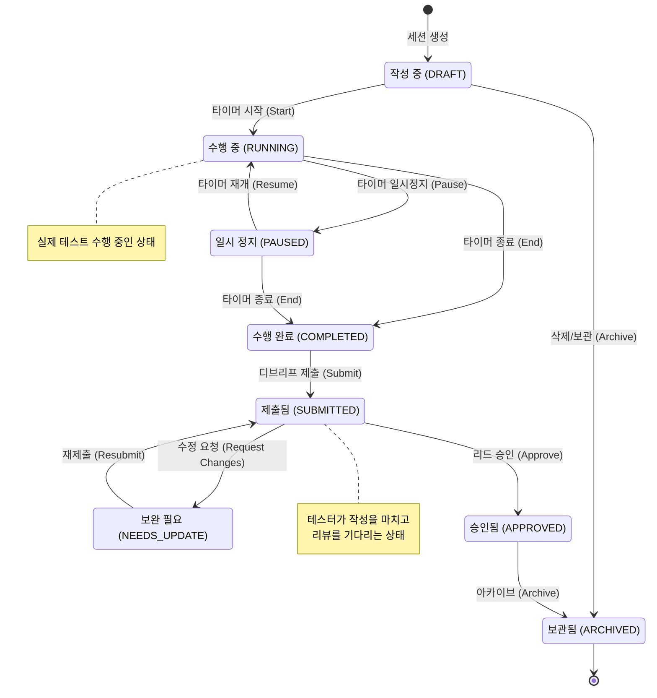

# 탐색 세션 상태 다이어그램 (Exploratory Session Status Diagram)

탐색 세션(Exploratory Session)의 생명주기와 각 상태 간의 전이 과정을 나타낸 다이어그램입니다.

## 상태 정의 설명

| 상태 | 설명 |
| :--- | :--- |
| **작성 중 (DRAFT)** | 세션이 생성되었으나 아직 테스트 수행이 시작되지 않은 상태입니다. |
| **수행 중 (RUNNING)** | 테스터가 실제 테스트를 수행 중이며 타이머가 작동하고 있는 상태입니다. |
| **일시 정지 (PAUSED)** | 테스트 수행 중 잠시 중단된 상태입니다. (회의, 식사 등) |
| **수행 완료 (COMPLETED)** | 테스트 수행이 종료되어 타이머가 멈춘 상태입니다. 디브리프 내용을 정리할 수 있습니다. |
| **제출됨 (SUBMITTED)** | 테스터가 모든 기록을 마치고 리드(Lead)에게 승인을 요청한 상태입니다. |
| **보완 필요 (NEEDS_UPDATE)** | 리드가 검토 후 내용 보완이나 추가 조사를 요청한 상태입니다. |
| **승인됨 (APPROVED)** | 리드가 세션의 결과와 디브리프 내용을 최종 승인한 상태입니다. |
| **보관됨 (ARCHIVED)** | 모든 프로세스가 완료되어 보관 처리된 상태입니다. |
