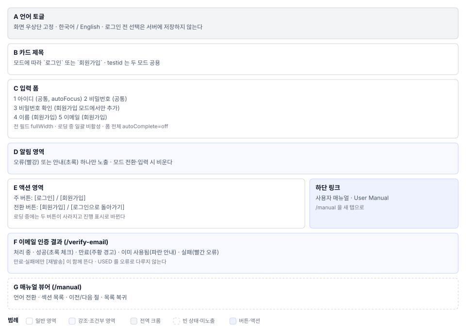

# 로그인·계정(S0) 화면정의

> 화면 ID **S0** · 상위 문서: [`01_로그인계정_업무프로세스.md`](01_로그인계정_업무프로세스.md)
> 라우트: `/login` · `/verify-email` · `/manual` · `/guides/{문서명}`
> 캡처(매뉴얼 `images/`): `01_login_empty.png` · `02_signup_empty.png` · `03_signup_filled.png` · `04_signup_complete.png` · `05_login_filled.png` · `18_user_menu_logout.png`

---

## 1. 화면 구성

S0은 서로 독립된 세 라우트로 이루어진다. 라우트마다 영역을 따로 정의한다.

### 1.1 라우트별 화면

| 라우트 | 화면 | 영역 |
|---|---|---|
| `/` `/login` | 로그인·회원가입 | A~E |
| `/verify-email?token=…` | 이메일 인증 결과 | F |
| `/manual` | 매뉴얼 뷰어 | G |

### 1.2 로그인 화면 영역

| 영역 | 이름 | 역할 |
|---|---|---|
| **A** | 언어 토글 | 화면 우상단 고정. 로그인 전에 언어를 바꾼다 |
| **B** | 카드 제목 | 모드에 따라 `로그인` / `회원가입` |
| **C** | 입력 폼 | 로그인 2필드 / 회원가입 5필드 |
| **D** | 알림 영역 | 오류(빨강) 안내(초록) 각 1개 |
| **E** | 액션 영역 | 주 버튼 + 모드 전환 버튼 + 매뉴얼 링크 |

---

## 2. 영역별 요소 정의

### 2.1 A. 언어 토글

| 요소 | 표시 | 동작 |
|---|---|---|
| 인라인 언어 토글 | 한국어 / English | 즉시 화면 문구 교체. 로그인 전이므로 서버에 저장하지 않는다 |

로그인 후의 언어 설정은 서버에 사용자별로 저장된다(S2 프로필). 이 화면의 선택은 그 값과 별개다.

### 2.2 B. 카드 제목

| 모드 | 문구 | i18n 키 |
|---|---|---|
| 로그인 | `로그인` | `login.title` |
| 회원가입 | `회원가입` | `register.title` |

이 두 모드에서 같다. 테스트는 이 요소의 **텍스트**로 모드를 판별한다.

### 2.3 C. 입력 폼

| # | 필드 | 라벨 키 | 타입 | 모드 | 필수 |
|---|---|---|---|---|---|
| 1 | 아이디 | `login.username` | text | 공통 | ○ |
| 2 | 비밀번호 | `login.password` | password | 공통 | ○ |
| 3 | 비밀번호 확인 | `register.confirm_password` | password | 가입 | ○ |
| 4 | 이름 | `register.name` | text | 가입 | — |
| 5 | 이메일 | `register.email` | text | 가입 | — |

**표시 규칙**

- 전 필드 `fullWidth`, 세로 간격은 MUI `margin="normal"`
- 로딩 중 전 필드 `disabled`
- 아이디 칸에 `autoFocus`
- 폼 전체 `autoComplete="off"`
- 이메일은 `type="email"`이 아니라 `text`다. 형식 검사를 화면에서 하지 않는다

**화면이 직접 거르는 오류 2개**

| 조건 | 문구 | i18n 키 |
|---|---|---|
| 아이디·비밀번호·비밀번호 확인 중 빈 값 | `모든 필드를 입력해주세요.` | `validation.required.all` |
| 비밀번호 ≠ 비밀번호 확인 | `비밀번호가 일치하지 않습니다.` | `validation.password.mismatch` |

이름·이메일이 비어도 화면은 통과시킨다. 서버 규칙에 맡기는 부분이다.

### 2.4 D. 알림 영역

| 종류 | 색 | 언제 | 내용 |
|---|---|---|---|
| 오류 | `error`(빨강) | 검증 실패·서버 거부·예외 | 서버 메시지 우선, 없으면 일반 문구 |
| 안내 | `success`(초록) | 회원가입 성공 | `회원가입이 완료되었습니다. 로그인 해주세요.` |

두 알림은 동시에 하나만 보인다. 모드 전환·재제출 시 둘 다 비운다.

### 2.5 E. 액션 영역

| 모드 | 주 버튼 | 전환 버튼 | 하단 링크 |
|---|---|---|---|
| 로그인 | `[로그인]` `contained/primary` `type=submit` `login-submit-button` | `[회원가입]` `secondary` `login-switch-to-register-button` | 매뉴얼 |
| 회원가입 | `[회원가입]` `contained/primary` `type=submit` `register-submit-button` | `[로그인으로 돌아가기]` `register-switch-to-login-button` | 매뉴얼 |

**로딩 중에는 버튼 두 개가 사라지고 원형 진행 표시로 바뀐다**. 버튼을 비활성만 하지 않고 교체하는 구조라, 테스트에서 로딩 상태를 버튼 존재 여부로 판별한다.

| 요소 | 표시 | 동작 |
|---|---|---|
| 매뉴얼 링크 | `사용자 매뉴얼 User Manual` — 작은 크기, 흐린 색 | `/manual`을 **새 탭**으로 |

문구에 한국어와 영어를 함께 넣었다. 언어 설정과 무관하게 어느 쪽 사용자도 알아보게 하려는 처리다.

### 2.6 F. 이메일 인증 결과 화면

`/verify-email?token=…` 진입 즉시 토큰을 검증하고 결과 하나를 그린다.

| 상태 | 판정 | 아이콘 | 색 | 제목 | 후속 |
|---|---|---|---|---|---|
| 처리 중 | 응답 대기 | 진행 표시 | — | `이메일 인증 처리 중...` | — |
| 성공 | `success: true` | 체크 원 80px | `success.main` | `인증 완료!` | `[로그인으로]` |
| 만료 | `error: EXPIRED` | 경고 80px | `warning.main` | `링크 만료` | `[재발송]` `[로그인으로]` |
| 이미 사용됨 | `error: USED` | 정보 80px | `info.main` | `이미 사용됨` | `[로그인으로]` |
| 실패 | `INVALID` `ERROR` 그 외 | 오류 80px | `error.main` | `인증 실패` | `[재발송]` `[로그인으로]` |

근거:. **`USED`를 오류로 다루지 않는다.** 이미 인증을 마친 사용자가 링크를 다시 눌렀을 때 실패 화면을 보이면 무엇이 잘못된 것처럼 읽힌다.

`token` 파라미터가 없으면 검증을 시작하지 않는다.

### 2.7 G. 매뉴얼 뷰어

`/manual` 은 인증 없이 열리는 문서 뷰어다. 한국어판과 영문판을 같은 화면에서 전환한다.

| 요소 | 역할 |
|---|---|
| 언어 전환 | 한국어 ↔ English |
| 섹션 목록 | 매뉴얼 18개 절 목록 |
| 절 이동 | 이전 절 다음 절 |
| 목록 복귀 | 섹션 목록으로 |

본문은 `GET /api/manual`이 돌려준 마크다운을 렌더한다. 소스는.

---

## 3. 상태별 화면

| 상태 | 트리거 | 화면 |
|---|---|---|
| 로그인 기본 | `/login` 진입 | A·B(로그인)·C(2필드)·E |
| 회원가입 | 전환 버튼 | C가 5필드로 늘어난다 |
| 로딩 | 제출 | 전 필드 비활성 + 버튼 → 진행 표시 |
| 검증 실패 | 빈 값·비밀번호 불일치 | D 오류. 서버 호출 없음 |
| 서버 거부 | 인증 실패·중복 아이디 | D 오류(서버 메시지) |
| 가입 성공 | 등록 완료 | 로그인 모드 + D 안내. 아이디·이름·이메일 유지 |
| 통신 실패 | 서버 미도달 | D 오류 `Failed to fetch` |
| 인증 링크 진입 | `/verify-email` | F 5상태 중 하나 |

---

## 4. 예시 데이터

매뉴얼 캡처에 쓰인 값이다. 실제 운영 계정을 문서·캡처에 싣지 않는다.

| 항목 | 값 | 출처 |
|---|---|---|
| 데모 관리자 | `admin` / `admin123` | — 배포 직후 변경 대상 |
| 캡처용 계정 | 매뉴얼 1-2절 회원가입 폼 캡처 | `images/03_signup_filled.png` |

---

## 5. 권한별 화면 차이

인증 전이므로 프로젝트 권한이 적용되지 않는다. 갈리는 것은 인증 상태뿐이다.

| 요소 | 미인증 | 인증 |
|---|---|---|
| 로그인 폼 | 노출 | 이 화면에 도달하지 않는다 |
| 매뉴얼 링크 | 노출 | 헤더 `?` 버튼으로 같은 화면 |
| `/verify-email` | 노출 | 노출(인증 상태와 무관) |
| `/manual` | 노출 | 노출 |

---

## 6. 화면 문구 규정

| 위치 | 문구 | i18n 키 |
|---|---|---|
| 제목 | `로그인` / `회원가입` | `login.title` `register.title` |
| 주 버튼 | `로그인` / `회원가입` | `login.button` `register.button` |
| 전환 | `회원가입` / `로그인으로 돌아가기` | `register.switch` `login.back` |
| 가입 성공 | `회원가입이 완료되었습니다. 로그인 해주세요.` | `register.success` |
| 로그인 실패 | `로그인에 실패했습니다.` | `login.error.failed` |
| 로그인 오류 | `로그인 중 오류가 발생했습니다.` | `login.error.general` |
| 가입 오류 | `회원가입 중 오류가 발생했습니다.` | `register.error.general` |
| 매뉴얼 링크 | `사용자 매뉴얼 User Manual` | `login.manualLink` + 고정 영문 |

**규칙.** 새 문구를 넣을 때 `t("키", "한국어")` 형태를 지킨다. 폴백 없이 키만 쓰면 번역 누락 시 키가 화면에 그대로 나온다. 시드 추가까지 함께 하는 절차는 `testcasecraft-i18n-audit` 스킬에 있다.

**인증 실패 사유를 나누지 않는다.** 아이디가 없는 것과 비밀번호가 틀린 것을 같은 문구로 답한다. 계정 존재 여부를 알려주지 않기 위한 처리다.

---

## 7. 04 요건 대조

| 04의 요건 | 이 문서의 영역 |
|---|---|
| S0-01 로그인 | C 1·2 E 주 버튼 |
| S0-02 모드 전환 | B C 3~5 E 전환 버튼 |
| S0-03 화면 선검증 | 2.3절 오류 2개 D |
| S0-04 인증 결과 4상태 | F |
| S0-05 로그인 전 매뉴얼 | E 하단 링크 G |
| S0-06 로그아웃 | S2 헤더(이 화면은 도착지) |
| S0-07 언어 토글 | A |
