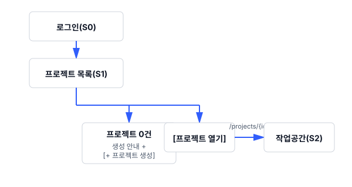

# TestcaseCraft 전체 업무프로세스

> 작성: 2026-08-03 21:42 KST · 기준 버전 **v1.0.102** · 기준 커밋 `73340e4f`
> 이 문서는 화면 12개를 관통하는 업무 흐름·권한·라우트의 **정본**이다. 화면별 문서는 이 문서를 참조하고, 값을 복사해 두지 않는다.
> 상위 문서: [`README.md`](README.md)

---

## 1. 제품이 맡는 업무

테스트 케이스를 쓰고, 묶어서 실행하고, 결과를 남기고, 결과를 보고서로 내보내는 한 사이클을 한 제품 안에서 처리한다. 여기에 자동화 도구가 만든 결과 파일을 같은 통계로 흡수하고, 문서 기반 질의(RAG)와 탐색 테스트(SBTM)를 곁에 둔다.

| 축 | 담당 화면 | 산출물 |
|---|---|---|
| 케이스 자산 관리 | S4 | 폴더·케이스 트리, 케이스 버전, 첨부 |
| 실행 계획 | S5 | 테스트 플랜(케이스 묶음) |
| 실행과 기록 | S6 | 테스트 실행, 케이스별 결과(PASS/FAIL/BLOCKED/NOTRUN) |
| 결과 해석·보고 | S3 · S7 | 통계·추이, QA 총평, Excel·PDF·CSV 보고서 |
| 자동화 결과 흡수 | S8 | JUnit 결과 묶음, 케이스 매칭 |
| 지식 보조 | S9 | 임베딩된 문서, 출처 인용 답변 |
| 비정형 테스트 | S10 | 차터, 세션 노트, 세션 보고서 |
| 조직·계정 운영 | S0 · S1 · S11 | 사용자, 조직, 프로젝트, 시스템 설정 |

---

## 2. 업무 단계 7개

제품을 처음 도입한 조직이 실제로 밟는 순서다. 단계마다 "무엇이 있으면 다음으로 넘어가는가"를 함께 적었다.

| # | 단계 | 담당 화면 | 다음 단계로 넘어가는 조건 | 근거 |
|---|---|---|---|---|
| 1 | **계정 확보** | S0 | 로그인 성공. 이메일 인증은 알림 수신에만 필요하고 진입을 막지 않는다 | `Login.jsx` · `EmailVerificationController.java` |
| 2 | **프로젝트 개설** | S1 | 프로젝트 1건 + 프로젝트 코드 확정(`SMP-001` 형태 표시 ID의 접두어가 된다) | `ProjectManager.jsx:131-133` · 매뉴얼 §2-1 |
| 3 | **케이스 작성** | S4 | 폴더 구조 + 케이스 1건 이상 저장 | `TestCaseController.java` |
| 4 | **플랜 구성** | S5 | 플랜에 케이스가 담김. 플랜 없이 실행을 만들 수도 있다(플랜 미지정 실행) | `TestExecution.java:48`(`testPlanId` nullable) |
| 5 | **실행과 결과 기록** | S6 | 실행 안의 케이스에 결과가 들어감. 결과 없는 실행도 유지된다 | `TestResultStatus.java` · 매뉴얼 §8-1 |
| 6 | **결과 해석·보고** | S3 · S7 | 통계 조회 가능. 실행 단위 QA 총평 작성은 선택 | `TestExecution.java:78-81`(`qaSummary`) |
| 7 | **회귀·확장** | S4 → S5 → S6 | 케이스 추가·수정 후 새 플랜·새 실행으로 되돌아온다 | 매뉴얼 §5-5(프로젝트 간 이동·복사) |

**단계 4는 건너뛸 수 있다.** `TestExecution.testPlanId`가 필수가 아니므로 플랜 없이 실행을 만드는 경로가 열려 있다. 화면에서도 실행 생성 폼의 플랜 선택에 "플랜 없음" 옵션이 있다(`data-testid="execution-plan-option-none"`).

**단계 6은 닫히지 않는다.** 결과는 누적되고 통계는 기간 필터로 다시 계산된다. 완료로 봉인되는 단계가 아니다.

### 자동화·탐색·지식 축의 진입 지점

세 축은 위 7단계와 나란히 놓인다. 순서상 나중이 아니라, 언제든 들어올 수 있는 별도 입구다.

| 축 | 언제 들어오는가 | 7단계와의 접점 |
|---|---|---|
| S8 자동화 | 자동화 스위트가 결과 파일을 만든 뒤 | 업로드 시 케이스와 매칭되어 S3·S7 통계에 합류 |
| S9 RAG | 프로젝트 문서가 준비된 뒤 | S4 케이스 작성 중 관련 문서 추천·연결 |
| S10 탐색 세션 | 명세가 얇아 케이스를 미리 쓸 수 없을 때 | 세션에서 나온 발견이 S4 케이스로 승격 |

---

## 3. 화면 전이

### 3.1 최초 진입



### 3.2 작업공간 안의 영역 이동

S2가 껍데기를 유지한 채 본문만 갈아 끼운다. 영역 목록은 `navigation/projectNavItems.js`의 배열 하나로 정의되고, 가로 탭과 좌측 메뉴가 같은 배열을 읽는다.

```
┌ S2 껍데기 (헤더 · 브레드크럼 · 영역 이동) ─────────────────┐
│                                                            │
│  S3 대시보드   S4 테스트케이스   S5 플랜   S6 실행          │
│  S7 결과   S8 자동화   S9 RAG*   S10 탐색 세션*             │
│                                                            │
└────────────────────────────────────────────────────────────┘
     * RAG·탐색 세션은 조건부 노출 (§4)
```

### 3.3 실행 파이프라인의 왕복

```
S5 플랜 상세 ──[실행 만들기]──→ S6 실행 상세
                                    │
                     케이스 행 클릭 ▼
              S6 결과 입력 (.../testcases/{tcId}/result)
                                    │
                        결과 저장 ▼
              S3 대시보드 · S7 결과 통계에 반영
```

플랜에서 실행을 만들면 그 플랜의 케이스 묶음을 물려받는다. 결과를 저장하면 대시보드와 결과 화면의 집계가 같은 `TestResult` 테이블을 다시 읽는다. 별도 집계 테이블을 쓰지 않으므로 화면 간 숫자가 갈라지지 않는다.

### 3.4 상시 진입 경로

헤더에서 언제든 열리는 경로다. 어느 화면에 있어도 사라지지 않는다.

| 목적지 | 진입 | 라우트 |
|---|---|---|
| 프로젝트 목록 | 좌측 로고 클릭 | `/projects` |
| 다른 프로젝트 | `[프로젝트 선택]` 드롭다운 | 현재 영역 유지 + 프로젝트만 교체 |
| 북마크 | 헤더 `☆` | `/projects/{id}/bookmarks` |
| 사용자 매뉴얼 | 헤더 `?` | `/manual` (새 탭) |
| 프로필 다이얼로그 | 아바타 → 프로필 | 라우트 이동 없음(다이얼로그) |
| 관리 메뉴 | `[관리 메뉴 ▾]` (ADMIN·MANAGER) | `/organizations` 외 |

---

## 4. 조건부로 노출되는 영역

두 영역은 항상 보이지 않는다. 숨김의 이유가 다르므로 함께 다루지 않는다.

| 영역 | 노출 조건 | 판정 위치 | 꺼졌을 때 |
|---|---|---|---|
| **S9 RAG 문서** | RAG 보조 서비스가 살아 있을 때 | `useRAG()`의 `isRagEnabled` (`App.jsx:263`) | 영역 항목 자체가 목록에서 빠진다 |
| **S10 탐색 세션** | 서버 설정 `showExploratorySessionTab` | `ConfigController.java:35,58` ← 환경 변수 `SHOW_EXPLORATORY_SESSION_TAB` | 같음 |

**영역 번호는 고정 번호가 아니다.** 본문 스위치가 "보이는 항목 중 몇 번째"(`tabIndex`)로 동작하므로, RAG가 꺼지면 그 뒤 항목의 번호가 한 칸 앞으로 당겨진다. `App.jsx:267-268`의 `EXPLORATORY_TAB` 계산과 `App.jsx:614-620`의 상한 보정이 이 구조에서 나왔다. 영역을 새로 끼워 넣을 때 손봐야 하는 지점이므로 S2 문서에 따로 적었다.

---

## 5. 권한 모델 (정본)

권한 축이 셋이다. 서로 대체하지 않고 겹쳐 적용된다.

### 5.1 시스템 권한 — `User.role`

| 값 | 무엇이 열리는가 | 판정 |
|---|---|---|
| `ADMIN` | 전사 대시보드 + 관리 메뉴 전체 + 모든 프로젝트 데이터 | `App.jsx:815` · `SecurityContextUtil.isSystemAdmin()` |
| `MANAGER` | 관리 메뉴 진입(전사 대시보드는 ADMIN 전용) | `App.jsx:810` |
| 그 외(`null` 포함) | 프로젝트 권한만 적용 | `ProjectManager.jsx:131-133` |

`role`이 비어 있는 사용자도 정상 사용자다. 독립 프로젝트 생성은 인증만 확인하고 `role` 값을 보지 않는다 — 과거에 존재하지 않는 `"USER"` 값을 허용 목록에 두어 `role=null` 사용자가 막혔던 이력이 주석으로 남아 있다(`ProjectManager.jsx:131-133`).

### 5.2 프로젝트 권한 — `ProjectUser.roleInProject`

6종이다(`model/ProjectUser.java:58-64`). 같은 사람이 프로젝트마다 다른 권한을 가진다.

| 값 | 한국어 | 편집 | 결과 기록 | 멤버·설정 |
|---|---|---|---|---|
| `PROJECT_MANAGER` | 프로젝트 매니저 | ○ | ○ | ○ |
| `LEAD_DEVELOPER` | 리드 개발자 | ○ | ○ | ○ |
| `DEVELOPER` | 개발자 | ○ | ○ | — |
| `CONTRIBUTOR` | 기여자 | ○ | ○ | — |
| `TESTER` | 테스터 | — | **○** | — |
| `VIEWER` | 뷰어 | — | — | — |

세 술어가 판정을 담당한다. 화면의 버튼 노출은 모두 이 셋으로 환원된다.

| 술어 | 허용 역할 | 정의 |
|---|---|---|
| `hasManagementRole` | PM · LEAD | `ProjectUserRepository.java:82-85` |
| `hasEditRole` | PM · LEAD · DEVELOPER · CONTRIBUTOR | `ProjectUserRepository.java:87-92` |
| `hasResultEntryRole` | 위 4종 + **TESTER** | `ProjectUserRepository.java:94-99` |

**TESTER가 편집은 못 하고 결과 기록은 되는 것이 설계 의도다.** 케이스·플랜을 고칠 권한은 없지만 결과 기록은 본업이라는 판단이 코드 주석으로 명시되어 있다(`ProjectUserRepository.java:93` · `ProjectSecurityService.java:124-127`).

시스템 `ADMIN`은 프로젝트 권한 검사를 통과한다 — `canEditProject`가 `isSystemAdmin() || hasEditRole()` 형태다(`ProjectSecurityService.java:120-122`).

### 5.3 조직 권한 — `OrganizationUser`

`OWNER` · `ADMIN` · `MEMBER` 3종이다(`utils/roleUtils.js:1-25`). 조직 상세 화면의 멤버·그룹 관리에만 쓰이고, 프로젝트 데이터 접근 판정에는 들어가지 않는다. 조직 상세의 편집 판정은 조직 `OWNER`/`ADMIN` 또는 시스템 `ADMIN`이다(`OrganizationDetail.jsx:117-122`).

### 5.4 리소스 → 프로젝트 투영

케이스 ID·첨부 ID·JUnit 결과 ID처럼 프로젝트 ID가 직접 없는 리소스는 **소속 프로젝트를 조회한 뒤** 위 술어를 적용한다. 17개 리소스가 같은 형태를 공유한다.

```
리소스ID → projectId 조회 → 권한 술어 적용 → 없으면 거부(fail-closed)
```

`ProjectSecurityService.java:135-142`의 `projectPermission()`이 이 형태를 한 곳으로 모았다. 리소스가 없을 때 `false`로 닫는 것이 규약이며, 주석은 `orElse(true)` 오타를 막으려는 의도를 밝히고 있다.

---

## 6. 라우트 정본

SPA 라우트다. `/*`가 작업공간 껍데기로 들어가고, 그 안에서 경로를 다시 판별해 본문을 고른다(`App.jsx:500-620`).

### 6.1 인증 밖 / 전역

| 경로 | 화면 | 보호 |
|---|---|---|
| `/login` · `/` | S0 로그인·회원가입 | 없음 |
| `/verify-email` | S0 이메일 인증 결과 | 없음 (`App.jsx:1552`) |
| `/manual` | S0 매뉴얼 뷰어 | 없음 (`App.jsx:1644`) |
| `/guides/:guideName` | 가이드 문서 뷰어 | 없음 (`App.jsx:1643`) |
| `/projects` | S1 프로젝트 목록 | 로그인 |
| `/dashboard` | S3 전사 대시보드 | 로그인 + `ADMIN` |
| `/jira-redirect/:issueKey` | JIRA 이슈 → 케이스 재이동 | 로그인 |

### 6.2 프로젝트 작업공간

| 경로 | 본문 | 영역 판정 |
|---|---|---|
| `/projects/{projectId}` | S3 프로젝트 대시보드 | 기본 |
| `/projects/{projectId}/testcases` | S4 트리 + 목록 | `isTestCasesSection()` |
| `/projects/{projectId}/testcases/{testCaseId}` | S4 케이스 상세 폼 | `App.jsx:519-521` |
| `/projects/{projectId}/testplans` | S5 플랜 목록 | `isTestPlansSection()` |
| `/projects/{projectId}/testplans/new` · `/{testPlanId}` | S5 플랜 폼 | `App.jsx:527-537` |
| `/projects/{projectId}/executions` | S6 실행 목록 | `isTestExecutionsSection()` (`App.jsx:424-431`) |
| `/projects/{projectId}/executions/new` · `/{executionId}` | S6 실행 폼·상세 | `App.jsx:539-549` |
| `/projects/{projectId}/executions/{executionId}/testcases/{testCaseId}/result` | S6 결과 입력 | `isCaseResultRoute` (`App.jsx:421-422`) |
| `/projects/{projectId}/results` | S7 결과 통계 | `isTestResultsSection()` (`App.jsx:446-455`) |
| `/projects/{projectId}/executions?viewType=…` | S7 결과 통계 | 같은 술어. **쿼리 파라미터가 영역을 가른다** |
| `/projects/{projectId}/automation` · `/junit` | S8 자동화 목록 | `isAutomationTestsSection()` (`App.jsx:457-461`) |
| `/projects/{projectId}/automation-results/{testResultId}` | S8 자동화 결과 상세 | `App.jsx:1619-1625` |
| `/projects/{projectId}/junit-results/{testResultId}` | S8 JUnit 결과 상세 | `App.jsx:1602-1608` |
| `/projects/{projectId}/rag` | S9 RAG 문서 | `isRagSection()` |
| `/projects/{projectId}/exploratory` | S10 탐색 세션 | `isExploratorySection()` |
| `/projects/{projectId}/bookmarks` | S2 북마크 | `App.jsx:1635-1641` |

`/projects/{id}/executions`는 쿼리 파라미터 유무로 S6과 S7이 갈린다(`viewType`이 있으면 결과 영역). 같은 경로가 두 영역을 가리키는 유일한 지점이므로 링크를 만들 때 주의한다.

### 6.3 관리자 경로

| 경로 | 화면 | 헤더 메뉴 노출 |
|---|---|---|
| `/organizations` · `/organizations/{id}` | S11 조직 | ○ |
| `/users` | S11 사용자 관리 | ○ |
| `/mail-settings` | S11 메일 설정 | ○ |
| `/llm-config` | S11 LLM 설정 | ○ |
| `/scheduler` | S11 스케줄러 | ○ |
| `/translation-management` | S11 번역 관리 | **×** — 메뉴에서 주석 처리(`App.jsx:951-955`), URL 직접 진입 |

---

## 7. 데이터 모델 요약

화면이 다루는 주요 엔티티다. 전체 목록은 `model/` 디렉터리에 있다.

```
Organization ──< Project ──< ProjectUser >── User
                    │
                    ├──< TestCase ──< TestStep
                    │        ├──< TestCaseVersion
                    │        ├──< TestCaseAttachment
                    │        └──  TestCaseMoveAuditLog
                    │
                    ├──< TestPlan ──┐
                    │               │
                    ├──< TestExecution (testPlanId nullable)
                    │        └──< TestResult ──< TestResultAttachment
                    │                    └──  TestResultEdit
                    │
                    ├──< JunitTestResult ──< JunitTestSuite ──< JunitTestCase
                    │
                    ├──< TestCharter ──< TestSession ──< TestSessionNote
                    │                          ├──< TestSessionBug
                    │                          ├──< TestSessionInterruption
                    │                          └──  TestSessionApproval
                    │
                    └──< rag/(문서·청크·임베딩)

User ──< BookmarkCollection ──< BookmarkItem      (개인 자산)
User ──  ServiceApiKey · RefreshToken · EmailVerificationToken
```

### 식별자 두 종류

| 종류 | 형태 | 쓰이는 곳 |
|---|---|---|
| UUID | `dca4a2a4-…` | 라우트·API·외부 연동. 폼 메타데이터에 풀 문자열로 노출된다 |
| 표시 ID | `SHOP-112` = `프로젝트코드-순차번호` | 화면·알림·검색. 이력은 `DisplayIdHistory`에 남는다 |

---

## 8. 전 화면 공통 규칙

| # | 규칙 | 근거 |
|---|---|---|
| G1 | **화면별 사용자 설정은 서버에 사용자 단위로 저장한다.** 입력 모드·필드 표시 토글·메뉴 구조·테마가 대상이며, 다른 PC에서 로그인해도 복원된다 | 매뉴얼 §3 · §4-5 · §13-7 |
| G2 | **브라우저에만 남기는 설정도 있다.** 트리 뷰 모드, 이전 결과 노트 보기 형식이 그렇다. 기기마다 달라도 되는 값만 여기에 둔다 | 매뉴얼 §4-4 · §8-1 |
| G3 | **시간 표시는 사용자 시간대 설정을 따른다.** 기본값 `UTC` | 매뉴얼 §13-3 |
| G4 | **권한이 없는 동작은 버튼을 숨긴다.** 눌러 놓고 거부하지 않는다. 서버가 거부한 경우에는 서버 메시지를 화면 하단에 그대로 띄운다 | 매뉴얼 §4-6 · §5-5 |
| G5 | **파괴적 동작은 대상을 표로 보여주고 확인받는다.** 삭제 대상의 ID·이름을 확인 다이얼로그에 싣는다 | 매뉴얼 §4-6 · `data-testid="project-delete-confirm-button"` 외 |
| G6 | **부분 적용을 만들지 않는다.** 다중 이동은 한 요청으로 보내고 하나라도 실패하면 전체를 되돌린다 | 매뉴얼 §5-2 |
| G7 | **자격증명 값을 화면에 되돌려 보여주지 않는다.** API 토큰은 발급 직후 한 번만 전체가 보인다 | 매뉴얼 §13-6 |
| G8 | **자동 갱신은 화면이 보일 때만 돈다.** 실행 목록은 약 20초 주기이고, 탭이 비활성이면 멈춘다 | 매뉴얼 §8 |
| G9 | **모든 상호작용 요소에 `data-testid`를 붙인다.** 단위·E2E 테스트가 클래스명이나 문구가 아니라 이 값으로 요소를 잡는다 | `components/*.test.jsx` |
| G10 | **화면 문구는 `t("키", "한국어 폴백")` 형태로 쓴다.** 하드코딩 한국어는 영어 모드에서 그대로 새어 나온다 | `testcasecraft-i18n-audit` 하네스 |

---

## 9. 문서와 코드의 동기화

| 무엇이 바뀌면 | 어디를 고치는가 |
|---|---|
| 라우트 | 이 문서 §6 → 해당 화면 `01`·`02` |
| 권한 술어·역할 | 이 문서 §5 → 전 화면 `01 §권한`·`02 §권한별 차이` |
| 영역 목록·순서 | `projectNavItems.js` → S2 `02`·`03` → 이 문서 §3.2 |
| 화면 요소 | 해당 화면 `02`·`03`·`04` 세 문서 |
| REST 계약 | 해당 화면 `03 §API` |
| 기능 플래그 | 이 문서 §4 → 해당 화면 `01 §전제` |

화면을 새로 만들면 이 문서 §2 단계표와 §6 라우트 표에 행을 추가하고, `README.md` §2 화면 목록에 ID를 새로 부여한다.
