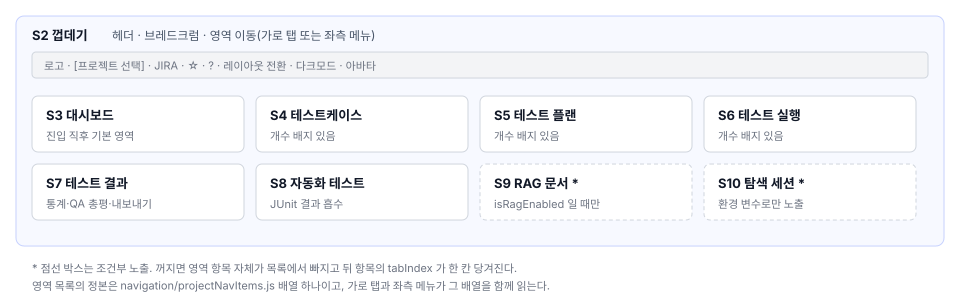
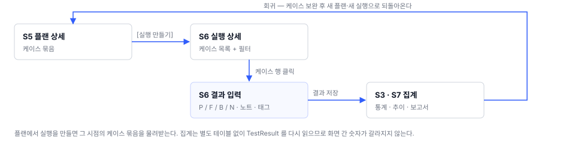
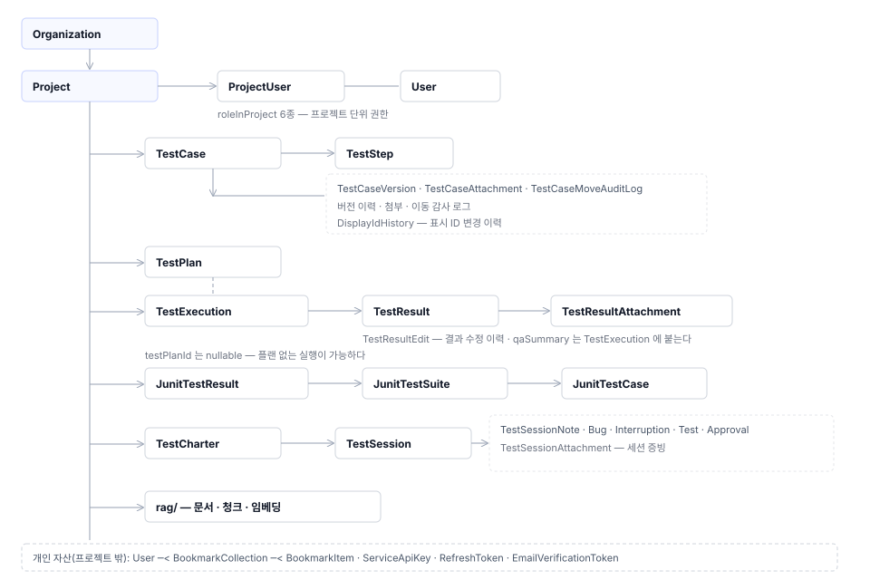

# TestcaseCraft 전체 업무프로세스

> 작성 2026-08-03 · 기준 버전 **v1.0.102**
> 이 문서는 화면 12개를 관통하는 업무 흐름·권한·라우트의 **정본**이다. 화면별 문서는 이 문서를 참조하고, 값을 복사해 두지 않는다.
> 상위 문서: [`README.md`](README.md)

---

## 1. 제품이 맡는 업무

테스트 케이스를 쓰고, 묶어서 실행하고, 결과를 남기고, 결과를 보고서로 내보내는 한 사이클을 한 제품 안에서 처리한다. 여기에 자동화 도구가 만든 결과 파일을 같은 통계로 흡수하고, 문서 기반 질의(RAG)와 탐색 테스트(SBTM)를 곁에 둔다.

| 축 | 담당 화면 | 산출물 |
|---|---|---|
| 케이스 자산 관리 | S4 | 폴더·케이스 트리, 케이스 버전, 첨부 |
| 실행 계획 | S5 | 테스트 플랜(케이스 묶음) |
| 실행과 기록 | S6 | 테스트 실행, 케이스별 결과(PASS/FAIL/BLOCKED/NOTRUN) |
| 결과 해석·보고 | S3 · S7 | 통계·추이, QA 총평, Excel·PDF·CSV 보고서 |
| 자동화 결과 흡수 | S8 | JUnit 결과 묶음, 케이스 매칭 |
| 지식 보조 | S9 | 임베딩된 문서, 출처 인용 답변 |
| 비정형 테스트 | S10 | 차터, 세션 노트, 세션 보고서 |
| 조직·계정 운영 | S0 · S1 · S11 | 사용자, 조직, 프로젝트, 시스템 설정 |

---

## 2. 업무 단계 7개

제품을 처음 도입한 조직이 실제로 밟는 순서다. 단계마다 "무엇이 있으면 다음으로 넘어가는가"를 함께 적었다.

| # | 단계 | 담당 화면 | 다음 단계로 넘어가는 조건 |
|---|---|---|---|
| 1 | **계정 확보** | S0 | 로그인 성공. 이메일 인증은 알림 수신에만 필요하고 진입을 막지 않는다 |
| 2 | **프로젝트 개설** | S1 | 프로젝트 1건 + 프로젝트 코드 확정(`SMP-001` 형태 표시 ID의 접두어가 된다) |
| 3 | **케이스 작성** | S4 | 폴더 구조 + 케이스 1건 이상 저장 |
| 4 | **플랜 구성** | S5 | 플랜에 케이스가 담김. 플랜 없이 실행을 만들 수도 있다(플랜 미지정 실행) |
| 5 | **실행과 결과 기록** | S6 | 실행 안의 케이스에 결과가 들어감. 결과 없는 실행도 유지된다 |
| 6 | **결과 해석·보고** | S3 · S7 | 통계 조회 가능. 실행 단위 QA 총평 작성은 선택 |
| 7 | **회귀·확장** | S4 → S5 → S6 | 케이스 추가·수정 후 새 플랜·새 실행으로 되돌아온다 |

**단계 4는 건너뛸 수 있다.** 실행에 플랜을 반드시 붙여야 하는 것은 아니다. 실행 생성 폼의 플랜 선택에 "플랜 없음" 항목이 있다.

**단계 6은 닫히지 않는다.** 결과는 누적되고 통계는 기간 필터로 다시 계산된다. 완료로 봉인되는 단계가 아니다.

### 자동화·탐색·지식 축의 진입 지점

세 축은 위 7단계와 나란히 놓인다. 순서상 나중이 아니라, 언제든 들어올 수 있는 별도 입구다.

| 축 | 언제 들어오는가 | 7단계와의 접점 |
|---|---|---|
| S8 자동화 | 자동화 스위트가 결과 파일을 만든 뒤 | 업로드 시 케이스와 매칭되어 S3·S7 통계에 합류 |
| S9 RAG | 프로젝트 문서가 준비된 뒤 | S4 케이스 작성 중 관련 문서 추천·연결 |
| S10 탐색 세션 | 명세가 얇아 케이스를 미리 쓸 수 없을 때 | 세션에서 나온 발견이 S4 케이스로 승격 |

---

## 3. 화면 전이

### 3.1 최초 진입

### 3.2 작업공간 안의 영역 이동

S2가 공통 레이아웃을 유지한 채 본문만 갈아 끼운다. 영역 목록은 한 곳에서만 정의하고, 가로 탭과 좌측 메뉴가 그 정의를 함께 쓴다.

### 3.3 실행 파이프라인의 왕복

플랜에서 실행을 만들면 그 플랜의 케이스 묶음을 물려받는다. 결과를 저장하면 대시보드와 결과 화면이 같은 결과 기록을 다시 읽어 집계한다. 따로 모아 둔 집계값을 쓰지 않으므로 화면 사이에 숫자가 갈라지지 않는다.

### 3.4 상시 진입 경로

헤더에서 언제든 열리는 경로다. 어느 화면에 있어도 사라지지 않는다.

| 목적지 | 진입 | 라우트 |
|---|---|---|
| 프로젝트 목록 | 좌측 로고 클릭 | `/projects` |
| 다른 프로젝트 | `[프로젝트 선택]` 드롭다운 | 현재 영역 유지 + 프로젝트만 교체 |
| 북마크 | 헤더 `☆` | `/projects/{id}/bookmarks` |
| 사용자 매뉴얼 | 헤더 `?` | `/manual` (새 탭) |
| 프로필 다이얼로그 | 아바타 → 프로필 | 라우트 이동 없음(다이얼로그) |
| 관리 메뉴 | `[관리 메뉴 ▾]` (시스템 ADMIN 전용) | `/organizations` 외 |

---

## 4. 조건부로 노출되는 영역

두 영역은 항상 보이지 않는다. 숨김의 이유가 다르므로 함께 다루지 않는다.

| 영역 | 노출 조건 | 꺼졌을 때 |
|---|---|---|
| **S9 RAG 문서** | RAG 보조 서비스가 살아 있을 때 | 영역 항목 자체가 목록에서 빠진다 |
| **S10 탐색 세션** | 환경 변수 `SHOW_EXPLORATORY_SESSION_TAB` 가 켜져 있을 때 | 같음 |

**영역의 순서 번호는 고정값이 아니다.** 화면은 "보이는 항목 중 몇 번째"로 현재 영역을 가리키므로, RAG가 꺼지면 그 뒤 항목의 번호가 한 칸 앞으로 당겨진다. 영역을 새로 끼워 넣을 때 함께 손봐야 하는 지점이라 S2 문서에 따로 적었다.

---

## 5. 권한 모델 (정본)

권한 축이 셋이다. 서로 대체하지 않고 겹쳐 적용된다.

### 5.1 시스템 권한

| 값 | 무엇이 열리는가 |
|---|---|
| `ADMIN` | 전사 대시보드 + 관리 메뉴 전체 + 모든 프로젝트 데이터 |
| `MANAGER` | 관리 메뉴를 허용하려던 등급이나 화면에서는 열리지 않는다(S11 정정 대상) |
| 값 없음 | 프로젝트 권한만 적용 |

**시스템 권한이 비어 있는 사용자도 정상 사용자다.** 독립 프로젝트 생성은 로그인만 확인하고 시스템 등급을 보지 않는다. 등급 허용 목록으로 막던 때에 등급 없는 사용자가 프로젝트를 못 만드는 문제가 있었다.

### 5.2 프로젝트 권한

6종이다. 같은 사람이 프로젝트마다 다른 권한을 가진다.

| 값 | 한국어 | 편집 | 결과 기록 | 멤버·설정 |
|---|---|---|---|---|
| `PROJECT_MANAGER` | 프로젝트 매니저 | ○ | ○ | ○ |
| `LEAD_DEVELOPER` | 리드 개발자 | ○ | ○ | ○ |
| `DEVELOPER` | 개발자 | ○ | ○ | — |
| `CONTRIBUTOR` | 기여자 | ○ | ○ | — |
| `TESTER` | 테스터 | — | **○** | — |
| `VIEWER` | 뷰어 | — | — | — |

화면의 버튼 노출은 세 가지 판정으로 환원된다.

| 판정 | 허용 역할 | 무엇을 가르는가 |
|---|---|---|
| 관리 권한 | PM · LEAD | 프로젝트 설정 변경, 멤버·역할 부여 |
| 편집 권한 | PM · LEAD · DEVELOPER · CONTRIBUTOR | 케이스·폴더·플랜·실행의 생성·수정·삭제 |
| 결과 기록 권한 | 위 4종 + **TESTER** | 케이스 결과(통과·실패·차단·미실행) 기록 |

**TESTER가 편집은 못 하고 결과 기록은 되는 것이 설계 의도다.** 케이스·플랜을 고칠 권한은 없지만 결과 기록은 본업이라는 판단이다.

시스템 `ADMIN`은 프로젝트 권한 검사를 통과한다. 프로젝트에 참여하지 않았어도 편집·기록이 열린다.

### 5.3 조직 권한

`OWNER` · `ADMIN` · `MEMBER` 3종이다. 조직 상세 화면의 멤버·그룹 관리에만 쓰이고, 프로젝트 데이터 접근 판정에는 들어가지 않는다. 조직 상세의 편집 판정은 조직 `OWNER`/`ADMIN` 또는 시스템 `ADMIN`이다.

### 5.4 주소에 프로젝트가 없는 대상

케이스·첨부·자동화 결과처럼 주소에 프로젝트가 드러나지 않는 대상도 **소속 프로젝트를 찾아 같은 판정을 적용한다.** 케이스 17종이 이 규칙을 공유한다.

대상 → 소속 프로젝트 확인 → 권한 판정 → 대상이 없으면 거부

**대상을 찾지 못하면 허용하지 않고 거부한다.** 존재하지 않는 대상에 접근했을 때 열어 주는 쪽으로 기울면 권한 우회 경로가 된다.

---

## 6. 라우트 정본

주소 하나가 화면 하나를 가리킨다. 작업공간 안에서는 공통 레이아웃을 유지한 채 경로에 따라 본문만 갈아 끼운다.

### 6.1 인증 밖 / 전역

| 경로 | 화면 | 보호 |
|---|---|---|
| `/login` · `/` | S0 로그인·회원가입 | 없음 |
| `/verify-email` | S0 이메일 인증 결과 | 없음 |
| `/manual` | S0 매뉴얼 뷰어 | 없음 |
| `/guides/:guideName` | 가이드 문서 뷰어 | 없음 |
| `/projects` | S1 프로젝트 목록 | 로그인 |
| `/dashboard` | S3 전사 대시보드 | 로그인 + `ADMIN` |
| `/jira-redirect/:issueKey` | JIRA 이슈 → 케이스 재이동 | 로그인 |

### 6.2 프로젝트 작업공간

| 경로 | 본문 |
|---|---|
| `/projects/{projectId}` | S3 프로젝트 대시보드 |
| `/projects/{projectId}/testcases` | S4 트리 + 목록 |
| `/projects/{projectId}/testcases/{testCaseId}` | S4 케이스 상세 폼 |
| `/projects/{projectId}/testplans` | S5 플랜 목록 |
| `/projects/{projectId}/testplans/new` · `/{testPlanId}` | S5 플랜 폼 |
| `/projects/{projectId}/executions` | S6 실행 목록 |
| `/projects/{projectId}/executions/new` · `/{executionId}` | S6 실행 폼·상세 |
| `/projects/{projectId}/executions/{executionId}/testcases/{testCaseId}/result` | S6 결과 입력 |
| `/projects/{projectId}/results` | S7 결과 통계 |
| `/projects/{projectId}/executions?viewType=…` | S7 결과 통계 — 쿼리 파라미터가 영역을 가른다 |
| `/projects/{projectId}/automation` · `/junit` | S8 자동화 목록 |
| `/projects/{projectId}/automation-results/{testResultId}` | S8 자동화 결과 상세 |
| `/projects/{projectId}/junit-results/{testResultId}` | S8 JUnit 결과 상세 |
| `/projects/{projectId}/rag` | S9 RAG 문서 |
| `/projects/{projectId}/exploratory` | S10 탐색 세션 |
| `/projects/{projectId}/bookmarks` | S2 북마크 |

`/projects/{id}/executions`는 쿼리 파라미터 유무로 S6과 S7이 갈린다(`viewType`이 있으면 결과 영역). 같은 경로가 두 영역을 가리키는 유일한 지점이므로 링크를 만들 때 주의한다.

### 6.3 관리자 경로

| 경로 | 화면 | 헤더 메뉴 노출 |
|---|---|---|
| `/organizations` · `/organizations/{id}` | S11 조직 | ○ |
| `/users` | S11 사용자 관리 | ○ |
| `/mail-settings` | S11 메일 설정 | ○ |
| `/llm-config` | S11 LLM 설정 | ○ |
| `/scheduler` | S11 스케줄러 | ○ |
| `/translation-management` | S11 번역 관리 | **×** — 메뉴에 없다. 주소를 직접 입력해 들어간다 |

---

## 7. 데이터 모델 요약

화면이 다루는 주요 개념과 그 관계다.

### 식별자 두 종류

| 종류 | 형태 | 쓰이는 곳 |
|---|---|---|
| UUID | `dca4a2a4-…` | 주소·외부 연동. 케이스 폼의 메타데이터에 전체 문자열로 노출된다 |
| 표시 ID | `SHOP-112` = `프로젝트코드-순차번호` | 화면·알림·검색. 변경 이력을 따로 남긴다 |

---

## 8. 전 화면 공통 규칙

| # | 규칙 | 관련 매뉴얼 절 |
|---|---|---|
| G1 | **화면별 사용자 설정은 서버에 사용자 단위로 저장한다.** 입력 모드·필드 표시 토글·메뉴 구조·테마가 대상이며, 다른 PC에서 로그인해도 복원된다 | 3절 · 4-5절 · 13-7절 |
| G2 | **브라우저에만 남기는 설정도 있다.** 트리 뷰 모드, 이전 결과 노트 보기 형식이 그렇다. 기기마다 달라도 되는 값만 여기에 둔다 | 4-4절 · 8-1절 |
| G3 | **시간 표시는 사용자 시간대 설정을 따른다.** 기본값은 `UTC` | 13-3절 |
| G4 | **권한이 없는 동작은 버튼을 숨긴다.** 눌러 놓고 거부하지 않는다. 서버가 거부한 경우에는 그 안내를 화면 하단에 그대로 띄운다 | 4-6절 · 5-5절 |
| G5 | **파괴적 동작은 대상을 보여주고 확인받는다.** 삭제 대상의 ID·이름을 확인 창에 싣는다 | 4-6절 |
| G6 | **부분 적용을 만들지 않는다.** 여러 건을 옮길 때 하나라도 실패하면 전체를 되돌린다 | 5-2절 |
| G7 | **자격증명 값을 화면에 되돌려 보여주지 않는다.** 연결 키는 발급 직후 한 번만 전체가 보인다 | 13-6절 |
| G8 | **자동 갱신은 화면이 보일 때만 돈다.** 실행 목록은 약 20초 주기이고, 다른 탭을 보는 동안에는 멈춘다 | 8절 |
| G9 | **화면 문구는 한국어와 영어 양쪽에서 같은 자리를 채운다.** 번역을 등록하지 않은 문구는 영어 모드에서 한국어로 새어 나온다 | 13-3절 · 17-8절 |
| G10 | **조건부 영역은 숨기되 자리를 옮기지 않는다.** 노출이 갈리는 영역이 사라져도 나머지 영역의 순서는 그대로 둔다 | 11절 · 12절 |

---

## 9. 문서 갱신 규칙

| 무엇이 바뀌면 | 어디를 고치는가 |
|---|---|
| 라우트 | 이 문서 6절 → 해당 화면 `01`·`02` |
| 권한 판정·역할 | 이 문서 5절 → 전 화면 `01` 권한 절 · `02` 권한별 차이 절 |
| 영역 목록·순서 | S2 `02`·`03` → 이 문서 3.2절 |
| 화면 요소 | 해당 화면 `02`·`03`·`04` 세 문서 |
| 서버와 주고받는 정보 | 해당 화면 `03` |
| 조건부 노출 조건 | 이 문서 4절 → 해당 화면 `01` 전제 절 |

화면을 새로 만들면 이 문서 2절 단계표와 6절 라우트 표에 행을 추가하고, `README.md` 2절 화면 목록에 ID를 새로 부여한다.
