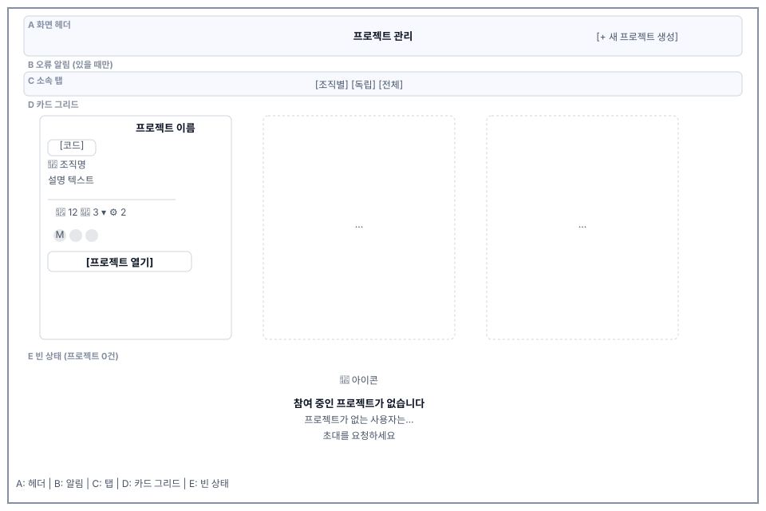

# 프로젝트(S1) 화면정의

> 화면 ID **S1** · 상위 문서: [`01_프로젝트_업무프로세스.md`](01_프로젝트_업무프로세스.md)
> 라우트: `/projects`
> 캡처: 매뉴얼 `images/` 의 `10_projects_empty.png` · `11_project_create_dialog.png` · `12_project_create_filled.png` · `13_project_created.png`

---

## 1. 화면 구성

| 영역 | 이름 | 역할 |
|---|---|---|
| **A** | 화면 헤더 | 제목 `프로젝트 관리` + `[+ 새 프로젝트 생성]` |
| **B** | 오류 알림 | 목록 조회·조작 실패 문구 |
| **C** | 소속 탭 | 조직별 / 독립 / 전체 — **내용이 있는 탭만 그린다** |
| **D** | 카드 그리드 | 프로젝트 카드. 탭마다 별도 패널 |
| **E** | 빈 상태 | 참여 프로젝트 0건 안내 3줄 + 생성 버튼 |
| **F** | 카드 메뉴 | `⋮` → 수정 조직 이전 삭제 강제 삭제 |
| **G** | 생성·수정 다이얼로그 | 이름 코드 소속 조직 설명 |
| **H** | 조직 이전 다이얼로그 | 대상 조직 선택 |
| **I** | 삭제 확인 다이얼로그 | 일반·강제 두 모드 |

프로젝트 0건이면 C·D 자리에 E 빈 상태 하나만 그린다.

---

## 2. 영역별 요소 정의

### 2.1 A. 화면 헤더

| 요소 | 표시 | 동작 | 권한 |
|---|---|---|---|
| 제목 | `프로젝트 관리` — `subtitle1`, 600 | — | 전원 |
| `[+ 새 프로젝트 생성]` | `contained`, `small`, `+` 아이콘 | G 다이얼로그를 생성 모드로 | 인증된 사용자 전원 |

**제목이 `h1` 시맨틱이지만 `subtitle1` 크기다**. 작업공간 안에 얹히는 화면이라 시각 무게를 낮췄다.

### 2.2 B. 오류 알림

목록 조회 실패·조작 실패 문구를 `Alert severity="error"`로 그린다. 카드 그리드 위에 놓이고 아래 여백 `mb:3`다.

### 2.3 C. 소속 탭

| 탭 | 내부 인덱스 | 그리는 조건 |
|---|---|---|
| 조직별 프로젝트 | 0 | 조직 소속 프로젝트가 1건 이상 |
| 독립 프로젝트 | 1 | 독립 프로젝트가 1건 이상 |
| 전체 프로젝트 | 2 | 프로젝트가 1건 이상 |

**표시 인덱스와 내부 인덱스가 다르다.** 조건부로 탭이 사라지므로 클릭한 위치를 원래 인덱스로 되돌려 준다.**

### 2.4 D. 프로젝트 카드

| # | 요소 | 표시 규칙 | 없을 때 |
|---|---|---|---|
| 1 | 프로젝트 이름 | `h6`, `component="h2"` | — |
| 2 | 프로젝트 코드 | 외곽선 칩(`outlined`, `small`) | — |
| 3 | `⋮` 메뉴 버튼 | 카드 우상단 | — |
| 4 | 소속 표시 | 조직이면 🏢 + 조직명, 없으면 🌐 + `독립 프로젝트` | — |
| 5 | 설명 | 보조 색 본문 | **행 자체를 그리지 않는다** |
| 6 | 케이스 수 | 📄 아이콘 + 숫자. 툴팁 `테스트케이스 수` | `0` |
| 7 | 멤버 수 | 👤 + 숫자. 조직 프로젝트면 클릭 가능 + 펼침 화살표 | `0` |
| 8 | 자동화 결과 수 | 툴팁 `자동화 테스트 결과 수` | 요약 없으면 미표시 |
| 9 | 멤버 목록 | 조직 프로젝트만. 아바타 + 이름 + 역할 배지 | `멤버가 없습니다` |
| 10 | `[프로젝트 열기]` | 카드 하단 전체 폭, `contained` | — |

**멤버 수 영역의 상호작용이 소속에 따라 갈린다**.

| 소속 | 커서 | 클릭 | 펼침 화살표 |
|---|---|---|---|
| 조직 프로젝트 | `pointer` | 멤버 목록 토글 | ○ (열리면 180° 회전) |
| 독립 프로젝트 | `default` | 없음 | × |

**멤버 목록 표시 규칙**

- 최대 5명. 초과분은 `외 {count}명` 캡션
- 아바타 24px, 이니셜 2자
- 역할 배지는 `roleInOrganization` → `roleInProject` → `role` → `"MEMBER"` 순으로 첫 값을 쓴다
- 불러오는 중에는 20px 진행 표시

이름이 두 단어 이상이면 각 단어 첫 글자, 아니면 앞 두 글자를 대문자로 쓴다.

### 2.5 E. 빈 상태

프로젝트 0건일 때 C·D 대신 그린다.

| 요소 | 내용 |
|---|---|
| 아이콘 | 사람 그룹 64px, 흐린 색 |
| 제목 | `참여 중인 프로젝트가 없습니다` |
| 안내 1 | `프로젝트가 없는 사용자는 프로젝트에 초대가 되어야 이용이 가능합니다.` |
| 안내 2 | `시스템관리자에게 프로젝트 초대를 요청하세요.` — 주 색상, 중간 굵기 |
| 버튼 | `[프로젝트 생성]` — 생성 권한이 있을 때만 |

초대를 요청하라고 안내하면서 생성 버튼도 함께 둔다. 초대 대기와 자력 생성 두 길을 모두 열어 두는 구조다.

### 2.6 F. 카드 메뉴

| 항목 | 아이콘 | 색 | 동작 |
|---|---|---|---|
| 수정 | 연필 | 기본 | G를 수정 모드로 |
| 조직 이전 | 이동 | 기본 | H 다이얼로그 |
| 삭제 | 휴지통 | `error.main` | I 다이얼로그(일반) |
| 강제 삭제 | 영구 삭제 | `error.dark` | I 다이얼로그(강제) |

삭제 두 항목의 색을 `error.main`과 `error.dark`로 갈라 위험도를 시각으로 구분한다.

메뉴는 클릭 좌표에 뜬다(`anchorReference="anchorPosition"`). 닫힘 애니메이션이 끝난 뒤 선택 상태를 비우므로, 애니메이션 중 대상이 사라져 빈 메뉴가 되는 일이 없다.

### 2.7 G. 생성·수정 다이얼로그

폭 `md`, 전체 폭. 제목은 모드에 따라 `새 프로젝트 생성` / `프로젝트 수정`.

| # | 필드 | 라벨 | 폼 | 필수 | 자리 |
|---|---|---|---|---|---|
| 1 | 프로젝트 이름 | `project.form.name` | 단일행 | ○ | 좌측 절반 |
| 2 | 프로젝트 코드 | `project.form.code` | 단일행 예시 `예: PROJ001` | ○ | 우측 절반 |
| 3 | 소속 조직 | `project.form.organization` | 셀렉트 | — | 전체 폭 |
| 4 | 설명 | `project.form.description` | 3행 여러 줄 | — | 전체 폭 |

1번 칸에 `autoFocus`가 있다. 좁은 화면(`xs`)에서는 1·2가 세로로 쌓인다.

**소속 조직 셀렉트의 첫 항목이 독립 프로젝트다**: `독립 프로젝트 (조직 없음)`, 값은 빈 문자열, 이탤릭 표시.id}`.

| 액션 | 표시 |
|---|---|
| `[취소]` | 저장 중 비활성 |
| 주 버튼 | 생성 모드 `생성` / 수정 모드 `수정`. 저장 중 진행 표시로 교체 |

### 2.8 H. 조직 이전 다이얼로그

대상 조직을 골라 프로젝트의 소속을 옮긴다. 이전 대상 프로젝트를 `transferProject`에 따로 담아 둔다: 메뉴가 닫히며 `selectedProject`가 비워지기 때문이다.

### 2.9 I. 삭제 확인 다이얼로그

한 다이얼로그가 두 모드를 담당한다(`forceDelete` 플래그).

| 모드 | 확인 문구 | 경고 | 주 버튼 |
|---|---|---|---|
| 일반 | `'{이름}' 프로젝트를 정말 삭제하시겠습니까?` | 회색 보조 문구 2줄 — `이 작업은 되돌릴 수 없습니다.` / `프로젝트에 속한 모든 테스트케이스와 데이터도 함께 삭제됩니다.` | `삭제` |
| 강제 | `'{이름}' 프로젝트를 정말 강제 삭제하시겠습니까?` | `Alert severity="warning"` — `⚠️ 삭제` + `연결된 모든 테스트 플랜, 테스트 케이스, 실행 이력이 함께 삭제됩니다! 이 작업은 되돌릴 수 없습니다.` | `강제 삭제` |

프로젝트 이름을 굵게 넣어 대상을 확인시킨다.진행 중에는 취소·확인 둘 다 비활성이다.

**전 화면 규칙 G5(파괴적 동작은 대상을 표로 보여준다)와 형태가 다르다.** 여기는 이름 하나만 문장에 넣는다. 대상이 프로젝트 1건이라 표가 필요하지 않은 경우다.

---

## 3. 상태별 화면

| 상태 | 트리거 | 화면 |
|---|---|---|
| 조회 중 | 진입 직후 | 중앙 진행 표시만. 헤더·탭 모두 없다 |
| 프로젝트 0건 | 참여분 없음 | A + E |
| 조직 프로젝트만 | — | 탭 2개(조직별·전체) |
| 독립 프로젝트만 | — | 탭 2개(독립·전체) |
| 둘 다 | — | 탭 3개 |
| 멤버 조회 중 | 카드 마운트·토글 | 멤버 자리에 20px 진행 표시 |
| 멤버 0명 | — | `멤버가 없습니다` |
| 설명 없음 | — | 설명 행을 그리지 않는다 |
| 저장 중 | 다이얼로그 제출 | 버튼 → 진행 표시, 취소 비활성 |
| 조작 실패 | 서버 거부 | 목록 오류는 B, 폼 오류는 다이얼로그 안 알림 |

---

## 4. 예시 데이터

매뉴얼 캡처에 쓰인 값이다. 실제 운영 계정·고객사명은 싣지 않는다.

| 항목 | 값 | 출처 |
|---|---|---|
| 이름 | `샘플 프로젝트` | 매뉴얼 2-1절 |
| 코드 | `SMP` → 표시 ID `SMP-001` | 〃 |
| 설명 | `쇼핑몰 결제 기능 QA` | 〃 |
| 실사용 데모 | `ShopFlow` `ShopFlow EN` | 매뉴얼 캡처 전반. 영문 캡처는 EN 프로젝트를 쓴다 |

---

## 5. 권한별 화면 차이

`00_전체_업무프로세스.md` 5절의 판정을 영역·요소로 옮긴 표다. 01 5.1절(기능 축)과 같은 판정이며 **축이 다르므로 행이 다르다. 두 표를 함께 고친다.**

| 영역·요소 | 시스템 ADMIN | PM LEAD | DEVELOPER CONTRIBUTOR | TESTER | VIEWER |
|---|---|---|---|---|---|
| A `[+ 새 프로젝트 생성]` | 노출 | 노출 | 노출 | 노출 | 노출 |
| C 탭 | 전 프로젝트 기준 | 참여분 기준 | 참여분 기준 | 참여분 기준 | 참여분 기준 |
| D 카드 | 전체 | 참여분 | 참여분 | 참여분 | 참여분 |
| D `[프로젝트 열기]` | 노출 | 노출 | 노출 | 노출 | 노출 |
| D 멤버 펼침 | 노출 | 노출 | 노출 | 노출 | 노출 |
| F `⋮` 버튼 | 노출 | 노출 | **노출**(서버가 거부) | **노출** | **노출** |
| F 수정·이전·삭제 | 실행됨 | 실행됨 | 서버 403 | 서버 403 | 서버 403 |
| G 다이얼로그(생성) | 노출 | 노출 | 노출 | 노출 | 노출 |
| E 빈 상태 생성 버튼 | 노출 | 노출 | 노출 | 노출 | 노출 |

⚠ F 행이 규칙 G4와 어긋난다(01 5.2절). 정정 대상으로 04에 기록했다.

---

## 6. 화면 문구 규정

| 위치 | 문구 | i18n 키 |
|---|---|---|
| A 제목 | `프로젝트 관리` | `project.title` |
| A 버튼 | `새 프로젝트 생성` | `project.buttons.createNew` |
| E 버튼 | `프로젝트 생성` | `project.buttons.createProject` |
| D 버튼 | `프로젝트 열기` | `project.buttons.openProject` |
| D 소속 | `독립 프로젝트` | `project.types.independent` |
| D 툴팁 | `테스트케이스 수` `멤버 수` `자동화 테스트 결과 수` | `project.tooltips.*` |
| D 멤버 | `프로젝트 멤버` `멤버가 없습니다` `외 {count}명` | `project.members.*` |
| E 안내 | `참여 중인 프로젝트가 없습니다` 외 2줄 | `project.messages.*` |
| G 제목 | `새 프로젝트 생성` `프로젝트 수정` | `project.dialog.createTitle` `editTitle` |
| G 필드 | `프로젝트 이름` `프로젝트 코드` `소속 조직` `설명` | `project.form.*` |
| G 조직 없음 | `독립 프로젝트 (조직 없음)` | `project.form.noOrganization` |
| F 메뉴 | `수정` `조직 이전` `삭제` `강제 삭제` | `common.buttons.*` `project.menu.*` |
| I 경고 | `⚠️ 삭제` + 함께 삭제 안내 | `project.dialog.forceDeleteWarning*` |

**삭제 확인 문구에 한국어가 하드코딩되어 있다.** `'{이름}' 프로젝트를 정말 삭제하시겠습니까?`가 `t` 밖에 있어 영어 모드에서 한국어로 새어 나온다. 04에 정정 대상으로 기록했다.

---

## 7. 04 요건 대조

| 04의 요건 | 이 문서의 영역 |
|---|---|
| S1-01 목록·카드 통계 | D 1~8 |
| S1-02 소속 탭 | C |
| S1-03 생성 | A G |
| S1-04 수정·조직 이전 | F G H |
| S1-05 삭제 2단 | F I |
| S1-06 멤버 펼침 | D 7·9 |
| S1-07 빈 상태 | E |
| S1-08 작업공간 진입 | D 10 |
| S1-09 조회 중 표시 | 3절 |
| S1-N3 하드코딩 문구 | 6절 |
