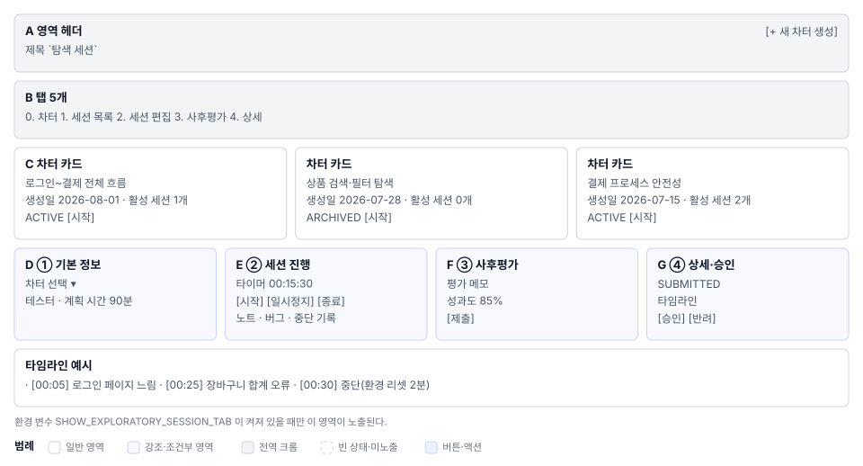

# 탐색 세션(S10) 화면정의

> 화면 ID **S10** · 상위 문서: [`01_탐색세션_업무프로세스.md`](01_탐색세션_업무프로세스.md)
> 라우트: `/projects/{projectId}/exploratory`
> 캡처(매뉴얼 `images/`): `56_exploratory.png`

---

## 1. 화면 구성

메인 탐색 세션 화면은 5개 탭으로 이루어진다. 기본값은 차터(Charters)다.

| 탭 | 이름 | 역할 |
|---|---|---|
| **0** | 차터 | 세션 목표·범위·전략을 마크다운으로 작성·관리 |
| **1** | 세션 목록 | 생성된 모든 세션을 카드 그리드로 본다 |
| **2** | 세션 편집 | 차터를 선택해 새 세션을 생성하고 진행한다. 기본/기록 2개 소탭 |
| **3** | 사후평가 | 세션이 끝나면 평가·발견·다음 차터를 기록한다 |
| **4** | 세션 상세 | 선택된 세션의 전체 타임라인·노트·버그·첨부를 본다 |

**탭은 조건부로 나타난다.** 환경 변수 미설정 시 5개 탭이 모두 숨겨진다. 그 경우 좌측 탭 항목이 없어지므로 다른 탭의 인덱스가 당겨진다.

---

## 2. 탭별 요소 정의

### 2.1 탭 0: 차터 (Charters)

**목적:** 세션을 시작하기 전에 테스트 목표·범위·아이디어·전략을 정의한다.

#### 2.1.1 화면 레이아웃

| 영역 | 이름 | 역할 |
|---|---|---|
| **A** | 헤더 | `차터 관리` 제목 + `[새 차터 생성]` 버튼 |
| **B** | 차터 목록 | 카드 그리드 (0건이면 빈 상태) |
| **C** | 차터 카드 | 제목·생성일·상태·액션 메뉴 |
| **D** | 마크다운 에디터 | 차터 상세 편집 (모달 또는 패널) |

#### 2.1.2 차터 카드 요소

| # | 요소 | 표시 규칙 |
|---|---|---|
| 1 | 차터 제목 | 큰 크기로 표시 |
| 2 | 생성 날짜 | YYYY-MM-DD 형식 |
| 3 | 상태 배지 | 활성 또는 보관 중 표시 |
| 4 | 세션 수 | "활성 세션 2개" 형태로 표시 |
| 5 | `⋮` 메뉴 | 수정·보관·삭제 옵션 |
| 6 | `[세션 시작]` | 이 차터로 새 세션 생성 버튼 |

#### 2.1.3 마크다운 에디터

7개 섹션 기본 템플릿이 들어간다. 사용자가 마크다운을 자유롭게 편집할 수 있다.

# 🎯 목적 (Objective)
# ⏱️ 세션 정보 (Session Info)
# 🔍 테스트 범위 (Scope)
# 🧭 테스트 아이디어 (Test Ideas)
# ⚠️ 리스크 영역 (Risks)
# 🧪 테스트 전략 (Approach)
# ✅ 완료 기준 (Exit Criteria)

---

### 2.2 탭 1: 세션 목록 (Sessions)

**목적:** 프로젝트 내 모든 탐색 세션을 목록으로 본다.

#### 2.2.1 요소

| # | 요소 | 표시 규칙 |
|---|---|---|
| 1 | 세션 카드 그리드 | 상태별 배경색으로 구분 |
| 2 | 세션 타이틀 | 사용자가 입력한 이름 |
| 3 | 차터 링크 | 이 세션의 근거가 된 차터 제목 |
| 4 | 테스터 | 세션을 진행한 사람 이름 |
| 5 | 진행 시간 | 타이머로 기록된 총 시간 |
| 6 | 상태 배지 | 작성 중·진행 중·완료·제출·승인·수정 필요 |
| 7 | `[상세 보기]` | 세션 상세 화면으로 이동 |

#### 2.2.2 상태별 배경색

| 상태 | 색상 | 표시 |
|---|---|---|
| DRAFT | 밝은 파랑 | 작성 중 |
| RUNNING | 초록 | 진행 중 (타이머 활성) |
| COMPLETED | 회색 | 종료됨 |
| SUBMITTED | 노랑 | 승인 대기 |
| APPROVED | 주색상 | 승인됨 |
| NEEDS_UPDATE | 빨강 | 수정 필요 |

---

### 2.3 탭 2: 세션 편집 (Session Editor)

**목적:** 차터를 선택해 새 세션을 만들고, 진행 중 노트·버그·중단을 기록한다.

#### 2.3.1 기본 (Basic) 소탭

세션을 시작하기 전에 차터·테스터·계획 시간을 입력한다.

| # | 요소 | 입력 형식 | 필수 |
|---|---|---|---|
| 1 | 차터 선택 | 드롭다운 (프로젝트의 모든 차터) | ○ |
| 2 | 세션 타이틀 | 텍스트 입력 | ○ |
| 3 | 테스터 | 드롭다운 (현재 사용자 기본값) | ○ |
| 4 | 리더/감독 | 드롭다운 | ○ |
| 5 | 세션 시간 | 숫자 입력 (분 단위) | ○ |
| 6 | 테스트 실행(%) | 슬라이더 또는 입력 | ○ |
| 7 | 버그 조사(%) | 슬라이더 또는 입력 | ○ |
| 8 | 관리(%) | 슬라이더 또는 입력 | ○ |
| 9 | 환경 요약 | 텍스트 (예: Staging, Production) | — |
| 10 | 제품 버전 | 텍스트 (예: v1.0.0) | — |
| 11 | 전략 태그 | 다중 선택 | — |
| 12 | 영역 태그 | 다중 선택 | — |

**시간 배분 검증:** 테스트(%)·버그(%)·관리(%)의 합이 정확히 100%여야 저장이 가능하다.

#### 2.3.2 기록 (Recording) 소탭

세션이 시작되면 이 탭에서 노트·버그·중단을 기록한다.

| # | 요소 | 화면 표시 |
|---|---|---|
| 1 | 타이머 | HH:MM:SS 형식으로 표시. 시작·일시정지·재개 버튼 |
| 2 | 경과 시간 | 시작부터 누적된 시간을 보여준다 |
| 3 | 노트 입력 | 텍스트 입력 + `[추가]` 버튼 |
| 4 | 노트 목록 | 시간·내용·삭제 옵션과 함께 표시 |
| 5 | 버그 발견 기록 | 제목·심각도·설명을 입력 + `[추가]` |
| 6 | 버그 목록 | 발견 순서대로 표시 및 삭제 가능 |
| 7 | 중단 기록 | 중단 사유·기간(분)을 입력 + `[기록]` |
| 8 | 중단 목록 | 중단 사항과 누적 시간을 표시 |
| 9 | `[세션 종료]` | 타이머를 멈춘다. 세션이 종료된다 |

**자동 저장:** 노트·버그·중단이 입력되면 즉시 `PATCH /api/sessions/{sessionId}`로 저장된다.

---

### 2.4 탭 3: 사후평가 (Debrief)

**목적:** 세션이 끝나면 세션의 가치·결함·개선점을 정리하고 승인을 신청한다.

#### 2.4.1 요소

| # | 요소 | 입력 형식 |
|---|---|---|
| 1 | 세션 요약 | 읽기 전용 (차터명·테스터·시간 등) |
| 2 | 발견 요약 | 텍스트 영역 (세션에서 찾은 것들 정리) |
| 3 | 평가 | 텍스트 영역 (이 세션의 의의·배운 점) |
| 4 | 다음 차터 | 텍스트 또는 드롭다운 (후속 세션 제안) |
| 5 | 성과도(%) | 숫자 또는 슬라이더 (0~100) |
| 6 | `[케이스로 승격]` | 버그를 정식 테스트 케이스로 생성 |
| 7 | `[제출]` | 평가를 제출한다. 승인자에게 알림이 간다 |

---

### 2.5 탭 4: 세션 상세 (Session Detail)

**목적:** 선택된 세션의 전체 타임라인·첨부를 조회한다.

#### 2.5.1 요소

| # | 요소 | 표시 내용 |
|---|---|---|
| 1 | 세션 헤더 | 타이틀·상태·수정 버튼 |
| 2 | 기본 정보 | 차터·테스터·리더·시간·시간 배분(%) |
| 3 | 타임라인 | 시간순으로 노트·버그·중단 표시 |
| 4 | 노트 섹션 | 입력 시간·내용을 시간 순서대로 표시 |
| 5 | 버그 섹션 | 발견 번호·심각도·제목·설명·첨부 |
| 6 | 첨부 섹션 | 파일 목록·다운로드·업로드 영역 |
| 7 | 승인 상태 | 대기 중·승인됨·반려됨 표시 |
| 8 | `[승인]` / `[반려]` | PM·LEAD만 버튼이 표시된다 |

---

## 3. 상태별 화면

### 3.1 세션 0건 상태

차터는 있지만 세션을 아직 시작하지 않았을 때.

- 탭 1(세션 목록): 빈 상태 안내 + `차터에서 세션 시작하기` 링크
- 탭 2(편집): 차터 선택 폼이 활성화, 다른 입력은 비활성
- 탭 3·4: 회색으로 비활성화

### 3.2 세션 진행 중

타이머가 작동 중이고 노트·버그를 입력하는 상태.

- 타이머 UI가 전면: `00:05:23` 형태
- 노트 추가 버튼이 활성화
- `[세션 종료]` 버튼이 강조색
- 다른 탭은 조회만 가능

### 3.3 세션 종료 (COMPLETED)

세션을 종료했지만 아직 평가를 제출하지 않은 상태.

- 타이머가 정지: `00:45:30` 고정
- 노트·버그 추가는 불가
- 탭 3(사후평가)이 활성화
- `[제출]` 버튼이 강조색

### 3.4 세션 승인 대기 (SUBMITTED)

평가를 제출했고 PM·LEAD의 승인을 기다리는 상태.

- 상태 배지: 노랑 `SUBMITTED`
- PM·LEAD: `[승인]` / `[반려]` 버튼 표시
- 다른 사용자: 읽기 전용

### 3.5 환경 변수 미설정

`SHOW_EXPLORATORY_SESSION_TAB=false` (또는 미설정)일 때.

- 좌측 탭 항목 자체가 없다
- S10 화면 경로(`/projects/{projectId}/exploratory`)로 접근 불가
- 라우팅은 S3 대시보드로 되돌린다

---

## 4. 예시 데이터

ShopFlow 데모 프로젝트에 담긴 값이다.

### 차터 예시

# 🎯 목적 (Objective)
- 사용자 로그인 후 장바구니 추가/제거 흐름 전탐색

# 🔍 테스트 범위 (Scope)
- 로그인 성공·실패 케이스
- 상품 조회·필터·정렬
- 장바구니 추가/수정/삭제
- 결제 페이지 네비게이션

# 🧭 테스트 아이디어 (Test Ideas)
- 로그인 후 즉시 장바구니 비었는지 확인
- 상품 상세에서 바로 장바구니 추가
- 장바구니 수량 변경 후 합계 재계산
- 결제 중단 후 재진입했을 때 상태 유지

# ⚠️ 리스크 영역 (Risks)
- 동시성: 같은 상품을 여러 창에서 추가
- 네트워크 지연: 느린 연결에서 결제 버튼 연타
- 브라우저 호환: IE11, 모바일 Safari

# 🧪 테스트 전략 (Approach)
- 기본 흐름: 로그인→조회→추가→결제
- 엣지 케이스: 0원 상품, 최대 수량 초과
- 성능: 상품 100개 장바구니에서 로딩 시간

# ✅ 완료 기준 (Exit Criteria)
- 주요 흐름 1회 이상 통과
- 발견된 버그 심각도 Critical 0건

### 세션 예시

| 속성 | 값 |
|---|---|
| 차터 | 위 예시 |
| 타이틀 | `로그인~결제 전체 흐름 탐색 (2026-08-03)` |
| 테스터 | Kim, Kwangmyung |
| 리더 | Park, Jinsung (PM) |
| 시간(분) | 90 |
| 테스트(%) | 60 |
| 버그 조사(%) | 25 |
| 셋업(%) | 15 |
| 환경 | Staging |
| 버전 | v1.0.102 |

### 세션 노트 예시

[00:05] 로그인 페이지 로딩 느림 (5초)
[00:12] 잘못된 이메일로 로그인 시도 → "이메일 형식 오류" 안내 O
[00:25] 정상 로그인 성공
[00:30] 상품 검색: "신발" → 32개 조회됨
[01:10] 장바구니 합계 계산 오류 발견! (수량×가격이 합산에서 빠짐)

### 세션 버그 예시

| 버그 | 심각도 | 설명 |
|---|---|---|
| BUG-001 | Critical | 장바구니 합계가 맞지 않음. 3개×10,000원 = 30,000인데 표시 22,000 |
| BUG-002 | High | 로그인 페이지 로딩 5초 이상 소요 |
| BUG-003 | Low | 상품 이미지 로드 실패 시 대체 이미지 미노출 |

---

## 5. 권한별 화면 차이

### PM / LEAD (관리 권한)

- 모든 탭 접근 가능
- 모든 세션 승인 권한
- 발견을 케이스로 승격 가능
- 세션 수정 가능

### DEVELOPER / CONTRIBUTOR / TESTER

- 차터 작성·수정 가능
- 자신의 세션만 수정 (또는 같은 프로젝트 모두)
- 평가 제출까지만 (승인은 안 함)
- `[승인]` `[반려]` 버튼 미노출

### VIEWER

- 모든 탭 읽기 전용
- 차터·세션 목록만 조회
- 수정·승인 불가

---

## 6. 화면 문구 규정

### 상태 표기

- `DRAFT`: "작성 중"
- `RUNNING`: "진행 중" (타이머 활성)
- `COMPLETED`: "진행 완료"
- `SUBMITTED`: "제출됨 (승인 대기)"
- `APPROVED`: "승인됨"
- `NEEDS_UPDATE`: "수정 필요"

### 버튼 문구

- `[세션 시작]`: 새 세션 생성 및 진행 시작
- `[세션 종료]`: 타이머 정지 및 기록 완료
- `[제출]`: 사후평가 제출 (승인 신청)
- `[승인]`: PM/LEAD의 최종 승인
- `[반려]`: 수정 필요 반려
- `[케이스로 승격]`: 버그를 정식 테스트 케이스로 생성

### 알림 문구

- 저장 성공: "세션이 저장되었습니다"
- 시간 검증 오류: "테스트(%) + 버그(%) + 관리(%)의 합이 100%여야 합니다"
- 승인 완료: "세션이 승인되었습니다. 발견을 케이스로 승격할 수 있습니다"

---

## 7. 04 요건 대조

이 화면의 요소가 어느 요건과 대응되는지는 04_요건반영목록.md의 기능 요건 표에서 다룬다.
