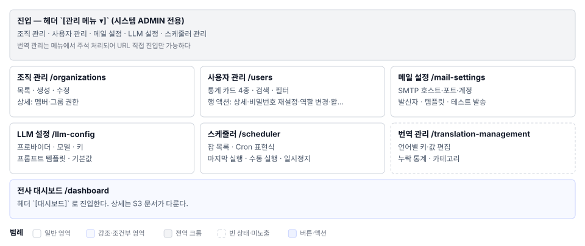

# 관리자설정(S11) 화면정의

> 화면 ID **S11** 상위 문서: [`01_관리자설정_업무프로세스.md`](01_관리자설정_업무프로세스.md)
> 라우트 `/organizations` `/users` `/mail-settings` `/llm-config` `/scheduler` `/translation-management`
> 소스 `components/admin/` 6개 파일 캡처: 매뉴얼 `images/78_admin_menu_dropdown.png` `81_organizations.png` `82_users.png` `83_mail_settings.png` `84_llm_config.png` `85_scheduler.png` `86_translation.png`

---

## 1. 화면 구성

S11은 메뉴에서 진입하는 6개 하위 화면의 집합이다. 각 화면이 서로 독립적인 관리 영역이므로 별도 레이아웃을 갖는다.

### 1.1 공통 요소

| 영역 | 역할 |
|---|---|
| **헤더** | 전체 제목 우상단 액션(새로고침/다운로드/초기화 등 화면별로 다름) |
| **네비게이션** | 하위 화면 전환 탭 또는 드롭다운(화면별로 다름) |
| **콘텐츠** | 테이블·카드·폼·설정 패널 |
| **에러 알림** | 조회·조작 실패 문구를 `Alert severity="error"`로 표시 |

### 1.2 하위 화면별 영역 구성

#### **3.1 조직 관리 (`/organizations` `/organizations/{orgId}`)**

| 영역 | 이름 | 역할 | 근거 |
|---|---|---|---|
| **A** | 화면 헤더 | `조직 관리` 제목 + `[조직 생성]` 또는 뒤로가기 | 또는 |
| **B** | 조직 목록 또는 상세 | 목록 모드: 카드/테이블. 상세 모드: 정보·멤버·그룹 탭 | `:~` |
| **C** | 멤버 관리 영역 | 멤버 목록 표시 + 초대 폼 | 상세 화면의 멤버 탭 |
| **D** | 그룹·권한 매트릭스 | 조직 안 그룹별로 기능별 권한(edit/view/execute)을 지정 | 상세 화면의 그룹 탭 |

#### **3.2 사용자 관리 (`/users`)**

| 영역 | 이름 | 역할 | 근거 |
|---|---|---|---|
| **A** | 화면 헤더 + 액션 | `사용자 관리` 제목 + 통계 카드(전체/활성/비활성/최근가입) | |
| **B** | 검색·필터 | 검색(이름·이메일·사용자명) 필터(역할/상태) | `:~` |
| **C** | 사용자 테이블 | 계정·이름·이메일·역할·상태·마지막 로그인·인증 배지 | `:~` |
| **D** | 행 액션 | `👁 상세 보기` `⋮ 비밀번호 재설정 / 역할 변경 / 활성화·비활성화 토글` | `:~` |
| **E** | 우상단 버튼 | `🔄 새로고침` `⬇ 다운로드` `초기화(모두 활성화)` | `:~` |

#### **3.3 메일 설정 (`/mail-settings`)**

| 영역 | 이름 | 역할 | 근거 |
|---|---|---|---|
| **A** | 화면 헤더 | `메일 설정` 제목 | |
| **B** | 폼 섹션 | SMTP 호스트·포트·계정·비밀번호 입력 | `:~` |
| **C** | 발신자 설정 | 이메일·표시 이름 입력 | `:~` |
| **D** | 템플릿 선택·편집 | 이메일 인증·비밀번호 재설정·실행 결과 등 각 유형의 `From`/`Subject`/`Body` | `:~` |
| **E** | 테스트·저장 | `[테스트 메일 발송]` `[저장]` 버튼 | `:~` |

#### **3.4 LLM 설정 (`/llm-config`)**

| 영역 | 이름 | 역할 |
|---|---|---|
| **A** | 화면 헤더 + 생성 | `LLM 설정` + `[+ LLM 프로바이더 추가]` |
| **B** | 프로바이더 목록 | 카드 또는 테이블 — 각 프로바이더 이름·상태·API Key 요약 |
| **C** | 프로바이더 상세(드릴다운) | API Key·Base URL·모델명·활성화 상태 편집 |
| **D** | 프롬프트 템플릿 관리 | 시스템 프롬프트·예시·토큰 한도 정의 |
| **E** | 기본값 지정 | 어느 프로바이더를 RAG·자동 메타에 쓸지 선택 |

#### **3.5 스케줄러 관리 (`/scheduler`)**

| 영역 | 이름 | 역할 | 근거 |
|---|---|---|---|
| **A** | 화면 헤더 | `스케줄러 관리` 제목 | |
| **B** | 잡 목록 테이블 | 이름·Cron 식·마지막 실행·결과·상태(활성/일시정지) | `:~` |
| **C** | 잡 상세 폼 | Cron 편집 필드 | `:~` |
| **D** | 잡 제어 버튼 | `[지금 실행]` `[일시정지]` / `[재개]` `[저장]` | `:~` |

#### **3.6 번역 관리 (`/translation-management`)**

| 영역 | 이름 | 역할 |
|---|---|---|
| **A** | 화면 헤더 | `번역 관리` 제목 + 언어 탭/셀렉트(한국어/영어/추가 언어) |
| **B** | 탭 1: 키·값 편집 | 카테고리별 그룹화된 번역 키·한국어·영어·기타 값 입력 |
| **C** | 탭 2: 누락 통계 | 각 언어별 완성도(%) 미번역 키 수 목록 |
| **D** | 액션 | 언어 추가 CSV 수출/수입 캐시 초기화 |

---

## 2. 영역별 요소 정의

### 2.1 조직 관리

#### 목록 화면 (`/organizations`)

| # | 요소 | 표시 | 동작 |
|---|---|---|---|
| 1 | 제목 | `조직 관리` — `h1` | — |
| 2 | `[조직 생성]` 버튼 | `contained`, `+` 아이콘 | 생성 다이얼로그 열기 |
| 3 | 조직 카드/행 | 조직명 로고 프로젝트 수 멤버 수 | 클릭 시 상세로 진입 |
| 4 | 에러 알림 | `Alert severity="error"` | 조회·생성·수정 실패 |

#### 상세 화면 (`/organizations/{orgId}`)

| # | 요소 | 표시 | 동작 |
|---|---|---|---|
| 1 | 뒤로가기 + 제목 | `←` + 조직명 | 목록으로 돌아감 |
| 2 | **멤버 탭** | 멤버 목록(이름·역할·초대 상태) + 초대 폼 | 초대하기/역할변경/제거 |
| 3 | **그룹 탭** | 그룹별 권한 매트릭스(행: 기능, 열: 역할) | 권한 체크박스 토글 |
| 4 | **설정 탭** | 조직명·설명·로고 편집 필드 | 저장 |

### 2.2 사용자 관리

| # | 요소 | 표시 | 동작 |
|---|---|---|---|
| 1 | 통계 카드 4개 | 전체·활성·비활성·최근 가입(숫자 + 백분율) | — |
| 2 | 검색 필드 | 입력 중 실시간 필터 | 목록 갱신 |
| 3 | 역할 필터 | 체크박스 다중 선택(ADMIN/PM/테스터/일반) | 목록 갱신 |
| 4 | 상태 필터 | 라디오 또는 토글(활성/비활성) | 목록 갱신 |
| 5 | 테이블 헤더 | 계정 이름 이메일 역할 상태 마지막 로그인 인증 | 정렬 가능(추정) |
| 6 | 테이블 행 | 각 사용자의 정보 | 행 클릭 → 상세 보기 또는 드릴다운 |
| 7 | 행 우측 `⋮` | 메뉴: 상세·비밀번호 재설정·역할변경·활성토글 | 다이얼로그/인라인 실행 |
| 8 | 우상단 버튼 3개 | `🔄 새로고침` `⬇ 다운로드` `초기화` | 각각 동작 |
| 9 | 인증 배지 | 미인증 / ✓ 완료 | — |
| 10 | 에러 알림 | `Alert severity="error"` | 조작 실패 |

### 2.3 메일 설정

| # | 요소 | 표시 | 동작 |
|---|---|---|---|
| 1 | 제목 | `메일 설정` | — |
| 2 | SMTP 호스트 | 텍스트 입력 | — |
| 3 | SMTP 포트 | 숫자 입력(기본 587) | — |
| 4 | SMTP 계정 | 텍스트 입력 | — |
| 5 | SMTP 비밀번호 | 비밀번호 입력 필드 | — |
| 6 | 발신자 이메일 | 텍스트 입력 | — |
| 7 | 발신자 표시명 | 텍스트 입력 | — |
| 8 | 템플릿 선택 | 드롭다운/탭(이메일 인증/비밀번호/결과 등) | 선택 시 해당 템플릿 폼 표시 |
| 9 | 템플릿 `From` | 텍스트 입력 | — |
| 10 | 템플릿 `Subject` | 텍스트 입력 | — |
| 11 | 템플릿 `Body` | 여러 줄 입력(변수 플레이스홀더 예시 제공) | — |
| 12 | `[테스트 메일 발송]` | 버튼 색 `info` | 입력된 설정으로 테스트 메일 발송 후 결과 표시 |
| 13 | `[저장]` | 버튼 색 `primary` | 설정을 저장한다 |
| 14 | 에러 알림 | `Alert severity="error"` | 저장·테스트 실패 |

### 2.4 LLM 설정

| # | 요소 | 표시 | 동작 |
|---|---|---|---|
| 1 | 제목 + 생성 버튼 | `LLM 설정` + `[+ LLM 프로바이더 추가]` | 생성 다이얼로그 |
| 2 | 프로바이더 카드 | 이름 종류(OpenAI/Anthropic 등) 모델 활성화 토글 | 클릭 시 상세 폼으로 펼침 |
| 3 | 프로바이더 상세(인라인) | 폼 필드들 | 편집 가능 |
| 4 | API Key 입력 | 비밀번호 필드(마스킹) | — |
| 5 | Base URL 입력 | 텍스트 입력(선택) | — |
| 6 | 모델명 입력 | 텍스트 입력 | — |
| 7 | 활성화 토글 | 토글 버튼 | 이 프로바이더 사용 여부 |
| 8 | 템플릿 관리 | 별도 섹션 또는 탭 | 시스템·예시·토큰 한도 정의 |
| 9 | 기본값 지정 | 라디오 버튼(RAG용 / 자동 메타용 / 기타) | 어느 프로바이더를 기본으로 쓸지 |
| 10 | `[저장]` `[삭제]` | 버튼 | 설정을 저장하거나 프로바이더를 삭제한다 |
| 11 | 에러 알림 | `Alert severity="error"` | 연결 실패·저장 실패 |

### 2.5 스케줄러 관리

| # | 요소 | 표시 | 동작 |
|---|---|---|---|
| 1 | 제목 | `스케줄러 관리` | — |
| 2 | 잡 목록 테이블 | 이름 Cron 식 마지막 실행 결과(성공/실패/진행중) 상태 | 행 클릭 → 상세 펼침 |
| 3 | 잡 상세(인라인) | Cron 편집 필드 | 변경 후 저장 |
| 4 | Cron 입력 필드 | 텍스트 입력 | 예시: `0 0 * * *` |
| 5 | `[지금 실행]` | 버튼 색 `info` | 잡을 즉시 실행한다 |
| 6 | `[일시정지]` / `[재개]` | 토글 또는 상태에 따른 버튼 | 잡 활성화/비활성화 |
| 7 | `[저장]` | 버튼 | 설정을 저장한다 |
| 8 | 실행 기록 | 마지막 실행 시각·결과·로그 미리보기 | — |
| 9 | 에러 알림 | `Alert severity="error"` | 실행·저장 실패 |

### 2.6 번역 관리

| # | 요소 | 표시 | 동작 |
|---|---|---|---|
| 1 | 제목 + 언어 선택 | `번역 관리` + 언어 탭/드롭다운(한국어/영어/추가) | 탭 전환 → 그 언어의 번역 표시 |
| 2 | **탭 1: 키·값** | 카테고리(섹션/메뉴/버튼 등) + 키 목록 + 입력 필드들 | 각 언어마다 값 입력 |
| 3 | 카테고리 그룹화 | 좌측 트리 또는 아코디언으로 카테고리 펼침 | — |
| 4 | 번역 키 텍스트 | 불변 영어 키(읽기 전용) | — |
| 5 | 한국어 입력 | 텍스트 필드 | 편집 가능 |
| 6 | 영어 입력 | 텍스트 필드 | 편집 가능 |
| 7 | 기타 언어 입력 | 추가된 언어만 표시 | 편집 가능 |
| 8 | **탭 2: 통계** | 완성도(%) 미번역 키 수 언어별 진척도 차트 | — |
| 9 | 언어 추가 버튼 | `[+ 언어 추가]` | 다이얼로그 → 언어코드 입력 |
| 10 | CSV 수출 | `[⬇ 수출]` | 선택한 언어들을 CSV로 다운로드 |
| 11 | CSV 수입 | `[⬆ 수입]` | CSV 파일 업로드 → 병합 또는 덮어쓰기 선택 |
| 12 | `[저장]` | 버튼 | 번역을 저장한다 |
| 13 | `[캐시 초기화]` | 버튼 색 `warning` | 애플리케이션 번역 캐시를 새로고침 |
| 14 | 에러 알림 | `Alert severity="error"` | 저장·수입 실패 |

---

## 3. 상태별 화면

| 상태 | 트리거 | 표시 |
|---|---|---|
| 조회 중 | 진입·검색·필터 직후 | 중앙 또는 영역별 진행 표시 |
| 조회 실패 | 서버 거부 | 에러 알림 (`Alert severity="error"`) + 캐시된 이전 데이터(있으면) |
| 편집 중 | 폼 제출 후 | 버튼 → 진행 표시, 취소 비활성화 |
| 저장 성공 | 응답 반환 | 녹색 확인 알림(생략 가능) + 목록 또는 폼 자동 갱신 |
| 저장 실패 | 서버 거부 | 폼 내 빨간 알림 + 입력값 유지 |
| 데이터 0건 | 검색·필터 결과 없음 | "결과가 없습니다" 안내 메시지 |

---

## 4. 예시 데이터

| 화면 | 항목 | 값 | 출처 |
|---|---|---|---|
| 조직 | 조직명 | `테크팀` `QA팀` | 매뉴얼 캡처 추정 |
| 사용자 | 이름·이메일 | `김민준` / `kim@example.com` | 〃 |
| 메일 | SMTP 호스트 | `smtp.gmail.com` `smtp.office365.com` | 매뉴얼 17-5절 |
| LLM | 프로바이더 | OpenAI, Anthropic, Azure OpenAI, 로컬 모델 | 매뉴얼 17-6절 |
| 스케줄러 | 잡 이름 | JIRA 동기화 RAG 인덱싱 토큰 정리 | 매뉴얼 17-7절 |
| 번역 | 언어 | 한국어 영어 (추가 언어) | 매뉴얼 17-8절 |

---

## 5. 권한별 화면 차이

⚠ **기능 미구현.** 현재 관리 메뉴는 시스템 관리자(ADMIN)만 접근할 수 있다. 매니저(MANAGER) 권한을 추가하려면 백엔드 각 컨트롤러의 권한 검사를 수정해야 한다.

| 화면 요소 | 시스템 ADMIN | 시스템 MANAGER | 그 외 |
|---|---|---|---|
| S11 진입(메뉴 노출) | ○ | ❌ 미구현 | ❌ |
| 조직 목록 조회 | ○ | ❌ 미구현 | ❌ |
| 조직 생성·수정·멤버초대 | ○ | ❌ 미구현 | ❌ |
| 사용자 목록 조회 | ○ | ❌ 미구현 | ❌ |
| 사용자 역할변경·활성화토글 | ○ | ❌ 미구현 | ❌ |
| 메일 설정 변경 | ○ | ❌ 미구현 | ❌ |
| LLM 프로바이더 설정 | ○ | ❌ 미구현 | ❌ |
| 스케줄러 제어 | ○ | ❌ 미구현 | ❌ |
| 번역 편집 | ○ | ❌ 미구현 | ❌ |

---

## 6. 화면 문구 규정

| 항목 | 규칙 | 예시 |
|---|---|---|
| 버튼 | `t` 감싸기 | `t("common.button.save", "저장")` |
| 에러 메시지 | 서버 응답을 그대로 표시하되, `t` 없는 하드코딩 검출 | — |
| 필드 라벨 | `t("admin.label.smtpHost", "SMTP 호스트")` | — |
| 테이블 헤더 | `t` 로 감싸기 | `t("admin.table.email", "이메일")` |
| 플레이스홀더 | `t("placeholder.organizationName", "예: 개발팀")` | — |

---

## 7. 02 03 04 이미지 연동

| 대상 | 작성 후 순서 |
|---|---|
| **03_컴포넌트** | 2.4~2.6 각 요소의 표시·상호작용 규격 + 서버와 주고받는 정보 |
| **04_요건반영목록** | 기능 요건(S11-01~30) 비기능(S11-N1~) 정정(C-1~) 확인(V-S11~) |
| **images/S11_layout.svg** | 관리 메뉴 드롭다운(6개 항목) + 각 하위 화면의 주 영역 배치도 1장 |

---

## 8. 유지보수 주의

1. **하위 화면을 추가하면**: 01 3절에 3.7절 추가 02 1.2. **권한을 추가하면**: 00_전체_업무프로세스 5절 01 5절 02 5절 세 곳을 함께 고친다.
3. **API 엔드포인트가 변경되면**: 03 5절 API 계약과 04 5절 미사용 기능 목록을 함께 갱신한다.
4. **MANAGER 권한의 실제 범위가 명확해지면**: 02 5절의 모든 ⚠ 확인 필요 항목을 정정한다(8절 정정 대상 C-1로 기록).
5. **번역 관리가 메뉴에 나타나면**: 01 2.2절 02 2.6절 표에서 `× 주석 처리` 항목을 정정한다.
