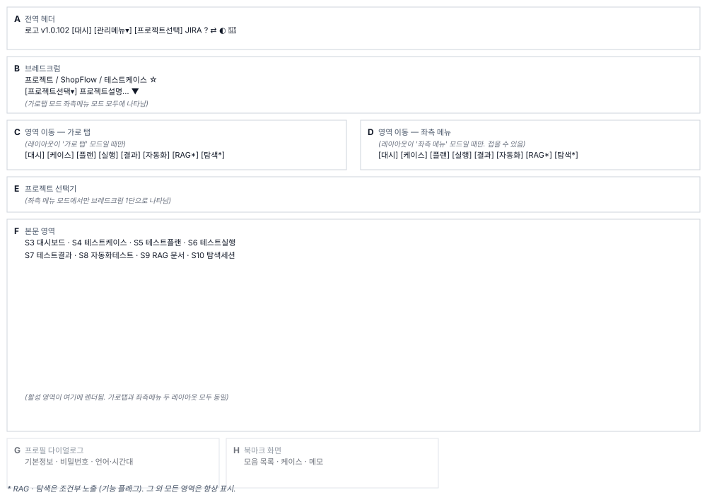

# 공통 레이아웃(S2) 화면정의

> 화면 ID **S2** · 상위 문서: [`01_공통레이아웃_업무프로세스.md`](01_공통레이아웃_업무프로세스.md)
> 라우트: `/projects/{projectId}` 의 공통 영역 · `/projects/{projectId}/bookmarks`
> 캡처(매뉴얼 `images/`): `20_project_overview.png` · `95_sidebar_layout.png` · `96_sidebar_collapsed.png` · `97_breadcrumb_project_switcher.png` · `63_project_selector.png` · `65_profile_page.png` · `72_profile_theme.png` · `90_bookmarks.png`

---

## 1. 화면 구성

S2는 본문이 아니라 본문을 담는 **뼈대 화면**이다. S3~S10 중 하나가 본문 영역에 들어간다. 여덟 영역으로 나뉜다.

| 영역 | 이름 | 역할 |
|---|---|---|
| **A** | 전역 헤더 | 로고 버전 ADMIN 대시보드 관리 메뉴 프로젝트 선택 JIRA 매뉴얼 레이아웃 전환 다크모드 아바타 메뉴 |
| **B** | 브레드크럼 | `프로젝트 / 이름 / 영역명` 3단 네비게이션 |
| **C** | 영역 이동 — 가로 탭 | 8개 영역 탭. 레이아웃이 `가로 탭` 모드일 때만 그린다 |
| **D** | 영역 이동 — 좌측 메뉴 | 8개 영역 세로 목록. 레이아웃이 `좌측 메뉴` 모드일 때만 그린다. 접을 수 있다 |
| **E** | 프로젝트 선택기 | 참여 프로젝트 드롭다운. 좌측 메뉴 모드에서만 브레드크럼에 나타난다 |
| **F** | 본문 영역 | S3~S10 중 활성 화면 |
| **G** | 프로필 다이얼로그 | 기본정보 비밀번호 언어·시간대 JIRA Google Sheets API 토큰 테마 설정(7탭) |
| **H** | 북마크 화면 | 개인 모음과 메모. `/projects/{id}/bookmarks` 경로 |

**배치**

---

## 2. 영역별 요소 정의

### 2.1 A. 전역 헤더

헤더는 **전체 높이 64px**(`minHeight: "64px !important"`,)이며, `<AppBar position="static">`의 자식이다. 배경은 현재 테마의 `AppBar` 색상을 따른다. 라이트 모드에서는 기본 회색, 다크 모드에서는 어두운 회색이다.

| 요소 | 표시 | 동작 | 권한 |
|---|---|---|---|
| **로고** | 제품 로고 이미지, 높이 60px | `/projects` 이동 | 전원 |
| **버전** | `v1.0.102` 같은 형식. 모노스페이스 폰트, 불투명도 70% | — | 전원 |
| `[대시보드]` | "대시보드" 텍스트 버튼 | `/dashboard` 이동(전사 대시보드) | **ADMIN만** |
| `[관리 메뉴 ▾]` | 드롭다운 버튼 + `KeyboardArrowDownIcon` | 6개 하위 메뉴 열기 | **ADMIN만** |
| — 관리 메뉴 하위 | `조직 관리` `사용자 관리` `메일 설정` `LLM 설정` `스케줄러 관리` | 각 경로 이동 | **ADMIN** |
| — `번역 관리` | **(주석 처리)** 메뉴에 나타나지 않음 | — | — |
| `[프로젝트 선택]` | "프로젝트 선택" 텍스트 버튼 | `/projects` 이동(프로젝트 목록 페이지) | 전원 |
| **JIRA 상태** | 미니 컴포넌트. 설정 아이콘 + 연결 상태 배지 | JIRA 설정 다이얼로그 링크 | 전원 |
| `?` | `HelpOutlineIcon` | `/manual` 새 탭 열기 | 전원 |
| 레이아웃 전환 | 탭/사이드바 아이콘 토글 | 가로 탭 ↔ 좌측 메뉴 전환 | 전원 |
| 다크모드 | `Brightness7Icon` (어두움) / `Brightness4Icon` (밝음) | 다크 ↔ 라이트 토글 | 전원 |
| **아바타** | 이름 첫 글자 또는 `U` 기본값. `Avatar` 컴포넌트 | 아바타 메뉴 열기 | 전원 |
| — `[프로필]` | 메뉴 항목 | G 프로필 다이얼로그 열기 | 전원 |
| — `[사용자 매뉴얼]` | 메뉴 항목 | `/manual` 새 탭 | 전원 |
| — `[로그아웃]` | 메뉴 항목 | 로그아웃 + `/login` 이동 | 전원 |

**관리 메뉴의 권한 판정이 의도와 어긋난다**

`ADMIN` 과 `MANAGER` 를 함께 허용하려는 판정이 준비되어 있으나, 화면은 시스템 관리자만 통과시키는 판정을 쓴다. 그래서 **`MANAGER` 등급은 관리 메뉴에 들어갈 수 없다.**

⚠ **확인 필요**: `MANAGER` 에게 관리 메뉴를 열어 줄 계획이었는지, 아니면 지금 동작이 맞는지 확정한다. 04에 정정 대상으로 기록했다.

### 2.2 B. 브레드크럼

프로젝트에 들어오면 헤더 바로 아래에 3단으로 놓인다.

| 영역 | 내용 | 표시 규칙 |
|---|---|---|
| **1단(프로젝트)** | 링크 | `가로 탭` 모드에서만 나타남. 클릭 시 프로젝트 메뉴 토글 |
| **1단(프로젝트)** | 프로젝트 선택기 | `좌측 메뉴` 모드에서는 1단 자리에 프로젝트 이름 + 드롭다운 |
| **1단(프로젝트)** | 프로젝트 이름 | 클릭 시 다른 프로젝트 드롭다운 펼침. 현재 프로젝트는 선택 상태 |
| **중앙 크럼** | `/` 구분자 | — |
| **2단(프로젝트 이름)** | 프로젝트 코드 + 이름 | 예: `SHOP / ShopFlow` |
| **2단 접힘** | 프로젝트 설명 + 접기/펼치기 화살표 | 다음 줄. 브라우저 저장소에 상태 보존 |
| **3단(영역명)** | 현재 활성 영역 이름 | 영역이 없으면 2단 이름을 굵게 표시 |
| **북마크(별)** | ☆ 아이콘 버튼 | 프로젝트 진입 후 항상 노출. 클릭 시 `/projects/{id}/bookmarks` 이동 |

**프로젝트 선택기 드롭다운**

- 모드: 좌측 메뉴에서만 보임
- 참여 프로젝트 목록 + 현재 프로젝트 선택 표시 + "프로젝트 목록 보기" 링크
- 같은 프로젝트를 다시 클릭해도 이동하지 않음

### 2.3 C. 영역 이동 — 가로 탭 모드

, 에 정의된 8개 항목이 **수평 탭**으로 렌더된다.

조건부 항목(RAG · 탐색 세션)을 걸러낸 뒤 남은 **목록의 위치**가 곧 현재 영역 번호다. 고정 번호가 아니다.

| 탭 | 아이콘 | 개수 배지 | 조건 |
|---|---|---|---|
| 대시보드 | 📊 | — | 항상 보임 |
| 테스트케이스 | 📋 | ✓ (케이스 수) | 항상 보임 |
| 테스트플랜 | 📝 | ✓ (플랜 수) | 항상 보임 |
| 테스트실행 | ▶ | ✓ (실행 수) | 항상 보임 |
| 테스트결과 | 📈 | — | 항상 보임 |
| 자동화 테스트 | 🤖 | — | 항상 보임 |
| **RAG 문서** | 📄 | — | **조건부** — RAG 사용 가능 여부 |
| **탐색 세션** | 🔍 | — | **조건부** — `showExploratorySessionTab` |

**개수 배지는 3개 탭(케이스·플랜·실행)에만 붙는다**. 배지 숫자는 컨텍스트에 로드된 목록의 길이를 센다.

### 2.4 D. 영역 이동 — 좌측 메뉴 모드

 전체(229행). 세로 목록이다.

| 특징 | 값 |
|---|---|
| **폭** | 240px 기본. 250px~320px 범위 조절 가능 |
| **선택 표시** | 좌측 3px 선 + 배경색(주 색상 10% 투명도) |
| **접힘** | 아이콘만 남고 라벨을 `title` 속성으로 옮김 |
| **접힘 상태 저장** | 브라우저 저장소 |

### 2.5 E. 프로젝트 선택기(좌측 메뉴 모드만)

좌측 메뉴 모드일 때만 브레드크럼의 첫 자리에 나타난다.

| 요소 | 동작 |
|---|---|
| 프로젝트 이름 클릭 | 참여 프로젝트 드롭다운 펼침 |
| 드롭다운 항목 선택 | 같은 영역 유지 + 프로젝트만 교체. 현재 프로젝트면 이동 안 함 |
| "프로젝트 목록 보기" | S1로 이동(`/projects`) |

### 2.6 F. 본문 영역

컨테이너 `maxWidth={false}`, 좌측·우측 패딩 `px: 2`. 탭 인덱스에 따라 S3~S10 중 하나가 렌더된다.

**테스트케이스 영역의 특수성**

고정 높이 프레임이라 하단 마진이 없다. 트리 + 입력폼이 전체 화면 높이를 채운다.

### 2.7 G. 프로필 다이얼로그

아바타 메뉴 → `[프로필]` 또는 다이얼로그 경로로 열린다. 전체(1,040행). 모달이며 라우트 이동이 없다.

**7개 탭**

| # | 탭 | 다루는 것 | 저장 버튼 |
|---|---|---|---|
| 1 | 기본 정보 | 사용자명(읽기전용) 이름 이메일 역할 배지 이메일 인증 상태 버전 | ✓ |
| 2 | 비밀번호 | 기존 암호 확인 후 변경 | ✓ |
| 3 | 언어 설정 | 인터페이스 언어(즉시) 시간대(저장 버튼) | ✓ |
| 4 | JIRA 설정 | JIRA 주소 이메일 연결 키(마스킹) | ✓ |
| 5 | Google Sheets 연결 | OAuth 계정 연결 상태 표시 | — |
| 6 | API 토큰 | 발급(즉시 전체 표시 1회) 폐기(최대 10개까지) | — |
| 7 | 테마 설정 | 화면 모드(다크/라이트) 디자인 시스템 **메뉴 구조** | ✓ |

**API 토큰의 보안**

발급 직후 한 번만 전체가 보인다. 그 이후는 마스킹된다(에 명시, 매뉴얼 13-6절). 전 화면 규칙 **G7**이다.

### 2.8 H. 북마크 화면

경로 `/projects/{projectId}/bookmarks`. 헤더의 `☆` → 이동.

| 영역 | 내용 |
|---|---|
| **좌측 모음 목록** | 모음 이름 `[모음 만들기]` 삭제(기본 `즐겨찾기` 모음은 삭제 불가) |
| **우측 케이스 목록** | 현재 모음의 케이스들. 제거 가능 개인 메모 편집 가능 |

**북마크는 개인 자산**이다. 다른 사용자에게 영향을 주지 않는다. 케이스 본문은 수정할 수 없고, 모음 정리와 메모만 다룬다(매뉴얼 4-7절).

---

## 3. 상태별 화면

### 3.1 프로젝트 미선택

프로젝트 ID가 경로에 없으면(예: `/projects` 경로면) 공통 레이아웃을 그리지 않는다. S1 프로젝트 목록이나 로그인 화면으로 복귀한다.

### 3.2 권한 없음

요청한 관리 경로(예: `/dashboard`)에 권한이 없으면 `UnauthorizedPage` 컴포넌트가 나타난다.

---

## 4. 예시 데이터

### 4.1 가로 탭 모드

| 항목 | 실제값 |
|---|---|
| 프로젝트 | ShopFlow |
| 프로젝트 코드 | SHOP |
| 영역 | 테스트케이스 |
| 브레드크럼 | `프로젝트 / ShopFlow / 테스트케이스` |
| 배지(케이스) | 67 |
| 배지(플랜) | 12 |
| 배지(실행) | 34 |

### 4.2 좌측 메뉴 모드

프로젝트 선택기가 브레드크럼 1단에 나타나고, 메뉴가 화면 좌측에 세로로 펼쳐진다.

---

## 5. 권한별 화면 차이

S2는 프로젝트 권한을 영역 자체로 가리지 않는다. **VIEWER도 8개 영역을 모두 본다.** 편집 가능 여부는 본문 화면(S3~S10)이 각자 판정한다.

| 권한 | A 헤더 노출 | 관리 메뉴 접근 | JIRA 배지 | 기능 |
|---|---|---|---|---|
| **ADMIN** | `[대시보드]` `[관리 메뉴]` | ✓ | ✓ | 전체 |
| **MANAGER** | — | ✗ | ✓ | 프로젝트별 기능 |
| **그 외** | — | — | ✓ | 프로젝트별 기능 |

영역이 사라지는 조건은 **기능 플래그 2개뿐**이다(`00_전체_업무프로세스.md` 4절):
- RAG 사용 가능 여부 (RAG 서비스 활성)
- `showExploratorySessionTab` (탐색 세션 환경 변수)

---

## 6. 화면 문구 규정

헤더·메뉴·다이얼로그의 문구는 모두 **i18n 키**를 따른다. 하드코딩 한국어가 없어야 한다.

| 요소 | i18n 키 | 한국어 폴백 |
|---|---|---|
| `[대시보드]` | `header.nav.dashboard` | `대시보드` |
| `[관리 메뉴]` | `header.nav.managementMenu` | `관리 메뉴` |
| `[프로젝트 선택]` | `header.nav.projectSelection` | `프로젝트 선택` |
| `?` 매뉴얼 | `header.userMenu.manual` | `사용자 매뉴얼` |
| 레이아웃 전환(탭 → 사이드바) | `projectNav.mode.switchToSidebar` | `좌측 메뉴 구조로 보기` |
| 레이아웃 전환(사이드바 → 탭) | `projectNav.mode.switchToTabs` | `가로 탭 구조로 보기` |

---

## 7. 04 요건 대조

전체 요건과 각 요건의 반영 위치는 [`04_요건반영목록.md`](04_요건반영목록.md) 참조.

| 요건 | 영역 | 상태 |
|---|---|---|
| S2-01 전역 헤더 도구 10종 | A | 정상 |
| S2-02 브레드크럼 3단 | B | 정상 |
| S2-03 영역 이동 8개 | C, D | 정상 |
| S2-04 개수 배지 3항목 | C | 정상 |
| S2-05 가로 탭 ↔ 좌측 메뉴 | A, C, D | 정상 |
| S2-06 좌측 메뉴 접기 | D | 정상 |
| S2-07 프로젝트 전환 | B, E | 정상 |
| S2-08 프로필 7탭 | G | 정상 |
| S2-09 북마크 모음·메모 | H | 정상 |
| S2-10 다크모드·디자인 시스템 | A, G | 정상 |
| S2-11 프로젝트 설명 접힘 유지 | B | 정상 |
