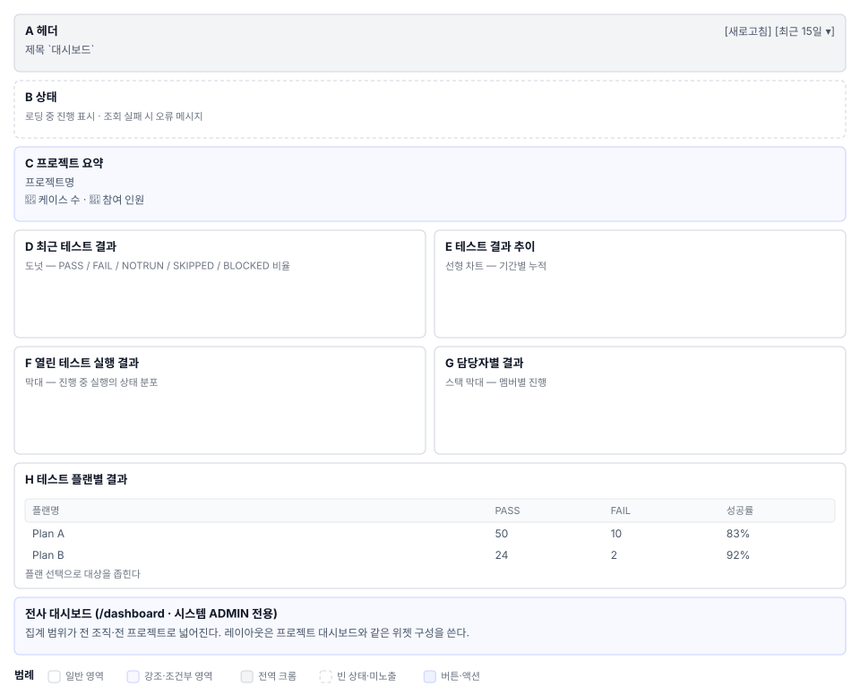

# 대시보드(S3) 화면정의

상위 문서: [`01_대시보드_업무프로세스.md`](01_대시보드_업무프로세스.md)

---

## 1. 화면 구성

### 1.1 프로젝트 대시보드 (`/projects/{projectId}`)

| 영역 | 이름 | 역할 |
|---|---|---|
| **A** | 헤더 | 제목 `대시보드` + `[새로고침]` 칩 + 최종 업데이트 시간 표시 |
| **B** | 로딩·에러 상태 | 진행 표시·에러 메시지·재시도 버튼 |
| **C** | 프로젝트 요약 (접이식 섹션) | 프로젝트명·케이스 수·멤버 수. 접기/펴기 가능 |
| **D** | 최근 테스트 결과 (파이차트) | 상태별(PASS/FAIL/BLOCKED/SKIPPED/NOTRUN) 건수 표시 |
| **E** | 테스트 결과 추이 (선형차트) | 기간별 누적 추이. 기본 15일 |
| **F** | 열린 테스트 실행 결과 (막대차트) | 진행 중인 실행의 상태 분포 |
| **G** | 담당자별 결과 (스택형 막대) | 멤버별 케이스 진행도(PASS/진행중/FAIL) |
| **H** | 테스트 플랜별 결과 (테이블) | 플랜 목록 + 플랜별 성공률 |
| **I** | 상태 표시 | 데이터 없음 경고 (로딩/에러 아닐 때) |

**배치 (모바일 반응형: `xs` 단일 컬럼 → `md` 2컬럼 그리드)**

### 1.2 전사 대시보드 (`/dashboard`, ADMIN 전용)

레이아웃은 프로젝트 대시보드와 유사하지만 집계 범위가 전체 조직이다.

---

## 2. 영역별 요소 정의

### 2.1 A. 헤더

| 요소 | 표시 | 동작 | 권한 |
|---|---|---|---|
| 제목 | 대시보드 (h5, 굵기 700) | — | 전원 |
| `[새로고침]` 칩 | secondary 색상, 작은 크기 | 데이터 재로드 | 프로젝트 액세스 권한 |
| 최종 업데이트 | M/D/YYYY 형식의 칩 | 마우스 올리면 정확한 시간 표시 | 전원 |

**`[새로고침]` 칩은 액티브 프로젝트가 있을 때만 보인다**. 프로젝트 없으면 숨겨진다.

### 2.2 B. 로딩·에러 상태

#### B1. 로딩 상태

┌──────────────────────────────────────────┐
│ 🔄 대시보드 데이터를 불러오는 중입니다 │
└──────────────────────────────────────────┘

배경색 info 계열 연한색. 로딩 중이면 위젯들은 보이지 않는다.

#### B2. 에러 상태

┌──────────────────────────────────────────┐
│ 🛠️ 서버 오류가 발생했습니다 │
│ 문제: 데이터베이스 연결 실패 │
│ 해결: [재시도] [자세히] │
└──────────────────────────────────────────┘

배경색 `error` 계열. 에러 타입별 아이콘:
- `SERVER_ERROR` → 🛠️
- `NETWORK_ERROR` → 🌐
- `AUTH_ERROR` → 🔐
- `NOT_FOUND_ERROR` → 🔍
- `PERMISSION_ERROR` → 🚫
- `DATA_ERROR` → 📊

버튼: `[재시도]` `[로그인으로]`(AUTH_ERROR일 때) `[자세히]`(상세 정보 있을 때)

### 2.3 C. 프로젝트 요약 (접이식 섹션)

| 요소 | 표시 | 동작 |
|---|---|---|
| 제목 | `프로젝트 요약` + 펼침 화살표 | 클릭 시 접이식 섹션 토글 (브라우저 저장소 저장) |
| 프로젝트명 | `h6`, 주 색상 | — |
| 케이스 수 칩 | 📄 + 숫자, `info` 색상 | — |
| 멤버 수 칩 | 👤 + 숫자, `secondary` 색상 | — |

**접이식 섹션 상태는 브라우저 저장소에 저장된다.** 새로고침 후에도 사용자가 닫아둔 섹션은 닫혀 있다.

### 2.4 D. 최근 테스트 결과 (파이차트)

5개 슬라이스: PASS(초록) / FAIL(빨강) / BLOCKED(주황) / SKIPPED(회색) / NOTRUN(밝은 회색).

| 요소 | 표시 | 동작 |
|---|---|---|
| 차트 | 5개 상태별 색상 구분된 파이 | — |
| 범례 | 차트 우측 또는 하단 | — |
| 숫자 표시 | 각 슬라이스에 건수 또는 퍼센트 | — |
| 새로고침 버튼 | 위젯 우상단 (공통) | 위젯 데이터만 재로드 |

### 2.5 E. 테스트 결과 추이 (선형차트)

x축: 날짜. y축: 누적 건수. 기본 기간: 최근 15일.

| 요소 | 표시 | 동작 |
|---|---|---|
| 선 | 상태별 5개 선 (색상 일치) | — |
| 범례 | 하단 또는 우측 | — |
| 기간 필터 | `[기간 선택 ▾]` | 기간 범위 변경 |
| 그리드 | 배경 격자선 | — |

### 2.6 F. 열린 테스트 실행 결과 (막대차트)

진행 중인 테스트 실행의 상태 분포를 막대로 보여준다.

| 요소 | 표시 | 동작 |
|---|---|---|
| 실행별 막대 | 실행ID 또는 날짜별. PASS/FAIL/진행중 누적 | — |
| 색상 | 상태별 구분 | — |
| 스택 형태 | 누적 막대 | — |

### 2.7 G. 담당자별 결과 (스택형 막대)

멤버별 케이스 진행 상황. 누적 막대로 각 사용자의 부하를 한눈에 본다.

| 요소 | 표시 | 의미 |
|---|---|---|
| 막대 | 멤버명, 스택 형태 (PASS/진행중/미완료) | 멤버별 케이스 진행 상태 |
| 색상 | PASS(초록) / 진행중(파랑) / 미완료(빨강) | 상태 식별 |
| 범례 | 우측 또는 하단 | 범례 표시 |
| 총합 라벨 | 막대 위에 전체 케이스 수 표시 | 담당 케이스 수 |

### 2.8 H. 테스트 플랜별 결과 (테이블)

| 요소 | 표시 | 동작 |
|---|---|---|
| 플랜 선택 드롭다운 | `[+ 플랜 선택 ▾]` | 플랜 선택 열기 |
| 선택된 플랜 이름 | 드롭다운 옆에 칩 형태로 표시 | 클릭 시 드롭다운 다시 열림 |
| 테이블 헤더 | 플랜이름 \| PASS \| FAIL \| 건너뜀 \| 성공률 | — |
| 테이블 행 | 각 플랜 또는 각 실행 | 클릭 시 플랜 상세 페이지로 이동 |

플랜 선택이 비워지면 전체 프로젝트의 최근 결과를 보여준다.

### 2.9 I. 데이터 없음 경고

┌──────────────────────────────────────────┐
│ ⚠️ 아직 실행이 없습니다 │
│ 테스트 결과가 기록되면 여기에 표시됩니다 │
└──────────────────────────────────────────┘

로딩 중이 아니고, 에러도 없고, 데이터도 없을 때만 표시된다. 배경색 `warning` 연한색.

---

## 3. 상태별 화면

### 3.1 초기 진입 (프로젝트 선택, 데이터 로드 중)

- 헤더: 제목 + 새로고침 칩 (활성)
- 상태: `[진행 표시] 대시보드 데이터를 불러오는 중입니다`
- 본문: 없음 (로딩 표시만)

### 3.2 데이터 로드 완료

- 헤더: 제목 + 새로고침 칩 + 최종 업데이트 시간
- 6개 위젯 모두 그려짐
- 접이식 섹션 상태는 브라우저 저장소 값을 복원

### 3.3 로드 실패

- 헤더: 제목만
- 에러 메시지 박스 (아이콘 + 메시지 + 버튼)
- 위젯: 보이지 않음

### 3.4 권한 없음 (403)

에러 메시지: "이 프로젝트에 접근할 권한이 없습니다"
`[다시 로그인]` 또는 `[프로젝트 목록으로]` 버튼.

### 3.5 프로젝트 없음 (S1에서 프로젝트를 선택하지 않은 상태)

헤더만 보이고, 6개 위젯 모두 숨겨짐. 재시도 버튼 없음(로드할 데이터가 없음).

---

## 4. 예시 데이터

매뉴얼 6절의 ShopFlow 데모 프로젝트 기준:

| 항목 | 값 |
|---|---|
| 프로젝트명 | ShopFlow |
| 총 케이스 | 127 |
| 멤버 수 | 8 |
| 최근 실행 결과 | PASS 89 / FAIL 18 / BLOCKED 12 / SKIPPED 5 / NOTRUN 3 |
| 완료율 | 76% |
| 담당자별 (예시) | 김철수(팀장): 45건 / 이영희: 38건 / 박민수: 44건 |
| 플랜 개수 | 5개 |

---

## 5. 권한별 화면 차이

| 항목 | ADMIN | PM/LEAD | DEV/CONTRIB | TESTER | VIEWER |
|---|---|---|---|---|---|
| 프로젝트 대시보드 보기 | ○ | ○ | ○ | ○ | ○ |
| 새로고침 버튼 | ○ | ○ | ○ | ○ | ○ |
| 전사 대시보드 링크 | ○ | — | — | — | — |
| 위젯 수정 | — | — | — | — | — |

**전사 대시보드는 ADMIN만 볼 수 있다.** MANAGER는 `/dashboard` 라우트 진입이 막혀 403이 나온다.

---

## 6. 화면 문구 규정 (i18n)

| 요소 | 한국어 키 | 영문 기본값 |
|---|---|---|
| 제목 | `dashboard.title` | `Dashboard` |
| 프로젝트 요약 | `dashboard.sections.summary` | `Project Summary` |
| 최근 테스트 결과 | (칩 제목) | `Recent Test Results` |
| 케이스 수 라벨 | `dashboard.project.totalTestCases` | `Test Cases: {count}` |
| 멤버 수 라벨 | `dashboard.project.members` | `Members: {count}` |
| 상태별 라벨 | `dashboard.status.pass`, `.fail`, `.blocked`, `.skipped`, `.notrun` | `PASS`, `FAIL`, … |
| 새로고침 버튼 | `dashboard.refresh.button` | `Refresh` |
| 로딩 메시지 | `dashboard.loading.data` | `Loading dashboard data...` |
| 에러 메시지 (공통) | `dashboard.error.solution` | `Error: {action}` |
| 재시도 버튼 | `dashboard.error.retry` | `Retry` |
| 데이터 없음 | `dashboard.noData.message` | `No test results yet` |

---

## 7. 04 요건 대조

각 요소가 어느 요건을 구현하는지는 `04_요건반영목록.md`에서 다룬다.

| 요소 | 요건 | 위치 |
|---|---|---|
| 6개 위젯 | `S3-01` `S3-02` | 02 1-2절 |
| 플랜 선택 필터 | `S3-03` | 02 2.8절 |
| 전사 대시보드 | `S3-04` (비기능) | 02 1.2절 04의 `S3-N1` |

---

## 8. 비고

- ⚠ **기간 필터 구현**: 기본 15일 고정인지 사용자가 범위를 변경할 수 있는지 확인 필요.
- ⚠ **차트 수치 표시**: 파이차트와 막대차트에서 건수/퍼센트를 어떻게 표시할지 시각 확인 필요.
- ⚠ **플랜별 결과 테이블 클릭 동작**: 플랜 상세 페이지로 이동할지, 같은 화면에서 필터만 변경할지 동작 확인 필요.
