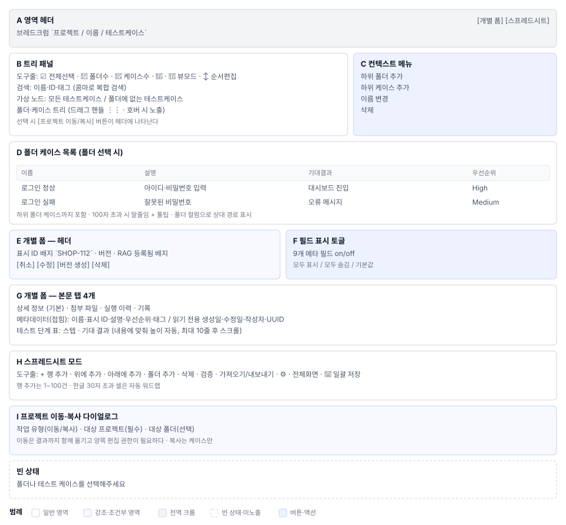

# 테스트케이스(S4) 화면정의

> 화면 ID **S4** · 상위 문서: [`01_테스트케이스_업무프로세스.md`](01_테스트케이스_업무프로세스.md)
> 라우트: `/projects/{projectId}/testcases` · `/projects/{projectId}/testcases/{testCaseId}`
> 캡처(매뉴얼 `images/`): `21_testcase_page.png` · `24_tree_populated.png` · `87_tree_folder_only.png` · `88_folder_case_list.png` · `89_all_cases_list.png` · `44b_field_visibility.png` · `44c_form_metadata.png` · `93_form_delete_dialog.png` · `94_cross_project_dialog.png` · `100_tree_filter_search.png`

---

## 1. 화면 구성

| 영역 | 이름 | 역할 |
|---|---|---|
| **A** | 좌측 네비게이션 헤더 | 프로젝트명 탭 3개(`[폴더만]` / `[전체]` / `[검색]`) |
| **B** | 트리 필터 입력 | 이름 부분일치 검색 콤마 복합 debounce 300ms |
| **C** | 트리 본문 | 가상 노드 2개(`모든 케이스` / `미분류`) 폴더 케이스 항목 |
| **D** | 트리 컨텍스트 메뉴 | 우클릭 메뉴: 추가 편집 삭제 프로젝트 이동 프로젝트 복사 정렬 |
| **E** | 우측 본문 헤더 | 경로 표시 도구줄 7개(추가·편집·삭제·복사·이동·내보내기·더보기) |
| **F** | 우측 본문 탭 4개 | 상세정보 첨부(조건부) 실행이력(조건부) 기록(조건부) |
| **G** | 탭별 필드 가시성 토글 | 표시할 필드 선택 사용자별 저장 상세정보 탭에서만 |
| **H** | 우측 본문 폼(탭0) | 메타정보 기본정보 스텝 테이블 기대결과 버전 |
| **I** | 우측 본문 스프레드시트(선택) | 여러 케이스 표 형식 일괄 편집 토글 버튼으로 전환 |

케이스가 미선택이면 C·H 자리에 안내 메시지 하나만 그린다.

---

## 2. 영역별 요소 정의

### 2.1 A. 좌측 트리 헤더

| 요소 | 표시 | 동작 |
|---|---|---|
| 프로젝트명 | `text`, 600 굵기 | — |
| `[폴더만]` 버튼 | 토글, 상태 표시 | 폴더 전용 모드 전환 브라우저 저장소 저장 |
| `[전체]` 버튼 | 토글 | 폴더+케이스 전체 모드 전환 브라우저 저장소 저장 |
| `[검색]` 버튼 | 검색 아이콘 | 필터 입력 필드 포커스 |

보기 모드 선택은 **프로젝트별 독립**이다. 한 프로젝트의 선택을 다른 프로젝트로 이동해도 기억된다.

### 2.2 B. 필터 입력

입력 필드의 placeholder는 `t("testcase.search", "검색...")` 이다.

| 규칙 | 설명 |
|---|---|
| 부분일치 | 이름에 입력값이 포함되면 일치 |
| 콤마 분할 | 쉼표로 여러 검색어를 AND 연결 |
| debounce | 입력 후 300ms 대기 후 필터링 |
| 조상/하위 유지 | 검색 결과 노드의 조상과 하위는 함께 표시 |

filterText가 공백이면 필터가 해제된다.

### 2.3 C. 트리 본문

#### 가상 노드 2개

| 노드 | 아이콘 | 행위 |
|---|---|---|
| 모든 케이스 | 📋 | 클릭 시 프로젝트의 모든 케이스 전체 선택(스프레드시트 모드에서 유용) |
| 미분류 | 🚫 | 클릭 시 폴더 미지정 케이스 필터링 |

가상 노드는 실제 DB 노드가 아니며, 필터링/정렬 상태에 반응하지 않는다.

#### 폴더 항목

| 요소 | 표시 | 동작 |
|---|---|---|
| 폴더 아이콘 | 📁 | — |
| 폴더명 | 텍스트 | 더블클릭으로 폴더 편집 다이얼로그 |
| 하위 케이스 개수 | `(숫자)` 오른쪽 | 폴더 내 모든 케이스 총합 (재귀 포함) |
| DnD 핸들 | ⋮⋮ 아이콘 | 드래그 포인트 |
| 폴더 정보 버튼 | ℹ️ | 폴더 메타정보 표시 |
| 하위 케이스 보기 버튼 | ▶️ | 폴더 펼침/닫힘 (indentation 증가/감소) |

#### 케이스 항목

| 요소 | 표시 | 규칙 |
|---|---|---|
| 케이스 아이콘 | 📄 🟢(자동화됨) | — |
| 표시 ID | `TC-001` 등 | 케이스별 고유 |
| 케이스명 | 텍스트 | — |
| 자동화 여부 | 🟢 뱃지 | `linkedJunitCases` 배열이 비어있지 않으면 표시 |
| RAG 연결 여부 | 📚 뱃지 | `linkedDocuments` 배열이 비어있지 않으면 표시 |

케이스 항목은 더블클릭으로 우측 폼을 로드한다.

### 2.4 D. 트리 컨텍스트 메뉴

마우스 우클릭 시 표시되는 메뉴다. 대상(폴더/케이스)과 권한에 따라 항목이 달라진다.

| 항목 | 아이콘 | 표시 조건 | 동작 |
|---|---|---|---|
| 케이스 추가 | ➕ | 폴더 우클릭 | 신규 폼 다이얼로그(전체 필드) |
| 폴더 추가 | 📁 | 폴더 우클릭 | 신규 폴더 다이얼로그 |
| 편집 | ✏️ | 케이스/폴더 우클릭 | 편집 폼/다이얼로그 |
| 삭제 | 🗑️ | 케이스/폴더 EDITOR 이상 | 삭제 확인 다이얼로그 |
| 프로젝트 이동 | ⬆️ | 케이스 EDITOR 이상 | 프로젝트 선택 다이얼로그 |
| 프로젝트 복사 | 📋 | 케이스 인증 사용자 | 프로젝트 선택 다이얼로그 |
| 정렬 | ⬆️⬇️ | 폴더 우클릭 EDITOR 이상 | 하위 케이스 정렬 다이얼로그 |

메뉴는 클릭 좌표에 뜹니다(`anchorPosition`). 닫힘 애니메이션 완료 후 대상이 사라지는 일이 없도록 `menuOpen` 플래그로 제어한다.

### 2.5 E. 우측 헤더

폐기된 탭이다. 현재는 탭 아래 도구줄로 통합됨.

| 요소 | 표시 | 동작 |
|---|---|---|
| 경로 표시 | `프로젝트 / 폴더 / 케이스명` | 현재 선택 노드 경로 |
| `[+ 케이스 추가]` | 버튼 | F의 신규 폼 다이얼로그 |
| `[편집]` | 버튼 선택 조건 | F의 편집 폼 |
| `[삭제]` | 버튼 권한 제한 | 삭제 확인 다이얼로그 |
| `[복사]` | 버튼 | 같은 폴더 내 복사 |
| `[이동]` | 버튼 | 폴더 선택 다이얼로그 |
| `[내보내기]` | 버튼 | CSV/JSON 다운로드 |
| `[⋮ 더보기]` | 메뉴 | 추가 액션(버전 첨부 스프레드시트) |

### 2.6 F. 우측 탭 4개

#### 탭 조건부 표시

| 탭 | 라벨 | 표시 조건 |
|---|---|---|
| 상세정보 | `t("testcase.tabs.details", "상세 정보")` | 항상 |
| 첨부파일 | `t("testcase.tabs.attachments", "첨부 파일")` | `testCaseId` 존재 |
| 실행이력 | `t("testcase.tabs.execution", "실행 이력")` | `testCaseId` 존재 `!isFolder` |
| 기록 | `t("testcase.tabs.history", "기록")` | `testCaseId` 존재 `!isFolder` |

폴더를 선택하면 상세정보 탭만 표시된다.

### 2.7 G. 필드 가시성 토글

상세 정보 탭의 우측 끝에 놓인다.

| 기능 | 동작 | 저장 |
|---|---|---|
| 필드 체크박스 | 개별 필드의 표시/숨김 토글 | 프로젝트별 저장 |
| `[모두 표시]` | 모든 필드 표시 | — |
| `[모두 숨김]` | 모든 필드 숨김 | — |
| `[초기화]` | 기본 필드 세트로 복원 | — |

약 50개의 필드 중 사용자가 필요한 것만 선택한다. 토글 선택은 프로젝트별 + 사용자별로 독립적으로 저장된다.

### 2.8 H. 상세정보 탭 폼

| # | 섹션 | 설명 |
|---|---|---|
| 1 | 메타정보 | 케이스 ID, 작성자, 생성일 등 |
| 2 | 기본정보 | 이름, 설명, 우선순위, 태그 등 |
| 3 | 테스트 단계 | 테스트 수행 단계 입력 테이블 |
| 4 | 기대결과 | 예상 결과 마크다운 편집 |

각 섹션은 접이식 섹션으로 펼침/닫힘 가능하다. 섹션 상태는 로컬 상태로 유지된다.

**필드 토글 9개(예시):**
- 이름 설명 사전조건 기대결과 우선순위 타입 태그 작성자 생성일

숨겨진 필드는 폼에서 보이지 않으나, 데이터는 유지된다.

### 2.9 I. 스프레드시트 모드

`더보기` 메뉴의 `[스프레드시트 보기]` 선택 시 전환된다.

| 기능 | 표시 | 동작 |
|---|---|---|
| 헤더 | 필드명 칼럼 | — |
| 행 | 케이스 1개 = 행 1개 | 셀 클릭으로 인라인 에디터 열기 |
| 열 추가 | 톱니바퀴 🔧 | 표시할 칼럼 선택 |
| 행 추가 | `[+ 행 추가]` | 신규 케이스 행 추가 |
| 행 삭제 | `[🗑️]` | 케이스 삭제 확인 |
| 저장 | `[저장]` | 모든 변경사항 한 번에 저장 |

스프레드시트는 성능상 가상 렌더링을 사용하여 보이는 행만 렌더한다.

---

## 3. 상태별 화면

### 3.1 빈 상태

케이스가 0건이거나 검색 결과가 없을 때 우측에 표시된다.

| 상황 | 표시 | 버튼 |
|---|---|---|
| 프로젝트의 케이스 0건 | `테스트케이스가 없습니다` 안내 | `[+ 새 케이스 추가]` |
| 검색 결과 0건 | `'{검색어}'에 일치하는 케이스가 없습니다` | 검색어 초기화 버튼 |

### 3.2 읽기 전용 (VIEWER 역할)

| 요소 | 상태 |
|---|---|
| 도구줄 버튼 | 비활성(disabled), 편집·삭제 불가 |
| 폼 필드 | readOnly 또는 disabled 속성 |
| 첨부 업로드 | 불가, 다운로드만 |
| 메뉴 항목 | 삭제·이동·복사 항목 숨김 |

### 3.3 폴더 선택 시

폴더를 선택하면 우측 폼은 폴더 정보 양식으로 전환된다.

| 표시 | 설명 |
|---|---|
| 폴더명 설명 케이스 수 | 폴더의 메타정보만 |
| 탭 1, 2, 3 숨김 | 상세정보 탭만 표시 |
| 스텝 테이블 없음 | 폴더에는 스텝이 없음 |

---

## 4. 권한별 화면 차이

| 역할 | 케이스 추가 | 케이스 편집 | 케이스 삭제 | 폴더 변경 | 첨부 업로드 |
|---|---|---|---|---|---|
| **ADMIN** | ✅ | ✅ | ✅ | ✅ | ✅ |
| **EDITOR** | ✅ | ✅ | ✅ | ✅ | ✅ |
| **VIEWER** | ❌ 비활성 | ❌ 읽기전용 | ❌ 비활성 | ❌ 비활성 | ❌ 다운로드만 |

권한 판정은 프로젝트 역할(`projectRole`)로 하며, 시스템 역할이 아니다.

---

## 5. 화면 문구 규정

| 문구 | i18n 키 | 폴백 | 위치 |
|---|---|---|---|
| 추가 | `testcase.action.add` | `케이스 추가` | 도구줄·메뉴 |
| 편집 | `testcase.action.edit` | `편집` | 도구줄·메뉴 |
| 삭제 | `testcase.action.delete` | `삭제` | 도구줄·메뉴 |
| 저장 | `testcase.action.save` | `저장` | 폼 버튼 |
| 취소 | `testcase.action.cancel` | `취소` | 폼 버튼 |
| 이동 | `testcase.action.move` | `이동` | 메뉴 |
| 복사 | `testcase.action.copy` | `복사` | 메뉴 |
| 내보내기 | `testcase.action.export` | `내보내기` | 도구줄 |

모든 버튼·라벨·플레이스홀더는 i18n 함수로 다국어를 지원하며, 폴백 텍스트는 한국어다.

---

## 6. 다이얼로그 및 부가 화면

### 신규/편집 폼 다이얼로그
폭 `lg`, 최대 높이 `80vh`, 모드에 따라 제목이 `새 테스트케이스 생성` / `테스트케이스 수정`.

### 폴더 편집 다이얼로그
폴더명 설명 입력. 드롭다운으로 상위 폴더 선택 가능.

### 버전 다이얼로그
 컴포넌트. 버전 라벨 설명 입력 후 `[저장]`.

### 삭제 확인 다이얼로그
`'{케이스명}' 테스트케이스를 정말 삭제하시겠습니까?` 경고. 일반/강제 두 모드 없음(케이스는 일반 삭제만 지원).

### 프로젝트 이동/복사 다이얼로그
대상 프로젝트 선택 → 대상 폴더 선택 → `[이동]` / `[복사]`.
