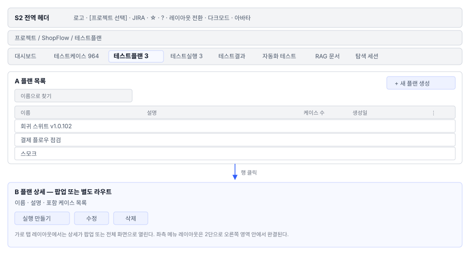
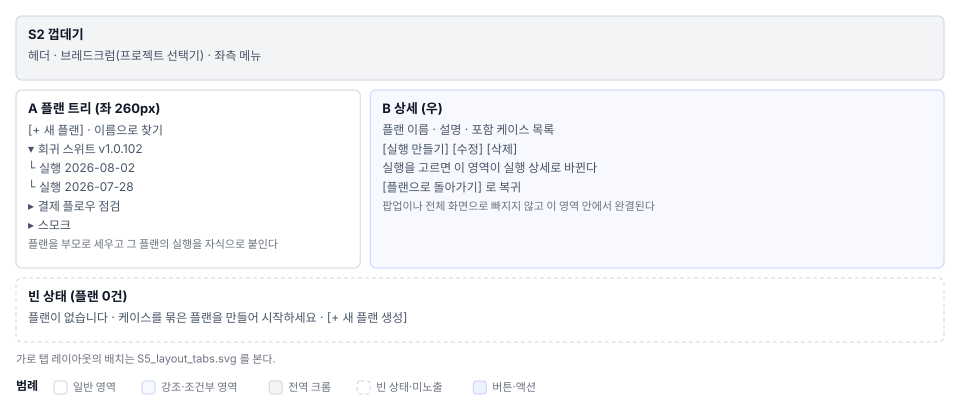

# 테스트플랜(S5) 화면정의

> 화면 ID **S5** 화면명 **테스트 플랜**
> 상위 문서: [`README.md`](../README.md)

---

## 1. 화면 구성

S5는 프로젝트 레이아웃(가로 탭 vs 좌측 메뉴)에 따라 두 가지 형태로 표현된다.

### 1.1 가로 탭 레이아웃

| 영역 | 이름 | 역할 |
|---|---|---|
| **A** | 플랜 목록 | 플랜 카드/행을 페이지네이션과 함께 표시 |
| **A-1** | 생성 버튼 | 새 플랜 생성 다이얼로그 열기 |
| **A-2** | 카드/행 | 플랜 ID 이름 설명 케이스 수 생성일 메뉴 버튼 |
| **A-3** | 메뉴 버튼(`⋮`) | 수정 삭제 자동화 연결 |

### 1.2 좌측 메뉴 레이아웃

| 영역 | 이름 | 역할 |
|---|---|---|
| **좌측** | 플랜·실행 트리 | 플랜(부모) 아래 그 플랜의 실행(자식) 표시 |
| **좌측-1** | `[+ 새 플랜]` | 새 플랜 생성 폼 열기 (오른쪽 영역에) |
| **좌측-2** | 플랜 노드 | 플랜 이름 실행 펼침 토글(`▶`/`▼`) 검색 필터 |
| **좌측-3** | 실행 노드(자식) | 실행 이름 상태 칩(COMPLETED/IN_PROGRESS 등) 소속 플랜 |
| **좌측-4** | 접기 버튼 | 왼쪽을 숨겨 오른쪽을 넓게 본다 |
| **우측** | 본문 영역 | 플랜 상세 또는 실행 상세 |

---

## 2. 영역별 요소 정의

### 2.1 플랜 카드 / 행

**가로 탭 레이아웃의 카드 그리드**

┌──────────────────────────────┐
│ 플랜 이름 │
├──────────────────────────────┤
│ 설명 (2줄, 초과시 ... ) │
├──────────────────────────────┤
│ 케이스 수: N건 생성일 │
├──────────────────────────────┤
│ [✎ 수정] [⋮ 메뉴] │
└──────────────────────────────┘

**좌측 메뉴 레이아웃의 트리 노드**

▶ 플랜 이름 [⋮]
 실행-1 [칩: COMPLETED]
 실행-2 [칩: IN_PROGRESS]

**요소**

| 요소 | 표시 내용 | 상태 표기 |
|---|---|---|
| 플랜 이름 | `testPlan.name` | 단일행 텍스트 |
| 설명 | `testPlan.description` | 2줄 넘치면 `...` |
| 케이스 수 | `testPlan.testCaseIds.length` 또는 실제 케이스 수 | 배지 또는 텍스트 |
| 생성일 | `testPlan.createdAt` | 날짜 형식(사용자 시간대) |
| 상태 칩 | 실행 상태(`COMPLETED`·`IN_PROGRESS`·`ABORTED`·기타) | 칩 색상(초록·주황·빨강) |
| 메뉴 버튼 | `⋮` 또는 3줄 아이콘 | 클릭 → 드롭다운 |

### 2.2 플랜 생성/수정 폼

| 필드 | 유형 | 필수 | 초기값 |
|---|---|---|---|
| **이름** | 텍스트 | ○ | 비어있음 (수정 시: 기존값) |
| **설명** | 텍스트 영역 | × | 비어있음 |
| **포함 케이스** | 다중선택 트리 | ○ | 비어있음 |

**케이스 선택 트리**

□ ShopFlow 프로젝트
 □ 회원 관리
 ☑ 회원가입
 ☑ 로그인
 □ 주문 관리
 □ 주문 생성
 □ 주문 취소

- 폴더 체크박스: 폴더를 선택하면 폴더 내 **모든 케이스**가 포함된다
- 다중 선택 지원
- 선택 전 최초: 트리는 닫혀있고 체크는 0개
- 이미 선택된 케이스는 체크 표시

### 2.3 플랜 상세 (2단 레이아웃 — 우측 영역)

┌──────────────────────────────────┐
│ 플랜 이름 │
├──────────────────────────────────┤
│ 설명 (전체 보임, 스크롤 가능) │
├──────────────────────────────────┤
│ 포함 케이스 목록 │
│ ├─ 이름·우선순위·상태 │
│ └─ [페이지네이션] │
├──────────────────────────────────┤
│ [수정] [삭제] [실행 만들기] │
└──────────────────────────────────┘

---

## 3. 상태별 화면

### 3.1 플랜 0건 (빈 상태)

대시보드 · 테스트케이스 · [테스트플랜] · 실행 · 결과

 ┌────────────────────────────┐
 │ │
 │ 플랜이 없습니다 │
 │ 케이스를 묶은 플랜을 │
 │ 만들어 시작하세요 │
 │ │
 │ [+ 새 플랜 생성] │
 │ │
 └────────────────────────────┘

- 빈 상태 아이콘 + 3줄 안내문
- 생성 버튼 1개
- 탭은 없음

### 3.2 플랜 N건 (목록)

생성일 역순(가장 최근 것 맨 아래)으로 정렬.

가로 탭 레이아웃: 카드 그리드, 페이지당 10건
좌측 메뉴 레이아웃: 트리, 플랜 펼침 토글로 실행 표시/숨김

### 3.3 생성 모드

다이얼로그(가로 탭) 또는 오른쪽 영역(좌측 메뉴)
제목: "새 플랜 생성"
버튼: `[저장]` `[취소]`

### 3.4 수정 모드

플랜 카드의 `✎` 또는 상세의 `[수정]` 클릭
제목: "플랜 수정"
초기값: 기존 이름·설명·케이스 목록
버튼: `[저장]` `[취소]`

### 3.5 권한 없음

편집 권한이 없으면(TESTER·VIEWER):
- `[+ 새 플랜 생성]` 버튼 숨김
- `⋮` 메뉴 버튼 숨김
- 목록은 읽기 전용

---

## 4. 예시 데이터

예제 프로젝트(**ShopFlow**) 데이터:

| 플랜 ID | 플랜명 | 설명 | 케이스 수 | 생성일 | 비고 |
|---|---|---|---|---|---|
| `plan-01` | 회원 관리 v1 | 회원가입, 로그인, 비밀번호 변경 테스트 | 5 | 2026-06-15 | 완료 |
| `plan-02` | 주문 생성 | 주문 생성부터 결제까지 | 12 | 2026-07-10 | 진행 중 |
| `plan-03` | 결제 및 배송 | 결제 게이트웨이 통합 | 8 | 2026-07-20 | 신규 |

---

## 5. 권한별 화면 차이

| 기능 | PM LEAD | DEVELOPER CONTRIBUTOR | TESTER | VIEWER |
|---|---|---|---|---|
| 목록 조회 | ○ | ○ | ○ | ○ |
| 카드 전체 기능 | **전체** | **전체** | 읽기 전용 | 읽기 전용 |
| `[+ 새 플랜 생성]` | ○ | ○ | **×** | × |
| `⋮` 메뉴(수정·삭제) | ○ | ○ | × | × |
| `[실행 시작]` | ○ | ○ | ○ | × |
| 자동화 연결 | ○ | ○ | ⚠ 확인 필요 | × |

---

## 6. 화면 문구 규정

| 요소 | 문구 | 설명 |
|---|---|---|
| 탭명 | 테스트 플랜 | i18n 지원 |
| 생성 버튼 | + 새 플랜 생성 | i18n 지원 |
| 빈 상태 제목 | `플랜이 없습니다` | i18n 지원 |
| 빈 상태 안내 | 케이스를 묶은 플랜을 만들어 시작하세요 | 매뉴얼과 통일 |
| 메뉴 항목 | 수정 / 삭제 / 자동화 연결 | 한국어 일관성 |
| 상태 칩 | COMPLETED / IN_PROGRESS / ABORTED | 영문 고정 |

---

## 7. 요건 대조

| 요건ID | 내용 | 화면 위치 | 상태 |
|---|---|---|---|
| S5-UI-01 | 플랜 목록 카드/표 | 1.1절 영역A | 정상 |
| S5-UI-02 | 플랜 생성 다이얼로그 | 2.2절 3.3절 | 정상 |
| S5-UI-03 | 플랜 수정 폼 | 3.4절 | 정상 |
| S5-UI-04 | 케이스 다중선택 트리 | 2.2절 2.3절 | 정상 |
| S5-UI-05 | 2단 레이아웃(좌측 메뉴) | 1.2절 | 환경 의존 |
| S5-UI-06 | 플랜·실행 트리 | 1.2절 영역좌측 | 환경 의존 |
| S5-UI-07 | 권한별 버튼 노출 | 5절 | 정상 |

---
