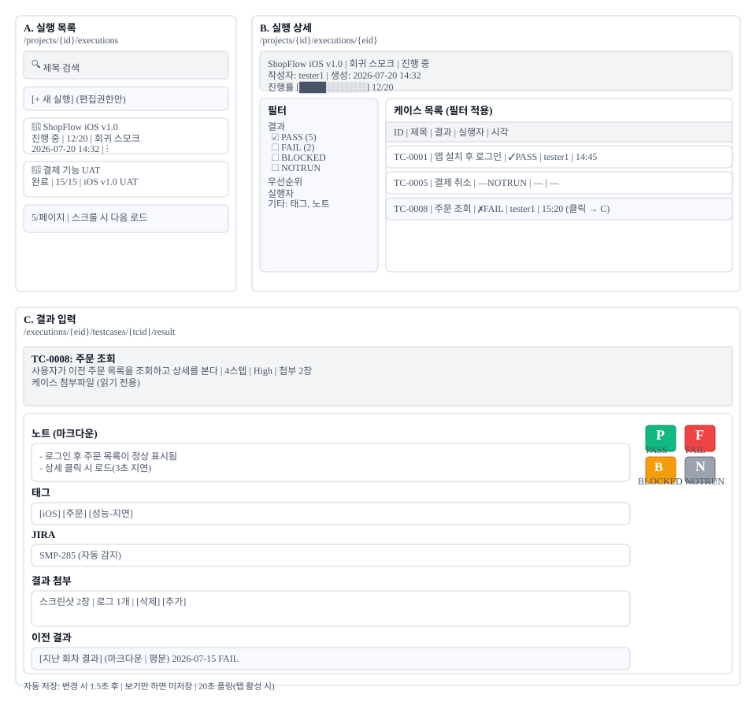

# 테스트 실행(S6) 화면정의

> 화면 ID **S6** · 상위 문서: [`01_테스트실행_업무프로세스.md`](01_테스트실행_업무프로세스.md)
> 라우트: `/projects/{projectId}/executions` · `/executions/{executionId}` · `/executions/{executionId}/testcases/{testCaseId}/result`
> 캡처: 매뉴얼 `images/` 의 `52_executions.png` · `52b_execution_filter_panel.png` · `91_prev_results_dialog.png` · `99_execution_workspace.png`

---

## 1. 화면 구성

### 1.1 전체 배치 3화면

테스트 실행은 **목록 화면(A) → 상세 화면(B) → 결과 입력 화면(C)** 의 3단계로 진행된다.

| 화면 | 라우트 | 주 컴포넌트 | 영역 | 설명 |
|---|---|---|---|---|
| **A. 목록** | `/projects/{id}/executions` | | 1~4 | 실행 카드 그리드, 검색, 자동 갱신 |
| **B. 상세** | `/projects/{id}/executions/{eid}` | | 5~7 | 실행의 케이스 목록, 필터 패널, 상세 정보 |
| **C. 결과 입력** | `/executions/{eid}/testcases/{tcid}/result` | | 8~12 | 결과 4값 버튼, 노트·태그·JIRA·첨부, 이전 결과 |

---

## 2. 영역별 요소 정의

### 영역 1: 검색 + 생성 버튼 (화면 A)

| 요소 | 표시 | 조건 |
|---|---|---|
| **검색 입력창** | 돋보기 아이콘 + "제목 검색" placeholder | 항상 보임 |
| **검색 결과** | 입력한 글자가 제목에 포함된 실행만 필터 | 실시간 |
| **[+ 새 실행]** | 초록 버튼 | 편집 권한(PM/LEAD/DEV/CONTRIBUTOR)만 |
| **검색어 보존** | 프로젝트별로 sessionStorage 저장 | 매번 진입 시 복원 |

### 영역 2: 실행 카드 그리드 (화면 A)

| 요소 | 구성 | 상호작용 |
|---|---|---|
| **카드당 표시** | 실행 이름 / 상태(상태 칩) / 진행률 바 / 소속 플랜 / 생성일 | 클릭 시 상세로 진입 |
| **상태 칩** | DRAFT(회색) / IN_PROGRESS(파랑) / COMPLETED(초록) | 상태에 따른 색상 분류 |
| **진행률** | [████░░░░] 12/20 형태, 완료 케이스 수 / 전체 카운트 | 20초 자동 갱신(탭 활성 시) |
| **카드 우상단 메뉴** | ⋮ (3점) | 삭제 |
| **페이징** | 5개씩 표시, 스크롤하면 다음 페이지 로드 | 무한 스크롤(IntersectionObserver) |

### 영역 3: 필터 패널 (화면 B, 좌측)

| 필터 | 옵션 | 효과 | 참조 |
|---|---|---|---|
| **결과** | 모두 / PASS / FAIL / BLOCKED / NOTRUN (각 개수 표시) | 선택한 상태만 테이블에 표시 | |
| **우선순위** | 모두 / Critical / High / Medium / Low | 케이스의 우선순위로 필터 | S4에서 설정 |
| **실행자** | 모두 / tester1 / tester2 /... | 누가 기입한 결과만 | 프로젝트 멤버 목록 |
| **실행일자** | 날짜 범위(시작~종료) | 기간 내 기입된 결과만 | 날짜 피커 |
| **JIRA** | 있음 / 없음 | JIRA 링크 유무로 필터 | JIRA 통합 활성 시만 노출 |
| **노트** | 있음 / 없음 | 노트가 채워진 결과만 | — |
| **태그** | 프로젝트의 모든 태그 (멀티 선택) | AND 조건 | 여러 태그 동시 선택 |

필터는 브라우저 저장소에 보존되므로, 같은 화면을 다시 열면 이전 필터가 유지된다.

### 영역 4: 케이스 목록 테이블 (화면 B, 우측)

| 열 | 표시 | 클릭 | 정렬 |
|---|---|---|---|
| **ID** | TC-0001 형태 | 클릭 시 결과 입력 화면(C)으로 | — |
| **제목** | 케이스 이름 | 같음 | — |
| **결과** | ✓PASS / ✗FAIL / ⚠BLOCKED / —NOTRUN | 색상 칩(초록/빨강/주황/회색) | — |
| **실행자** | 결과를 기입한 사용자 이름 | — | — |
| **시각** | 결과 저장 일시(HH:MM 또는 YYYY-MM-DD HH:MM) | — | — |

테이블은 필터 패널의 선택을 실시간 반영한다. 필터를 변경하면 테이블이 즉시 갱신된다.

### 영역 5: 실행 정보 헤더 (화면 B·C 공통)

| 항목 | 표시 | 편집 권한 |
|---|---|---|
| **실행 이름** | `ShopFlow iOS v1.0` | 생성자·PM 이 고칠 수 있다 |
| **소속 플랜** | `회귀 스모크` 또는 `(플랜 없음)` | 생성 후 바꿀 수 없다 |
| **상태** | 준비 · 진행 중 · 완료 | 직접 바꾸거나 모든 케이스가 끝나면 자동으로 넘어간다 |
| **생성자·생성일** | `tester1 · 2026-07-20 14:32` | 읽기 전용 |
| **진행률** | `[████░░░░] 12/20` | 읽기 전용. 약 20초 주기로 갱신된다 |

### 영역 6: 케이스 상세 (화면 C, 상단)

| 항목 | 표시 |
|---|---|
| **케이스 ID 제목** | TC-0008 주문 조회 |
| **설명** | 마크다운 렌더링 |
| **스텝** | "4단계" 링크(클릭 시 스텝 상세 토글) |
| **우선순위** | "High" 칩 (색상) |
| **케이스 첨부파일** | 이미지/파일 목록, 읽기 전용 |

케이스 정보는 모두 읽기 전용이다. 편집하려면 S4 케이스 화면으로 돌아가야 한다.

### 영역 7: 결과 입력 필드 (화면 C, 중단)

#### 7.1 결과 상태 (플로팅 버튼)

| 버튼 | 키 | 색상 | 의미 | 참조 |
|---|---|---|---|---|
| **P** | P | 초록(#10b981) | PASS 통과 | `TestResult.PASS` |
| **F** | F | 빨강(#ef4444) | FAIL 실패 | `TestResult.FAIL` |
| **B** | B | 주황(#f59e0b) | BLOCKED 차단 | `TestResult.BLOCKED` |
| **N** | N | 회색(#9ca3af) | NOTRUN 미실행 | `TestResult.NOTRUN` |

마우스/터치로 클릭하거나 키보드 단축키로 입력 가능(`KEY_RESULT_MAP`).

#### 7.2 노트

| 항목 | 형식 | 제한 | 참조 |
|---|---|---|---|
| **입력** | 마크다운(리스트, 코드, 링크 지원) | 제한 없음 | |
| **저장** | 약 1.5초 디바운스 후 자동 저장 | 변경 시만 | 자동 저장 훅 |
| **렌더링** | 마크다운 → HTML | 결과 조회 시 | S7에서 노트 표시 |

노트는 테스트 수행 중 발견 사항, 실패 원인, 스크린샷 설명 등을 기입하는 곳이다.

#### 7.3 태그

| 항목 | 기능 | 참조 |
|---|---|---|
| **추가** | 기존 태그 자동완성 또는 새 태그 생성 | |
| **상속** | 실행의 태그를 결과마다 상속(수정 가능) | `TestExecution.tags` → `TestResult.tags` |
| **저장** | 자동 저장(약 1.5초) | — |

태그는 결과 검색·분류·통계에 쓰인다.

#### 7.4 JIRA

| 항목 | 기능 | 조건 | 참조 |
|---|---|---|---|
| **자동 감지** | 노트나 케이스 설명에 "SMP-285" 등 이슈 키가 있으면 자동 추출 | JIRA 통합 활성 | |
| **수동 입력** | 드롭다운 검색 또는 텍스트 입력 | — | — |
| **링크** | JIRA 이슈로 향하는 링크 표시 | — | — |

JIRA 통합이 비활성이면 이 영역은 노출되지 않는다.

#### 7.5 결과 첨부

| 항목 | 기능 | 제한 | 참조 |
|---|---|---|---|
| **파일 추가** | 드래그 앤드롭 또는 파일 선택 | 이미지·압축·문서 (예:.png,.zip,.pdf) | |
| **용량** | ⚠ 확인 필요 | 파일당 / 실행당 최대값 | 백엔드 설정 |
| **개수** | 수량 제한 | ⚠ 확인 필요 | 백엔드 설정 |
| **표시** | 파일 이름 + 크기 + 삭제 버튼 | — | — |

결과 첨부는 스크린샷, 에러 로그, 성능 프로파일 등을 보관한다.

### 영역 8: 이전 결과 다이얼로그 (화면 C, 하단)

| 항목 | 기능 | 참조 |
|---|---|---|
| **버튼** | "[지난 회차 결과]" | 클릭 시 다이얼로그 열림 |
| **토글** | 마크다운 · 평문 | 표시 형식 변경 |
| **내용** | 이전 회차 결과(결과/노트/태그/JIRA/첨부) | 읽기 전용 |
| **메타** | "2026-07-15 FAIL (tester1)" | 누가, 언제, 무슨 결과 |

같은 케이스를 다시 테스트할 때 과거 이력을 참고하는 용도다. 회귀 테스트나 재현 테스트에 유용하다.

---

## 3. 상태별 화면

### 3.1 실행 상태에 따른 화면 차이

| 실행 상태 | 목록 | 상세 | 결과 입력 | 비고 |
|---|---|---|---|---|
| **DRAFT** | 카드 회색, 진행률 0% | 모든 필드 편집 가능 | 결과 입력 가능 | 아직 시작 안 함 |
| **IN_PROGRESS** | 카드 파랑, 진행률 N% | 실행 이름만 편집, 상태 변경 불가 | 결과 입력 가능 | 진행 중 |
| **COMPLETED** | 카드 초록, 진행률 100% | 모든 필드 읽기 전용 | 결과 편집 불가능(읽기만) | 모든 케이스 완료 |

### 3.2 권한별 화면 차이

| 권한 | 실행 생성 | 실행 편집 | 실행 삭제 | 결과 기록 | 결과 편집 |
|---|---|---|---|---|---|
| PROJECT_MANAGER | ○ | ○(자신의) | ○(자신의) | ○ | ○(자신의) |
| LEAD_DEVELOPER | ○ | ○(자신의) | ○(자신의) | ○ | ○(자신의) |
| DEVELOPER | ○ | ○(자신의) | ○(자신의) | ○ | ○(자신의) |
| CONTRIBUTOR | ○ | ○(자신의) | ○(자신의) | ○ | ○(자신의) |
| **TESTER** | — | — | — | **○** | ○(자신의) |
| VIEWER | ○(읽기) | — | — | — | — |

**TESTER**: 결과 기록 권한이 있으므로 P/F/B/N 버튼과 노트·태그·첨부가 활성화된다.

### 3.3 필터 적용 전후

| 상황 | 테이블 표시 | 필터 패널 표시 |
|---|---|---|
| **필터 없음(기본)** | 모든 케이스 20개씩 | 모든 조건 초기 상태 |
| **"결과: FAIL" 선택** | FAIL 케이스만 3개 | "결과" 항목에 "FAIL"만 체크 |
| **다중 필터** | 교집합(AND) | 여러 조건 동시 적용 |

---

## 4. 예시 데이터

### 4.1 프로젝트: ShopFlow(시드 데이터)

| 항목 | 값 |
|---|---|
| 프로젝트명 | ShopFlow |
| 코드 | SMP |
| 플랜 | "회귀 스모크 테스트", "iOS v1.0 UAT" |
| 케이스 수 | 50개 |
| 멤버 | tester1(TESTER), tester2(TESTER), dev1(DEVELOPER) |

### 4.2 테스트 실행 샘플

| ID | 이름 | 상태 | 진행 | 플랜 | 생성자 | 생성일 |
|---|---|---|---|---|---|---|
| exec-001 | ShopFlow iOS v1.0 | IN_PROGRESS | 12/20 | "회귀 스모크" | tester1 | 2026-07-20 14:32 |
| exec-002 | 결제 기능 UAT | COMPLETED | 15/15 | "iOS v1.0 UAT" | tester2 | 2026-07-19 09:15 |
| exec-003 | 플랜 없는 임시 실행 | DRAFT | 0/0 | (없음) | dev1 | 2026-07-21 16:45 |

### 4.3 테스트 케이스 샘플 (exec-001 내)

| ID | 제목 | 결과 | 실행자 | 시각 |
|---|---|---|---|---|
| TC-001 | 앱 설치 후 로그인 | ✓ PASS | tester1 | 14:45 |
| TC-008 | 주문 조회 | ✗ FAIL | tester1 | 15:20 |
| TC-012 | 찜하기 기능 | ⚠ BLOCKED | tester1 | 15:35 |
| TC-015 | 환경설정 | — NOTRUN | — | — |

---

## 5. 권한별 화면 차이

### 5.1 편집 권한 있음(PM·LEAD·DEV·CONTRIBUTOR)

- `[+ 새 실행]` 버튼 활성
- 실행 카드 ⋮ 메뉴 활성(삭제 가능)
- 결과 입력 모든 필드 활성
- P/F/B/N 버튼 활성
- 노트·태그·JIRA·첨부 편집 가능

### 5.2 TESTER(결과 기록만)

- `[+ 새 실행]` 버튼 비활성화(회색)
- 실행 카드 ⋮ 메뉴 비활성화
- 결과 입력 모든 필드 활성(**P/F/B/N·노트·태그·첨부 가능**)
- 실행 이름 편집 불가능(읽기 전용)

### 5.3 VIEWER(읽기 전용)

- 모든 입력·수정 버튼 비활성화
- 목록·상세·결과 모두 읽기만 가능
- 다이얼로그·폼 진입 불가능

---

## 6. 화면 문구 규정

| 항목 | 표기 | 예시 |
|---|---|---|
| **상태 칩** | 영문 대문자 | DRAFT / IN_PROGRESS / COMPLETED |
| **결과 버튼** | 한 글자(P/F/B/N) | — |
| **전체 화면** | 제목 + 설명 | "테스트 실행 / 실행 ID와 케이스 결과 기록" |
| **필터** | 한국어 명확히 | "결과", "우선순위", "실행자" |
| **시간 표시** | HH:MM 또는 YYYY-MM-DD HH:MM | 2026-07-20 14:32 |

버튼 문구는 매뉴얼 8절의 스크린샷 언어를 따른다. 한국어 빌드면 한국어, 영문 빌드면 영문(USE

R_MANUAL_EN.md 기준).

---

## 7. 02와 04 요건 대조

| 02 요소 | 04 요건 | 상태 |
|---|---|---|
| 검색 + 필터 패널 | S6-01 검색 기능 | 정상 |
| 20초 자동 갱신 | S6-02 자동 갱신 | 정상 |
| P/F/B/N 버튼 | S6-03 결과 4값 | 정상 |
| TESTER 권한 | S6-04 TESTER 결과 기록 | 정상 |
| 자동 저장 가드 | S6-05 보기만 하면 미저장 | 정상 |
| 플랜 미지정 옵션 | S6-N1 플랜 선택사항 | 정상 |
