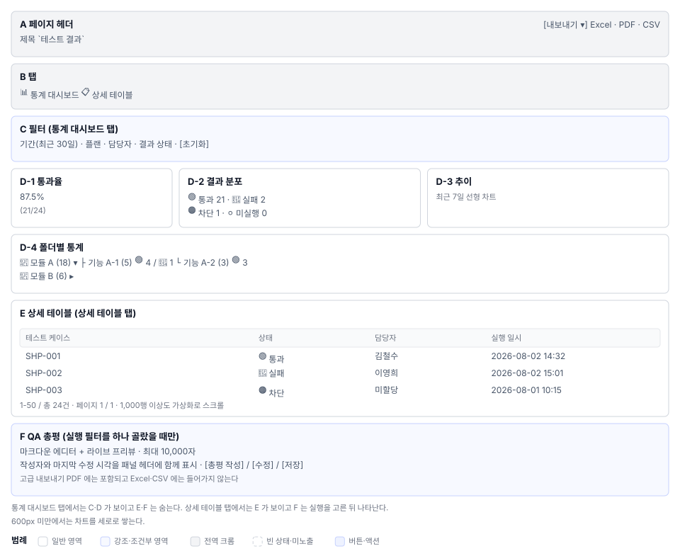

# 테스트 결과(S7) 화면정의

> 화면 ID **S7** · 상위 문서: [`01_테스트결과_업무프로세스.md`](01_테스트결과_업무프로세스.md)
> 라우트: `/projects/{projectId}/results`
> 캡처(매뉴얼 `images/`): `53_results.png` · `92_qa_summary_panel.png` · `109_results_by_folder.png`

---

## 1. 화면 구성

| 영역 | 이름 | 역할 |
|---|---|---|
| **A** | 페이지 헤더 | 제목 `테스트 결과` + 아이콘 |
| **B** | 탭 패널 | 통계 대시보드 상세 테이블 두 탭 |
| **C** | 필터 패널 | 기간·플랜·담당자·결과 필터 + 초기화 버튼 |
| **D** | 통계 카드 그룹 | 통과율 결과 분포 추이 폴더별 비교(선택적) |
| **E** | 상세 결과 테이블 | 케이스명·상태·담당자·실행일시 정렬·페이지네이션 |
| **F** | QA 총평 패널 | 마크다운 에디터 + 메타정보(작성자·수정일시) |
| **G** | 내보내기 드롭다운 | Excel/PDF/CSV/고급 옵션 |

**배치**

---

## 2. 영역별 요소 정의

### 2.1 A. 페이지 헤더

| 요소 | 표시 | 동작 |
|---|---|---|
| 아이콘 | `📊` BarChartIcon (primary 색상) | — |
| 제목 | `테스트 결과` `h5`, 600 weight | — |

헤더는 반응형이다. 모바일 환경에서는 제목과 아이콘이 수직으로 쌓인다.

### 2.2 B. 탭 패널

| 탭 | 인덱스 | 아이콘 | 라벨 | 렌더 |
|---|---|---|---|---|
| **통계 대시보드** | 0 | BarChartIcon | `통계 대시보드` | `TestResultStatisticsDashboard` |
| **상세 테이블** | 1 | TableViewIcon | `상세 테이블` | `TestResultDetailTable` |

탭을 바꾸면 주소는 그대로 두고 본문만 바뀐다.

### 2.3 C. 필터 패널 (통계 대시보드 탭에서만)

| 필터 | 컴포넌트 | 기본값 | 옵션 |
|---|---|---|---|
| **기간** | DateRangePicker | 최근 30일 | 최근 7일 최근 30일 전체 사용자정의 |
| **플랜** | MultiSelect | (전체) | 프로젝트의 모든 플랜 |
| **담당자** | MultiSelect | (전체) | 실행을 수행한 사용자 목록 |
| **결과 상태** | MultiSelect | (전체) | PASS FAIL BLOCKED NOTRUN |
| **`[초기화]` 버튼** | Button | — | 모든 필터를 기본값으로 |

필터 패널은 상세 테이블 탭에서는 나타나지 않는다.

**⚠ 확인 필요.** 다중 선택(MultiSelect)의 "선택 해제" 동작이 체크박스 토글인지, "X" 버튼인지 코드로 확인한다.

### 2.4 D. 통계 카드 그룹

#### D-1. 통과율 카드

| 요소 | 표시 | 동작 |
|---|---|---|
| 수치 | `87.5%` 매우 큰 폰트 | — |
| 라벨 | `PASS` | — |
| 부제 | `(21/24)` 보조 색 | — |

선택한 기간/플랜에 대해 실시간 계산. 데이터 없으면 `—` 표시.

#### D-2. 결과 분포 도넛 차트

| 범주 | 색 | 표시 | 범례 |
|---|---|---|---|
| **PASS** | 🟢 (primary) | `21건` | `통과` |
| **FAIL** | 🔴 (error) | `2건` | `실패` |
| **BLOCKED** | 🟠 (warning) | `1건` | `차단됨` |
| **NOTRUN** | ⚪ (lightgrey) | `0건` | `미실행` |

합계가 0이면 "데이터 없음" 텍스트만 표시. 호버 시 수치와 백분율 툴팁.

#### D-3. 추이 차트 (꺾은선·막대 혼합)

| 축 | 범주 | 단위 |
|---|---|---|
| **X축** | 날짜 | 선택한 기간에 따라 일별 또는 주별 |
| **Y축 (좌)** | 실행 건수 | 막대 |
| **Y축 (우)** | 통과율 (%) | 꺾은선 |

기간 필터 미설정 시 전체 기간을 자동 계산.

#### D-4. 폴더별 통계

| 요소 | 표시 | 동작 |
|---|---|---|
| 폴더 노드 | 📁 + 폴더명 + (총 케이스수) | 클릭해 펼치기/접기 |
| 자식 노드 | 기능·모듈명 | 하위 케이스 통계 |

트리 깊이는 제약 없음. 최대 3단계 깊이가 일반적.

#### D-5. 비교 차트 (2개 이상 실행 선택 시)

| 요소 | 표시 | 조건 |
|---|---|---|
| 막대 차트 | 각 실행의 통과율을 나란히 | 필터로 2개 이상 실행 선택 |
| 범례 | 실행 ID(예: "2026-08-02 실행") | — |

1개 선택으로 돌아가면 기본 통계로 복귀. 선택 해제 안 됨(필터 조건으로만 제어).

### 2.5 E. 상세 결과 테이블

| 열 | 헤더 | 정렬 | 너비 |
|---|---|---|---|
| **테스트 케이스** | 케이스명 | ✓ | 40% |
| **결과 상태** | PASS/FAIL/BLOCKED/NOTRUN 배지 | ✓ | 12% |
| **담당자** | 사용자명 또는 "미할당" | ✓ | 15% |
| **실행 일시** | `2026-08-02 14:32:15` | ✓ | 18% |
| **작업 (클릭 가능)** | 상세 보기 링크 또는 아이콘 | — | 15% |

**페이지네이션:** "행/페이지 선택 (25/50/100/모두)" + "페이지 이동"

**가상화:** 1,000행 이상도 부드럽게 스크롤 (MUI 데이터 표 기본 `virtualization`)

**행 강조:** 마우스 호버 시 행 배경색 연하게 변함

**⚠ 확인 필요.** "작업" 열이 클릭 시 상세 페이지로 이동하는지, 아니면 현재 화면에서 결과 상세 폼을 열기만 하는지 코드로 확인한다 (`handleViewResult`).

### 2.6 F. QA 총평 패널 (실행 선택 시만)

| 요소 | 표시 | 제약 | 참조 |
|---|---|---|---|
| 헤더 | `📝 QA 총평 ({실행ID})` | — | — |
| 마크다운 에디터 | 입력 필드 + 실시간 프리뷰 | 최대 10,000자 | |
| 문자 수 표시 | `{입력된 글자} / 10,000` | — | — |
| 메타정보 | 작성자: {이름} 수정: {일시} | 읽기 전용 | — |
| `[저장]` 버튼 | contained, primary | 비활성 = 수정 없을 때 | `qa-summary-save-button` |

**미노출 조건:** 실행이 선택되지 않으면 패널 영역이 회색 아웃라인으로만 표시되고, 에디터는 disable.

**마크다운 지원:** 제목(`#`)·볼드(`**`)·링크(`[]`)·목록(`-`), 이미지 미지원.

### 2.7 G. 내보내기 드롭다운

| 옵션 | 형식 | 포함 항목 |
|---|---|---|
| **Excel** | `.xlsx` | 통계 요약 시트 + 상세 결과 시트 |
| **PDF (가로)** | `.pdf` | 차트 + 통계 테이블 (한 페이지) |
| **PDF (세로)** | `.pdf` | 상세 테이블 페이지네이션 |
| **CSV** | `.csv` | 상세 결과 (스프레드시트 import용) |
| **고급 - Excel+QA** | `.xlsx` | 〃 + "QA 분석" 탭 (QA 총평 포함) |
| **고급 - PDF+QA** | `.pdf` | 〃 + "QA 분석" 섹션 |

클릭 후 "준비 중..." 진행 표시(1~3초) → 파일 다운로드 시작.

**파일명 규칙:** `TestResult_{프로젝트코드}_{YYYYMMDD_HHmmss}.xlsx` 형태.

---

## 3. 상태별 화면

### 3.1 데이터 로드 중

| 상태 | 표시 | 참조 |
|---|---|---|
| 페이지 진입 직후 | 중앙에 회전 스핀 아이콘 | MUI `CircularProgress` |
| 필터 변경 후 | 같은 스핀 (카드 위에 반투명 오버레이) | — |

로드 시간이 3초 이상이면 "조회 중입니다..." 문구 추가.

### 3.2 데이터 없음

| 상황 | 표시 |
|---|---|
| 프로젝트 생성 후 첫 진입 | "결과 데이터가 없습니다" 안내 + "케이스 작성 및 실행 시작" 유도 텍스트 |
| 필터 결과 0건 | "선택한 필터 범위에 결과가 없습니다" + "필터 재설정" 버튼 |

### 3.3 에러 상태

| 상황 | 표시 |
|---|---|
| API 조회 실패 | 빨간 Alert `조회 중 오류가 발생했습니다. 잠시 후 다시 시도해주세요` |
| 내보내기 실패 | 토스트 알림 `내보내기 실패` (5초 표시) |

### 3.4 내보내기 진행

| 단계 | 표시 | 지속 시간 |
|---|---|---|
| 클릭 후 | 버튼에 스핀 아이콘 + "준비 중..." 텍스트 | 1~3초 |
| 다운로드 시작 | 토스트 알림 `다운로드 시작됨` | 3초 표시 후 자동 닫힘 |

---

## 4. 예시 데이터

아래는 매뉴얼 캡처의 ShopFlow EN 프로젝트 데이터를 기준한다.

| 필드 | 값 |
|---|---|
| 프로젝트 코드 | `SHP` |
| 조회 기간 | 2026-07-01 ~ 2026-08-03 |
| 실행 건수 | 5 |
| 총 케이스 | 24 |
| PASS | 21 |
| FAIL | 2 |
| BLOCKED | 1 |
| NOTRUN | 0 |
| 통과율 | 87.5% |

테이블 샘플행:
| SHP-001 | 🟢 통과 | 김철수 | 2026-08-02 14:32 | 상세 보기 |
| SHP-002 | 🔴 실패 | 이영희 | 2026-08-02 15:01 | 상세 보기 |
| SHP-003 | 🟠 차단 | 미할당 | 2026-08-01 10:15 | 상세 보기 |

---

## 5. 권한별 화면 차이

| 권한 | 조회 | 필터 | QA 총평 작성 | 내보내기 | 대시보드 접근 |
|---|---|---|---|---|---|
| **PM LEAD** | ◯ | ◯ | ◯ (모든 실행) | ◯ | ◯ |
| **DEVELOPER** | ◯ | ◯ | △ (자신 담당만) | ◯ | ◯ |
| **TESTER** | ◯ | ◯ | ◯ (결과 입력한 실행) | ◯ | ◯ |
| **VIEWER** | ◯ | ◯ | ✗ (읽기 전용) | ◯ | ◯ |

**△ 제약이 있는 권한:**
- DEVELOPER가 다른 사람의 실행에 QA 총평을 쓸 수 있는지 여부 미확정.
- TESTER가 모든 실행의 결과를 볼 수 있는지, 아니면 자신이 입력한 결과만 볼 수 있는지 미확정.

---

## 6. 화면 문구 규정

모든 문구는 한국어 기본, 영문 지원 (`t` 함수).

| 항목 | 한국어 | 영문 |
|---|---|---|
| 페이지 제목 | `테스트 결과` | `Test Results` |
| 탭 1 | `통계 대시보드` | `Statistics Dashboard` |
| 탭 2 | `상세 테이블` | `Details Table` |
| 필터 헤더 | `필터` | `Filter` |
| 기간 | `기간` | `Period` |
| 플랜 | `테스트 플랜` | `Test Plan` |
| 담당자 | `담당자` | `Assignee` |
| 결과 상태 | `결과 상태` | `Result Status` |
| 초기화 | `초기화` | `Reset` |
| 통과율 | `통과율` | `Pass Rate` |
| 결과 분포 | `결과 분포` | `Result Distribution` |
| 추이 | `추이 (기간)` | `Trend (Period)` |
| 폴더별 통계 | `폴더별 통계` | `Folder Statistics` |
| 비교 | `실행 비교` | `Execution Comparison` |
| QA 총평 | `QA 총평` | `QA Summary` |
| 내보내기 | `내보내기` | `Export` |
| 준비 중 | `준비 중...` | `Preparing...` |
| 데이터 없음 | `결과 데이터가 없습니다` | `No result data` |

상태 배지의 색과 기호는 03 문서의 표시 규격에서 정의한다.

---

## 7. 04 요건 대조

본 문서의 영역·요소가 [04_요건반영목록.md](04_요건반영목록.md)의 요건과 1:1 대응되어야 한다.

| 영역 | 요건 ID |
|---|---|
| D-1 통과율 카드 | S7-03 |
| D-2 결과 분포 | S7-03 |
| D-3 추이 차트 | S7-04 |
| D-4 폴더별 통계 | S7-05 |
| E 상세 테이블 | S7-06 |
| F QA 총평 | S7-07, S7-08, S7-10 |
| G 내보내기 | S7-09 |
| C 필터 | S7-01, S7-02 |

누락된 요건이나 04에만 있는 요건은 [04_요건반영목록.md](04_요건반영목록.md)에서 "확인 필요" 항목으로 표시.

