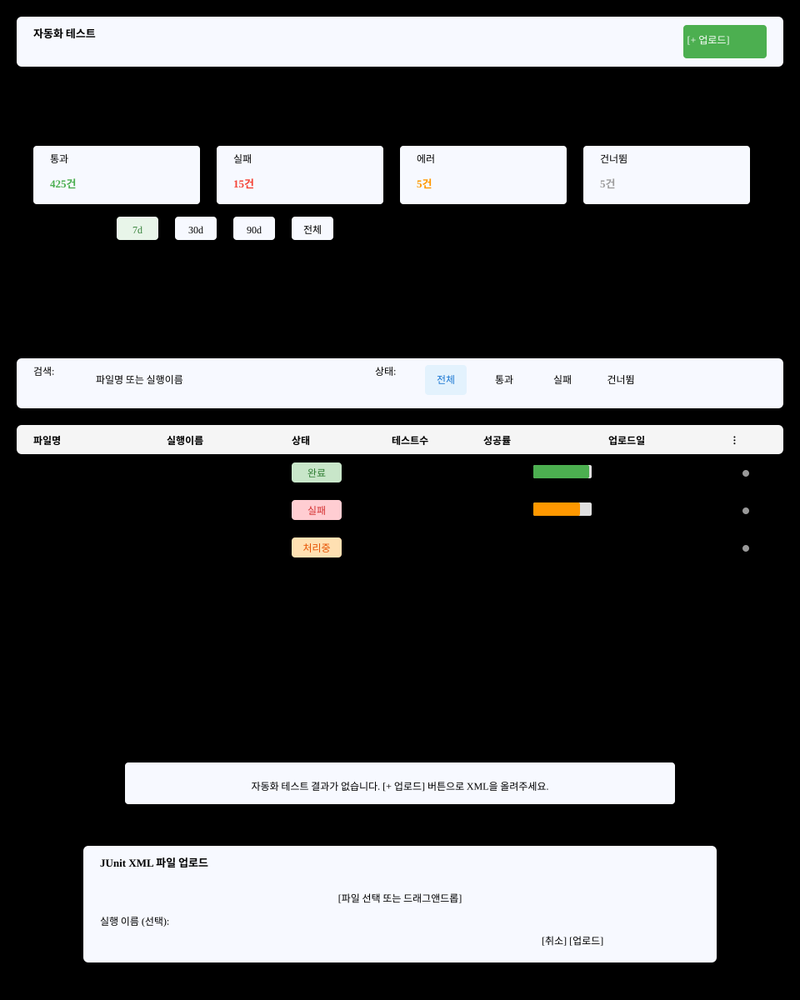

# 자동화 테스트(S8) 화면정의

> 화면 ID **S8** · 상위 문서: [`01_자동화테스트_업무프로세스.md`](01_자동화테스트_업무프로세스.md)
> 라우트: `/projects/{projectId}/automation` · `/projects/{projectId}/automation-results/{testResultId}`
> 캡처: 매뉴얼 `images/` 의 `54b_automation.png` · `54_junit.png`

---

## 1. 화면 구성

자동화 테스트는 결과 목록과 결과 상세 두 화면으로 나뉜다.

| 화면 | 라우트 | 역할 |
|---|---|---|
| **목록** | `/projects/{projectId}/automation` | JUnit 결과 파일 업로드·목록 조회·통계 |
| **상세** | `/projects/{projectId}/automation-results/{testResultId}` | 스위트·케이스별 성공/실패/건너뜀·에러·편집 |

### 1.1 목록 화면

| 영역 | 이름 | 역할 |
|---|---|---|
| **A** | 화면 헤더 | 제목 `자동화 테스트` + `[+ JUnit 결과 업로드]` |
| **B** | 오류 알림 | 조회·조작 실패 메시지 |
| **C** | 통계 섹션 | 접이식 섹션. 기간별 성공률·차트(원형·막대)·개요 카드(통과/실패/에러/스킵) |
| **D** | 시간 범위 필터 | 탭: 7d(기본)·30d·90d·전체. 차트만 재계산 |
| **E** | 목록 헤더 | 검색(파일명·실행이름) + 상태 탭(전체·통과·실패·건너뜀) |
| **F** | 결과 테이블 | 행: 파일명·실행이름·상태·케이스수·성공률·업로드일·메뉴 |
| **G** | 빈 상태 | 결과 0건 안내(메시지 + 업로드 버튼) |
| **H** | 업로드 다이얼로그 | 파일 선택 + 실행 이름·설명 입력 |

---

## 2. 영역별 요소 정의

### 2.1 A. 화면 헤더

| 요소 | 표시 | 동작 | 권한 |
|---|---|---|---|
| 제목 | `자동화 테스트` — `subtitle1`, 600 | — | 전원 |
| `[+ JUnit 결과 업로드]` | `contained`, `small`, `+ 클라우드 업로드` 아이콘 | H 다이얼로그 열기 | `canUploadToProject` |

---

### 2.2 B. 오류 알림

목록 조회 또는 업로드 실패 시 `Alert severity="error"`로 표시.
- 메시지 예: `"파일 처리 중 오류가 발생했습니다: XML 형식 오류"`
- 위치: 헤더 하단

---

### 2.3 C. 통계 섹션

**접이식 섹션**: 제목 `테스트 결과 통계`, 기본 확장.

#### 2.3.1 개요 카드(4열)

| 카드 | 수치 | 색상 | 아이콘 |
|---|---|---|---|
| 통과 | `passed` 건 | 초록(`RESULT_COLORS.PASS`) | ✓ |
| 실패 | `failed` 건 | 빨강(`RESULT_COLORS.FAIL`) | ✗ |
| 에러 | `errors` 건 | 주황(`STATUS_COLORS.ERROR`) | ⚠ |
| 건너뜀 | `skipped` 건 | 회색(`RESULT_COLORS.SKIPPED`) | ⊘ |

#### 2.3.2 차트(선택 범위별)

기본 7일. 범위 선택 시 다시 계산.

| 유형 | 표시 |
|---|---|
| **원형 차트** | 전체 대비 상태별 비율 |
| **막대 차트** | 일별 통과/실패/에러/스킵 누적 |

---

### 2.4 D. 시간 범위 필터

| 탭 | 범위 | 기본 |
|---|---|---|
| 7일 | 지난 7일 | ○ |
| 30일 | 지난 30일 | — |
| 90일 | 지난 90일 | — |
| 전체 | 처음부터 | — |

클릭 시 C의 차트만 갱신. 목록은 변하지 않음(전체 유지).

---

### 2.5 E. 목록 헤더

#### 2.5.1 검색 입력

| 요소 | 입력 | 동작 |
|---|---|---|
| 검색창 | 파일명·실행이름·설명 | debounce 500ms로 즉시 필터 |
| placeholder | `파일명 또는 실행이름 검색...` | — |

#### 2.5.2 상태 탭

| 탭 | 조건 |
|---|---|
| 전체 | 모든 결과 |
| 통과 | `status == COMPLETED` && 전체 성공 |
| 실패 | `failures > 0` |
| 건너뜀 | `skipped > 0` |

---

### 2.6 F. 결과 테이블

| # | 컬럼 | 표시 규칙 | 동작 |
|---|---|---|---|
| 1 | 파일명 | `{fileName}` 굵음 | 클릭 → 상세 화면 |
| 2 | 실행 이름 | `{executionName}` 또는 `—` | — |
| 3 | 상태 | 칩: `PROCESSING`(주황)/`COMPLETED`(초록)/`FAILED`(빨강) | — |
| 4 | 테스트 수 | `{totalTests}` | — |
| 5 | 통과 | `{passed}` / 초록 배지 | — |
| 6 | 실패 | `{failures}` / 빨강 배지 | — |
| 7 | 에러 | `{errors}` / 주황 배지 | — |
| 8 | 건너뜀 | `{skipped}` / 회색 배지 | — |
| 9 | 성공률 | `{successRate}%` 선형 진행바 배경 | — |
| 10 | 업로드일 | `YYYY-MM-DD HH:MM` (사용자 시간대) | 툴팁: 상세 시간 |
| 11 | `⋮` 메뉴 | 더보기 아이콘 | 항목: 상세보기·다운로드·삭제 |

**성공률 진행바:** 배경은 흐린 초록, 진행도는 선명한 초록. 95% 이상은 진행도 끝에 ✓ 아이콘.

### 2.7 G. 빈 상태

업로드된 결과가 없을 때 이 안내를 그린다.

| 요소 | 내용 |
|---|---|
| 아이콘 | 업로드 64px, 흐린 색 |
| 제목 | `자동화 테스트 결과가 없습니다` |
| 안내 | `위의 [+ JUnit 결과 업로드] 버튼으로 XML 파일을 올리세요.` |
| 버튼 | `[+ 업로드]` — 같은 동작 |

---

### 2.8 H. 업로드 다이얼로그

폭 `md`. 제목 `JUnit XML 파일 업로드`.

| # | 필드 | 라벨 | 폼 | 필수 |
|---|---|---|---|---|
| 1 | 파일 | `파일 선택` | 드래그앤드롭 + 클릭 열기. 허용: `*.xml` | ○ |
| 2 | 실행 이름 | `실행 이름 (선택)` | 단일행. 예: `Chrome e2e test run 1` | — |
| 3 | 설명 | `설명 (선택)` | 여러 줄. 예: `Nightly build #42` | — |

| 액션 | 표시 |
|---|---|
| `[취소]` | 업로드 중 비활성 |
| `[업로드]` | 업로드 중 진행 표시로 교체 |

---

### 2.9 I. 페이지네이션 & 상태

| 상태 | 트리거 | 화면 |
|---|---|---|
| 조회 중 | 진입 직후 | 스켈레톤 로딩 표시(전체) |
| 결과 0건 | 참여분 없음 | 위치: G 빈 상태 |
| 로드 중(추가) | 다음 페이지 스크롤 | 하단 로딩 인디케이터 |
| 페이지네이션 | 기본 20건/페이지 | 하단 "페이지 N / M" |

---

## 3. 상세 화면(JunitResultDetail)

라우트: `/projects/{projectId}/automation-results/{testResultId}`

### 3.1 상단 영역

| 요소 | 표시 | 동작 |
|---|---|---|
| 뒤로가기 | `< 뒤로` | `/projects/{projectId}/automation` |
| 파일명 | `{fileName}` — `h5`, 굵음 | — |
| 상태 칩 | `COMPLETED` 또는 `PROCESSING` 등 | — |
| 메뉴 | `⋮` | 다운로드·CSV·PDF·삭제 |

### 3.2 통계 카드(4열)

개요: 통과/실패/에러/건너뜀 카드 × 4. 같은 색상 규칙(C와 동일).

### 3.3 스위트 선택 탭

| 탭 | 내용 | 기본 |
|---|---|---|
| 전체 | 모든 스위트 통합 | ○ |
| `{SuiteName}` | 개별 스위트 | — |

### 3.4 케이스 테이블

열: 케이스명·상태(아이콘+텍스트)·실행 시간·에러 메시지(있으면 축약) `⋮` 메뉴(편집·보기).

**행 클릭:** 상세 패널(우측) 열기.

### 3.5 우측 상세 패널

선택한 케이스의 전체 에러 메시지·스택 트레이스·재현 정보.

**편집 모드(버튼 클릭 시):**
- 상태 선택(PASS/FAIL/BLOCKED/NOTRUN)
- 우선순위(High/Medium/Low)
- 노트(여러 줄)
- `[저장]` `[취소]`

---

## 4. 예시 데이터

매뉴얼 캡처에 쓰인 값이다.

| 항목 | 값 | 출처 |
|---|---|---|
| 파일명 | `api_test_results.xml` `ui_test_build42.xml` | 샘플 XML |
| 실행 이름 | `Chrome E2E Run 1` `Firefox Regression` | 사용자 입력 |
| 테스트 수 | 120 / 95 / 18 / 7 | 샘플 XML 파싱 |
| 성공률 | 79% 98% | 계산된 값 |
| 업로드일 | `2026-08-03 14:35` | 시스템 시간대 |

---

## 5. 권한별 화면 차이

| 요소 | 시스템 ADMIN | PM LEAD | DEVELOPER CONTRIBUTOR | TESTER | VIEWER |
|---|---|---|---|---|---|
| A `[+ 업로드]` | 노출 | 노출 | 노출 | 노출 | 숨김 |
| F 테이블 | 전체 | 자기 프로젝트 | 자기 프로젝트 | 자기 프로젝트 | 자기 프로젝트 |
| F `⋮` 메뉴(삭제) | 실행됨 | 실행됨 | 서버 403 | 서버 403 | 서버 403 |
| 상세 편집 | 가능 | 가능 | 가능 | 가능 | 불가 |

---

## 6. 화면 문구 규정

| 문구 | 한국어 | i18n 키 |
|---|---|---|
| 화면 제목 | `자동화 테스트` | `automation.title` |
| 업로드 버튼 | `[+ JUnit 결과 업로드]` | `junit.upload.button` |
| 상태: 통과 | `통과` | `junit.stats.passed` |
| 상태: 실패 | `실패` | `junit.stats.failed` |
| 상태: 에러 | `에러` | `junit.stats.error` |
| 상태: 건너뜀 | `건너뜀` | `junit.stats.skipped` |
| 처리 상태 | `처리중` / `완료` / `실패` | `junit.processingStatus.*` |

---

## 7. 04 요건 대조

아래 표를 통해 이 화면의 모든 요소가 요건에 매핑된다.

| 순서 | 영역·요소 | 요건 ID |
|---|---|---|
| 1 | A 헤더 + H 다이얼로그 | S8-01(업로드) |
| 2 | F 테이블·검색·필터 | S8-02(목록) |
| 3 | C 통계·D 기간필터 | S8-03(통계) |
| 4 | 상세화면·케이스테이블 | S8-04(상세) |
| 5 | 상세화면 편집 | S8-05(케이스편집) |
| 6 | 상세화면·메뉴(CSV/PDF) | S8-06(내보내기) |
