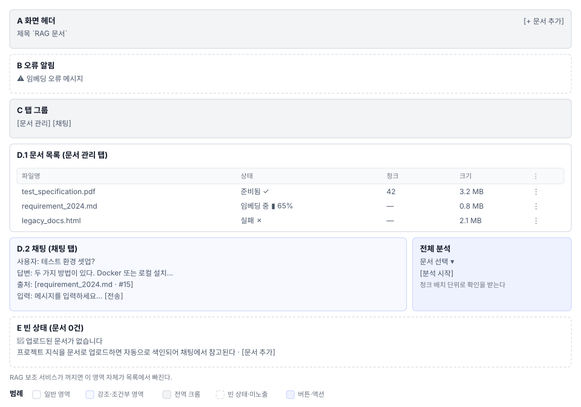

# RAG 문서(S9) 화면정의

> 화면 ID **S9** 상위 문서: [`01_RAG문서_업무프로세스.md`](01_RAG문서_업무프로세스.md)
> 라우트 `/projects/{projectId}/rag` 소스
> 캡처: 매뉴얼 `images/55_rag.png` `56_rag_chat.png` (이후 신설)

---

## 1. 화면 구성

| 영역 | 이름 | 역할 |
|---|---|---|
| **A** | 화면 헤더 | 제목 `RAG 문서` + `[+ 문서 추가]` |
| **B** | 오류 알림 | 업로드·조회 실패 문구 |
| **C** | 탭 그룹 | `문서 관리` / `채팅` — 조건부 노출(RAG 사용 가능 여부) |
| **D.1** | 문서 목록 패널(탭1) | 테이블. 상태·청크·파일 크기·행동 |
| **D.2** | 채팅 패널(탭2) | 대화 이력 + 입력창 + 분석 버튼 |
| **E** | 빈 상태 | 문서 0건 안내 + 업로드 유도 |
| **F** | 문서 행 메뉴 | `⋮` → `목록에서 제거` / `다시 색인` |
| **G** | 파일 업로드 다이얼로그 | 파일 선택 + 드래그 드롭 |
| **H** | 분석 모달 | 비용 추정 → 배치 확인 → 요약 저장 |
| **I** | 채팅 출처 표시 | 청크 인용 링크 + 미리보기 |

RAG 서비스 비활성(`RAG 사용 가능 여부=false`)이면 탭 자체가 없다.

---

## 2. 영역별 요소 정의

### 2.1 A. 화면 헤더

| 요소 | 표시 | 동작 | 권한 |
|---|---|---|---|
| 제목 | `RAG 문서` — `subtitle1`, 600 | — | 전원 |
| `[+ 문서 추가]` | `contained`, `small`, `+` 아이콘 | G 다이얼로그 오픈 | 편집 권한 |

### 2.2 B. 오류 알림

목록 조회·업로드·분석 실패 시 `Alert severity="error"` 표시.

### 2.3 C. 탭 그룹

| 탭 | 그리는 조건 |
|---|---|
| 문서 관리 | 항상 |
| 채팅 | 항상 |

탭이 항상 2개 고정이므로 인덱스 재계산은 불필요.

⚠ **확인 필요.** 분석 기능이 탭인지 모달인지(현 설계는 모달) 확인. 모달이면 탭에 포함되지 않는다.

### 2.4 D.1 문서 목록 패널

탭 0 콘텐츠. 테이블 형식.

| # | 컬럼 | 표시 규칙 |
|---|---|---|
| 1 | 파일명 | 클릭하면 미리보기/다운로드 |
| 2 | 상태 | `대기` `임베딩 중(N%)` `준비됨` `실패` |
| 3 | 청크 수 | 숫자. `준비됨` 상태일 때만 |
| 4 | 파일 크기 | 포맷 `1.2 MB` |
| 5 | `⋮` 메뉴 | F 참조 |

**상태 표시 규칙**

| 상태 | 시각 |
|---|---|
| `대기(pending)` | 회색 진행 표시 20px |
| `임베딩 중` | 파란색 진행률 표시(%) 3초 폴링 |
| `준비됨(ready)` | 초록색 체크 |
| `실패(failed)` | 빨간색 `[재시도]` 버튼 인라인 |

### 2.5 D.2 채팅 패널

채팅 탭을 골랐을 때 그리는 본문이다.

| 영역 | 내용 |
|---|---|
| **메시지 목록** | 대화 이력(스크롤 가능, 최신이 아래) |
| **사용자 메시지** | 검은 배경, 우측 정렬 |
| **봇 응답** | 흰 배경, 좌측 정렬, 출처 링크 포함 |
| **입력 창** | 텍스트 필드 + `[전송]` 버튼 |
| **분석 섹션** | 문서 선택 + `[분석 시작]` 버튼(H로 이동) |

### 2.6 E. 빈 상태

업로드된 문서가 없는 상태다.

| 요소 | 내용 |
|---|---|
| 아이콘 | 문서 64px, 흐린 색 |
| 제목 | `업로드된 문서가 없습니다` |
| 안내 | `프로젝트 지식을 문서로 업로드하면 자동으로 색인되어 채팅에서 참고됩니다.` |
| 버튼 | `[문서 추가]` — 권한 있을 때만 |

### 2.7 F. 문서 행 메뉴

카드를 누른 자리에 메뉴가 열린다.

| 항목 | 아이콘 | 색 | 동작 |
|---|---|---|---|
| 다시 색인 | 새로고침 | 기본 | 문서 재 분석 |
| 목록에서 제거 | 휴지통 | `error.main` | 확인 다이얼로그 → 삭제 |

### 2.8 G. 파일 업로드 다이얼로그

폭 `md`. 파일 선택 + 드래그 드롭 지원.

| 요소 | 표시 |
|---|---|
| 제목 | `문서 추가` |
| 허용 확장자 | `.pdf,.md,.html,.jpg,.png` |
| 드롭 영역 | 점선 테두리, 아이콘 + 안내문 |
| 파일 입력 | `hidden input[type="file"]` |
| 취소·저장 | 버튼. 업로드 중 비활성 |

**드롭 영역 안내문**

> `이 영역에 파일을 드롭하거나 클릭하여 선택하세요`
> `지원: PDF, Markdown, HTML, JPG, PNG (최대 OOO MB)`

⚠ **확인 필요.** 파일 최대 크기 제한값

### 2.9 H. 분석 모달

. 3단계 플로우.

| 단계 | 타이틀 | 요소 |
|---|---|---|
| **1. 비용 추정** | `분석 비용 확인` | 문서 선택 + 토큰 수 + USD 표시 |
| — | — | `[취소]` `[계속]` |
| **2. 진행 중** | `분석 진행 중…` | 배치별 상태(10개 청크 단위) 일시정지 옵션 |
| — | — | `[일시정지]` |
| **3. 완료** | `분석 완료` | 요약 텍스트 영역(자동 저장 가능) + 저장 버튼 |

### 2.10 I. 채팅 출처 표시

답변에 함께 실리는 출처 인용이다.

| 요소 | 표시 | 동작 |
|---|---|---|
| 청크 번호 | `[문서명 #123]` 하이퍼링크 | 미리보기 팝오버 또는 새 탭 |
| 미리보기 | 청크 원문 + 파일명 + 위치 | 호버 시 표시 |

---

## 3. 상태별 화면

### 3.1 문서 0건

E. 빈 상태가 표시됨. C 탭은 그려지지만 D.1 테이블은 비어 있음.

### 3.2 임베딩 중

D.1 테이블에 진행률 표시. 폴링 3초 주기. 다른 문서는 상호작용 가능.

### 3.3 임베딩 실패

상태 `실패` 행마다 `[재시도]` 버튼. 클릭하면 재 분석 API 호출.

### 3.4 채팅 첫 로드

D.2에 빈 메시지 목록. 입력창만 활성.

### 3.5 분석 배치 확인 중

H 모달의 2단계. 배치별 완료·진행·오류 상태 표시. `[일시정지]` 버튼 활성.

### 3.6 서비스 미활성

C 탭 자체가 없다. S2 작업공간의 탭 목록에서 RAG 탭이 빠짐.

---

## 4. 예시 데이터

### 문서 목록 (3건)

| 파일명 | 상태 | 청크 수 | 크기 | 비고 |
|---|---|---|---|---|
| `test_specification.pdf` | 준비됨 ✓ | 42 | 3.2 MB | 테스트 명세서 |
| `requirement_2024.md` | 임베딩 중 ▮ 65% | — | 0.8 MB | 진행 중 |
| `legacy_docs.html` | 실패 ✗ | — | 2.1 MB | 재시도 가능 |

### 채팅 대화 예시

> **사용자**: 테스트 환경 셋업은 어떻게 돼?
> **봇**: 테스트 환경은 두 가지 방법으로 셋업할 수 있다:
> 1. Docker 컨테이너 사용 (권장)
> 2. 로컬 설치
>
> 자세한 내용은 [requirement_2024.md #15]에 있다.

---

## 5. 권한별 화면 차이

### 5.1 기능 × 역할

| 기능 | PM LEAD DEVELOPER | CONTRIBUTOR | TESTER VIEWER |
|---|---|---|---|
| 문서 업로드 | ○ | ○ | — |
| 문서 삭제·재색인 | ○ | ○ | — |
| 채팅 | ○ | ○ | ○ |
| 분석 시작 | ○ | ○ | — |
| 요약 저장 | ○ | ○ | ○ |

### 5.2 화면 요소별 노출

| 요소 | 노출 조건 |
|---|---|
| `[+ 문서 추가]` | 편집 권한 |
| 문서 행 `[⋮]` 메뉴 | 편집 권한 |
| `[분석 시작]` 버튼 | 편집 권한 |
| 채팅 입력 | `hasReadAccess` |

---

## 6. 화면 문구 규정

| 텍스트 | 위치 |
|---|---|
| `RAG 문서` | 헤더 제목 |
| `+ 문서 추가` | A. 헤더 버튼 |
| `이 영역에 파일을 드롭하거나 클릭하여 선택하세요` | G. 업로드 다이얼로그 |
| `업로드된 문서가 없습니다` | E. 빈 상태 제목 |
| `임베딩 중…` | 상태 표시 |
| `준비됨` | 상태(초록) |
| `실패` | 상태(빨강) |

---

## 7. 04 요건 대조

| REQ-ID | 화면 요소 | 절 |
|---|---|---|
| S9-01 | 탭 그룹(C) 서비스 미활성 시 탭 없음 | 1절 3.6절 |
| S9-02 | 문서 목록(D.1) 업로드 다이얼로그(G) | 2.4절 2.8절 |
| S9-03 | 상태 폴링 진행률 표시 | 2.4절 3.2절 |
| S9-04 | 메뉴(F) 삭제 확인 | 2.7절 |
| S9-05 | 채팅 패널(D.2) | 2.5절 3.4절 |
| S9-06 | 출처 인용(I) | 2.10절 |
| S9-07 | 분석 모달(H) | 2.9절 3.5절 |
| S9-08 | 비용 표시 배치 확인 | 2.9절 |
| S9-09 | 권한별 노출(5절) | 5절 |
| S9-10 | S4 케이스 필드 연동(외부) | 01의 3.4절 |
