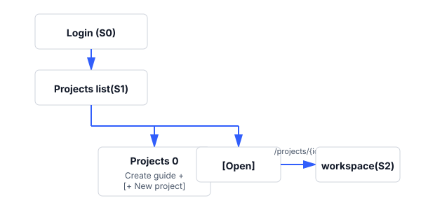
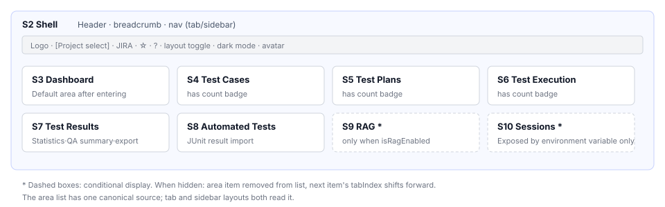
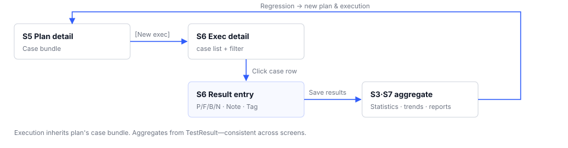
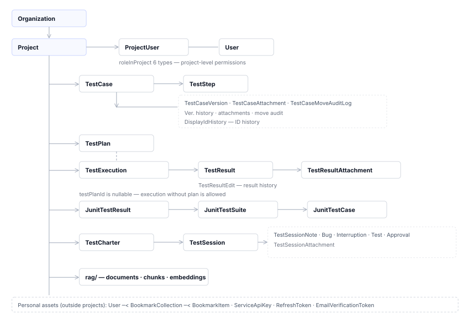

# Overall Workflow

> Written 2026-08-03 · Reference version **v1.0.102**
> This document is the **single source of truth** for the workflow, permissions, and routes spanning 12 screens. Individual screen documents reference this document and do not duplicate its values.
> Parent document: [`Index`](EN-Index.md)

---

## 1. What the Product Handles

The product processes a complete cycle in one place: writing test cases, grouping them into test plans, executing the plans, recording results, and exporting results as reports. The product also absorbs result files created by automation tools into the same statistics, and provides document-based query (RAG) and session-based testing (SBTM) as supplementary axes.

| Axis | Responsible Screens | Deliverables |
|---|---|---|
| Test case asset management | S4 | Folder and case tree, case versions, attachments |
| Test plan composition | S5 | Test plans (case groupings) |
| Execution and recording | S6 | Test execution, case-level results (PASS/FAIL/BLOCKED/NOTRUN) |
| Results analysis and reporting | S3 · S7 | Statistics and trends, QA summary per execution, Excel/PDF/CSV reports |
| Automation result absorption | S8 | JUnit result batches, case matching |
| Knowledge assistance | S9 | Embedded documents, attributed answer citations |
| Exploratory testing | S10 | Session charters, session notes, session reports |
| Organization and account management | S0 · S1 · S11 | Users, organizations, projects, system settings |

---

## 2. Seven Stages of Workflow

These are the actual stages an organization goes through when first adopting the product. For each stage, we note the condition that allows moving to the next stage.

| # | Stage | Responsible Screens | Condition to Advance |
|---|---|---|---|
| 1 | **Account Setup** | S0 | Successful login. Email verification is only required for notifications and does not block entry |
| 2 | **Project Creation** | S1 | One project created + project code confirmed (used as prefix for display ID in form `SMP-001`) |
| 3 | **Case Writing** | S4 | Folder structure + at least one case saved |
| 4 | **Plan Composition** | S5 | Cases are added to the plan. Execution can be created without a plan (unplanned execution) |
| 5 | **Execution and Result Recording** | S6 | Results are added to cases within executions. Executions without results are retained |
| 6 | **Results Analysis and Reporting** | S3 · S7 | Statistics are retrievable. Writing QA summary per execution is optional |
| 7 | **Regression and Expansion** | S4 → S5 → S6 | Return to the cycle with added or modified cases, new plans, and new executions |

**Stage 4 can be skipped.** Plans are not required to be attached to executions. The execution creation form has a "No plan" option.

**Stage 6 does not close.** Results accumulate and statistics are recalculated with date filters. There is no sealing step.

### Entry Points for Automation, Exploratory, and Knowledge Axes

These three axes run parallel to the seven stages above. They are not sequential but separate entry points that can be accessed at any time.

| Axis | When it Enters | Integration with 7 Stages |
|---|---|---|
| S8 Automation | After an automation suite produces result files | Uploaded results are matched to cases and join S3·S7 statistics |
| S9 RAG | After project documents are prepared | During S4 case writing, recommend and link related documents |
| S10 Exploratory Session | When specifications are too thin to write cases beforehand | Findings from sessions are promoted to S4 cases |

---

## 3. Screen Transitions

### 3.1 Initial Entry Flow

### 3.2 Area Navigation Within Workspace

S2 maintains a common layout and swaps only the content body. The area list is defined in one place, and both the horizontal tabs and left menu use that definition.

### 3.3 Execution Pipeline Roundtrip

When a plan creates an execution, the execution inherits that plan's case grouping. When results are saved, the dashboard and results screen reread the same result records and aggregate them. Because no pre-computed aggregate values are used, numbers do not diverge between screens.

### 3.4 Always-Available Entry Paths

These paths open from the header at any time and do not disappear.

| Destination | Entry | Route |
|---|---|---|
| Project list | Click left logo | `/projects` |
| Switch project | `[Project selector]` dropdown | Keep current area + replace project |
| Bookmarks | Header `☆` | `/projects/{id}/bookmarks` |
| User manual | Header `?` | `/manual` (new tab) |
| Profile dialog | Avatar → Profile | No route change (modal dialog) |
| Admin menu | `[Admin menu ▾]` (system ADMIN only) | `/organizations` and others |

---

## 4. Conditionally Exposed Areas

Two areas are not always visible. They have different reasons for being hidden, so they are not grouped together.

| Area | Condition for Display | When Hidden |
|---|---|---|
| **S9 RAG Documents** | When RAG assistance service is running | The area item itself is removed from the list |
| **S10 Exploratory Session** | When environment variable `SHOW_EXPLORATORY_SESSION_TAB` is enabled | Same as above |

**Area order numbers are not fixed values.** Screens identify the current area by "which item number among visible items," so when RAG is disabled, subsequent item numbers shift up one position. When inserting a new area, this is a point that must be adjusted together with the S2 document.

---

## 5. Permission Model (Single Source of Truth)

There are three permission axes. They are not mutually exclusive and apply in combination.

### 5.1 System Permissions

| Value | What Opens |
|---|---|
| `ADMIN` | Organization-wide dashboard + full admin menu + all project data |
| `MANAGER` | Intended to allow admin menu, but currently does not open on any screen (S11 correction target) |
| None | Only project-level permissions apply |

**A user with no system permission is still a normal user.** Project creation only checks login, not system role. When project creation was restricted by an allowlist of roles, users without a role could not create projects.

### 5.2 Project Permissions

Six roles exist. The same person can have different permissions in different projects.

| Value | English | Edit | Record Results | Members & Settings |
|---|---|---|---|---|
| `PROJECT_MANAGER` | Project Manager | ○ | ○ | ○ |
| `LEAD_DEVELOPER` | Lead Developer | ○ | ○ | ○ |
| `DEVELOPER` | Developer | ○ | ○ | — |
| `CONTRIBUTOR` | Contributor | ○ | ○ | — |
| `TESTER` | Tester | — | **○** | — |
| `VIEWER` | Viewer | — | — | — |

Screen button visibility reduces to three permission checks.

| Check | Allowed Roles | What It Controls |
|---|---|---|
| Admin permission | PM · LEAD | Changing project settings, assigning members and roles |
| Edit permission | PM · LEAD · DEVELOPER · CONTRIBUTOR | Creating, editing, deleting cases, folders, plans, executions |
| Result recording permission | Above 4 roles + **TESTER** | Recording case results (pass, fail, blocked, not run) |

**TESTER cannot edit but can record results by design.** They have no permission to modify cases or plans, but recording results is their core responsibility.

System `ADMIN` passes all project permission checks. Even without participation in a project, edit and record permissions are available.

### 5.3 Organization Permissions

Three roles: `OWNER` · `ADMIN` · `MEMBER`. Used only in organization detail screen member and group management. They do not affect project data access. Edit permission on the organization detail screen requires organization `OWNER`/`ADMIN` or system `ADMIN`.

### 5.4 Targets Without Project in the Address

Targets without a visible project in the address—such as cases, attachments, and automation results—**also find their containing project and apply the same permission check.** Seventeen case types share this rule.

Target → Find containing project → Check permissions → Deny if target not found

**If the target is not found, deny access.** If we allowed access to non-existent targets, we would create a permission bypass.

---

## 6. Routes (Single Source of Truth)

Each URL points to a single screen. Within the workspace, a common layout is maintained while only the content body swaps based on the path.

### 6.1 Outside Authentication / Global

| Path | Screen | Protection |
|---|---|---|
| `/login` · `/` | S0 Login and signup | None |
| `/verify-email` | S0 Email verification result | None |
| `/manual` | S0 Manual viewer | None |
| `/guides/:guideName` | Guide document viewer | None |
| `/projects` | S1 Project list | Login |
| `/dashboard` | S3 Organization-wide dashboard | Login + `ADMIN` |
| `/jira-redirect/{issueKey}` | JIRA issue → case redirection | Login |
| `/executions/{executionId}` | S6 Execution detail — alias (project not in URL) | Login |
| `/junit-results/{testResultId}` | S8 JUnit result detail — same alias | Login |
| `/automation-tests/{testResultId}` | S8 Automation result detail — same alias | Login |

### 6.2 Project Workspace

| Path | Content |
|---|---|
| `/projects/{projectId}` | S3 Project dashboard |
| `/projects/{projectId}/testcases` | S4 Tree + list |
| `/projects/{projectId}/testcases/{testCaseId}` | S4 Case detail form |
| `/projects/{projectId}/testplans` | S5 Plan list |
| `/projects/{projectId}/testplans/new` · `/{testPlanId}` | S5 Plan form |
| `/projects/{projectId}/executions` | S6 Execution list |
| `/projects/{projectId}/executions/new` · `/{executionId}` | S6 Execution form and detail |
| `/projects/{projectId}/executions/{executionId}/testcases/{testCaseId}/result` | S6 Result entry |
| `/projects/{projectId}/results` | S7 Result statistics |
| `/projects/{projectId}/executions?viewType=…` | S7 Result statistics — query parameter determines the area |
| `/projects/{projectId}/automation` · `/junit` | S8 Automation list |
| `/projects/{projectId}/automation-results/{testResultId}` | S8 Automation result detail |
| `/projects/{projectId}/junit-results/{testResultId}` | S8 JUnit result detail |
| `/projects/{projectId}/rag` | S9 RAG Documents |
| `/projects/{projectId}/exploratory` | S10 Exploratory session |
| `/projects/{projectId}/bookmarks` | S2 Bookmarks |

`/projects/{id}/executions` splits between S6 and S7 based on the presence of the query parameter `viewType`. This is the only place where the same path points to two areas, so be careful when creating links.

### 6.3 Admin Routes

| Path | Screen | Visible in Header Menu |
|---|---|---|
| `/organizations` · `/organizations/{id}` | S11 Organization | ○ |
| `/users` | S11 User management | ○ |
| `/mail-settings` | S11 Mail settings | ○ |
| `/llm-config` | S11 LLM settings | ○ |
| `/scheduler` | S11 Scheduler | ○ |
| `/translation-management` | S11 Translation management | **×** — Not in menu. Enter by typing the URL directly |

---

## 7. Data Model Summary

Key concepts and relationships that screens handle.

### Two Types of Identifiers

| Type | Format | Used In |
|---|---|---|
| UUID | `dca4a2a4-…` | URLs and external integrations. The full string appears in case form metadata |
| Display ID | `SHOP-112` = `project-code-sequence-number` | Screens, notifications, search. Change history is tracked separately |

---

## 8. Global Rules for All Screens

| # | Rule | Related Manual Section |
|---|---|---|
| G1 | **User settings per screen are saved server-side per user.** Input mode, field visibility toggle, menu structure, and theme are affected; settings are restored when logging in from other devices | 3 · 4-5 · 13-7 |
| G2 | **Some settings remain browser-only.** Tree view mode and previous result notes display format are examples. Only values that can differ per device are stored here | 4-4 · 8-1 |
| G3 | **Time display follows the user's timezone setting.** Default is `UTC` | 13-3 |
| G4 | **Buttons are hidden for unauthorized actions.** Unauthorized actions are not offered and then rejected. When the server rejects an action, the message appears at the bottom of the screen as-is | 4-6 · 5-5 |
| G5 | **Destructive actions show the target and request confirmation.** The confirmation dialog includes the ID and name of the deletion target | 4-6 |
| G6 | **No partial application.** When moving multiple items, if any fails, all changes are rolled back | 5-2 |
| G7 | **Credential values are not returned on screen.** Connection keys appear in full only once, immediately after creation | 13-6 |
| G8 | **Auto-refresh runs only when the screen is visible.** The execution list refreshes at roughly 20-second intervals; it pauses while viewing other tabs | 8 |
| G9 | **Screen text occupies the same position in both Korean and English.** Text without registered translations leaks in Korean on English mode | 13-3 · 17-8 |
| G10 | **Conditional areas are hidden but do not shift position.** When an area's visibility changes, the order of other areas remains unchanged | 11 · 12 |

---

## 9. Document Update Rules

| When This Changes | Update This Location |
|---|---|
| Routes | This document section 6 → corresponding screen `01` and `02` |
| Permission checks and roles | This document section 5 → all screens: `01` permissions section · `02` differences by role section |
| Area list and order | S2 `02` and `03` → this document section 3.2 |
| Screen elements | Corresponding screen `02`, `03`, and `04` documents |
| Server data exchange | Corresponding screen `03` |
| Conditional display conditions | This document section 4 → corresponding screen `01` prerequisites section |

When creating a new screen, add a row to section 2 stage table and section 6 routes table, and assign a new ID in [`Index`](EN-Index.md) section 2.
