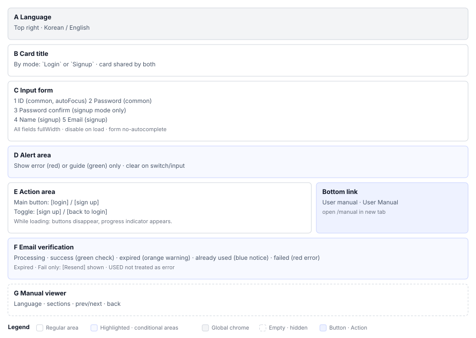

# Login & Account(S0) Screen Definition

> Screen ID **S0** · Parent document: [`EN-S0-Workflow.md`](EN-S0-Workflow.md)
> Routes: `/login` · `/verify-email` · `/manual` · `/guides/{guideName}`
> Captures (manual `images/`): `01_login_empty.png` · `02_signup_empty.png` · `03_signup_filled.png` · `04_signup_complete.png` · `05_login_filled.png` · `18_user_menu_logout.png` · `101_verify_email.png` · `102_manual_viewer.png` · `103_guide_viewer.png`

---

## 1. Screen Composition

S0 consists of three independent routes. Define areas separately per route.

### 1.1 Screen per Route

| Route | Screen | Area |
|---|---|---|
| `/` `/login` | Login and registration | A~E |
| `/verify-email?token=…` | Email verification result | F |
| `/manual` | Manual viewer | G |

### 1.2 Login Screen Areas

| Area | Name | Role |
|---|---|---|
| **A** | Language toggle | Fixed top-right. Change language before login |
| **B** | Card title | Mode-dependent: `Login` / `Register` |
| **C** | Input form | Login 2 fields / registration 5 fields |
| **D** | Notification area | Error (red) and info (green), one each |
| **E** | Action area | Main button + mode switch button + manual link |

---

## 2. Area-by-Area Element Definition

### 2.1 A. Language Toggle

| Element | Display | Behavior |
|---|---|---|
| Inline language toggle | Korean / English | Immediately replace screen text. Does not save to server since user is not logged in |

Language settings after login are saved per-user on server (S2 profile). This screen's selection is separate.

### 2.2 B. Card Title

| Mode | Text | i18n key |
|---|---|---|
| Login | `Login` | `login.title` |
| Register | `Register` | `register.title` |

The two modes use the same content here. Tests distinguish modes by this element's **text**.

### 2.3 C. Input Form

| # | Field | Label key | Type | Mode | Required |
|---|---|---|---|---|---|
| 1 | Username | `login.username` | text | Both | ○ |
| 2 | Password | `login.password` | password | Both | ○ |
| 3 | Confirm password | `register.confirm_password` | password | Register | ○ |
| 4 | Name | `register.name` | text | Register | — |
| 5 | Email | `register.email` | text | Register | — |

**Display rules**

- All fields `fullWidth`, vertical spacing MUI `margin="normal"`
- All fields `disabled` during loading
- Username field has `autoFocus`
- Entire form `autoComplete="off"`
- Email is `type="text"` not `type="email"`. No format validation on screen

**Screen directly filters two errors**

| Condition | Message | i18n key |
|---|---|---|
| Empty value in username, password, or confirm password | `Please fill in all fields.` | `validation.required.all` |
| Password ≠ confirm password | `Passwords do not match.` | `validation.password.mismatch` |

Name and email can be empty; screen allows them through. Server rules apply.

### 2.4 D. Notification Area

| Type | Color | When | Content |
|---|---|---|---|
| Error | `error` (red) | Validation failure, server rejection, exception | Server message first, otherwise generic message |
| Info | `success` (green) | Registration success | `Registration complete. Please log in.` |

Only one notification shows at a time. Both clear on mode switch and resubmission.

### 2.5 E. Action Area

| Mode | Main button | Mode switch | Bottom link |
|---|---|---|---|
| Login | `[Login]` `contained/primary` `type=submit` `login-submit-button` | `[Register]` `secondary` `login-switch-to-register-button` | Manual |
| Register | `[Register]` `contained/primary` `type=submit` `register-submit-button` | `[Back to login]` `register-switch-to-login-button` | Manual |

**During loading, two buttons disappear and are replaced by a circular progress indicator**. Rather than disable buttons, the structure replaces them, so tests distinguish loading by button presence.

| Element | Display | Behavior |
|---|---|---|
| Manual link | `User Manual` — small size, faded color | Open `/manual` in **new tab** |

Text includes both Korean and English. Regardless of language setting, users in either language recognize it.

### 2.6 F. Email Verification Result Screen

On entering `/verify-email?token=…`, validate token immediately and render one result.

| State | Verdict | Icon | Color | Title | Follow-up |
|---|---|---|---|---|---|
| Processing | Waiting for response | Spinner | — | `Verifying email...` | — |
| Success | `success: true` | Check circle 80px | `success.main` | `Verified!` | `[Go to login]` |
| Expired | `error: EXPIRED` | Warning 80px | `warning.main` | `Link expired` | `[Resend]` `[Go to login]` |
| Already used | `error: USED` | Info 80px | `info.main` | `Already used` | `[Go to login]` |
| Failure | `INVALID` `ERROR` others | Error 80px | `error.main` | `Verification failed` | `[Resend]` `[Go to login]` |

Rationale: **Treat `USED` as info, not error.** If an already-verified user clicks the link again and sees a failure screen, it reads as something broken.

If `token` parameter is missing, do not start verification.

### 2.7 G. Manual Viewer

`/manual` is a document viewer that opens without authentication. Switch between Korean and English versions on the same screen.

| Element | Role |
|---|---|
| Language switch | Korean ↔ English |
| Section list | List of 18 manual sections |
| Section navigation | Previous section, next section |
| Return to list | Return to section list |

Render markdown returned by `GET /api/manual`. Source is.

---

## 3. Screen per State

| State | Trigger | Screen |
|---|---|---|
| Login default | Enter `/login` | A, B (login), C (2 fields), E |
| Registration | Mode switch button | C expands to 5 fields |
| Loading | Submit | All fields disabled + button → progress indicator |
| Validation failure | Empty values, password mismatch | Error in D. No server call |
| Server rejection | Auth failure, duplicate username | Error in D (server message) |
| Registration success | Signup complete | Login mode + info in D. Retain username, name, email |
| Communication failure | Server unreachable | Error in D `Failed to fetch` |
| Verification link entry | `/verify-email` | F with one of 5 states |

---

## 4. Sample Data

Values used in manual captures. Do not include actual operational accounts in documentation or captures.

| Item | Value | Source |
|---|---|---|
| Demo admin | `admin` / `admin123` | — Change after deployment |
| Capture account | Used in manual section 1-2 registration form capture | `images/03_signup_filled.png` |

---

## 5. Screen Differences by Permission

No project permissions apply since user is not authenticated. Only authentication state differs.

| Element | Unauthenticated | Authenticated |
|---|---|---|
| Login form | Visible | Does not reach this screen |
| Manual link | Visible | Header `?` button on same screen |
| `/verify-email` | Visible | Visible (regardless of auth state) |
| `/manual` | Visible | Visible |

---

## 6. Screen Text Conventions

| Location | Text | i18n key |
|---|---|---|
| Title | `Login` / `Register` | `login.title` `register.title` |
| Main button | `Login` / `Register` | `login.button` `register.button` |
| Switch | `Register` / `Back to login` | `register.switch` `login.back` |
| Registration success | `Registration complete. Please log in.` | `register.success` |
| Login failure | `Login failed.` | `login.error.failed` |
| Login error | `An error occurred during login.` | `login.error.general` |
| Registration error | `An error occurred during registration.` | `register.error.general` |
| Manual link | `User Manual` (fixed) + bilingual context | `login.manualLink` + fixed English |

**Rule:** Keep form `t("key", "Korean")` when adding new text. Using only the key without fallback shows the key on screen if translation is missing. Procedure for adding seed is in `testcasecraft-i18n-audit`.

**Do not distinguish auth failure reason.** Answer with same message whether username does not exist or password is wrong. Prevent leaking account existence.

---

## 7. Coverage of Section 04

| Requirement from 04 | Area in this document |
|---|---|
| S0-01 Login | C fields 1, 2 main button in E |
| S0-02 Mode switch | B, C fields 3~5, mode switch button in E |
| S0-03 Screen validation | 2.3 section two errors in D |
| S0-04 Verification four states | F |
| S0-05 Manual before login | Bottom link in E, G |
| S0-06 Logout | Header in S2 (this screen is destination) |
| S0-07 Language toggle | A |
