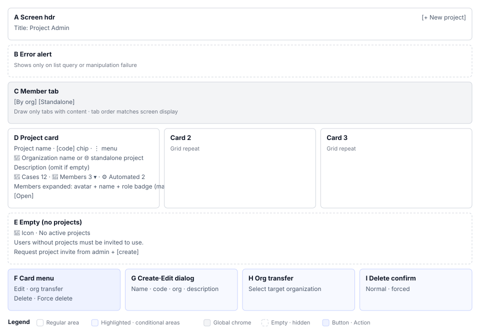

# Projects(S1) Screen Definition

> Screen ID **S1** · Parent document: [`EN-S1-Workflow.md`](EN-S1-Workflow.md)
> Route: `/projects`
> Captures (manual `images/`): `10_projects_empty.png` · `11_project_create_dialog.png` · `12_project_create_filled.png` · `13_project_created.png` · `110_project_more_menu.png` · `111_project_edit_form.png`

---

## 1. Screen composition

| Area | Name | Role |
|---|---|---|
| **A** | Screen header | Title `Project Management` + `[+ New Project]` |
| **B** | Error alert | List query failure, operation failure text |
| **C** | Belonging tabs | By organization / independent / all — **draw only when content exists** |
| **D** | Card grid | Project cards. Separate panel per tab |
| **E** | Empty state | 0 participating projects guidance 3 lines + create button |
| **F** | Card menu | `⋮` → edit, transfer, delete, force delete |
| **G** | Create/edit dialog | Name, code, organization, description |
| **H** | Transfer dialog | Select target organization |
| **I** | Delete confirmation dialog | Regular, force two modes |

With 0 projects, draw only E empty state instead of C, D.

---

## 2. Element definition by area

### 2.1 A. Screen header

| Element | Display | Behavior | Permission |
|---|---|---|---|
| Title | `Project Management` — `subtitle1`, 600 | — | All |
| `[+ New Project]` | `contained`, `small`, `+` icon | Open G dialog in create mode | All authenticated users |

**Title is `h1` semantic but `subtitle1` size.** Screen sits within workspace, so visual weight lowered.

### 2.2 B. Error alert

Draw list query failure, operation failure text as `Alert severity="error"`. Placed above card grid, `mb:3` below.

### 2.3 C. Belonging tabs

| Tab | Internal index | Draw condition |
|---|---|---|
| Organization projects | 0 | 1+ organization-owned projects |
| Independent projects | 1 | 1+ independent projects |
| All projects | 2 | 1+ projects |

**Display index and internal index differ.** Tabs disappear conditionally, so clicked position reverts to original index.**

### 2.4 D. Project card

| # | Element | Display rule | When absent |
|---|---|---|---|
| 1 | Project name | `h6`, `component="h2"` | — |
| 2 | Project code | Outline chip (`outlined`, `small`) | — |
| 3 | `⋮` menu button | Card upper-right | — |
| 4 | Belonging indicator | If org: 🏢 + org name, if not: 🌐 + `Independent project` | — |
| 5 | Description | Secondary color body | **Do not draw row itself** |
| 6 | Case count | 📄 icon + number. Tooltip `Number of test cases` | `0` |
| 7 | Member count | 👤 + number. If organization project: clickable + expand arrow | `0` |
| 8 | Automation result count | Tooltip `Number of automated test results` | No summary, not displayed |
| 9 | Member list | Organization projects only. Avatar + name + role badge | `No members` |
| 10 | `[Open Project]` | Card bottom full width, `contained` | — |

**Member count area interaction differs by belonging.**

| Belonging | Cursor | Click | Expand arrow |
|---|---|---|---|
| Organization project | `pointer` | Toggle member list | ○ (180° rotate when open) |
| Independent project | `default` | None | × |

**Member list display rules**

- Max 5. Overflow as `+{count} more` caption
- Avatar 24px, initials 2 characters
- Role badge uses `roleInOrganization` → `roleInProject` → `role` → `"MEMBER"` order, first value wins
- While loading, 20px loading indicator

If name has two or more words, use first letter of each word; otherwise first two letters uppercase.

### 2.5 E. Empty state

Draw when 0 projects instead of C, D.

| Element | Content |
|---|---|
| Icon | People group 64px, faint color |
| Title | `No participating projects` |
| Guidance 1 | `Users without projects must be invited to a project to use the system.` |
| Guidance 2 | `Request project invitation from system administrator.` — Primary color, medium weight |
| Button | `[Create Project]` — Only when creation permission exists |

Show guidance requesting invitation while also providing create button. Opens both paths: waiting for invitation and self-creation.

### 2.6 F. Card menu

| Item | Icon | Color | Behavior |
|---|---|---|---|
| Edit | Pencil | Default | Open G in edit mode |
| Transfer | Move | Default | Open H dialog |
| Delete | Trash | `error.main` | Open I dialog (regular) |
| Force delete | Permanent delete | `error.dark` | Open I dialog (force) |

Differentiate risk level between delete items with `error.main` and `error.dark` colors visually.

Menu appears at click coordinate (`anchorReference="anchorPosition"`). Clear selection state after close animation finishes, so target does not disappear mid-animation leaving empty menu.

### 2.7 G. Create/edit dialog

Width `md`, full width. Title by mode `Create new project` / `Edit project`.

| # | Field | Label | Form | Required | Position |
|---|---|---|---|---|---|
| 1 | Project name | `project.form.name` | Single line | ○ | Left half |
| 2 | Project code | `project.form.code` | Single line example `e.g., PROJ001` | ○ | Right half |
| 3 | Organization | `project.form.organization` | Select | — | Full width |
| 4 | Description | `project.form.description` | 3-line multi-line | — | Full width |

Field 1 has `autoFocus`. On narrow screens (`xs`), 1·2 stack vertically.

**First item in organization select is independent project**: `Independent project (no organization)`, value empty string, italic display.

| Action | Display |
|---|---|
| `[Cancel]` | Inactive while saving |
| Main button | Create mode `Create` / Edit mode `Edit`. Replace with loading indicator while saving |

### 2.8 H. Transfer dialog

Select target organization and move project belonging. Keep transfer target separate in `transferProject` since menu closes and `selectedProject` empties.

### 2.9 I. Delete confirmation dialog

Single dialog handles both modes (`forceDelete` flag).

| Mode | Confirm text | Warning | Main button |
|---|---|---|---|
| Regular | `Really delete '{name}' project?` | Gray supplementary text 2 lines — `This action cannot be undone.` / `All test cases and data in the project will also be deleted.` | `Delete` |
| Force | `Really force delete '{name}' project?` | `Alert severity="warning"` — `⚠️ Delete` + `All connected test plans, test cases, and execution histories will be deleted! This action cannot be undone.` | `Force delete` |

Highlight project name to confirm target. Disable both cancel and confirm during progress.

**Different form from screen-wide rule G5 (show destructive targets in table).** Here, insert only name into sentence. Target is single project, table not needed.

---

## 3. Screen by state

| State | Trigger | Screen |
|---|---|---|
| Querying | Right after entry | Center loading indicator only. No header, tabs |
| 0 projects | No participation | A + E |
| Organization projects only | — | 2 tabs (by organization, all) |
| Independent projects only | — | 2 tabs (independent, all) |
| Both | — | 3 tabs |
| Querying members | Card mount, toggle | 20px loading indicator in member area |
| 0 members | — | `No members` |
| No description | — | Do not draw description row |
| Saving | Submit dialog | Button → loading indicator, cancel inactive |
| Operation failed | Server rejects | List errors in B, form errors in dialog alert |

---

## 4. Example data

Values from manual captures. Real accounts, customer names not included.

| Item | Value | Source |
|---|---|---|
| Name | `Sample project` | Manual section 2-1 |
| Code | `SMP` → display ID `SMP-001` | 〃 |
| Description | `Shopping mall payment QA` | 〃 |
| Real demo | `ShopFlow` `ShopFlow EN` | Manual captures throughout. EN captures use EN project |

---

## 5. Screen differences by permission

Table from section 5 of `00_전체_업무프로세스.md` (English: overall workflow) moved to area, element level. Same judgment as section 5.1 of 01 but **different axis so different rows. Update both tables together.**

| Area, element | System ADMIN | PM LEAD | DEVELOPER CONTRIBUTOR | TESTER | VIEWER |
|---|---|---|---|---|---|
| A `[+ New Project]` | Visible | Visible | Visible | Visible | Visible |
| C Tabs | Based on all projects | Based on participation | Based on participation | Based on participation | Based on participation |
| D Cards | All | Participation | Participation | Participation | Participation |
| D `[Open Project]` | Visible | Visible | Visible | Visible | Visible |
| D Member expand | Visible | Visible | Visible | Visible | Visible |
| F `⋮` button | Visible | Visible | **Visible**(server rejects) | **Visible** | **Visible** |
| F Edit, transfer, delete | Executes | Executes | Server 403 | Server 403 | Server 403 |
| G Dialog (create) | Visible | Visible | Visible | Visible | Visible |
| E Empty state create button | Visible | Visible | Visible | Visible | Visible |

⚠ F row contradicts rule G4 from section 5.2 of 01. Record as correction target in 04.

---

## 6. Screen text specification

| Location | Text | i18n key |
|---|---|---|
| A title | `Project Management` | `project.title` |
| A button | `New Project` | `project.buttons.createNew` |
| E button | `Create Project` | `project.buttons.createProject` |
| D button | `Open Project` | `project.buttons.openProject` |
| D belonging | `Independent project` | `project.types.independent` |
| D tooltip | `Number of test cases` `Member count` `Number of automated test results` | `project.tooltips.*` |
| D member | `Project members` `No members` `+{count} more` | `project.members.*` |
| E guidance | `No participating projects` + 2 lines | `project.messages.*` |
| G title | `Create new project` `Edit project` | `project.dialog.createTitle` `editTitle` |
| G field | `Project name` `Project code` `Organization` `Description` | `project.form.*` |
| G no organization | `Independent project (no organization)` | `project.form.noOrganization` |
| F menu | `Edit` `Transfer` `Delete` `Force delete` | `common.buttons.*` `project.menu.*` |
| I warning | `⚠️ Delete` + removal guidance | `project.dialog.forceDeleteWarning*` |

**Delete confirmation text has hardcoded Korean.** `Really delete '{name}' project?` is outside `t()` so Korean leaks through in English mode. Record as correction target in 04.

---

## 6-1. Project Settings screen · Agent tab

`/projects/{projectId}/settings` has no screen ID of its own; it maps to S1. Creating a new screen ID would mean changing the seven places where screen IDs are defined, so tabs handle it instead. There are three tabs.

| Tab | What it does | Who can use it |
|---|---|---|
| General | Change name, description, display order | PROJECT_MANAGER, ADMIN |
| Members | Add a member, change a role, remove a member | PROJECT_MANAGER, LEAD_DEVELOPER, ADMIN |
| **Agent** | Register an external QA agent and verify the connection | PROJECT_MANAGER, ADMIN |

> The element definitions for the General and Members tabs are not in this document yet. That gap predates this section and is out of its scope.

### 6-1-1. Agent tab elements

| Element | Display | Save rule |
|---|---|---|
| Agent name | `TextField`, up to 100 chars, required | Becomes the button label in the automation screen |
| Agent URL | `TextField`, up to 500 chars, required | `http` or `https` only. User info and query strings are rejected. A trailing slash is stripped before saving |
| Auth token | `TextField type=password` | Stored encrypted. **The value is never returned** — only `hasToken` comes back |
| Default profile | `TextField`, up to 100 chars | The profile identifier in the agent app |
| Use in this project | `Switch`, off by default | Nothing appears in the automation screen until it is on |
| Status chip | `연결됨` (Connected) · `연결할 수 없음` (Cannot connect) · `확인하지 않음` (Not checked) | The last connection test result |
| `[Save]` | `contained` | Enabled once name and URL are filled |
| `[Test connection]` | `outlined` | Enabled once a connection is saved |
| `[Remove connection]` | `text`, `error` | Goes through a confirmation dialog |
| Limits notice | `Alert severity="warning"` | Duration, cost, non-determinism, and unsupported scenarios are shown on the screen |

**The token field has three branches.** Omitted (field absent from the request) keeps the current value, an empty string deletes it, and a value replaces it. The screen omits the field entirely when the box is blank.

**Changing the URL discards the earlier verification.** `connectionVerified`, `agentVersion`, and `lastConnectionError` are cleared. An earlier result cannot be trusted for a different address.

### 6-1-2. What the connection test narrows

A user supplies the address and the server calls it, which is an SSRF shape. Blocking private IPs outright is not available because an agent on an internal network is the normal deployment, so it is narrowed differently.

| Defense | Content |
|---|---|
| Permission | Only a project manager can save or test |
| Fixed path | Only `/health` is appended to the supplied address |
| Response not exposed | Only `status` and `version` are parsed; everything else is discarded |
| Fixed method | `GET` only |
| No redirects | A 3xx is treated as a failure rather than followed |
| Timeout | 3 seconds each for connect and read |
| Scheme limit | `http` and `https` only |
| Metadata blocked | The `169.254.169.254` family cannot even be saved |
| Audit | Setting changes and connection tests go to `AuditLog` |

### 6-1-3. Global kill switch

`agent.integration.enabled` (environment variable `AGENT_INTEGRATION_ENABLED`, default `false`).

| State | Project Settings | Automation screen |
|---|---|---|
| Global off | No tab. The API returns 404 | No change |
| Global on · not configured | Tab present, empty form | No change |
| Configured · off | Values kept, only the toggle off | No change |
| On · connection verified | Status chip `연결됨` | `{name} 실행` (Run {name}) button |
| On · no response | Status chip `연결할 수 없음` plus the reason | Button disabled with the reason |

---

## 7. 04 Requirement correspondence

| Requirement from 04 | Area in this document |
|---|---|
| S1-01 List, card statistics | D 1~8 |
| S1-02 Tabs by belonging | C |
| S1-03 Create | A G |
| S1-04 Edit, transfer | F G H |
| S1-05 Delete two-level | F I |
| S1-06 Member expand | D 7, 9 |
| S1-07 Empty state | E |
| S1-08 Workspace entry | D 10 |
| S1-09 Loading display | Section 3 |
| S1-N3 Hardcoded text | Section 6 |
