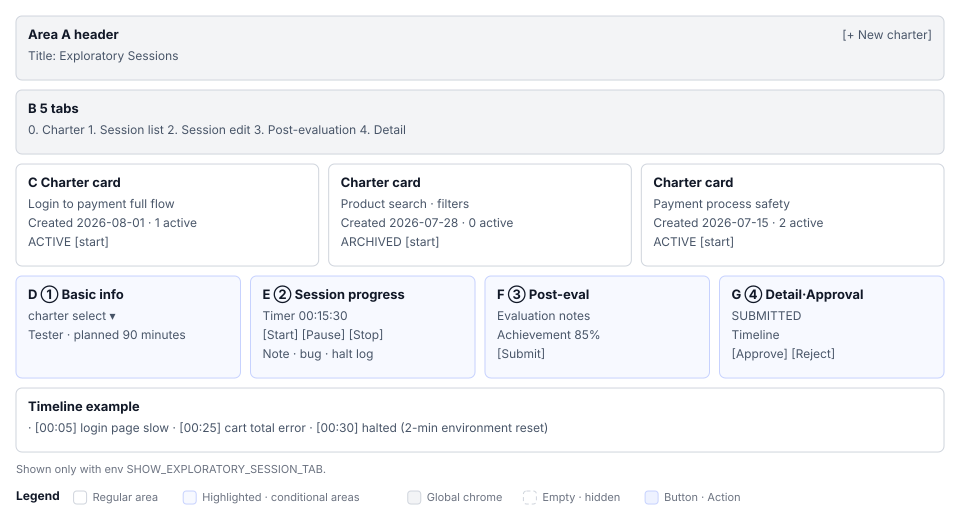

# Exploratory Sessions(S10) Screen Definition

> Screen ID **S10** · Parent document: [`EN-S10-Workflow.md`](EN-S10-Workflow.md)
> Route: `/projects/{projectId}/exploratory`
> Captures (manual `images/`): `56_exploratory.png`

---

## 1. Screen Composition

The main exploratory sessions screen consists of 5 tabs. The default is charter.

| Tab | Name | Role |
|---|---|---|
| **0** | Charter | Create and manage session objectives, scope, and strategy in markdown |
| **1** | Sessions | View all created sessions in a card grid |
| **2** | Session Editor | Select a charter, create a new session, and conduct it. Two subtabs: Basic/Recording |
| **3** | Post-session Evaluation | Record evaluation, findings, and next charter after session ends |
| **4** | Session Detail | View complete timeline, notes, bugs, and attachments of selected session |

**Tabs appear conditionally.** If the environment variable is not set, all 5 tabs are hidden. In that case, the left tab item disappears, so indices of other tabs are shifted accordingly.

---

## 2. Tab-by-Tab Element Definition

### 2.1 Tab 0: Charter

**Purpose:** Define test objectives, scope, ideas, and strategy before starting a session.

#### 2.1.1 Screen Layout

| Area | Name | Role |
|---|---|---|
| **A** | Header | Title `Charter Management` + `[Create new charter]` button |
| **B** | Charter list | Card grid (empty state if 0 charters) |
| **C** | Charter card | Title, creation date, status, action menu |
| **D** | Markdown editor | Charter detail editing (modal or panel) |

#### 2.1.2 Charter Card Elements

| # | Element | Display rule |
|---|---|---|
| 1 | Charter title | Displayed in large size |
| 2 | Creation date | YYYY-MM-DD format |
| 3 | Status badge | Active or archived |
| 4 | Session count | Displayed as "2 active sessions" |
| 5 | `⋮` menu | Edit, archive, delete options |
| 6 | `[Start session]` | Button to create new session from this charter |

#### 2.1.3 Markdown Editor

Default template with 7 sections. Users can freely edit the markdown.

# 🎯 Objective
# ⏱️ Session Info
# 🔍 Test Scope
# 🧭 Test Ideas
# ⚠️ Risks
# 🧪 Test Approach
# ✅ Exit Criteria

---

### 2.2 Tab 1: Sessions

**Purpose:** View all exploratory sessions in the project.

#### 2.2.1 Elements

| # | Element | Display rule |
|---|---|---|
| 1 | Session card grid | Background color by status |
| 2 | Session title | User-entered name |
| 3 | Charter link | Title of the charter this session is based on |
| 4 | Tester | Name of person who conducted session |
| 5 | Duration | Total time recorded by timer |
| 6 | Status badge | Drafting, running, completed, submitted, approved, needs revision |
| 7 | `[View detail]` | Navigate to session detail screen |

#### 2.2.2 Status Background Colors

| Status | Color | Label |
|---|---|---|
| DRAFT | Light blue | Drafting |
| RUNNING | Green | Running (timer active) |
| COMPLETED | Gray | Completed |
| SUBMITTED | Yellow | Pending approval |
| APPROVED | Primary | Approved |
| NEEDS_UPDATE | Red | Needs revision |

---

### 2.3 Tab 2: Session Editor

**Purpose:** Select a charter, create and conduct a new session. Record notes, bugs, and interruptions during execution.

#### 2.3.1 Basic Subtab

Enter charter, tester, and planned duration before starting a session.

| # | Element | Input format | Required |
|---|---|---|---|
| 1 | Charter selection | Dropdown (all charters in project) | ○ |
| 2 | Session title | Text input | ○ |
| 3 | Tester | Dropdown (current user by default) | ○ |
| 4 | Reader/supervisor | Dropdown | ○ |
| 5 | Session duration | Numeric input (minutes) | ○ |
| 6 | Test execution (%) | Slider or input | ○ |
| 7 | Bug investigation (%) | Slider or input | ○ |
| 8 | Management (%) | Slider or input | ○ |
| 9 | Environment summary | Text (e.g., Staging, Production) | — |
| 10 | Product version | Text (e.g., v1.0.0) | — |
| 11 | Strategy tags | Multi-select | — |
| 12 | Area tags | Multi-select | — |

**Time allocation validation:** Test (%) + bug (%) + management (%) must sum to exactly 100% to save.

#### 2.3.2 Recording Subtab

Once session starts, record notes, bugs, and interruptions in this tab.

| # | Element | Screen display |
|---|---|---|
| 1 | Timer | Displayed in HH:MM:SS format. Start, pause, resume buttons |
| 2 | Elapsed time | Shows cumulative time from start |
| 3 | Note input | Text input + `[Add]` button |
| 4 | Note list | Displayed with time, content, delete option |
| 5 | Bug discovery record | Enter title, severity, description + `[Add]` |
| 6 | Bug list | Displayed in discovery order, deletable |
| 7 | Interruption record | Enter reason, duration (minutes) + `[Record]` |
| 8 | Interruption list | Display interruption details and cumulative time |
| 9 | `[End session]` | Stop timer. Session ends |

**Auto-save:** Notes, bugs, and interruptions are saved immediately to `PATCH /api/sessions/{sessionId}`.

---

### 2.4 Tab 3: Post-session Evaluation

**Purpose:** After session ends, summarize the session's value, findings, and improvements, then request approval.

#### 2.4.1 Elements

| # | Element | Input format |
|---|---|---|
| 1 | Session summary | Read-only (charter name, tester, duration, etc.) |
| 2 | Findings summary | Text area (organize findings from session) |
| 3 | Evaluation | Text area (significance of this session, lessons learned) |
| 4 | Next charter | Text or dropdown (propose follow-up session) |
| 5 | Achievement (%) | Numeric or slider (0–100) |
| 6 | `[Promote to case]` | Generate bug as formal test case |
| 7 | `[Submit]` | Submit evaluation. Approvers are notified |

---

### 2.5 Tab 4: Session Detail

**Purpose:** View complete timeline, attachments of selected session.

#### 2.5.1 Elements

| # | Element | Display content |
|---|---|---|
| 1 | Session header | Title, status, edit button |
| 2 | Basic information | Charter, tester, reader, duration, time allocation (%) |
| 3 | Timeline | Notes, bugs, interruptions in chronological order |
| 4 | Notes section | Input time and content displayed in time order |
| 5 | Bugs section | Discovery number, severity, title, description, attachments |
| 6 | Attachments section | File list, download, upload area |
| 7 | Approval status | Pending, approved, rejected display |
| 8 | `[Approve]` / `[Reject]` | Buttons visible only to PM and LEAD |

---

## 3. Status-based Screens

### 3.1 Zero Sessions Status

Charter exists but no session has started yet.

- Tab 1 (session list): Empty state guidance + "Start session from charter" link
- Tab 2 (editor): Charter selection form active, other inputs disabled
- Tabs 3, 4: Grayed out, disabled

### 3.2 Session Running

Timer is active and notes/bugs are being entered.

- Timer UI prominent: `00:05:23` format
- Add note button enabled
- `[End session]` button highlighted
- Other tabs read-only

### 3.3 Session Ended (COMPLETED)

Session has ended but evaluation not yet submitted.

- Timer stopped: `00:45:30` fixed
- Cannot add notes or bugs
- Tab 3 (post-session evaluation) enabled
- `[Submit]` button highlighted

### 3.4 Approval Pending (SUBMITTED)

Evaluation submitted, waiting for PM/LEAD approval.

- Status badge: yellow `SUBMITTED`
- PM/LEAD: `[Approve]` / `[Reject]` buttons shown
- Other users: read-only

### 3.5 Environment Variable Not Set

When `SHOW_EXPLORATORY_SESSION_TAB=false` (or not set).

- Left tab item does not exist
- Screen path (`/projects/{projectId}/exploratory`) is inaccessible
- Routing redirects to S3 dashboard

---

## 4. Sample Data

Values from the ShopFlow demo project.

### Charter Sample

# 🎯 Objective
- Comprehensive exploration of login-to-cart-add/remove flow

# 🔍 Test Scope
- Login success/failure cases
- Product search, filter, sort
- Add/modify/delete cart items
- Payment page navigation

# 🧭 Test Ideas
- Verify cart is empty immediately after login
- Add to cart directly from product detail
- Recalculate total after changing cart quantity
- Maintain state if entering again after interrupted payment

# ⚠️ Risks
- Concurrency: Add same product from multiple windows
- Network delay: Repeated payment button clicks on slow connection
- Browser compatibility: IE11, mobile Safari

# 🧪 Test Approach
- Main flow: login → search → add → checkout
- Edge cases: Zero-price product, max quantity exceeded
- Performance: Load time with 100 items in cart

# ✅ Exit Criteria
- Main flow passes at least once
- No Critical severity bugs found

### Session Sample

| Attribute | Value |
|---|---|
| Charter | Above sample |
| Title | `Login to checkout full flow exploration (2026-08-03)` |
| Tester | Kim, Kwangmyung |
| Reader | Park, Jinsung (PM) |
| Duration (minutes) | 90 |
| Test (%) | 60 |
| Bug investigation (%) | 25 |
| Setup (%) | 15 |
| Environment | Staging |
| Version | v1.0.102 |

### Session Notes Sample

[00:05] Login page loads slowly (5 seconds)
[00:12] Try login with invalid email → "Invalid email format" message shown ✓
[00:25] Successful login
[00:30] Search products: "shoes" → 32 results
[01:10] Bug found! Cart total calculation error (quantity×price missing from sum)

### Session Bug Sample

| Bug | Severity | Description |
|---|---|---|
| BUG-001 | Critical | Cart total incorrect. 3×10,000 = 30,000 but shows 22,000 |
| BUG-002 | High | Login page takes 5+ seconds to load |
| BUG-003 | Low | No fallback image when product image fails to load |

---

## 5. Screen Differences by Permission

### PM / LEAD (Management permission)

- Can access all tabs
- Can approve all sessions
- Can promote findings to cases
- Can edit sessions

### DEVELOPER / CONTRIBUTOR / TESTER

- Can create/edit charters
- Can edit own sessions (or all in project)
- Can submit up to evaluation (cannot approve)
- `[Approve]` `[Reject]` buttons not shown

### VIEWER

- All tabs read-only
- Can view charter and session lists only
- Cannot edit or approve

---

## 6. Screen Terminology

### Status Labels

- `DRAFT`: "Drafting"
- `RUNNING`: "Running" (timer active)
- `COMPLETED`: "Completed"
- `SUBMITTED`: "Submitted (pending approval)"
- `APPROVED`: "Approved"
- `NEEDS_UPDATE`: "Needs revision"

### Button Labels

- `[Start session]`: Create and start new session
- `[End session]`: Stop timer and complete recording
- `[Submit]`: Submit post-session evaluation (request approval)
- `[Approve]`: PM/LEAD final approval
- `[Reject]`: Request revision
- `[Promote to case]`: Generate bug as formal test case

### Notification Messages

- Save success: "Session saved"
- Time validation error: "Test (%) + Bug (%) + Management (%) must sum to 100%"
- Approval complete: "Session approved. Findings can be promoted to cases"

---

## 7. Requirement Coverage

Elements on this screen correspond to requirements detailed in `EN-S10-Requirements.md` feature requirements table.
