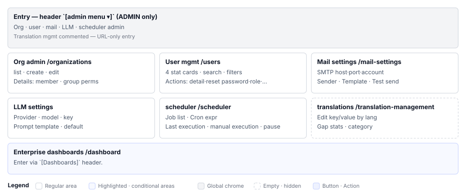

# Administrator Settings(S11) Screen Definition

> Screen ID **S11** · Parent document: [`EN-S11-Workflow.md`](EN-S11-Workflow.md)
> Routes: `/organizations` · `/users` · `/mail-settings` · `/llm-config` · `/scheduler` · `/translation-management`
> Captures (manual `images/`): `78_admin_menu_dropdown.png` · `81_organizations.png` · `82_users.png` · `83_mail_settings.png` · `84_llm_config.png` · `85_scheduler.png` · `86_translation.png`

---

## 1. Screen Composition

S11 is a set of six sub-screens entered via menu. Each sub-screen is an independent management area with its own layout.

### 1.1 Common Elements

| Area | Role |
|---|---|
| **Header** | Overall title, top-right actions (refresh/download/reset vary by screen) |
| **Navigation** | Sub-screen tabs or dropdown (varies by screen) |
| **Content** | Tables, cards, forms, settings panels |
| **Error alert** | Failure messages shown as `Alert severity="error"` |

### 1.2 Sub-Screen Area Composition

#### **3.1 Organizations (`/organizations` `/organizations/{orgId}`)**

| Area | Name | Role | Reference |
|---|---|---|---|
| **A** | Screen header | `Organizations` title + `[Create organization]` or back button | — |
| **B** | Organization list or detail | List mode: cards/table; detail mode: info, members, groups tabs | — |
| **C** | Member management | Member list + invite form | Detail screen members tab |
| **D** | Groups and permission matrix | Per-group function permissions (edit/view/execute) | Detail screen groups tab |

#### **3.2 Users (`/users`)**

| Area | Name | Role | Reference |
|---|---|---|---|
| **A** | Screen header + actions | `Users` title + stat cards (total/active/inactive/recent signup) | |
| **B** | Search and filter | Search (name, email, username) filter (role/status) | — |
| **C** | User table | Account, name, email, role, status, last login, auth badge | — |
| **D** | Row actions | `👁 View details` `⋮ Reset password / Change role / Toggle active·inactive` | — |
| **E** | Top-right buttons | `🔄 Refresh` `⬇ Download` `Initialize (activate all)` | — |

#### **3.3 Mail Settings (`/mail-settings`)**

| Area | Name | Role | Reference |
|---|---|---|---|
| **A** | Screen header | `Mail Settings` title | |
| **B** | Form section | SMTP host, port, account, password input | — |
| **C** | Sender settings | Email and display name input | — |
| **D** | Template select and edit | Email verification, password reset, result types; edit `From`/`Subject`/`Body` | — |
| **E** | Test and save | `[Send test mail]` `[Save]` buttons | — |

#### **3.4 LLM Settings (`/llm-config`)**

| Area | Name | Role |
|---|---|---|
| **A** | Screen header + create | `LLM Settings` + `[+ Add LLM provider]` |
| **B** | Provider list | Cards or table — name, status, API Key summary per provider |
| **C** | Provider detail (drill-down) | Edit API Key, Base URL, model name, enabled status |
| **D** | Prompt template management | Define system prompt, examples, token limit |
| **E** | Default selection | Choose which provider for RAG and automated metadata |

#### **3.5 Scheduler (`/scheduler`)**

| Area | Name | Role | Reference |
|---|---|---|---|
| **A** | Screen header | `Scheduler` title | |
| **B** | Job list table | Name, Cron expression, last execution, result, status (active/paused) | — |
| **C** | Job detail form | Cron edit field | — |
| **D** | Job control buttons | `[Run now]` `[Pause]` / `[Resume]` `[Save]` | — |

#### **3.6 Translation Management (`/translation-management`)**

| Area | Name | Role |
|---|---|---|
| **A** | Screen header | `Translation Management` title + language tabs/select (Korean/English/additional) |
| **B** | Tab 1: Key-value edit | Categorized translation keys; input fields for Korean, English, other languages |
| **C** | Tab 2: Stats | Completion (%), missing keys count per language |
| **D** | Actions | Add language, CSV export/import, clear cache |

---

## 2. Elements per Area

### 2.1 Organizations

#### List screen (`/organizations`)

| # | Element | Display | Interaction |
|---|---|---|---|
| 1 | Title | `Organizations` — `h1` | — |
| 2 | `[Create organization]` button | `contained`, `+` icon | Open create dialog |
| 3 | Organization card/row | Organization name, logo, project count, member count | Click to detail |
| 4 | Error alert | `Alert severity="error"` | Query, create, edit failure |

#### Detail screen (`/organizations/{orgId}`)

| # | Element | Display | Interaction |
|---|---|---|---|
| 1 | Back + title | `←` + organization name | Return to list |
| 2 | **Members tab** | Member list (name, role, invite status) + invite form | Invite/change role/remove |
| 3 | **Groups tab** | Permission matrix per group (rows: functions, columns: roles) | Toggle permission checkboxes |
| 4 | **Settings tab** | Organization name, description, logo edit fields | Save |

### 2.2 Users

| # | Element | Display | Interaction |
|---|---|---|---|
| 1 | Stat cards (4) | Total, active, inactive, recent signup (number + percentage) | — |
| 2 | Search field | Real-time filter while typing | Update list |
| 3 | Role filter | Checkboxes multi-select (ADMIN/PM/tester/general) | Update list |
| 4 | Status filter | Radio or toggle (active/inactive) | Update list |
| 5 | Table header | Account, name, email, role, status, last login, auth | Sortable (estimated) |
| 6 | Table row | Each user info | Row click → detail or drill-down |
| 7 | Row right `⋮` | Menu: detail, reset password, change role, toggle active | Dialog/inline execute |
| 8 | Top-right buttons (3) | `🔄 Refresh` `⬇ Download` `Initialize` | Each action |
| 9 | Auth badge | Not verified / ✓ Complete | — |
| 10 | Error alert | `Alert severity="error"` | Action failure |

### 2.3 Mail Settings

| # | Element | Display | Interaction |
|---|---|---|---|
| 1 | Title | `Mail Settings` | — |
| 2 | SMTP host | Text input | — |
| 3 | SMTP port | Number input (default 587) | — |
| 4 | SMTP account | Text input | — |
| 5 | SMTP password | Password input field | — |
| 6 | Sender email | Text input | — |
| 7 | Sender display name | Text input | — |
| 8 | Template select | Dropdown/tabs (email verification/password/result, etc.) | Selection shows template form |
| 9 | Template `From` | Text input | — |
| 10 | Template `Subject` | Text input | — |
| 11 | Template `Body` | Multi-line input (variable placeholder examples provided) | — |
| 12 | `[Send test mail]` | Button color `info` | Send with settings, show result |
| 13 | `[Save]` | Button color `primary` | Save settings |
| 14 | Error alert | `Alert severity="error"` | Save or test failure |

### 2.4 LLM Settings

| # | Element | Display | Interaction |
|---|---|---|---|
| 1 | Title + create button | `LLM Settings` + `[+ Add LLM provider]` | Open create dialog |
| 2 | Provider card | Name, type (OpenAI/Anthropic, etc.), model, enabled toggle | Click to expand detail |
| 3 | Provider detail (inline) | Form fields | Editable |
| 4 | API Key input | Password field (masked) | — |
| 5 | Base URL input | Text input (optional) | — |
| 6 | Model name input | Text input | — |
| 7 | Enable toggle | Toggle button | Whether to use this provider |
| 8 | Template management | Separate section or tab | Define system, examples, token limit |
| 9 | Default selection | Radio buttons (RAG / auto-metadata / other) | Which provider to use by default |
| 10 | `[Save]` `[Delete]` | Buttons | Save settings or delete provider |
| 11 | Error alert | `Alert severity="error"` | Connection or save failure |

### 2.5 Scheduler

| # | Element | Display | Interaction |
|---|---|---|---|
| 1 | Title | `Scheduler` | — |
| 2 | Job list table | Name, Cron expression, last execution, result (success/fail/in-progress), status | Row click → expand detail |
| 3 | Job detail (inline) | Cron edit field | Change and save |
| 4 | Cron input field | Text input | Example: `0 0 * * *` |
| 5 | `[Run now]` | Button color `info` | Execute job immediately |
| 6 | `[Pause]` / `[Resume]` | Toggle or status-dependent button | Enable/disable job |
| 7 | `[Save]` | Button | Save settings |
| 8 | Execution history | Last run time, result, log preview | — |
| 9 | Error alert | `Alert severity="error"` | Execution or save failure |

### 2.6 Translation Management

| # | Element | Display | Interaction |
|---|---|---|---|
| 1 | Title + language select | `Translation Management` + language tabs/dropdown (Korean/English/additional) | Tab switch → display language |
| 2 | **Tab 1: Key-value** | Categories (sections/menus/buttons, etc.) + key list + input fields | Enter values per language |
| 3 | Category grouping | Left tree or accordion to expand | — |
| 4 | Translation key text | Immutable English key (read-only) | — |
| 5 | Korean input | Text field | Editable |
| 6 | English input | Text field | Editable |
| 7 | Other language input | Only added languages visible | Editable |
| 8 | **Tab 2: Stats** | Completion (%), missing key count, language progress chart | — |
| 9 | Add language button | `[+ Add language]` | Dialog → enter language code |
| 10 | CSV export | `[⬇ Export]` | Download selected languages as CSV |
| 11 | CSV import | `[⬆ Import]` | Upload CSV → choose merge or overwrite |
| 12 | `[Save]` | Button | Save translations |
| 13 | `[Clear cache]` | Button color `warning` | Refresh application translation cache |
| 14 | Error alert | `Alert severity="error"` | Save or import failure |

---

## 3. Screens by State

| State | Trigger | Display |
|---|---|---|
| Loading | Entry, search, filter immediately after | Progress indicator centered or per-area |
| Load failure | Server rejection | Error alert (`Alert severity="error"`) + cached previous data (if any) |
| Editing | Form submit after | Button → progress, cancel disabled |
| Save success | Response returned | Green confirmation alert (optional) + auto-refresh list or form |
| Save failure | Server rejection | Red alert in form + input preserved |
| No data (0 records) | Search/filter returns nothing | "No results" guidance message |

---

## 4. Sample Data

| Screen | Item | Value | Source |
|---|---|---|---|
| Organizations | Organization name | `Tech team` `QA team` | Manual capture (estimated) |
| Users | Name, email | `Kim Min-jun` / `kim@example.com` | Manual capture |
| Mail | SMTP host | `smtp.gmail.com` `smtp.office365.com` | Manual section 17-5 |
| LLM | Provider | OpenAI, Anthropic, Azure OpenAI, local model | Manual section 17-6 |
| Scheduler | Job name | JIRA sync, RAG indexing, token cleanup | Manual section 17-7 |
| Translation | Languages | Korean, English (additional languages) | Manual section 17-8 |

---

## 5. Screen Differences by Permission

⚠ **Not implemented.** Currently the admin menu allows only system administrators (ADMIN). To support manager role, backend permission checks in each controller must be updated.

| Screen element | System ADMIN | System MANAGER | Other |
|---|---|---|---|
| S11 entry (menu visible) | ○ | ❌ Not implemented | ❌ |
| Organization list view | ○ | ❌ Not implemented | ❌ |
| Organization create, edit, member invite | ○ | ❌ Not implemented | ❌ |
| User list view | ○ | ❌ Not implemented | ❌ |
| User change role, toggle active | ○ | ❌ Not implemented | ❌ |
| Mail settings change | ○ | ❌ Not implemented | ❌ |
| LLM provider settings | ○ | ❌ Not implemented | ❌ |
| Scheduler control | ○ | ❌ Not implemented | ❌ |
| Translation edit | ○ | ❌ Not implemented | ❌ |

---

## 6. Screen Copy Conventions

| Item | Rule | Example |
|---|---|---|
| Button | Wrap in `t` | `t("common.button.save", "Save")` |
| Error message | Display server response as-is; detect hardcoded non-`t` text | — |
| Field label | Wrap in `t` | `t("admin.label.smtpHost", "SMTP host")` |
| Table header | Wrap in `t` | `t("admin.table.email", "Email")` |
| Placeholder | Wrap in `t` | `t("placeholder.organizationName", "E.g., Dev team")` |

---

## 7. Cross-Reference with 03 04

| Target | Order after writing |
|---|---|
| **03 Components** | Sections 2.4–2.6 define display and interaction specs + server communication per element |
| **04 Requirement Coverage** | Functional requirements (S11-01~30), non-functional (S11-N1~), corrections (C-1~), verifications (V-S11~) |
| **images/S11_layout.svg** | Admin menu dropdown (6 items) + main area layouts for each sub-screen (1 diagram) |

---

## 8. Maintenance Notes

1. **When adding sub-screens**: Add section 3.7 to section 01; add area row to 1.2; add element section to 2.
2. **When adding permissions**: Update three sections — 01 section 5, 02 section 5, and 03 section 5.
3. **When API endpoints change**: Update 03 section 5 API contract and 04 section 5 unused functions list.
4. **When MANAGER role scope becomes clear**: Correct all ⚠ "Needs verification" items in section 5; record as correction C-1.
5. **When translation management appears in menu**: Correct `× Commented out` item in 01 section 2.2 and 02 section 2.6 table.
