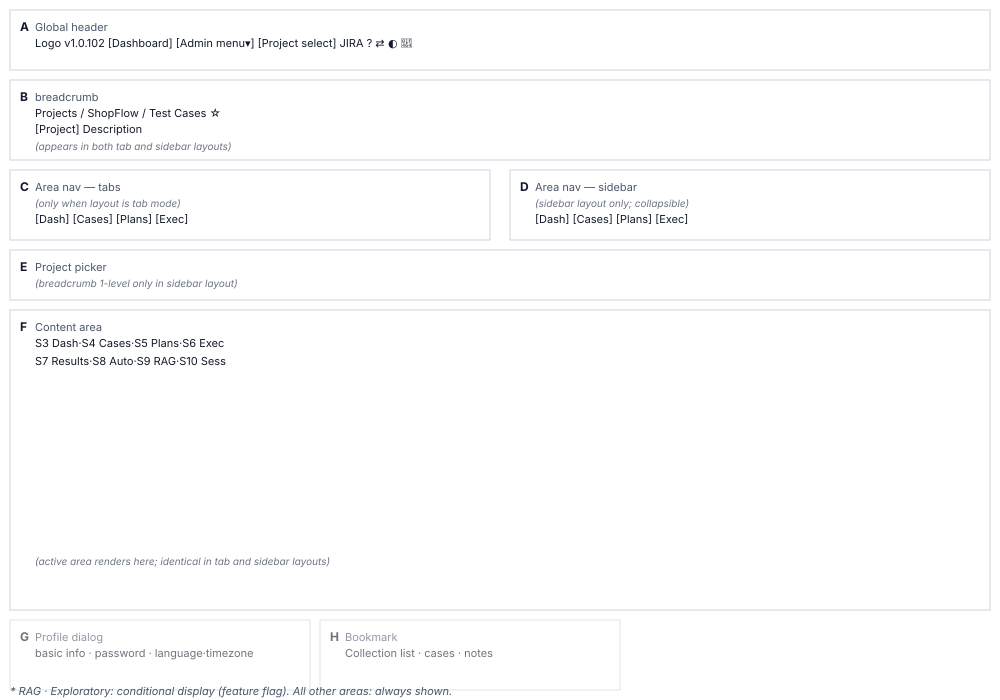

# Shared Layout (S2) Screen Definition

> Screen ID **S2** · Parent document: [`EN-S2-Workflow.md`](EN-S2-Workflow.md)
> Routes: Common areas within `/projects/{projectId}` · `/projects/{projectId}/bookmarks`
> Captures (manual `images/`): `20_project_overview.png` · `95_sidebar_layout.png` · `96_sidebar_collapsed.png` · `97_breadcrumb_project_switcher.png` · `63_project_selector.png` · `65_profile_page.png` · `72_profile_theme.png` · `90_bookmarks.png` · `45_jira_panel.png` · `60_dark_mode.png` · `67_profile_password.png` · `68_profile_language.png` · `69_profile_jira.png` · `70_profile_gsheets.png` · `71_profile_apitoken.png`

---

## 1. Screen composition

S2 is not content but a **skeleton screen** that holds content. One of S3~S10 goes into the content area. Divided into eight regions.

| Area | Name | Role |
|---|---|---|
| **A** | Global header | Logo · version · ADMIN dashboard · admin menu · project selection · JIRA · manual · layout switch · dark mode · avatar menu |
| **B** | Breadcrumb | `Project / Name / Area` 3-level navigation |
| **C** | Area navigation — horizontal tabs | 8 area tabs. Renders only in `horizontal tabs` layout mode |
| **D** | Area navigation — sidebar | 8 area vertical list. Renders only in `sidebar` layout mode. Can collapse |
| **E** | Project selector | Participating projects dropdown. Appears in breadcrumb only in sidebar mode |
| **F** | Content area | Active screen from S3~S10 |
| **G** | Profile dialog | Basic info · password · language/timezone · JIRA · Google Sheets · API token · theme (7 tabs) |
| **H** | Bookmarks screen | Personal collections and notes. Route `/projects/{id}/bookmarks` |

**Layout diagram**

---

## 2. Region-by-region definitions

### 2.1 A. Global header

Header is **64px total height** (`minHeight: "64px !important"`), child of `<AppBar position="static">`. Background follows current theme's `AppBar` color. Light mode uses default gray, dark mode uses dark gray.

| Element | Display | Behavior | Permission |
|---|---|---|---|
| **Logo** | Product logo image, height 60px | Go to `/projects` | Everyone |
| **Version** | Format like `v1.0.102`. Monospace font, 70% opacity | — | Everyone |
| `[Dashboard]` | "Dashboard" text button | Go to `/dashboard` (company dashboard) | **ADMIN only** |
| `[Admin Menu ▾]` | Dropdown button + `KeyboardArrowDownIcon` | Open 6 submenu items | **ADMIN only** |
| — Admin submenu | `Organization Admin` `User Admin` `Mail Settings` `LLM Settings` `Scheduler Admin` | Navigate to each path | **ADMIN** |
| — `Translation Management` | **(Commented out)** Does not appear in menu | — | — |
| `[Project Selection]` | "Project Selection" text button | Go to `/projects` (project list page) | Everyone |
| **JIRA status** | Mini component. Settings icon + connection badge | Link to JIRA settings dialog | Everyone |
| `?` | `HelpOutlineIcon` | Open `/manual` in new tab | Everyone |
| Layout switch | Tab/sidebar icon toggle | Switch horizontal tabs ↔ sidebar | Everyone |
| Dark mode | `Brightness7Icon` (dark) / `Brightness4Icon` (light) | Toggle dark ↔ light | Everyone |
| **Avatar** | First letter of name or `U` default. `Avatar` component | Open avatar menu | Everyone |
| — `[Profile]` | Menu item | Open profile dialog (G) | Everyone |
| — `[User Manual]` | Menu item | Open `/manual` in new tab | Everyone |
| — `[Logout]` | Menu item | Logout + go to `/login` | Everyone |

**Admin menu permission logic conflicts**

A check exists to allow both `ADMIN` and `MANAGER`, but the screen uses system-admin-only logic. So **`MANAGER` role cannot access the admin menu.**

⚠ **Needs verification**: Should the admin menu be open to `MANAGER`, or is the current behavior correct? Recorded as correction target in 04.

### 2.2 B. Breadcrumb

Appears directly below header in 3 levels when in project.

| Level | Content | Display rule |
|---|---|---|
| **1st (Project)** | Link | Appears only in `horizontal tabs` mode. Click toggles project menu |
| **1st (Project)** | Project selector | In `sidebar` mode, 1st position shows project name + dropdown |
| **1st (Project)** | Project name | Click expands dropdown for other projects. Current project shown as selected |
| **Middle** | `/` separator | — |
| **2nd (Project name)** | Project code + name | Example: `SHOP / ShopFlow` |
| **2nd collapse** | Project description + collapse/expand arrow | Next line. Browser storage preserves state |
| **3rd (Area name)** | Current active area name | If no area, show 2nd level name in bold |
| **Bookmark (star)** | ☆ icon button | Always shows after project entry. Click goes to `/projects/{id}/bookmarks` |

**Project selector dropdown**

- Mode: Visible only in sidebar
- Participating projects list + current project highlighted + "View projects" link
- Clicking same project again does nothing

### 2.3 C. Area navigation — horizontal tabs mode

8 items defined in [workflow] render as **horizontal tabs**.

After filtering conditional items (RAG · Exploration), the **position in the resulting list** becomes the current area number. Not fixed.

| Tab | Icon | Count badge | Condition |
|---|---|---|---|
| Dashboard | 📊 | — | Always visible |
| Test Cases | 📋 | ✓ (case count) | Always visible |
| Test Plans | 📝 | ✓ (plan count) | Always visible |
| Test Execution | ▶ | ✓ (execution count) | Always visible |
| Test Results | 📈 | — | Always visible |
| Automated Tests | 🤖 | — | Always visible |
| **RAG Documents** | 📄 | — | **Conditional** — RAG availability |
| **Exploratory Sessions** | 🔍 | — | **Conditional** — `showExploratorySessionTab` |

**Count badges appear on only 3 tabs (cases · plans · execution)**. Badge numbers count the length of the list loaded in context.

### 2.4 D. Area navigation — sidebar mode

Full height, 229 lines. Vertical list.

| Aspect | Value |
|---|---|
| **Width** | 240px default. Adjustable 250px~320px range |
| **Selection mark** | Left 3px line + background (primary color 10% opacity) |
| **Collapse** | Icons only, labels move to `title` attribute |
| **Collapse state storage** | Browser storage |

### 2.5 E. Project selector (sidebar mode only)

Appears in breadcrumb 1st position only in sidebar mode.

| Element | Behavior |
|---|---|
| Project name click | Expand dropdown of participating projects |
| Select dropdown item | Keep same area + swap project only. Do nothing if same project |
| "View projects" | Go to S1 (`/projects`) |

### 2.6 F. Content area

Container `maxWidth={false}`, left · right padding `px: 2`. Renders one of S3~S10 per tab index.

**Test cases area special case**

Fixed-height frame with no bottom margin. Tree + input form fill entire screen height.

### 2.7 G. Profile dialog

Opened by avatar menu → `[Profile]` or dialog route. Full 1,040 lines. Modal, no route change.

**7 tabs**

| # | Tab | Content | Save button |
|---|---|---|---|
| 1 | Basic information | Username (read-only) · name · email · role badge · email auth status · version | ✓ |
| 2 | Password | Verify existing password, then change | ✓ |
| 3 | Language settings | Interface language (immediate) · timezone (save button) | ✓ |
| 4 | JIRA settings | JIRA address · email · connection key (masked) | ✓ |
| 5 | Google Sheets connection | OAuth account connection status | — |
| 6 | API tokens | Issue (immediate full display 1x) · revoke (max 10) | — |
| 7 | Theme settings | Screen mode (dark/light) · design system · **menu structure** | ✓ |

**API token security**

Shows full value only once right after issue. After that, masked (specified at [location], manual section 13-6). This is rule **G7** across all screens.

### 2.8 H. Bookmarks screen

Route `/projects/{projectId}/bookmarks`. Navigate by header `☆`.

| Area | Content |
|---|---|
| **Left collection list** | Collection name · `[Create Collection]` · delete (default `Favorites` cannot delete) |
| **Right case list** | Cases in current collection. Can remove · edit personal note |

**Bookmarks are personal assets.** Do not affect other users. Cannot edit case content, only manage collections and notes (manual section 4-7).

---

## 3. States by screen

### 3.1 Project not selected

If project ID is not in path (e.g., `/projects` path), do not render the shared layout. Return to S1 project list or login.

### 3.2 No permission

If requested admin route (e.g., `/dashboard`) lacks permission, show `UnauthorizedPage` component.

---

## 4. Example data

### 4.1 Horizontal tabs mode

| Item | Actual value |
|---|---|
| Project | ShopFlow |
| Project code | SHOP |
| Area | Test Cases |
| Breadcrumb | `Project / ShopFlow / Test Cases` |
| Badge (cases) | 67 |
| Badge (plans) | 12 |
| Badge (execution) | 34 |

### 4.2 Sidebar mode

Project selector appears in breadcrumb 1st position, menu expands vertically on left side.

---

## 5. Permission-based screen differences

S2 does not filter areas by project permission. **Even VIEWER sees all 8 areas.** Whether content is editable is determined by each content screen (S3~S10).

| Permission | A header exposure | Admin menu access | JIRA badge | Function |
|---|---|---|---|---|
| **ADMIN** | `[Dashboard]` `[Admin Menu]` | ✓ | ✓ | Full |
| **MANAGER** | — | ✗ | ✓ | Per-project features |
| **Others** | — | — | ✓ | Per-project features |

Areas disappear only under **2 feature flags** (`00_Overview_Workflow.md` section 4):
- RAG availability (RAG service active)
- `showExploratorySessionTab` (Exploratory session environment variable)

---

## 6. Screen text standards

Text in header · menu · dialog all follow **i18n keys**. No hardcoded Korean.

| Element | i18n key | Korean fallback |
|---|---|---|
| `[Dashboard]` | `header.nav.dashboard` | `대시보드` |
| `[Admin Menu]` | `header.nav.managementMenu` | `관리 메뉴` |
| `[Project Selection]` | `header.nav.projectSelection` | `프로젝트 선택` |
| `?` manual | `header.userMenu.manual` | `사용자 매뉴얼` |
| Layout switch (tabs → sidebar) | `projectNav.mode.switchToSidebar` | `좌측 메뉴 구조로 보기` |
| Layout switch (sidebar → tabs) | `projectNav.mode.switchToTabs` | `가로 탭 구조로 보기` |

---

## 7. Requirement coverage

Full requirements and each location in [`EN-S2-Requirements.md`](EN-S2-Requirements.md).

| Requirement | Area | Status |
|---|---|---|
| S2-01 Global header 10 tools | A | Working |
| S2-02 3-level breadcrumb | B | Working |
| S2-03 8 area navigation | C, D | Working |
| S2-04 Count badges 3 items | C | Working |
| S2-05 Horizontal tabs ↔ sidebar | A, C, D | Working |
| S2-06 Sidebar collapse | D | Working |
| S2-07 Project switch | B, E | Working |
| S2-08 Profile 7 tabs | G | Working |
| S2-09 Bookmark collections · notes | H | Working |
| S2-10 Dark mode · design system | A, G | Working |
| S2-11 Project description collapse persistence | B | Working |
