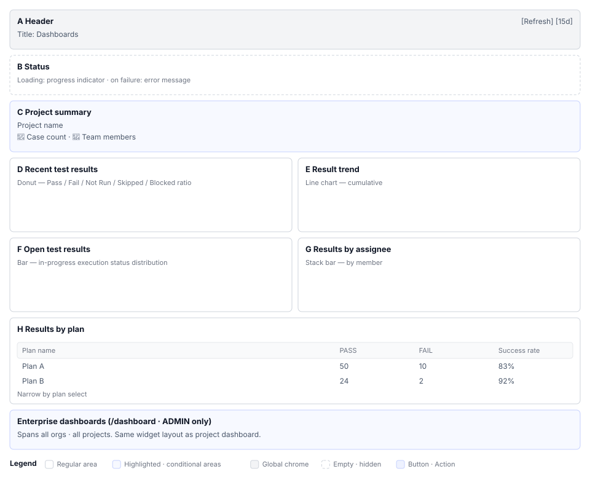

# Dashboards (S3) Screen Definition

> Screen ID **S3** · Parent: [`EN-S3-Workflow`](EN-S3-Workflow.md)
> Routes: `/projects/{projectId}` · `/dashboard` (system admin only)
> Captures (manual `images/`): `46_dashboard.png` · `20_project_overview.png` · `80_global_dashboard.png`

---

## 1. Screen Composition

### 1.1 Project Dashboard (`/projects/{projectId}`)

| Area | Name | Role |
|---|---|---|
| **A** | Header | Title `Dashboard` + `[Refresh]` chip + last update time |
| **B** | Loading and error state | Progress indicator, error message, retry button |
| **C** | Project summary (collapsible section) | Project name, case count, member count; collapse/expand possible |
| **D** | Recent test results (pie chart) | Count by status (PASS/FAIL/BLOCKED/SKIPPED/NOTRUN) |
| **E** | Test result trend (line chart) | Cumulative trend by period; default 15 days |
| **F** | Open test execution results (bar chart) | State distribution of in-progress execution |
| **G** | By assignee results (stacked bar) | Member case progress (PASS/in progress/FAIL) |
| **H** | Test plan results (table) | Plan list + success rate per plan |
| **I** | Status display | No-data warning (when not loading/erroring) |

**Layout (mobile responsive: `xs` single column → `md` 2-column grid)**

### 1.2 Enterprise Dashboard (`/dashboard`, ADMIN only)

Layout is similar to project dashboard but aggregation scope is entire organization.

---

## 2. Elements by Area

### 2.1 Area A. Header

| Element | Display | Behavior | Permission |
|---|---|---|---|
| Title | Dashboard (h5, bold 700) | — | Everyone |
| `[Refresh]` chip | Secondary color, small size | Reload data | Project access permission |
| Last update | M/D/YYYY format chip | Tooltip shows precise time on hover | Everyone |

**`[Refresh]` chip is visible only when active project exists.** Hidden without project.

### 2.2 Area B. Loading and Error State

#### B1. Loading State

┌──────────────────────────────────────────┐
│ 🔄 Loading dashboard data… │
└──────────────────────────────────────────┘

Light info-series background. Widgets are hidden during loading.

#### B2. Error State

┌──────────────────────────────────────────┐
│ 🛠️ A server error occurred │
│ Issue: Database connection failed │
│ Resolve: [Retry] [Details] │
└──────────────────────────────────────────┘

Error-series background. Icon by error type:
- `SERVER_ERROR` → 🛠️
- `NETWORK_ERROR` → 🌐
- `AUTH_ERROR` → 🔐
- `NOT_FOUND_ERROR` → 🔍
- `PERMISSION_ERROR` → 🚫
- `DATA_ERROR` → 📊

Buttons: `[Retry]` `[Sign in]` (AUTH_ERROR only) `[Details]` (if detailed info available)

### 2.3 Area C. Project Summary (Collapsible Section)

| Element | Display | Behavior |
|---|---|---|
| Title | `Project Summary` + expand arrow | Click to toggle collapsible section (saved in browser storage) |
| Project name | `h6`, primary color | — |
| Case count chip | 📄 + number, `info` color | — |
| Member count chip | 👤 + number, `secondary` color | — |

**Collapsible section state is saved in browser storage.** Closed sections remain closed after refresh.

### 2.4 Area D. Recent Test Results (Pie Chart)

Five slices: PASS (green) / FAIL (red) / BLOCKED (orange) / SKIPPED (gray) / NOTRUN (light gray).

| Element | Display | Behavior |
|---|---|---|
| Chart | 5 status-colored pie slices | — |
| Legend | Right or bottom of chart | — |
| Numbers | Count or percent on each slice | — |
| Refresh button | Top right of widget (common) | Reload widget data only |

### 2.5 Area E. Test Result Trend (Line Chart)

X-axis: date. Y-axis: cumulative count. Default period: last 15 days.

| Element | Display | Behavior |
|---|---|---|
| Lines | 5 lines by status (matching colors) | — |
| Legend | Bottom or right | — |
| Period filter | `[Select period ▾]` | Change date range |
| Grid | Background gridlines | — |

### 2.6 Area F. Open Test Execution Results (Bar Chart)

Shows state distribution of in-progress test executions as bars.

| Element | Display | Behavior |
|---|---|---|
| Bar per execution | Execution ID or date. PASS/FAIL/in-progress stacked | — |
| Color | Distinguished by status | — |
| Stack form | Stacked bar | — |

### 2.7 Area G. By Assignee Results (Stacked Bar)

Member case progress. Stacked bar shows each user's workload at a glance.

| Element | Display | Meaning |
|---|---|---|
| Bar | Member name, stacked (PASS/in progress/incomplete) | Member case progress state |
| Color | PASS (green) / in progress (blue) / incomplete (red) | Status identification |
| Legend | Right or bottom | Legend display |
| Total label | Total case count above bar | Cases assigned |

### 2.8 Area H. Test Plan Results (Table)

| Element | Display | Behavior |
|---|---|---|
| Plan select dropdown | `[+ Select plan ▾]` | Open plan selection |
| Selected plan name | Shown as chip next to dropdown | Click to reopen dropdown |
| Table header | Plan name \| PASS \| FAIL \| SKIP \| Success rate | — |
| Table rows | Each plan or execution | Click to navigate to plan detail page |

Clearing plan selection shows entire project's recent results.

### 2.9 Area I. No-Data Warning

┌──────────────────────────────────────────┐
│ ⚠️ No executions yet │
│ Test results will appear here │
└──────────────────────────────────────────┘

Shown only when not loading, no error, and no data. Warning-series light background.

---

## 3. Screens by State

### 3.1 Initial Entry (Project Selected, Data Loading)

- Header: Title + refresh chip (active)
- State: `[Progress indicator] Loading dashboard data…`
- Body: None (loading indicator only)

### 3.2 Data Load Complete

- Header: Title + refresh chip + last update time
- All 6 widgets render
- Collapsible section state restored from browser storage

### 3.3 Load Failure

- Header: Title only
- Error message box (icon + message + buttons)
- Widgets: Hidden

### 3.4 No Permission (403)

Error message: "You do not have access to this project"
`[Sign in again]` or `[Back to projects]` button.

### 3.5 No Project (No project selection in S1)

Header only visible; all 6 widgets hidden. No retry button (no data to load).

---

## 4. Example Data

Based on ShopFlow demo project in manual section 6:

| Item | Value |
|---|---|
| Project name | ShopFlow |
| Total cases | 127 |
| Member count | 8 |
| Most recent execution result | PASS 89 / FAIL 18 / BLOCKED 12 / SKIPPED 5 / NOTRUN 3 |
| Completion rate | 76% |
| By assignee (example) | Kim Chulsu (lead): 45 / Lee Younghee: 38 / Park Minsu: 44 |
| Plan count | 5 |

---

## 5. Screen Differences by Permission

| Item | ADMIN | PM/LEAD | DEV/CONTRIB | TESTER | VIEWER |
|---|---|---|---|---|---|
| View project dashboard | ○ | ○ | ○ | ○ | ○ |
| Refresh button | ○ | ○ | ○ | ○ | ○ |
| Enterprise dashboard link | ○ | — | — | — | — |
| Widget edit | — | — | — | — | — |

**Enterprise dashboard is ADMIN only.** MANAGER gets 403 on `/dashboard` route.

---

## 6. Screen Text Rules (i18n)

| Element | Korean Key | English Default |
|---|---|---|
| Title | `dashboard.title` | `Dashboard` |
| Project summary | `dashboard.sections.summary` | `Project Summary` |
| Recent test results | (chip title) | `Recent Test Results` |
| Case count label | `dashboard.project.totalTestCases` | `Test Cases: {count}` |
| Member count label | `dashboard.project.members` | `Members: {count}` |
| Status labels | `dashboard.status.pass`, `.fail`, `.blocked`, `.skipped`, `.notrun` | `PASS`, `FAIL`, … |
| Refresh button | `dashboard.refresh.button` | `Refresh` |
| Loading message | `dashboard.loading.data` | `Loading dashboard data…` |
| Error message (generic) | `dashboard.error.solution` | `Error: {action}` |
| Retry button | `dashboard.error.retry` | `Retry` |
| No data | `dashboard.noData.message` | `No test results yet` |

---

## 7. Requirement Coverage

Which elements implement which requirements is covered in `04_요건반영목록.md`.

| Element | Requirement | Location |
|---|---|---|
| 6 widgets | `S3-01` `S3-02` | Section 1-2 |
| Plan select filter | `S3-03` | Section 2.8 |
| Enterprise dashboard | `S3-04` (non-functional) | Section 1.2 Section 04's `S3-N1` |

---

## 8. Notes

- ⚠ **Period filter implementation**: Is 15 days hard-coded or can user change range? Needs verification.
- ⚠ **Chart number display**: How to show count/percent on pie and bar charts? Needs visual confirmation.
- ⚠ **Plan results table click behavior**: Navigate to plan detail or filter only on same screen? Needs confirmation.
