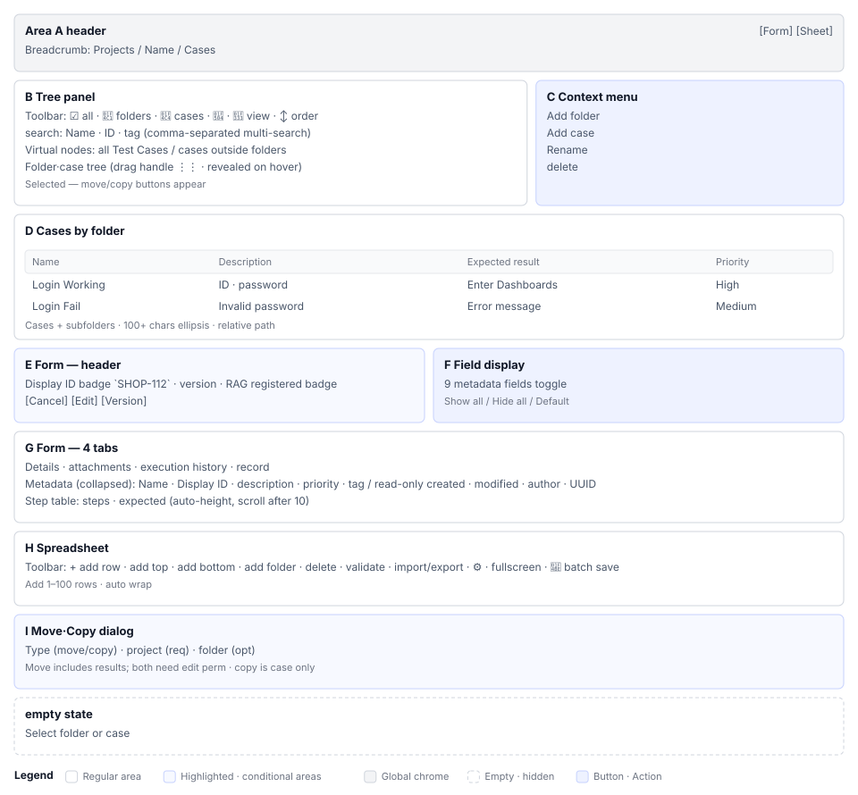

# Test Cases(S4) Screen Definition

> Screen ID **S4** · Parent: [`EN-S4-Workflow.md`](EN-S4-Workflow.md)
> Routes: `/projects/{projectId}/testcases` · `/projects/{projectId}/testcases/{testCaseId}`
> Captures (manual `images/`): `21_testcase_page.png` · `24_tree_populated.png` · `87_tree_folder_only.png` · `88_folder_case_list.png` · `89_all_cases_list.png` · `44b_field_visibility.png` · `44c_form_metadata.png` · `93_form_delete_dialog.png` · `94_cross_project_dialog.png` · `100_tree_filter_search.png` · `22_tree_add_menu.png` · `23_tree_right_click_menu.png` · `44_input_mode_open.png` · `90_folder_edit_form.png`

---

## 1. Screen Layout

| Area | Name | Role |
|---|---|---|
| **A** | Left navigation header | Project name, three tabs (`[Folders Only]` / `[All]` / `[Search]`) |
| **B** | Tree filter input | Substring search with commas for compound queries, 300ms debounce |
| **C** | Tree body | Two virtual nodes (`All Cases` / `Uncategorized`), folders, cases |
| **D** | Tree context menu | Right-click menu: add, edit, delete, move project, copy project, sort |
| **E** | Right body header | Breadcrumb, 7 toolbar buttons (add, edit, delete, copy, move, export, more) |
| **F** | Right body tabs (4) | Details, Attachments (conditional), Execution history (conditional), History (conditional) |
| **G** | Field visibility toggle | Select fields to display; saved per user, Details tab only |
| **H** | Right body form (tab 0) | Metadata, basic info, steps table, expected result, version |
| **I** | Right body spreadsheet (optional) | Multiple cases in table format for bulk editing; toggle button to switch |

When no case is selected, areas C and H display only a guidance message.

---

## 2. Elements by Area

### 2.1 A. Left Tree Header

| Element | Display | Action |
|---|---|---|
| Project name | `text`, weight 600 | — |
| `[Folders Only]` button | Toggle, state shown | Toggle folders-only mode, save to browser storage |
| `[All]` button | Toggle | Toggle folders + cases all mode, save to browser storage |
| `[Search]` button | Search icon | Focus filter input field |

View mode selection is **per-project independent**. Switching projects remembers the selection.

### 2.2 B. Filter Input

Placeholder for input field is `t("testcase.search", "Search...")`.

| Rule | Description |
|---|---|
| Substring match | Text matches if it is contained in name |
| Comma-delimited | Multiple search terms separated by commas are AND-connected |
| Debounce | Filter applies after 300ms wait following input |
| Ancestor/descendant preserved | Ancestors and descendants of matching nodes are also shown |

When filterText is blank, filter is cleared.

### 2.3 C. Tree Body

#### Two Virtual Nodes

| Node | Icon | Action |
|---|---|---|
| All Cases | 📋 | Click to select all cases in project (useful in spreadsheet mode) |
| Uncategorized | 🚫 | Click to filter unfoldered cases |

Virtual nodes are not actual DB nodes and do not respond to filtering/sorting.

#### Folder Items

| Element | Display | Action |
|---|---|---|
| Folder icon | 📁 | — |
| Folder name | Text | Double-click to open folder edit dialog |
| Child case count | `(number)` on right | Total of all cases below folder (recursive) |
| DnD handle | ⋮⋮ icon | Drag point |
| Folder info button | ℹ️ | Display folder metadata |
| Show children button | ▶️ | Toggle folder expand/collapse (indent increase/decrease) |

#### Case Items

| Element | Display | Rule |
|---|---|---|
| Case icon | 📄 🟢(automated) | — |
| Display ID | `TC-001` etc | Unique per case |
| Case name | Text | — |
| Automated badge | 🟢 | Shown if `linkedJunitCases` array is not empty |
| RAG linked badge | 📚 | Shown if `linkedDocuments` array is not empty |

Double-click case item to load right form.

### 2.4 D. Tree Context Menu

Displayed on right-click. Menu items vary by target (folder/case) and permission.

| Item | Icon | Display condition | Action |
|---|---|---|---|
| Add case | ➕ | Folder right-click | New form dialog (all fields) |
| Add folder | 📁 | Folder right-click | New folder dialog |
| Edit | ✏️ | Case/folder right-click | Edit form/dialog |
| Delete | 🗑️ | Case/folder EDITOR+ | Delete confirmation dialog |
| Move project | ⬆️ | Case EDITOR+ | Project selection dialog |
| Copy project | 📋 | Case authenticated user | Project selection dialog |
| Sort | ⬆️⬇️ | Folder right-click EDITOR+ | Subsort dialog |

Menu appears at click coordinates (`anchorPosition`). `menuOpen` flag prevents target from disappearing after close animation.

### 2.5 E. Right Header

Deprecated tab. Now integrated below as toolbar.

| Element | Display | Action |
|---|---|---|
| Breadcrumb path | `Project / Folder / Case name` | Current selected node path |
| `[+ Add Case]` | Button | New form dialog for F |
| `[Edit]` | Button, conditional | Edit form for F |
| `[Delete]` | Button, permission-restricted | Delete confirmation dialog |
| `[Copy]` | Button | Copy within same folder |
| `[Move]` | Button | Folder selection dialog |
| `[Export]` | Button | CSV/JSON download |
| `[⋮ More]` | Menu | Additional actions (version, attachments, spreadsheet) |

### 2.6 F. Right Tabs (4)

#### Conditional Tab Display

| Tab | Label | Display condition |
|---|---|---|
| Details | `t("testcase.tabs.details", "Details")` | Always |
| Attachments | `t("testcase.tabs.attachments", "Attachments")` | `testCaseId` exists |
| Execution history | `t("testcase.tabs.execution", "Execution history")` | `testCaseId` exists, `!isFolder` |
| History | `t("testcase.tabs.history", "History")` | `testCaseId` exists, `!isFolder` |

When folder is selected, only Details tab is shown.

### 2.7 G. Field Visibility Toggle

Positioned on right end of Details tab.

| Feature | Action | Save |
|---|---|---|
| Field checkbox | Toggle individual field show/hide | Per-project save |
| `[Show All]` | Display all fields | — |
| `[Hide All]` | Hide all fields | — |
| `[Reset]` | Restore default field set | — |

From ~50 fields, user selects only needed ones. Toggle selection is saved independently per project + per user.

### 2.8 H. Details Tab Form

| # | Section | Description |
|---|---|---|
| 1 | Metadata | Case ID, author, creation date, etc. |
| 2 | Basic info | Name, description, priority, tags, etc. |
| 3 | Test steps | Test execution steps input table |
| 4 | Expected result | Expected result markdown editor |

Each section is a collapsible accordion. Section state is maintained in local state.

**Toggle fields (9 examples):**
- Name, description, pre-condition, expected result, priority, type, tags, author, creation date

Hidden fields are not shown in form, but data is preserved.

### 2.9 I. Spreadsheet Mode

Activated by selecting `[Spreadsheet View]` from More menu.

| Feature | Display | Action |
|---|---|---|
| Header | Field name columns | — |
| Row | One case = one row | Click cell to open inline editor |
| Add column | Gear icon 🔧 | Select columns to display |
| Add row | `[+ Add Row]` | Add new case row |
| Delete row | `[🗑️]` | Case delete confirmation |
| Save | `[Save]` | Save all changes at once |

Spreadsheet uses virtual rendering for performance; only visible rows are rendered.

---

## 3. Screen States

### 3.1 Empty State

Displayed on right when zero cases or no search results.

| Situation | Message | Button |
|---|---|---|
| Zero cases in project | `No test cases` guidance | `[+ Add New Case]` |
| Zero search results | `No test cases match '{query}'` | Clear search button |

### 3.2 Read-only (VIEWER role)

| Element | State |
|---|---|
| Toolbar buttons | Disabled; edit, delete unavailable |
| Form fields | readOnly or disabled attribute |
| Attachment upload | Unavailable; download only |
| Menu items | Delete, move, copy items hidden |

### 3.3 When Folder Selected

When folder is selected, right form switches to folder info format.

| Display | Description |
|---|---|
| Folder name, description, case count | Folder metadata only |
| Tabs 2, 3, 4 hidden | Details tab only |
| No steps table | Folders have no steps |

---

## 4. Permission-based Screen Differences

| Role | Add case | Edit case | Delete case | Modify folder | Upload attachment |
|---|---|---|---|---|---|
| **ADMIN** | ✅ | ✅ | ✅ | ✅ | ✅ |
| **EDITOR** | ✅ | ✅ | ✅ | ✅ | ✅ |
| **VIEWER** | ❌ disabled | ❌ read-only | ❌ disabled | ❌ disabled | ❌ download only |

Permission is determined by project role (`projectRole`), not system role.

---

## 5. Screen Text Standards

| Text | i18n key | Fallback | Location |
|---|---|---|---|
| Add | `testcase.action.add` | `Add Case` | Toolbar, menu |
| Edit | `testcase.action.edit` | `Edit` | Toolbar, menu |
| Delete | `testcase.action.delete` | `Delete` | Toolbar, menu |
| Save | `testcase.action.save` | `Save` | Form button |
| Cancel | `testcase.action.cancel` | `Cancel` | Form button |
| Move | `testcase.action.move` | `Move` | Menu |
| Copy | `testcase.action.copy` | `Copy` | Menu |
| Export | `testcase.action.export` | `Export` | Toolbar |

All buttons, labels, placeholders support multi-language via i18n function; fallback text is in English.

---

## 6. Dialogs and Additional Screens

### New/Edit Form Dialog
Width `lg`, max height `80vh`. Title is `Create New Test Case` / `Edit Test Case` depending on mode.

### Folder Edit Dialog
Input folder name and description. Dropdown to select parent folder.

### Version Dialog
Input version label and description, then `[Save]`.

### Delete Confirmation Dialog
Warning: `Are you sure you want to delete '{case name}' test case?`. No forced/regular mode difference (only regular delete supported for cases).

### Project Move/Copy Dialog
Select target project → select target folder → `[Move]` / `[Copy]`.
