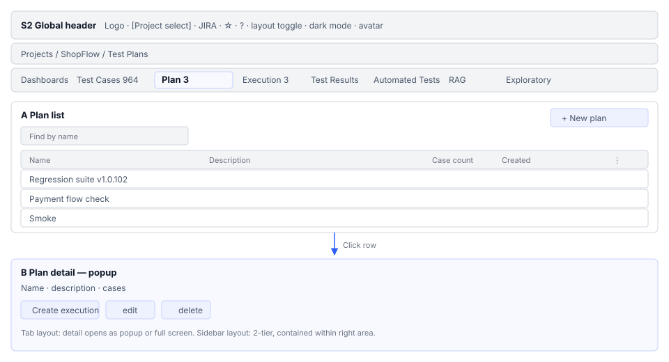
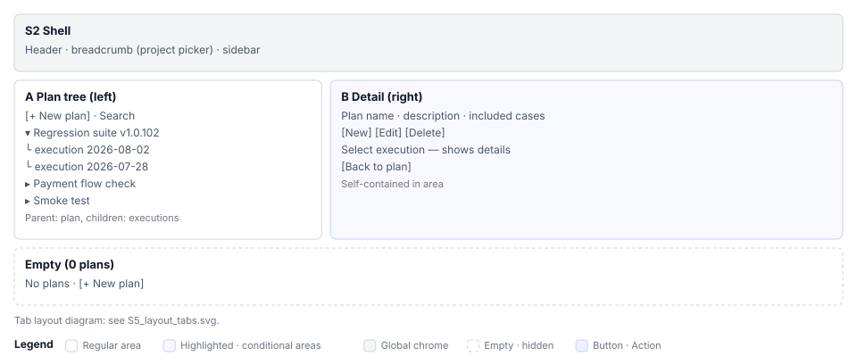

# Test Plans(S5) Screen Definition

> Screen ID **S5** · Parent document: [`EN-S5-Workflow.md`](EN-S5-Workflow.md)
> Routes: `/projects/{projectId}/testplans` · `/projects/{projectId}/testplans/new` · `/projects/{projectId}/testplans/{testPlanId}`
> Captures (manual `images/`): `51_testplans.png` · `98_plan_workspace.png` · `104_plan_form_new.png` · `105_plan_detail.png`

---

## 1. Screen composition

S5 is rendered in two different forms depending on the project layout (tab layout vs. sidebar layout).

### 1.1 Tab layout

| Area | Name | Role |
|---|---|---|
| **A** | Plan list | Display plan cards or rows with pagination |
| **A-1** | Create button | Open new plan creation dialog |
| **A-2** | Card or row | Plan ID, name, description, case count, creation date, menu button |
| **A-3** | Menu button (`⋮`) | Edit, delete, automation connect |

### 1.2 Sidebar layout

| Area | Name | Role |
|---|---|---|
| **Left** | Plan and execution tree | Display plans (parent) with their executions (children) below |
| **Left-1** | `[+ New Plan]` | Open new plan creation form (in the right area) |
| **Left-2** | Plan node | Plan name, execution expand toggle (`▶`/`▼`), search filter |
| **Left-3** | Execution node (child) | Execution name, status chip (COMPLETED/IN_PROGRESS, etc.), parent plan |
| **Left-4** | Collapse button | Hide the left side to expand the right area |
| **Right** | Content area | Plan detail or execution detail |

---

## 2. Elements by area

### 2.1 Plan card or row

**Card grid in tab layout**

┌──────────────────────────────┐
│ Plan name │
├──────────────────────────────┤
│ Description (2 lines, truncate with ... if longer) │
├──────────────────────────────┤
│ Cases: N Creation date │
├──────────────────────────────┤
│ [✎ Edit] [⋮ Menu] │
└──────────────────────────────┘

**Tree node in sidebar layout**

▶ Plan name [⋮]
 Execution-1 [Chip: COMPLETED]
 Execution-2 [Chip: IN_PROGRESS]

**Elements**

| Element | Displayed content | State notation |
|---|---|---|
| Plan name | `testPlan.name` | Single-line text |
| Description | `testPlan.description` | 2 lines, truncate with `...` if longer |
| Case count | `testPlan.testCaseIds.length` or actual case count | Badge or text |
| Creation date | `testPlan.createdAt` | Date format (user timezone) |
| Status chip | Execution status (`COMPLETED`, `IN_PROGRESS`, `ABORTED`, etc.) | Chip color (green, orange, red) |
| Menu button | `⋮` or 3-line icon | Click → dropdown |

### 2.2 Plan creation/editing form

| Field | Type | Required | Initial value |
|---|---|---|---|
| **Name** | Text | ○ | Empty (in edit mode: existing value) |
| **Description** | Text area | × | Empty |
| **Included cases** | Multi-select tree | ○ | Empty |

**Case selection tree**

□ ShopFlow project
 □ Member management
 ☑ Sign up
 ☑ Login
 □ Order management
 □ Create order
 □ Cancel order

- Folder checkbox: selecting a folder includes **all cases** within the folder
- Multi-select supported
- Initially before selection: tree is collapsed and 0 checks
- Already selected cases show a checkmark

### 2.3 Plan detail (2-pane layout — right area)

┌──────────────────────────────────┐
│ Plan name │
├──────────────────────────────────┤
│ Description (full display, scrollable) │
├──────────────────────────────────┤
│ Included case list │
│ ├─ Name, priority, status │
│ └─ [Pagination] │
├──────────────────────────────────┤
│ [Edit] [Delete] [Create Execution] │
└──────────────────────────────────┘

---

## 3. States and screens

### 3.1 0 plans (empty state)

Dashboards · Test Cases · [Test Plans] · Execution · Results

 ┌────────────────────────────┐
 │ │
 │ No plans exist │
 │ Create a plan grouping │
 │ cases to get started │
 │ │
 │ [+ New Plan] │
 │ │
 └────────────────────────────┘

- Empty state icon + 3-line guidance text
- 1 create button
- No tabs

### 3.2 N plans (list)

Sorted by creation date in descending order (most recent at the bottom).

Tab layout: card grid, 10 items per page
Sidebar layout: tree, expand/collapse toggle to show/hide executions

### 3.3 Creation mode

Dialog (tab layout) or right area (sidebar layout)
Title: "New Plan"
Buttons: `[Save]` `[Cancel]`

### 3.4 Editing mode

Click `✎` on plan card or row, or `[Edit]` in detail
Title: "Edit Plan"
Initial values: existing name, description, case list
Buttons: `[Save]` `[Cancel]`

### 3.5 No permission

If you lack edit permission (TESTER, VIEWER):
- `[+ New Plan]` button is hidden
- `⋮` menu button is hidden
- List is read-only

---

## 4. Example data

Example project (**ShopFlow**) data:

| Plan ID | Plan name | Description | Case count | Creation date | Notes |
|---|---|---|---|---|---|
| `plan-01` | Member management v1 | Sign up, login, password change testing | 5 | 2026-06-15 | Complete |
| `plan-02` | Create order | From order creation to payment | 12 | 2026-07-10 | In progress |
| `plan-03` | Payment and shipping | Payment gateway integration | 8 | 2026-07-20 | New |

---

## 5. Screen differences by permission

| Feature | PM LEAD | DEVELOPER CONTRIBUTOR | TESTER | VIEWER |
|---|---|---|---|---|
| View list | ○ | ○ | ○ | ○ |
| Full card functionality | **All** | **All** | Read-only | Read-only |
| `[+ New Plan]` | ○ | ○ | **×** | × |
| `⋮` menu (edit, delete) | ○ | ○ | × | × |
| `[Start Execution]` | ○ | ○ | ○ | × |
| Automation connect | ○ | ○ | ⚠ Needs verification | × |

---

## 6. Screen text specifications

| Element | Text | Description |
|---|---|---|
| Tab name | Test Plans | i18n supported |
| Create button | + New Plan | i18n supported |
| Empty state title | No plans exist | i18n supported |
| Empty state guidance | Create a plan grouping cases to get started | Align with manual |
| Menu items | Edit / Delete / Automation Connect | Korean consistency |
| Status chip | COMPLETED / IN_PROGRESS / ABORTED | English fixed |

---

## 7. Requirement mapping

| Requirement ID | Content | Screen location | Status |
|---|---|---|---|
| S5-UI-01 | Plan list card/table | 1.1 Area A | Working |
| S5-UI-02 | Plan creation dialog | section 2.2 and 3.3 | Working |
| S5-UI-03 | Plan editing form | 3.4 section | Working |
| S5-UI-04 | Case multi-select tree | section 2.2 and 2.3 | Working |
| S5-UI-05 | 2-pane layout (sidebar) | 1.2 section | Environment-dependent |
| S5-UI-06 | Plan and execution tree | 1.2 area Left | Environment-dependent |
| S5-UI-07 | Permission-based button exposure | section 5 | Working |

---
