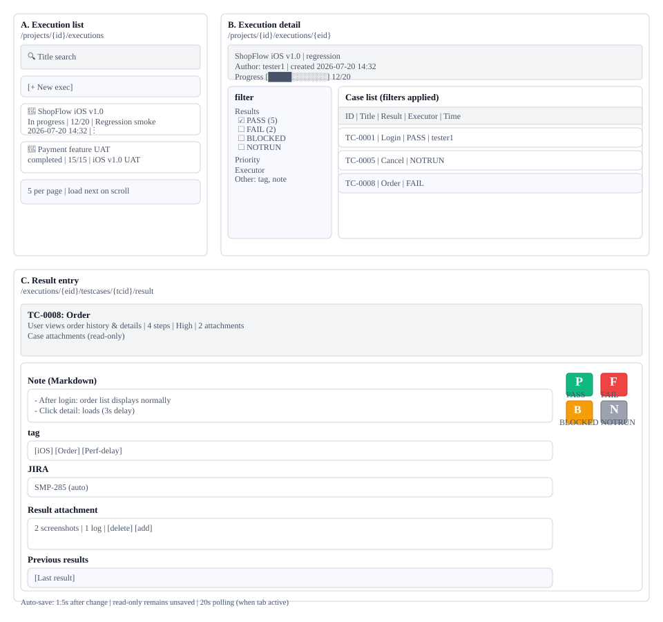

# Test Execution(S6) Screen Definition

> Screen ID **S6** · Parent: [`EN-S6-Workflow.md`](EN-S6-Workflow.md)
> Routes: `/projects/{projectId}/executions` · `/projects/{projectId}/executions/new` · `/projects/{projectId}/executions/{executionId}` · `/projects/{projectId}/executions/{executionId}/testcases/{testCaseId}/result` · `/executions/{executionId}`
> Captures (manual `images/`): `52_executions.png` · `52b_execution_filter_panel.png` · `91_prev_results_dialog.png` · `99_execution_workspace.png` · `106_execution_form_new.png` · `107_result_entry.png`

---

## 1. Screen Composition

### 1.1 Overall Layout: 3 Screens

Test execution proceeds through **list screen (A) → detail screen (B) → result entry screen (C)** in three stages.

| Screen | Route | Main component | Areas | Description |
|---|---|---|---|---|
| **A. List** | `/projects/{id}/executions` | | 1~4 | Execution card grid, search, auto-refresh |
| **B. Detail** | `/projects/{id}/executions/{eid}` | | 5~7 | Execution's case list, filter panel, detail info |
| **C. Result entry** | `/executions/{eid}/testcases/{tcid}/result` | | 8~12 | Result 4-button panel, notes/tags/JIRA/attachments, previous results |

---

## 2. Area-by-Area Element Definition

### Area 1: Search + Create button (Screen A)

| Element | Display | Condition |
|---|---|---|
| **Search input** | Magnifying glass icon + "Search title" placeholder | Always visible |
| **Search results** | Show executions whose title contains entered text | Real-time |
| **[+ New Execution]** | Green button | Edit permission (PM/LEAD/DEV/CONTRIBUTOR) only |
| **Search term preservation** | Saved per project in sessionStorage | Restored on each entry |

### Area 2: Execution card grid (Screen A)

| Element | Composition | Interaction |
|---|---|---|
| **Per card display** | Execution name / status (status chip) / progress bar / assigned plan / creation date | Click to enter detail |
| **Status chip** | DRAFT (gray) / IN_PROGRESS (blue) / COMPLETED (green) | Color categorization by status |
| **Progress** | [████░░░░] 12/20 format, completed cases / total count | 20-second auto-refresh when tab active |
| **Card menu (top-right)** | ⋮ (3-dot) | Delete |
| **Pagination** | 5 per page, next page loads on scroll | Infinite scroll (IntersectionObserver) |

### Area 3: Filter panel (Screen B, left)

| Filter | Options | Effect | Reference |
|---|---|---|---|
| **Result** | All / PASS / FAIL / BLOCKED / NOTRUN (each count shown) | Show table with selected status only | — |
| **Priority** | All / Critical / High / Medium / Low | Filter by case priority | Set in S4 |
| **Runner** | All / tester1 / tester2 / ... | Show results entered by | Project member list |
| **Date** | Date range (start ~ end) | Show results entered within period | Date picker |
| **JIRA** | Has / None | Filter by JIRA link presence | Visible only when JIRA integration active |
| **Notes** | Has / None | Show results with notes filled | — |
| **Tags** | All project tags (multi-select) | AND condition | Multiple tag selection at once |

Filters are persisted in browser storage; reopening the same screen preserves previous filter selection.

### Area 4: Case list table (Screen B, right)

| Column | Display | Click | Sort |
|---|---|---|---|
| **ID** | TC-0001 format | Click enters result entry screen (C) | — |
| **Title** | Case name | Same | — |
| **Result** | ✓PASS / ✗FAIL / ⚠BLOCKED / —NOTRUN | Color chip (green/red/orange/gray) | — |
| **Runner** | Name of user who entered result | — | — |
| **Time** | Result save timestamp (HH:MM or YYYY-MM-DD HH:MM) | — | — |

Table reflects filter panel selection in real-time. Changing filter updates table immediately.

### Area 5: Execution info header (Screens B·C shared)

| Item | Display | Edit permission |
|---|---|---|
| **Execution name** | `ShopFlow iOS v1.0` | Creator and PM can edit |
| **Assigned plan** | `Regression Smoke` or `(No plan)` | Cannot change after creation |
| **Status** | Pending · In progress · Complete | Change manually or auto-advance when all cases done |
| **Creator, creation date** | `tester1 · 2026-07-20 14:32` | Read-only |
| **Progress** | `[████░░░░] 12/20` | Read-only. Updates approximately every 20 seconds |

### Area 6: Case details (Screen C, top)

| Item | Display |
|---|---|
| **Case ID, title** | TC-0008 Order inquiry |
| **Description** | Markdown rendering |
| **Steps** | "4 steps" link (click to toggle step details) |
| **Priority** | "High" chip (colored) |
| **Case attachments** | Image/file list, read-only |

All case information is read-only. To edit, go back to S4 Case screen.

### Area 7: Result entry fields (Screen C, middle)

#### 7.1 Result status (floating buttons)

| Button | Key | Color | Meaning | Reference |
|---|---|---|---|---|
| **P** | P | Green (#10b981) | PASS, passed | `TestResult.PASS` |
| **F** | F | Red (#ef4444) | FAIL, failed | `TestResult.FAIL` |
| **B** | B | Orange (#f59e0b) | BLOCKED, blocked | `TestResult.BLOCKED` |
| **N** | N | Gray (#9ca3af) | NOTRUN, not run | `TestResult.NOTRUN` |

Click with mouse/touch or use keyboard shortcut keys.

#### 7.2 Notes

| Item | Format | Limit | Reference |
|---|---|---|---|
| **Input** | Markdown (lists, code, links supported) | No limit | — |
| **Save** | Auto-save after approximately 1.5 seconds | Only on change | Auto-save hook |
| **Rendering** | Markdown → HTML | Displayed on result view | S7 shows notes |

Notes record findings during testing, failure causes, screenshot descriptions, etc.

#### 7.3 Tags

| Item | Function | Reference |
|---|---|---|
| **Add** | Auto-complete existing tags or create new | — |
| **Inherit** | Execution tags inherited by each result (editable) | `TestExecution.tags` → `TestResult.tags` |
| **Save** | Auto-save (approximately 1.5 seconds) | — |

Tags are used for result search, categorization, and statistics.

#### 7.4 JIRA

| Item | Function | Condition | Reference |
|---|---|---|---|
| **Auto-detect** | Auto-extract issue keys like "SMP-285" from notes or case description | JIRA integration active | — |
| **Manual entry** | Search from dropdown or text input | — | — |
| **Link** | Display link to JIRA issue | — | — |

If JIRA integration is inactive, this area is not exposed.

#### 7.5 Result attachments

| Item | Function | Limit | Reference |
|---|---|---|---|
| **File add** | Drag and drop or file selection | Images, archives, documents (e.g., .png, .zip, .pdf) | — |
| **Size** | ⚠ Needs verification | Per file / per execution max | Backend settings |
| **Count** | Quantity limit | ⚠ Needs verification | Backend settings |
| **Display** | Filename + size + delete button | — | — |

Result attachments store screenshots, error logs, performance profiles, etc.

### Area 8: Previous results dialog (Screen C, bottom)

| Item | Function | Reference |
|---|---|---|
| **Button** | "[Previous round results]" | Click to open dialog |
| **Toggle** | Markdown · Plain text | Change display format |
| **Content** | Previous round results (result/notes/tags/JIRA/attachments) | Read-only |
| **Metadata** | "2026-07-15 FAIL (tester1)" | Who, when, what result |

Useful when retesting the same case to reference past history. Helpful for regression testing or reproduction testing.

---

## 3. Status-based Screen Variations

### 3.1 Screen differences by execution status

| Execution status | List | Detail | Result entry | Note |
|---|---|---|---|---|
| **DRAFT** | Card gray, 0% progress | All fields editable | Result entry allowed | Not yet started |
| **IN_PROGRESS** | Card blue, N% progress | Only execution name editable, status change not allowed | Result entry allowed | Ongoing |
| **COMPLETED** | Card green, 100% progress | All fields read-only | Result editing not allowed (view only) | All cases complete |

### 3.2 Screen differences by permission

| Permission | Create execution | Edit execution | Delete execution | Record result | Edit result |
|---|---|---|---|---|---|
| PROJECT_MANAGER | ○ | ○ (own) | ○ (own) | ○ | ○ (own) |
| LEAD_DEVELOPER | ○ | ○ (own) | ○ (own) | ○ | ○ (own) |
| DEVELOPER | ○ | ○ (own) | ○ (own) | ○ | ○ (own) |
| CONTRIBUTOR | ○ | ○ (own) | ○ (own) | ○ | ○ (own) |
| **TESTER** | — | — | — | **○** | ○ (own) |
| VIEWER | ○ (read) | — | — | — | — |

**TESTER**: Has result recording permission, so P/F/B/N buttons and notes/tags/attachments are enabled.

### 3.3 Before and after filter application

| Situation | Table display | Filter panel display |
|---|---|---|
| **No filter (default)** | All cases, 20 per page | All conditions in initial state |
| **"Result: FAIL" selected** | Only FAIL cases, 3 total | "Result" item shows only "FAIL" checked |
| **Multiple filters** | Intersection (AND) | Multiple conditions applied simultaneously |

---

## 4. Sample Data

### 4.1 Project: ShopFlow (seed data)

| Item | Value |
|---|---|
| Project name | ShopFlow |
| Code | SMP |
| Plans | "Regression Smoke Test", "iOS v1.0 UAT" |
| Case count | 50 |
| Members | tester1(TESTER), tester2(TESTER), dev1(DEVELOPER) |

### 4.2 Test execution samples

| ID | Name | Status | Progress | Plan | Creator | Creation date |
|---|---|---|---|---|---|---|
| exec-001 | ShopFlow iOS v1.0 | IN_PROGRESS | 12/20 | "Regression Smoke" | tester1 | 2026-07-20 14:32 |
| exec-002 | Payment feature UAT | COMPLETED | 15/15 | "iOS v1.0 UAT" | tester2 | 2026-07-19 09:15 |
| exec-003 | Ad-hoc execution without plan | DRAFT | 0/0 | (none) | dev1 | 2026-07-21 16:45 |

### 4.3 Test case samples (in exec-001)

| ID | Title | Result | Runner | Time |
|---|---|---|---|---|
| TC-001 | Login after app install | ✓ PASS | tester1 | 14:45 |
| TC-008 | Order inquiry | ✗ FAIL | tester1 | 15:20 |
| TC-012 | Bookmark feature | ⚠ BLOCKED | tester1 | 15:35 |
| TC-015 | Settings | — NOTRUN | — | — |

---

## 5. Permission-based Screen Differences

### 5.1 With edit permission (PM·LEAD·DEV·CONTRIBUTOR)

- `[+ New Execution]` button enabled
- Execution card ⋮ menu enabled (delete possible)
- All result entry fields enabled
- P/F/B/N buttons enabled
- Notes, tags, JIRA, attachments editable

### 5.2 TESTER (result recording only)

- `[+ New Execution]` button disabled (grayed)
- Execution card ⋮ menu disabled
- All result entry fields enabled (**P/F/B/N, notes, tags, attachments available**)
- Execution name not editable (read-only)

### 5.3 VIEWER (read-only)

- All input/modification buttons disabled
- List, detail, results all view-only
- Dialog and form access not possible

---

## 6. Screen Text Rules

| Item | Notation | Example |
|---|---|---|
| **Status chip** | English uppercase | DRAFT / IN_PROGRESS / COMPLETED |
| **Result button** | Single character (P/F/B/N) | — |
| **Full screen** | Title + description | "Test Execution / Execute ID and case result recording" |
| **Filter** | Clear Korean terms | "Result", "Priority", "Runner" |
| **Time display** | HH:MM or YYYY-MM-DD HH:MM | 2026-07-20 14:32 |

Button text follows manual section 8's screenshot language. Korean build uses Korean, English build uses English (per USER_MANUAL_EN.md).

---

## 7. S2 and S4 Requirement Correspondence

| Element in S2 | Requirement in S4 | Status |
|---|---|---|
| Search + filter panel | S6-01 Search function | Working |
| 20-second auto-refresh | S6-02 Auto-refresh | Working |
| P/F/B/N buttons | S6-03 Result 4 values | Working |
| TESTER permission | S6-04 TESTER records results | Working |
| Auto-save guard | S6-05 View-only does not save | Working |
| Plan-unspecified option | S6-N1 Plan optional | Working |
