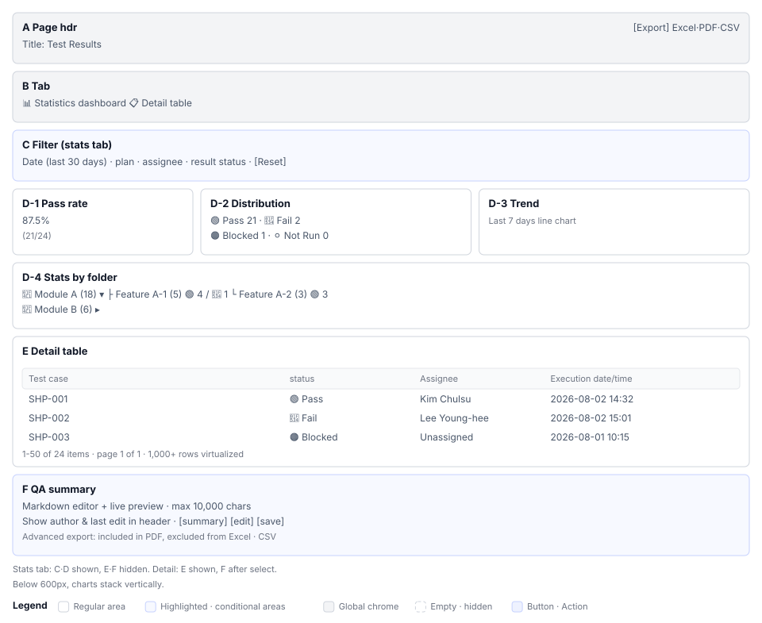

# Test Results(S7) Screen Definition

> Screen ID **S7** · Parent document: [`EN-S7-Workflow.md`](EN-S7-Workflow.md)
> Routes: `/projects/{projectId}/results`
> Captures (manual `images/`): `53_results.png` · `92_qa_summary_panel.png` · `109_results_by_folder.png`

---

## 1. Screen Composition

| Area | Name | Role |
|---|---|---|
| **A** | Page header | Title `Test Results` + icon |
| **B** | Tab panel | Statistics dashboard and detail table tabs |
| **C** | Filter panel | Period, plan, assignee, result filters + reset button |
| **D** | Statistics card group | Pass rate, result distribution, trend, folder, comparison (optional) |
| **E** | Detail results table | Case name, status, assignee, execution date with sort and pagination |
| **F** | QA summary panel | Markdown editor + metadata (author, modification time) |
| **G** | Export dropdown | Excel / PDF / CSV / advanced options |

**Layout**

---

## 2. Area-by-area Element Definition

### 2.1 A. Page Header

| Element | Display | Behavior |
|---|---|---|
| Icon | `📊` BarChartIcon (primary color) | — |
| Title | `Test Results` `h5`, weight 600 | — |

Header is responsive. On mobile, title and icon stack vertically.

### 2.2 B. Tab Panel

| Tab | Index | Icon | Label | Render |
|---|---|---|---|---|
| **Statistics Dashboard** | 0 | BarChartIcon | `Statistics Dashboard` | `TestResultStatisticsDashboard` |
| **Detail Table** | 1 | TableViewIcon | `Details Table` | `TestResultDetailTable` |

Changing tabs keeps the URL unchanged, only the content updates.

### 2.3 C. Filter Panel (Statistics Dashboard tab only)

| Filter | Component | Default | Options |
|---|---|---|---|
| **Period** | DateRangePicker | Last 30 days | Last 7 days, Last 30 days, All, Custom |
| **Plan** | MultiSelect | (all) | All plans in project |
| **Assignee** | MultiSelect | (all) | List of users who performed executions |
| **Result Status** | MultiSelect | (all) | PASS, FAIL, BLOCKED, NOTRUN |
| **`[Reset]` button** | Button | — | Restore all filters to defaults |

Filter panel does not appear on detail table tab.

**⚠ Needs verification.** Whether multi-select deselection works as checkbox toggle or "X" button (confirm in code).

### 2.4 D. Statistics Card Group

#### D-1. Pass Rate Card

| Element | Display | Behavior |
|---|---|---|
| Number | `87.5%` very large font | — |
| Label | `PASS` | — |
| Subtitle | `(21/24)` secondary color | — |

Real-time calculation for selected period and plan. Show `—` if no data.

#### D-2. Result Distribution Donut Chart

| Category | Color | Display | Legend |
|---|---|---|---|
| **PASS** | 🟢 (primary) | `21 records` | `Pass` |
| **FAIL** | 🔴 (error) | `2 records` | `Fail` |
| **BLOCKED** | 🟠 (warning) | `1 record` | `Blocked` |
| **NOTRUN** | ⚪ (lightgrey) | `0 records` | `Not Run` |

Show "No data" text only if total is 0. Hover shows number and percentage tooltip.

#### D-3. Trend Chart (mixed line and bar)

| Axis | Category | Unit |
|---|---|---|
| **X-axis** | Date | Daily or weekly depending on selected period |
| **Y-axis (left)** | Execution count | Bar |
| **Y-axis (right)** | Pass rate (%) | Line |

Auto-calculate full period if period filter not set.

#### D-4. Folder Statistics

| Element | Display | Behavior |
|---|---|---|
| Folder node | 📁 + folder name + (total case count) | Click to collapse/expand |
| Child node | Feature or module name | Sub-case statistics |

Tree depth has no constraint. Typical max 3 levels deep.

#### D-5. Comparison Chart (2+ executions selected)

| Element | Display | Condition |
|---|---|---|
| Bar chart | Side-by-side pass rates of each execution | 2+ executions selected by filter |
| Legend | Execution ID (e.g., "2026-08-02 Execution") | — |

Returning to 1 execution reverts to default statistics. No deselect available (filter only control).

### 2.5 E. Detail Results Table

| Column | Header | Sort | Width |
|---|---|---|---|
| **Test Case** | Case name | ✓ | 40% |
| **Result Status** | PASS / FAIL / BLOCKED / NOTRUN badge | ✓ | 12% |
| **Assignee** | User name or "Unassigned" | ✓ | 15% |
| **Execution Time** | `2026-08-02 14:32:15` | ✓ | 18% |
| **Action (clickable)** | Detail view link or icon | — | 15% |

**Pagination:** "Rows per page selection (25/50/100/all)" + "Page navigation"

**Virtualization:** Smooth scrolling with 1,000+ rows (MUI data table native `virtualization`)

**Row highlight:** Row background lightens on mouse hover

**⚠ Needs verification.** Whether "Action" column navigates to detail page or opens result detail form inline (confirm in code with `handleViewResult`).

### 2.6 F. QA Summary Panel (exposure only when execution selected)

| Element | Display | Constraint | Reference |
|---|---|---|---|
| Header | `📝 QA Summary ({executionID})` | — | — |
| Markdown editor | Input field + real-time preview | Max 10,000 characters | |
| Character count | `{entered characters} / 10,000` | — | — |
| Metadata | Author: {name} Modified: {datetime} | Read-only | — |
| `[Save]` button | Contained, primary | Inactive = no changes | `qa-summary-save-button` |

**Hidden condition:** If no execution selected, panel area shows only gray outline, editor disabled.

**Markdown support:** Headings (`#`), bold (`**`), links (`[]`), lists (`-`). Images not supported.

### 2.7 G. Export Dropdown

| Option | Format | Included items |
|---|---|---|
| **Excel** | `.xlsx` | Statistics summary sheet + detail results sheet |
| **PDF (landscape)** | `.pdf` | Charts + statistics table (one page) |
| **PDF (portrait)** | `.pdf` | Detail table paginated |
| **CSV** | `.csv` | Detail results (for spreadsheet import) |
| **Advanced - Excel+QA** | `.xlsx` | Same + "QA Analysis" tab (with QA summary) |
| **Advanced - PDF+QA** | `.pdf` | Same + "QA Analysis" section |

Click → display "Preparing..." (1~3 seconds) → file download starts.

**Filename rule:** `TestResult_{projectcode}_{YYYYMMDD_HHmmss}.xlsx` format.

---

## 3. State-specific Screens

### 3.1 Data Loading

| State | Display | Reference |
|---|---|---|
| Right after page entry | Rotating spin icon centered | MUI `CircularProgress` |
| After filter change | Same spin (semi-transparent overlay on cards) | — |

Add "Querying..." text if load time exceeds 3 seconds.

### 3.2 No Data

| Situation | Display |
|---|---|
| First entry after project creation | "No result data" notice + "Start case creation and execution" prompt |
| Filter result 0 records | "No results in selected filter range" + "Reset filter" button |

### 3.3 Error State

| Situation | Display |
|---|---|
| API query failure | Red Alert `An error occurred during inquiry. Please try again later` |
| Export failure | Toast notification `Export failed` (5 second display) |

### 3.4 Export Progress

| Stage | Display | Duration |
|---|---|---|
| After click | Spin icon on button + "Preparing..." text | 1~3 seconds |
| Download start | Toast notification `Download started` | Display 3 seconds then auto-close |

---

## 4. Sample Data

Following manual capture data from ShopFlow EN project.

| Field | Value |
|---|---|
| Project code | `SHP` |
| Query period | 2026-07-01 ~ 2026-08-03 |
| Execution count | 5 |
| Total cases | 24 |
| PASS | 21 |
| FAIL | 2 |
| BLOCKED | 1 |
| NOTRUN | 0 |
| Pass rate | 87.5% |

Table sample rows:
| SHP-001 | 🟢 Pass | Kim Chulsu | 2026-08-02 14:32 | View details |
| SHP-002 | 🔴 Fail | Lee Younghee | 2026-08-02 15:01 | View details |
| SHP-003 | 🟠 Blocked | Unassigned | 2026-08-01 10:15 | View details |

---

## 5. Permission-based Screen Differences

| Permission | View | Filter | QA summary write | Export | Dashboard access |
|---|---|---|---|---|---|
| **PM LEAD** | ◯ | ◯ | ◯ (all executions) | ◯ | ◯ |
| **DEVELOPER** | ◯ | ◯ | △ (assigned only) | ◯ | ◯ |
| **TESTER** | ◯ | ◯ | ◯ (executions where user entered results) | ◯ | ◯ |
| **VIEWER** | ◯ | ◯ | ✗ (read-only) | ◯ | ◯ |

**△ Constrained permissions:**
- Whether DEVELOPER can write QA summary for others' executions unconfirmed.
- Whether TESTER can view all execution results or only own entries unconfirmed.

---

## 6. Screen Text Standards

All text defaults to Korean with English support (`t` function).

| Item | Korean | English |
|---|---|---|
| Page title | `테스트 결과` | `Test Results` |
| Tab 1 | `통계 대시보드` | `Statistics Dashboard` |
| Tab 2 | `상세 테이블` | `Details Table` |
| Filter header | `필터` | `Filter` |
| Period | `기간` | `Period` |
| Plan | `테스트 플랜` | `Test Plan` |
| Assignee | `담당자` | `Assignee` |
| Result status | `결과 상태` | `Result Status` |
| Reset | `초기화` | `Reset` |
| Pass rate | `통과율` | `Pass Rate` |
| Result distribution | `결과 분포` | `Result Distribution` |
| Trend | `추이 (기간)` | `Trend (Period)` |
| Folder statistics | `폴더별 통계` | `Folder Statistics` |
| Comparison | `실행 비교` | `Execution Comparison` |
| QA summary | `QA 총평` | `QA Summary` |
| Export | `내보내기` | `Export` |
| Preparing | `준비 중...` | `Preparing...` |
| No data | `결과 데이터가 없습니다` | `No result data` |

Status badge colors and symbols defined in document 03 display specifications.

---

## 7. Requirement 04 Alignment

This document's areas and elements should map 1:1 to requirements in [EN-S7-Requirements.md](EN-S7-Requirements.md).

| Area | Requirement ID |
|---|---|
| D-1 pass rate card | S7-03 |
| D-2 result distribution | S7-03 |
| D-3 trend chart | S7-04 |
| D-4 folder statistics | S7-05 |
| E detail table | S7-06 |
| F QA summary | S7-07, S7-08, S7-10 |
| G export | S7-09 |
| C filter | S7-01, S7-02 |

Missing requirements or requirements only in document 04 marked as "Needs verification" in [EN-S7-Requirements.md](EN-S7-Requirements.md).
