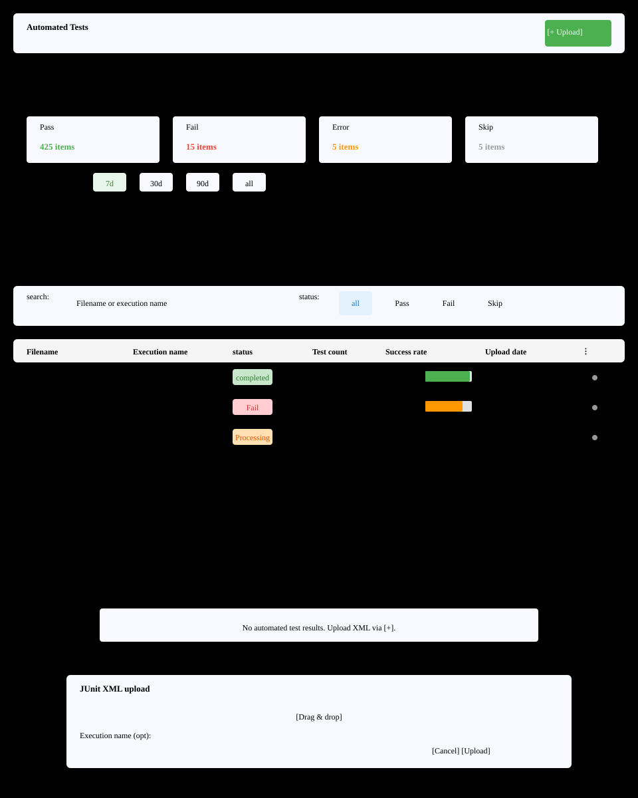

# Automated Tests(S8) Screen Definition

> Screen ID **S8** · Parent: [`01`](EN-S8-Workflow.md)
> Routes: `/projects/{projectId}/automation` · `/projects/{projectId}/junit` · `/projects/{projectId}/automation-results/{testResultId}` · `/projects/{projectId}/junit-results/{testResultId}` · `/junit-results/{testResultId}` · `/automation-tests/{testResultId}`
> Captures (manual `images/`): `54b_automation.png` · `54_junit.png` · `108_junit_result_detail.png`

---

## 1. Screen Composition

Automated tests consist of two screens: result list and result detail.

| Screen | Route | Role |
|---|---|---|
| **List** | `/projects/{projectId}/automation` | JUnit result file upload, list view, statistics |
| **Detail** | `/projects/{projectId}/automation-results/{testResultId}` | Suite and case-level success/failure/skip, error, editing |

### 1.1 List Screen

| Area | Name | Role |
|---|---|---|
| **A** | Screen header | Title `Automated Tests` + `[+ JUnit Result Upload]` |
| **B** | Error notification | Query or operation failure message |
| **C** | Statistics section | Collapsible section. Date-based success rate, chart (pie, bar), summary cards (pass/fail/error/skip) |
| **D** | Time range filter | Tabs: 7d(default)·30d·90d·all. Recalculates chart only |
| **E** | List header | Search (filename, execution name) + status tabs (all, pass, fail, skip) |
| **F** | Result table | Columns: filename, execution name, status, case count, success rate, upload date, menu |
| **G** | Empty state | 0 results guidance (message + upload button) |
| **H** | Upload dialog | File selection + execution name, description input |

---

## 2. Element Definition by Area

### 2.1 A. Screen Header

| Element | Display | Behavior | Permission |
|---|---|---|---|
| Title | `Automated Tests` — `subtitle1`, 600 | — | All |
| `[+ JUnit Result Upload]` | `contained`, `small`, `+ cloud upload` icon | Open H dialog | Upload permission |

---

### 2.2 B. Error Notification

Display as `Alert severity="error"` on list query or upload failure.
- Example message: `"Error processing file: XML format error"`
- Location: Below header

---

### 2.3 C. Statistics Section

**Collapsible section**: Title `Test Result Statistics`, default expanded.

#### 2.3.1 Summary Cards (4 columns)

| Card | Metric | Color | Icon |
|---|---|---|---|
| Pass | `passed` count | Green (`RESULT_COLORS.PASS`) | ✓ |
| Fail | `failed` count | Red (`RESULT_COLORS.FAIL`) | ✗ |
| Error | `errors` count | Orange (`STATUS_COLORS.ERROR`) | ⚠ |
| Skip | `skipped` count | Gray (`RESULT_COLORS.SKIPPED`) | ⊘ |

#### 2.3.2 Charts (by selected range)

Default 7 days. Recalculated when range changes.

| Type | Display |
|---|---|
| **Pie chart** | Status distribution as percentage of total |
| **Bar chart** | Daily cumulative status trend |

---

### 2.4 D. Time Range Filter

| Tab | Range | Default |
|---|---|---|
| 7 days | Last 7 days | ○ |
| 30 days | Last 30 days | — |
| 90 days | Last 90 days | — |
| All | Since beginning | — |

Clicking updates C chart only. List unchanged (shows all).

---

### 2.5 E. List Header

#### 2.5.1 Search Input

| Element | Input | Behavior |
|---|---|---|
| Search field | filename, execution name, description | Debounce 500ms instant filter |
| Placeholder | `Search by filename or execution name...` | — |

#### 2.5.2 Status Tabs

| Tab | Condition |
|---|---|
| All | All results |
| Pass | `status == COMPLETED` && all passed |
| Fail | `failures > 0` |
| Skip | `skipped > 0` |

---

### 2.6 F. Result Table

| # | Column | Display rule | Behavior |
|---|---|---|---|
| 1 | Filename | `{fileName}` bold | Click → detail screen |
| 2 | Execution name | `{executionName}` or `—` | — |
| 3 | Status | Chip: `PROCESSING`(orange)/`COMPLETED`(green)/`FAILED`(red) | — |
| 4 | Test count | `{totalTests}` | — |
| 5 | Passed | `{passed}` / green badge | — |
| 6 | Failed | `{failures}` / red badge | — |
| 7 | Error | `{errors}` / orange badge | — |
| 8 | Skipped | `{skipped}` / gray badge | — |
| 9 | Success rate | `{successRate}%` linear progress bar background | — |
| 10 | Upload date | `YYYY-MM-DD HH:MM` (user timezone) | Tooltip: detailed time |
| 11 | `⋮` menu | More icon | Options: detail, download, delete |

**Success rate progress bar:** Background light green, progress bar bright green. ≥95% shows ✓ icon at end of bar.

### 2.7 G. Empty State

Shown when no results have been uploaded.

| Element | Content |
|---|---|
| Icon | Upload 64px, muted color |
| Title | `No automated test results` |
| Guidance | `Upload XML files using the [+ JUnit Result Upload] button above.` |
| Button | `[+ Upload]` — same behavior |

---

### 2.8 H. Upload Dialog

Width `md`. Title `Upload JUnit XML File`.

| # | Field | Label | Form | Required |
|---|---|---|---|---|
| 1 | File | `Select file` | Drag and drop + click to open. Allow: `*.xml` | ○ |
| 2 | Execution name | `Execution name (optional)` | Single line. Example: `Chrome e2e test run 1` | — |
| 3 | Description | `Description (optional)` | Multi-line. Example: `Nightly build #42` | — |

| Action | Display |
|---|---|
| `[Cancel]` | Disabled while uploading |
| `[Upload]` | Replaced with progress display while uploading |

---

### 2.9 I. Pagination & Status

| Status | Trigger | Screen |
|---|---|---|
| Fetching | After entry | Display skeleton loading (full) |
| 0 results | No entries | Location: G empty state |
| Loading next | Scroll to next page | Bottom loading indicator |
| Pagination | Default 20/page | Bottom "Page N / M" |

---

## 3. Detail Screen (JunitResultDetail)

Route: `/projects/{projectId}/automation-results/{testResultId}`

### 3.1 Top Area

| Element | Display | Behavior |
|---|---|---|
| Back | `< Back` | `/projects/{projectId}/automation` |
| Filename | `{fileName}` — `h5`, bold | — |
| Status chip | `COMPLETED` or `PROCESSING` etc. | — |
| Menu | `⋮` | Download, CSV, PDF, delete |

### 3.2 Statistics Cards (4 columns)

Summary: Pass/Fail/Error/Skip cards × 4. Same color scheme as section C.

### 3.3 Suite Selection Tabs

| Tab | Content | Default |
|---|---|---|
| All | All suites combined | ○ |
| `{SuiteName}` | Individual suite | — |

### 3.4 Case Table

Columns: case name, status (icon + text), execution time, error message (abbreviated if present), `⋮` menu (edit, view).

**Row click:** Open detail panel (right side).

### 3.5 Right Detail Panel

Full error message, stack trace, and reproduction info for selected case.

**Edit mode (on button click):**
- Status selection (PASS/FAIL/BLOCKED/NOTRUN)
- Priority (High/Medium/Low)
- Notes (multi-line)
- `[Save]` `[Cancel]`

---

## 4. Sample Data

Values used in manual captures.

| Item | Value | Source |
|---|---|---|
| Filename | `api_test_results.xml` `ui_test_build42.xml` | Sample XML |
| Execution name | `Chrome E2E Run 1` `Firefox Regression` | User input |
| Test count | 120 / 95 / 18 / 7 | Parsed from sample XML |
| Success rate | 79% 98% | Calculated value |
| Upload date | `2026-08-03 14:35` | System timezone |

---

## 5. Screen Differences by Permission

| Element | System ADMIN | PM LEAD | DEVELOPER CONTRIBUTOR | TESTER | VIEWER |
|---|---|---|---|---|---|
| A `[+ Upload]` | Visible | Visible | Visible | Visible | Hidden |
| F Table | All | Own project | Own project | Own project | Own project |
| F `⋮` menu (delete) | Executes | Executes | Server 403 | Server 403 | Server 403 |
| Detail edit | Available | Available | Available | Available | Unavailable |

---

## 6. Screen Text Specification

| Text | English | i18n key |
|---|---|---|
| Screen title | `Automated Tests` | `automation.title` |
| Upload button | `[+ JUnit Result Upload]` | `junit.upload.button` |
| Status: pass | `Pass` | `junit.stats.passed` |
| Status: fail | `Fail` | `junit.stats.failed` |
| Status: error | `Error` | `junit.stats.error` |
| Status: skip | `Skip` | `junit.stats.skipped` |
| Processing status | `Processing` / `Completed` / `Failed` | `junit.processingStatus.*` |

---

## 7. Mapping to 04 Requirements

All elements on this screen map to requirements through the table below.

| # | Area·Element | Requirement ID |
|---|---|---|
| 1 | A header + H dialog | S8-01(upload) |
| 2 | F table, search, filter | S8-02(list) |
| 3 | C statistics, D date filter | S8-03(statistics) |
| 4 | Detail screen, case table | S8-04(detail) |
| 5 | Detail screen edit | S8-05(case editing) |
| 6 | Detail screen, menu (CSV/PDF) | S8-06(export) |
