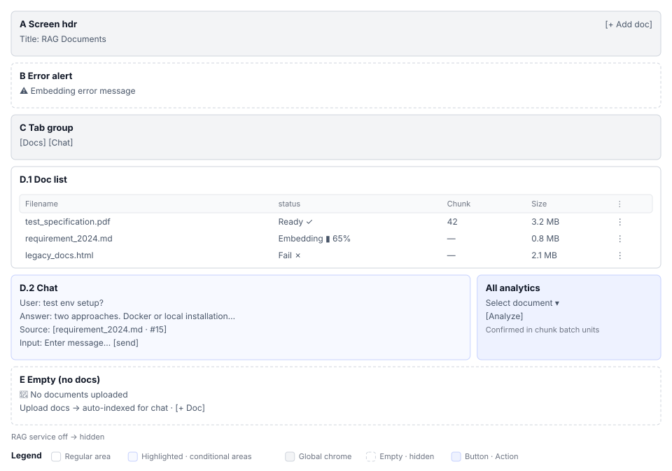

# RAG Documents (S9) Screen Definition

> Screen ID **S9** · Parent document: [`EN-S9-Workflow.md`](EN-S9-Workflow.md)
> Routes: `/projects/{projectId}/rag`
> Captures (manual `images/`): `55_rag.png`

---

## 1. Screen composition

| Area | Name | Role |
|---|---|---|
| **A** | Screen header | Title `RAG Documents` + `[+ Add document]` |
| **B** | Error notification | Upload and query failure messages |
| **C** | Tab group | `Document Management` / `Chat` — conditional visibility (RAG availability) |
| **D.1** | Document list panel (tab 1) | Table. Status, chunks, file size, actions |
| **D.2** | Chat panel (tab 2) | Conversation history + input field + analysis button |
| **E** | Empty state | Guidance when no documents + upload prompt |
| **F** | Document row menu | `⋮` → `Remove from list` / `Reindex` |
| **G** | File upload dialog | File selection + drag-and-drop |
| **H** | Analysis modal | Cost estimate → batch confirmation → summary save |
| **I** | Chat citation display | Chunk citation link + preview |

If RAG service is inactive (`RAG available = false`), the tabs do not exist.

---

## 2. Area-by-area element definition

### 2.1 A. Screen header

| Element | Display | Behavior | Permission |
|---|---|---|---|
| Title | `RAG Documents` — `subtitle1`, 600 weight | — | Everyone |
| `[+ Add document]` | `contained`, `small`, `+` icon | Open dialog G | Edit permission |

### 2.2 B. Error notification

Show `Alert severity="error"` on list query, upload, or analysis failure.

### 2.3 C. Tab group

| Tab | Render condition |
|---|---|
| Document Management | Always |
| Chat | Always |

Tabs are fixed at two, so index recalculation not needed.

⚠ **Needs verification.** Whether analysis feature is a tab or modal (current design is modal). If modal, not included in tab count.

### 2.4 D.1 Document list panel

Tab 0 content. Table format.

| # | Column | Display rule |
|---|---|---|
| 1 | File name | Click to preview/download |
| 2 | Status | `Pending` `Embedding (N%)` `Ready` `Failed` |
| 3 | Chunk count | Number. Show only when status is `Ready` |
| 4 | File size | Format `1.2 MB` |
| 5 | `⋮` menu | See F |

**Status display rules**

| Status | Visual |
|---|---|
| `Pending` | Gray progress indicator 20px |
| `Embedding` | Blue progress bar (%) 3-second polling |
| `Ready` | Green checkmark |
| `Failed` | Red `[Retry]` button inline |

### 2.5 D.2 Chat panel

Content shown when the Chat tab is selected.

| Area | Content |
|---|---|
| **Message list** | Conversation history (scrollable, newest at bottom) |
| **User message** | Black background, right-aligned |
| **Bot response** | White background, left-aligned, includes citation links |
| **Input field** | Text field + `[Send]` button |
| **Analysis section** | Document select + `[Start analysis]` button (goes to H) |

### 2.6 E. Empty state

State when no documents are uploaded.

| Element | Content |
|---|---|
| Icon | 64px document, faded color |
| Title | `No documents uploaded` |
| Guidance | `Upload project knowledge as documents to automatically index and reference in chat.` |
| Button | `[Add document]` — only when user has permission |

### 2.7 F. Document row menu

Menu opens at the position clicked on the card.

| Item | Icon | Color | Behavior |
|---|---|---|---|
| Reindex | Refresh | Default | Re-analyze document |
| Remove from list | Trash | `error.main` | Show confirmation dialog → delete |

### 2.8 G. File upload dialog

Width `md`. Supports file selection and drag-and-drop.

| Element | Display |
|---|---|
| Title | `Add document` |
| Allowed extensions | `.pdf,.md,.html,.jpg,.png` |
| Drop area | Dashed border, icon + guidance |
| File input | `hidden input[type="file"]` |
| Cancel/Save | Buttons. Disabled during upload |

**Drop area guidance**

> `Drop files here or click to select`
> `Supported: PDF, Markdown, HTML, JPG, PNG (max OOO MB)`

⚠ **Needs verification.** Maximum file size limit value.

### 2.9 H. Analysis modal

Three-step workflow.

| Step | Title | Elements |
|---|---|---|
| **1. Cost estimate** | `Verify analysis cost` | Document select + token count + USD display |
| — | — | `[Cancel]` `[Continue]` |
| **2. In progress** | `Analysis in progress…` | Per-batch status (10 chunks per batch) pause option |
| — | — | `[Pause]` |
| **3. Complete** | `Analysis complete` | Summary text area (auto-save option) + save button |

### 2.10 I. Chat citation display

Source citation shown with responses.

| Element | Display | Behavior |
|---|---|---|
| Chunk number | `[Document name #123]` hyperlink | Preview popover or new tab |
| Preview | Chunk source + file name + location | Show on hover |

---

## 3. Screen states

### 3.1 Zero documents

Show empty state E. Tab C is rendered but table D.1 is empty.

### 3.2 Embedding in progress

Show progress indicator in table D.1. Poll every 3 seconds. Other documents remain interactive.

### 3.3 Embedding failed

Status `Failed` row shows `[Retry]` button. Click to call reanalyze API.

### 3.4 Chat first load

Show empty message list in D.2. Input field active only.

### 3.5 Analysis batch confirmation in progress

Step 2 of modal H. Show per-batch completion, in-progress, error statuses. `[Pause]` button active.

### 3.6 Service inactive

Tab C does not exist. RAG tab missing from S2 workspace tab list.

---

## 4. Sample data

### Document list (3 items)

| File name | Status | Chunk count | Size | Note |
|---|---|---|---|---|
| `test_specification.pdf` | Ready ✓ | 42 | 3.2 MB | Test specification |
| `requirement_2024.md` | Embedding ▮ 65% | — | 0.8 MB | In progress |
| `legacy_docs.html` | Failed ✗ | — | 2.1 MB | Retry available |

### Chat conversation example

> **User**: How do I set up the test environment?
> **Bot**: The test environment can be set up two ways:
> 1. Using Docker container (recommended)
> 2. Local installation
>
> See [requirement_2024.md #15] for details.

---

## 5. Permission-based screen differences

### 5.1 Features × role

| Feature | PM LEAD DEVELOPER | CONTRIBUTOR | TESTER VIEWER |
|---|---|---|---|
| Document upload | ○ | ○ | — |
| Document delete, reindex | ○ | ○ | — |
| Chat | ○ | ○ | ○ |
| Start analysis | ○ | ○ | — |
| Save summary | ○ | ○ | ○ |

### 5.2 Element visibility per role

| Element | Visibility condition |
|---|---|
| `[+ Add document]` | Edit permission |
| Document row `⋮` menu | Edit permission |
| `[Start analysis]` button | Edit permission |
| Chat input | `hasReadAccess` |

---

## 6. Screen copy standards

| Text | Location |
|---|---|
| `RAG Documents` | Header title |
| `+ Add document` | A. Header button |
| `Drop files here or click to select` | G. Upload dialog |
| `No documents uploaded` | E. Empty state title |
| `Embedding…` | Status display |
| `Ready` | Status (green) |
| `Failed` | Status (red) |

---

## 7. Requirement 04 mapping

| REQ-ID | Screen element | Section |
|---|---|---|
| S9-01 | Tab group (C) no tabs when service inactive | Section 1, 3.6 |
| S9-02 | Document list (D.1) upload dialog (G) | Section 2.4, 2.8 |
| S9-03 | Status polling progress display | Section 2.4, 3.2 |
| S9-04 | Menu (F) deletion confirmation | Section 2.7 |
| S9-05 | Chat panel (D.2) | Section 2.5, 3.4 |
| S9-06 | Citation display (I) | Section 2.10 |
| S9-07 | Analysis modal (H) | Section 2.9, 3.5 |
| S9-08 | Cost display batch confirmation | Section 2.9 |
| S9-09 | Permission visibility (section 5) | Section 5 |
| S9-10 | S4 case field integration (external) | EN-S9-Workflow section 3.4 |
